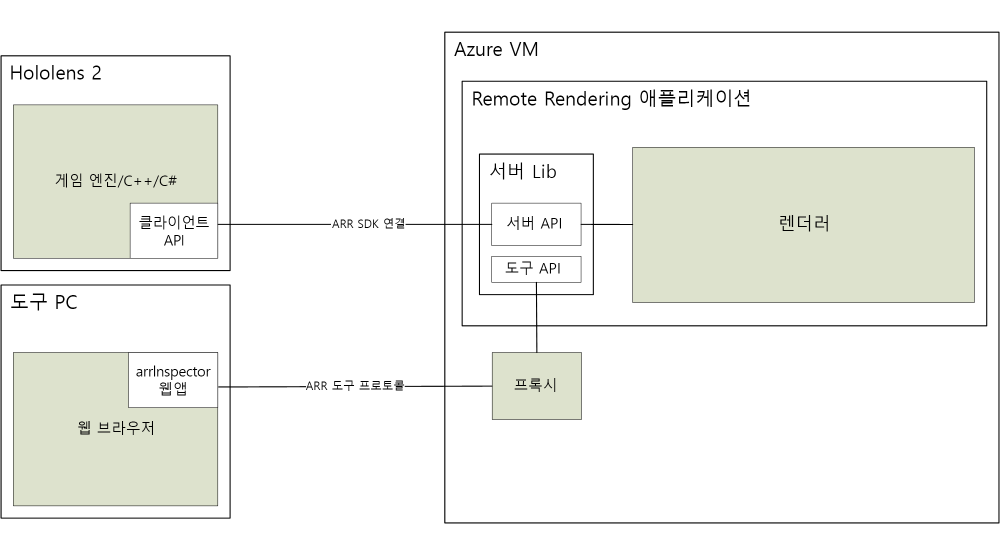

# Azure Remote Rendering 정보

> [!IMPORTANT]
> **Azure Remote Rendering**은 현재 공개 미리 보기로 제공됩니다.
> 이 미리 보기 버전은 서비스 수준 계약 없이 제공되며 프로덕션 워크로드에는 사용하지 않는 것이 좋습니다. 특정 기능이 지원되지 않거나 기능이 제한될 수 있습니다. 자세한 내용은 [Microsoft Azure Preview에 대한 추가 사용 약관](https://azure.microsoft.com/support/legal/preview-supplemental-terms/)을 참조하세요.

*ARR(Azure Remote Rendering)* 은 클라우드에서 고품질의 대화형 3D 콘텐츠를 렌더링하고 HoloLens 2와 같은 디바이스에서 실시간으로 스트리밍할 수 있는 서비스입니다.

테더링되지 않은 디바이스는 복잡한 모델을 렌더링하는 컴퓨팅 성능이 제한적입니다. 하지만 많은 애플리케이션에서는 어떤 형태로든 시각적 충실도를 낮추는 것이 용납되지 않습니다. 다음 스크린샷에서는 일반적인 콘텐츠 생성 도구를 사용하여 손상된 모델과 전체 정보가 있는 모델을 비교합니다.

축소된 모델은 원래 모델의 1800만 개가 넘는 삼각형에 비해 약 20만 개 삼각형(자세한 내부 부분 포함)으로 구성됩니다.

*원격 렌더링*은 렌더링 워크로드를 클라우드의 고성능 GPU로 이동하여 이 문제를 해결합니다. 클라우드에 호스팅되는 그래픽 엔진은 이미지를 렌더링하고, 비디오 스트림으로 인코딩하고, 대상 디바이스로 스트리밍합니다.

## 하이브리드 렌더링

대부분의 애플리케이션에서는 복잡한 모델을 렌더링하는 것만으로는 충분하지 않습니다. 사용자에게 기능을 제공하는 사용자 지정 UI도 필요합니다. Azure Remote Rendering은 전용 UI 프레임워크를 사용하도록 강제하지 않으며, 그 대신 *하이브리드 렌더링*을 지원합니다. 즉, [MRTK](https://microsoft.github.io/MixedRealityToolkit-Unity/Documentation/GettingStartedWithTheMRTK.html) 등의 선호하는 방법을 사용하여 디바이스에서 요소를 렌더링할 수 있습니다.

프레임이 끝나면 Azure Remote Rendering은 로컬로 렌더링된 콘텐츠를 원격 이미지와 자동으로 결합합니다. 올바른 폐색을 사용하여 이 작업을 수행할 수도 있습니다.

## 다중 GPU 렌더링

일부 모델은 고급 GPU를 사용하여 대화형 프레임 속도로 렌더링하기에도 너무 복잡합니다. 특히 산업 시각화에서 이 문제가 자주 발생합니다. Azure Remote Rendering은 워크로드를 여러 GPU에 분산하여 제한을 넓힐 수 있습니다. 그 결과는 단일 이미지로 병합되며, 프로세스가 사용자에게 완전히 투명하게 공개됩니다.

## 고급 아키텍처

다음 다이어그램은 원격 렌더링 아키텍처를 보여줍니다.

이미지 생성의 전체 주기에는 다음 단계가 포함됩니다.

1. 클라이언트 측: 프레임 설정
    1. 사용자의 코드: 사용자 입력을 처리하고 장면 그래프를 업데이트
    1. ARR 코드: 장면 그래프를 업데이트하고 예상 헤드 포즈를 서버로 전송
1. 서버 측: 원격 렌더링
    1. 렌더링 엔진이 사용 가능한 GPU에 렌더링 분산
    1. 여러 GPU의 출력이 단일 이미지로 구성
    1. 이미지를 비디오 스트림으로 인코딩하여 클라이언트에 다시 전송
1. 클라이언트 측: 마무리
    1. 사용자의 코드: 선택적 로컬 콘텐츠(UI, 표식 등)를 렌더링
    1. ARR 코드: '현재' 로컬로 렌더링된 콘텐츠가 비디오 스트림과 자동으로 병합

가장 중요한 문제는 네트워크 대기 시간입니다. 요청을 보내고 결과를 받는 데 걸리는 시간이 일반적으로 대화형 프레임 속도에 비해 너무 깁니다. 따라서 언제든지 두 개 이상의 프레임이 사용 중일 수 있습니다.

## 다음 단계

* [시스템 요구 사항](system-requirements.md)
* [빠른 시작: Unity를 사용하여 모델 렌더링](../quickstarts/render-model.md)
