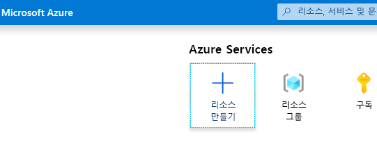
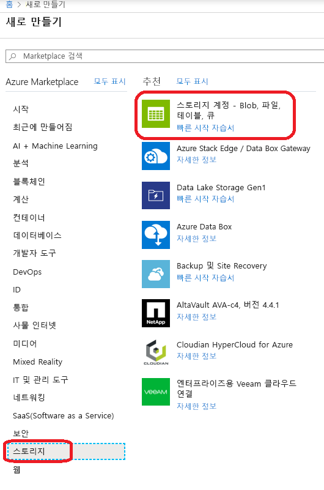
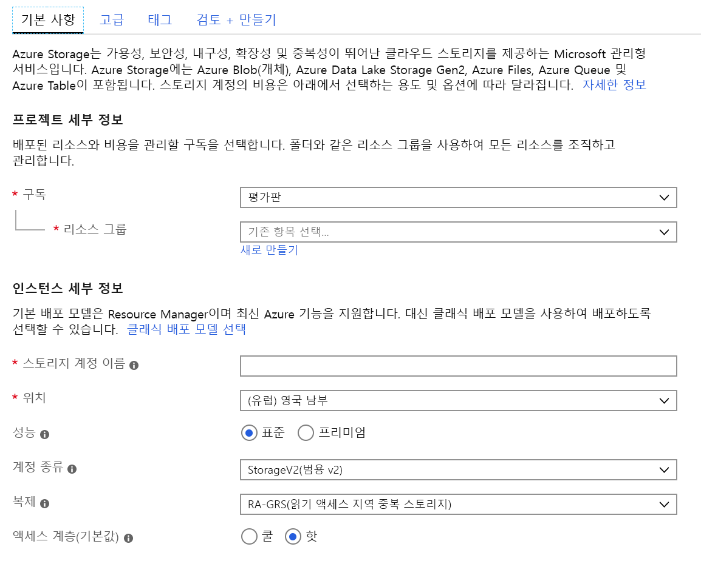
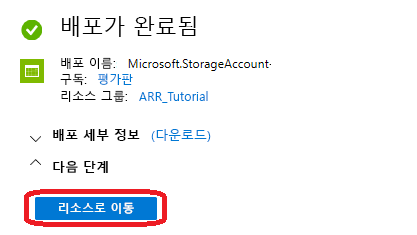
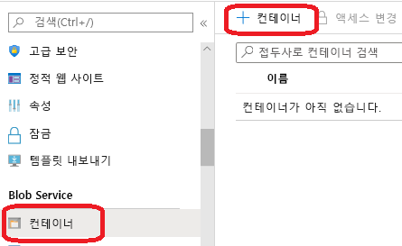
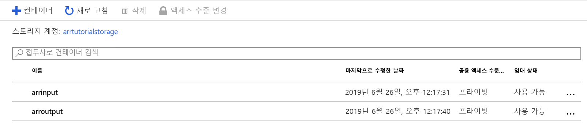
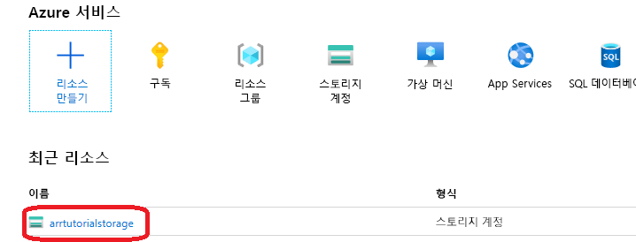
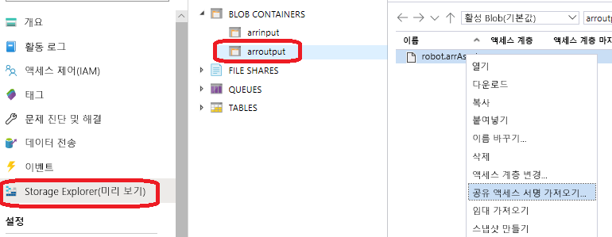

# <a name="quickstart-convert-a-model-for-rendering"></a>빠른 시작: 렌더링을 위해 모델 변환

[빠른 시작: Unity를 사용하여 모델 렌더링](render-model.md)에서 Unity 샘플 프로젝트를 사용하여 기본 제공 모델을 렌더링하는 방법을 알아보았습니다. 이 가이드에서는 사용자 고유의 모델을 변환하는 방법을 보여 줍니다.

이 문서에서 배울 내용은 다음과 같습니다.

> [!div class="checklist"]
>
> * 입력 및 출력을 위한 Azure Blob 스토리지 계정 설정
> * Azure Remote Rendering에서 사용할 3D 모델 업로드 및 변환
> * 렌더링을 위해 애플리케이션에 변환된 3D 모델 포함

## <a name="prerequisites"></a>필수 구성 요소

* [빠른 시작: Unity를 사용하여 모델 렌더링](render-model.md) 완료
* Azure PowerShell 설치[(설명서)](https://docs.microsoft.com/powershell/azure/)
  * 관리자 권한으로 PowerShell을 엽니다.
  * `Install-Module -Name Az -AllowClobber`를 실행합니다.

## <a name="overview"></a>개요

서버의 렌더러는 FBX 또는 GLTF와 같은 원본 모델 형식을 직접 사용할 수 없습니다. 대신 모델이 독점적인 이진 형식이어야 합니다.
변환 서비스는 Azure Blob 스토리지의 모델을 사용하고, 변환된 모델을 제공된 Azure Blob 스토리지 컨테이너에 다시 씁니다.

다음 작업을 수행해야 합니다.

* Azure 구독
* 구독의 'StorageV2' 계정
* 입력 모델용 Blob 스토리지 컨테이너
* 출력 데이터용 Blob 스토리지 컨테이너
* 변환할 모델 - [샘플 모델 참조](../samples/sample-model.md)
  * [지원되는 원본 형식](../how-tos/conversion/model-conversion.md#supported-source-formats) 목록을 참조합니다.
  * 변환 스크립트 샘플을 사용하려면 모델 및 모든 외부 종속성(예: 외부 텍스처 또는 기하 도형)이 포함된 입력 폴더를 준비해야 합니다.

## <a name="azure-setup"></a>Azure 설정

계정이 아직 없는 경우 [https://azure.microsoft.com/get-started/](https://azure.microsoft.com/get-started/)으로 이동하여 체험 계정 옵션을 클릭하고, 지침을 따릅니다.

Azure 계정이 있는 경우 [https://ms.portal.azure.com/#home](https://ms.portal.azure.com/#home)으로 이동합니다.

### <a name="storage-account-creation"></a>스토리지 계정 만들기

Blob 스토리지를 만들려면 먼저 스토리지 계정이 필요합니다.
하나를 만들려면 "리소스 만들기" 단추를 클릭합니다.



새 화면의 왼쪽에서 **스토리지**를 선택하고, 다음 열에서 **스토리지 계정 - Blob, 파일, 테이블, 큐**를 선택합니다.



이 단추를 클릭하면 작성할 스토리지 속성이 있는 다음 화면이 표시됩니다.



다음과 같은 방법으로 양식을 작성합니다.

* 드롭다운 상자 아래의 링크에서 새 리소스 그룹을 만들고, **ARR_Tutorial**이라는 이름으로 지정합니다.
* **스토리지 계정 이름**에는 고유한 이름을 입력합니다. **이 이름은 전역적으로 고유해야 합니다.** 그렇지 않으면 이름이 이미 사용되었음을 알리는 메시지가 표시됩니다. 이 빠른 시작의 범위에서는 **arrtutorialstorage**라는 이름으로 지정되었습니다. 이에 따라 이 빠른 시작에서 수행되는 모든 작업을 위해 사용자 이름으로 바꿔야 합니다.
* 가까운 **위치**를 선택합니다. 다른 빠른 시작에서 렌더링을 설정하는 데 사용한 것과 동일한 위치를 사용하는 것이 좋습니다.
* **성능**을 '표준'으로 설정
* **계정 종류**를 'StorageV2(범용 v2)'로 설정
* **복제**를 'RA-GRS(읽기 액세스 지역 중복 스토리지)'로 설정
* **액세스 계층**을 'Hot'으로 설정합니다.

다른 탭의 속성을 변경할 필요가 없으므로 **"검토 + 만들기"** 로 진행한 다음, 단계에 따라 설정을 완료할 수 있습니다.

이제 웹 사이트에서 배포 진행 상황을 알려주고, 결국에는 "배포가 완료됨"이라고 보고합니다. **"리소스로 이동"** 단추를 클릭하여 다음 단계를 수행합니다.



### <a name="blob-storage-creation"></a>Blob 스토리지 만들기

다음으로, 입력 및 출력을 위한 두 개의 Blob 컨테이너가 필요합니다.

위의 **"리소스로 이동"** 단추에서 목록 메뉴가 포함된 패널이 왼쪽에 있는 페이지로 이동합니다. **"Blob service"** 범주 아래의 해당 목록에서 **"컨테이너"** 단추를 클릭합니다.



**"+ 컨테이너"** 단추를 눌러 **입력** Blob 스토리지 컨테이너를 만듭니다.
만들 때 다음 설정을 사용합니다.
  
* 이름 = arrinput
* 퍼블릭 액세스 수준 = 프라이빗

컨테이너가 만들어지면 **+ 컨테이너**를 다시 클릭하고, **출력** 컨테이너에 대해 다음 설정을 사용하여 반복합니다.

* 이름 = arroutput
* 퍼블릭 액세스 수준 = 프라이빗

이제 두 개의 Blob 스토리지 컨테이너가 있습니다.



## <a name="run-the-conversion"></a>변환 실행

자산 전환 서비스를 더 쉽게 호출할 수 있도록 유틸리티 스크립트가 제공됩니다. 이는 *Scripts* 폴더에 있으며 **Conversion.ps1**이라고 합니다.

특히, 이 스크립트는 다음을 수행합니다.

1. 지정된 디렉터리의 모든 파일을 로컬 디스크에서 입력 스토리지 컨테이너로 업로드합니다.
1. 입력 스토리지 컨테이너에서 데이터를 검색하고 변환을 시작하여 변환 ID를 반환하는 [자산 변환 REST API](../how-tos/conversion/conversion-rest-api.md)를 호출합니다.
1. 변환 프로세스가 성공 또는 실패로 종료될 때까지 검색된 변환 ID를 사용하여 변환 상태 API를 폴링합니다.
1. 출력 스토리지에서 변환된 자산에 대한 링크를 검색합니다.

스크립트는 *Scripts\arrconfig.json* 파일에서 해당 구성을 읽습니다. 텍스트 편집기에서 JSON 파일을 엽니다.

```json
{
    "accountSettings": {
        "arrAccountId": "8*******-****-****-****-*********d7e",
        "arrAccountKey": "R***************************************l04=",
        "region": "<your-region>"
    },
    "renderingSessionSettings": {
        "vmSize": "standard",
        "maxLeaseTime": "1:00:00"
    },
    "assetConversionSettings": {
        "localAssetDirectoryPath": "D:\\tmp\\robot",
        "resourceGroup": "ARR_Tutorial",
        "storageAccountName": "arrexamplestorage",
        "blobInputContainerName": "arrinput",
        "inputFolderPath": "robotConversion",
        "inputAssetPath": "robot.fbx",
        "blobOutputContainerName": "arroutput",
        "outputFolderPath":"converted/robot",
        "outputAssetFileName": "robot.arrAsset"
    }
}
```

**accountSettings** 그룹(계정 ID 및 키) 내의 구성은 [Unity를 사용하여 모델 렌더링 빠른 시작](render-model.md)의 자격 증명과 비슷하게 작성해야 합니다.

**assetConversionSettings** 그룹 내에서 **resourceGroup**, **blobInputContainerName** 및 **blobOutputContainerName**을 위에서 표시한 대로 변경해야 합니다.
**arrtutorialstorage** 값은 스토리지 계정을 만드는 중에 선택한 고유 이름으로 바꿔야 합니다.

변환하려는 모델이 포함된 디스크의 디렉터리를 가리키도록 **localAssetDirectoryPath**를 변경합니다. 경로에서 이중 백슬래시("\\\\")를 사용하여 백슬래시("\\")를 적절히 이스케이프해야 합니다.

**localAssetDirectoryPath**에 지정된 경로의 모든 데이터는 **inputFolderPath**에서 지정된 하위 경로 아래에 있는 **blobInputContainerName** Blob 컨테이너에 업로드됩니다. 따라서 위의 예제 구성에서 "D:\\tmp\\robot" 디렉터리의 콘텐츠는 "robotConversion" 경로 아래에 있는 "arrtutorialstorage" 스토리지 계정의 "arrinput" Blob 컨테이너에 업로드됩니다. 이미 있는 기존 파일을 덮어씁니다.

**inputAssetPath**를 변환할 모델의 경로로 변경합니다. 이 경로는 localAssetDirectoryPath를 기준으로 하는 상대 경로입니다. 경로 구분 기호로 "\\" 대신 "/"를 사용합니다. 따라서 "D:\\tmp\\robot"에 직접 배치된 "robot.fbx" 파일의 경우 "robot.fbx"를 사용합니다.

모델이 변환되면 **blobOutputContainerName**에 지정된 스토리지 컨테이너에 다시 씁니다. 하위 경로는 선택적인 **outputFolderPath**를 제공하여 지정할 수 있습니다. 위의 예제에서 결과 "robot.arrAsset"은 "converted/robot" 아래의 출력 Blob 컨테이너에 복사됩니다.

**outputAssetFileName** 구성 설정에 따라 변환된 자산의 이름이 결정됩니다. 매개 변수는 선택적이며, 출력 파일 이름은 입력 파일 이름에서 추론됩니다.

PowerShell을 열고, [사전 요구 사항](#prerequisites)에서 설명한 대로 *Azure PowerShell*을 설치했는지 확인합니다. 그런 다음, 다음 명령을 사용하여 구독에 로그인하고, 화면의 지시를 따릅니다.

```PowerShell
Connect-AzAccount
```

> [!NOTE]
> 조직에 둘 이상의 구독이 있는 경우 SubscriptionId 및 Tenant 인수를 지정해야 할 수 있습니다. [Connect-AzAccount 설명서](https://docs.microsoft.com/powershell/module/az.accounts/connect-azaccount)에서 세부 정보를 확인하세요.

`azure-remote-rendering\Scripts` 디렉터리로 변경하고, 변환 스크립트를 실행합니다.

```PowerShell
.\Conversion.ps1 -UseContainerSas
```

다음과 유사한 결과가 표시됩니다. 

## <a name="insert-new-model-into-quickstart-sample-app"></a>빠른 시작 샘플 앱에 새 모델 삽입

변환 스크립트는 변환된 모델에 대한 *SAS(공유 액세스 서명)* URI를 생성합니다. 이제 이 URI를 **Model Name(모델 이름)** 으로 빠른 시작 샘플 앱에 복사할 수 있습니다([빠른 시작: Unity를 사용하여 모델 렌더링](render-model.md) 참조).


 이제 샘플에서 사용자 지정 모델을 로드하고 렌더링합니다!

## <a name="optional-re-creating-a-sas-uri"></a>선택 사항: SAS URI 다시 만들기

변환 스크립트에서 만든 SAS URI는 24시간 동안만 유효합니다. 그러나 만료된 후에는 모델을 다시 변환할 필요가 없습니다. 대신, 다음 단계에서 설명한 대로 포털에서 새 SAS를 만들 수 있습니다.

1. [Azure Portal](https://www.portal.azure.com)로 이동
1. **스토리지 계정** 리소스를 클릭합니다. 
1. 다음 화면의 왼쪽 패널에서 **Storage Explorer**를 클릭하고, *arroutput* Blob 스토리지 컨테이너에서 출력 모델( *.arrAsset* 파일)을 찾습니다. 마우스 오른쪽 단추로 파일을 클릭하고, 상황에 맞는 메뉴에서 **공유 액세스 서명 가져오기**를 선택합니다. 
1. 만료 날짜를 선택할 수 있는 새 화면이 열립니다. **만들기**를 누르고, 다음 대화 상자에 표시된 URI를 복사합니다. 이 새 URI는 스크립트에서 만든 임시 URI를 대체합니다.

## <a name="next-steps"></a>다음 단계

이제 기본 사항을 알고 있으므로 더 심층적인 지식을 얻기 위해 자습서를 자세히 살펴봅니다.

모델 변환에 대한 자세한 내용을 알아보려면 [모델 변환 REST API](../how-tos/conversion/conversion-rest-api.md)를 확인하세요.

> [!div class="nextstepaction"]
> [자습서: 원격으로 렌더링된 모델 보기](../tutorials/unity/view-remote-models/view-remote-models.md)
