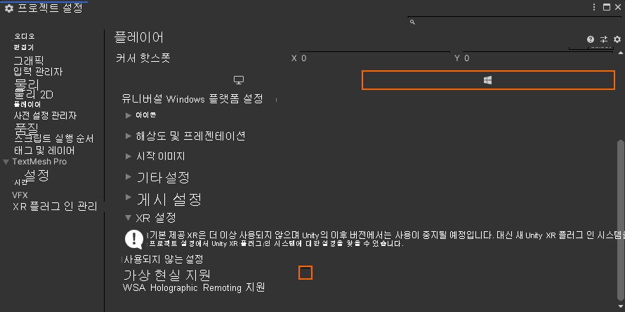
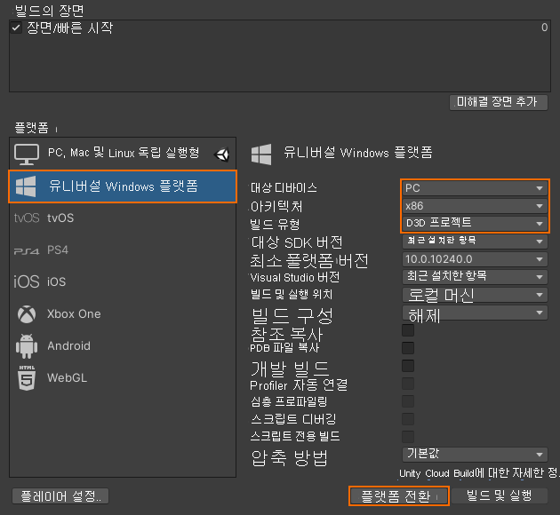
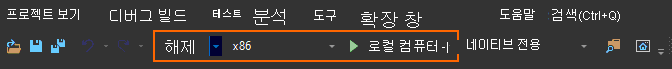

# 빠른 시작: 데스크톱에 Unity 샘플 배포

이 빠른 시작에서는 Unity용 빠른 시작 샘플 앱을 데스크톱 PC에 배포하고 실행하는 방법을 다룹니다.

이 빠른 시작에서 다음을 수행하는 방법을 알아봅니다.

> [!div class="checklist"]
>
>* 데스크톱용 빠른 시작 샘플 앱 빌드
>* PC에 샘플 배포
>* PC에서 샘플 실행

## 사전 요구 사항

이 빠른 시작에서는 [빠른 시작: Unity를 사용하여 모델 렌더링](render-model.md)의 샘플 프로젝트를 배포합니다.

자격 증명이 장면과 함께 제대로 저장되어 있고 Unity 편집기 내에서 세션에 연결할 수 있는지 확인합니다.

## 가상 현실 지원 사용 안 함

플랫 데스크톱 앱만 현재 데스크톱에서 지원하므로 VR 지원을 사용하지 않도록 설정해야 합니다.

1. *편집 >프로젝트 설정...* 을 엽니다.
1. 왼쪽에서 **플레이어**를 선택합니다.
1. **유니버설 Windows 플랫폼 설정** 탭을 선택합니다.
1. **XR 설정**을 확장합니다.
1. **가상 현실 지원**을 사용하지 않도록 설정합니다.
    
1. *XR 설정* 위의 **게시 설정**을 확장합니다.
1. **지원 디바이스 제품군**에서 **데스크톱**이 선택되어 있는지 확인합니다.

## 샘플 프로젝트 빌드

1. *파일 > 빌드 설정*을 엽니다.
1. *플랫폼*을 **유니버설 Windows 플랫폼**(**PC 독립 실행형**도 지원되지만 여기서는 사용되지 않음)으로 변경합니다.
1. *대상 디바이스*를 **PC**로 설정합니다.
1. *아키텍처*를 **x86**로 설정합니다.
1. *빌드 형식*을 **D3D 프로젝트**로 설정합니다.
  
1. **플랫폼으로 전환**을 선택합니다.
1. **빌드**(또는 '빌드 및 실행')를 누르면 솔루션을 저장할 폴더를 선택하라는 메시지가 표시됩니다.
1. Visual Studio에서 생성된 **Quickstart.sln**을 엽니다.
1. 구성을 **Release** 및 **x86**로 변경합니다.
1. 디버거 모드를 **로컬 머신**으로 전환합니다.
  
1. 솔루션을 빌드합니다(F7).

> [!WARNING]
> **x86**을 선택해야 합니다. **x64**는 현재 지원되지 않습니다. [플랫폼 제한 사항](../reference/limits.md#platform-limitations)을 참조하세요.

## 샘플 프로젝트 시작

Visual Studio에서 디버거를 시작합니다(F5). 그러면 앱이 자동으로 PC에 배포됩니다.

샘플 앱이 시작된 다음, 새 세션을 시작해야 합니다. 잠시 후 세션이 준비되고 원격으로 렌더링된 모델이 앞에 표시됩니다.
나중에 샘플을 다시 시작하려면 지금 시작 메뉴에서 찾을 수도 있습니다.

## 다음 단계

다음 빠른 시작에서는 사용자 지정 모델을 변환하는 방법을 살펴보겠습니다.

> [!div class="nextstepaction"]
> [빠른 시작: 렌더링을 위해 모델 변환](convert-model.md)
