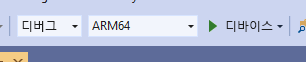

# <a name="quickstart-deploy-native-c-sample-to-hololens"></a>빠른 시작: HoloLens에 네이티브 C++ 샘플 배포

이 빠른 시작에서는 HoloLens 2에서 네이티브 C++ 자습서 애플리케이션을 배포하고 실행하는 방법을 다룹니다.

이 빠른 시작에서 다음을 수행하는 방법을 알아봅니다.

> [!div class="checklist"]
>
>* HoloLens용 자습서 애플리케이션을 빌드합니다.
>* 소스 코드의 ARR 자격 증명을 변경합니다.
>* 디바이스에서 샘플을 배포하고 실행합니다.

## <a name="prerequisites"></a>필수 구성 요소

Azure Remote Rendering 서비스에 액세스하려면 먼저 [계정을 만들어야 합니다](../../../how-tos/create-an-account.md).

다음 소프트웨어가 설치되어 있어야 합니다.

* Windows SDK 10.0.18362.0[(다운로드)](https://developer.microsoft.com/windows/downloads/windows-10-sdk)
* 최신 버전의 Visual Studio 2019[(다운로드)](https://visualstudio.microsoft.com/vs/older-downloads/)
* [혼합 현실용 Visual Studio 도구](/windows/mixed-reality/install-the-tools). 특히, 다음 *워크로드* 설치는 필수입니다.
  * **C++를 사용한 데스크톱 개발**
  * **UWP(유니버설 Windows 플랫폼) 개발**
* GIT([다운로드](https://git-scm.com/downloads))

## <a name="clone-the-arr-samples-repository"></a>ARR 샘플 리포지토리 복제

첫 번째 단계로, 퍼블릭 Azure Remote Rendering 샘플을 보관하는 Git 리포지토리를 복제합니다. 명령 프롬프트를 열고(Windows 시작 메뉴에서 `cmd` 입력) ARR 샘플 프로젝트를 저장할 디렉터리로 변경합니다.

다음 명령을 실행합니다.

```cmd
mkdir ARR
cd ARR
git clone https://github.com/Azure/azure-remote-rendering
```

마지막 명령은 Azure Remote Rendering에 사용할 다양한 샘플 프로젝트가 들어 있는 하위 디렉터리를 ARR 디렉터리에 만듭니다.

C++ Hololens 자습서는 하위 디렉터리 *NativeCpp/HoloLens*에서 찾을 수 있습니다.

## <a name="build-the-project"></a>프로젝트 빌드

Visual Studio 2019를 사용하여 *NativeCpp/HoloLens* 하위 디렉터리에 있는 *HolographicApp.sln* 솔루션 파일을 엽니다.

빌드 구성을 *디버그*(또는 *릴리스*) 및 *ARM64*로 전환합니다. 또한 디버거 모드가 *원격 머신*과는 반대로 *디바이스*로 설정되어 있는지 확인합니다.



계정 자격 증명은 자습서의 소스 코드에서 하드 코딩되므로 올바른 자격 증명으로 변경합니다. 이렇게 하려면 Visual Studio 내에서 `HolographicAppMain.cpp` 파일을 열고 `HolographicAppMain` 클래스의 생성자 내에서 프런트 엔드가 만들어지는 파트를 변경합니다.

```cpp
// 2. Create front end
{
    // Users need to fill out the following with their account data and model
    RR::AzureFrontendAccountInfo init;
    init.AccountId = "00000000-0000-0000-0000-000000000000";
    init.AccountKey = "<account key>";
    init.AccountDomain = "westus2.mixedreality.azure.com"; // <change to your region>
    m_modelURI = "builtin://Engine";
    m_sessionOverride = ""; // If there is a valid session ID to re-use, put it here. Otherwise a new one is created
    m_frontEnd = RR::ApiHandle(RR::AzureFrontend(init));
}
```

구체적으로 다음 값을 변경합니다.
* 계정 데이터를 사용할 `init.AccountId` 및 `init.AccountKey` [계정 정보 검색](../../../how-tos/create-an-account.md#retrieve-the-account-information) 방법에 대한 단락을 참조하세요.
* `westus2`가 아닌 다른 지역에 대한 `init.AccountDomain` 문자열의 지역 부분(예: `"westeurope.mixedreality.azure.com"`)
* 또한 기존 세션 ID로 `m_sessionOverride`를 변경할 수 있습니다. 이 샘플 외부에서 세션을 만들 수 있습니다. 예를 들어 [powershell 스크립트](../../../samples/powershell-example-scripts.md#script-renderingsessionps1)를 사용하거나 [세션 REST API](../../../how-tos/session-rest-api.md#create-a-session)를 직접 사용할 수 있습니다.
샘플을 여러 번 실행해야 하는 경우 샘플 외부에서 세션을 만드는 것이 좋습니다. 세션이 전달되지 않은 경우 이 샘플은 시작될 때마다 새 세션을 만듭니다. 이 세션은 몇 분 정도 걸릴 수 있습니다.

이제 애플리케이션을 컴파일할 수 있습니다.

## <a name="launch-the-application"></a>애플리케이션 시작

1. USB 케이블을 사용하여 HoloLens를 PC에 연결합니다.
1. HoloLens를 켜고 시작 메뉴가 표시될 때까지 기다립니다.
1. Visual Studio에서 디버거를 시작합니다(F5). 그러면 앱이 자동으로 디바이스에 배포됩니다.

샘플 앱이 시작되고 현재 애플리케이션 상태를 알려 주는 텍스트 패널이 표시됩니다. 시작 시간 시 상태는 새 세션을 시작하거나 기존 세션에 연결하는 중입니다. 모델 로드를 완료한 후 기본 제공 엔진 모델이 헤드 위치에 바로 표시됩니다. 폐색, 엔진 모델은 로컬로 렌더링되는 회전 큐브와 제대로 상호 작용합니다.

 나중에 샘플을 다시 시작하려면 HoloLens 시작 메뉴에서도 찾을 수 있지만 컴파일된 만료된 세션 ID가 포함됐을 수도 있습니다.

## <a name="next-steps"></a>다음 단계

이 빠른 시작은 모든 Remote Rendering 관련 부분을 주식 *Holographic 앱*에 통합하는 방법을 설명하는 자습서의 결과를 기반으로 합니다. 필요한 단계를 알아보려면 다음 자습서를 따릅니다.

> [!div class="nextstepaction"]
> [자습서: Hololens Holographic 앱에 Remote Rendering 통합](../../../tutorials/native-cpp/hololens/integrate-remote-rendering-into-holographic-app.md)