<properties
   pageTitle="Azure RemoteApp을 사용하여 모든 장치에서 Windows 앱 실행 | Microsoft Azure"
   description="Azure RemoteApp을 사용하여 사용자와 Windows 앱을 공유하는 방법을 알아봅니다."
   services="remoteapp"
   documentationCenter=""
   authors="lizap"
   manager="mbaldwin"
   editor=""/>

<tags
   ms.service="remoteapp"
   ms.devlang="na"
   ms.topic="hero-article"
   ms.tgt_pltfrm="na"
   ms.workload="compute"
   ms.date="11/05/2015"
   ms.author="elizapo"/>

# Azure RemoteApp을 사용하여 모든 장치에서 Windows 앱 실행

어디서든 모든 장치에서 Azure RemoteApp을 사용하여 지금 바로 Windows 응용 프로그램을 실행할 수 있습니다. 사용 중인 응용 프로그램이 10년 전에 작성된 사용자 지정 응용 프로그램 또는 Office 앱이든지 상관없이 더 이상 일부 응용 프로그램을 사용하기 위해 특정 운영 체제(예: Windows XP)에 묶일 필요가 없습니다.

또한 Azure RemoteApp을 사용하면 사용자의 Android 또는 Apple 장치를 사용하여 Windows 또는 Windows Phone에서와 동일한 환경을 운영할 수 있습니다. 이렇게 하려면 인터넷이 연결된 어디에서나 액세스 가능한 Azure 기반 Windows 가상 컴퓨터 컬렉션에서 Windows 응용 프로그램을 호스트합니다.

이 작업을 수행하는 방법의 예제를 보려면 계속 읽어보세요.

이 문서에서는 모든 사용자와 Access를 공유합니다. 그러나 모든 응용 프로그램을 사용할 수 있습니다. Windows Server 2012 R2 컴퓨터에 응용 프로그램을 설치할 수 있는 경우 다음 단계를 사용하여 공유할 수 있습니다. [응용 프로그램 요구 사항](remoteapp-appreqs.md)을 검토하여 응용 프로그램이 작동하는지 확인할 수 있습니다.

Access는 데이터베이스이므로 모든 사용자가 Access 데이터 공유에 액세스하여 데이터베이스를 유용하게 활용할 수 있도록 몇 가지 추가 단계를 수행해 보겠습니다. 응용 프로그램이 데이터베이스가 아니거나 사용자의 파일 공유 액세스가 필요하지 않은 경우 이 자습서에서 해당 단계를 건너뛸 수 있습니다.

[AZURE.INCLUDE [free-trial-note](../../includes/free-trial-note.md)]

## RemoteApp에서 컬렉션 만들기

먼저 컬렉션을 만듭니다. 컬렉션은 앱과 사용자에 대한 컨테이너로 사용됩니다. 각 컬렉션은 이미지를 기반으로 하며, 컬렉션을 직접 만들거나 구독과 함께 제공된 컬렉션을 사용할 수 있습니다. 이 자습서에서는 공유할 앱이 포함되어 있는 Office 2013 평가판 이미지 사용합니다.

1. Azure 포털의 왼쪽 탐색 트리에서 RemoteApp이 표시될 때까지 아래로 스크롤합니다. 해당 페이지를 엽니다.
2. **RemoteApp 컬렉션 만들기**를 클릭합니다.
3. **빠른 생성**을 클릭하고 컬렉션의 이름을 입력합니다.
4. 컬렉션을 만드는 데 사용할 지역을 선택합니다. 최상의 사용 환경을 위해 사용자가 앱에 액세스하는 위치에서 지리적으로 가장 가까운 지역을 선택합니다. 예를 들어 이 자습서에서는 사용자가 워싱턴주 레드먼드에 있습니다. 가장 가까운 Azure 지역은 **미국 서부**입니다.
5. 사용할 요금제를 선택합니다. 기본 요금제는 대형 Azure VM에서 16명의 사용자가 액세스하고, 표준 요금제는 대형 Azure VM에서 10명의 사용자가 액세스합니다. 일반적으로 기본 요금제는 데이터 입력 유형 워크플로에 적합합니다. Office와 같은 생산성 앱의 경우 표준 요금제를 사용하는 것이 좋습니다.
6. 마지막으로 Office 2013 Professional 이미지를 선택합니다. 이 이미지는 Office 2013 앱을 포함합니다. 미리 알림 - 이 이미지는 평가판 컬렉션 및 POC에만 유효합니다. 프로덕션 컬렉션에는 이 이미지를 사용할 수 없습니다.
7. 이제 **RemoteApp 컬렉션 만들기**를 클릭합니다.

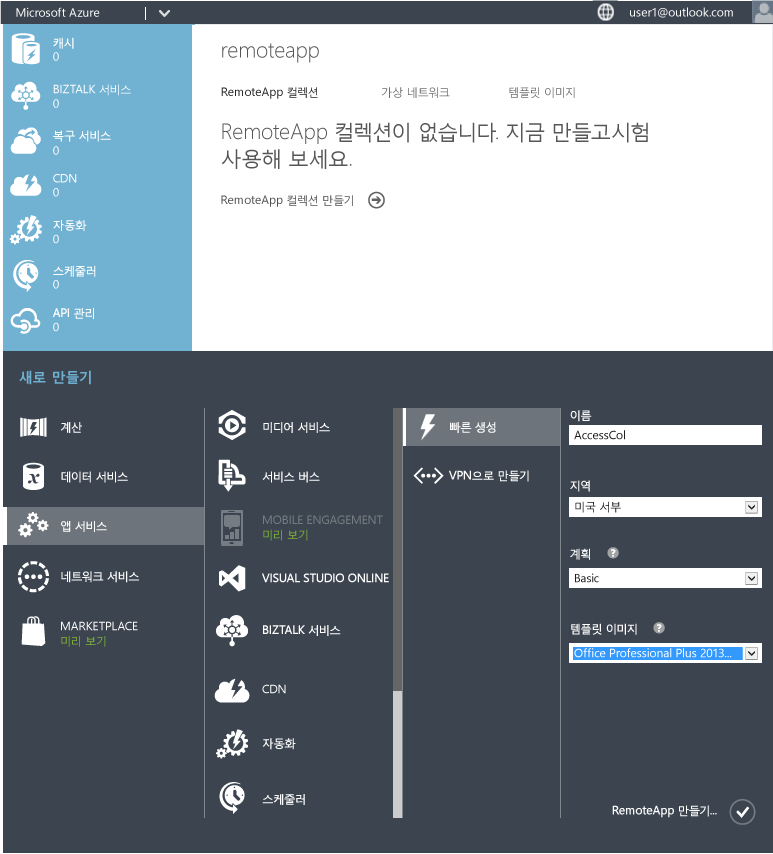

컬렉션 만들기가 시작되지만, 최대 1시간이 걸릴 수 있습니다.

이제 사용자를 추가할 준비가 되었습니다.

## 사용자와 앱 공유

컬렉션을 만든 후 사용자에게 Access를 게시하고 Access에 액세스할 사용자를 추가합니다.

컬렉션을 만드는 동안 Azure RemoteApp 노드를 벗어난 경우 Azure 홈페이지에서 노드에 다시 연결합니다.

2. 앞에서 만든 컬렉션을 클릭하여 추가 옵션에 액세스하고 컬렉션을 구성합니다. 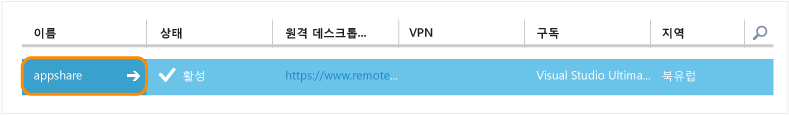
3. **게시** 탭에서 화면의 아래쪽에 있는 **게시**를 클릭한 다음 **게시 시작 메뉴 프로그램**을 클릭합니다. 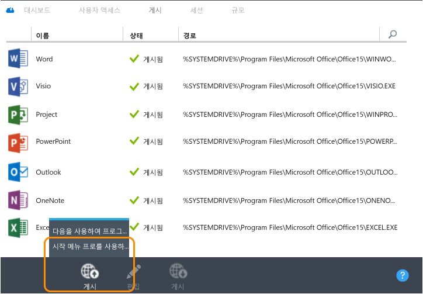
4. 목록에서 게시할 앱을 선택합니다. 여기서는 Access를 선택합니다. **완료**를 클릭합니다. 앱이 게시되는 동안 기다립니다. 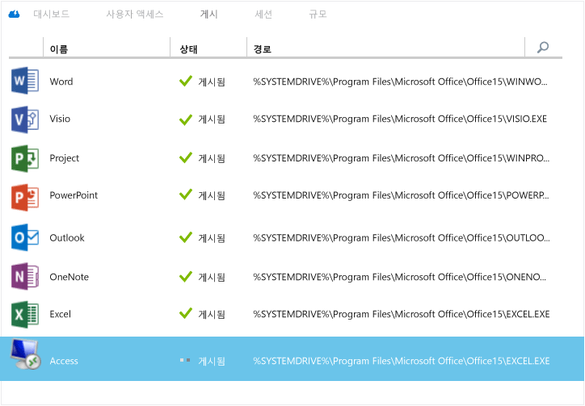

1. 앱이 게시되면 **사용자 액세스** 탭으로 이동하여 앱에 액세스해야 하는 모든 사용자를 추가합니다. 사용자의 사용자 이름(메일 주소)을 입력한 다음 **저장**을 클릭합니다.

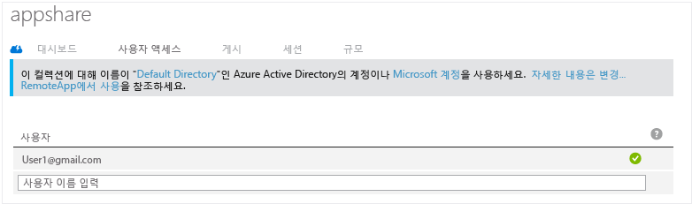

1. 이제 사용자에게 이러한 새 앱과 앱에 액세스하는 방법을 알려야 합니다. 이렇게 하려면 사용자에게 원격 데스크톱 클라이언트 다운로드 URL이 포함된 메일을 보냅니다. 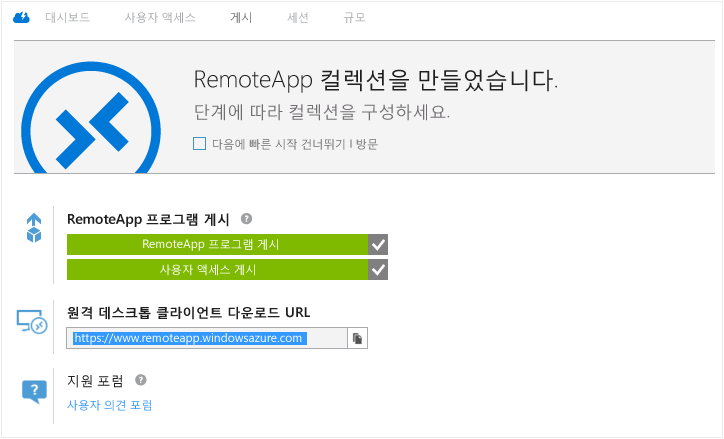

## Access에 대한 액세스 구성

일부 앱은 RemoteApp을 통해 배포한 이후에 추가 구성이 필요합니다. Access의 경우 Azure에서 사용자가 액세스할 수 있는 파일 공유를 만듭니다. 그렇게 하지 않으려면 클라우드 컬렉션 대신 [하이브리드 컬렉션](remoteapp-create-hybrid-deployment.md)을 만들어 사용자가 로컬 네트워크의 파일 및 정보에 액세스하도록 할 수 있습니다. 그런 다음 컴퓨터의 로컬 드라이브를 Azure 파일 시스템에 매핑하도록 사용자에게 지시합니다.

관리자로서 수행하는 첫 번째 부분입니다. 그런 다음 사용자를 위해 몇 가지 단계를 수행합니다.

1. 먼저 명령줄 인터페이스(cmd.exe)를 게시합니다. **게시** 탭에서 **cmd**를 선택한 다음 **게시 > Publish program using path(경로를 사용하여 프로그램 게시)**를 클릭합니다.
2. 앱의 이름과 경로를 입력합니다. 여기서는 "File Explorer"를 이름으로 사용하고 "%SYSTEMDRIVE%\\windows\\explorer.exe"를 경로로 사용합니다. 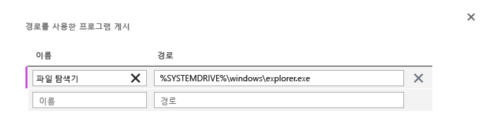
3. 이제 Azure [저장소 계정](../storage-create-storage-account.md)을 만들어야 합니다. 현재는 "accessstorage"만 지정되어 있으므로 원하는 이름을 선택하세요. Highlander를 잘못 인용하기 위해 한 개의 "accessstorage"만 사용할 수 있습니다. 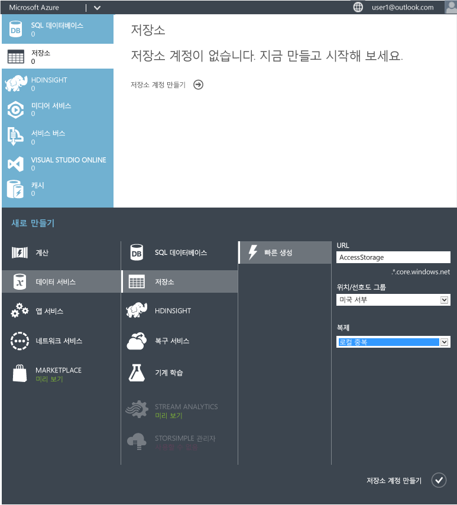
4. 이제 대시보드로 돌아가서 저장소(끝점 위치)에 대한 경로를 가져올 수 있습니다. 한 동안 이 경로를 사용할 것이므로 경로를 다른 곳에 복사해 두세요. 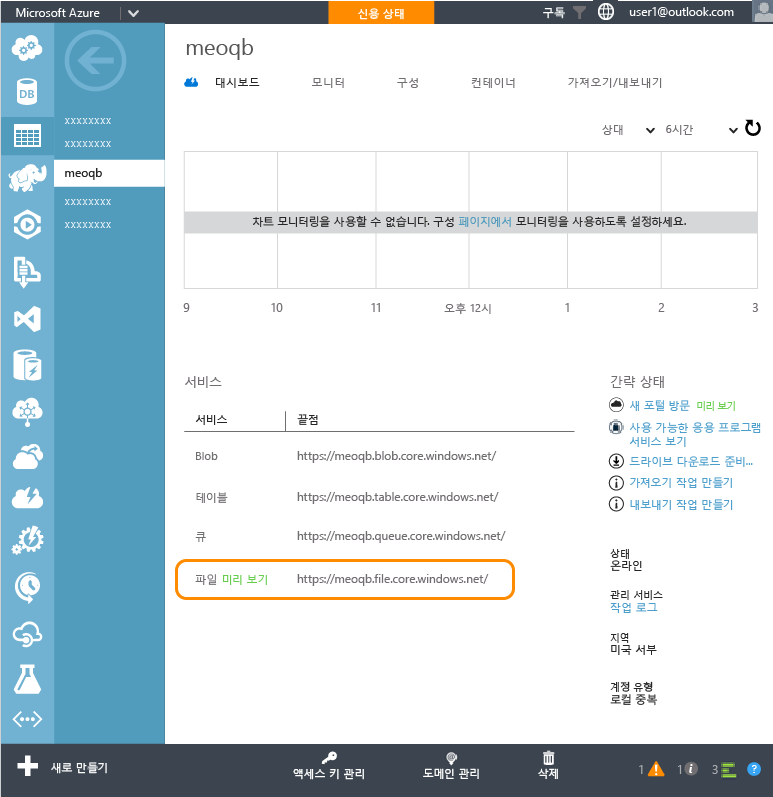
5. 저장소 계정을 만들었으므로 이제 기본 액세스 키가 필요합니다. **액세스 키 관리**를 클릭한 다음 기본 액세스 키를 복사합니다.
6. 이제 저장소 계정의 컨텍스트를 설정하고 Access에 대한 새 파일 공유를 만듭니다. 관리자 권한 Windows PowerShell 창에서 다음 cmdlet을 실행합니다.

        $ctx=New-AzureStorageContext <account name> <account key>
    	$s = New-AzureStorageShare <share name> -Context $ctx

	이 공유의 경우 다음 cmdlet을 실행합니다.

	    $ctx=New-AzureStorageContext accessstorage <key>
    	$s = New-AzureStorageShare <share name> -Context $ctx

이제 사용자의 차례입니다. 먼저 사용자가 [RemoteApp 클라이언트](remoteapp-clients.md)를 설치해야 합니다. 그런 다음 사용자는 계정의 드라이브를 개발자가 만든 Azure 파일 공유에 매핑하고 Access 파일을 추가합니다. 작업 방법은 다음과 같습니다.

1. RemoteApp 클라이언트에서 게시된 앱에 액세스합니다. cmd.exe 프로그램을 시작합니다.
2. 다음 명령을 실행하여 컴퓨터의 드라이브를 파일 공유에 매핑합니다.

		net use z: \<accountname>.file.core.windows.net<share name> /u:<user name> <account key>

	**/persistent** 매개 변수를 yes로 설정하는 경우 매핑된 드라이브는 세션 간에 유지됩니다.
1. 이제 RemoteApp에서 파일 탐색기 앱을 시작합니다. 공유 앱에서 사용할 Access 파일을 파일 공유에 복사합니다. 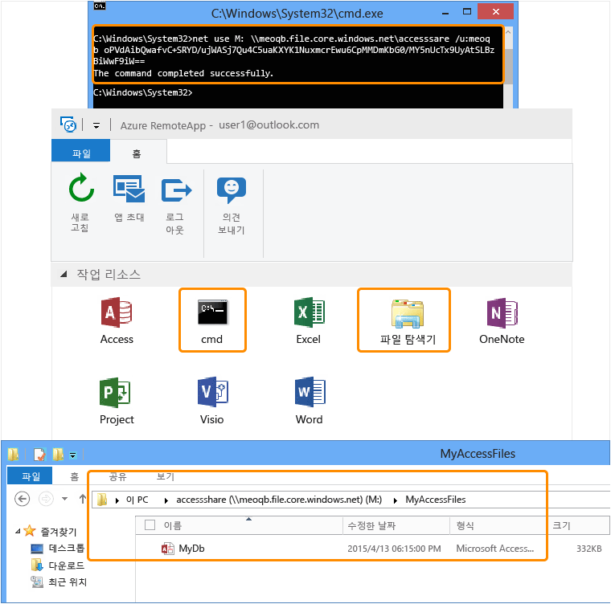
1. 마지막으로 Access를 열고 방금 공유한 데이터베이스를 엽니다. 클라우드에서 실행 중인 Access의 데이터가 표시됩니다. 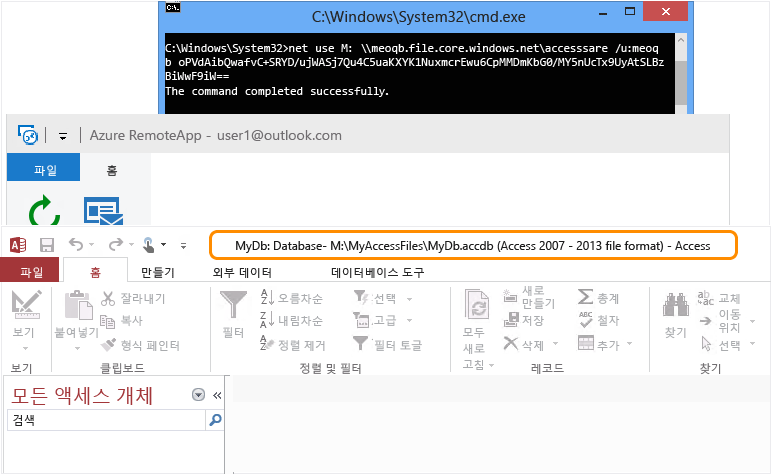

이제 RemoteApp 클라이언트를 설치한 모든 장치에서 Access를 사용할 수 있습니다.

<!--Every topic should have next steps and links to the next logical set of content to keep the customer engaged-->
## 다음 단계

지금까지 컬렉션을 만드는 방법을 살펴보았으므로 이제 [Office 365를 사용하는 컬렉션](remoteapp-tutorial-o365anywhere.md)을 만들어 보겠습니다. 또는 로컬 네트워크에 액세스할 수 있는 [하이브리드 컬렉션 ](remoteapp-create-hybrid-deployment.md)을 만들 수 있습니다.

<!--Image references-->

<!---HONumber=Nov15_HO3-->