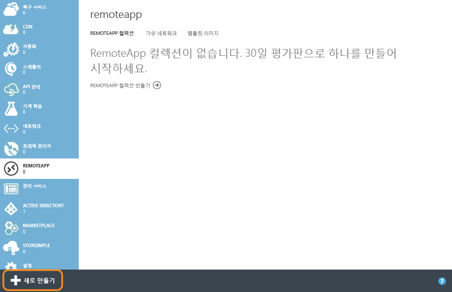
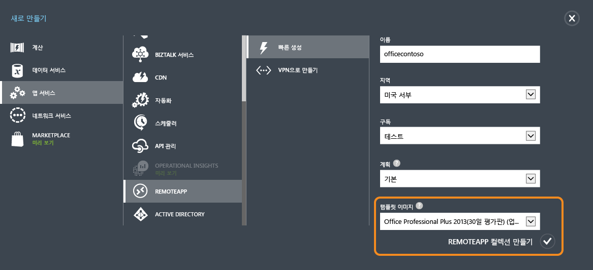
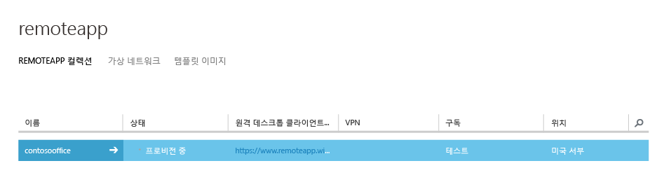
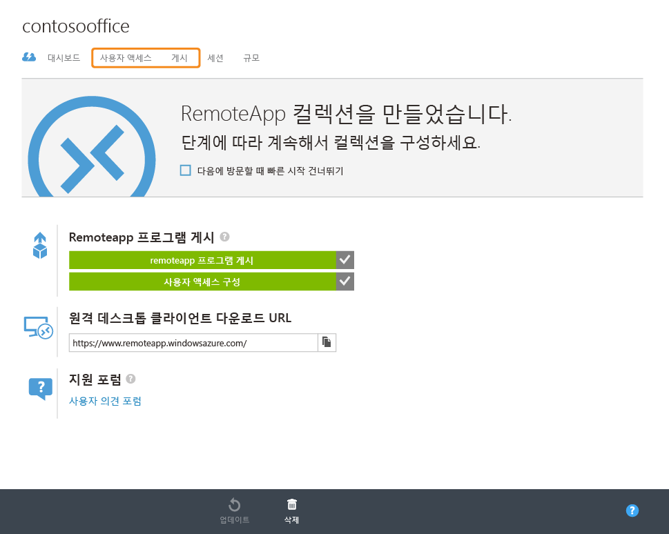
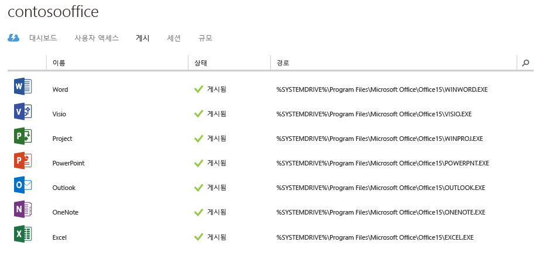
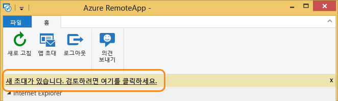
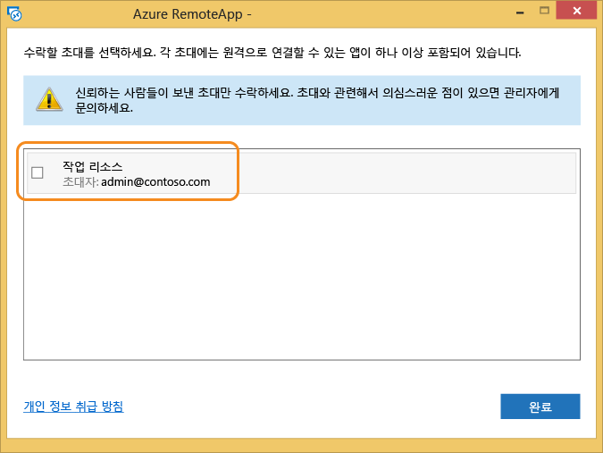
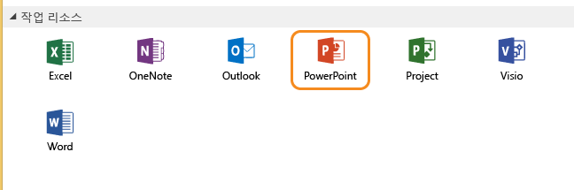
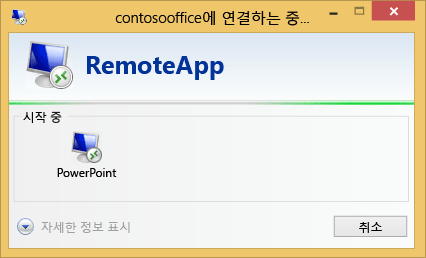
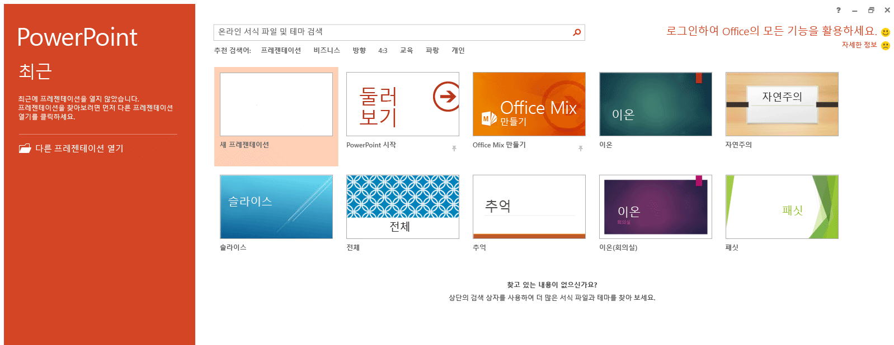

# Azure RemoteApp으로 모든 장치에서 동일한 Office 365 환경 즐기기
> [!IMPORTANT]
> Azure RemoteApp은 중단될 예정입니다. 자세한 내용은 [알림](https://go.microsoft.com/fwlink/?linkid=821148)을 읽어보세요.
> 
> 

이 문서에서는 회사의 모든 장치에서 Office 365를 배포하는 방법을 설명합니다. 사용자는 Android, Apple 및 Windows에서 동일한 기능과 UI 환경을 사용할 수 있습니다.

이를 위해 사용자가 연결할 수 있는 Azure의 확장 가능한 가상 컴퓨터에서 Office 365를 호스트하여 Azure RemoteApp을 사용하겠습니다. 이 가상 컴퓨터 집합을 "클라우드 컬렉션"이라고 합니다.

## 클라우드 컬렉션 만들기
먼저 Azure 계정을 만든 후 왼쪽에 있는 링크를 클릭하여 **RemoteApp**으로 이동합니다. 

그런 다음 아래쪽에서 **새로 만들기**를 클릭하고 컬렉션을 "빠르게 생성"합니다. 이름, 지역, 구독, 계획 및 Microsoft에서 제공하는 "Office Proffesional 2013" 이미지를 제공합니다. 

양식을 완료하면 컬렉션 만들기 프로세스가 시작됩니다. 이 작업을 수행하는 데 1시간 정도 걸릴 수 있습니다.

프로세스가 완료되면 다음과 같이 표시됩니다. **게시**를 클릭하면 대부분의 Office 응용 프로그램이 이미 게시되어 있음을 볼 수 있습니다. 

여기서 **사용자 액세스**를 클릭하여 이 컬렉션에 액세스할 수 있는 사용자를 더 추가할 수도 있습니다. 

이제 Office 365에 연결해 보겠습니다.

## Office 365에 연결
[https://www.remoteapp.windowsazure.com/](https://www.remoteapp.windowsazure.com/)을 방문하여 아래로 스크롤을 내린 다음 **클라이언트 다운로드**를 클릭하여 사용하는 장치에 Azure RemoteApp 클라이언트를 설치합니다. 아래 스크린샷은 Windows에 해당합니다.

응용 프로그램이 시작되면 Microsoft 계정(이전의 “Live ID”)을 사용하여 로그인하라는 메시지가 표시됩니다. 여기서는 Azure 계정과 동일한 ID를 사용합니다. 로그인하면 새 초대에 대한 알림이 표시됩니다. 알림을 클릭하면 아래와 같은 목록이 표시됩니다. 내 Azure 계정 소유자 전자 메일과 일치하는 초대를 수락합니다.

새 초대가 있는 경우의 모양

초대를 수락하면 Azure RemoteApp 클라이언트에 모든 Office 앱이 표시됩니다.

응용 프로그램을 클릭하면 Azure 가상 컴퓨터에서 시작되며 사용할 준비가 완료된 것입니다. 마음껏 즐기세요!

<!---HONumber=AcomDC_0817_2016-->