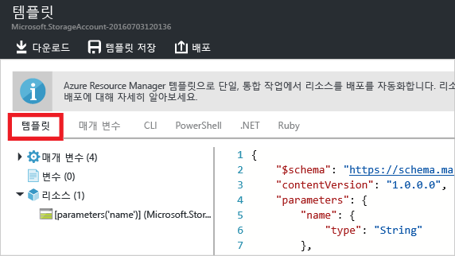

<properties
	pageTitle="Azure Resource Manager 템플릿 내보내기 | Microsoft Azure"
	description="Azure Resource Manager를 사용하여 기존 리소스 그룹에서 템플릿을 내보냅니다."
	services="azure-resource-manager"
	documentationCenter=""
	authors="tfitzmac"
	manager="timlt"
	editor="tysonn"/>

<tags
	ms.service="azure-resource-manager"
	ms.workload="multiple"
	ms.tgt_pltfrm="na"
	ms.devlang="na"
	ms.topic="get-started-article"
	ms.date="08/03/2016"
	ms.author="tomfitz"/>

# 기존 리소스에서 Azure Resource Manager 템플릿 내보내기

Resource Manager를 사용하면 구독의 기존 리소스에서 Resource Manager 템플릿을 내보낼 수 있습니다. 생성된 템플릿을 사용하여 템플릿 구문에 대해 알아보거나 필요에 따라 솔루션 재배포를 자동화할 수 있습니다.

템플릿을 내보내려면 다음과 같은 두 가지 방법이 있습니다.

- 배포에 사용된 실제 템플릿을 내보낼 수 있습니다. 내보낸 템플릿은 원본 템플릿에 나타난 대로 모든 매개 변수 및 변수를 포함합니다. 이 방법은 포털을 통해 리소스를 배포한 경우에 유용합니다. 이제 템플릿을 생성하여 이러한 리소스를 만드는 방법을 알아보려고 합니다.
- 리소스 그룹의 현재 상태를 나타내는 템플릿을 내보낼 수 있습니다. 내보낸 템플릿은 배포에 사용된 템플릿에 기초하지 않습니다. 대신 리소스 그룹의 스냅숏인 템플릿을 만듭니다. 내보낸 템플릿에는 하드 코드된 값이 많으며 일반적으로 정의된 경우와 같이 매개 변수가 많이 포함되지 않습니다. 이 방법은 포털 또는 스크립트를 통해 리소스 그룹을 수정한 경우에 유용합니다. 이제 리소스 그룹을 템플릿으로 캡처해야 합니다.

이 항목에서는 두 가지 방법을 모두 보여 줍니다. [내보낸 Azure Resource Manager 템플릿 사용자 지정](resource-manager-customize-template.md) 문서에서는 리소스 그룹의 현재 상태에서 생성된 템플릿을 사용하는 방법을 참조하고 솔루션을 다시 배포하는 데 유용하게 사용합니다.

이 자습서에서는 Azure 포털에 로그인하여 저장소 계정을 만들고 해당 저장소 계정에 대한 템플릿을 내보냅니다. 리소스 그룹을 수정하는 가상 네트워크를 추가합니다. 마지막으로 현재 상태를 나타내는 새 템플릿을 내보냅니다. 이 문서는 주로 간단한 인프라에 대해 살펴보지만 이와 동일한 단계를 사용하여 더 복잡한 솔루션의 템플릿을 내보낼 수 있습니다.

## 저장소 계정 만들기

1. [Azure 포털](https://portal.azure.com)에서 **새로 만들기** > **데이터 + 저장소** > **저장소 계정**을 차례로 선택합니다.

      

2. **저장소** 이름, 사용자의 이니셜 및 날짜로 저장소 계정을 만듭니다. 저장소 계정 이름은 Azure 내에서 고유해야 합니다. 이미 사용 중인 이름을 시도했다면 변형해 보세요. 리소스 그룹에 대해 **ExportGroup**을 사용합니다. 다른 속성에 대해서는 기본값을 사용할 수 있습니다. **만들기**를 선택합니다.

      

배포가 완료되면 구독에 저장소 계정이 포함됩니다.

## 배포 기록에서 템플릿 내보내기

1. 새 리소스 그룹의 리소스 그룹 블레이드로 이동합니다. 블레이드가 최종 배포 결과를 보여 줍니다. 이 링크를 선택합니다.

      

2. 그룹의 배포 기록을 볼 수 있습니다. 사용자의 경우에 블레이드에 하나의 배포만 나열되어 있을 것입니다. 이 배포를 선택합니다.

     

3. 블레이드에 배포 요약이 표시됩니다. 요약에는 배포 상태와 해당 작업, 매개 변수에 입력한 값이 포함됩니다. 배포에 사용된 템플릿을 보려면 **템플릿 보기**를 선택합니다.

     

4. Resource Manager는 다음 6개의 파일을 검색합니다.

   1. **템플릿** - 솔루션의 인프라를 정의하는 템플릿입니다. 포털을 통해 저장소 계정을 만들 때 Resource Manager는 템플릿을 사용하여 배포하고 나중에 참조할 수 있도록 해당 템플릿을 저장했습니다.
   2. **매개 변수** - 배포하는 동안 값을 전달하는 데 사용할 수 있는 매개 변수 파일. 여기에는 첫 번째 배포 중 입력한 값이 포함되어 있지만 템플릿을 다시 배포할 때 이러한 값을 변경할 수 있습니다.
   3. **CLI** - 템플릿 배포에 사용할 수 있는 Azure CLI(명령줄 인터페이스) 스크립트 파일.
   4. **PowerShell** - 템플릿 배포에 사용할 수 있는 Azure PowerShell 스크립트 파일.
   5. **.NET** - 템플릿 배포에 사용할 수 있는 .NET 클래스.
   6. **Ruby** - 템플릿 배포에 사용할 수 있는 Ruby 클래스.

     이러한 파일은 전체 블레이드에서 링크를 통해 사용할 수 있습니다. 기본적으로 블레이드가 템플릿을 표시합니다.

       

     템플릿에 특히 주의합니다. 템플릿은 다음과 유사하게 표시됩니다.

        {
          "$schema": "https://schema.management.azure.com/schemas/2015-01-01/deploymentTemplate.json#",
          "contentVersion": "1.0.0.0",
          "parameters": {
            "name": {
              "type": "String"
            },
            "accountType": {
              "type": "String"
            },
            "location": {
              "type": "String"
            },
            "encryptionEnabled": {
              "defaultValue": false,
              "type": "Bool"
            }
          },
          "resources": [
            {
              "type": "Microsoft.Storage/storageAccounts",
              "sku": {
                "name": "[parameters('accountType')]"
              },
              "kind": "Storage",
              "name": "[parameters('name')]",
              "apiVersion": "2016-01-01",
              "location": "[parameters('location')]",
              "properties": {
                "encryption": {
                  "services": {
                    "blob": {
                      "enabled": "[parameters('encryptionEnabled')]"
                    }
                  },
                  "keySource": "Microsoft.Storage"
                }
              }
            }
          ]
        }
 
이 템플릿은 저장소 계정을 만드는 데 사용되는 실제 템플릿입니다. 다른 유형의 저장소 계정을 배포할 수 있는 매개 변수를 포함합니다. 템플릿 구조에 대해 자세히 알아보려면 [Azure Resource Manager 템플릿 작성하기](resource-group-authoring-templates.md)를 참조하세요. 템플릿에서 사용할 수 있는 전체 함수목록은 [Azure Resource Manager 템플릿 함수](resource-group-template-functions.md)를 참조하세요.


## 가상 네트워크 추가

이전 섹션에서 다운로드한 템플릿은 원래 배포의 인프라를 나타냈습니다. 그러나 배포 이후의 변경 사항은 적용되지 않습니다. 이 문제를 설명하기 위해 포털을 통해 가상 네트워크를 추가하여 리소스 그룹을 수정하겠습니다.

1. 리소스 그룹 블레이드에서 **추가**를 선택합니다.

      

2. 사용 가능한 리소스에서 **가상 네트워크**를 선택합니다.

      

2. 가상 네트워크의 이름을 **VNET**으로 지정하고 다른 속성은 기본값을 사용합니다. **만들기**를 선택합니다.

      

3. 가상 네트워크를 리소스 그룹에 성공적으로 배포한 다음 배포 기록을 다시 확인합니다. 이제 두 개의 배포가 표시됩니다. 두 번째 배포가 표시되지 않으면 리소스 그룹 블레이드를 닫고 다시 열어야 합니다. 최근 배포를 선택합니다.

      

4. 해당 배포의 템플릿을 확인합니다. 가상 네트워크를 추가하기 위해 입력한 변경 사항만 정의되어 있습니다.

일반적으로 솔루션의 모든 인프라를 단일 작업으로 배포하는 템플릿을 사용하는 것이 가장 좋습니다. 이 방법은 배포할 여러 템플릿을 기억하는 것보다 안정적입니다.


## 리소스 그룹에서 템플릿 내보내기

각 배포에 리소스 그룹에 대해 변경한 사항만 표시되지만 템플릿을 내보내 전체 리소스 그룹의 특성을 표시할 수 있습니다.

> [AZURE.NOTE] 200개 이상의 리소스가 있는 리소스 그룹에 대한 템플릿을 내보낼 수 없습니다.

1. 리소스 그룹에 대한 템플릿을 보려면 **자동화 스크립트**를 선택합니다.

      

     모든 리소스 종류가 내보내기 템플릿 함수를 지원하지는 않습니다. 리소스 그룹에 이 문서에 표시된 저장소 계정 및 가상 네트워크만이 있는 경우 오류가 표시되지 않습니다. 그러나 다른 리소스 종류를 만든 경우 내보내기에 문제가 있다는 오류가 표시될 수 있습니다. [내보내기 문제 수정](#fix-export-issues) 섹션에서 이러한 문제를 처리하는 방법을 알아봅니다.

      

2. 이 경우에도 솔루션을 재배포하는 데 사용할 수 있는 6개의 파일이 표시되지만 템플릿이 약간 다릅니다. 이 템플릿에는 저장소 계정 이름용 및 가상 네트워크 이름용 등 2개의 매개 변수만이 있습니다.

        "parameters": {
          "virtualNetworks_VNET_name": {
            "defaultValue": "VNET",
            "type": "String"
          },
          "storageAccounts_storagetf05092016_name": {
            "defaultValue": "storagetf05092016",
            "type": "String"
          }
        },

     Resource Manager는 배포 중 사용된 템플릿을 검색하지 않았습니다. 대신 현재 리소스 구성을 기준으로 새 템플릿을 생성했습니다. 예를 들어 템플릿은 저장소 계정 위치와 복제 값은 다음으로 설정합니다.

        "location": "northeurope",
        "tags": {},
        "properties": {
            "accountType": "Standard_RAGRS"
        },

3. 로컬에서 작업할 수 있도록 템플릿을 다운로드합니다.

      

4. 다운로드한 .zip 파일을 찾고 압축을 풉니다. 다운로드한 이 템플릿을 사용하여 인프라를 다시 배포할 수 있습니다.

## 내보내기 문제 해결

모든 리소스 종류가 내보내기 템플릿 함수를 지원하지는 않습니다. Resource Manager는 중요한 데이터를 노출하지 않기 위해 일부 리소스 유형을 내보내지 않습니다. 예를 들어 사이트 구성에 연결 문자열이 있는 경우 아마도 내보낸 템플릿에서 명시적으로 표시하지 않으려 합니다. 템플릿에 누락된 리소스를 다시 수동으로 추가하여 이 문제를 해결할 수 있습니다.

> [AZURE.NOTE] 배포 기록이 아닌 리소스 그룹에서 내보낸 경우 내보내기 문제가 발생합니다. 마지막 배포가 리소스 그룹의 현재 상태를 정확하게 나타내는 경우 리소스 그룹이 아닌 배포 기록에서 템플릿을 내보내야 합니다. 단일 템플릿에서 정의되지 않은 리소스 그룹을 변경한 경우에만 리소스 그룹에서 내보냅니다.

예를 들어 사이트 구성에서 웹앱, SQL 데이터베이스 및 연결 문자열을 포함하는 리소스 그룹에 대한 템플릿을 내보내는 경우 다음과 같은 메시지가 나타납니다.


메시지를 선택하면 어떤 리소스 유형을 내보내지 않는지 정확하게 보여 줍니다.
     


이 항목에서는 다음과 같은 일반적인 수정을 보여 줍니다. 이러한 리소스를 구현하려면 템플릿에 매개 변수를 추가해야 합니다. 자세한 내용은 [내보낸 템플릿 사용자 지정 및 다시 배포](resource-manager-customize-template.md)를 참조하세요.

### 연결 문자열

웹 사이트 리소스에서 데이터베이스에 연결 문자열에 대한 정의를 추가합니다.

```
{
  "type": "Microsoft.Web/sites",
  ...
  "resources": [
    {
      "apiVersion": "2015-08-01",
      "type": "config",
      "name": "connectionstrings",
      "dependsOn": [
          "[concat('Microsoft.Web/Sites/', parameters('<site-name>'))]"
      ],
      "properties": {
          "DefaultConnection": {
            "value": "[concat('Data Source=tcp:', reference(concat('Microsoft.Sql/servers/', parameters('<database-server-name>'))).fullyQualifiedDomainName, ',1433;Initial Catalog=', parameters('<database-name>'), ';User Id=', parameters('<admin-login>'), '@', parameters('<database-server-name>'), ';Password=', parameters('<admin-password>'), ';')]",
              "type": "SQLServer"
          }
      }
    }
  ]
}
```    

### 웹 사이트 확장

웹 사이트 리소스에서 코드에 대한 정의를 추가하여 다음을 설치합니다.

```
{
  "type": "Microsoft.Web/sites",
  ...
  "resources": [
    {
      "name": "MSDeploy",
      "type": "extensions",
      "location": "[resourceGroup().location]",
      "apiVersion": "2015-08-01",
      "dependsOn": [
        "[concat('Microsoft.Web/sites/', parameters('<site-name>'))]"
      ],
      "properties": {
        "packageUri": "[concat(parameters('<artifacts-location>'), '/', parameters('<package-folder>'), '/', parameters('<package-file-name>'), parameters('<sas-token>'))]",
        "dbType": "None",
        "connectionString": "",
        "setParameters": {
          "IIS Web Application Name": "[parameters('<site-name>')]"
        }
      }
    }
  ]
}
```

### 가상 컴퓨터 확장

가상 컴퓨터 확장의 예는 [Azure Windows VM 확장 구성 샘플](./virtual-machines/virtual-machines-windows-extensions-configuration-samples.md)을 참조하세요.

### 가상 네트워크 게이트웨이

가상 네트워크 게이트웨이 리소스 종류를 추가합니다.

```
{
  "type": "Microsoft.Network/virtualNetworkGateways",
  "name": "[parameters('<gateway-name>')]",
  "apiVersion": "2015-06-15",
  "location": "[resourceGroup().location]",
  "properties": {
    "gatewayType": "[parameters('<gateway-type>')]",
    "ipConfigurations": [
      {
        "name": "default",
        "properties": {
          "privateIPAllocationMethod": "Dynamic",
          "subnet": {
            "id": "[resourceId('Microsoft.Network/virtualNetworks/subnets', parameters('<vnet-name>'), parameters('<new-subnet-name>'))]"
          },
          "publicIpAddress": {
            "id": "[resourceId('Microsoft.Network/publicIPAddresses', parameters('<new-public-ip-address-Name>'))]"
          }
        }
      }
    ],
    "enableBgp": false,
    "vpnType": "[parameters('<vpn-type>')]"
  },
  "dependsOn": [
    "Microsoft.Network/virtualNetworks/codegroup4/subnets/GatewaySubnet",
    "[concat('Microsoft.Network/publicIPAddresses/', parameters('<new-public-ip-address-Name>'))]"
  ]
},
```

### 로컬 네트워크 게이트웨이

로컬 네트워크 게이트웨이 리소스 종류를 추가합니다.

```
{
    "type": "Microsoft.Network/localNetworkGateways",
    "name": "[parameters('<local-network-gateway-name>')]",
    "apiVersion": "2015-06-15",
    "location": "[resourceGroup().location]",
    "properties": {
      "localNetworkAddressSpace": {
        "addressPrefixes": "[parameters('<address-prefixes>')]"
      }
    }
}
```

### 연결

연결 리소스 종류를 추가합니다.

```
{
    "apiVersion": "2015-06-15",
    "name": "[parameters('<connection-name>')]",
    "type": "Microsoft.Network/connections",
    "location": "[resourceGroup().location]",
    "properties": {
        "virtualNetworkGateway1": {
        "id": "[resourceId('Microsoft.Network/virtualNetworkGateways', parameters('<gateway-name>'))]"
      },
      "localNetworkGateway2": {
        "id": "[resourceId('Microsoft.Network/localNetworkGateways', parameters('<local-gateway-name>'))]"
      },
      "connectionType": "IPsec",
      "routingWeight": 10,
      "sharedKey": "[parameters('<shared-key>')]"
    }
},
```


## 다음 단계

축하합니다. 포털에서 만든 리소스에서 템플릿을 내보내는 방법을 배웠습니다.

- 이 자습서의 두 번째 부분에서는 스크립트를 통해 매개 변수를 추가하고 다시 배포하여 다운로드한 템플릿을 사용자 지정합니다. [내보낸 템플릿 사용자 지정 및 다시 배포](resource-manager-customize-template.md)를 참조하세요.
- PowerShell을 통해 템플릿을 내보내는 방법을 알아보려면 [Azure Resource Manager에서 Azure PowerShell 사용](powershell-azure-resource-manager.md)을 참조하세요.
- Azure CLI를 통해 템플릿을 내보내는 방법은 [Azure Resource Manager에서 Mac, Linux 및 Windows용 Azure CLI 사용](xplat-cli-azure-resource-manager.md)을 참조하세요.

<!---HONumber=AcomDC_0928_2016-->