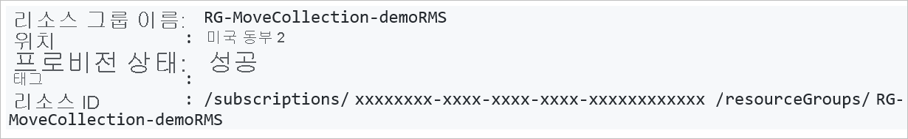
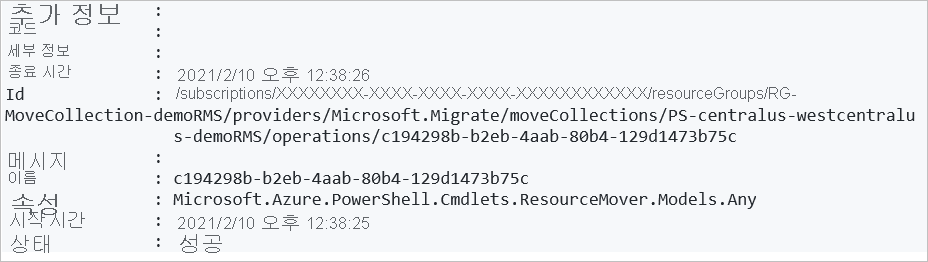

# <a name="move-resources-across-regions-in-powershell"></a>PowerShell에서 지역 간 리소스 이동

이 문서에서는 [Azure Resource Mover](overview.md)에서 PowerShell을 사용하여 Azure 리소스를 다른 Azure 지역으로 이동하는 방법에 대해 설명합니다.

이 자습서에서는 다음 작업 방법을 알아봅니다.

> [!div class="checklist"]
> * 필수 구성 요소 및 요구 사항 확인
> * 이동 컬렉션 설정
> * 이동 컬렉션에 리소스 추가 및 종속성 확인
> * 원본 리소스 그룹 준비 및 이동 
> * 다른 리소스 준비 및 이동
> * 이동을 취소할지 아니면 커밋할지 결정 
> * 이동 후 필요에 따라 원본 지역의 리소스 제거

> [!NOTE]
> 이 자습서에서는 시나리오를 가장 빠르게 시도할 수 있는 경로를 보여주며, 기본 옵션을 사용합니다. 

Azure 구독이 아직 없는 경우 시작하기 전에 [체험 계정](https://azure.microsoft.com/pricing/free-trial/)을 만듭니다. 그런 다음 [Azure Portal](https://portal.azure.com)에 로그인합니다.

## <a name="prerequisites"></a>필수 구성 요소
**요구 사항** | **설명**
--- | ---
**구독 권한** | 이동하려는 리소스가 포함된 구독에 대한 *소유자* 액세스 권한이 있는지 확인합니다.<br/><br/> **소유자 액세스가 필요한 이유는 무엇인가요?** Azure 구독에서 특정 원본 및 대상 쌍에 대한 리소스를 처음 추가하는 경우 Resource Mover를 통해 구독에서 신뢰할 수 있는 [시스템이 할당한 관리 ID](../active-directory/managed-identities-azure-resources/overview.md#managed-identity-types)(이전에는 MSI(관리되는 서비스 ID)라고 함)를 만듭니다. ID를 만들고 필요한 역할(원본 구독의 기여자 또는 사용자 액세스 관리자)을 할당하려면 리소스를 추가하는 데 사용하는 계정에 구독의 *소유자* 권한이 있어야 합니다. Azure 역할에 대해 [자세히 알아보세요](../role-based-access-control/rbac-and-directory-admin-roles.md#azure-roles).
**Resource Mover 지원** | 지원되는 지역 및 기타 일반적인 질문을 [검토](common-questions.md)합니다.
**VM 지원** |  이동하려는 모든 VM이 지원되는지 확인합니다.<br/><br/> - 지원되는 Windows VM을 [확인](support-matrix-move-region-azure-vm.md#windows-vm-support)합니다.<br/><br/> - 지원되는 Linux VM 및 커널 버전을 [확인](support-matrix-move-region-azure-vm.md#linux-vm-support)합니다.<br/><br/> - 지원되는 [컴퓨팅](support-matrix-move-region-azure-vm.md#supported-vm-compute-settings), [스토리지](support-matrix-move-region-azure-vm.md#supported-vm-storage-settings) 및 [네트워킹](support-matrix-move-region-azure-vm.md#supported-vm-networking-settings) 설정을 확인합니다.
**SQL 지원** | SQL 리소스를 이동하려면 [SQL 요구 사항 목록](tutorial-move-region-sql.md#check-sql-requirements)을 검토합니다.
**대상 구독** | 대상 지역의 구독 할당량이 대상 지역에서 이동하려는 리소스를 만들기에 충분해야 합니다. 할당량이 없는 경우 [추가 제한](../azure-resource-manager/management/azure-subscription-service-limits.md)을 요청하세요.
**대상 지역 요금** | 리소스를 이동하는 대상 지역과 관련된 가격 책정 및 요금을 확인하세요. [가격 계산기](https://azure.microsoft.com/pricing/calculator/)를 사용하면 도움이 됩니다.

### <a name="review-powershell-requirements"></a>PowerShell 요구 사항 검토

대부분의 리소스 이동 작업은 몇 가지 예외를 제외하고 Azure Portal 또는 PowerShell을 사용하는지 여부와 관계없이 동일합니다.

**연산** | **포털** | **PowerShell**
--- | --- | ---
**이동 컬렉션 만들기** | 이동 컬렉션(이동하는 모든 리소스의 목록)이 자동으로 만들어집니다. 필수 ID 권한이 포털을 통해 백 엔드에 할당됩니다. | PowerShell cmdlet을 사용하여 다음을 수행합니다.<br/><br/> - 이동 컬렉션에 대한 리소스 그룹을 만들고 해당 위치를 지정합니다.<br/><br/> - 관리 ID를 컬렉션에 할당합니다.<br/><br/> - 리소스를 컬렉션에 추가합니다.
**이동 컬렉션 제거** | 포털에서 이동 컬렉션을 직접 제거할 수 없습니다. | PowerShell cmdlet을 사용하여 이동 컬렉션을 제거합니다.
**리소스 이동 작업**<br/><br/> (준비, 이동 시작, 커밋 등)| Resource Mover의 자동 유효성 검사가 포함된 단일 단계입니다. | PowerShell cmdlet에서 다음을 수행합니다.<br/><br/> 1) 종속성의 유효성을 검사합니다.<br/><br/> 2) 이동을 수행합니다.
**원본 리소스 삭제** | Resource Mover 포털에서 직접 수행합니다. | 리소스 종류 수준의 PowerShell cmdlet입니다.


### <a name="sample-values"></a>샘플 값

스크립트 예제에서 사용하는 값은 다음과 같습니다.

**설정** | **값** 
--- | ---
구독 ID | subscription-id
원본 지역 |  미국 중부
대상 지역 | 미국 중서부
리소스 그룹(이동 컬렉션에 대한 메타데이터 포함) | RG-MoveCollection-demoRMS
이동 컬렉션 이름 | PS-centralus-westcentralus-demoRMS
리소스 그룹(원본 지역) | PSDemoRM 
리소스 그룹(대상 지역) | PSDemoRM-target
Resource Mover 서비스 위치 | 미국 동부 2
ID 유형 | SystemAssigned
이동할 VM | PSDemoVM


## <a name="sign-into-azure"></a>Azure에 로그인

Connect-AzAccount cmdlet을 사용하여 Azure 구독에 로그인합니다.

```azurepowershell-interactive
Connect-AzAccount – Subscription "<subscription-id>"
```

## <a name="set-up-the-move-collection"></a>이동 컬렉션 설정

MoveCollection 개체에는 이동하려는 리소스에 대한 메타데이터 및 구성 정보가 저장됩니다. 이동 컬렉션을 설정하려면 다음을 수행합니다.

- 이동 컬렉션에 대한 리소스 그룹을 만듭니다.
- MoveCollection 리소스를 만들 수 있도록 서비스 공급자를 구독에 등록합니다.
- 관리 ID를 사용하여 MoveCollection 개체를 만듭니다. MoveCollection 개체에서 Resource Mover 서비스가 있는 구독에 액세스하려면 구독에서 신뢰하는 [시스템이 할당한 관리 ID](../active-directory/managed-identities-azure-resources/overview.md#managed-identity-types)(이전의 MSI(관리 서비스 ID))가 필요합니다.
- 관리 ID에 대한 Resource Mover 구독에 대한 액세스 권한을 부여합니다.

### <a name="create-the-resource-group"></a>리소스 그룹 만들기

다음과 같이 이동 컬렉션 메타데이터 및 구성 정보에 대한 리소스 그룹을 만듭니다.

```azurepowershell-interactive
New-AzResourceGroup -Name "RG-MoveCollection-demoRMS" -Location "East US 2"
```
**출력**:



### <a name="register-the-resource-provider"></a>리소스 공급자 등록

1. 다음과 같이 MoveCollection 리소스를 만들 수 있도록 Microsoft.Migrate 리소스 공급자를 등록합니다.

    ```azurepowershell-interactive
    Register-AzResourceProvider -ProviderNamespace Microsoft.Migrate
    
2. Wait for registration:

    ```azurepowershell-interactive 
    While(((Get-AzResourceProvider -ProviderNamespace Microsoft.Migrate)| where {$_.RegistrationState -eq "Registered" -and $_.ResourceTypes.ResourceTypeName -eq "moveCollections"}|measure).Count -eq 0)
    {
        Start-Sleep -Seconds 5
        Write-Output "Waiting for registration to complete."
    }
    ```
### <a name="create-a-movecollection-object"></a>MoveCollection 개체 만들기

다음과 같이 MoveCollection 개체를 만들고 관리 ID를 할당합니다. 

```azurepowershell-interactive
New-AzResourceMoverMoveCollection -Name "PS-centralus-westcentralus-demoRMS"  -ResourceGroupName "RG-MoveCollection-demoRMS" -SourceRegion "centralus" -TargetRegion "westcentralus" -Location "centraluseuap" -IdentityType "SystemAssigned"
```

**출력**:


### <a name="grant-access-to-the-managed-identity"></a>관리 ID에 대한 액세스 권한 부여

다음과 같이 Resource Mover 구독에 대한 관리 ID 액세스 권한을 부여합니다. 구독 소유자여야 합니다.

1. MoveCollection 개체에서 ID 세부 정보를 검색합니다.

    ```azurepowershell-interactive
    $moveCollection = Get-AzResourceMoverMoveCollection -SubscriptionId $subscriptionId -ResourceGroupName "RG-MoveCollection-demoRMS" -Name "PS-centralus-westcentralus-demoRMS"

    $identityPrincipalId = $moveCollection.IdentityPrincipalId   
    ``` 

2. Azure Resource Mover에서 구독에 액세스하여 리소스를 이동할 수 있도록 필요한 역할을 ID에 할당합니다.

    ```azurepowershell-interactive
    New-AzRoleAssignment -ObjectId $identityPrincipalId -RoleDefinitionName Contributor -Scope "/subscriptions/$subscriptionId"

    New-AzRoleAssignment -ObjectId $identityPrincipalId -RoleDefinitionName "User Access Administrator" -Scope "/subscriptions/$subscriptionId"
    ``` 

## <a name="add-resources-to-the-move-collection"></a>이동 컬렉션에 리소스 추가

이동하려는 기존 원본 리소스에 대한 ID를 검색합니다. 대상 리소스 설정 개체를 만든 다음, 리소스를 이동 컬렉션에 추가합니다.

> [!NOTE]
> 이동 컬렉션에 추가된 리소스는 동일한 구독에 있어야 하지만 다른 리소스 그룹에 있을 수 있습니다.

다음과 같이 리소스를 추가합니다.

1. 원본 리소스 ID를 가져옵니다.

    ```azurepowershell-interactive
    Get-AzResource -Name PSDemoVM -ResourceGroupName PSDemoRM
    ```

    **출력**

    

2. 이동하는 리소스에 따라 대상 리소스 설정 개체를 만듭니다. 이 경우 VM입니다.

    ```azurepowershell-interactive
    $targetResourceSettingsObj = New-Object Microsoft.Azure.PowerShell.Cmdlets.ResourceMover.Models.Api202101.VirtualMachineResourceSettings
    ```

3. 개체의 리소스 종류 및 대상 리소스 이름을 설정합니다.

    ```azurepowershell-interactive
    $targetResourceSettingsObj.ResourceType = "Microsoft.Compute/virtualMachines"
    $targetResourceSettingsObj.TargetResourceName = "PSDemoVM"
    ```
    > [!NOTE]
    > 대상 VM 이름은 원본 지역의 VM 이름과 동일합니다. 다른 이름을 선택할 수 있습니다.

4. 검색하고 만든 리소스 ID 및 대상 설정 개체를 사용하여 원본 리소스를 이동 컬렉션에 추가합니다.

    ```azurepowershell-interactive
    Add-AzResourceMoverMoveResource -ResourceGroupName "RG-MoveCollection-demoRMS" -MoveCollectionName "PS-centralus-westcentralus-demoRMS" -SourceId "/subscriptions/xxxxxxxx-xxxx-xxxx-xxxx xxxxxxxxxxxx/resourceGroups/
    PSDemoRM/providers/Microsoft.Compute/virtualMachines/PSDemoVM" -Name "PSDemoVM" -ResourceSetting $targetResourceSettingsObj
    ```

    **출력** 

## <a name="validate-and-add-dependencies"></a>종속성 유효성 검사 및 추가

다른 리소스에 대한 종속성이 추가한 리소스에 있는지 확인하고 필요에 따라 추가합니다. 

1. 다음과 같이 종속성의 유효성을 검사합니다.

    ```azurepowershell-interactive
    Resolve-AzResourceMoverMoveCollectionDependency -ResourceGroupName "RG-MoveCollection-demoRMS" -MoveCollectionName "PS-centralus-westcentralus-demoRMS"
    ```
    **출력(종속성이 있는 경우)**

    

2. 종속성 누락 ID:

    - 누락된 모든 종속성의 목록을 검색하려면 다음을 수행합니다.

        ```azurepowershell-interactive
        Get-AzResourceMoverUnresolvedDependency -MoveCollectionName "PS-centralus-westcentralus-demoRMS" -ResourceGroupName "RG-MoveCollection-demoRMS" -DependencyLevel Descendant"
        ```
        **출력**   

    - 첫 번째 수준 종속성(리소스에 대한 직접 종속성)만 검색하려면 다음을 수행합니다.

        ```azurepowershell-interactive
        Get-AzResourceMoverUnresolvedDependency -MoveCollectionName "PS-centralus-westcentralus-demoRMS" -ResourceGroupName "RG-MoveCollection-demoRMS" -DependencyLevel Direct
        ```
        **출력**   

3. 누락된 미해결 종속성을 추가하려면 위의 지침을 반복하여 [리소스를 이동 컬렉션에 추가](#add-resources-to-the-move-collection)하고 미해결 리소스가 없을 때까지 유효성을 다시 검사합니다.

> [!NOTE]
> 어떤 이유로든 리소스 컬렉션에서 리소스를 제거하려면 [이 문서](remove-move-resources.md)의 지침을 따르세요.

## <a name="add-the-source-resource-group"></a>원본 리소스 그룹 추가

이동하려는 리소스가 포함된 원본 리소스 그룹을 이동 컬렉션에 추가합니다.

1. 리소스 그룹의 ID를 검색합니다.

    ```azurepowershell-interactive
    Get-AzResourceMoverUnresolvedDependency -MoveCollectionName "PS-centralus-westcentralus-demoRMS" -ResourceGroupName "RG-MoveCollection-demoRMS" -DependencyLevel Direct
    ```
    **출력**   

    > [!NOTE]
    > 이미 대상 지역에 있는 리소스 그룹을 사용하고 있습니다.

 
2. 검색된 ID를 사용하여 리소스 그룹을 컬렉션에 추가합니다.

    ```azurepowershell-interactive
    Add-AzResourceMoverMoveResource -ResourceGroupName "RG-MoveCollection-demoRMS"  -MoveCollectionName "PS-centralus-westcentralus-demoRMS" -SourceId "/subscriptions/xxxxxxxx-xxxx-xxxx-xxxx-xxxxxxxxxxxx/resourcegroups/psdemorm"  -Name "psdemorm"  -ExistingTargetId "/subscriptions/xxxxxxxx-xxxx-xxxx-xxxx-xxxxxxxxxxxx/resourcegroups/PSDemoRM-target"
    ```
    **출력** 

3. 리소스 그룹이 추가되면 누락된 항목이 없는지 종속성을 확인합니다.

    ```azurepowershell-interactive
    Resolve-AzResourceMoverMoveCollectionDependency -ResourceGroupName "RG-MoveCollection-demoRMS" -MoveCollectionName "PS-centralus-westcentralus-demoRMS"
    ```
4. 미해결 종속성이 없다고 표시됩니다.

    **출력** 


## <a name="prepare-resources"></a>리소스 준비

일반적으로 이동하기 전에 원본 지역에서 리소스를 준비해야 합니다. 예를 들어:

- 상태 비저장 리소스(예: Azure 가상 네트워크, 네트워크 어댑터, 부하 분산 장치 및 네트워크 보안 그룹)를 이동하려면 Azure Resource Manager 템플릿을 내보내야 할 수 있습니다.
- 상태 저장 리소스(예: Azure VM 및 SQL 데이터베이스)를 이동하려면 원본 지역에서 대상 지역으로의 리소스 복제를 시작해야 할 수 있습니다.

이 자습서에서는 VM을 이동하므로 VM 준비를 시작하기 전에 원본 리소스 그룹을 준비한 다음, 이동을 시작하고 커밋해야 합니다.

> [!NOTE]
> 기존 대상 리소스 그룹이 있는 경우 원본 리소스 그룹에 대한 이동을 직접 커밋하고, 이동 준비 및 시작 단계를 건너뛸 수 있습니다.

  
### <a name="prepare-the-source-resource-group"></a>원본 리소스 그룹 준비

1. 리소스 그룹을 준비합니다.

    ```azurepowershell-interactive
    Invoke-AzResourceMoverPrepare -ResourceGroupName "RG-MoveCollection-demoRMS" -MoveCollectionName "PS-centralus-westcentralus-demoRMS"  -MoveResource “PSDemoRM”
    ```
    **출력**

    

2. 원본 리소스 그룹의 이동을 시작합니다.

    ```azurepowershell-interactive
    "RG-MoveCollection-demoRMS" -MoveCollectionName "PS-centralus-westcentralus-demoRMS"  -MoveResource “PSDemoRM”
    ```
    

3. 원본 리소스 그룹의 이동을 커밋합니다.

    ```azurepowershell-interactive
    Invoke-AzResourceMoverCommit -ResourceGroupName "RG-MoveCollection-demoRMS" -MoveCollectionName "PS-centralus-westcentralus-demoRMS"  -MoveResource “PSDemoRM”
    ```
    **출력**

    


### <a name="prepare-vm-resources"></a>VM 리소스 준비

원본 리소스 그룹을 준비하고 이동하면 이동할 VM 리소스를 준비할 수 있습니다.

1. VM 리소스를 준비하기 전에 종속성의 유효성을 검사합니다.

    ```azurepowershell-interactive
    $resp = Invoke-AzResourceMoverPrepare -ResourceGroupName "RG-MoveCollection-demoRMS" -MoveCollectionName "PS-centralus-westcentralus-demoRMS"  -MoveResource $('psdemovm') -ValidateOnly
    ```
    **출력**

    

2. VM과 함께 준비해야 하는 종속 리소스를 가져옵니다.

    ```azurepowershell-interactive
    $resp.AdditionalInfo[0].InfoMoveResource
    ```
    **출력**

    

3. 모든 종속 리소스에 대한 준비 프로세스를 시작합니다.

    ```azurepowershell-interactive
    Invoke-AzResourceMoverPrepare -ResourceGroupName "RG-MoveCollection-demoRMS" -MoveCollectionName "PS-centralus-westcentralus-demoRMS"  -MoveResource $('PSDemoVM','psdemovm111', 'PSDemoRM-vnet','PSDemoVM-nsg')
    ```
    **출력**

    


    > [!NOTE]
    > 준비 cmdlet에 대한 입력 매개 변수뿐만 아니라 이동 시작 및 커밋 cmdlet에서도 리소스 이름 대신 원본 리소스 ID를 제공할 수 있습니다. 이렇게 하려면 다음을 실행합니다.


    ```azurepowershell-interactive
        Invoke-AzResourceMoverPrepare -ResourceGroupName "RG-MoveCollection-demoRMS" -MoveCollectionName "PS-centralus-westcentralus-demoRMS" -MoveResourceInputType MoveResourceSourceId  -MoveResource $('/subscriptions/xxxxxxxx-xxxx-xxxx-xxxx-xxxxxxxxxxxx/resourceGroups/PSDemoRMS/providers/Microsoft.Network/networkSecurityGroups/PSDemoVM-nsg')
    ```

## <a name="initiate-move-of-vm-resources"></a>VM 리소스 이동 시작

1. VM 리소스가 *이동 시작 보류 중* 상태인지 확인합니다.

    ```azurepowershell-interactive
    Get-AzResourceMoverMoveResource  -SubscriptionId “ xxxxxxxx-xxxx-xxxx-xxxx-xxxxxxxxxxxx “ -ResourceGroupName “RG-MoveCollection-demoRMS” -MoveCollectionName “PS-centralus-westcentralus-demoRMS ”   | Where-Object {  $_.MoveStatusMoveState -eq “InitiateMovePending” } | Select Name
    ```    

    **출력**

    

2. 이동을 시작합니다.

    ```azurepowershell-interactive
    Invoke-AzResourceMoverInitiateMove -ResourceGroupName "RG-MoveCollection-demoRMS" -MoveCollectionName "PS-centralus-westcentralus-demoRMS"  -MoveResource $('psdemovm111', 'PSDemoRM-vnet','PSDemoVM-nsg', ‘PSDemoVM’) -MoveResourceInputType "MoveResourceId"
    ```    

    **출력**

    


## <a name="discard-or-commit"></a>취소 또는 커밋

처음 이동한 후에는 이동을 커밋할지 아니면 취소할지 결정할 수 있습니다. 

- **취소**: 테스트하는 중에 원본 리소스를 실제로 이동하지 않으려는 경우 이동을 취소할 수 있습니다. 이동을 취소하면 리소스가 *이동 시작 보류 중* 상태로 돌아갑니다. 그런 다음, 필요한 경우 이동을 다시 시작할 수 있습니다.
- **커밋**: 커밋은 대상 지역으로의 이동을 완료합니다. 커밋 후 원본 리소스는 *원본 삭제 보류 중* 상태가 되며 삭제 여부를 결정할 수 있습니다.

### <a name="discard-the-move"></a>이동 취소

이동을 취소하려면 다음을 수행합니다.

```azurepowershell-interactive
Invoke-AzResourceMoverDiscard -ResourceGroupName "RG-MoveCollection-demoRMS" -MoveCollectionName "PS-centralus-westcentralus-demoRMS"  -MoveResource $('psdemovm111', 'PSDemoRM-vnet','PSDemoVM-nsg', ‘PSDemoVM’) -MoveResourceInputType "MoveResourceId"
```
**출력**


### <a name="commit-the-move"></a>이동 커밋

1. 다음과 같이 이동을 커밋합니다.

    ```azurepowershell-interactive
    Invoke-AzResourceMoverCommit -ResourceGroupName "RG-MoveCollection-demoRMS" -MoveCollectionName "PS-centralus-westcentralus-demoRMS"  -MoveResource $('psdemovm111', 'PSDemoRM-vnet','PSDemoVM-nsg', ‘PSDemoVM’) -MoveResourceInputType "MoveResourceId"
    ```
    **출력**

    

2. 모든 리소스가 대상 지역으로 이동되었는지 확인합니다.

    ```azurepowershell-interactive
    Get-AzResourceMoverMoveResource  -ResourceGroupName “RG-MoveCollection-demoRMS ” -MoveCollectionName “PS-centralus-westcentralus-demoRMS”   
    ```
    이제 모든 리소스가 대상 지역에서 *원본 삭제 보류 중* 상태에 있습니다.

## <a name="delete-source-resources"></a>원본 리소스 삭제

이동을 커밋하고 리소스가 대상 지역에서 예상대로 작동하는지 확인한 후에는 [Azure Portal](../azure-resource-manager/management/manage-resources-portal.md#delete-resources), [PowerShell](../azure-resource-manager/management/manage-resources-powershell.md#delete-resources) 또는 [Azure CLI](../azure-resource-manager/management/manage-resources-cli.md#delete-resources)를 사용하여 각 원본 리소스를 삭제할 수 있습니다.

## <a name="next-steps"></a>다음 단계

이 자습서에서는 다음과 같은 작업을 수행했습니다.

> [!div class="checklist"]
> * PowerShell을 사용하여 Azure VM을 다른 Azure 지역으로 이동했습니다.
> * VM과 연결된 리소스를 다른 지역으로 이동했습니다.

이제 포털을 사용하여 Azure VM을 이동하려고 합니다.

> [!div class="nextstepaction"]
> [포털에서 Azure VM 이동](./tutorial-move-region-virtual-machines.md)


