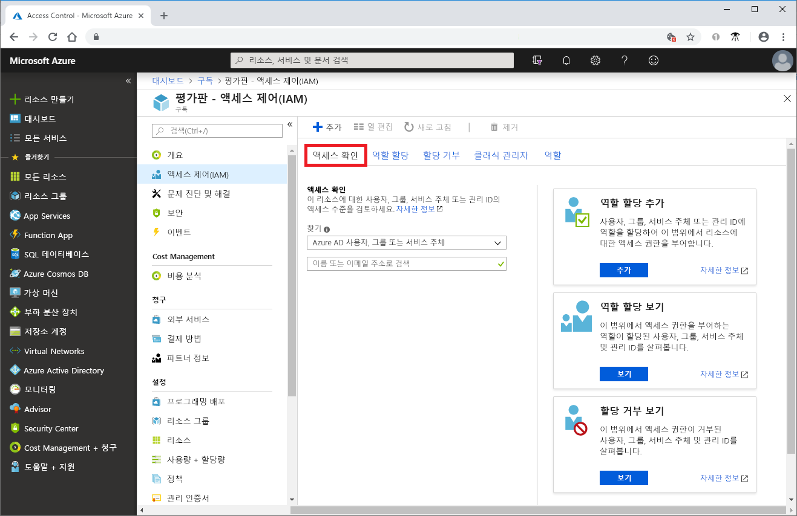
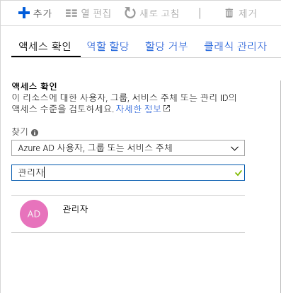
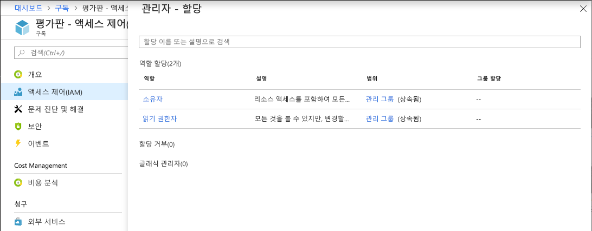

# 빠른 시작: 사용자가 Azure 리소스에 대해 갖는 액세스 권한 보기

[RBAC(역할 기반 액세스 제어)](overview.md)의 **액세스 제어(IAM)** 블레이드를 사용하여 사용자 또는 다른 보안 주체가 Azure 리소스에 대해 갖는 액세스 권한을 볼 수 있습니다. 단, 단일 사용자 또는 다른 보안 주체의 경우 액세스 권한을 빠르게 확인해야 합니다. 이 작업을 수행하는 가장 쉬운 방법은 Azure Portal에서 **액세스 권한 확인** 기능을 사용하는 것입니다.

## 역할 할당 보기

 사용자의 액세스 권한을 보는 방법은 역할 할당을 나열하는 것입니다. 다음 단계에 따라 구독 범위에서 단일 사용자, 그룹, 서비스 주체 또는 관리 ID에 대한 역할 할당을 확인합니다.

1. Azure Portal에서 **모든 서비스**, **구독**을 차례로 클릭합니다.

1. 구독을 클릭합니다.

1. **액세스 제어(IAM)** 를 클릭합니다.

1. **액세스 권한 확인** 탭을 클릭합니다.

    

1. **찾기** 목록에서 액세스 권한을 확인하려는 보안 주체의 유형을 선택합니다.

1. 검색 상자에서 표시 이름, 이메일 주소 또는 개체 ID에 대한 디렉터리를 검색할 문자열을 입력합니다.

    

1. 보안 주체를 클릭하여 **할당** 창을 엽니다.

    

    이 창에서 선택한 보안 주체 및 범위에 할당된 역할을 볼 수 있습니다. 이 범위에 거부 할당이 있거나 이 범위에 상속된 거부 할당이 있으면 나열됩니다.

## 다음 단계

> [!div class="nextstepaction"]
> [자습서: RBAC 및 Azure Portal을 사용하여 Azure 리소스에 대한 사용자 액세스 권한 부여](quickstart-assign-role-user-portal.md)
