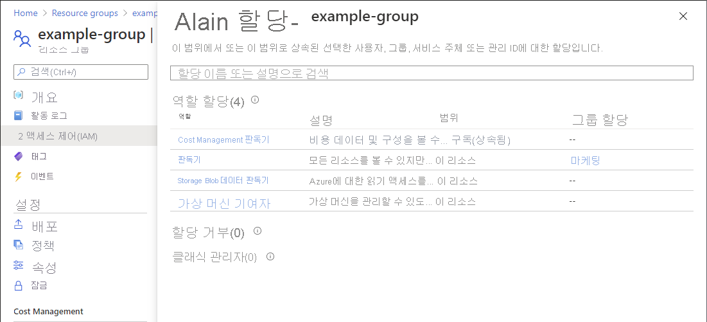
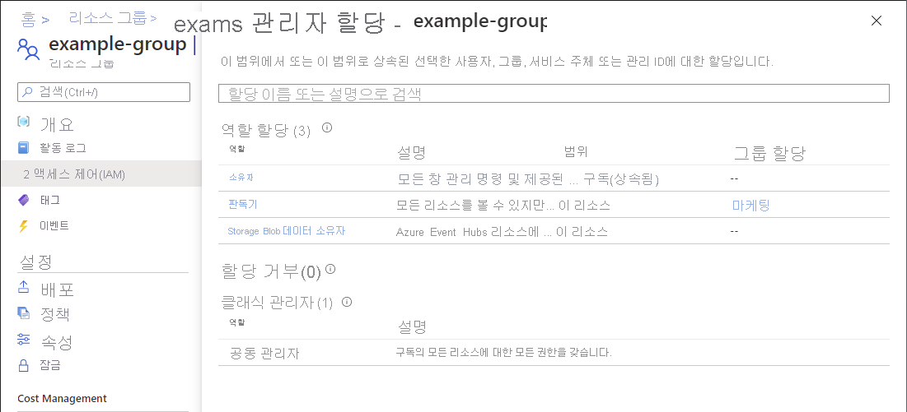

# 빠른 시작: Azure 리소스에 대한 사용자 액세스 확인

경우에 따라 사용자가 Azure 리소스 세트에 대해 어떤 액세스 권한이 있는지 확인해야 합니다. 해당 할당을 나열하여 액세스 권한을 확인합니다. 단일 사용자에 대한 액세스를 확인하는 빠른 방법은 **액세스 제어(IAM)** 페이지에서 **액세스 확인** 기능을 사용하는 것입니다.

## 1단계: Azure 리소스 열기

사용자에 대한 액세스를 확인하려면 먼저 액세스 권한을 확인하려는 Azure 리소스를 열어야 합니다. Azure 리소스는 일반적으로 *범위* 라고 하는 수준으로 구성됩니다. Azure에서는 광범위한 범위에서 좁은 범위까지 네 가지 수준(관리 그룹, 구독, 리소스 그룹 또는 리소스)에서 범위를 지정할 수 있습니다.

액세스를 확인하려는 Azure 리소스 세트를 열려면 다음 단계를 수행합니다.

1. [Azure Portal](https://portal.azure.com)을 엽니다.

1. **관리 그룹**, **구독**, **리소스 그룹** 또는 특정 리소스와 같은 Azure 리소스 세트를 엽니다.

1. 해당 범위에서 특정 리소스를 클릭합니다.

    다음은 예제 리소스 그룹을 보여줍니다.

    

## 2단계: 사용자에 대한 액세스 확인

다음 단계에 따라 이전에 선택한 Azure 리소스에 대한 단일 사용자, 그룹, 서비스 주체 또는 관리 ID의 액세스 권한을 확인합니다.

1. **액세스 제어(IAM)** 를 클릭합니다.

    다음은 리소스 그룹에 대한 액세스 제어(IAM) 페이지의 예를 보여줍니다.

    

1. **액세스 확인** 탭의 **찾기** 목록에서 액세스를 확인할 사용자, 그룹, 서비스 주체 또는 관리 ID를 선택합니다.

1. 검색 상자에서 표시 이름, 이메일 주소 또는 개체 ID에 대한 디렉터리를 검색할 문자열을 입력합니다.

    

1. 보안 주체를 클릭하여 **할당** 창을 엽니다.

    이 창의 이 범위에서 선택한 보안 주체에 대한 액세스 권한을 볼 수 있으며 이 범위로 상속됩니다. 자식 범위의 할당은 나열되지 않습니다. 다음 할당이 표시됩니다.

    - Azure RBAC를 사용하여 역할 할당을 추가했습니다.
    - Azure Blueprints 또는 Azure 관리형 앱을 사용하여 추가된 할당을 거부합니다.
    - 클래식 배포를 위한 클래식 서비스 관리자 또는 공동 관리자 할당. 

    

## 3단계: 액세스 권한 확인

다음 단계에 따라 이전에 선택한 Azure 리소스에 대한 액세스 권한을 확인합니다.

1. **액세스 제어(IAM)** 를 클릭합니다.

1. **액세스 확인** 탭에서 **내 액세스 보기** 단추를 클릭합니다.

    이 범위에 대한 액세스 권한을 나열하고 이 범위에 상속된 할당 창이 표시됩니다. 자식 범위의 할당은 나열되지 않습니다.

    

## 다음 단계

> [!div class="nextstepaction"]
> [Azure Portal을 사용하여 Azure 역할 할당을 나열](role-assignments-list-portal.md)합니다.
