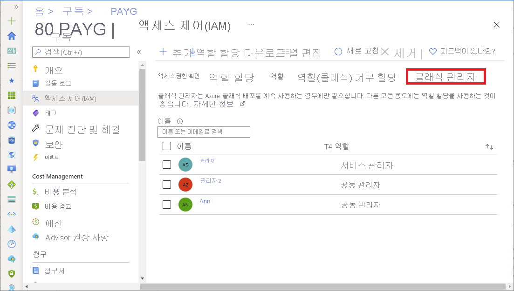

# Azure 클래식 구독 관리자

Azure RBAC(Azure 역할 기반 액세스 제어)를 사용하여 Azure 리소스에 대한 액세스를 관리하는 것이 좋습니다. 그러나 클래식 배포 모델을 계속 사용하는 경우에는 클래식 구독 관리자 역할 서비스 관리자 및 공동 관리자를 사용해야 합니다. 자세한 내용은 [Azure Resource Manager 및 클래식 배포](../azure-resource-manager/management/deployment-models.md)를 참조하세요.

이 문서에서는 공동 관리자 및 서비스 관리자 역할을 추가하거나 변경하는 방법과 계정 관리자를 확인하는 방법을 설명합니다.

## 공동 관리자 추가

> [!TIP]
> 사용자가 [Azure 서비스 관리 PowerShell 모듈](/powershell/module/servicemanagement/azure.service)을 사용하여 Azure 클래식 배포를 관리해야 하는 경우에만 공동 관리자를 추가하면 됩니다. 사용자가 Azure Portal을 통해서만 클래식 리소스를 관리하는 경우 사용자에 대한 클래식 관리자를 추가할 필요가 없습니다.

1. 서비스 관리자 또는 공동 관리자 권한으로 [Azure Portal](https://portal.azure.com)에 로그인합니다.

1. [구독](https://portal.azure.com/#blade/Microsoft_Azure_Billing/SubscriptionsBlade)을 열고 구독을 선택합니다.

    공동 관리자는 구독 범위에서만 할당할 수 있습니다.

1. **액세스 제어(IAM)** 를 클릭합니다.

1. **클래식 관리자** 탭을 클릭합니다.

    

1. **추가** > **공동 관리자 추가** 를 클릭하여 공동 관리자 추가 창을 엽니다.

    공동 관리자 추가 옵션을 사용할 수 없는 경우 권한이 없는 것입니다.

1. 추가할 사용자를 선택하고 **추가** 를 클릭합니다.

    

## 게스트 사용자를 공동 관리자로 추가

게스트 사용자를 공동 관리자로 추가하려면 위의 [공동 관리자 추가](#add-a-co-administrator) 섹션과 동일한 단계를 수행합니다. 게스트 사용자는 다음 기준을 충족해야 합니다.

- 게스트 사용자가 디렉터리에 존재해야 합니다. 이는 사용자가 디렉터리에 초대되고 초대를 수락했음을 의미합니다.

디렉터리에 게스트 사용자를 추가하는 방법에 대한 자세한 내용은 [Azure Portal에서 Azure Active Directory B2B 협업 사용자 추가](../active-directory/external-identities/add-users-administrator.md)를 참조하세요.

### 게스트 사용자의 차이점

공동 관리자 역할이 할당된 게스트 사용자는 공동 관리자 역할의 멤버 사용자와 비교해 몇 가지 차이를 나타낼 수 있습니다. 다음 시나리오를 고려하세요.

- Azure AD 계정(회사 또는 학교 계정)이 있는 사용자 A는 Azure 구독의 서비스 관리자입니다.
- 사용자 B에게는 Microsoft 계정이 있습니다.
- 사용자 A가 사용자 B에게 공동 관리자 역할을 할당합니다.
- 사용자 B는 거의 모든 작업을 수행할 수 있지만 Azure AD 디렉터리에서 애플리케이션을 등록하거나 사용자를 조회할 수 없습니다.

사용자 B는 모든 것을 관리할 수 있다고 예상할 수 있습니다. 이러한 차이가 나타나는 이유는 Microsoft 계정이 멤버 사용자가 아닌 게스트 사용자로 구독에 추가되기 때문입니다. 게스트 사용자에 멤버 사용자와 비교할 때 Azure AD에서 다른 기본 권한을 갖습니다. 예를 들어, 멤버 사용자는 Azure AD에서 다른 사용자가 읽을 수 있지만 게스트 사용자는 그럴 수 없습니다. 멤버 사용자는 Azure AD에서 새 서비스 주체를 등록할 수 있지만 게스트 사용자는 그럴 수 없습니다.

게스트 사용자가 이러한 작업을 수행할 수 있도록 하려면 게스트 사용자가 필요한 특정 Azure AD 역할을 할당해야 합니다. 예를 들어, 이전 시나리오에서는 다른 사용자를 읽기 위한 [디렉터리 읽기 권한자](../active-directory/roles/permissions-reference.md#directory-readers) 역할과 서비스 주체를 만들 수 있는 [애플리케이션 개발자](../active-directory/roles/permissions-reference.md#application-developer) 역할을 할당할 수 있습니다. 멤버 및 게스트 사용자와 해당 권한에 대한 자세한 내용은 [Azure Active Directory의 기본 사용자 권한이란?](../active-directory/fundamentals/users-default-permissions.md)을 참조하세요. 게스트 사용자에게 액세스 권한을 부여하는 방법에 대한 자세한 내용은 [Azure Portal을 사용하여 외부 게스트 사용자에게 Azure 역할 할당](role-assignments-external-users.md)을 참조하세요.

[Azure 기본 제공 역할](../role-based-access-control/built-in-roles.md)은 [Azure AD 역할](../active-directory/roles/permissions-reference.md)과 다릅니다. 기본 제공 역할은 Azure AD에 대한 액세스 권한을 부여하지 않습니다. 자세한 내용은 [다른 역할 이해](../role-based-access-control/rbac-and-directory-admin-roles.md)를 참조하세요.

멤버 사용자와 게스트 사용자를 비교하는 내용은 [Azure Active Directory의 기본 사용자 권한이란?](../active-directory/fundamentals/users-default-permissions.md)을 참조하세요.

## 공동 관리자 제거

1. 서비스 관리자 또는 공동 관리자 권한으로 [Azure Portal](https://portal.azure.com)에 로그인합니다.

1. [구독](https://portal.azure.com/#blade/Microsoft_Azure_Billing/SubscriptionsBlade)을 열고 구독을 선택합니다.

1. **액세스 제어(IAM)** 를 클릭합니다.

1. **클래식 관리자** 탭을 클릭합니다.

1. 제거할 공동 관리자 옆에 확인 표시를 추가합니다.

1. **제거** 를 클릭합니다.

1. 표시되는 메시지 상자에서 **예** 를 클릭합니다.

    

## 서비스 관리자 변경

계정 관리자만 구독에 대한 서비스 관리자를 변경할 수 있습니다. 기본적으로, Azure 구독에 가입할 때 서비스 관리자는 계정 관리자와 같습니다.

계정 관리자 역할이 있는 사용자는 Azure Portal에 액세스하고 청구를 관리할 수 있지만 구독을 취소할 수는 없습니다. 서비스 관리자 역할의 사용자는 Azure Portal에 대해 모든 권한을 지니고, 구독을 취소할 수 있습니다. 계정 관리자는 자신을 서비스 관리자로 만들 수 있습니다.

Azure Portal에서 서비스 관리자를 변경하려면 다음 단계를 수행합니다.

1. [서비스 관리자 변경에 대한 제한 사항](#limitations-for-changing-the-service-administrator)을 검토하여 시나리오가 지원되는지 확인합니다.

1. 계정 관리자 권한으로 [Azure Portal](https://portal.azure.com)에 로그인합니다.

1. **Cost Management + Billing** 을 열고 구독을 선택합니다.

1. 왼쪽 탐색 창에서 **속성** 을 클릭합니다.

1. **서비스 관리자 변경** 을 클릭합니다.

    

1. **서비스 관리자 편집** 페이지에서 새 서비스 관리자의 이메일 주소를 입력합니다.

    

1. **확인** 을 클릭하여 변경 내용을 저장합니다.

### 서비스 관리자 변경에 대한 제한 사항

서비스 관리자는 Azure 구독당 하나만 있을 수 있습니다. 서비스 관리자 변경은 계정 관리자가 Microsoft 계정인지 아니면 Azure AD 계정(회사 또는 학교 계정)인지에 따라 다르게 동작합니다.

| 계정 관리자 계정 | 서비스 관리자를 다른 Microsoft 계정으로 변경할 수 있나요? | 서비스 관리자를 동일한 디렉터리의 Azure AD 계정으로 변경할 수 있나요? | 서비스 관리자를 다른 디렉터리의 Azure AD 계정으로 변경할 수 있나요? |
| --- | --- | --- | --- |
| Microsoft 계정 | 예 | 아니요 | 예 |
| Azure AD 계정 | 예 | 예 | 예 |

계정 관리자가 Azure AD 계정인 경우에는 서비스 관리자를 동일한 디렉터리의 Azure AD 계정으로 변경할 수 있지만 다른 디렉터리의 Azure AD 계정으로는 변경할 수 없습니다. 예를 들어 abby@contoso.com은 서비스 관리자를 bob@contoso.com으로 변경할 수 있지만, john@notcontoso.com이 contoso.com 디렉터리에 존재하지 않는 경우에는 서비스 관리자를 john@notcontoso.com으로 변경할 수 없습니다.

Microsoft 계정 및 Azure AD 계정에 대한 자세한 내용은 [Azure Active Directory란?](../active-directory/fundamentals/active-directory-whatis.md)을 참조하세요.

## 계정 관리자 보기

계정 관리자는 초기에 Azure 구독에 등록한 사용자이며 구독의 청구 소유자로서 책임이 있습니다. 구독의 계정 관리자를 변경하려면 [다른 계정에 Azure 구독의 소유권 이전](../cost-management-billing/manage/billing-subscription-transfer.md)을 참조하세요.

계정 관리자를 보려면 다음 단계를 수행합니다.

1. [Azure Portal](https://portal.azure.com)에 로그인합니다.

1. **Cost Management + Billing** 을 열고 구독을 선택합니다.

1. 왼쪽 탐색 창에서 **속성** 을 클릭합니다.

    구독의 계정 관리자는 **계정 관리자** 상자에 표시됩니다.

    

## 다음 단계

* [여러 역할의 이해](../role-based-access-control/rbac-and-directory-admin-roles.md)
* [Azure Portal을 사용하여 Azure 역할 할당](../role-based-access-control/role-assignments-portal.md)
* [Azure 구독 관리자 추가 또는 변경](../cost-management-billing/manage/add-change-subscription-administrator.md)