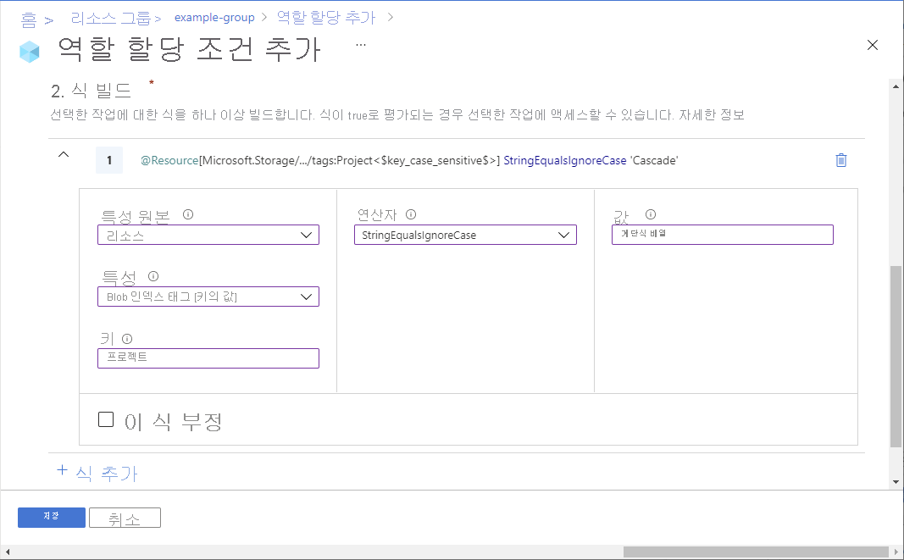

# Azure Portal을 사용하여 Azure 역할 할당 조건 추가 또는 편집(미리 보기)

> [!IMPORTANT]
> Azure ABAC 및 Azure 역할 할당 조건은 현재 미리 보기 상태입니다.
> 이 미리 보기 버전은 서비스 수준 계약 없이 제공되며 프로덕션 워크로드에는 사용하지 않는 것이 좋습니다. 특정 기능이 지원되지 않거나 기능이 제한될 수 있습니다.
> 자세한 내용은 [Microsoft Azure Preview에 대한 추가 사용 약관](https://azure.microsoft.com/support/legal/preview-supplemental-terms/)을 참조하세요.

[Azure 역할 할당 조건](conditions-overview.md)은 더 세분화된 액세스 제어를 제공하기 위해 선택적으로 역할 할당에 추가할 수 있는 추가 검사입니다. 예를 들어 개체를 읽을 특정 태그를 포함하는 개체를 필요로 하는 조건을 추가할 수 있습니다. 이 문서에서는 Azure Portal을 사용하여 역할 할당에 대한 조건을 추가, 편집, 보기 또는 삭제하는 방법을 설명합니다.

## 필수 구성 요소

역할 할당 조건을 추가하거나 편집하기 위한 사전 요구 사항은 [조건 및 사전 요구 사항](conditions-prerequisites.md)을 참조하세요.

## 1단계: 필요한 상태 결정

필요한 조건을 확인하려면 [Azure 역할 할당 조건 예](../storage/common/storage-auth-abac-examples.md)의 예를 검토하세요.

현재 [스토리지 Blob 데이터 작업](../storage/common/storage-auth-abac-attributes.md)을 포함하는 기본 제공 또는 사용자 지정 역할 할당에 조건을 추가할 수 있습니다. 여기에는 다음과 같은 기본 제공 역할이 포함됩니다.

- [Storage Blob 데이터 기여자](built-in-roles.md#storage-blob-data-contributor)
- [Storage Blob 데이터 소유자](built-in-roles.md#storage-blob-data-owner)
- [Storage Blob 데이터 읽기 권한자](built-in-roles.md#storage-blob-data-reader)

## 2단계: 조건 추가 방법 선택

조건을 추가하는 방법에는 두 가지가 있습니다. 새 역할 할당을 추가할 때 조건을 추가하거나 기존 역할 할당에 조건을 추가할 수 있습니다.

### 새 역할 할당

1. [Azure Portal을 사용하여 Azure 역할 할당](role-assignments-portal.md) 단계를 따릅니다.

1. **조건** 탭에서 **조건 추가** 를 클릭합니다.

    조건 탭이 표시되지 않으면 조건을 지원하는 역할을 선택해야 합니다.

   

    역할 할당 조건 추가 페이지가 표시됩니다.

### 기존 역할 할당

1. Azure Portal에서 조건을 추가하려는 범위에서 **액세스 제어(IAM)** 를 엽니다. 예를 들어 구독, 리소스 그룹 또는 리소스를 열 수 있습니다.

    현재 Azure Portal을 사용하여 관리 그룹 범위에서 조건 추가를 추가, 보기, 편집 또는 삭제할 수 없습니다.

1. **역할 할당** 탭을 클릭하여 이 범위의 모든 역할 할당을 봅니다.

1. 조건을 추가하려는 스토리지 데이터 작업이 있는 역할 할당을 찾습니다.

1. **조건** 항목에서 **추가** 를 클릭합니다.

    추가 링크가 표시되지 않으면 역할 할당과 동일한 범위를 확인해야 합니다.

    

    역할 할당 조건 추가 페이지가 표시됩니다.

## 3단계: 기본 사항 검토

역할 할당 조건 추가 페이지가 열리면 조건의 기본 사항을 검토할 수 있습니다. **역할** 은 조건이 추가될 역할을 나타냅니다.

1. **편집기 유형** 옵션의 경우 기본 **시각적 개체** 를 선택된 상태로 둡니다.

    조건을 추가한 후에는 시각적 개체와 코드 사이를 전환할 수 있습니다.

1. (선택 사항) **설명** 상자가 나타나면 설명을 입력합니다.

    조건을 추가하도록 선택한 방법에 따라 설명 상자가 표시되지 않을 수 있습니다. 설명을 통해 조건을 이해하고 기억할 수 있습니다.

    

## 4단계: 작업 추가

1. **작업 추가** 섹션에서 **작업 추가** 를 클릭합니다.

    작업 선택 창이 표시됩니다. 이 창은 조건 대상이 될 역할 할당을 기준으로 데이터 작업을 필터링한 목록입니다. 자세한 내용은 [Azure 역할 할당 조건 형식 및 구문](conditions-format.md#actions)을 참조하세요.

    

1. 조건이 참인 경우 허용할 작업을 선택합니다.

    단일 조건에 대해 여러 작업을 선택하는 경우 선택한 작업에서 특성을 사용할 수 있어야 하므로 조건에 대해 선택할 특성이 적을 수 있습니다.

1. **선택** 을 클릭합니다.

    선택한 작업이 작업 목록에 표시됩니다.

## 5단계: 식 작성

1. **식 작성** 섹션에서 **식 추가** 를 클릭합니다.

    식 섹션이 확장됩니다.

1. 특성 원본 목록에서 특성을 찾을 수 있는 위치를 선택합니다.

    - **리소스** 는 특성이 컨테이너 이름과 같은 리소스에 있음을 나타냅니다.
    - **요청** 은 특성이 Blob 색인 태그 설정과 같은 작업 요청의 일부임을 나타냅니다.

1. 특성 목록에서 식의 왼쪽에 대한 특성을 선택합니다. 자세한 내용은 [Azure 역할 할당 조건 형식 및 구문](conditions-format.md#attributes)을 참조하세요.

    선택한 특성에 따라 추가 특성 세부 정보를 지정하기 위해 상자를 추가할 수 있습니다.

1. 연산자 목록에서 연산자를 선택합니다.

1. 값 상자에 식의 오른쪽에 값을 입력합니다.

    

## 6단계: 조건 검토 및 추가

1. **편집기 형식** 으로 스크롤하고 **코드** 를 클릭합니다.

    조건은 코드로 표시됩니다. 이 코드 편집기에서 조건을 변경할 수 있습니다. 시각적 개체 편집기로 돌아가려면 **시각적 개체** 를 클릭합니다.

    

1. 역할 할당에 조건을 추가하려면 **저장** 을 클릭합니다.

## 조건 보기, 편집 또는 삭제

1. Azure Portal에서 보기, 편집 또는 삭제 조건이 있는 역할 할당에 대한 **액세스 제어(IAM)** 를 엽니다.

1. **역할 할당** 탭을 클릭하고 역할 할당을 찾습니다.

1. **조건** 항목에서 **보기/편집** 을 클릭합니다.

    보기/편집 링크가 표시되지 않으면 역할 할당과 동일한 범위를 확인해야 합니다.

    

    역할 할당 조건 추가 페이지가 표시됩니다.

1. 편집기를 사용하여 조건을 보거나 편집할 수 있습니다.

    

1. 완료되면 **저장** 을 클릭합니다. 전체 조건을 삭제하려면 **조건 삭제** 를 클릭합니다. 조건을 삭제해도 역할 할당은 제거되지 않습니다.

## 다음 단계

- [Azure 역할 할당 조건 예(미리 보기)](../storage/common/storage-auth-abac-examples.md)
- [자습서: Azure Portal을 사용하여 Blob에 대한 액세스를 제한하는 역할 할당 조건 추가(미리 보기)](../storage/common/storage-auth-abac-portal.md)
- [Azure 역할 할당 조건 문제 해결(미리 보기)](conditions-troubleshoot.md)
