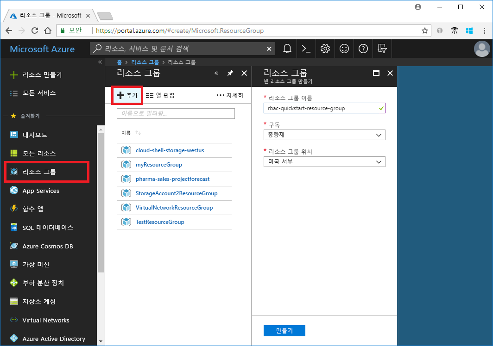
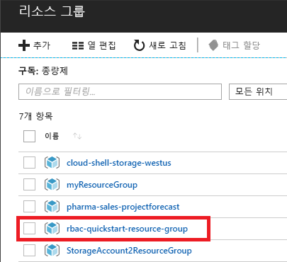
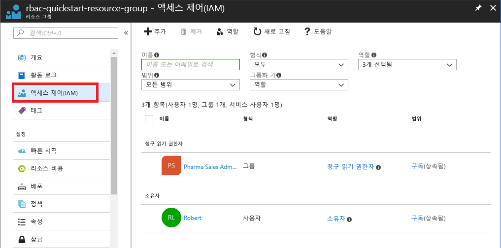
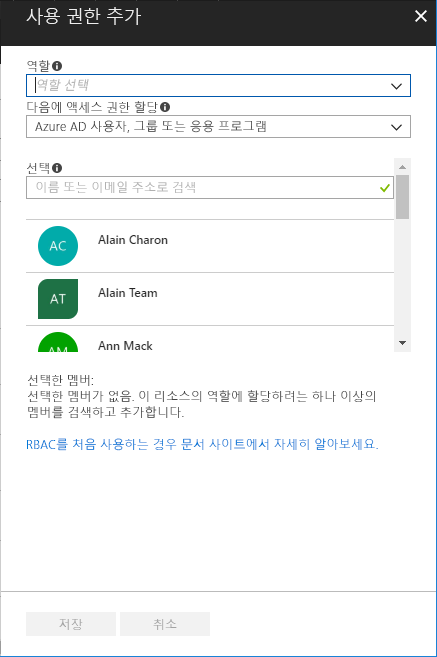
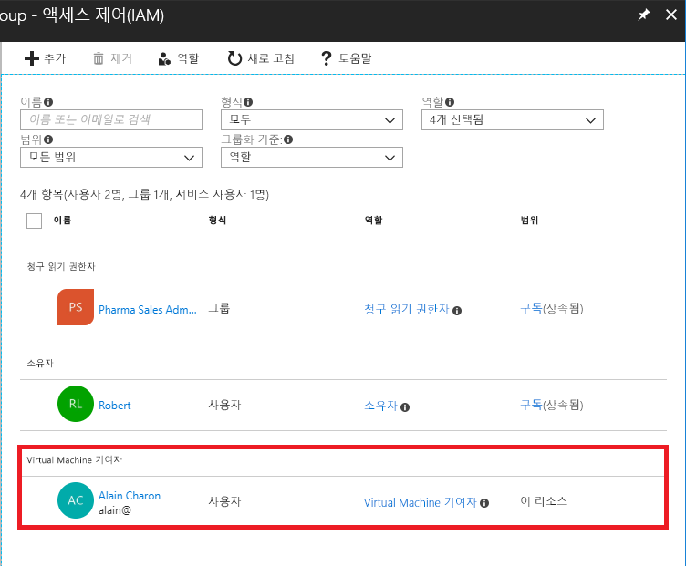
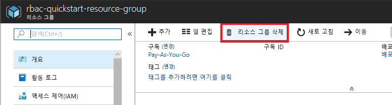

# 빠른 시작: RBAC 및 Azure Portal을 사용하여 사용자에게 액세스 권한 부여

RBAC(역할 기반 액세스 제어)는 Azure에서 리소스에 대한 액세스를 관리하는 방법입니다. 이 빠른 시작에서는 리소스 그룹에서 가상 머신을 만들고 관리하는 사용자 액세스 권한을 부여합니다.

Azure 구독이 아직 없는 경우 시작하기 전에 [체험 계정](https://azure.microsoft.com/free/?WT.mc_id=A261C142F)을 만듭니다.

## Azure에 로그인

http://portal.azure.com에서 Azure Portal에 로그인합니다.

## 리소스 그룹 만들기

1. 왼쪽 목록에서 **리소스 그룹**을 선택합니다.

1. **추가**를 선택하여 **리소스 그룹** 블레이드를 엽니다.

   

1. **리소스 그룹 이름**으로 **rbac-quickstart-resource-group**을 입력합니다.

1. 구독 및 위치를 선택합니다.

1. **만들기**를 선택하여 리소스 그룹을 만듭니다.

1. **새로 고침**을 선택하여 리소스 그룹 목록을 새로 고칩니다.

   새 리소스 그룹이 리소스 그룹 목록에 나타납니다.

   

## 액세스 권한 부여

RBAC에서 액세스 권한을 부여하기 위해 역할 할당을 만듭니다.

1. **리소스 그룹** 목록에서 새 **rbac-quickstart-resource-group** 리소스 그룹을 선택합니다.

1. **액세스 제어(IAM)** 를 선택하면 현재 역할 할당 목록을 볼 수 있습니다.

   

1. **추가**를 선택하여 **권한 추가** 창을 엽니다.

   역할을 할당할 수 있는 권한이 없는 경우 **추가** 옵션이 표시되지 않습니다.

   

1. **역할** 드롭다운 목록에서 **가상 머신 기여자**를 선택합니다.

1. **선택** 목록에서 자신 또는 다른 사용자를 선택합니다.

1. **저장**을 선택하여 역할 할당을 만듭니다.

   몇 분 후, rbac-quickstart-resource-group 리소스 그룹 범위에서 사용자에게 가상 머신 기여자 역할이 할당됩니다.

   

## 액세스 권한 제거

RBAC에서 액세스 권한을 제거하려면 역할 할당을 제거해야 합니다.

1. 역할 할당 목록에서, 가상 머신 기여자 역할을 가진 사용자 옆에 확인 표시를 추가합니다.

1. **제거**를 선택합니다.

   

1. 표시되는 역할 할당 제거 메시지에서 **예**를 선택합니다.

## 정리

1. 왼쪽 목록에서 **리소스 그룹**을 선택합니다.

1. **rbac-quickstart-resource-group**을 선택하여 리소스 그룹을 엽니다.

1. **리소스 그룹 삭제**를 선택하여 리소스 그룹을 삭제합니다.

   

1. **삭제하시겠습니까?** 블레이드에서 리소스 그룹 이름으로 **rbac-quickstart-resource-group**을 입력합니다.

1. **삭제**를 선택하여 리소스 그룹을 삭제합니다.

## 다음 단계

> [!div class="nextstepaction"]
> [자습서: RBAC 및 PowerShell을 사용하여 사용자에게 액세스 권한 부여](tutorial-role-assignments-user-powershell.md)

