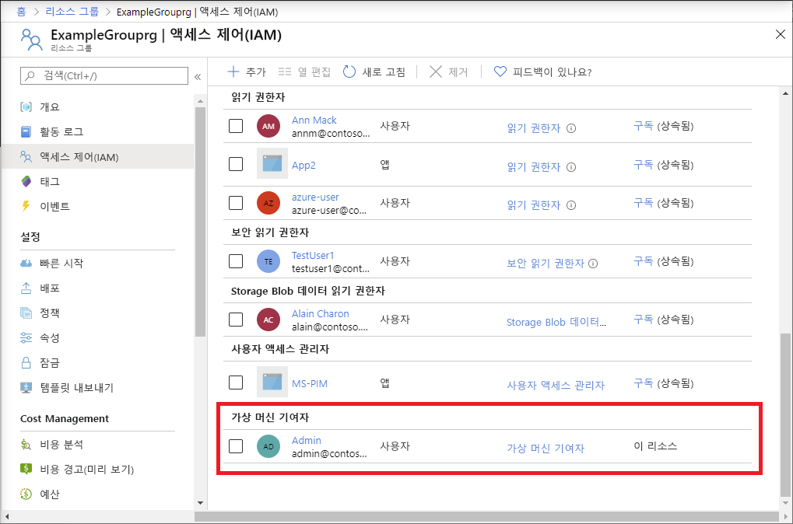

# <a name="quickstart-add-an-azure-role-assignment-using-an-arm-template"></a>빠른 시작: ARM 템플릿을 사용하여 Azure 역할 할당 추가

[Azure RBAC(Azure 역할 기반 액세스 제어)](overview.md)는 Azure 리소스에 대한 액세스를 관리하는 방법입니다. 이 빠른 시작에서는 리소스 그룹을 만들고 리소스 그룹에서 Virtual Machine을 만들고 관리할 수 있는 액세스 권한을 사용자에게 부여합니다. 이 빠른 시작에서는 ARM 템플릿(Azure Resource Manager 템플릿)을 사용하여 액세스 권한을 부여합니다.

[!INCLUDE [About Azure Resource Manager](../../includes/resource-manager-quickstart-introduction.md)]

환경이 필수 구성 요소를 충족하고 ARM 템플릿 사용에 익숙한 경우 **Azure에 배포** 단추를 선택합니다. 그러면 Azure Portal에서 템플릿이 열립니다.

[](https://portal.azure.com/#create/Microsoft.Template/uri/https%3A%2F%2Fraw.githubusercontent.com%2FAzure%2Fazure-quickstart-templates%2Fmaster%2F101-rbac-builtinrole-resourcegroup%2Fazuredeploy.json)

## <a name="prerequisites"></a>필수 구성 요소

역할 할당을 추가하려면 다음이 필요합니다.

- Azure 구독이 아직 없는 경우 시작하기 전에 [체험 계정](https://azure.microsoft.com/free/?WT.mc_id=A261C142F)을 만듭니다.
- `Microsoft.Authorization/roleAssignments/write` 및 `Microsoft.Authorization/roleAssignments/delete` 사용 권한(예: [사용자 액세스 관리자](built-in-roles.md#user-access-administrator) 또는 [소유자](built-in-roles.md#owner))
- 역할 할당을 추가하려면 보안 주체, 역할 정의 및 범위의 세 가지 요소를 지정해야 합니다. 이 빠른 시작에서 보안 주체는 사용자 또는 사용자 디렉터리에 있는 다른 사용자이며, 역할 정의는 [Virtual Machine 기여자](built-in-roles.md#virtual-machine-contributor)이고, 범위는 사용자가 지정하는 리소스 그룹입니다.

## <a name="review-the-template"></a>템플릿 검토

이 빠른 시작에서 사용되는 템플릿은 [Azure 빠른 시작 템플릿](https://azure.microsoft.com/resources/templates/101-rbac-builtinrole-resourcegroup/)에서 나온 것입니다. 템플릿에는 3개의 매개 변수와 1개의 리소스 섹션이 있습니다. 리소스 섹션에서 역할 할당의 세 요소인 보안 주체, 역할 정의 및 범위가 포함된 것을 확인하세요.

:::code language="json" source="~/quickstart-templates/101-rbac-builtinrole-resourcegroup/azuredeploy.json":::

템플릿에 정의된 리소스는 다음과 같습니다.

- [Microsoft.Authorization/roleAssignments](/azure/templates/Microsoft.Authorization/roleAssignments)

## <a name="deploy-the-template"></a>템플릿 배포

1. [Azure Portal](https://portal.azure.com)에 로그인합니다.

1. Azure 구독과 연결된 이메일 주소를 선택합니다. 또는 디렉터리에 있는 다른 사용자의 이메일 주소를 선택합니다.

1. PowerShell을 위한 Azure Cloud Shell을 엽니다.

1. 다음 스크립트를 복사하여 Cloud Shell에 붙여넣습니다.

    ```azurepowershell
    $resourceGroupName = Read-Host -Prompt "Enter a resource group name (i.e. ExampleGrouprg)"
    $emailAddress = Read-Host -Prompt "Enter an email address for a user in your directory"
    $location = Read-Host -Prompt "Enter a location (i.e. centralus)"
    
    $roleAssignmentName = New-Guid
    $principalId = (Get-AzAdUser -Mail $emailAddress).id
    $roleDefinitionId = (Get-AzRoleDefinition -name "Virtual Machine Contributor").id
    $templateUri = "https://raw.githubusercontent.com/Azure/azure-quickstart-templates/master/101-rbac-builtinrole-resourcegroup/azuredeploy.json"
    
    New-AzResourceGroup -Name $resourceGroupName -Location $location
    New-AzResourceGroupDeployment -ResourceGroupName $resourceGroupName -TemplateUri $templateUri -roleAssignmentName $roleAssignmentName -roleDefinitionID $roleDefinitionId -principalId $principalId
    ```

1. 리소스 그룹 이름(예:ExampleGrouprg)을 입력합니다.

1. 사용자 자신 또는 디렉터리에 있는 다른 사용자의 이메일 주소를 입력합니다.

1. 리소스 그룹의 위치(예: centralus)를 입력합니다.

1. 필요한 경우 Enter 키를 눌러 New-AzResourceGroupDeployment 명령을 실행합니다.

    [New-AzResourceGroup](/powershell/module/az.resources/new-azresourcegroup) 명령은 새 리소스 그룹을 만들고 [New-AzResourceGroupDeployment](/powershell/module/az.resources/new-azresourcegroupdeployment) 명령은 템플릿을 배포하여 역할 할당을 추가합니다.

    다음과 비슷한 내용이 출력됩니다.

    ```azurepowershell
    PS> New-AzResourceGroupDeployment -ResourceGroupName $resourceGroupName -TemplateUri $templateUri -roleAssignmentName $roleAssignmentName -roleDefinitionID $roleDefinitionId -principalId $principalId
    
    DeploymentName          : azuredeploy
    ResourceGroupName       : ExampleGrouprg
    ProvisioningState       : Succeeded
    Timestamp               : 5/22/2020 9:01:30 PM
    Mode                    : Incremental
    TemplateLink            :
                              Uri            : https://raw.githubusercontent.com/Azure/azure-quickstart-templates/master/101-rbac-builtinrole-resourcegroup/azuredeploy.json
                              ContentVersion : 1.0.0.0
    
    Parameters              :
                              Name                  Type                       Value
                              ====================  =========================  ==========
                              roleAssignmentName    String                     {roleAssignmentName}
                              roleDefinitionID      String                     9980e02c-c2be-4d73-94e8-173b1dc7cf3c
                              principalId           String                     {principalId}
    
    Outputs                 :
    DeploymentDebugLogLevel :
    ```

## <a name="review-deployed-resources"></a>배포된 리소스 검토

1. Azure Portal에서 사용자가 만든 리소스 그룹을 엽니다.

1. 왼쪽 메뉴에서 **액세스 제어(IAM)** 를 클릭합니다.

1. **역할 할당** 탭을 클릭합니다.

1. **Virtual Machine 기여자** 역할이 지정된 사용자에게 할당되었는지 확인합니다.

   

## <a name="clean-up-resources"></a>리소스 정리

생성된 역할 할당 및 리소스 그룹을 제거하려면 다음 단계를 따르세요.

1. 다음 스크립트를 복사하여 Cloud Shell에 붙여넣습니다.

    ```azurepowershell
    $emailAddress = Read-Host -Prompt "Enter the email address of the user with the role assignment to remove"
    $resourceGroupName = Read-Host -Prompt "Enter the resource group name to remove (i.e. ExampleGrouprg)"
    
    $principalId = (Get-AzAdUser -Mail $emailAddress).id
    
    Remove-AzRoleAssignment -ObjectId $principalId -RoleDefinitionName "Virtual Machine Contributor" -ResourceGroupName $resourceGroupName
    Remove-AzResourceGroup -Name $resourceGroupName
    ```
    
1. 제거하려는 역할 할당에 사용자의 이메일 주소를 입력합니다.

1. 제거하려는 리소스 그룹(예: ExampleGrouprg)을 입력합니다.

1. 필요한 경우 Enter 키를 눌러 Remove-AzResourceGroup 명령을 실행합니다.

1. 리소스 그룹 제거 확인을 위해 **Y**를 입력합니다.

## <a name="next-steps"></a>다음 단계

> [!div class="nextstepaction"]
> [자습서: Azure PowerShell을 사용하여 Azure 리소스에 대한 사용자 액세스 권한 부여](tutorial-role-assignments-user-powershell.md)