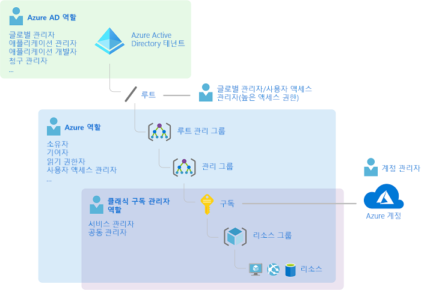
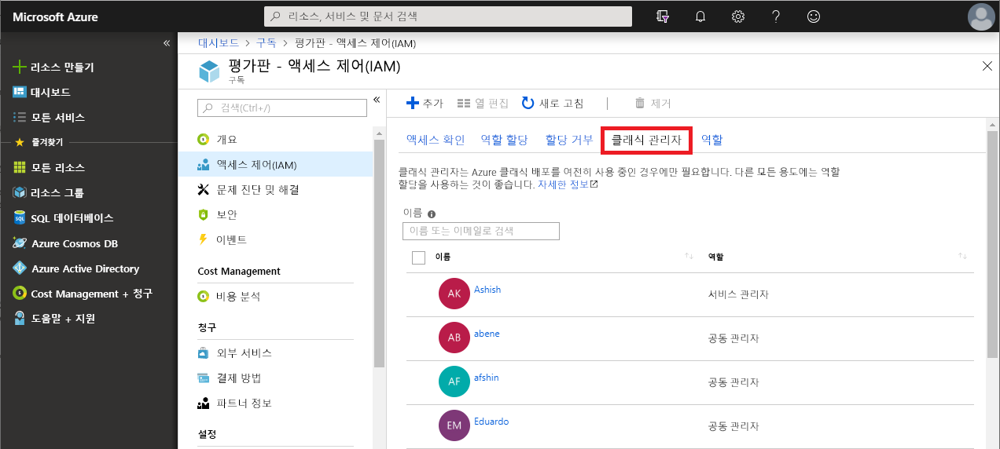
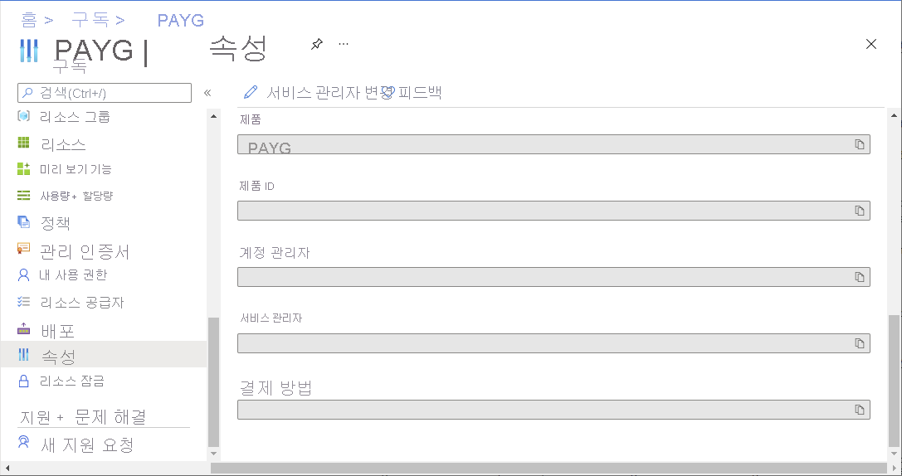
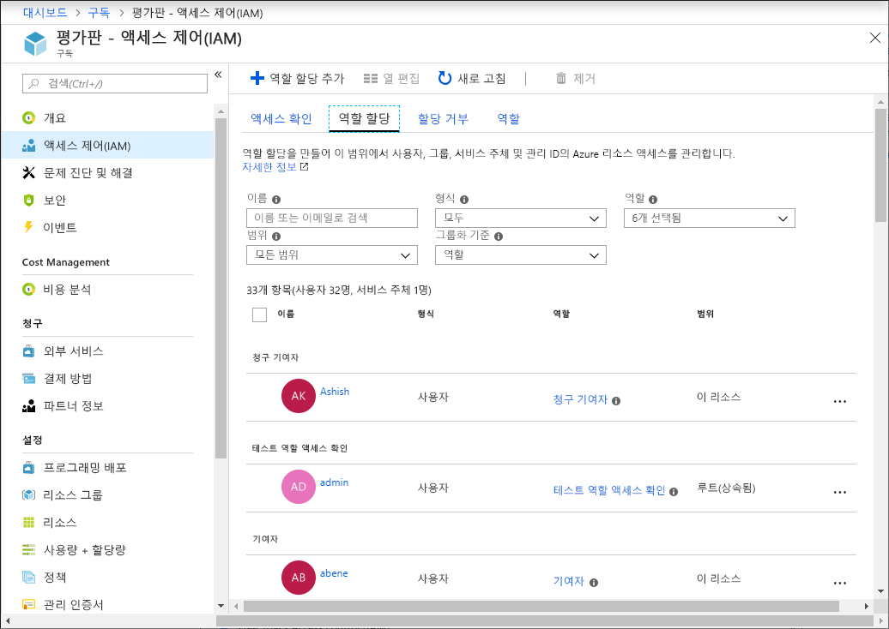
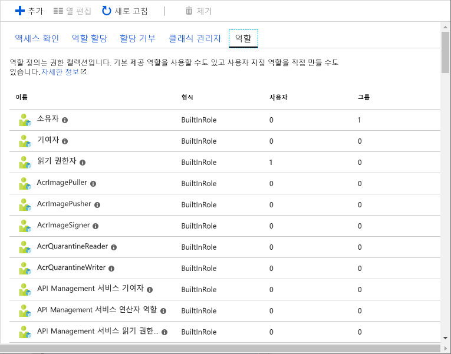
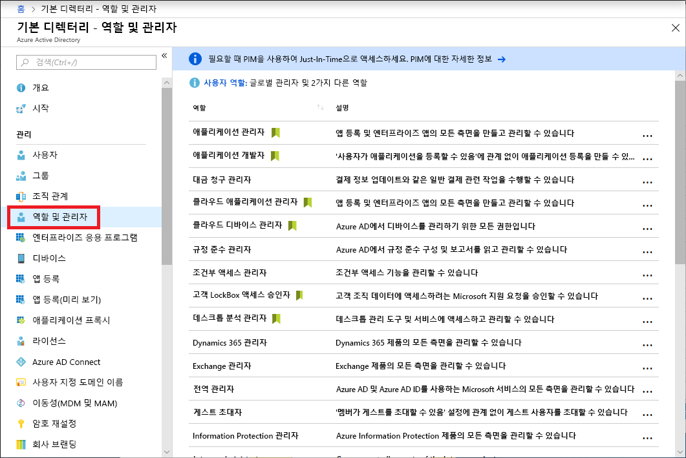
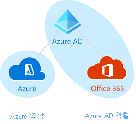

# 클래식 구독 관리자 역할, Azure RBAC 역할 및 Azure AD 관리자 역할

Azure를 처음 접하는 경우 Azure의 다양한 역할을 모두 이해하기가 약간 힘들 수 있습니다. 이 문서에서는 다음 역할에 대해 설명하고 각 역할의 사용 시기에 대해 설명합니다.
- 클래식 구독 관리자 역할
- Azure RBAC(역할 기반 액세스 제어) 역할
- Azure AD(Active Directory) 관리자 역할

## 역할이 관련되는 원리

Azure의 역할을 보다 정확하게 이해하려면 역사를 살펴보는 것이 좋습니다. Azure가 처음 릴리스되었을 때 계정 관리자, 서비스 관리자 및 공동 관리자만이 리소스 액세스 권한을 관리할 수 있었습니다. 이후 Azure 리소스에 대한 RBAC(역할 기반 액세스 제어)가 추가되었습니다. Azure RBAC는 Azure 리소스에 대한 액세스를 세밀하게 관리할 수 있는 새로운 권한 부여 시스템입니다. RBAC는 여러 범위에서 할당할 수 있는 기본 제공 역할을 많이 포함하고 있으며, 고유의 사용자 지정 역할을 만들 수 있습니다. Azure AD에서 사용자, 그룹, 도메인 등의 리소스를 관리할 수 있도록 여러 Azure AD 관리자 역할이 있습니다.

다음 다이어그램은 클래식 구독 관리자 역할, Azure RBAC 역할 및 Azure AD 관리자 역할의 관계를 개략적으로 보여줍니다.

## 클래식 구독 관리자 역할

계정 관리자, 서비스 관리자 및 공동 관리자는 Azure에 있는 세 가지 클래식 구독 관리자 역할입니다. 클래식 구독 관리자는 Azure 구독에 대한 모든 권한을 보유합니다. 이들은 Azure Portal, Azure Resource Manager API 및 클래식 배포 모델 API를 사용하여 리소스를 관리할 수 있습니다. Azure에 등록하는 데 사용된 계정은 자동으로 계정 관리자와 서비스 관리자로 설정됩니다. 그런 다음 공동 관리자를 추가할 수 있습니다. 서비스 관리자 및 공동 관리자는 구독 범위에서 소유자 역할(Azure RBAC 역할)이 할당된 사용자와 동일한 액세스 권한을 갖습니다. 다음 표에서는 이러한 세 가지 클래식 구독 관리 역할의 차이점을 설명합니다.

| 클래식 구독 관리자 | 제한 | 권한 | 메모 |
| --- | --- | --- | --- |
| 계정 관리자 | Azure 계정당 1개 | <ul><li>[Azure 계정 센터](https://account.azure.com/Subscriptions)에 액세스</li><li>계정의 모든 구독 관리</li><li>새 구독 만들기</li><li>구독 취소</li><li>구독 요금 청구 변경</li><li>서비스 관리자 변경</li></ul> | 개념적으로 구독의 청구 소유자입니다. 계정 관리자는 Azure Portal에 액세스할 수 없습니다. |
| 서비스 관리자 | Azure 구독당 1개 | <ul><li>[Azure Portal](https://portal.azure.com)에서 서비스 관리</li><li>사용자를 공동 관리자 역할에 할당</li></ul> | 기본적으로 새 구독의 경우 계정 관리자가 서비스 관리자이기도 합니다. 서비스 관리자는 구독 범위에서 소유자 역할이 할당된 사용자와 동일한 액세스 권한을 갖습니다. 서비스 관리자는 Azure Portal에 대해 모든 권한을 갖습니다. |
| 공동 관리자 | 구독당 200 | <ul><li>서비스 관리자와 동일한 액세스 권한을 갖지만, Azure 디렉터리에 대한 구독의 연결을 변경할 수 없습니다.</li><li>사용자를 공동 관리자 역할에 할당할 수 있지만, 서비스 관리자를 변경할 수 없습니다.</li></ul> | 공동 관리자는 구독 범위에서 소유자 역할이 할당된 사용자와 동일한 액세스 권한을 갖습니다. |

Azure Portal에서 **클래식 관리자** 탭을 사용하여 공동 관리자를 관리하거나 서비스 관리자를 볼 수 있습니다.

Azure Portal에서 구독의 속성 블레이드에서 서비스 관리자를 보거나 변경하거나 계정 관리자를 볼 수 있습니다.

자세한 내용은 [Azure 클래식 구독 관리자](classic-administrators.md)를 참조하세요.

### Azure 계정 및 Azure 구독

Azure 계정은 청구 관계를 나타냅니다. Azure 계정은 사용자 ID이자, 하나 이상의 Azure 구독이자, 연결된 Azure 리소스 집합입니다. 계정을 만드는 사람은 해당 계정에서 만든 모든 구독의 계정 관리자입니다. 이 사람은 구독의 기본 서비스 관리자이기도 합니다.

Azure 구독을 사용하여 Azure 리소스에 대한 액세스를 구성할 수 있습니다. 리소스 사용을 보고하고, 요금을 청구하고, 지불하는 방식을 제어할 수도 있습니다. 각 구독은 청구 및 지불 설정이 다를 수 있으므로 사무실, 부서, 프로젝트 등에 따라 구독 및 계획이 다를 수 있습니다. 모든 서비스는 구독에 소속되며, 구독 ID는 프로그래밍 방식 작업에 필요할 수 있습니다.

계정 및 구독은 [Azure 계정 센터](https://account.azure.com/Subscriptions)에서 관리합니다.

## Azure RBAC 역할

Azure RBAC는 [Azure Resource Manager](../azure-resource-manager/resource-group-overview.md) 기반의 권한 부여 시스템으로, 계산 및 저장소 같은 Azure 리소스에 대한 액세스를 세밀하게 관리할 수 있습니다. Azure RBAC에는 70개가 넘는 기본 제공 역할이 포함되어 있습니다. 네 가지 기본 RBAC 역할이 있습니다. 처음 세 개는 모든 리소스 종류에 적용됩니다.

| Azure RBAC 역할 | 권한 | 메모 |
| --- | --- | --- |
| [소유자](built-in-roles.md#owner) | <ul><li>모든 리소스에 대한 전체 액세스 권한</li><li>다른 사람에게 액세스 권한을 위임 가능</li></ul> | 서비스 관리자 및 공동 관리자에게 구독 범위에서 소유자 역할이 할당됨 모든 리소스 종류에 적용됩니다. |
| [기여자](built-in-roles.md#contributor) | <ul><li>모든 종류의 Azure 리소스를 만들고 관리</li><li>다른 사람에게 액세스 권한을 부여할 수 없음</li></ul> | 모든 리소스 종류에 적용됩니다. |
| [판독기](built-in-roles.md#reader) | <ul><li>Azure 리소스 보기</li></ul> | 모든 리소스 종류에 적용됩니다. |
| [사용자 액세스 관리자](built-in-roles.md#user-access-administrator) | <ul><li>Azure 리소스에 대한 사용자 액세스 관리</li></ul> |  |

나머지 기본 제공 역할은 특정 Azure 리소스의 관리를 허용합니다. 예를 들어 [Virtual Machine 기여자](built-in-roles.md#virtual-machine-contributor) 역할을 사용하면 사용자가 가상 머신을 만들고 관리할 수 있습니다. 기본 제공 역할의 전체 목록은 [Azure 리소스에 대한 기본 제공 역할](built-in-roles.md)을 참조하세요.

Azure Portal 및 Azure Resource Manager API만이 Azure RBAC를 지원합니다. RBAC 역할이 할당된 사용자, 그룹 및 애플리케이션은 [Azure 클래식 배포 모델 API](../azure-resource-manager/resource-manager-deployment-model.md)를 사용할 수 없습니다.

Azure Portal에서 RBAC를 사용하는 역할 할당은 **액세스 제어(IAM)** 블레이드에 나타납니다. 이 블레이드는 관리 그룹, 구독, 리소스 그룹 및 다양한 리소스와 같은 포털 전체에서 찾을 수 있습니다.

**역할** 탭을 클릭하면 기본 제공 역할 및 사용자 지정 역할 목록이 표시됩니다.

자세한 내용은 [RBAC 및 Azure Portal을 사용하여 Azure 리소스에 대한 액세스 관리](role-assignments-portal.md)를 참조하세요.

## Azure AD 관리자 역할

Azure AD 관리자 역할은 사용자 만들기 또는 편집, 다른 사용자에게 관리 역할 할당, 사용자 암호 다시 설정, 사용자 라이선스 관리, 도메인 관리 등 디렉터리의 Azure AD 리소스를 관리하는 데 사용됩니다. 다음 표에서는 보다 중요한 몇 가지 Azure AD 관리자 역할에 대해 설명합니다.

| Azure AD 관리자 역할 | 권한 | 메모 |
| --- | --- | --- |
| [전역 관리자](../active-directory/users-groups-roles/directory-assign-admin-roles.md#company-administrator) | <ul><li>Azure Active Directory에 페더레이션하는 서비스를 비롯하여 Azure Active Directory의 모든 관리 기능에 대한 액세스 관리</li><li>다른 사람에게 관리자 역할 할당</li><li>모든 사용자 및 다른 관리자의 암호 다시 설정</li></ul> | Azure Active Directory 테넌트에 등록하는 사람이 전역 관리자가 됩니다. |
| [사용자 관리자](../active-directory/users-groups-roles/directory-assign-admin-roles.md#user-administrator) | <ul><li>사용자 및 그룹과 관련된 모든 것을 만들고 관리</li><li>지원 티켓 관리</li><li>서비스 상태 모니터링</li><li>사용자, 기술 지원팀 관리자 및 다른 사용자 관리자의 암호 변경</li></ul> |  |
| [대금 청구 관리자](../active-directory/users-groups-roles/directory-assign-admin-roles.md#billing-administrator) | <ul><li>구매</li><li>구독 관리</li><li>지원 티켓 관리</li><li>서비스 상태 모니터링</li></ul> |  |

Azure Portal의 **역할 및 관리자** 블레이드에서 Azure AD 관리자 역할 목록을 볼 수 있습니다. Azure AD 관리자 역할의 전체 목록은 [Azure Active Directory에서 관리자 역할 사용 권한](../active-directory/users-groups-roles/directory-assign-admin-roles.md)을 참조하세요.

## Azure RBAC 역할과 Azure AD 관리자 역할의 차이점

간단하게 보자면, Azure RBAC 역할은 Azure 리소스를 관리하는 권한을 제어하고, Azure AD 관리자 역할은 Azure Active Directory 리소스를 관리하는 권한을 제어합니다. 다음 표에서는 몇 가지 차이점을 비교합니다.

| Azure RBAC 역할 | Azure AD 관리자 역할 |
| --- | --- |
| Azure 리소스에 대한 액세스 관리 | Azure Active Directory 리소스에 대한 액세스 관리 |
| 사용자 지정 역할 지원 | 고유의 역할을 만들 수 없음 |
| 여러 수준(관리 그룹, 구독, 리소스 그룹, 리소스)에서 범위를 지정할 수 있음 | 범위는 테넌트 수준 |
| Azure Portal, Azure CLI, Azure PowerShell, Azure Resource Manager 템플릿, REST API에서 역할 정보에 액세스 가능 | 역할 정보는 Azure 관리 포털, Microsoft 365 관리 센터, Microsoft Graph, Azure AD PowerShell에서 액세스할 수 있음 |

### Azure RBAC 역할과 Azure AD 관리자 역할이 겹치나요?

기본적으로 Azure RBAC 역할과 Azure AD 관리자 역할은 Azure 및 Azure AD를 다루지 않습니다. 그러나 전역 관리자가 Azure Portal에서 **전역 관리자는 Azure 구독 및 관리 그룹을 관리할 수 있습니다.** 스위치를 선택하여 액세스 권한을 높이면 전역 관리자에게 특정 테넌트의 모든 구독에 대한 [사용자 액세스 관리자](built-in-roles.md#user-access-administrator) 역할(RBAC 역할)이 부여됩니다. 사용자 액세스 관리자 역할은 사용자가 다른 사용자에게 Azure 리소스에 대한 액세스 권한을 부여할 수 있게 해줍니다. 이 스위치는 구독에 대한 액세스 권한을 다시 얻고자 할 때 유용하게 사용할 수 있습니다. 자세한 내용은 [Azure AD 관리자로 액세스 권한 상승](elevate-access-global-admin.md)을 참조하세요.

여러 Azure AD 관리자 역할은 전역 관리자 및 사용자 관리자 역할 같은 Azure AD 및 Microsoft Office 365를 포괄합니다. 예를 들어 전역 관리자 역할의 구성원은 Azure AD 및 Office 365에서 Microsoft Exchange와 Microsoft SharePoint를 변경하는 등의 전역 관리자 기능을 사용할 수 있습니다. 그러나 기본적으로 전역 관리자는 Azure 리소스에 액세스할 수 없습니다.

## 다음 단계

- [Azure 리소스에 대한 RBAC(역할 기반 액세스 제어)란?](overview.md)
- [Azure Active Directory의 관리자 역할 사용 권한](../active-directory/users-groups-roles/directory-assign-admin-roles.md)
- [Azure 클래식 구독 관리자](classic-administrators.md)
