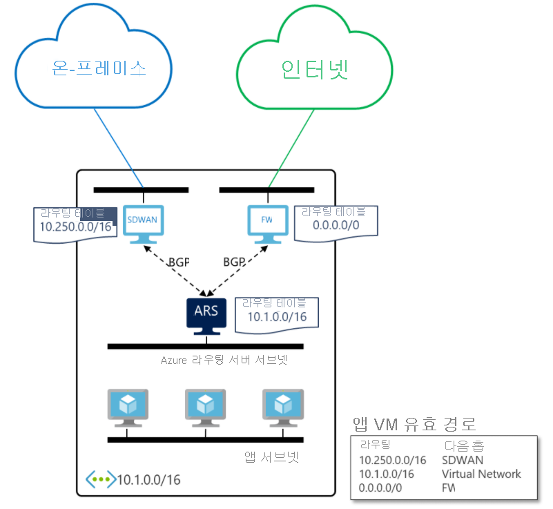

# Azure Route Server(미리 보기)란? 

Azure Route Server는 NVA(네트워크 가상 어플라이언스)와 가상 네트워크 간의 동적 라우팅을 간소화합니다. 이를 통해 경로 테이블을 수동으로 구성하거나 유지 관리할 필요없이 BGP(Border Gateway Protocol) 라우팅 프로토콜을 지원하는 NVA와 Azure VNET(Virtual Network)의 Azure SDN(소프트웨어 정의 네트워크) 사이에서 BGP 라우팅 프로토콜을 통해 직접 라우팅 정보를 교환할 수 있습니다. Azure Route Server는 완전 관리형 서비스이며 고가용성으로 구성되어 있습니다.

> [!IMPORTANT]
> Azure Route Server(미리 보기)는 현재 퍼블릭 미리 보기로 제공됩니다.
> 이 미리 보기 버전은 서비스 수준 계약 없이 제공되며 프로덕션 워크로드에는 사용하지 않는 것이 좋습니다. 특정 기능이 지원되지 않거나 기능이 제한될 수 있습니다.
> 자세한 내용은 [Microsoft Azure Preview에 대한 추가 사용 약관](https://azure.microsoft.com/support/legal/preview-supplemental-terms/)을 참조하세요.

## 작동 원리

다음 다이어그램은 Azure Route Server가 가상 네트워크에서 SDWAN NVA 및 보안 NVA와 작동하는 방식을 보여 줍니다. BGP 피어링을 설정하면 Azure Route Server는 SDWAN 어플라이언스에서 온-프레미스 경로(10.250.0.0/16)를 받고 방화벽에서 기본 경로(0.0.0.0/0)를 받습니다. 이러한 경로는 가상 네트워크의 VM에서 자동으로 구성됩니다. 따라서 온-프레미스 네트워크로 향하는 모든 트래픽이 SDWAN 어플라이언스로 전송됩니다. 반면에 모든 인터넷 바인딩 트래픽은 방화벽으로 전송됩니다. 반대 방향으로 Azure Route Server는 가상 네트워크 주소(10.1.0.0/16)를 두 NVA로 보냅니다. SDWAN 어플라이언스는 이러한 주소를 온-프레미스 네트워크에 추가로 전파할 수 있습니다.

## 주요 이점 

Azure Route Server는 가상 네트워크에서 NVA의 구성, 관리 및 배포를 간소화합니다.  

* 가상 네트워크 주소가 업데이트될 때마다 NVA에서 라우팅 테이블을 수동으로 업데이트할 필요는 없습니다. 

* NVA가 새 경로를 알리거나 이전 경로를 취소할 때마다 더 이상 [사용자 정의 경로](../virtual-network/virtual-networks-udr-overview.md)를 수동으로 업데이트하지 않아도 됩니다. 

* 복원력 또는 성능 목적을 위해 NVA 앞에서 더 이상 부하 분산 장치를 구성할 필요가 없습니다. Azure Route Server와 NVA의 여러 인스턴스를 피어링하는 경우 NVA에서 BGP 특성을 구성할 수 있습니다. 이러한 BGP 특성은 활성 또는 수동이어야 하는 NVA 인스턴스를 Azure Route Server에 알려줍니다. 

* NVA와 Azure Route Server 간의 인터페이스는 일반적인 표준 프로토콜을 기준으로 합니다. NVA가 BGP를 지원하기만 한다면 Azure Route Server와 피어링할 수 있습니다. 자세한 내용은 [Route Server 지원 라우팅 프로토콜](route-server-faq.md#protocol)을 참조하세요.

* 새 가상 네트워크 또는 기존 가상 네트워크에 Azure Route Server를 배포할 수 있습니다. 

## FAQ

Azure Route Server에 대한 자주 묻는 질문은 [Azure Route Server FAQ](route-server-faq.md)를 참조하세요.

## 다음 단계

- [Azure Route Server를 구성하는 방법 알아보기](quickstart-configure-route-server-powershell.md)
- [Azure Route Server가 Azure ExpressRoute 및 Azure VPN에서 작동하는 방식 알아보기](expressroute-vpn-support.md)
