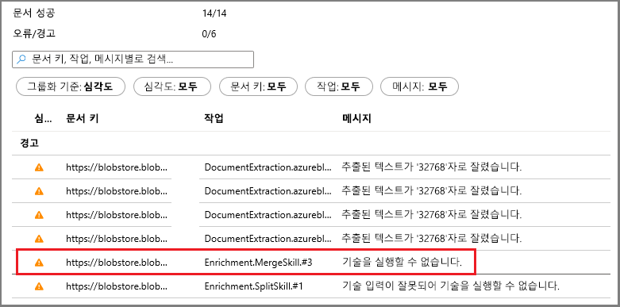
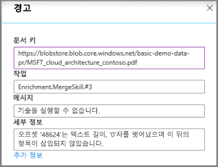

# 빠른 시작: Azure Portal에서 Azure Cognitive Search 인지 기술 세트 만들기

기술 세트는 크고 차별화되지 않은 텍스트 또는 이미지 파일에서 정보와 구조를 추출하여 전체 텍스트 검색 쿼리를 위해 Azure Cognitive Search에서 이를 인덱싱하고 검색할 수 있도록 하는 AI 기능입니다. 

이 빠른 시작에서는 Azure 클라우드에서 서비스와 데이터를 결합하여 기술 세트를 만듭니다. 모든 것이 준비되면 포털에서 **데이터 가져오기** 마법사를 실행하여 모두 가져옵니다. 최종 결과는 포털([Search 탐색기](search-explorer.md))에서 쿼리할 수 있는 AI 처리에서 만든 데이터로 채워진 검색 가능한 인덱스입니다.

Azure 구독이 아직 없는 경우 시작하기 전에 [체험 계정](https://azure.microsoft.com/free/?WT.mc_id=A261C142F)을 만듭니다.

## 서비스 만들기 및 데이터 로드

이 빠른 시작에서는 Azure Cognitive Search, [Azure Blob 스토리지](https://docs.microsoft.com/azure/storage/blobs/) 및 [Azure Cognitive Services](https://azure.microsoft.com/services/cognitive-services/)를 AI에 사용합니다. 

워크로드가 너무 작으므로 Cognitive Services는 Azure Cognitive Search에서 호출될 때 매일 인덱스당 최대 20개의 트랜잭션을 무료로 처리하기 위해 백그라운드에 탭으로 처리됩니다. 제공하는 샘플 데이터를 사용하는 경우 Cognitive Services 리소스 만들기 또는 연결을 건너뛸 수 있습니다.

1. 여러 종류의 작은 파일 집합으로 구성된 [샘플 데이터를 다운로드](https://1drv.ms/f/s!As7Oy81M_gVPa-LCb5lC_3hbS-4)하세요. 파일의 압축을 풉니다.

1. [Azure 스토리지 계정을 만들](https://docs.microsoft.com/azure/storage/common/storage-quickstart-create-account?tabs=azure-portal)거나 [기존 계정을 찾습니다](https://ms.portal.azure.com/#blade/HubsExtension/BrowseResourceBlade/resourceType/Microsoft.Storage%2storageAccounts/). 

   대역폭 요금이 부과되지 않도록 Azure Cognitive Search와 동일한 지역을 선택합니다. 
   
   나중에 다른 연습에서 지식 저장소 기능을 사용해 보려면 StorageV2(범용 V2) 계정 유형을 선택합니다. 그렇지 않으면 임의의 유형을 선택합니다.

1. Blob 서비스 페이지를 열고 컨테이너를 만듭니다. 기본 퍼블릭 액세스 수준을 사용할 수 있습니다. 

1. 컨테이너에서 **업로드**를 클릭하여 첫 번째 단계에서 다운로드한 샘플 파일을 업로드합니다. 전체 텍스트를 해당 네이티브 형식으로 검색할 수 없는 이미지와 애플리케이션 파일을 포함하여 다양한 콘텐츠 형식이 있습니다.

   

1. [Azure Cognitive Search 서비스를 만들](search-create-service-portal.md)거나 [기존 서비스를 찾습니다](https://ms.portal.azure.com/#blade/HubsExtension/BrowseResourceBlade/resourceType/Microsoft.Search%2FsearchServices). 이 빠른 시작에서는 체험 서비스를 사용할 수 있습니다.

이제 데이터 가져오기 마법사로 이동할 준비가 되었습니다.

## 데이터 가져오기 마법사 실행

검색 서비스 [개요] 페이지의 명령 모음에서 **데이터 가져오기**를 클릭하여 다음 4개의 단계를 통해 인지 보강을 설정합니다.

  

### 1단계: 데이터 원본 만들기

1. **데이터에 연결**에서 **Azure Blob 스토리지**를 선택하고, 만든 스토리지 계정과 컨테이너를 선택합니다. 데이터 원본의 이름을 지정하고, 나머지는 기본값을 사용합니다. 

   

    다음 페이지를 계속합니다.

### 2단계: 인식 기술 추가

다음으로, OCR, 이미지 분석 및 자연어 처리를 호출하도록 AI 보강을 구성합니다. 

1. 이 빠른 시작에서는 **체험** Cognitive Services 리소스를 사용합니다. 샘플 데이터는 14개의 파일로 구성되어 있으므로 이 빠른 시작에서는 Cognitive Services에서 20개의 트랜잭션을 무료로 할당하는 것으로 충분합니다. 

   

1. **보강 추가**를 확장하고 4개를 선택합니다. 

   마법사 페이지에 이미지 분석 기술을 추가하려면 OCR을 사용하도록 설정합니다.

   세분성을 페이지로 설정하여 텍스트를 더 작은 청크로 분할합니다. 여러 텍스트 기술은 5KB 입력으로 제한됩니다.

   엔터티 인식(사람, 조직 및 위치)과 이미지 분석 기술을 선택합니다.

   

   다음 페이지를 계속합니다.

### 3단계 - 인덱스 구성

인덱스는 검색 가능한 콘텐츠를 포함하고 있으며, **데이터 가져오기** 마법사는 일반적으로 데이터 원본을 샘플링하여 스키마를 만들 수 있습니다. 이 단계에서는 생성된 스키마를 검토하고, 잠재적으로 설정을 수정할 수 있습니다. 데모 Blob 데이터 세트에 대해 만들어진 기본 스키마는 다음과 같습니다.

이 빠른 시작에서 마법사는 기본값을 적절하게 설정합니다.  

+ 기본 필드는 기존 Blob의 속성과 보강 출력을 포함하는 새 필드(예: `people`, `organizations`, `locations`)를 기반으로 합니다. 데이터 형식은 메타데이터 및 데이터 샘플링에서 유추됩니다.

+ 기본 문서 키는 *metadata_storage_path*입니다(필드에 고유 값이 포함되어 있으므로 선택됨).

+ 기본 특성은 **조회 가능**하고 **검색 가능**합니다. **검색 가능**은 필드의 전체 텍스트 검색을 허용합니다. **조회 가능**은 필드 값을 결과에 반환할 수 있다는 뜻입니다. 마법사는 사용자가 기술 세트를 통해 필드를 생성했기 때문에 이 필드를 조회 및 검색 가능하도록 하려고 한다고 가정합니다.

  

`content` 필드의 **조회 가능** 특성에서 취소선과 물음표를 확인합니다. 텍스트가 많은 Blob 문서의 경우, `content` 필드에는 대량의 파일이 포함되어 있으며, 수천 줄이 포함될 수 있습니다. 이와 같은 필드는 검색 결과에서 다루기 어렵기 때문에 이 데모에서는 제외해야 합니다. 

그러나 파일 내용을 클라이언트 코드에 전달해야 하는 경우에는 **조회 가능**이 선택되어 있는지 확인합니다. 그렇지 않은 경우 추출된 요소(`people`, `organizations`, `locations` 등)가 충분하면 `content`에서 이 특성을 선택 취소하는 것이 좋습니다.

필드를 **조회 가능**으로 표시한다고 해서 필드가 검색 결과에 *나타나야* 하는 것은 아닙니다. **$select** 쿼리 매개 변수로 포함할 필드를 지정하여 검색 결과의 구성을 정확하게 제어할 수 있습니다. `content`와 같이 텍스트가 많은 필드의 경우 **$select** 매개 변수는 애플리케이션의 사용자에게 관리 가능한 검색 결과를 제공하는 솔루션으로, 클라이언트 코드에서 **조회 가능** 특성을 통해 필요한 모든 정보에 액세스할 수 있도록 해줍니다.
  
다음 페이지를 계속합니다.

### 4단계 - 인덱서 구성

인덱서는 인덱싱 프로세스를 구동하는 상위 수준 리소스입니다. 인덱서는 데이터 원본 이름, 대상 인덱스 및 실행 빈도를 지정합니다. **데이터 가져오기** 마법사는 여러 개체를 만들고, 항상 이러한 개체 중에서 반복적으로 실행할 수 있는 인덱서입니다.

1. **인덱서** 페이지에서 기본 이름을 적용하고, **한 번** 일정 옵션을 클릭하여 즉시 실행할 수 있습니다. 

   

1. **제출**을 클릭하여 인덱서를 만드는 동시에 실행합니다.

## 상태 모니터링

인지 기술 인덱싱은 일반적인 텍스트 기반 인덱싱보다 완료하는 데 더 오래 걸리며, OCR 및 이미지 분석이 특히 오래 걸립니다. 진행 상황을 모니터링하려면 [개요] 페이지로 이동하여 페이지 가운데에서 **인덱서**를 클릭합니다.

  

콘텐츠 형식이 광범위하기 때문에 경고가 발생하는 것이 정상입니다. 일부 콘텐츠 형식은 특정 기술에 적합하지 않으며 하위 계층에서는 [인덱서 제한](search-limits-quotas-capacity.md#indexer-limits)에 도달하기 쉽습니다. 예를 들어 32,000자 잘림 알림은 체험 계층의 인덱서 제한입니다. 더 높은 계층에서 이 데모를 실행하면 많은 잘림 경고가 사라집니다.

경고 또는 오류를 확인하려면 인덱서 목록에서 경고 상태를 클릭하여 실행 기록 페이지를 엽니다.

이 페이지에서 경고 상태를 다시 클릭하여 아래와 비슷한 경고 목록을 봅니다. 

  

특정 상태 줄을 클릭하면 세부 정보가 표시됩니다. 이 경고는 최대 임계값에 도달한 후 병합이 중지되었음을 의미 합니다(이 PDF가 크기 때문에).

  

## Search 탐색기에서 쿼리

인덱스가 생성된 후에는 쿼리를 실행하여 결과를 반환할 수 있습니다. 이 작업의 경우 포털에서 **검색 탐색기**를 사용합니다. 

1. 검색 서비스 대시보드 페이지의 명령 모음에서 **Search 탐색기**를 클릭합니다.

1. 맨 위에서 **인덱스 변경**을 선택하고 앞에서 만든 인덱스를 선택합니다.

1. `search=Microsoft&$select=people,organizations,locations,imageTags`처럼 인덱스를 쿼리하는 검색 문자열을 입력합니다.

결과는 자세한 정보 표시가 가능하고 읽기 어려울 수 있는 JSON으로 반환되며, Azure Blob에서 오는 대용량 문서인 경우에 특히 그렇습니다. 이 도구를 검색하는 몇 가지 팁은 다음과 같습니다.

+ `$select`를 추가하여 결과에 포함할 필드를 지정합니다. 
+ JSON 내에서 특정 속성 또는 용어를 검색하려면 CTRL-F를 사용합니다.

쿼리 문자열은 대/소문자를 구분하므로 "알 수 없는 필드" 메시지가 표시되면 **필드** 또는 **인덱스 정의(JSON)** 를 검사하여 이름과 대/소문자를 확인합니다. 

  

## 핵심 내용

이제 첫 번째 기술 세트를 만들었으며, 사용자 고유의 데이터를 사용하여 보강된 검색 솔루션을 프로토타입하는 데 유용한 중요한 개념을 알아보았습니다.

여러분이 꼭 기억했으면 하는 주요 개념 중 하나는 Azure 데이터 원본에 대한 종속성입니다. 기술 세트는 인덱서에 바인딩되며, 인덱서는 Azure 및 원본 전용입니다. 이 빠른 시작에서는 Azure Blob Storage를 사용하지만 다른 Azure 데이터 원본도 가능합니다. 자세한 내용은 [Azure Cognitive Search의 인덱서](search-indexer-overview.md)를 참조하세요. 

또 다른 중요한 개념으로, 기술은 콘텐츠 형식에 대해 작동하며, 다른 형식의 콘텐츠를 사용하는 경우 일부 입력이 생략될 수 있습니다. 또한 많은 파일 또는 필드가 서비스 계층의 인덱서 한도를 초과할 수 있습니다. 이러한 이벤트가 발생할 때 경고가 표시되는 것이 일반적입니다. 

출력은 검색 인덱스로 전달되고, 인덱싱 중에 만들어진 이름-값 쌍과 인덱스의 개별 필드 간에 매핑됩니다. 내부적으로, 포털은 [주석](cognitive-search-concept-annotations-syntax.md)을 설정하고 [기술 집합](cognitive-search-defining-skillset.md)을 정의하여 작업 및 일반적인 흐름의 순서를 설정합니다. 이러한 단계는 포털에서 숨겨지지만, 코드 작성을 시할 때 이러한 개념이 중요합니다.

마지막으로, 인덱스를 쿼리하여 내용을 확인할 수 있는 방법을 알아보았습니다. 결국 Azure Cognitive Search에서 제공하는 검색 가능한 인덱스는 [간단](https://docs.microsoft.com/rest/api/searchservice/simple-query-syntax-in-azure-search)하거나 [완전히 확장](https://docs.microsoft.com/rest/api/searchservice/lucene-query-syntax-in-azure-search)된 쿼리 구문을 사용하여 쿼리할 수 있습니다. 보강된 필드를 포함하는 인덱스는 다른 인덱스와 비슷합니다. 원하는 경우 표준 또는 [사용자 지정 분석기](search-analyzers.md), [점수 매기기 프로필](https://docs.microsoft.com/rest/api/searchservice/add-scoring-profiles-to-a-search-index), [동의어](search-synonyms.md), [패싯 필터](search-filters-facets.md), 지역 검색, 기타 Azure Cognitive Search 기능을 통합할 수 있습니다.

## 리소스 정리

본인 소유의 구독으로 이 모듈을 진행하고 있는 경우에는 프로젝트가 끝날 때 여기서 만든 리소스가 계속 필요한지 확인하는 것이 좋습니다. 계속 실행되는 리소스에는 요금이 부과될 수 있습니다. 리소스를 개별적으로 삭제하거나 리소스 그룹을 삭제하여 전체 리소스 세트를 삭제할 수 있습니다.

왼쪽 탐색 창의 **모든 리소스** 또는 **리소스 그룹** 링크를 사용하여 포털에서 리소스를 찾고 관리할 수 있습니다.

무료 서비스를 사용하는 경우 인덱스, 인덱서, 데이터 원본 세 개로 제한됩니다. 포털에서 개별 항목을 삭제하여 제한 이하로 유지할 수 있습니다. 

> [!Tip]
> 이 연습을 반복하거나 다른 AI 보강 연습을 수행하려면 포털에서 인덱서를 삭제합니다. 인덱서를 삭제하면 Cognitive Services 처리를 위해 무료 일별 트랜잭션 카운터가 0으로 다시 설정됩니다.

## 다음 단계

포털, .NET SDK 또는 REST API를 사용하여 기술 세트를 만들 수 있습니다. 더 자세히 알아보려면 Postman과 더 많은 샘플 데이터를 통해 REST API를 사용해 보세요.

> [!div class="nextstepaction"]
> [자습서: REST API를 사용하여 JSON Blob에서 텍스트 및 구조 추출 ](cognitive-search-tutorial-blob.md)