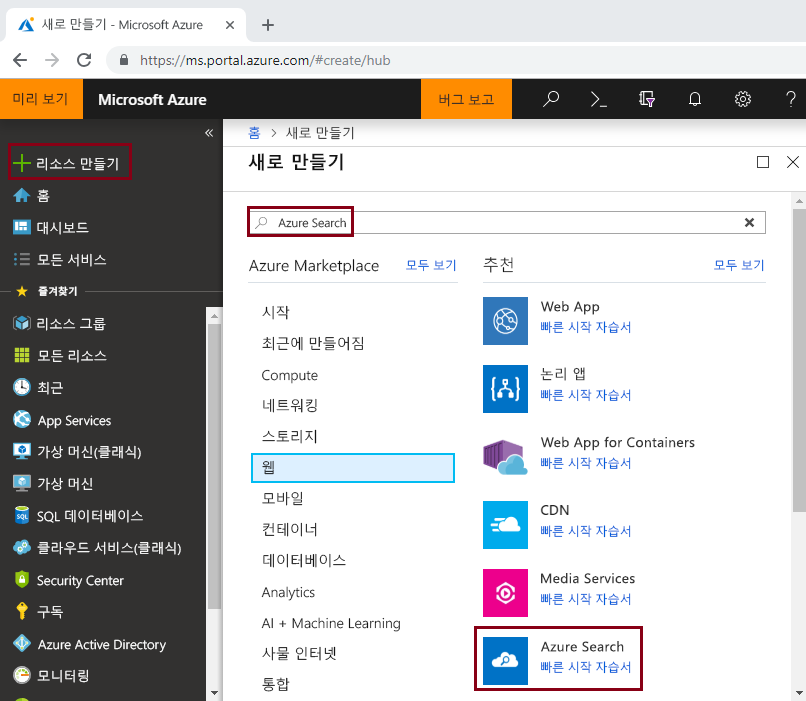
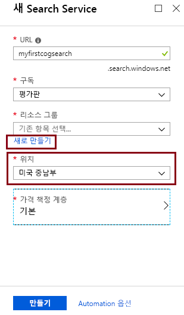
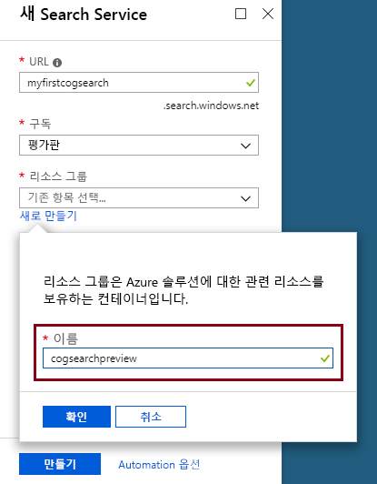
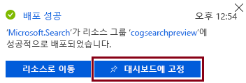

# <a name="tutorial-learn-how-to-call-cognitive-search-apis-preview"></a>자습서: 인식 검색 API를 호출하는 방법 알아보기(미리 보기)

이 자습서에서는 *인식 기술*을 사용하여 Azure Search에서 데이터 보강을 프로그래밍하는 메커니즘을 알아봅니다. 인색 기술은 텍스트 및 이미지의 텍스트 표현을 추출하고 언어, 엔터티, 핵심 구 등을 추출하는 NLP(자연어 처리)이자 이미지 분석 작업입니다. 최종적으로 인식 검색 인덱싱 파이프라인을 통해 Azure Search 인덱스에 풍부한 추가 콘텐츠가 생성됩니다. 

이 자습서에서는 다음 작업을 수행할 REST API 호출을 만듭니다.

> [!div class="checklist"]
> * 인덱스로 라우팅되는 샘플 데이터를 보강하는 인덱싱 파이프라인 만들기
> * 기본 제공 기술 적용: 엔터티 인식, 언어 감지, 텍스트 조작, 핵심 구 추출
> * 기술 집합에서 입력을 출력에 매핑하여 여러 기술을 연결하는 방법을 알아봅니다
> * 요청을 실행하고 결과 검토
> * 추가 개발을 위해 인덱스 및 인덱서 다시 설정

출력은 Azure Search에서 검색 가능한 전체 텍스트 인덱스입니다. [동의어](search-synonyms.md), [점수 매기기 프로필](https://docs.microsoft.com/rest/api/searchservice/add-scoring-profiles-to-a-search-index), [분석기](search-analyzers.md), [필터](search-filters.md) 등의 다른 표준 기능을 사용하여 인덱스를 향상할 수 있습니다.

Azure 구독이 아직 없는 경우 시작하기 전에 [체험 계정](https://azure.microsoft.com/free/?WT.mc_id=A261C142F)을 만듭니다.

> [!NOTE]
> 2018년 12월 21일부터 Cognitive Services 리소스를 Azure Search 기술과 연결할 수 있습니다. 이렇게 하면 기술 실행에 대한 요금을 청구할 수 있습니다. 또한 문서 해독 단계의 일부로 이미지 추출에 대한 요금 청구가 이 날짜에서 시작됩니다. 문서에서의 텍스트 추출은 추가 비용 없이 계속 제공됩니다.
>
> 기본 제공 기술의 실행에 대한 요금은 기존 [Cognitive Services 종량제 가격](https://azure.microsoft.com/pricing/details/cognitive-services/)으로 청구됩니다. 이미지 추출 가격은 미리 보기 가격으로 책정되며 [Azure Search 가격 페이지](https://go.microsoft.com/fwlink/?linkid=2042400)에 설명되어 있습니다. [자세한 정보](cognitive-search-attach-cognitive-services.md)

## <a name="prerequisites"></a>필수 조건

인식 검색을 처음 사용하세요? ["인식 검색이란?"](cognitive-search-concept-intro.md)을 읽고 기능에 대해 알아보거나 실습을 통해 중요한 개념을 소개하는 [포털 빠른 시작](cognitive-search-quickstart-blob.md)을 시도해보세요.

Azure Search에 대한 REST 호출을 만들려면 PowerShell이나 Telerik Fiddler 또는 Postman 같은 웹 테스트 도구를 사용하여 HTTP 요청을 작성합니다. 이러한 도구를 처음 접하는 경우 [Fiddler 또는 Postman을 사용하여 Azure Search REST API 탐색](search-fiddler.md)을 참조하세요.

[Azure Portal](https://portal.azure.com/)을 사용하여 종단 간 워크플로에 사용되는 서비스를 만들 수 있습니다. 

### <a name="set-up-azure-search"></a>Azure Search 설정

먼저 Azure Search 서비스에 등록합니다. 

1. [Azure Portal](https://portal.azure.com)로 이동한 후 Azure 계정을 사용하여 로그인합니다.

1. **리소스 만들기**를 클릭하고, Azure Search를 검색하고, **만들기**를 클릭합니다. 검색 서비스를 처음으로 설정하는 경우 [포털에서 Azure Search 서비스 만들기](search-create-service-portal.md)를 참조하세요.

  

1. 리소스 그룹으로는 이 자습서에서 만드는 모든 리소스를 포함할 리소스 그룹을 만듭니다. 이렇게 하면 자습서를 마친 후 보다 쉽게 리소스를 정리할 수 있습니다.

1. 위치에 대해 Cognitive Search에 [지원되는 지역](https://docs.microsoft.com/en-us/azure/search/cognitive-search-quickstart-blob#supported-regions) 중 하나를 선택합니다.

1. 가격 책정 계층으로는 자습서와 빠른 시작을 완료할 수 있는 **무료** 서비스를 만듭니다. 사용자 고유의 데이터를 사용하여 자세히 조사하려면 **기본** 또는 **표준** 같은 [유료 서비스](https://azure.microsoft.com/pricing/details/search/)를 만듭니다. 

  무료 서비스는 인덱스 3개, blob 크기 최대 16MB, 인덱싱 2분으로 제한되며, 이는 인식 검색의 전체 기능을 실행하기에는 부족합니다. 다른 계층의 제한에 대한 내용은 [서비스 제한](search-limits-quotas-capacity.md)을 참조하세요.

  
  

 
1. 서비스를 대시보드에 고정하면 서비스 정보에 빠르게 액세스할 수 있습니다.

  

1. 서비스가 만들어지면 [개요] 페이지의 **URL** 및 [키] 페이지의 **api-key**(기본 또는 보조) 정보를 수집합니다.

  

### <a name="set-up-azure-blob-service-and-load-sample-data"></a>Azure Blob service를 설정하고 샘플 데이터 로드

보강 파이프라인은 Azure 데이터 원본에서 데이터를 가져옵니다. 원본 데이터는 [Azure Search 인덱서](search-indexer-overview.md)의 지원되는 데이터 원본 유형에서 생성되어야 합니다. Azure Table Storage는 인식 검색을 지원하지 않습니다. 이 연습에서는 BLOB 저장소를 사용하여 여러 가지 콘텐츠 형식을 보여줍니다.

1. [샘플 데이터를 다운로드합니다](https://1drv.ms/f/s!As7Oy81M_gVPa-LCb5lC_3hbS-4). 샘플 데이터는 여러 종류의 작은 파일 집합으로 구성됩니다. 

1. Azure Blob 저장소에 등록하고, 저장소 계정을 만들고, Storage 탐색기에 로그인하고, `basicdemo`라는 컨테이너를 만드세요. 모든 단계에 대한 지침은 [Azure Storage 탐색기 빠른 시작](../storage/blobs/storage-quickstart-blobs-storage-explorer.md)을 참조하세요.

1. 앞에서 만든 `basicdemo` 컨테이너에서 Azure Storage 탐색기를 사용하여 **업로드**를 클릭하고 샘플 파일을 업로드합니다.

1. 샘플 파일이 로드되면 Blob 저장소에 대한 컨테이너 이름 및 연결 문자열을 가져옵니다. 이렇게 하려면 Azure Portal에서 저장소 계정으로 이동해야 합니다. 그리고 **액세스 키**에서 **연결 문자열** 필드를 복사합니다.

  연결 문자열은 다음 예제와 비슷한 URL이어야 합니다.

      ```http
      DefaultEndpointsProtocol=https;AccountName=cogsrchdemostorage;AccountKey=<your account key>;EndpointSuffix=core.windows.net
      ```

공유 액세스 서명을 제공하는 방법을 포함하여 연결 문자열을 지정하는 여러 방법이 있습니다. 데이터 원본 자격 증명에 대한 자세한 내용은 [Azure Blob 저장소 인덱싱](search-howto-indexing-azure-blob-storage.md#Credentials)을 참조하세요.

## <a name="create-a-data-source"></a>데이터 소스 만들기

서비스 및 원본 파일이 준비되었으니, 인덱싱 파이프라인의 구성 요소를 어셈블하세요. Azure Search에 외부 원본 데이터를 검색하는 방법을 알려주는 [데이터 원본 개체](https://docs.microsoft.com/rest/api/searchservice/create-data-source)부터 시작하겠습니다.

이 자습서에서는 REST API와 PowerShell, Postman 또는 Fiddler처럼 HTTP 요청을 작성하고 보낼 수 있는 도구를 사용합니다. 요청 헤더에서 Azure Search 서비스를 만들 때 사용한 서비스 이름과 검색 서비스에 대해 생성된 api-key를 제공합니다. 요청 본문에서 BLOB 컨테이너 이름과 연결 문자열을 지정합니다.

### <a name="sample-request"></a>샘플 요청
```http
POST https://[service name].search.windows.net/datasources?api-version=2017-11-11-Preview
Content-Type: application/json  
api-key: [admin key]  
```
#### <a name="request-body-syntax"></a>요청 본문 구문
```json
{   
    "name" : "demodata",  
    "description" : "Demo files to demonstrate cognitive search capabilities.",  
    "type" : "azureblob",
    "credentials" :
    { "connectionString" :
      "DefaultEndpointsProtocol=https;AccountName=<your account name>;AccountKey=<your account key>;"
    },  
    "container" : { "name" : "<your blob container name>" }
}  
```
요청을 보냅니다. 웹 테스트 도구가 성공을 확인하는 201 상태 코드를 반환해야 합니다. 

이번이 첫 번째 요청이므로 Azure Portal에서 데이터 원본이 Azure Search에 생성되었는지 확인합니다. 검색 서비스 대시보드 페이지에서 데이터 원본 타일에 새 항목이 있는지 확인합니다. 포털 페이지가 새로 고침될 때까지 몇 분 정도 기다려야 할 수도 있습니다. 

  

403 또는 404 오류가 있다면 요청 구조를 확인합니다. `api-version=2017-11-11-Preview`는 엔드포인트에 있어야 하고, `api-key`는 `Content-Type` 뒤에 나오는 헤더에 있어야 하고, 그 값이 검색 서비스에 대해 유효해야 합니다. 이 자습서의 나머지 단계에서 헤더를 다시 사용할 수 있습니다.

> [!TIP]
> 이제 많은 작업을 수행하기 전에 미리 보기 기능을 제공하도록 지원되는 위치 중 하나인 미국 중남부 또는 유럽 서부에서 검색 서비스가 실행되는지 확인합니다.

## <a name="create-a-skillset"></a>기술 집합 만들기

이 단계에서는 데이터에 적용할 보강 단계를 정의합니다. 각 보강 단계를 *기술*이라고 부르고, 보강 단계 집합을 *기술 집합*이라고 부릅니다. 이 자습서에서는 다음과 같은 [미리 정의된 인식 기술](cognitive-search-predefined-skills.md)을 기술 집합에 사용합니다.

+ [언어 감지](cognitive-search-skill-language-detection.md): 콘텐츠의 언어를 식별합니다.

+ [텍스트 분할](cognitive-search-skill-textsplit.md): 핵심 구 추출 기술을 호출하기 전에 큰 콘텐츠를 작은 청크로 분할합니다. 핵심 구 추출은 50,000자 이하의 입력을 허용합니다. 일부 샘플 파일은 이 제한에 맞게 분할해야 합니다.

+ [명명된 엔터티 인식](cognitive-search-skill-named-entity-recognition.md): BLOB 컨테이너의 콘텐츠에서 조직 이름을 추출합니다.

+ [핵심 구 추출](cognitive-search-skill-keyphrases.md): 상위 핵심 구를 추출합니다. 

### <a name="sample-request"></a>샘플 요청
이 REST 호출을 만들기 전에, 사용하는 도구가 호출 간에 요청 헤더를 보존하지 않는 경우 아래 요청에서 서비스 이름과 관리자 키를 바꿔야 합니다. 

이 요청은 기술 집합을 만듭니다. 이 자습서의 나머지 부분에서는 기술 집합 이름을 ```demoskillset```라고 하겠습니다.

```http
PUT https://[servicename].search.windows.net/skillsets/demoskillset?api-version=2017-11-11-Preview
api-key: [admin key]
Content-Type: application/json
```
#### <a name="request-body-syntax"></a>요청 본문 구문
```json
{
  "description": 
  "Extract entities, detect language and extract key-phrases",
  "skills":
  [
    {
      "@odata.type": "#Microsoft.Skills.Text.NamedEntityRecognitionSkill",
      "categories": [ "Organization" ],
      "defaultLanguageCode": "en",
      "inputs": [
        {
          "name": "text", "source": "/document/content"
        }
      ],
      "outputs": [
        {
          "name": "organizations", "targetName": "organizations"
        }
      ]
    },
    {
      "@odata.type": "#Microsoft.Skills.Text.LanguageDetectionSkill",
      "inputs": [
        {
          "name": "text", "source": "/document/content"
        }
      ],
      "outputs": [
        {
          "name": "languageCode",
          "targetName": "languageCode"
        }
      ]
    },
    {
      "@odata.type": "#Microsoft.Skills.Text.SplitSkill",
      "textSplitMode" : "pages", 
      "maximumPageLength": 4000,
      "inputs": [
      {
        "name": "text",
        "source": "/document/content"
      },
      { 
        "name": "languageCode",
        "source": "/document/languageCode"
      }
    ],
    "outputs": [
      {
            "name": "textItems",
            "targetName": "pages"
      }
    ]
  },
  {
      "@odata.type": "#Microsoft.Skills.Text.KeyPhraseExtractionSkill",
      "context": "/document/pages/*",
      "inputs": [
        {
          "name": "text", "source": "/document/pages/*"
        },
        {
          "name":"languageCode", "source": "/document/languageCode"
        }
      ],
      "outputs": [
        {
          "name": "keyPhrases",
          "targetName": "keyPhrases"
        }
      ]
    }
  ]
}
```

요청을 보냅니다. 웹 테스트 도구가 성공을 확인하는 201 상태 코드를 반환해야 합니다. 

#### <a name="about-the-request"></a>요청 본문 정보

각 페이지에서 핵심 구 추출 기술이 어떻게 적용되는지 확인합니다. 컨텍스트를 ```"document/pages/*"```로 설정하여 (문서의 각 페이지에 대한) 문서/페이지 배열의 각 멤버에 대해 이 보강자를 실행합니다.

각 기술은 문서의 콘텐츠에서 실행됩니다. 처리하는 동안 Azure Search는 각 문서를 해독하여 다른 파일 형식의 콘텐츠를 읽습니다. 원본 파일에서 발생하는 텍스트는 각 문서에 대해 생성되는 ```content``` 필드에 배치됩니다. 따라서 입력을 ```"/document/content"```로 설정합니다.

기술 집합의 그래픽 표현은 아래와 같습니다. 


출력을 인덱스에 매핑할 수도 있고, 다운스트림 기술의 입력으로 사용할 수도 있고, 언어 코드처럼 둘 다 할 수도 있습니다. 인덱스에서 언어 코드는 필터링에 유용합니다. 입력으로써의 언어 코드는 단어 분리에 대한 언어적 규칙을 알려주기 위해 텍스트 분석 기술에 사용됩니다.

기술 집합 기본에 대한 자세한 내용은 [기술 집합을 정의하는 방법](cognitive-search-defining-skillset.md)을 참조하세요.

## <a name="create-an-index"></a>인덱스 만들기

이 섹션에서는 검색 가능한 인덱스에 포함할 필드 및 각 필드의 검색 특성을 지정하여 인덱스 스키마를 정의합니다. 필드에는 형식이 있으며 필드가 사용되는 방식(검색 가능, 정렬 가능 등)을 결정하는 특성을 가질 수 있습니다. 인덱스의 필드 이름은 원본의 필드 이름을 동일하게 일치시키는 데 필요하지 않습니다. 이후 단계에서 인덱서의 필드 매핑을 원본-대상 연결 필드에 추가할 것입니다. 이 단계에서는 검색 애플리케이션과 관련된 필드 명명 규칙을 사용하여 인덱스를 정의합니다.

이 연습에서는 다음 필드와 필드 형식을 사용합니다.

| 필드 이름: | id       | 콘텐츠   | languageCode | keyPhrases         | organizations     |
|--------------|----------|-------|----------|--------------------|-------------------|
| 필드 형식: | Edm.String|Edm.String| Edm.String| List<Edm.String>  | List<Edm.String>  |


### <a name="sample-request"></a>샘플 요청
이 REST 호출을 만들기 전에, 사용하는 도구가 호출 간에 요청 헤더를 보존하지 않는 경우 아래 요청에서 서비스 이름과 관리자 키를 바꿔야 합니다. 

이 요청은 인덱스를 만듭니다. 이 자습서의 나머지 부분에서는 ```demoindex```라는 인덱스 이름을 사용하겠습니다.

```http
PUT https://[servicename].search.windows.net/indexes/demoindex?api-version=2017-11-11-Preview
api-key: [api-key]
Content-Type: application/json
```
#### <a name="request-body-syntax"></a>요청 본문 구문

```json
{
  "fields": [
    {
      "name": "id",
      "type": "Edm.String",
      "key": true,
      "searchable": true,
      "filterable": false,
      "facetable": false,
      "sortable": true
    },
    {
      "name": "content",
      "type": "Edm.String",
      "sortable": false,
      "searchable": true,
      "filterable": false,
      "facetable": false
    },
    {
      "name": "languageCode",
      "type": "Edm.String",
      "searchable": true,
      "filterable": false,
      "facetable": false
    },
    {
      "name": "keyPhrases",
      "type": "Collection(Edm.String)",
      "searchable": true,
      "filterable": false,
      "facetable": false
    },
    {
      "name": "organizations",
      "type": "Collection(Edm.String)",
      "searchable": true,
      "sortable": false,
      "filterable": false,
      "facetable": false
    }
  ]
}
```
요청을 보냅니다. 웹 테스트 도구가 성공을 확인하는 201 상태 코드를 반환해야 합니다. 

인덱스 정의에 대한 자세한 내용은 [인덱스 만들기(Azure Search REST API)](https://docs.microsoft.com/rest/api/searchservice/create-index)를 참조하세요.


## <a name="create-an-indexer-map-fields-and-execute-transformations"></a>인덱서 만들기, 필드 매핑 및 변환 실행

지금까지 데이터 원본, 기술 집합 및 인덱스를 만들었습니다. 이러한 세 가지 구성 요소는 각 조각을 서로 연결하여 단일 다단계 작업으로 만드는 [인덱서](search-indexer-overview.md)의 일부가 됩니다. 각 구성 요소를 인덱서에 서로 연결하려면 필드 매핑을 정의해야 합니다. 필드 매핑은 인덱서 정의의 일부이며 요청이 제출될 때 변환을 실행합니다.

비보강 인덱싱에서는 필드 이름 또는 데이터 형식이 정확하게 일치하지 않거나 함수를 사용하려는 경우 인덱서 정의에서 선택적 *fieldMappings* 섹션을 제공합니다.

보강 파이프라인이 있는 인식 검색 워크로드의 경우 인덱서에 *outputFieldMappings*가 필요합니다. 이러한 매핑은 내부 프로세스(보강 파이프라인)가 필드 값의 소스일 때 사용됩니다. *outputFieldMappings* 고유의 동작으로는 (쉐이퍼 기술을 통해) 보강의 일부로 생성된 복합 형식을 처리하는 기능이 있습니다. 또한 문서 하나에 여러 요소가 있을 수 있습니다(예: 문서 하나에 여러 조직). *outputFieldMappings* 구문은 시스템에 요소 컬렉션을 단일 레코드로 "평면화"하라고 지시할 수 있습니다.

### <a name="sample-request"></a>샘플 요청

이 REST 호출을 만들기 전에, 사용하는 도구가 호출 간에 요청 헤더를 보존하지 않는 경우 아래 요청에서 서비스 이름과 관리자 키를 바꿔야 합니다. 

또한 인덱서 이름을 제공해야 합니다. 이 자습서의 나머지 부분에서 인덱서 이름으로 ```demoindexer```를 사용해도 됩니다.

```http
PUT https://[servicename].search.windows.net/indexers/demoindexer?api-version=2017-11-11-Preview
api-key: [api-key]
Content-Type: application/json
```
#### <a name="request-body-syntax"></a>요청 본문 구문

```json
{
  "name":"demoindexer", 
  "dataSourceName" : "demodata",
  "targetIndexName" : "demoindex",
  "skillsetName" : "demoskillset",
  "fieldMappings" : [
        {
          "sourceFieldName" : "metadata_storage_path",
          "targetFieldName" : "id",
          "mappingFunction" : 
            { "name" : "base64Encode" }
        },
        {
          "sourceFieldName" : "content",
          "targetFieldName" : "content"
        }
   ],
  "outputFieldMappings" : 
  [
        {
          "sourceFieldName" : "/document/organizations", 
          "targetFieldName" : "organizations"
        },
        {
          "sourceFieldName" : "/document/pages/*/keyPhrases/*", 
          "targetFieldName" : "keyPhrases"
        },
        {
            "sourceFieldName": "/document/languageCode",
            "targetFieldName": "languageCode"
        }      
  ],
  "parameters":
  {
    "maxFailedItems":-1,
    "maxFailedItemsPerBatch":-1,
    "configuration": 
    {
        "dataToExtract": "contentAndMetadata",
        "imageAction": "generateNormalizedImages"
        }
  }
}
```

요청을 보냅니다. 웹 테스트 도구가 처리 성공을 확인하는 201 상태 코드를 반환해야 합니다. 

이 단계를 완료하는 데는 몇 분 정도 걸릴 수 있습니다. 데이터 집합이 작아도 분석 기술은 계산을 많이 수행합니다. 이미지 분석 같은 일부 기술은 오래 실행됩니다.

> [!TIP]
> 인덱서를 만들면 파이프라인이 호출됩니다. 데이터 도달, 입력 및 출력 매핑 또는 작업 순서에 문제가 있으면 이 단계에 나타납니다. 코드 또는 스크립트를 변경하고 파이프라인을 다시 실행하려면 먼저 개체를 삭제해야 합니다. 자세한 내용은 [다시 설정하고 다시 실행](#reset)을 참조하세요.

### <a name="explore-the-request-body"></a>요청 본문 탐색

이 스크립트는 ```"maxFailedItems"```를 -1로 설정합니다. 이 값은 데이터를 가져오는 동안에는 오류를 무시하라고 인덱싱 엔진에 지시합니다. 데모 데이터 원본에는 문서가 몇 개 없기 때문에 이렇게 하면 도움이 됩니다. 데이터 원본의 크기가 큰 경우에는 0보다 큰 값으로 설정해야 합니다.

구성 매개 변수의 ```"dataToExtract":"contentAndMetadata"``` 문도 확인합니다. 이 명령문은 다른 파일 형식의 콘텐츠 및 각 파일과 관련된 메타데이터를 자동으로 추출하도록 인덱서에 지시합니다. 

콘텐츠가 추출되면 데이터 원본에서 찾은 이미지의 텍스트를 추출하도록 ```ImageAction```을 설정할 수 있습니다. ```"ImageAction":"generateNormalizedImages"```는 이미지의 텍스트(예: 정지 신호의 "정지"라는 단어)를 추출하라고 인덱서에 알려주고, 해당 텍스트를 콘텐츠 필드의 일부로 포함합니다. 이 동작은 문서에 포함된 이미지(예: PDF 내 이미지)뿐 아니라 JPG 파일 같은 데이터 원본의 이미지에도 적용됩니다.

이 미리 보기에서 ```"generateNormalizedImages"```는 유일하게 ```"ImageAction"```의 유효한 값입니다.

## <a name="check-indexer-status"></a>인덱서 상태 확인

인덱서가 정의되면 사용자가 요청을 제출할 때 인덱서가 자동으로 실행됩니다. 사용자가 정의한 인식 기술에 따라 인덱싱이 예상보다 오래 걸릴 수 있습니다. 인덱서가 여전히 실행 중인지 확인하려면 다음 요청을 보내 인덱서 상태를 확인합니다.

```http
GET https://[servicename].search.windows.net/indexers/demoindexer/status?api-version=2017-11-11-Preview
api-key: [api-key]
Content-Type: application/json
```

응답을 보면 인덱서가 실행 중인지 알 수 있습니다. 인덱싱이 완료되면 위와 같이 다른 HTTP GET을 STATUS 엔드포인트에 사용하여 보강 중에 발생한 오류 및 경고 보고서를 봅니다.  

경고는 일부 원본 파일 및 기술 조합에서 일반적이며 항상 문제를 나타내는 것은 아닙니다. 이 자습서의 경고는 심각하지 않습니다(예: JPEG 파일의 텍스트 입력이 없음). 인덱싱 중에 발생한 경고에 대한 자세한 정보를 제공하는 상태 응답을 검토할 수 있습니다.
 
## <a name="verify-content"></a>콘텐츠 확인

인덱싱이 완료되면 개별 필드의 콘텐츠를 반환하는 쿼리를 실행합니다. 기본적으로 Azure Search는 상위 50개 결과를 반환합니다. 샘플 데이터가 작기 때문에 기본값으로 충분합니다. 그러나 더 큰 데이터 집합으로 작업할 경우 쿼리 문자열에 더 많은 결과를 반환하는 매개 변수를 포함해야 합니다. 자세한 지침은 [Azure Search에서 결과를 페이징하는 방법](search-pagination-page-layout.md)을 참조하세요.

확인 단계로 모든 필드에 대한 인덱스를 쿼리합니다.

```http
GET https://[servicename].search.windows.net/indexes/demoindex?api-version=2017-11-11-Preview
api-key: [api-key]
Content-Type: application/json
```

출력은 각 필드의 이름, 형식 및 특성이 포함된 인덱스 스키마입니다.

`organizations`처럼 단일 필드의 모든 콘텐츠를 반환하도록 `"*"`에 대한 두 번째 쿼리를 제출합니다.

```http
GET https://[servicename].search.windows.net/indexes/demoindex/docs?search=*&$select=organizations&api-version=2017-11-11-Preview
api-key: [api-key]
Content-Type: application/json
```

추가 필드 반복: 이 연습의 콘텐츠, 언어, 핵심 구 및 조직. 쉼표로 구분된 목록을 사용하여 `$select`를 통해 여러 필드를 반환할 수 있습니다.

쿼리 문자열의 복잡성 및 길이에 따라 GET 또는 POST를 사용할 수 있습니다. 자세한 내용은 [REST API를 사용한 쿼리](https://docs.microsoft.com/azure/search/search-query-rest-api)를 참조하세요.

<a name="access-enriched-document"></a>

## <a name="accessing-the-enriched-document"></a>보강된 문서에 액세스

인식 검색을 사용하면 보강된 문서 구조를 볼 수 있습니다. 보강된 문서는 보강 중에 만들어진 임시 구조체로, 프로세스가 완료되면 삭제됩니다.

인덱싱 중에 만들어진 보강된 문서의 스냅숏을 캡처하려면 ```enriched```라는 필드를 인덱스에 추가합니다. 인덱서는 해당 문서의 모든 보강 문자열 표현에 대한 필드에 자동으로 덤프됩니다.

```enriched``` 필드는 JSON으로 보강된 메모리 내 문서의 논리적 표현인 문자열을 포함하게 됩니다.  그러나 필드 값은 유효한 JSON 문서입니다. 따옴표가 이스케이프되므로 문서를 JSON 형식으로 보려면 `\"`를 `"`로 바꿔야 합니다.  

```enriched``` 필드는 디버깅용이며, 식을 평가하는 콘텐츠의 논리적 형식을 쉽게 이해하도록 도와주는 역할만 합니다. 기술 집합을 이해하고 디버그하는 데 유용한 도구입니다.

보강된 문서의 콘텐츠를 캡처하는 `enriched` 필드를 포함하여 이전 연습을 반복합니다.

### <a name="request-body-syntax"></a>요청 본문 구문
```json
{
  "fields": [
    {
      "name": "id",
      "type": "Edm.String",
      "key": true,
      "searchable": true,
      "filterable": false,
      "facetable": false,
      "sortable": true
    },
    {
      "name": "content",
      "type": "Edm.String",
      "sortable": false,
      "searchable": true,
      "filterable": false,
      "facetable": false
    },
    {
      "name": "languageCode",
      "type": "Edm.String",
      "searchable": true,
      "filterable": false,
      "facetable": false
    },
    {
      "name": "keyPhrases",
      "type": "Collection(Edm.String)",
      "searchable": true,
      "filterable": false,
      "facetable": false
    },
    {
      "name": "organizations",
      "type": "Collection(Edm.String)",
      "searchable": true,
      "sortable": false,
      "filterable": false,
      "facetable": false
    },
    {
      "name": "enriched",
      "type": "Edm.String",
      "searchable": false,
      "sortable": false,
      "filterable": false,
      "facetable": false
    }
  ]
}
```
<a name="reset"></a>

## <a name="reset-and-rerun"></a>다시 설정하고 다시 실행

파이프라인 개발의 초기 실험 단계에서 디자인 반복에 대한 가장 실용적인 방법은 Azure Search에서 개체를 삭제하고 코드에서 개체를 다시 빌드하게 하는 것입니다. 리소스 이름은 고유합니다. 개체를 삭제하면 동일한 이름을 사용하여 개체를 다시 만들 수 있습니다.

새 정의를 사용하여 문서를 다시 인덱싱하려면:

1. 인덱스를 삭제하여 지속형 데이터를 제거합니다. 인덱서를 삭제하고 서비스에서 인덱서를 다시 만듭니다.
2. 기술 집합 및 인덱스 정의를 수정합니다.
3. 서비스에서 인덱스 및 인덱서를 다시 만들어 파이프라인을 실행합니다. 

포털을 사용하여 인덱스, 인덱서 및 기술을 삭제할 수 있습니다.

```http
DELETE https://[servicename].search.windows.net/skillsets/demoskillset?api-version=2017-11-11-Preview
api-key: [api-key]
Content-Type: application/json
```

삭제 성공 시 상태 코드 204가 반환됩니다.

코드가 완성될수록 다시 빌드 전략을 구체화하는 것이 좋습니다. 자세한 내용은 [인덱스 다시 작성](search-howto-reindex.md)을 참조하세요.

## <a name="takeaways"></a>핵심 내용

이 자습서에서는 데이터 원본, 기술 집합, 인덱스 및 인덱서라고 하는 구성 요소를 만들어서 보강된 인덱싱 파이프라인을 빌드하는 기본 단계를 살펴보았습니다.

기술 집합 정의 및 입/출력을 통해 기술을 서로 연결하는 메커니즘과 함께 [미리 정의된 기술](cognitive-search-predefined-skills.md)을 소개했습니다. 인덱서 정의의 `outputFieldMappings`는 보강된 값을 Azure Search 서비스의 파이프라인에서 검색 가능한 인덱스로 라우팅하는 데 필요하다는 것도 배웠습니다.

마지막으로, 결과를 테스트하고 추가 반복을 위해 시스템을 다시 설정하는 방법을 배웠습니다. 인덱스에 대한 쿼리를 실행하면 보강된 인덱싱 파이프라인에서 만든 출력이 반환된다는 것을 배웠습니다. 이 릴리스에는 내부 구문(시스템에서 만든 보강된 문서)을 보기 위한 메커니즘이 있습니다. 인덱서 상태를 확인하는 방법과 파이프라인을 다시 실행하기 전에 어떤 개체를 삭제해야 하는지도 배웠습니다.

## <a name="clean-up-resources"></a>리소스 정리

이 자습서를 마친 후 정리하는 가장 빠른 방법은 Azure Search 서비스 및 Azure Blob service를 포함하고 있는 리소스 그룹을 삭제하는 것입니다. 두 서비스를 동일한 그룹에 배치한 경우 리소스 그룹을 삭제하면 서비스와 이 자습서에서 만들고 저장한 콘텐츠를 포함하여 리소스 그룹에 들어 있는 모든 것이 영구적으로 삭제됩니다. 포털에서 리소스 그룹 이름은 각 서비스의 개요 페이지에 있습니다.

## <a name="next-steps"></a>다음 단계

사용자 지정 기술을 사용하여 파이프라인을 사용자 지정 또는 확장합니다. 사용자 지정 기술을 만들어서 기술 집합에 추가하면 사용자가 직접 작성한 텍스트 또는 이미지 분석을 온보딩할 수 있습니다. 

> [!div class="nextstepaction"]
> [예제: 사용자 지정 기술 만들기](cognitive-search-create-custom-skill-example.md)
