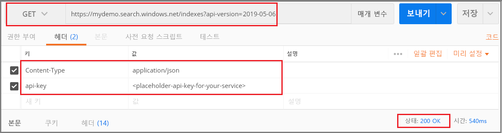

# <a name="tutorial-use-rest-and-ai-to-generate-searchable-content-from-azure-blobs"></a>자습서: REST 및 AI를 사용하여 Azure Blob에서 검색 가능한 콘텐츠 생성

Azure Blob 스토리지에 비정형 텍스트 또는 이미지가 있는 경우 [AI 보강 파이프라인](cognitive-search-concept-intro.md)은 정보를 추출하여 전체 텍스트 검색 또는 지식 마이닝 시나리오에 유용한 새 콘텐츠를 만들 수 있습니다. 파이프라인에서 이미지를 처리할 수 있지만, 이 REST 자습서에서는 텍스트에 중점을 두고 언어 감지 및 자연어 처리를 적용하여 쿼리, 패싯 및 필터에 활용할 수 있는 새로운 필드를 만듭니다.

이 자습서에서는 Postman 및 [Search REST API](https://docs.microsoft.com/rest/api/searchservice/)를 사용하여 다음 작업을 수행합니다.

> [!div class="checklist"]
> * Azure Blob 스토리지에서 PDF, HTML, DOCX 및 PPTX와 같은 전체 문서(비정형 텍스트)로 시작합니다.
> * 텍스트를 추출하고, 언어를 감지하고, 엔터티를 인식하고, 핵심 구를 검색하는 파이프라인을 정의합니다.
> * 출력(원시 콘텐츠 및 파이프라인에서 생성된 이름-값 쌍)을 저장할 인덱스를 정의합니다.
> * 파이프라인을 실행하여 변환 및 분석을 시작하고 인덱스를 생성하고 로드합니다.
> * 전체 텍스트 검색과 풍부한 쿼리 구문을 사용하여 결과를 검색합니다.

Azure 구독이 없는 경우 시작하기 전에 [체험 계정](https://azure.microsoft.com/free/?WT.mc_id=A261C142F)을 엽니다.

## <a name="prerequisites"></a>사전 요구 사항

+ [Azure Storage](https://azure.microsoft.com/services/storage/)
+ [Postman 데스크톱 앱](https://www.getpostman.com/)
+ [만들기](search-create-service-portal.md) 또는 [기존 검색 서비스 찾기](https://ms.portal.azure.com/#blade/HubsExtension/BrowseResourceBlade/resourceType/Microsoft.Search%2FsearchServices) 

> [!Note]
> 이 자습서에서는 체험 서비스를 사용할 수 있습니다. 체험 검색 서비스에서는 인덱스, 인덱서 및 데이터 원본이 각각 3개로 제한됩니다. 이 자습서에서는 각각을 하나씩 만듭니다. 시작하기 전에 새 리소스를 수용할 수 있는 공간이 서비스에 있는지 확인하세요.

## <a name="download-files"></a>파일 다운로드

1. 이 [OneDrive 폴더](https://1drv.ms/f/s!As7Oy81M_gVPa-LCb5lC_3hbS-4)를 열고, 왼쪽 위 모서리에서 **다운로드**를 클릭하여 파일을 컴퓨터에 복사합니다. 

1. 마우스 오른쪽 단추로 Zip 파일을 클릭하고, **압축 풀기**를 선택합니다. 다양한 형식의 14개 파일이 있습니다. 이 연습에서는 7개 파일을 사용합니다.

## <a name="1---create-services"></a>1 - 서비스 만들기

이 자습서에서는 Azure Cognitive Search를 인덱싱 및 쿼리에 사용하고 AI 보강을 위해 백 엔드의 Cognitive Services를 사용하고 Azure Blob Storage를 사용하여 데이터를 제공합니다. 이 자습서는 Cognitive Services에 인덱서당 하루 20개의 트랜잭션을 무료로 할당하기 때문에, 검색 및 스토리지 서비스만 만들면 됩니다.

가능하면, 근접성과 관리 효율성을 위해 두 가지 모두를 동일한 지역과 리소스 그룹에 만듭니다. 실제로 Azure Storage 계정은 모든 지역에 있을 수 있습니다.

### <a name="start-with-azure-storage"></a>Azure Storage 시작

1. [Azure Portal에 로그인](https://portal.azure.com/)하고, **+ 리소스 만들기**를 클릭합니다.

1. *스토리지 계정*을 검색하고, Microsoft의 스토리지 계정 제품을 선택합니다.

   

1. [기본 사항] 탭의 필수 항목은 다음과 같습니다. 다른 모든 항목에는 기본값을 적용합니다.

   + **리소스 그룹**. 기존 서비스를 선택하거나 새 서비스를 만들지만 동일한 그룹을 모든 서비스에 사용하여 전체적으로 관리할 수 있습니다.

   + **스토리지 계정 이름**. 동일한 유형의 여러 리소스가 있을 수 있다고 생각되면 유형 및 지역별로 구분할 수 있는 이름(예: *blobstoragewestus*)을 사용합니다. 

   + **위치** - 가능하면 Azure Cognitive Search 및 Cognitive Services에 사용되는 것과 동일한 위치를 선택합니다. 단일 위치에는 대역폭 요금이 부과되지 않습니다.

   + **계정 종류**. 기본값인 *StorageV2(범용 v2)* 를 선택합니다.

1. **검토 + 만들기**를 클릭하여 서비스를 만듭니다.

1. 서비스가 만들어지면 **리소스로 이동**을 클릭하여 [개요] 페이지를 엽니다.

1. **Blob** 서비스를 클릭합니다.

1. **+ 컨테이너**를 클릭하여 컨테이너를 만들고, 이름을 *cog-search-demo*로 지정합니다.

1. *cog-search-demo*를 선택한 다음, **업로드**를 클릭하여 다운로드 파일을 저장한 폴더를 엽니다. 이미지가 아닌 파일을 모두 선택합니다. 7개의 파일이 있어야 합니다. **확인**을 클릭하여 업로드합니다.

   

1. Azure Storage를 나가기 전에 Azure Cognitive Search에서 연결을 만들 수 있도록 연결 문자열을 가져옵니다. 

   1. 스토리지 계정의 [개요] 페이지로 돌아갑니다(*blobstragewestus*를 예로 사용했음). 
   
   1. 왼쪽 탐색 창에서 **액세스 키**를 선택하고, 연결 문자열 중 하나를 복사합니다. 

   연결 문자열은 다음 예제와 비슷한 URL입니다.

      ```http
      DefaultEndpointsProtocol=https;AccountName=cogsrchdemostorage;AccountKey=<your account key>;EndpointSuffix=core.windows.net
      ```

1. 연결 문자열을 메모장에 저장합니다. 이는 나중에 데이터 원본 연결을 설정할 때 필요합니다.

### <a name="cognitive-services"></a>Cognitive Services

AI 보강은 자연어와 이미지 처리를 위한 Text Analytics 및 Computer Vision을 포함한 Cognitive Services를 통해 지원됩니다. 실제 프로토타입 또는 프로젝트를 완료하는 것이 목표라면 이 시점에서 Cognitive Services를 인덱싱 작업에 연결할 수 있도록 Azure Cognitive Search와 동일한 지역에 프로비저닝합니다.

그러나 Azure Cognitive Search는 백그라운드에서 Cognitive Services에 연결하여 인덱서 실행당 20개의 체험 트랜잭션을 제공할 수 있으므로 이 연습에서는 리소스 프로비저닝을 건너뛸 수 있습니다. 이 자습서에서는 7개의 트랜잭션을 사용하므로 체험 할당이 충분합니다. 대규모 프로젝트의 경우 종량제 S0 계층에서 Cognitive Services를 프로비저닝할 계획입니다. 자세한 내용은 [Cognitive Services 연결](cognitive-search-attach-cognitive-services.md)을 참조하세요.

### <a name="azure-cognitive-search"></a>Azure Cognitive Search

세 번째 구성 요소는 [포털에서 만들](search-create-service-portal.md) 수 있는 Azure Cognitive Search입니다. 이 연습은 체험 계층을 사용하여 완료할 수 있습니다. 

Azure Blob 스토리지와 마찬가지로 잠시 시간을 내어 액세스 키를 수집합니다. 또한 요청을 구조화하기 시작할 때 각 요청을 인증하는 데 사용되는 엔드포인트 및 관리 API 키를 제공해야 합니다.

### <a name="get-an-admin-api-key-and-url-for-azure-cognitive-search"></a>Azure Cognitive Search용 관리 API 키와 URL을 가져옵니다.

1. [Azure Portal에 로그인](https://portal.azure.com/)하고, 검색 서비스 **개요** 페이지에서 검색 서비스의 이름을 확인합니다. 엔드포인트 URL을 검토하여 서비스 이름을 확인할 수 있습니다. 엔드포인트 URL이 `https://mydemo.search.windows.net`인 경우 서비스 이름은 `mydemo`입니다.

2. **설정** > **키**에서 서비스에 대한 모든 권한의 관리자 키를 가져옵니다. 교체 가능한 두 개의 관리자 키가 있으며, 하나를 롤오버해야 하는 경우 비즈니스 연속성을 위해 다른 하나가 제공됩니다. 개체 추가, 수정 및 삭제 요청 시 기본 또는 보조 키를 사용할 수 있습니다.

   쿼리 키도 가져옵니다. 쿼리 요청은 읽기 전용 액세스로 발급하는 것이 좋습니다.

   

모든 요청에서 서비스에 보내는 각 요청의 헤더마다 API 키가 필요합니다. 유효한 키는 요청을 보내는 애플리케이션과 이 요청을 처리하는 서비스 간에 요청별로 신뢰를 설정합니다.

## <a name="2---set-up-postman"></a>2 - Postman 설정

Postman을 시작하고 HTTP 요청을 설정합니다. 이 도구가 생소한 경우 [Postman을 사용하여 Azure Cognitive Search REST API 살펴보기](search-get-started-postman.md)를 참조하세요.

이 자습서에 사용되는 요청 메서드는 **POST**, **PUT** 및 **GET**입니다. 이러한 메서드를 사용하여 검색 서비스에 대한 네 가지 API 호출(데이터 원본, 기술 세트, 인덱스 및 인덱서 만들기)을 수행합니다.

[헤더]에서 "Content-type"을 `application/json`으로 설정하고, `api-key`를 Azure Cognitive Search 서비스의 관리 API 키로 설정합니다. 헤더가 설정되면 이 연습의 모든 요청에 헤더를 사용할 수 있습니다.

  

## <a name="3---create-the-pipeline"></a>3 - 파이프라인 만들기

Azure Cognitive Search에서 AI 처리는 인덱싱(또는 데이터 수집) 중에 발생합니다. 이 연습 부분에서는 데이터 원본, 인덱스 정의, 기술 세트, 인덱서의 네 가지 개체를 만듭니다. 

### <a name="step-1-create-a-data-source"></a>1단계: 데이터 소스 만들기

[데이터 원본 개체](https://docs.microsoft.com/rest/api/searchservice/create-data-source)는 파일이 포함된 Blob 컨테이너에 대한 연결 문자열을 제공합니다.

1. **POST** 및 다음 URL을 사용하여 YOUR-SERVICE-NAME을 서비스의 실제 이름으로 바꿉니다.

   ```http
   https://[YOUR-SERVICE-NAME].search.windows.net/datasources?api-version=2020-06-30
   ```

1. 요청 **본문**에서 다음 JSON 정의를 복사하여 `connectionString`을 스토리지 계정의 실제 연결로 바꿉니다. 

   컨테이너 이름도 편집해야 합니다. 이전 단계에서 컨테이너 이름에 대해 "cog-search-demo"를 제안했습니다.

    ```json
    {
      "name" : "cog-search-demo-ds",
      "description" : "Demo files to demonstrate cognitive search capabilities.",
      "type" : "azureblob",
      "credentials" :
      { "connectionString" :
        "DefaultEndpointsProtocol=https;AccountName=<YOUR-STORAGE-ACCOUNT>;AccountKey=<YOUR-ACCOUNT-KEY>;"
      },
      "container" : { "name" : "<YOUR-BLOB-CONTAINER-NAME>" }
    }
    ```
1. 요청을 보냅니다. 성공 여부를 확인하는 201 상태 코드가 표시됩니다. 

403 또는 404 오류가 있다면 요청 구조를 확인합니다. `api-version=2020-06-30`는 엔드포인트에 있어야 하고, `api-key`는 `Content-Type` 뒤에 나오는 헤더에 있어야 하고, 그 값이 검색 서비스에 대해 유효해야 합니다. 온라인 JSON 유효성 검사기를 통해 JSON 문서를 실행하여 구문이 올바른지 확인하는 것이 좋습니다. 

### <a name="step-2-create-a-skillset"></a>2단계: 기술 집합 만들기

[기술 세트 개체](https://docs.microsoft.com/rest/api/searchservice/create-skillset)는 콘텐츠에 적용되는 보강 단계 세트입니다. 

1. **PUT** 및 다음 URL을 사용하여 YOUR-SERVICE-NAME을 서비스의 실제 이름으로 바꿉니다.

    ```http
    https://[YOUR-SERVICE-NAME].search.windows.net/skillsets/cog-search-demo-sd?api-version=2020-06-30
    ```

1. 요청 **본문**에서 아래 JSON 정의를 복사합니다. 이 기술 세트를 구성하는 기본 제공 기술은 다음과 같습니다.

   | 기술                 | Description    |
   |-----------------------|----------------|
   | [엔터티 인식](cognitive-search-skill-entity-recognition.md) | Blob 컨테이너의 콘텐츠에서 사람, 조직 및 위치의 이름을 추출합니다. |
   | [언어 감지](cognitive-search-skill-language-detection.md) | 콘텐츠의 언어를 감지합니다. |
   | [텍스트 분할](cognitive-search-skill-textsplit.md)  | 핵심 구 추출 기술을 호출하기 전에 큰 콘텐츠를 더 작은 청크로 분할합니다. 핵심 구 추출은 50,000자 이하의 입력을 허용합니다. 일부 샘플 파일은 이 제한에 맞게 분할해야 합니다. |
   | [핵심 구 추출](cognitive-search-skill-keyphrases.md) | 상위 핵심 구를 가져옵니다. |

   각 기술은 문서의 콘텐츠에서 실행됩니다. 처리하는 동안 Azure Cognitive Search는 각 문서를 해독하여 다른 파일 형식의 콘텐츠를 읽습니다. 원본 파일에서 발생하는 텍스트는 각 문서에 대해 생성되는 ```content``` 필드에 배치됩니다. 따라서 입력은 ```"/document/content"```가 됩니다.

   핵심 구 추출의 경우 텍스트 분할기 기술을 사용하여 더 큰 파일을 페이지로 분할하므로 핵심 구 추출 기술의 컨텍스트는 ```"/document/content"``` 대신 ```"document/pages/*"```(문서의 각 페이지에 대해)입니다.

    ```json
    {
      "description": "Extract entities, detect language and extract key-phrases",
      "skills":
      [
        {
          "@odata.type": "#Microsoft.Skills.Text.EntityRecognitionSkill",
          "categories": [ "Person", "Organization", "Location" ],
          "defaultLanguageCode": "en",
          "inputs": [
            { "name": "text", "source": "/document/content" }
          ],
          "outputs": [
            { "name": "persons", "targetName": "persons" },
            { "name": "organizations", "targetName": "organizations" },
            { "name": "locations", "targetName": "locations" }
          ]
        },
        {
          "@odata.type": "#Microsoft.Skills.Text.LanguageDetectionSkill",
          "inputs": [
            { "name": "text", "source": "/document/content" }
          ],
          "outputs": [
            { "name": "languageCode", "targetName": "languageCode" }
          ]
        },
        {
          "@odata.type": "#Microsoft.Skills.Text.SplitSkill",
          "textSplitMode" : "pages",
          "maximumPageLength": 4000,
          "inputs": [
            { "name": "text", "source": "/document/content" },
            { "name": "languageCode", "source": "/document/languageCode" }
          ],
          "outputs": [
            { "name": "textItems", "targetName": "pages" }
          ]
        },
        {
          "@odata.type": "#Microsoft.Skills.Text.KeyPhraseExtractionSkill",
          "context": "/document/pages/*",
          "inputs": [
            { "name": "text", "source": "/document/pages/*" },
            { "name":"languageCode", "source": "/document/languageCode" }
          ],
          "outputs": [
            { "name": "keyPhrases", "targetName": "keyPhrases" }
          ]
        }
      ]
    }
    ```
    기술 집합의 그래픽 표현은 아래와 같습니다. 

    

1. 요청을 보냅니다. Postman에서 성공 여부를 확인하는 201 상태 코드를 반환합니다. 

> [!NOTE]
> 출력을 인덱스에 매핑할 수도 있고, 다운스트림 기술의 입력으로 사용할 수도 있고, 언어 코드처럼 둘 다 할 수도 있습니다. 인덱스에서 언어 코드는 필터링에 유용합니다. 입력으로써의 언어 코드는 단어 분리에 대한 언어적 규칙을 알려주기 위해 텍스트 분석 기술에 사용됩니다. 기술 집합 기본에 대한 자세한 내용은 [기술 집합을 정의하는 방법](cognitive-search-defining-skillset.md)을 참조하세요.

### <a name="step-3-create-an-index"></a>3단계: 인덱스 만들기

[인덱스](https://docs.microsoft.com/rest/api/searchservice/create-index)는 Azure Cognitive Search에서 콘텐츠의 반전된 인덱스 및 다른 구문의 물리적 식을 만드는 데 사용되는 스키마를 제공합니다. 인덱스의 가장 큰 구성 요소는 필드 컬렉션입니다. 여기서 데이터 형식과 특성은 Azure Cognitive Search의 콘텐츠와 동작을 결정합니다.

1. 인덱스 이름을 지정하려면 **PUT** 및 다음 URL을 사용하여 YOUR-SERVICE-NAME을 서비스의 실제 이름으로 바꿉니다.

   ```http
   https://[YOUR-SERVICE-NAME].search.windows.net/indexes/cog-search-demo-idx?api-version=2020-06-30
   ```

1. 요청 **본문**에서 다음 JSON 정의를 복사합니다. `content` 필드는 문서 자체를 저장합니다. `languageCode`, `keyPhrases` 및 `organizations`에 대한 추가 필드는 기술 세트에서 만든 새 정보(필드 및 값)를 나타냅니다.

    ```json
    {
      "fields": [
        {
          "name": "id",
          "type": "Edm.String",
          "key": true,
          "searchable": true,
          "filterable": false,
          "facetable": false,
          "sortable": true
        },
        {
          "name": "metadata_storage_name",
          "type": "Edm.String",
          "searchable": false,
          "filterable": false,
          "facetable": false,
          "sortable": false
        },
        {
          "name": "content",
          "type": "Edm.String",
          "sortable": false,
          "searchable": true,
          "filterable": false,
          "facetable": false
        },
        {
          "name": "languageCode",
          "type": "Edm.String",
          "searchable": true,
          "filterable": false,
          "facetable": false
        },
        {
          "name": "keyPhrases",
          "type": "Collection(Edm.String)",
          "searchable": true,
          "filterable": false,
          "facetable": false
        },
        {
          "name": "persons",
          "type": "Collection(Edm.String)",
          "searchable": true,
          "sortable": false,
          "filterable": true,
          "facetable": true
        },
        {
          "name": "organizations",
          "type": "Collection(Edm.String)",
          "searchable": true,
          "sortable": false,
          "filterable": true,
          "facetable": true
        },
        {
          "name": "locations",
          "type": "Collection(Edm.String)",
          "searchable": true,
          "sortable": false,
          "filterable": true,
          "facetable": true
        }
      ]
    }
    ```

1. 요청을 보냅니다. Postman에서 성공 여부를 확인하는 201 상태 코드를 반환합니다. 

### <a name="step-4-create-and-run-an-indexer"></a>4단계: 인덱서 만들기 및 실행

[인덱서](https://docs.microsoft.com/rest/api/searchservice/create-indexer)는 파이프라인을 구동합니다. 지금까지 만든 세 가지 구성 요소(데이터 원본, 기술 세트, 인덱스)는 인덱서에 대한 입력입니다. Azure Cognitive Search에서 인덱서를 만드는 것은 전체 파이프라인을 이동시키는 이벤트입니다. 

1. 인덱서 이름을 지정하려면 **PUT** 및 다음 URL을 사용하여 YOUR-SERVICE-NAME을 서비스의 실제 이름으로 바꿉니다.

   ```http
   https://[servicename].search.windows.net/indexers/cog-search-demo-idxr?api-version=2020-06-30
   ```

1. 요청 **본문**에서 아래 JSON 정의를 복사합니다. 필드 매핑 요소를 확인합니다. 이러한 매핑은 데이터 흐름을 정의하므로 중요합니다. 

   `fieldMappings`는 기술 세트보다 먼저 처리되어 콘텐츠를 데이터 원본에서 인덱스의 대상 필드로 보냅니다. 필드 매핑을 사용하여 수정되지 않은 기존 콘텐츠를 인덱스로 보냅니다. 필드 이름과 유형이 양쪽 끝에서 동일하면 매핑이 필요 없습니다.

   `outputFieldMappings`는 기술에서 만든 필드에 대한 것이므로 기술 세트를 실행한 후에 처리됩니다. `outputFieldMappings`의 `sourceFieldNames`에 대한 참조는 문서 크래킹 또는 보강에서 만들 때까지 존재하지 않습니다. `targetFieldName`은 인덱스 스키마에 정의된 인덱스의 필드입니다.

    ```json
    {
      "name":"cog-search-demo-idxr",    
      "dataSourceName" : "cog-search-demo-ds",
      "targetIndexName" : "cog-search-demo-idx",
      "skillsetName" : "cog-search-demo-ss",
      "fieldMappings" : [
        {
          "sourceFieldName" : "metadata_storage_path",
          "targetFieldName" : "id",
          "mappingFunction" :
            { "name" : "base64Encode" }
        },
        {
          "sourceFieldName" : "metadata_storage_name",
          "targetFieldName" : "metadata_storage_name",
          "mappingFunction" :
            { "name" : "base64Encode" }
        },
        {
          "sourceFieldName" : "content",
          "targetFieldName" : "content"
        }
      ],
      "outputFieldMappings" :
      [
        {
          "sourceFieldName" : "/document/persons",
          "targetFieldName" : "persons"
        },
        {
          "sourceFieldName" : "/document/organizations",
          "targetFieldName" : "organizations"
        },
        {
          "sourceFieldName" : "/document/locations",
          "targetFieldName" : "locations"
        },
        {
          "sourceFieldName" : "/document/pages/*/keyPhrases/*",
          "targetFieldName" : "keyPhrases"
        },
        {
          "sourceFieldName": "/document/languageCode",
          "targetFieldName": "languageCode"
        }
      ],
      "parameters":
      {
        "maxFailedItems":-1,
        "maxFailedItemsPerBatch":-1,
        "configuration":
        {
          "dataToExtract": "contentAndMetadata",
          "parsingMode": "default",
          "firstLineContainsHeaders": false,
          "delimitedTextDelimiter": ","
        }
      }
    }
    ```

1. 요청을 보냅니다. Postman에서 성공적인 처리 여부를 확인하는 201 상태 코드를 반환합니다. 

   이 단계를 완료하는 데는 몇 분 정도 걸릴 수 있습니다. 데이터 집합이 작아도 분석 기술은 계산을 많이 수행합니다. 

> [!NOTE]
> 인덱서를 만들면 파이프라인이 호출됩니다. 데이터 도달, 입력 및 출력 매핑 또는 작업 순서에 문제가 있으면 이 단계에 나타납니다. 코드 또는 스크립트를 변경하고 파이프라인을 다시 실행하려면 먼저 개체를 삭제해야 합니다. 자세한 내용은 [다시 설정하고 다시 실행](#reset)을 참조하세요.

#### <a name="about-indexer-parameters"></a>인덱서 매개 변수 정보

이 스크립트는 ```"maxFailedItems"```를 -1로 설정합니다. 이 값은 데이터를 가져오는 동안에는 오류를 무시하라고 인덱싱 엔진에 지시합니다. 데모 데이터 원본에는 몇 개의 문서만 있으므로 이는 허용됩니다. 데이터 원본의 크기가 큰 경우에는 0보다 큰 값으로 설정해야 합니다.

```"dataToExtract":"contentAndMetadata"``` 문은 다른 파일 형식의 콘텐츠 및 각 파일과 관련된 메타데이터를 자동으로 추출하도록 인덱서에 지시합니다. 

콘텐츠가 추출되면 데이터 원본에서 찾은 이미지의 텍스트를 추출하도록 ```imageAction```을 설정할 수 있습니다. ```"imageAction":"generateNormalizedImages"``` 구성은 OCR 기술 및 텍스트 병합 기술과 결합되어 이미지에서 텍스트(예: 트래픽 중지 신호의 "중지"라는 단어)를 추출하고 해당 텍스트를 콘텐츠 필드의 일부로 포함시키도록 인덱서에 지시합니다. 이 동작은 문서에 포함된 이미지(예: PDF 내 이미지)뿐 아니라 JPG 파일 같은 데이터 원본의 이미지에도 적용됩니다.

## <a name="4---monitor-indexing"></a>4 - 인덱싱 모니터링

인덱싱 및 보강은 인덱서 만들기 요청을 제출하는 즉시 시작됩니다. 정의한 인지 기술에 따라 인덱싱하는 데 시간이 걸릴 수 있습니다. 인덱서가 여전히 실행 중인지 확인하려면 다음 요청을 보내 인덱서 상태를 확인합니다.

1. 인덱서 이름을 지정하려면 **GET** 및 다음 URL을 사용하여 YOUR-SERVICE-NAME을 서비스의 실제 이름으로 바꿉니다.

   ```http
   https://[YOUR-SERVICE-NAME].search.windows.net/indexers/cog-search-demo-idxr/status?api-version=2020-06-30
   ```

1. 응답을 검토하여 인덱서가 실행되고 있는지 알아보거나 오류 및 경고 정보를 확인합니다.  

체험 계층을 사용하는 경우 "문서에서 콘텐츠 또는 메타데이터를 추출할 수 없습니다. 추출된 텍스트가 '32768'자로 잘렸습니다."라는 메시지가 표시됩니다. 체험 계층의 Blob 인덱싱에는 [문자 추출에 대한 32K 제한](search-limits-quotas-capacity.md#indexer-limits)이 있으므로 이 메시지가 표시됩니다. 더 높은 계층에서는 이 데이터 세트에 대한 이 메시지가 표시되지 않습니다. 

> [!NOTE]
> 경고는 일부 시나리오에서 일반적이며, 항상 문제를 나타내는 것은 아닙니다. 예를 들어 Blob 컨테이너에 이미지 파일이 포함되어 있고 파이프라인에서 이미지를 처리하지 않으면 이미지가 처리되지 않았다는 경고가 표시됩니다.

## <a name="5---search"></a>5 - 검색

이제 새 필드와 정보를 만들었으므로 일반적인 검색 시나리오와 관련된 인지 검색의 가치를 이해하기 위해 몇 가지 쿼리를 실행해 보겠습니다.

전체 문서가 하나의 `content` 필드로 패키지되는 Blob 콘텐츠를 사용하여 시작했습니다. 이 필드를 검색하고 쿼리와 일치하는 항목을 찾을 수 있습니다.

1. **GET** 및 다음 URL을 사용하여 YOUR-SERVICE-NAME을 서비스의 실제 이름으로 바꾸고, 용어 또는 구의 인스턴스를 검색하고, `content` 필드 및 일치하는 문서의 수를 반환합니다.

   ```http
   https://[YOUR-SERVICE-NAME].search.windows.net/indexes/cog-search-demo-idx/docs?search=*&$count=true&$select=content&api-version=2020-06-30
   ```
   
   이 쿼리의 결과는 문서 콘텐츠를 반환하며, 인지 검색 파이프라인 없이 Blob 인덱서를 사용한 경우에 반환하는 결과와 동일합니다. 이 필드는 검색 가능하지만 패싯, 필터 또는 자동 완성을 사용하려는 경우에는 작동하지 않습니다.

   
   
1. 두 번째 쿼리의 경우 파이프라인에서 만든 새 필드(persons, organizations, locations, languageCode) 중 일부를 반환합니다. 간단히 하기 위해 keyPhrases는 생략하고 있지만, 해당 값을 확인하려면 이를 포함시켜야 합니다.

   ```http
   https://[YOUR-SERVICE-NAME].search.windows.net/indexes/cog-search-demo-idx/docs?search=*&$count=true&$select=metadata_storage_name,persons,organizations,locations,languageCode&api-version=2020-06-30
   ```
   $Select 문의 필드에는 Cognitive Services의 자연어 처리 기능에서 만든 새 정보가 포함됩니다. 예상할 수 있듯이 문서 전체의 결과 및 변형에 약간의 노이즈가 있지만, 대부분의 경우 분석 모델에서 정확한 결과를 생성합니다.

   다음 이미지에서는 Microsoft에서 CEO 역할을 맡은 Satya Nadella의 공개 서신에 대한 결과를 보여 줍니다.

   

1. 이러한 필드를 활용할 수 있는 방법을 확인하려면 패싯 매개 변수를 추가하여 위치에 따라 일치하는 문서의 집계를 반환합니다.

   ```http
   https://[YOUR-SERVICE-NAME].search.windows.net/indexes/cog-search-demo-idx/docs?search=*&facet=locations&api-version=2020-06-30
   ``` 

   다음 예제에서는 각 위치에 대해 2~3개의 일치 항목이 있습니다.

   
   

1. 다음 마지막 예제에서는 필터를 organizations 컬렉션에 적용하고, NASDAQ에 기반한 필터 조건에 대해 두 개의 일치 항목을 반환합니다.

   ```http
   https://[YOUR-SERVICE-NAME].search.windows.net/indexes/cog-search-demo-idx/docs?search=*&$filter=organizations/any(organizations: organizations eq 'NASDAQ')&$select=metadata_storage_name,organizations&$count=true&api-version=2020-06-30
   ```

이러한 쿼리는 인식 검색을 통해 생성되는 새 필드에 대해 쿼리 구문과 필터를 사용할 수 있는 몇 가지 방법을 보여 줍니다. 자세한 쿼리 예제는 [문서 검색 REST API 예제](https://docs.microsoft.com/rest/api/searchservice/search-documents#bkmk_examples), [단순 구문 쿼리 예제](search-query-simple-examples.md) 및 [전체 Lucene 쿼리 예제](search-query-lucene-examples.md)를 참조하세요.

<a name="reset"></a>

## <a name="reset-and-rerun"></a>다시 설정하고 다시 실행

개발의 초기 실험 단계에서 설계 반복에 대한 가장 실용적인 방법은 Azure Cognitive Search에서 개체를 삭제하고 코드에서 이를 다시 작성하도록 허용하는 것입니다. 리소스 이름은 고유합니다. 개체를 삭제하면 동일한 이름을 사용하여 개체를 다시 만들 수 있습니다.

포털을 사용하여 인덱스, 인덱서, 데이터 원본 및 기술 세트를 삭제할 수 있습니다. 인덱서를 삭제할 때 필요한 경우 인덱스, 기술 세트 및 데이터 원본을 동시에 선택적으로 삭제할 수 있습니다.


또는 **DELETE**를 사용하고 각 개체에 대한 URL을 제공합니다. 다음 명령은 인덱서를 삭제합니다.

```http
DELETE https://[YOUR-SERVICE-NAME].search.windows.net/indexers/cog-search-demo-idxr?api-version=2020-06-30
```

삭제 성공 시 상태 코드 204가 반환됩니다.

## <a name="takeaways"></a>핵심 내용

이 자습서에서는 데이터 원본, 기술 집합, 인덱스 및 인덱서라고 하는 구성 요소를 만들어서 보강된 인덱싱 파이프라인을 빌드하는 기본 단계를 살펴보았습니다.

기술 세트 정의 및 입/출력을 통해 기술을 서로 연결하는 메커니즘과 함께 [미리 빌드된 기술](cognitive-search-predefined-skills.md)을 소개했습니다. 인덱서 정의의 `outputFieldMappings`는 보강된 값을 Azure Cognitive Search 서비스의 파이프라인에서 검색 가능한 인덱스로 라우팅하는 데 필요하다는 것도 배웠습니다.

마지막으로, 결과를 테스트하고 추가 반복을 위해 시스템을 다시 설정하는 방법을 배웠습니다. 인덱스에 대한 쿼리를 실행하면 보강된 인덱싱 파이프라인에서 만든 출력이 반환된다는 것을 배웠습니다. 

## <a name="clean-up-resources"></a>리소스 정리

사용자 고유의 구독에서 작업하는 경우 프로젝트의 끝에서 더 이상 필요하지 않은 리소스를 제거하는 것이 좋습니다. 계속 실행되는 리소스에는 요금이 부과될 수 있습니다. 리소스를 개별적으로 삭제하거나 리소스 그룹을 삭제하여 전체 리소스 세트를 삭제할 수 있습니다.

왼쪽 탐색 창의 [모든 리소스] 또는 [리소스 그룹] 링크를 사용하여 포털에서 리소스를 찾고 관리할 수 있습니다.

## <a name="next-steps"></a>다음 단계

AI 보강 파이프라인의 모든 개체에 대해 알아보았으면, 기술 세트 정의와 개별적인 기술을 자세히 살펴보겠습니다.

> [!div class="nextstepaction"]
> [기술 세트를 만드는 방법](cognitive-search-defining-skillset.md)
