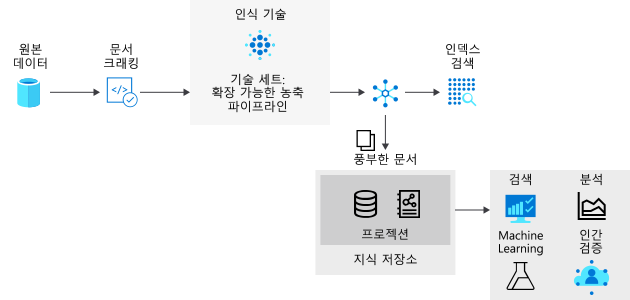

# <a name="introduction-to-knowledge-stores-in-azure-cognitive-search"></a>Azure Cognitive Search의 지식 저장소 소개

> [!IMPORTANT] 
> 지식 저장소는 현재 공개 미리 보기로 제공됩니다. 미리 보기 기능은 서비스 수준 계약 없이 제공되며, 프로덕션 워크로드에는 사용하지 않는 것이 좋습니다. 자세한 내용은 [Microsoft Azure Preview에 대한 추가 사용 약관](https://azure.microsoft.com/support/legal/preview-supplemental-terms/)을 참조하세요. [REST API 버전 2019-05-06-Preview](search-api-preview.md)는 미리 보기 기능을 제공합니다. 현재는 포털 지원이 제한적이며 .NET SDK를 지원하지 않습니다.

기술 자료 저장소는 독립적인 분석 또는 다운스트림 처리를 위해 [AI 보강 파이프라인](cognitive-search-concept-intro.md) 의 출력을 유지 하는 Azure Cognitive Search의 기능입니다. *보강된 문서*는 AI 프로세스를 사용하여 추출, 구조화 및 분석된 콘텐츠에서 만든 파이프라인의 출력입니다. 표준 AI 파이프라인에서 보강된 문서는 일시적이며 인덱싱 중에만 사용된 후에 삭제됩니다. 보강된 문서는 지식 저장소를 사용하여 유지됩니다. 

과거에 인지 기술을 사용 하는 경우 *기술력과* 는 강화 시퀀스를 통해 문서를 이동 한다는 것을 이미 알고 있습니다. 결과는 검색 인덱스이거나 지식 저장소의 프로젝션(이 미리 보기의 새로운 기능)일 수 있습니다. 검색 인덱스와 기술 자료 저장소의 두 출력은 동일한 파이프라인의 제품입니다. 동일한 입력에서 파생 되지만 매우 다양 한 방식으로 구조화, 저장 및 사용 되는 출력이 생성 됩니다.

물리적으로 지식 저장소는 Azure Table 스토리지, Azure Blob 스토리지 또는 둘 다인 [Azure Storage](https://docs.microsoft.com/azure/storage/common/storage-account-overview)입니다. Azure Storage에 연결할 수 있는 모든 도구 또는 프로세스는 지식 저장소의 콘텐츠를 사용할 수 있습니다.



## <a name="benefits-of-knowledge-store"></a>지식 저장소의 이점

지식 저장소는 blob, 분석 한 이미지 파일 또는 구조화 된 데이터와 같은 구조화 되지 않은 반 구조화 된 데이터 파일에서 구조, 컨텍스트 및 실제 콘텐츠를 통해 수집할 하 여 새 형식으로 바꿀 수 있습니다. 단계별 [연습](knowledge-store-create-rest.md)에서는 조밀한 JSON 문서를 하위 구조체로 분할 하는 방법, 다시 구성를 새 구조체로 분할 하는 방법, 그리고 machine learning 및 데이터 과학 워크 로드와 같은 다운스트림 프로세스에 사용할 수 있는 방법에 대해 알아봅니다.

AI 보강 파이프라인이 생성할 수 있는 작업을 확인 하는 것이 유용 하지만, 기술 자료 저장소의 실제 잠재력은 데이터를 변경 하는 기능입니다. 기본 기술 세트로 시작하고, 이를 반복하여 증가하는 수준의 구조를 추가한 다음, Azure Cognitive Search 이외의 다른 앱에서 사용할 수 있는 새 구조로 결합할 수 있습니다.

지식 저장소의 이점을 자세히 열거하면 다음과 같습니다.

+ 보강된 문서를 검색 이외의 [분석 및 보고 도구](#tools-and-apps)에 사용합니다. 파워 쿼리 Power BI는 것이 좋습니다. 하지만 Azure Storage에 연결할 수 있는 도구나 앱은 사용자가 만든 기술 자료 저장소에서 끌어올 수 있습니다.

+ 단계 및 기술 세트 정의를 디버깅하는 동안 AI 인덱싱 파이프라인을 정교화합니다. 지식 저장소는 AI 인덱싱 파이프라인에 있는 기술 세트 정의의 생성물을 보여줍니다. 보강이 어떻게 보이는지 정확히 확인할 수 있으므로 해당 결과를 사용하여 더 나은 기술 세트를 디자인할 수 있습니다. Azure Storage에서 [Storage 탐색기](https://docs.microsoft.com/azure/vs-azure-tools-storage-manage-with-storage-explorer?tabs=windows) 를 사용 하 여 기술 자료 저장소의 내용을 볼 수 있습니다.

+ 데이터를 새 양식으로 변형합니다. 변형은 기술 세트에 포함되지만 중요한 점은 이제 기술 세트가 이 기능을 제공할 수 있다는 것입니다. Azure Cognitive Search의 [쉐이퍼 기술](cognitive-search-skill-shaper.md)은 이 작업에 맞게 확장되었습니다. 변형을 사용하면 관계를 유지하면서 데이터의 사용 목적에 맞는 프로젝션을 정의할 수 있습니다.

> [!Note]
> AI 보강 및 인식 기술을 처음 접하는 가요? Azure Cognitive Search는 Cognitive Services 비전 및 언어 기능과 통합되어 이미지 파일, 엔터티 인식 및 텍스트 파일에서 핵심 구 추출 등에 OCR(광학 문자 인식)을 사용하여 원본 데이터를 추출하고 보강합니다. 자세한 내용은 [Azure Cognitive Search의 AI 보강](cognitive-search-concept-intro.md)을 참조하세요.

## <a name="physical-storage"></a>실제 저장소

기술 자료 저장소의 물리적 식은 기술의 `projections` `knowledgeStore` 정의 요소를 통해 반복 됩니다. 프로젝션은 의도 된 용도와 일치 하도록 출력의 구조를 정의 합니다.

프로젝션은 테이블, 개체 또는 파일로 서 수 있습니다.

```json
"knowledgeStore": { 
    "storageConnectionString": "<YOUR-AZURE-STORAGE-ACCOUNT-CONNECTION-STRING>", 
    "projections": [ 
        { 
            "tables": [ ], 
            "objects": [ ], 
            "files": [ ]
        },
                { 
            "tables": [ ], 
            "objects": [ ], 
            "files": [ ]
        }
```

이 구조에서 지정 하는 프로젝션의 형식에 따라 기술 자료 저장소에서 사용 하는 저장소의 형식이 결정 됩니다.

+ Table storage는를 정의할 `tables`때 사용 됩니다. 분석 도구에 대 한 입력에 대 한 테이블 형식 보고 구조 또는 데이터 프레임으로 다른 데이터 저장소로 내보내기가 필요한 경우 테이블 프로젝션을 정의 합니다. Multiple `tables` 을 지정 하 여 보강 문서의 하위 집합 또는 cross 섹션을 가져올 수 있습니다. 동일한 프로젝션 그룹 내에서 테이블 관계는 모두 사용할 수 있도록 유지 됩니다.

+ Blob 저장소는 또는 `objects` `files`을 정의할 때 사용 됩니다. 의 물리적 표현은 보강 문서 `object` 를 나타내는 계층적 JSON 구조입니다. 는 `file` 문서에서 추출 되어 Blob 저장소에 그대로 전송 되는 이미지입니다.

단일 프로젝션 개체에는 여러 시나리오에 `tables`대 `objects`한 `files`,, 및 집합이 포함 되어 있으며, 하나의 프로젝션을 만드는 데 충분할 수 있습니다. 

그러나 여러 `table` - `object` - 개의 `file` 프로젝션 집합을 만들 수 있으며 다른 데이터 관계를 원하는 경우이 작업을 수행할 수 있습니다. 집합 내에서 데이터가 관련 되어 있으며, 이러한 관계가 존재 하 고 검색 될 수 있다고 가정 합니다. 추가 집합을 만드는 경우 각 그룹의 문서는 관련이 없습니다. 여러 프로젝션 그룹을 사용 하는 예는 동일한 데이터를 온라인 시스템에서 사용 하 고 특정 방식으로 표시 해야 하는 경우와 다르게 표시 되는 데이터 과학 파이프라인에서 동일한 데이터를 사용할 수 있도록 하려는 경우에 발생할 수 있습니다.

## <a name="requirements"></a>요구 사항 

[Azure Storage](https://docs.microsoft.com/azure/storage/) 필요 합니다. 물리적 저장소를 제공 합니다. Blob 저장소, 테이블 저장소 또는 둘 다를 사용할 수 있습니다. Blob 저장소는 일반적으로 출력이 다운스트림 프로세스로 이동 될 때 그대로 유지 되는 보강 문서에 사용 됩니다. Table storage는 분석 및 보고에 일반적으로 사용 되는 보강 문서 조각에 대 한 것입니다.

[기술](cognitive-search-working-with-skillsets.md) 가 필요 합니다. 이 클래스는 `knowledgeStore` 정의를 포함 하 고 보강 문서의 구조와 컴퍼지션을 결정 합니다. 빈 기술를 사용 하 여 기술 자료 저장소를 만들 수 없습니다. 기술에는 기술이 하나 이상 있어야 합니다.

[인덱서가](search-indexer-overview.md) 필요 합니다. 기술은 실행을 구동 하는 인덱서에 의해 호출 됩니다. 인덱서는 고유한 요구 사항 및 특성 집합과 함께 제공 됩니다. 이러한 특성 중 일부에는 기술 자료 저장소에 대 한 직접적인 베어링이 있습니다.

+ 인덱서에는 [지원 되는 azure 데이터 소스가](search-indexer-overview.md#supported-data-sources) 필요 합니다. 궁극적으로 기술 자료 저장소를 만드는 파이프라인은 azure에서 지원 되는 원본에서 데이터를 가져와 시작 합니다. 

+ 인덱서에는 검색 인덱스가 필요 합니다. 인덱서를 사용 하지 않으려는 경우에도 인덱스 스키마를 제공 해야 합니다. 최소 인덱스에는 키로 지정 된 하나의 문자열 필드가 있습니다.

+ 인덱서는 대상 필드에 원본 필드의 별칭을 지정 하는 데 사용 되는 선택적 필드 매핑을 제공 합니다. 기본 필드 매핑을 수정 해야 하는 경우 (다른 이름 또는 형식을 사용 하려면) 인덱서 내에서 [필드 매핑을](search-indexer-field-mappings.md) 만들 수 있습니다. 기술 자료 저장소 출력의 경우 대상은 blob 개체 또는 테이블의 필드 일 수 있습니다.

+ 인덱서에는 일정 및 기타 속성 (예: 다양 한 데이터 원본에서 제공 하는 변경 검색 메커니즘)이 기술 자료 저장소에 적용 될 수도 있습니다. 예를 들어 콘텐츠를 새로 고치기 위해 보강를 정기적으로 [예약할](search-howto-schedule-indexers.md) 수 있습니다. 

## <a name="how-to-create-a-knowledge-store"></a>기술 자료 저장소를 만드는 방법

기술 자료 저장소를 만들려면 포털 또는 미리 보기 REST API (`api-version=2019-05-06-Preview`)를 사용 합니다.

### <a name="use-the-azure-portal"></a>Azure Portal 사용

**데이터 가져오기** 마법사에는 기술 자료 저장소를 만드는 옵션이 포함 되어 있습니다. 초기 탐색의 경우 [네 가지 단계를 통해 첫 번째 정보 저장소를 만듭니다](knowledge-store-connect-power-bi.md).

1. 지원 되는 데이터 원본을 선택 하십시오.

1. 보강 지정: 리소스를 연결 하 고, 기술을 선택 하 고, 기술 자료 저장소를 지정 합니다. 

1. 인덱스 스키마를 만듭니다. 마법사에서이를 요구 하 고 사용자를 위해 유추할 수 있습니다.

1. 마법사를 실행 합니다. 이 마지막 단계에서는 추출, 보강 및 저장소가 수행 됩니다.

### <a name="use-create-skillset-and-the-preview-rest-api"></a>Create 기술 및 preview REST API 사용

는 `knowledgeStore` [기술](cognitive-search-working-with-skillsets.md)내에 정의 되며,이는 다시 [인덱서에](search-indexer-overview.md)의해 호출 됩니다. 보강 하는 동안 Azure Cognitive Search는 Azure Storage 계정에 공백을 만들고 구성에 따라 보강 문서를 blob 또는 테이블로 프로젝션 합니다.

현재 미리 보기 REST API는 프로그래밍 방식으로 기술 자료 저장소를 만들 수 있는 유일한 메커니즘입니다. 쉽게 탐색할 수 있는 방법은 [Postman과 REST API를 사용 하 여 첫 번째 정보 저장소를 만드는](knowledge-store-create-rest.md)것입니다.

이 미리 보기 기능에 대 한 참조 콘텐츠는이 문서의 [API 참조](#kstore-rest-api) 섹션에 있습니다. 

<a name="tools-and-apps"></a>

## <a name="how-to-connect-with-tools-and-apps"></a>도구 및 앱과 연결 하는 방법

보강이 스토리지에 존재하면 Azure BLOB 또는 테이블 스토리지에 연결하는 도구 또는 기술을 사용하여 콘텐츠를 검색, 분석 또는 사용할 수 있습니다. 다음 목록으로 시작합니다.

+ [Storage Explorer](knowledge-store-view-storage-explorer.md) - 보강된 문서 구조 및 콘텐츠를 봅니다. 이 도구를 지식 저장소 콘텐츠를 보기 위한 기준선 도구로 고려합니다.

+ 보고 및 분석을 위한 [Power BI](knowledge-store-connect-power-bi.md) 입니다. 

+ [Azure Data Factory](https://docs.microsoft.com/azure/data-factory/) - 추가 조작을 위한 도구입니다.

<a name="kstore-rest-api"></a>

## <a name="api-reference"></a>API 참조

REST API 버전 `2019-05-06-Preview` 은 기술력과에 대 한 추가 정의를 통해 기술 자료 저장소를 제공 합니다. Api를 호출 하는 방법에 대 한 자세한 내용은 참조 외에도 [Postman을 사용 하 여 기술 자료 저장소 만들기](knowledge-store-create-rest.md) 를 참조 하세요.

+ [기술 세트 만들기(api-version=2019-05-06-Preview)](https://docs.microsoft.com/rest/api/searchservice/2019-05-06-preview/create-skillset) 
+ [기술 업데이트 (api-version = 2019-05 -06-Preview)](https://docs.microsoft.com/rest/api/searchservice/2019-05-06-preview/update-skillset) 


## <a name="next-steps"></a>다음 단계

지식 저장소는 보강된 문서를 지속적으로 유지하므로 기술 세트를 디자인하거나 Azure Storage 계정에 액세스할 수 있는 모든 클라이언트 애플리케이션에서 사용할 새 구조와 콘텐츠를 만들 때 유용합니다.

보강 문서를 만드는 가장 간단한 방법은 [포털](knowledge-store-create-portal.md)을 사용 하는 것 이지만, postman 및 REST API를 사용 하 여 개체를 만들고 참조 하는 방법에 대 한 통찰력을 원하는 경우에 더 유용 합니다.

> [!div class="nextstepaction"]
> [Postman 및 REST를 사용 하 여 기술 자료 저장소 만들기](knowledge-store-create-rest.md)

예측, 기능 및 [기술에서 정의](knowledge-store-projection-overview.md) 하는 방법에 대해 자세히 알아보려면

> [!div class="nextstepaction"]
> [기술 자료 저장소의 프로젝션](knowledge-store-projection-overview.md)

조각화, 인라인 셰이핑 및 관계와 같은 고급 예측 개념에 대 한 자습서는 [기술 자료 저장소에서 예측 정의](knowledge-store-projections-examples.md) 로 시작

> [!div class="nextstepaction"]
> [기술 자료 저장소에서 프로젝션 정의](knowledge-store-projections-examples.md)