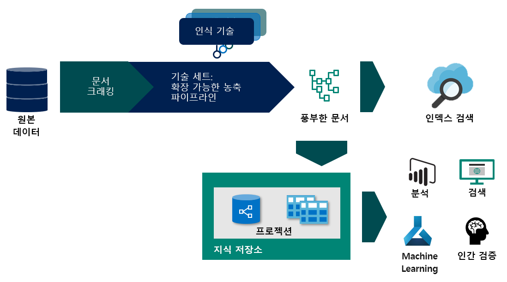

# <a name="what-is-knowledge-store-in-azure-search"></a>Azure Search의 지식 저장소란 무엇인가요?

> [!Note]
> 지식 저장소는 미리 보기로 제공되며 프로덕션 용도로는 제공되지 않습니다. 이 기능은 [REST API 버전 2019-05-06-미리 보기](search-api-preview.md)에서 제공됩니다. 지금은 .NET SDK 지원이 없습니다.
>

지식 저장소는 보강된 문서 및 AI 기반 인덱싱 파이프라인[(인식 검색)](cognitive-search-concept-intro.md)에서 생성된 메타데이터를 저장하는 Azure Search의 선택적 기능입니다. 지식 저장소는 파이프라인의 일부로 구성하는 Azure 스토리지 계정에 의해 지원됩니다. 사용하도록 설정된 경우, 검색 서비스는 이 스토리지 계정을 사용하여 각 보강된 문서의 표시를 캐시에 저장합니다. 

과거에 인식 검색을 사용해본 적이 있는 경우 기술 세트를 사용하여 보강 시퀀스를 통해 문서를 이동할 수 있음을 이미 알고 있을 것입니다. 그 결과는 Azure Search 인덱스 또는 지식 저장소의 프로젝션(이 미리 보기의 새로운 기능)일 수 있습니다.

프로젝션은 다운스트림 앱에서 사용하기 위해 데이터 구조를 지정하는 방법입니다. Azure Storage용으로 만들어진 [Azure Storage 탐색기](https://docs.microsoft.com/azure/vs-azure-tools-storage-manage-with-storage-explorer?tabs=windows) 또는 Azure Storage에 연결된 앱을 사용할 수 있으며, 이를 통해 보강된 문서를 사용하는 새로운 가능성이 열렸습니다. 예를 들어 데이터 과학 파이프라인과 사용자 지정 분석이 가능해졌습니다.



지식 저장소를 사용하려면 인덱싱 파이프라인의 단계별 작업을 정의하는 기술 세트에 `knowledgeStore` 요소를 추가합니다. Azure Search는 실행하는 동안 Azure 스토리지 계정에 공간을 만들고 이 공간을 정의 및 파이프라인에서 만든 콘텐츠로 채웁니다.

## <a name="benefits-of-knowledge-store"></a>지식 저장소의 이점

지식 저장소는 BLOB과 같은 비정형 및 준정형 데이터 파일, 분석을 실행한 이미지 파일 또는 새 양식으로 변형된 정형 데이터에서 수집한 구조, 상황 및 실제 콘텐츠를 제공합니다. 이 미리 보기를 위해 작성된 [단계별 연습](knowledge-store-howto.md)에서 밀도가 높은 JSON 문서를 하위 구조로 분할하고, 새 구조로 재구성하고, 다른 방법으로 기계 학습 및 데이터 과학 워크로드와 같은 다운스트림 프로세스에 사용할 수 있도록 만드는 방법을 미리 확인할 수 있습니다.

AI 기반 인덱싱 파이프라인이 무엇을 만들어낼 수 있는지 확인하는 것은 유용하지만 지식 저장소의 진정한 위력은 데이터를 변형하는 기능입니다. 기본 기술 세트로 시작한 다음, 증가하는 구조 단계를 반복해서 추가한 후 Azure Search 이외의 다른 앱에서 사용할 수 있는 새로운 구조로 결합할 수 있습니다.

지식 저장소의 이점을 자세히 열거하면 다음과 같습니다.

+ 보강된 문서를 검색 이외의 [분석 및 보고 도구](#tools-and-apps)에 사용합니다. 파워 쿼리 포함 Power BI는 매력적인 선택이지만 Azure Storage에 연결할 수 있는 모든 도구 또는 앱은 사용자가 만드는 지식 저장소에서 끌어올 수 있습니다.

+ 단계 및 기술 세트 정의를 디버깅하는 동안 AI 인덱싱 파이프라인을 정교화합니다. 지식 저장소는 AI 인덱싱 파이프라인에 있는 기술 세트 정의의 생성물을 보여줍니다. 보강이 어떻게 보이는지 정확히 확인할 수 있으므로 해당 결과를 사용하여 더 나은 기술 세트를 디자인할 수 있습니다. Azure Storage의 [Azure Storage 탐색기](https://docs.microsoft.com/azure/vs-azure-tools-storage-manage-with-storage-explorer?tabs=windows)를 사용하여 지식 저장소의 콘텐츠를 볼 수 있습니다.

+ 데이터를 새 양식으로 변형합니다. 변형은 기술 세트에 포함되지만 중요한 점은 이제 기술 세트가 이 기능을 제공할 수 있다는 것입니다. Azure Search의 [셰이퍼 기술](cognitive-search-skill-shaper.md)은 이 작업에 맞게 확장되었습니다. 변형을 사용하면 관계를 유지하면서 데이터의 사용 목적에 맞는 프로젝션을 정의할 수 있습니다.

> [!Note]
> Cognitive Services를 사용한 AI 기반 인덱싱이 익숙하지 않으세요? Azure Search는 Cognitive Services 비전 및 언어 기능과 상호 작용하여 이미지 파일, 엔터티 인식 및 텍스트 파일에서 핵심 구 추출 등에 대해 OCR(광학 문자 인식)을 사용하여 원본 데이터를 추출하고 보강합니다. 자세한 내용은 [인식 검색이란?](cognitive-search-concept-intro.md)을 참조하세요.

## <a name="create-a-knowledge-store"></a>지식 저장소 만들기

지식 저장소는 기술 세트 정의의 일부입니다. 이 미리 보기에서 지식 저장소를 만들려면 REST API가 필요하며 `api-version=2019-05-06-Preview` 또는 **데이터 가져오기** 마법사를 사용합니다.

다음 JSON은 인덱서(표시되지 않음)가 호출하는 기술 세트의 일부인 `knowledgeStore`를 지정합니다. `knowledgeStore` 내의 프로젝션에 대한 사양은 Azure Storage에서 테이블 또는 개체를 만드는지 여부를 결정합니다.

AI 기반 인덱싱에 이미 익숙하다면 기술 세트 정의는 각 보강된 문서의 생성, 체계화 및 내용을 결정합니다.

```json
{
  "name": "my-new-skillset",
  "description": 
  "Example showing knowledgeStore placement, supported in api-version=2019-05-06-Preview. You need at least one skill, most likely a Shaper skill if you are modulating data structures.",
  "skills":
  [
    {
    "@odata.type": "#Microsoft.Skills.Util.ShaperSkill",
    "context": "/document/content/phrases/*",
    "inputs": [
        {
        "name": "text",
        "source": "/document/content/phrases/*"
        },
        {
        "name": "sentiment",
        "source": "/document/content/phrases/*/sentiment"
        }
    ],
    "outputs": [
        {
        "name": "output",
        "targetName": "analyzedText"
        }
    ]
    },
  ],
  "cognitiveServices": 
    {
    "@odata.type": "#Microsoft.Azure.Search.CognitiveServicesByKey",
    "description": "mycogsvcs resource in West US 2",
    "key": "<your key goes here>"
    },
  "knowledgeStore": { 
    "storageConnectionString": "<your connection string goes here>", 
    "projections": [ 
        { 
            "tables": [  
            { "tableName": "Reviews", "generatedKeyName": "ReviewId", "source": "/document/Review" , "sourceContext": null, "inputs": []}, 
            { "tableName": "Sentences", "generatedKeyName": "SentenceId", "source": "/document/Review/Sentences/*", "sourceContext": null, "inputs": []}, 
            { "tableName": "KeyPhrases", "generatedKeyName": "KeyPhraseId", "source": "/document/Review/Sentences/*/KeyPhrases", "sourceContext": null, "inputs": []}, 
            { "tableName": "Entities", "generatedKeyName": "EntityId", "source": "/document/Review/Sentences/*/Entities/*" ,"sourceContext": null, "inputs": []} 

            ], 
            "objects": [ 
                { 
                "storageContainer": "Reviews", 
                "format": "json", 
                "source": "/document/Review", 
                "key": "/document/Review/Id" 
                } 
            ]      
        }    
    ]     
    } 
}
```

## <a name="components-backing-a-knowledge-store"></a>지식 저장소를 지원하는 구성 요소

지식 저장소를 만들려면 다음과 같은 서비스 및 아티팩트가 필요합니다.

### <a name="1---source-data"></a>1 - 원본 데이터

보강하려는 데이터 또는 문서가 Azure Search 인덱서에서 지원하는 Azure 데이터 원본에 존재해야 합니다. 

* [Azure SQL](search-howto-connecting-azure-sql-database-to-azure-search-using-indexers.md)

* [Azure Cosmos DB](search-howto-index-cosmosdb.md)

* [Azure Blob Storage](search-howto-indexing-azure-blob-storage.md)

[Azure 테이블 스토리지](search-howto-indexing-azure-tables.md)는 지식 저장소의 아웃바운드 데이터에 사용할 수 있지만, AI 기반 인덱싱 파이프라인에 대한 인바운드 데이터의 리소스로 사용할 수 없습니다.

### <a name="2---azure-search-service"></a>2 - Azure Search 서비스

또한 데이터 보강에 사용되는 개체를 만들고 구성하려면 Azure Search 및 REST API도 필요합니다. 지식 저장소를 만들기 위한 REST API는 `api-version=2019-05-06-Preview`입니다.

Azure Search는 인덱서 기능을 제공하며, 인덱서는 전체 프로세스를 엔드투엔드로 추진하여 Azure Storage에 지속적이고 보강된 문서를 만들기 위해 사용됩니다. 인덱서는 데이터 원본, 인덱서 및 기술 세트를 사용하며, 이들은 모두 지식 저장소를 만들고 채우기 위해 필요합니다.

| Object | REST API | 설명 |
|--------|----------|-------------|
| 데이터 원본 | [데이터 원본 만들기](https://docs.microsoft.com/rest/api/searchservice/create-data-source)  | 보강된 문서를 만드는 데 사용되는 원본 데이터를 제공하는 외부 Azure 데이터 원본을 식별하는 리소스입니다.  |
| 기술 세트 | [기술 세트 만들기(api-version=2019-05-06)](https://docs.microsoft.com/rest/api/searchservice/create-skillset)  | 인덱싱 중에 보강 파이프라인에 사용되는 [기본 제공 기술](cognitive-search-predefined-skills.md) 및 [사용자 지정 인식 기술](cognitive-search-custom-skill-interface.md)의 사용을 조정하는 리소스입니다. |
| index | [인덱스 만들기](https://docs.microsoft.com/rest/api/searchservice/create-index)  | Azure Search 인덱스를 표현하는 스키마입니다. 원본 데이터 또는 보강 단계에서 생성되는 필드에 매핑되는 인덱스의 필드(예: 엔터티 인식으로 생성된 조직 이름에 대한 필드)입니다. |
| 인덱서 | [인덱서 만들기(api-version=2019-05-06)](https://docs.microsoft.com/rest/api/searchservice/create-skillset)  | 데이터 원본, 기술 집합, 원본 및 중간 데이터 구조에서 대상 인덱스로 필드 연결 및 인덱스 자체를 포함하는 인덱싱 중에 사용되는 리소스를 정의하는 구성 요소입니다. 데이터 수집 및 보강을 위한 트리거가 인덱서를 실행합니다. 출력은 기술 세트를 통해 보강된 원본 데이터로 채워진 인덱스 스키마를 기반으로 하는 검색 인덱스입니다.  |

### <a name="3---cognitive-services"></a>3 - Cognitive Services

기술 세트에 지정된 보강은 Cognitive Services의 Computer Vision 및 언어 기능을 기반으로 합니다. Cognitive Services 기능은 기술 세트를 통해 인덱싱 중에 이용됩니다. 기술 세트는 기술의 컴퍼지션이며 기술은 특정 Computer Vision 및 언어 기능에 바인딩됩니다. Cognitive Services를 통합하려면 기술 세트에 [Cognitive Services 리소스를 연결](cognitive-search-attach-cognitive-services.md)합니다.

### <a name="4---storage-account"></a>4 - Azure Storage 계정

Azure Search는 Azure Storage 계정 아래에 기술 세트를 구성하는 방법에 따라 BLOB 컨테이너 또는 테이블을 만듭니다. 데이터가 Azure BLOB 또는 테이블 스토리지에서 생성된 경우 이들은 이미 만들어져 있습니다. 그렇지 않으면 Azure 스토리지 계정을 만들어야 합니다. Azure Storage의 테이블 및 개체는 AI 기반 인덱싱 파이프라인에서 만든 보강된 문서를 포함합니다.

스토리지 계정은 기술 세트에 지정됩니다. `api-version=2019-05-06-Preview`에서 기술 세트 정의는 계정 정보를 제공할 수 있도록 지식 저장소 정의를 포함합니다.

<a name="tools-and-apps"></a>

### <a name="5---access-and-consume"></a>5 - 액세스 및 사용

보강이 스토리지에 존재하면 Azure BLOB 또는 테이블 스토리지에 연결하는 도구 또는 기술을 사용하여 콘텐츠를 검색, 분석 또는 사용할 수 있습니다. 다음 목록으로 시작합니다.

+ [Azure Storage 탐색기](https://docs.microsoft.com/azure/vs-azure-tools-storage-manage-with-storage-explorer?tabs=windows) - 보강된 문서 구조 및 콘텐츠를 봅니다. 이 도구를 지식 저장소 콘텐츠를 보기 위한 기준선 도구로 고려합니다.

+ [파워 쿼리 포함 Power BI](https://support.office.com/article/connect-to-microsoft-azure-blob-storage-power-query-f8165faa-4589-47b1-86b6-7015b330d13e) - 자연어 쿼리를 위한 도구입니다. 또는 숫자 데이터가 있는 경우 보고 및 분석 도구를 사용합니다.

+ [Azure Data Factory](https://docs.microsoft.com/azure/data-factory/) - 추가 조작을 위한 도구입니다.

+ Azure Search 인덱스 - [인식 검색](cognitive-search-concept-intro.md)을 사용하여 인덱싱한 콘텐츠에 대해 전체 텍스트 검색을 수행하기 위한 도구입니다.

## <a name="document-persistence"></a>문서 지속성

스토리지 계정 내에서 보강을 Azure 테이블 스토리지 내의 테이블 또는 Azure BLOB 스토리지의 개체로 표시할 수 있습니다. 해당 보강을 호출하고 저장한 후 데이터를 다른 데이터베이스 및 도구에 로드하기 위한 원본으로 사용할 수 있습니다.

+ 테이블 스토리지는 테이블 양식의 데이터에 대한 스키마 인식 표시를 원하는 경우 유용합니다. 요소를 새로운 방법으로 변형하거나 다시 결합하려는 경우 테이블 스토리지가 필요한 세분성을 제공합니다.

+ BLOB 스토리지는 각 문서에 대한 하나의 통합형 JSON 표시입니다. 기술 세트 한 개에 두 스토리지 옵션을 모두 사용하여 전체 범위의 식을 가져올 수 있습니다.

+ Azure Search는 인덱스의 콘텐츠를 유지합니다. 검색과 관련이 없는 시나리오의 경우, 예를 들어 또 다른 도구에서 검색하는 것이 목표인 경우 파이프라인이 생성하는 인덱스를 삭제할 수 있습니다. 그러나 인덱스를 유지하고 [Azure Search 탐색기](search-explorer.md)와 같은 기본 제공 도구를 콘텐츠와 상호 작용하기 위한 제3의 매체로 사용할 수 있습니다(Azure Search 탐색기 및 분석 앱의 이면에서).

문서 콘텐츠와 함께 보강된 문서는 보강을 생성한 기술 세트 버전에 대한 메타데이터를 포함합니다.  

## <a name="inside-a-knowledge-store"></a>지식 저장소 내부

지식 저장소는 주석 캐시 및 프로젝션으로 구성됩니다. *캐시*는 기술에서 나온 결과를 캐시에 저장하고 변경 내용을 추적하기 위해 내부적으로 사용합니다. *프로젝션*은 사용 목적과 일치하는 보강의 스키마 및 구조를 정의합니다. 지식 저장소마다 한 개의 캐시가 있지만 프로젝션은 여러 개가 있을 수 있습니다. 

캐시는 언제나 BLOB 컨테이너이지만 테이블 또는 개체로 표현할 수 있습니다.

+ 개체인 프로젝션은 BLOB 스토리지에 매핑되며 프로젝션은 컨테이너에 저장됩니다. 컨테이너 내에는 데이터 과학 파이프라인과 같은 시나리오에 대한 JSON의 개체 또는 계층 표시가 있습니다.

+ 테이블인 프로젝션은 테이블 스토리지에 매핑됩니다. 테이블 표시는 데이터 분석 또는 기계 학습용 데이터 프레임으로 내보내기와 같은 시나리오에 대한 관계를 유지합니다. 그런 다음, 보강된 프로젝션을 다른 데이터 원본으로 쉽게 가져올 수 있습니다. 

지식 저장소에 조직의 다양한 사용자에 맞는 여러 개의 프로젝션을 만들 수 있습니다. 개발자는 보강된 문서의 전체 JSON 표시에 액세스해야 할 수 있는 반면, 데이터 과학자 또는 분석자는 기술 세트에 의해 형성된 세분화된 또는 모듈형 데이터 구조를 원할 수 있습니다.

예를 들어 보강 프로세스의 목표 중 하나가 모델을 학습하는 데 사용되는 데이터 세트를 만드는 것이기도 한 경우 데이터를 개체 저장소에 프로젝션하는 것은 데이터 과학 파이프라인의 데이터를 사용하는 한 가지 방법이 될 수 있습니다. 또는 보강된 문서를 기반으로 빠른 Power BI 대시보드를 만들려는 경우 테이블 형식의 프로젝션이 적합할 수 있습니다.

<!---
## Data lifecycle and billing

Each time you run the indexer, the cache in Azure storage is updated if the skillset definition or underlying source data has changed. As input documents are edited or deleted, changes are propagated through the annotation cache to the projections, ensuring that your projected data is a current representation of your inputs at the end of the indexer run. 

Generally speaking, pipeline processing can be an all-or-nothing operation, but Azure Search can process incremental changes, which saves you time and money.

If a document is new or updated, all skills are run. If only the skillset changes, reprocessing is scoped to just those skills and documents affected by your edit.

### Changes to a skillset
Suppose that you have a pipeline composed of multiple skills, operating over a large body of static data (for example, scanned documents), that takes 8 hours and costs $200 to create the knowledge store. Now suppose you need to tweak one of the skills in the skillset. Rather than starting over, Azure Search can determine which skill is affected, and reprocess only that skill. Cached data and projections that are unaffected by the change remain intact in the knowledge store.

### Changes in the data
Scenarios can vary considerably, but let's suppose instead of static data, you have volatile data that changes between indexer invocations. Given no changes to the skillset, you are charged for processing the delta of new and modified document. The timestamp information varies by data source, but for illustration, in a Blob container, Azure Search looks at the `lastmodified` date to determine which blobs need to be ingested.

> [!Note]
> While you can edit the data in the projections, any edits will be overwritten on the next pipeline invocation, assuming the document in source data is updated. 

### Deletions

Although Azure Search creates and updates structures and content in Azure storage, it does not delete them. Projections and cached documents continue to exist even when the skillset is deleted. As the owner of the storage account, you should delete a projection if it is no longer needed. 

### Tips for development

+ Start small with a representative sample of your data as you make significant changes to skillset composition. As your design finalizes, you can slowly add more data during later-stage development, and then roll in the entire data set when you are comfortable with the pipeline composition.

+ Retain control over indexer invocation. Indexers can run on a schedule, which is helpful for solutions that are rolled into production, but less helpful if you are actively developing your pipeline. During development, avoid schedules so that you don’t lose track of cache or projection state. Once your solution is in production and skillset composition is static, you can put the indexer on a schedule to pick up routine changes in the external source data. 

-->

## <a name="where-do-i-start"></a>시작 단계

학습 목적이라면 체험 서비스를 권장하지만 체험 트랜잭션 수는 구독별로 하루 20개 문서로 제한된다는 것을 알고 있어야 합니다.

여러 서비스를 사용하는 경우 최고의 성능을 달성하고 비용을 최소화하기 위해 모든 서비스를 같은 영역에 만듭니다. 같은 영역의 또 다른 서비스로 이동하는 인바운드 데이터 또는 아웃바운드 데이터를 위한 대역폭에 대해서는 요금이 부과되지 않습니다.

**1단계: [Azure Search 리소스 만들기](search-create-service-portal.md)** 

**2단계: [Azure Storage 계정 만들기](https://docs.microsoft.com/azure/storage/common/storage-quickstart-create-account?tabs=azure-portal)** 

**3단계: [Cognitive Services 리소스 만들기](https://docs.microsoft.com/azure/cognitive-services/cognitive-services-apis-create-account)** 

**4단계: [Portal에서 시작](cognitive-search-quickstart-blob.md) - 또는 - [REST 및 Postman을 사용하여 샘플 데이터로 시작](knowledge-store-howto.md)** 

REST `api-version=2019-05-06-Preview`를 사용하여 지식 저장소를 포함하는 AI 기반 파이프라인을 생성할 수 있습니다. 최신 미리 보기 API에서 기술 세트 개체는 `knowledgeStore` 정의를 제공합니다.

## <a name="takeaways"></a>핵심 내용

지식 저장소는 검색 이외의 시나리오에서 보강된 문서의 사용 지원, 비용 억제 및 보강 프로세스의 변동 관리를 포함하되 이에 국한되지 않고 다양한 이점을 제공합니다. [지식 저장소로 시작하는 방법](knowledge-store-howto.md)에서 설명한 대로, 해당 기능은 모두 기술 세트에 스토리지 계정을 추가하고 업데이트된 식 언어를 사용하여 간단히 사용할 수 있습니다. 

## <a name="next-steps"></a>다음 단계

보강된 문서를 만드는 가장 간단한 방법은 **데이터 가져오기** 마법사를 이용하는 것입니다.

> [!div class="nextstepaction"]
> [빠른 시작: 포털 연습에서 Cognitive Search 시도](cognitive-search-quickstart-blob.md)
