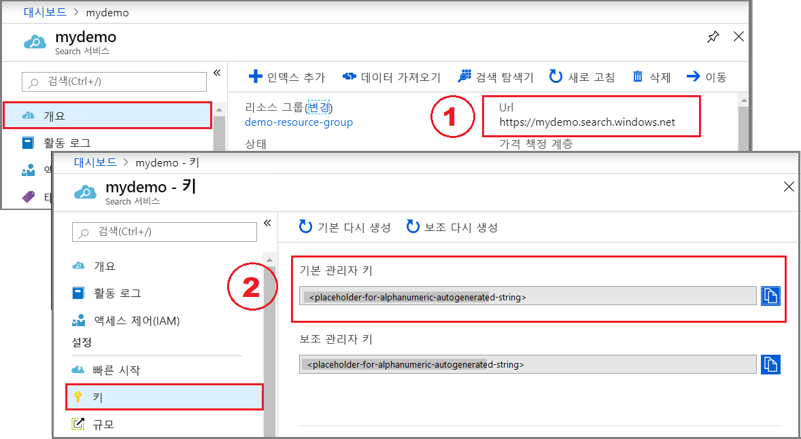
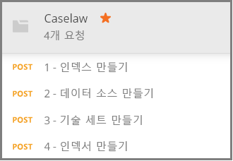

# <a name="how-to-get-started-with-knowledge-mining-in-azure-search"></a>Azure Search에서 정보 마이닝을 시작하는 방법

> [!Note]
> 지식 저장소는 미리 보기로 제공되며 프로덕션 용도로는 제공되지 않습니다. 이 기능은 [REST API 버전 2019-05-06-미리 보기](search-api-preview.md)에서 제공됩니다. 지금은 .NET SDK 지원이 없습니다.
>
[기술 저장소](knowledge-store-concept-intro.md)는 인덱싱 중에 생성된 AI 보강된 문서를 다른 앱의 다운스트림 정보 마이닝을 위해 Azure 스토리지 계정에 저장합니다. 또한 저장된 강화를 사용하여 Azure Search 인덱싱 파이프라인을 이해하고 구체화할 수 있습니다. 

지식 저장소는 *기술 세트*로 정의되며 *인덱서*에 의해 생성됩니다. 지식 저장소의 실제 식은 스토리지의 데이터 구조를 결정하는 *프로젝션*을 통해 지정됩니다. 이 연습을 마칠 때쯤이면 이러한 모든 개체를 만들고 서로 맞는 방식을 알게 됩니다. 

이 연습에서는 샘플 데이터, 서비스 및 도구로 시작하여 기술 집합을 정의하는 데 집중하면서 첫 번째 지식 저장소를 만들고 사용하는 기본 워크플로에 대해 알아봅니다.

## <a name="prerequisites"></a>필수 조건

지식 저장소는 실제 스토리지에서 제공되는 Azure Blob 스토리지 및 Azure Table 스토리지와 개체 생성 및 업데이트를 위한 Azure Search 및 Cognitive Services와 함께 여러 서비스의 중심에 있습니다. [기본 아키텍처](knowledge-store-concept-intro.md)에 대한 친숙성은 이 연습에 필수 조건입니다.

이 빠른 시작에서 사용되는 서비스와 도구는 다음과 같습니다. 

+ HTTP 요청을 Azure Search에 보내는 데 사용되는 [Postman 데스크톱 앱을 가져옵니다](https://www.getpostman.com/).

+ 샘플 데이터 및 지식 저장소를 저장하기 위한 [Azure 스토리지 계정을 만듭니다](https://docs.microsoft.com/azure/storage/common/storage-quickstart-create-account). 지식 저장소는 Azure 스토리지에 있습니다.

+ AI 강화에서 사용되는 모든 기술에 광범위하게 액세스할 수 있도록 S0 종량제 계층에서 [Cognitive Services 리소스를 만듭니다](https://docs.microsoft.com/azure/cognitive-services/cognitive-services-apis-create-account). Cognitive Services와 Azure Search 서비스는 동일한 지역에 있어야 합니다.

+ [Azure Search 서비스를 만들거나](search-create-service-portal.md) 현재 구독에서 [기존 서비스를 찾습니다](https://ms.portal.azure.com/#blade/HubsExtension/BrowseResourceBlade/resourceType/Microsoft.Search%2FsearchServices). 이 자습서에서는 체험 서비스를 사용할 수 있습니다. 

샘플 JSON 문서 및 Postman 컬렉션 파일도 필요합니다. 보조 파일 찾기 및 로드를 위한 지침은 [샘플 데이터 준비](#prepare-sample-data) 섹션에서 제공됩니다.

## <a name="get-a-key-and-url"></a>키 및 URL 가져오기

REST를 호출하려면 모든 요청에 대한 액세스 키와 서비스 URL이 필요합니다. 검색 서비스는 둘 모두를 사용하여 작성되므로 Azure Search를 구독에 추가한 경우 다음 단계에 따라 필요한 정보를 확보하십시오.

1. [Azure Portal에 로그인](https://portal.azure.com/)하고, 검색 서비스 **개요** 페이지에서 URL을 가져옵니다. 엔드포인트의 예는 다음과 같습니다. `https://mydemo.search.windows.net`

1. **설정** > **키**에서 서비스에 대한 모든 권한의 관리자 키를 가져옵니다. 교체 가능한 두 개의 관리자 키가 있으며, 하나를 롤오버해야 하는 경우 비즈니스 연속성을 위해 다른 하나가 제공됩니다. 개체 추가, 수정 및 삭제 요청 시 기본 또는 보조 키를 사용할 수 있습니다.

    

모든 요청에서 서비스에 보내는 각 요청마다 API 키가 필요합니다. 다음 섹션의 각 HTTP 요청에서 서비스 이름 및 API 키를 제공합니다.

<a name="prepare-sample-data"></a>

## <a name="prepare-sample-data"></a>샘플 데이터 준비

지식 저장소는 보강 파이프라인의 출력을 포함합니다. 입력은 파이프라인을 통해 진행하므로 궁극적으로 "사용 가능한"이 되는 "사용할 수 없는" 데이터로 구성됩니다. 사용할 수 없는 데이터의 예제로 텍스트 또는 이미지 특성을 분석해야 하는 이미지 파일 또는 엔터티, 핵심 문구 또는 감정에 대해 분석할 수 있는 조밀한 텍스트 파일을 포함할 수 있습니다. 

이 연습에서는 [Caselaw 액세스 프로젝트](https://case.law/bulk/download/) 공용 대량 데이터 다운로드 페이지에서 생성되는 조밀한 텍스트 파일(사례 정보)을 사용합니다. 이 연습을 위해 10개의 문서 샘플을 GitHub에 업로드했습니다. 

이 작업에서는 파이프라인에 대한 입력으로 사용하도록 이러한 문서에 대한 Azure Blob 컨테이너를 만듭니다. 

1. [Azure Search 샘플 데이터](https://github.com/Azure-Samples/azure-search-sample-data/tree/master/caselaw) 리포지토리를 다운로드하고 추출하여 [Caselaw 데이터 세트](https://github.com/Azure-Samples/azure-search-sample-data/tree/master/caselaw)를 가져옵니다. 

1. [Azure Portal](https://portal.azure.com)에 로그인하고 Azure Storage 계정으로 이동한 후 **Blobs**를 클릭하고 **+ 컨테이너**를 클릭합니다.

1. 샘플 데이터가 포함되도록 [Blob 컨테이너를 만듭니다](https://docs.microsoft.com/azure/storage/blobs/storage-quickstart-blobs-portal). 

   1. 컨테이너 이름을 `caselaw-test`로 지정합니다. 
   
   1. 유효한 값에 대한 공용 액세스 수준을 설정합니다.

1. 컨테이너를 만들었으면 연 다음, 명령 모음에서 **업로드**를 선택합니다.

   

1. **caselaw-sample.json** 샘플 파일이 있는 폴더로 이동합니다. 파일을 선택한 다음, **업로드**를 클릭합니다.

1. Azure 스토리지에 있는 동안 연결 문자열 및 컨테이너 이름을 가져옵니다.  [데이터 원본 만들기](#create-data-source)에서 이러한 두 문자열이 필요합니다.

   1. 개요 페이지에서 **액세스 키**를 클릭하고 *연결 문자열*을 복사합니다. `DefaultEndpointsProtocol=https;`로 시작하고 `EndpointSuffix=core.windows.net`으로 끝납니다. 사용자 계정 이름 및 키가 사이에 있습니다. 

   1. 컨테이너 이름은 `caselaw-test` 또는 할당한 이름이어야 합니다.


## <a name="set-up-postman"></a>Postman 설정

Postman은 Azure Search에 요청 및 JSON 문서를 보내는 데 사용하는 클라이언트 앱입니다. 다양한 요청은 이 문서의 정보만을 사용하여 작성될 수 있습니다. 그러나 가장 큰 요청 중 두 개는(인덱스 만들기, 기술 세트 만들기) 문서에 포함되기에 너무 큰 자세한 정보 JSON을 포함합니다. 

모든 JSON 문서 및 요청을 완전하게 사용할 수 있도록 Postman 컬렉션 파일을 만들었습니다. 이 파일을 다운로드한 다음, 가져오는 것이 클라이언트 설정에서 첫 번째 작업입니다.

1. [Azure Search Postman 샘플](https://github.com/Azure-Samples/azure-search-postman-samples) 리포지토리를 다운로드하고 압축을 풉니다.

1. Postman을 시작하고 Caselaw Postman 컬렉션을 가져옵니다.

   1. **가져오기** > **파일 가져오기** > **파일 선택**을 클릭합니다. 

   1. \azure-search-postman-samples-master\azure-search-postman-samples-master\Caselaw 폴더로 이동합니다.

   1. **Caselaw.postman_collection_v2.json**을 선택합니다. 컬렉션에 네 개의 **POST** 요청이 표시됩니다.

   
   

## <a name="create-an-index"></a>인덱스 만들기
    
첫 번째 요청에서는 [인덱스 API 만들기](https://docs.microsoft.com/rest/api/searchservice/create-data-source)를 사용하여 검색 가능한 모든 데이터를 저장하는 Azure Search 인덱스를 만듭니다. 인덱스는 모든 필드 및 특성을 지정합니다.

기술 마이닝에 대한 인덱스가 반드시 필요한 것은 아니지만, 인덱스가 제공되지 않으면 인덱서가 실행되지 않습니다. 

1. `https://YOUR-AZURE-SEARCH-SERVICE-NAME.search.windows.net/indexes?api-version=2019-05-06-Preview` URL에서 `YOUR-AZURE-SEARCH-SERVICE-NAME`을 검색 서비스의 이름으로 바꿉니다. 

1. 헤더 섹션에서 `<YOUR AZURE SEARCH ADMIN API-KEY>`를 Azure Search에 대한 관리 API 키로 바꿉니다.

1. 본문 섹션에서 JSON 문서는 인덱스 스키마입니다. 가시성을 위해 축소된 인덱스의 외부 셸을 구성하는 요소는 다음과 같습니다. 필드 컬렉션은 사례 데이터 세트의 필드에 해당합니다.

   ```json
   {
      "name": "caselaw",
      "defaultScoringProfile": null,
      "fields": [],
      "scoringProfiles": [],
      "corsOptions": null,
      "suggesters": [],
      "analyzers": [],
      "tokenizers": [],
      "tokenFilters": [],
      "charFilters": [],
      "encryptionKey": null
   }
   ```

1. `fields` 컬렉션을 확장합니다. 단순 필드, 중첩된 하부 구조 및 컬렉션이 있는 [복합 필드](search-howto-complex-data-types.md)로 구성된 대량 인덱스 정의를 포함합니다.

   302-384번 줄의 `casebody` 복합 필드에 대한 필드 정의를 검토합니다. 계층적 표현이 필요한 경우 복합 필드에 다른 복합 필드가 포함될 수 있습니다. 계층적 구조는 여기에 표시된 것처럼 기술 세트의 프로젝션으로 인덱스에서 모델링될 수 있으므로 지식 저장소에서 중첩된 데이터 구조를 만듭니다.

   ```json
   {
    "name": "casebody",
    "type": "Edm.ComplexType",
    "fields": [
        {
            "name": "status",
            "type": "Edm.String",
            "searchable": true,
            "filterable": true,
            "retrievable": true,
            "sortable": true,
            "facetable": true,
            "key": false,
            "indexAnalyzer": null,
            "searchAnalyzer": null,
            "analyzer": null,
            "synonymMaps": []
        },
        {
            "name": "data",
            "type": "Edm.ComplexType",
            "fields": [
                {
                    "name": "head_matter",
                    "type": "Edm.String",
                    "searchable": true,
                    "filterable": false,
                    "retrievable": true,
                    "sortable": false,
                    "facetable": false,
                    "key": false,
                    "indexAnalyzer": null,
                    "searchAnalyzer": null,
                    "analyzer": null,
                    "synonymMaps": []
                },
                {
                    "name": "opinions",
                    "type": "Collection(Edm.ComplexType)",
                    "fields": [
                        {
                            "name": "author",
                            "type": "Edm.String",
                            "searchable": true,
                            "filterable": true,
                            "retrievable": true,
                            "sortable": false,
                            "facetable": true,
                            "key": false,
                            "indexAnalyzer": null,
                            "searchAnalyzer": null,
                            "analyzer": null,
                            "synonymMaps": []
                        },
                        {
                            "name": "text",
                            "type": "Edm.String",
                            "searchable": true,
                            "filterable": false,
                            "retrievable": true,
                            "sortable": false,
                            "facetable": false,
                            "key": false,
                            "indexAnalyzer": null,
                            "searchAnalyzer": null,
                            "analyzer": null,
                            "synonymMaps": []
                        },
                        {
                            "name": "type",
                            "type": "Edm.String",
                            "searchable": true,
                            "filterable": true,
                            "retrievable": true,
                            "sortable": false,
                            "facetable": true,
                            "key": false,
                            "indexAnalyzer": null,
                            "searchAnalyzer": null,
                            "analyzer": null,
                            "synonymMaps": []
                        }
                    ]
                },
    . . .
   ```

1. **보내기**를 클릭하여 요청을 실행합니다.  응답으로 **상태: 201 생성됨** 메시지를 얻게 됩니다.

<a name="create-data-source"></a>

## <a name="create-a-data-source"></a>데이터 소스 만들기

두 번째 요청에서는 [데이터 원본 만들기 API](https://docs.microsoft.com/rest/api/searchservice/create-data-source)를 사용하여 Azure Blob 스토리지에 연결합니다. 

1. `https://YOUR-AZURE-SEARCH-SERVICE-NAME.search.windows.net/datasources?api-version=2019-05-06-Preview` URL에서 `YOUR-AZURE-SEARCH-SERVICE-NAME`을 검색 서비스의 이름으로 바꿉니다. 

1. 헤더 섹션에서 `<YOUR AZURE SEARCH ADMIN API-KEY>`를 Azure Search에 대한 관리 API 키로 바꿉니다.

1. 본문 섹션에서 JSON 문서는 스토리지 계정 연결 문자열 및 Blob 컨테이너 이름을 포함합니다. 연결 문자열은 Azure Portal에 있는 스토리지 계정의 **액세스 키** 내에서 찾을 수 있습니다. 

    ```json
    {
        "name": "caselaw-ds",
        "description": null,
        "type": "azureblob",
        "subtype": null,
        "credentials": {
            "connectionString": "DefaultEndpointsProtocol=https;AccountName=<YOUR-STORAGE-ACCOUNT>;AccountKey=<YOUR-STORAGE-KEY>;EndpointSuffix=core.windows.net"
        },
        "container": {
            "name": "<YOUR-BLOB-CONTAINER-NAME>",
            "query": null
        },
        "dataChangeDetectionPolicy": null,
        "dataDeletionDetectionPolicy": null
    }
    ```

1. **보내기**를 클릭하여 요청을 실행합니다.  응답으로 **상태: 201 생성됨** 메시지를 얻게 됩니다.


<a name="create-skillset"></a>

## <a name="create-a-skillset-and-knowledge-store"></a>기술 집합 및 지식 저장소 만들기

세 번째 요청에서는 [기술 세트 만들기 API](https://docs.microsoft.com/rest/api/searchservice/create-skillset)를 사용하여 호출할 인지 기술, 기술을 함께 연결하는 방법 및 이 연습에서 가장 중요한 부분인 지식 저장소를 지정하는 방법을 지정하는 Azure Search 개체를 만듭니다.

1. `https://YOUR-AZURE-SEARCH-SERVICE-NAME.search.windows.net/skillsets?api-version=2019-05-06-Preview` URL에서 `YOUR-AZURE-SEARCH-SERVICE-NAME`을 검색 서비스의 이름으로 바꿉니다. 

1. 헤더 섹션에서 `<YOUR AZURE SEARCH ADMIN API-KEY>`를 Azure Search에 대한 관리 API 키로 바꿉니다.

1. 본문 섹션에서 JSON 문서는 기술 세트 정의입니다. 가시성을 위해 축소된 기술 세트의 외부 셸을 구성하는 요소는 다음과 같습니다. `skills` 컬렉션은 메모리 내 강화를 정의하지만, `knowledgeStore` 정의는 출력을 저장하는 방법을 지정합니다. `cognitiveServices` 정의는 AI 강화 엔진에 대한 연결입니다.

   ```json
   {
    "name": "caselaw-ss",
    "description": null,
    "skills": [],
    "cognitiveServices": [],
    "knowledgeStore": []
   }
   ```

1. 연결 정보를 제공할 수 있도록 `cognitiveServices` 및 `knowledgeStore`를 확장합니다. 다음 예제에서 이러한 문자열은 기술 집합 정의 뒤에 나오는 요청 본문의 끝부분에 있습니다. 

   `cognitiveServices`의 경우 Azure Search와 동일한 지역에 있는 S0 계층에서 리소스를 프로비저닝합니다. Azure Portal의 동일한 페이지에서 cognitiveServices 이름 및 키를 가져올 수 있습니다. 
   
   `knowledgeStore`의 경우 사례 Blob 컨테이너에 사용된 동일한 연결 문자열을 사용할 수 있습니다.

    ```json
    "cognitiveServices": {
        "@odata.type": "#Microsoft.Azure.Search.CognitiveServicesByKey",
        "description": "YOUR-SAME-REGION-S0-COGNITIVE-SERVICES-RESOURCE",
        "key": "YOUR-COGNITIVE-SERVICES-KEY"
    },
    "knowledgeStore": {
        "storageConnectionString": "YOUR-STORAGE-ACCOUNT-CONNECTION-STRING",
    ```

1. 기술 컬렉션, 특히 85번 줄 및 179번 줄의 쉐이퍼 기술을 각각 확장합니다. 쉐이퍼 기술은 기술 마이닝에 필요한 데이터 구조를 어셈블하므로 중요합니다. 기술 집합을 실행하는 동안 이러한 구조는 메모리 내에만 있지만, 다음 단계로 이동하면 추가 검색을 위해 이 출력을 지식 저장소에 저장하는 방법을 확인할 수 있습니다.

   다음 코드 조각은 217번 줄에서 가져온 것입니다. 

    ```json
    "name": "Opinions",
    "source": null,
    "sourceContext": "/document/casebody/data/opinions/*",
    "inputs": [
        {
            "name": "Text",
            "source": "/document/casebody/data/opinions/*/text"
        },
        {
            "name": "Author",
            "source": "/document/casebody/data/opinions/*/author"
        },
        {
            "name": "Entities",
            "source": null,
            "sourceContext": "/document/casebody/data/opinions/*/text/pages/*/entities/*",
            "inputs": [
                {
                    "name": "Entity",
                    "source": "/document/casebody/data/opinions/*/text/pages/*/entities/*/value"
                },
                {
                    "name": "EntityType",
                    "source": "/document/casebody/data/opinions/*/text/pages/*/entities/*/category"
                }
            ]
        }
    ]
   . . .
   ```

1. 262번 줄에서 시작하는 `knowledgeStore`의 `projections` 요소를 확장합니다. 프로젝션은 지식 저장소 구성을 지정합니다. 프로젝션이 테이블-개체 쌍으로 지정되지만 현재는 한 번에 하나씩만 지정됩니다. 첫 번째 프로젝션에서 알 수 있듯이 `tables`가 지정되었지만 `objects`는 지정되지 않았습니다. 두 번째 프로젝션의 경우 반대입니다.

   Azure 스토리지의 경우 생성한 각 테이블에 대한 Table 스토리지에 테이블이 만들어지고, 각 개체에서 컨테이너를 Blob 스토리지에 가져옵니다.

   Blob 개체에는 일반적으로 농축의 전체 식이 포함됩니다. 테이블에는 일반적으로 특정 용도로 배열하는 부분 강화가 포함됩니다. 다음 예제에서는 Cases 테이블과 Opinions 테이블을 표시하지만, Entities, Attorneys, Judges 및 Parties와 같은 다른 테이블은 표시하지 않습니다.

    ```json
    "projections": [
        {
            "tables": [
                {
                    "tableName": "Cases",
                    "generatedKeyName": "CaseId",
                    "source": "/document/Case"
                },
                {
                    "tableName": "Opinions",
                    "generatedKeyName": "OpinionId",
                    "source": "/document/Case/OpinionsSnippets/*"
                }
            ],
            "objects": []
        },
        {
            "tables": [],
            "objects": [
                {
                    "storageContainer": "enrichedcases",
                    
                    "source": "/document/CaseFull"
                }
            ]
        }
    ]
    ```

1. **보내기**를 클릭하여 요청을 실행합니다. 응답은 **201**이어야 하며, 응답의 처음 부분을 보여 주는 다음 예제와 비슷합니다.

    ```json
    {
    "name": "caselaw-ss",
    "description": null,
    "skills": [
        {
            "@odata.type": "#Microsoft.Skills.Text.SplitSkill",
            "name": "SplitSkill#1",
            "description": null,
            "context": "/document/casebody/data/opinions/*/text",
            "defaultLanguageCode": "en",
            "textSplitMode": "pages",
            "maximumPageLength": 5000,
            "inputs": [
                {
                    "name": "text",
                    "source": "/document/casebody/data/opinions/*/text
                }
            ],
            "outputs": [
                {
                    "name": "textItems",
                    "targetName": "pages"
                }
            ]
        },
        . . .
    ```

## <a name="create-and-run-an-indexer"></a>인덱서 만들기 및 실행

네 번째 요청에서는 [인덱서 만들기 API](https://docs.microsoft.com/rest/api/searchservice/create-indexer)를 사용하여 Azure Search 인덱서를 만듭니다. 인덱서는 인덱싱 파이프라인의 실행 엔진입니다. 지금까지 만든 모든 정의는 이 단계에서 작동합니다.

1. `https://YOUR-AZURE-SEARCH-SERVICE-NAME.search.windows.net/indexers?api-version=2019-05-06-Preview` URL에서 `YOUR-AZURE-SEARCH-SERVICE-NAME`을 검색 서비스의 이름으로 바꿉니다. 

1. 헤더 섹션에서 `<YOUR AZURE SEARCH ADMIN API-KEY>`를 Azure Search에 대한 관리 API 키로 바꿉니다.

1. 본문 섹션에서 JSON 문서는 인덱서 이름을 지정합니다. 인덱서에는 데이터 원본과 인덱스가 필요합니다. 기술 집합은 인덱서에서 선택 항목이지만 AI 강화에서는 필수 항목입니다.

    ```json
    {
        "name": "caselaw-idxr",
        "description": null,
        "dataSourceName": "caselaw-ds",
        "skillsetName": "caselaw-ss",
        "targetIndexName": "caselaw",
        "disabled": null,
        "schedule": null,
        "parameters": { },
        "fieldMappings": [],
        "outputFieldMappings": [ ]
    ```

1. outputFieldMappings를 확장합니다. 데이터 원본의 필드와 인덱스의 필드 사이의 사용자 지정 매핑에 사용되는 fieldMappings와 대조적으로 outputFieldMappings는 파이프라인에 의해 생성되고 채워진 보강 필드를 인덱스 또는 프로젝션의 출력 필드에 매핑하는 데 사용됩니다.

    ```json
    "outputFieldMappings": [
        {
            "sourceFieldName": "/document/casebody/data/opinions/*/text/pages/*/people/*",
            "targetFieldName": "people",
            "mappingFunction": null
        },
        {
            "sourceFieldName": "/document/casebody/data/opinions/*/text/pages/*/organizations/*",
            "targetFieldName": "orginizations",
            "mappingFunction": null
        },
        {
            "sourceFieldName": "/document/casebody/data/opinions/*/text/pages/*/locations/*",
            "targetFieldName": "locations",
            "mappingFunction": null
        },
        {
            "sourceFieldName": "/document/Case/OpinionsSnippets/*/Entities/*",
            "targetFieldName": "entities",
            "mappingFunction": null
        },
        {
            "sourceFieldName": "/document/casebody/data/opinions/*/text/pages/*/keyPhrases/*",
            "targetFieldName": "keyPhrases",
            "mappingFunction": null
        }
    ]
    ```

1. **보내기**를 클릭하여 요청을 실행합니다. 응답은 **201**이어야 하며, 응답 본문은 제공한 요청 페이로드와 거의 동일해야 합니다(간결하게 잘랐음).

    ```json
    {
        "name": "caselaw-idxr",
        "description": null,
        "dataSourceName": "caselaw-ds",
        "skillsetName": "caselaw-ss",
        "targetIndexName": "caselaw",
        "disabled": null,
        "schedule": null,
        "parameters": { },
        "fieldMappings": [],
        "outputFieldMappings": [ ]
    }
    ```

## <a name="explore-knowledge-store"></a>지식 저장소 검색

첫 번째 문서를 가져오는 즉시 검색을 시작할 수 있습니다. 이 작업을 수행하려면 포털에서 [**Storage Explorer**](https://docs.microsoft.com/azure/storage/blobs/storage-quickstart-blobs-storage-explorer)를 사용합니다.

지식 저장소가 Azure Search에서 완전히 분리되어 있음을 알고 있어야 합니다. Azure Search 인덱스와 지식 저장소는 모두 데이터 표현과 콘텐츠를 포함하지만, 여기에는 몇 가지 방법만 있습니다. 전체 텍스트 검색, 필터링된 검색 및 Azure Search에서 지원되는 모든 시나리오에는 인덱스를 사용합니다. 또는 다른 도구를 연결하여 콘텐츠를 분석하는 지식 저장소만 사용하여 진행합니다.

## <a name="takeaways"></a>핵심 내용

이제 첫 번째 지식 저장소를 Azure 스토리지에 만들고, Storage Explorer를 사용하여 강화를 확인했습니다. 이는 저장된 강화를 사용하기 위한 기본적인 환경입니다. 

## <a name="next-steps"></a>다음 단계

쉐이퍼 기술은 새 세이프에 결합될 수 있는 세분화된 데이터 양식을 만드는 데 많은 어려움을 겪습니다. 다음 단계로, 사용하는 방법에 대한 자세한 내용은 이 기술에 대한 참조 페이지를 검토하세요.

> [!div class="nextstepaction"]
> [쉐이퍼 기술 참조](cognitive-search-skill-shaper.md)


<!---
## Keep This

How to convert unformatted JSON into an indented JSON document structure that allows you to quickly identify nested structures. Useful for creating an index that includes complex types.

1. Use Visual Studio Code.
2. Open data.jsonl
--->
