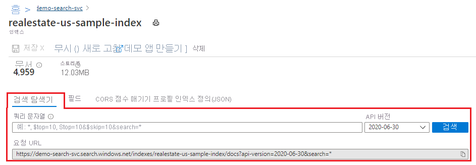
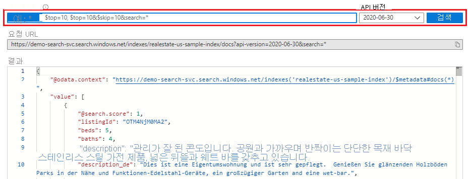
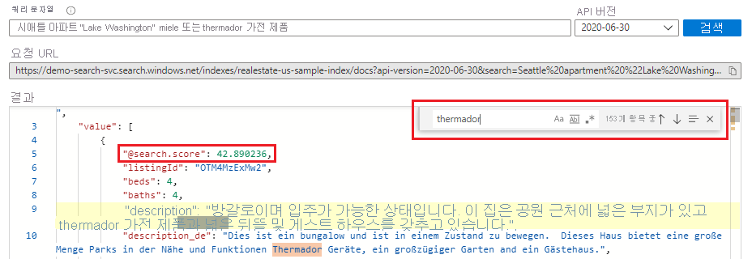
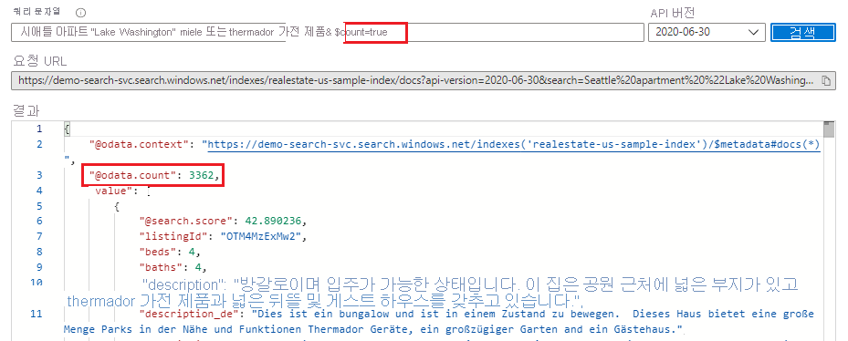
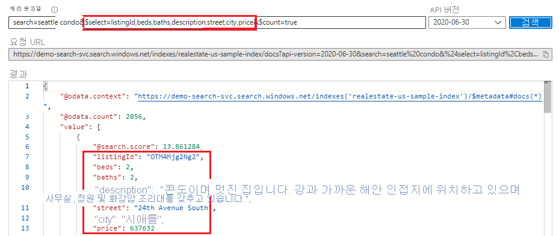
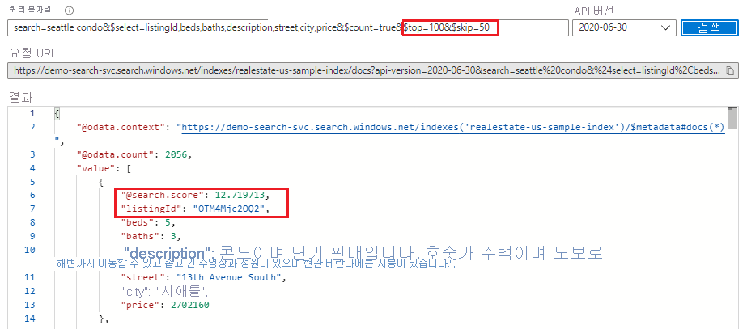
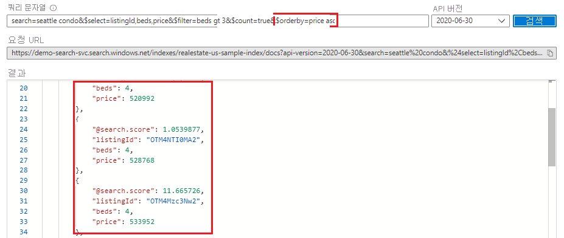

# <a name="quickstart-use-search-explorer-to-run-queries-in-the-portal"></a>빠른 시작: 포털에서 검색 탐색기를 사용하여 쿼리 실행

**검색 탐색기**는 Azure Cognitive Search의 검색 인덱스에 대한 쿼리를 실행하는 데 사용되는 기본 제공 쿼리 도구입니다. 이 도구를 사용하면 쿼리 구문을 쉽게 배우고 쿼리 또는 필터 식을 테스트 하거나 인덱스에 새 콘텐츠가 있는지 여부를 확인하여 데이터 새로 고침을 확인할 수 있습니다.

이 빠른 시작에서는 기존 인덱스를 사용하여 검색 탐색기를 보여줍니다. 요청은 [검색 REST API](/rest/api/searchservice/)를 사용하여 공식화되며, 응답은 JSON 문서로 반환됩니다.

## <a name="prerequisites"></a>필수 구성 요소

시작하기 전에 다음이 있어야 합니다.

+ 활성 구독이 있는 Azure 계정. [체험 계정을 만듭니다](https://azure.microsoft.com/free/).

+ Azure Cognitive Search 서비스 [서비스를 만들거나](search-create-service-portal.md) 현재 구독에서 [기존 서비스를 찾습니다](https://ms.portal.azure.com/#blade/HubsExtension/BrowseResourceBlade/resourceType/Microsoft.Search%2FsearchServices). 이 빠른 시작에서는 체험 서비스를 사용할 수 있습니다. 

+ *realestate-us-sample-index*는 이 빠른 시작에 사용됩니다. [**데이터 가져오기**](search-import-data-portal.md) 마법사를 사용하여 인덱스를 만듭니다. 첫 번째 단계에서 데이터 원본에 대해 묻는 메시지가 표시되면 **샘플**을 선택한 다음 **realestate-us-sample-예제** 데이터 원본을 선택합니다. 모든 마법사 기본값을 그대로 적용하여 인덱스를 만듭니다.

## <a name="start-search-explorer"></a>검색 탐색기 시작

1. [Azure Portal](https://portal.azure.com)의 대시보드에서 검색 서비스 페이지를 열거나 [서비스를 찾습니다](https://ms.portal.azure.com/#blade/HubsExtension/BrowseResourceBlade/resourceType/Microsoft.Search%2FsearchServices).

1. 다음과 같이 명령 모음에서 검색 탐색기를 엽니다.

   

    또는 다음과 같이 열려 있는 인덱스에서 포함된 **검색 탐색기** 탭을 사용합니다.

   

## <a name="unspecified-query"></a>지정되지 않은 쿼리

콘텐츠를 대략적으로 살펴보려면 용어를 입력하지 않은 상태로 **검색**을 클릭하여 빈 검색을 실행합니다. 빈 검색은 전체 문서를 반환하여 문서 컴퍼지션을 검토할 수 있도록 하므로 첫 번째 쿼리로서 유용합니다. 빈 검색에서는 검색 순위가 없으며 문서가 임의 순서로 반환됩니다(모든 문서의 경우 `"@search.score": 1`). 기본적으로 하나의 검색 요청에서 50개의 문서가 반환됩니다.

빈 검색에 해당하는 구문은 `*` 또는 `search=*`입니다.
   
   ```http
   search=*
   ```

   **결과**
   
   

## <a name="free-text-search"></a>자유 텍스트 검색

연산자가 있거나 없는 자유 형식 쿼리는 사용자 지정 앱에서 Azure Cognitive Search로 보내는 사용자 정의 쿼리를 시뮬레이트하는 데 유용합니다. 인덱스 정의에서 **검색 가능**하도록 특성이 지정된 필드만 일치 여부가 검사됩니다. 

쿼리 용어나 식 같은 검색 조건을 입력하면 검색 순위가 매겨집니다. 다음 예제에서는 자유 텍스트 검색을 보여 줍니다.

   ```http
   Seattle apartment "Lake Washington" miele OR thermador appliance
   ```

   **결과**

   특정 관심 용어의 경우 Ctrl+F를 사용하여 결과 내에서 검색을 수행할 수 있습니다.

   

## <a name="count-of-matching-documents"></a>일치하는 문서 수 

인덱스의 일치 항목 수를 가져오려면 **$count=true**를 추가합니다. 빈 검색에서 count는 인덱스의 총 문서 수입니다. 정규화된 검색에서는 쿼리 입력과 일치하는 문서의 수입니다.

   ```http
   $count=true
   ```

   **결과**

   

## <a name="limit-fields-in-search-results"></a>검색 결과의 필드 제한

**검색 탐색기**에서 출력을 읽기 쉽도록 결과를 명시적으로 명명된 필드로 제한하려면 [ **$select**](search-query-odata-select.md)를 추가합니다. 검색 문자열 및 **$count=true**를 유지하려면 인수에 **&** 접두사를 적용합니다. 

   ```http
   search=seattle condo&$select=listingId,beds,baths,description,street,city,price&$count=true
   ```

   **결과**

   

## <a name="return-next-batch-of-results"></a>결과의 다음 일괄 처리 반환

Azure Cognitive Search는 검색 순위에 따라 상위 50개의 일치 항목을 반환합니다. 일치하는 문서의 다음 세트를 가져오려면 **$top=100,&$skip=50**을 추가하여 결과 세트를 100개 문서로 늘리고(기본값: 50개, 최대값: 1,000개) 처음 50개 문서를 건너뜁니다. 순위가 지정된 결과를 얻으려면 쿼리 용어 또는 식과 같은 검색 조건을 제공해야 합니다. 검색 결과에 더 깊게 도달할수록 검색 점수가 줄어듭니다.

   ```http
   search=seattle condo&$select=listingId,beds,baths,description,street,city,price&$count=true&$top=100&$skip=50
   ```

   **결과**

   

## <a name="filter-expressions-greater-than-less-than-equal-to"></a>필터 식(보다 큼, 보다 작음, 같음)

자유 텍스트 검색이 아니라 정확한 조건을 지정하려면 [ **$filter**](search-query-odata-filter.md) 매개 변수를 사용합니다. 인덱스에서 **필터링 가능**하도록 필드 특성을 지정해야 합니다. 이 예제에서는 침실 개수가 4개 이상인 항목을 검색합니다.

   ```http
   search=seattle condo&$filter=beds gt 3&$count=true
   ```
   
   **결과**

   

## <a name="order-by-expressions"></a>Order-by 식

검색 점수 이외의 필드를 기준으로 결과를 정렬하려면 [ **$orderby**](search-query-odata-orderby.md)를 추가합니다. 인덱스에서 **정렬 가능**하도록 필드 특정을 지정해야 합니다. 다음은 이 출력을 테스트하는 데 사용할 수 있는 예제 식입니다.

   ```http
   search=seattle condo&$select=listingId,beds,price&$filter=beds gt 3&$count=true&$orderby=price asc
   ```
   
   **결과**

   

**$filter** 및 **$orderby** 식 둘 다 OData 생성입니다. 자세한 내용은 [OData 필터 구문](/rest/api/searchservice/odata-expression-syntax-for-azure-search)을 참조하세요.

<a name="start-search-explorer"></a>

## <a name="takeaways"></a>핵심 내용

이 빠른 시작에서는 **검색 탐색기**에서 REST API를 사용하여 인덱스를 쿼리했습니다.

+ 결과는 자세한 JSON 문서로 반환되므로 문서 생성 및 콘텐츠를 완전히 볼 수 있습니다. 예제에 표시된 쿼리 식을 사용하여 반환되는 필드를 제한할 수 있습니다.

+ 문서는 인덱스에서 **검색 가능**으로 표시되는 모든 필드로 구성됩니다. 포털에서 인덱스 특성을 보려면 검색 개요 페이지의 *인덱스* 목록에서 **realestate-us-sample**을 클릭합니다.

+ 상용 웹 브라우저에서 입력할 수 있는 것과 비슷한 자유 형식 쿼리는 최종 사용자 환경을 테스트하는 데 유용합니다. 예를 들어, 기본 제공 부동산 샘플 인덱스를 가정할 경우 "Seattle apartments lake washington"을 입력한 후 Ctrl+F를 사용하여 검색 결과 내에서 용어를 찾을 수 있습니다. 

+ 쿼리 및 필터 식은 Azure Search에서 지원되는 구문으로 표현됩니다. 기본 구문은 [간단한 구문](/rest/api/searchservice/simple-query-syntax-in-azure-search)이지만 필요에 따라 보다 강력한 쿼리를 위해 [전체 Lucene](/rest/api/searchservice/lucene-query-syntax-in-azure-search)을 사용할 수 있습니다. [필터 식](/rest/api/searchservice/odata-expression-syntax-for-azure-search)은 OData 구문입니다.

## <a name="clean-up-resources"></a>리소스 정리

본인 소유의 구독으로 이 모듈을 진행하고 있는 경우에는 프로젝트가 끝날 때 여기서 만든 리소스가 계속 필요한지 확인하는 것이 좋습니다. 계속 실행되는 리소스에는 요금이 부과될 수 있습니다. 리소스를 개별적으로 삭제하거나 리소스 그룹을 삭제하여 전체 리소스 세트를 삭제할 수 있습니다.

왼쪽 탐색 창의 **모든 리소스** 또는 **리소스 그룹** 링크를 사용하여 포털에서 리소스를 찾고 관리할 수 있습니다.

무료 서비스를 사용하는 경우 인덱스, 인덱서, 데이터 원본 세 개로 제한됩니다. 포털에서 개별 항목을 삭제하여 제한 이하로 유지할 수 있습니다. 

## <a name="next-steps"></a>다음 단계

쿼리 구조 및 구문에 대해 자세히 알아보려면 Postman 또는 이와 동등한 도구를 사용하여 API의 더 많은 부분을 활용하는 쿼리 식을 만들어 보세요. [검색 REST API](/rest/api/searchservice/)는 학습 및 탐색에 특히 유용합니다.

> [!div class="nextstepaction"]
> [Postman에서 기본 쿼리 만들기](search-query-simple-examples.md)