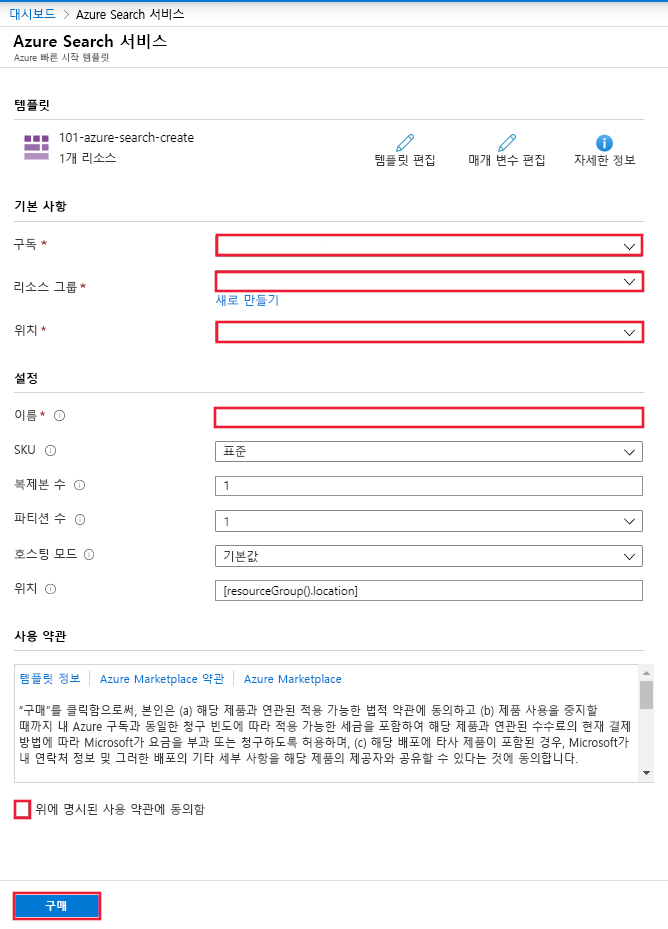

# 빠른 시작: ARM 템플릿을 사용하여 Cognitive Search 배포

이 문서에서는 ARM 템플릿(Azure Resource Manager 템플릿)을 사용하여 Azure Cognitive Search 리소스를 Azure Portal에 배포하는 과정을 안내합니다.

[!INCLUDE [About Azure Resource Manager](../../includes/resource-manager-quickstart-introduction.md)]

환경이 필수 구성 요소를 충족하고 ARM 템플릿 사용에 익숙한 경우 **Azure에 배포** 단추를 선택합니다. 그러면 Azure Portal에서 템플릿이 열립니다.

## 필수 구성 요소

Azure 구독이 아직 없는 경우 시작하기 전에 [체험 계정](https://azure.microsoft.com/free/?WT.mc_id=A261C142F)을 만듭니다.

## 템플릿 검토

이 빠른 시작에서 사용되는 템플릿은 [Azure 빠른 시작 템플릿](https://azure.microsoft.com/resources/templates/101-azure-search-create/)에서 나온 것입니다.

:::code language="json"source="~/quickstart-templates/101-azure-search-create/azuredeploy.json" range="1-86" highlight="4-50,70-85":::

이 템플릿에 정의된 Azure 리소스는 다음과 같습니다.

- [Microsoft.Search/searchServices](/azure/templates/Microsoft.Search/searchServices): Azure Cognitive Search 서비스 만들기

## 템플릿 배포

다음 이미지를 선택하고 Azure에 로그인하여 템플릿을 엽니다. 이 템플릿은 Azure Cognitive Search 리소스를 만듭니다.

포털에는 매개 변수 값을 쉽게 입력할 수 있는 양식이 표시됩니다. 일부 매개 변수는 템플릿의 기본값으로 미리 채워져 있습니다. 구독, 리소스 그룹, 위치 및 서비스 이름을 입력해야 합니다. [AI 보강](cognitive-search-concept-intro.md) 파이프라인에서 Cognitive Services를 사용하려면(예: 텍스트의 이진 이미지 파일 분석) Cognitive Search 및 Cognitive Services를 모두 제공하는 위치를 선택합니다. 두 서비스가 AI 보강 워크로드에 대한 동일한 지역에 있어야 합니다. 양식을 모두 작성한 후에는 사용 약관에 동의하고 구매 단추를 선택하여 배포를 완료해야 합니다.

> [!div class="mx-imgBorder"]
> 

## 배포된 리소스 검토

배포가 완료되면 포털에서 새 리소스 그룹 및 새 검색 서비스에 액세스할 수 있습니다.

## 리소스 정리

다른 Cognitive Search 빠른 시작과 자습서는 이 빠른 시작을 기반으로 작성됩니다. 후속 빠른 시작과 자습서를 계속 진행할 계획이라면 이 리소스를 그대로 두는 것이 좋습니다. 이 리소스가 더 이상 필요 없으면 리소스 그룹을 삭제해도 됩니다. 그러면 Cognitive Search 서비스 및 관련 리소스가 삭제됩니다.

## 다음 단계

이 빠른 시작에서는 ARM 템플릿을 사용하여 Cognitive Search 서비스를 만들고 배포의 유효성을 검사했습니다. Cognitive Search 및 Azure Resource Manager에 대해 자세히 알아보려면 아래 문서를 계속 진행하세요.

- [Azure Cognitive Search 개요](search-what-is-azure-search.md)를 읽어 보세요.
- 검색 서비스에 대한 [인덱스를 만듭니다](search-get-started-portal.md).
- 포털 마법사를 사용하여 [데모 앱을 만듭니다](search-create-app-portal.md).
- 데이터에서 정보를 추출하는 [기술 세트를 만듭니다](cognitive-search-quickstart-blob.md).
