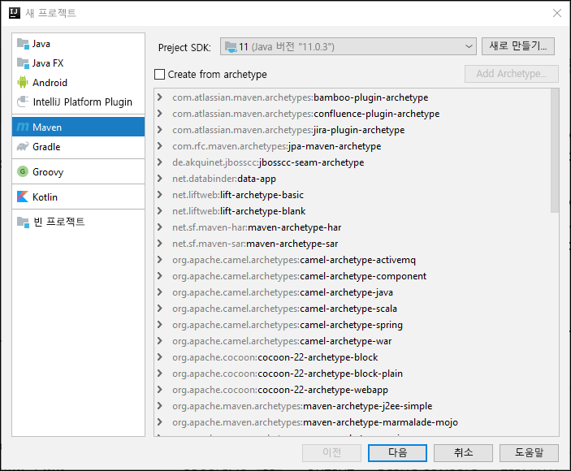
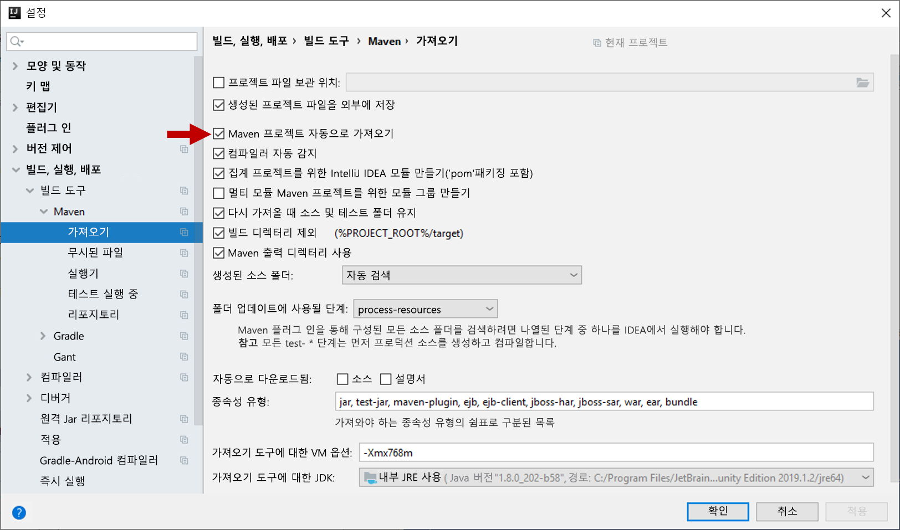
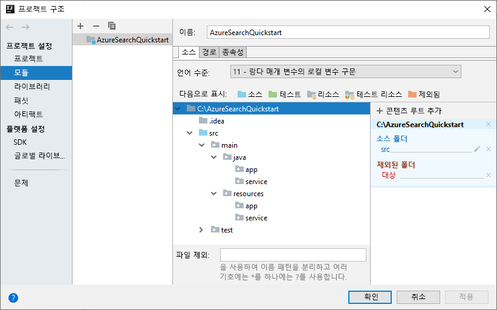
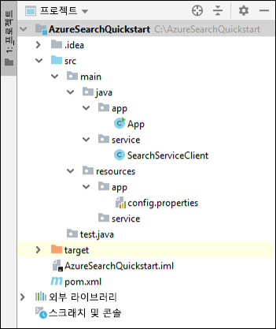
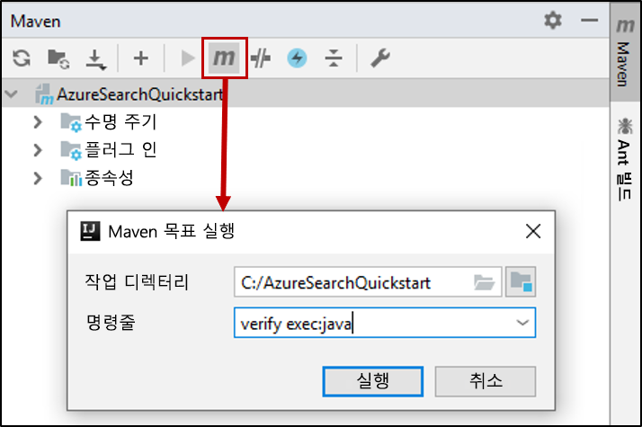

# <a name="quickstart-create-an-azure-cognitive-search-index-in-java-using-rest-apis"></a>빠른 시작: REST API를 사용하여 Java에서 Azure Cognitive Search 인덱스 만들기
> [!div class="op_single_selector"]
> * [JavaScript](search-get-started-nodejs.md)
> * [C#](search-get-started-dotnet.md)
> * [Java](search-get-started-java.md)
> * [포털](search-get-started-portal.md)
> * [PowerShell](search-create-index-rest-api.md)
> * [Python](search-get-started-python.md)
> * [Postman](search-get-started-postman.md)

[IntelliJ](https://www.jetbrains.com/idea/), [Java 11 SDK](/java/azure/jdk/?view=azure-java-stable) 및 [Azure Cognitive Search REST API](/rest/api/searchservice/)를 사용하여 Azure Cognitive Search 인덱스를 만들고, 로드하고 쿼리하는 Java 콘솔 애플리케이션을 만듭니다. 이 문서에서는 애플리케이션을 만드는 단계별 지침을 제공합니다. 또는 [전체 애플리케이션을 다운로드하고 실행](/samples/azure-samples/azure-search-java-samples/java-sample-quickstart/)할 수 있습니다.

Azure 구독이 아직 없는 경우 시작하기 전에 [체험 계정](https://azure.microsoft.com/free/?WT.mc_id=A261C142F)을 만듭니다.

## <a name="prerequisites"></a>필수 조건

이 샘플을 빌드하고 테스트하는 데 사용한 소프트웨어와 서비스는 다음과 같습니다.

+ [IntelliJ IDEA](https://www.jetbrains.com/idea/)

+ [Java 11 SDK](/java/azure/jdk/?view=azure-java-stable)

+ [Azure Cognitive Search 서비스를 만들거나](search-create-service-portal.md) 현재 구독에서 [기존 서비스를 찾습니다](https://ms.portal.azure.com/#blade/HubsExtension/BrowseResourceBlade/resourceType/Microsoft.Search%2FsearchServices). 이 빠른 시작에서는 체험 서비스를 사용할 수 있습니다.

<a name="get-service-info"></a>

## <a name="get-a-key-and-url"></a>키 및 URL 가져오기

서비스를 호출하려면 모든 요청에서 URL 엔드포인트 및 액세스 키가 필요합니다. 검색 서비스는 둘 모두를 사용하여 작성되므로 Azure Cognitive Search를 구독에 추가한 경우 다음 단계에 따라 필요한 정보를 가져옵니다.

1. [Azure Portal에 로그인](https://portal.azure.com/)하고, 검색 서비스 **개요** 페이지에서 URL을 가져옵니다. 엔드포인트의 예는 다음과 같습니다. `https://mydemo.search.windows.net`

2. **설정** > **키**에서 서비스에 대한 모든 권한의 관리자 키를 가져옵니다. 교체 가능한 두 개의 관리자 키가 있으며, 하나를 롤오버해야 하는 경우 비즈니스 연속성을 위해 다른 하나가 제공됩니다. 개체 추가, 수정 및 삭제 요청 시 기본 또는 보조 키를 사용할 수 있습니다.

   쿼리 키도 만듭니다. 쿼리 요청은 읽기 전용 액세스로 발급하는 것이 좋습니다.


서비스에 보내는 모든 요청에는 API 키가 필요합니다. 유효한 키가 있다면 요청을 기반으로 요청을 보내는 애플리케이션과 이를 처리하는 서비스 사이에 신뢰가 쌓입니다.

## <a name="set-up-your-environment"></a>환경 설정

먼저 IntelliJ IDEA를 열고 새 프로젝트를 설정합니다.

### <a name="create-the-project"></a>프로젝트 만들기

1. IntelliJ IDEA를 열고, **새 프로젝트 만들기**를 선택합니다.
1. **Maven**을 선택합니다.
1. **프로젝트 SDK** 목록에서 Java 11 SDK를 선택합니다.

     

1. **GroupId** 및 **ArtifactId**에 대해 `AzureSearchQuickstart`를 입력합니다.
1. 나머지 기본값을 적용하여 프로젝트를 엽니다.

### <a name="specify-maven-dependencies"></a>Maven 종속성 지정

1. **파일** > **설정**을 차례로 선택합니다.
1. **설정** 창에서 **빌드, 실행, 배포** > **빌드 도구** > **Maven** > **가져오기**를 차례로 선택합니다.
1. **자동으로 Maven 프로젝트 가져오기** 확인란을 선택하고, **확인**을 클릭하여 창을 닫습니다. 이제 다음 단계에서 pom.xml 파일을 업데이트하면 Maven 플러그 인 및 기타 종속성이 자동으로 동기화됩니다.

    

1. pom.xml 파일을 열고, 내용을 다음 Maven 구성 세부 정보로 바꿉니다. 여기에는 [Exec Maven Plugin](https://www.mojohaus.org/exec-maven-plugin/)(Maven 실행 플러그 인) 및 [JSON 인터페이스 API](https://javadoc.io/doc/org.glassfish/javax.json/1.0.2)에 대한 참조가 포함됩니다.

    ```xml
    <?xml version="1.0" encoding="UTF-8"?>
    <project xmlns="http://maven.apache.org/POM/4.0.0"
             xmlns:xsi="http://www.w3.org/2001/XMLSchema-instance"
             xsi:schemaLocation="http://maven.apache.org/POM/4.0.0 http://maven.apache.org/xsd/maven-4.0.0.xsd">
        <modelVersion>4.0.0</modelVersion>
    
        <groupId>AzureSearchQuickstart</groupId>
        <artifactId>AzureSearchQuickstart</artifactId>
        <version>1.0-SNAPSHOT</version>
        <build>
            <sourceDirectory>src</sourceDirectory>
            <plugins>
                <plugin>
                    <artifactId>maven-compiler-plugin</artifactId>
                    <version>3.1</version>
                    <configuration>
                        <source>11</source>
                        <target>11</target>
                    </configuration>
                </plugin>
                <plugin>
                    <groupId>org.codehaus.mojo</groupId>
                    <artifactId>exec-maven-plugin</artifactId>
                    <version>1.6.0</version>
                    <executions>
                        <execution>
                            <goals>
                                <goal>exec</goal>
                            </goals>
                        </execution>
                    </executions>
                    <configuration>
                        <mainClass>main.java.app.App</mainClass>
                        <cleanupDaemonThreads>false</cleanupDaemonThreads>
                    </configuration>
                </plugin>
            </plugins>
        </build>
        <dependencies>
            <dependency>
                <groupId>org.glassfish</groupId>
                <artifactId>javax.json</artifactId>
                <version>1.0.2</version>
            </dependency>
        </dependencies>   
    </project>
    ```

### <a name="set-up-the-project-structure"></a>프로젝트 구조 설정

1. **파일** > **프로젝트 구조**를 차례로 선택합니다.
1. **모듈**을 선택하고, 원본 트리를 확장하여 `src` >  `main` 폴더의 내용에 액세스합니다.
1. `src` >  `main` > `java` 폴더에서 `app` 및 `service` 폴더를 추가합니다. 이렇게 하려면 `java` 폴더를 선택하고, Alt+Insert를 누른 다음, 폴더 이름을 입력합니다.
1. `src` >  `main` >`resources` 폴더에서 `app` 및 `service` 폴더를 추가합니다.

    완료되면 프로젝트 트리가 다음 그림과 같이 표시됩니다.

    

1. **확인** 을 클릭하여 창을 닫습니다.

### <a name="add-azure-cognitive-search-service-information"></a>Azure Cognitive Search 서비스 정보 추가

1. **프로젝트** 창에서 원본 트리를 펼쳐 `src` >  `main` >`resources` > `app` 폴더에 액세스하고, `config.properties` 파일을 추가합니다. 이렇게 하려면 `app` 폴더를 선택하고, Alt+Insert를 누르고, **파일**을 선택한 다음, 파일 이름을 입력합니다.

1. 다음 설정을 새 파일에 복사하고, `<YOUR-SEARCH-SERVICE-NAME>`, `<YOUR-ADMIN-KEY>` 및 `<YOUR-QUERY-KEY>`를 서비스 이름과 키로 바꿉니다. 서비스 엔드포인트가 `https://mydemo.search.windows.net`이면 서비스 이름은 "mydemo"가 됩니다.

    ```java
        SearchServiceName=<YOUR-SEARCH-SERVICE-NAME>
        SearchServiceAdminKey=<YOUR-ADMIN-KEY>
        SearchServiceQueryKey=<YOUR-QUERY-KEY>
        IndexName=hotels-quickstart
        ApiVersion=2019-05-06
    ```

### <a name="add-the-main-method"></a>기본 메서드 추가

1. `src` >  `main` > `java` > `app` 폴더에서 `App` 클래스를 추가합니다. 이렇게 하려면 `app` 폴더를 선택하고, Alt+Insert를 누르고, **Java 클래스**를 선택한 다음, 클래스 이름을 입력합니다.
1. `App` 클래스를 열고, 내용을 다음 코드로 바꿉니다. 이 코드에는 `main` 메서드가 포함되어 있습니다. 

    주석 처리가 제거된 코드는 검색 서비스 매개 변수를 읽고, 이를 사용하여 검색 서비스 클라이언트의 인스턴스를 만듭니다. 검색 서비스 클라이언트 코드가 다음 섹션에 추가됩니다.

    이 클래스의 주석 처리된 코드는 이 빠른 시작의 이후 섹션에서 주석 처리가 제거됩니다.

    ```java
    package main.java.app;
    
    import main.java.service.SearchServiceClient;
    import java.io.IOException;
    import java.util.Properties;
    
    public class App {
    
        private static Properties loadPropertiesFromResource(String resourcePath) throws IOException {
            var inputStream = App.class.getResourceAsStream(resourcePath);
            var configProperties = new Properties();
            configProperties.load(inputStream);
            return configProperties;
        }
    
        public static void main(String[] args) {
            try {
                var config = loadPropertiesFromResource("/app/config.properties");
                var client = new SearchServiceClient(
                        config.getProperty("SearchServiceName"),
                        config.getProperty("SearchServiceAdminKey"),
                        config.getProperty("SearchServiceQueryKey"),
                        config.getProperty("ApiVersion"),
                        config.getProperty("IndexName")
                );
    
    
    //Uncomment the next 3 lines in the 1 - Create Index section of the quickstart
    //            if(client.indexExists()){ client.deleteIndex();}
    //            client.createIndex("/service/index.json");
    //            Thread.sleep(1000L); // wait a second to create the index
    
    //Uncomment the next 2 lines in the 2 - Load Documents section of the quickstart
    //            client.uploadDocuments("/service/hotels.json");
    //            Thread.sleep(2000L); // wait 2 seconds for data to upload
    
    //Uncomment the following 5 search queries in the 3 - Search an index section of the quickstart
    //            // Query 1
    //            client.logMessage("\n*QUERY 1****************************************************************");
    //            client.logMessage("Search for: Atlanta'");
    //            client.logMessage("Return: All fields'");
    //            client.searchPlus("Atlanta");
    //
    //            // Query 2
    //            client.logMessage("\n*QUERY 2****************************************************************");
    //            client.logMessage("Search for: Atlanta");
    //            client.logMessage("Return: HotelName, Tags, Address");
    //            SearchServiceClient.SearchOptions options2 = client.createSearchOptions();
    //            options2.select = "HotelName,Tags,Address";
    //            client.searchPlus("Atlanta", options2);
    //
    //            //Query 3
    //            client.logMessage("\n*QUERY 3****************************************************************");
    //            client.logMessage("Search for: wifi & restaurant");
    //            client.logMessage("Return: HotelName, Description, Tags");
    //            SearchServiceClient.SearchOptions options3 = client.createSearchOptions();
    //            options3.select = "HotelName,Description,Tags";
    //            client.searchPlus("wifi,restaurant", options3);
    //
    //            // Query 4 -filtered query
    //            client.logMessage("\n*QUERY 4****************************************************************");
    //            client.logMessage("Search for: all");
    //            client.logMessage("Filter: Ratings greater than 4");
    //            client.logMessage("Return: HotelName, Rating");
    //            SearchServiceClient.SearchOptions options4 = client.createSearchOptions();
    //            options4.filter="Rating%20gt%204";
    //            options4.select = "HotelName,Rating";
    //            client.searchPlus("*",options4);
    //
    //            // Query 5 - top 2 results, ordered by
    //            client.logMessage("\n*QUERY 5****************************************************************");
    //            client.logMessage("Search for: boutique");
    //            client.logMessage("Get: Top 2 results");
    //            client.logMessage("Order by: Rating in descending order");
    //            client.logMessage("Return: HotelId, HotelName, Category, Rating");
    //            SearchServiceClient.SearchOptions options5 = client.createSearchOptions();
    //            options5.top=2;
    //            options5.orderby = "Rating%20desc";
    //            options5.select = "HotelId,HotelName,Category,Rating";
    //            client.searchPlus("boutique", options5);
    
            } catch (Exception e) {
                System.err.println("Exception:" + e.getMessage());
                e.printStackTrace();
            }
        }
    }
    ```

### <a name="add-the-http-operations"></a>HTTP 작업 추가

1. `src` >  `main` > `java` > `service` 폴더에서 `SearchServiceClient` 클래스를 추가합니다. 이렇게 하려면 `service` 폴더를 선택하고, Alt+Insert를 누르고, **Java 클래스**를 선택한 다음, 클래스 이름을 입력합니다.
1. `SearchServiceClient` 클래스를 열고, 내용을 다음 코드로 바꿉니다. 이 코드는 Azure Cognitive Search REST API를 사용하는 데 필요한 HTTP 작업을 제공합니다. 인덱스를 만들고, 문서를 업로드하고, 인덱스를 쿼리하는 방법에 대한 추가 메서드는 이후 섹션에서 추가됩니다.

    ```java
    package main.java.service;

    import javax.json.Json;
    import javax.net.ssl.HttpsURLConnection;
    import java.io.IOException;
    import java.io.StringReader;
    import java.net.HttpURLConnection;
    import java.net.URI;
    import java.net.http.HttpClient;
    import java.net.http.HttpRequest;
    import java.net.http.HttpResponse;
    import java.nio.charset.StandardCharsets;
    import java.util.Formatter;
    import java.util.function.Consumer;
    
        /* This class is responsible for implementing HTTP operations for creating the index, uploading documents and searching the data*/
        public class SearchServiceClient {
            private final String _adminKey;
            private final String _queryKey;
            private final String _apiVersion;
            private final String _serviceName;
            private final String _indexName;
            private final static HttpClient client = HttpClient.newHttpClient();
    
        public SearchServiceClient(String serviceName, String adminKey, String queryKey, String apiVersion, String indexName) {
            this._serviceName = serviceName;
            this._adminKey = adminKey;
            this._queryKey = queryKey;
            this._apiVersion = apiVersion;
            this._indexName = indexName;
        }

        private static HttpResponse<String> sendRequest(HttpRequest request) throws IOException, InterruptedException {
            logMessage(String.format("%s: %s", request.method(), request.uri()));
            return client.send(request, HttpResponse.BodyHandlers.ofString());
        }

        private static URI buildURI(Consumer<Formatter> fmtFn)
                {
                    Formatter strFormatter = new Formatter();
                    fmtFn.accept(strFormatter);
                    String url = strFormatter.out().toString();
                    strFormatter.close();
                    return URI.create(url);
        }
    
        public static void logMessage(String message) {
            System.out.println(message);
        }
    
        public static boolean isSuccessResponse(HttpResponse<String> response) {
            try {
                int responseCode = response.statusCode();
    
                logMessage("\n Response code = " + responseCode);
    
                if (responseCode == HttpURLConnection.HTTP_OK || responseCode == HttpURLConnection.HTTP_ACCEPTED
                        || responseCode == HttpURLConnection.HTTP_NO_CONTENT || responseCode == HttpsURLConnection.HTTP_CREATED) {
                    return true;
                }
    
                // We got an error
                var msg = response.body();
                if (msg != null) {
                    logMessage(String.format("\n MESSAGE: %s", msg));
                }
    
            } catch (Exception e) {
                e.printStackTrace();
            }
    
            return false;
        }
    
        public static HttpRequest httpRequest(URI uri, String key, String method, String contents) {
            contents = contents == null ? "" : contents;
            var builder = HttpRequest.newBuilder();
            builder.uri(uri);
            builder.setHeader("content-type", "application/json");
            builder.setHeader("api-key", key);
    
            switch (method) {
                case "GET":
                    builder = builder.GET();
                    break;
                case "HEAD":
                    builder = builder.GET();
                    break;
                case "DELETE":
                    builder = builder.DELETE();
                    break;
                case "PUT":
                    builder = builder.PUT(HttpRequest.BodyPublishers.ofString(contents));
                    break;
                case "POST":
                    builder = builder.POST(HttpRequest.BodyPublishers.ofString(contents));
                    break;
                default:
                    throw new IllegalArgumentException(String.format("Can't create request for method '%s'", method));
            }
            return builder.build();
        }
    }
    
    ```

### <a name="build-the-project"></a>프로젝트 빌드

1. 프로젝트의 구조가 다음과 같은지 확인합니다.

    

1. **Maven** 도구 창을 열고 다음 Maven 목표를 실행합니다. `verify exec:java`


처리가 완료되면 BUILD SUCCESS(빌드 성공) 메시지와 0(영) 종료 코드를 찾습니다.

## <a name="1---create-index"></a>1 - 인덱스 만들기

호텔 인덱스 정의에는 여러 개의 단순 필드와 하나의 복합 필드가 포함됩니다. 단순 필드의 예로 "HotelName" 또는 "Description"이 있습니다. "Address" 필드는 "Street Address" 및 "City"와 같은 하위 필드를 포함하므로 복합 필드입니다. 이 빠른 시작에서 인덱스 정의는 JSON을 사용하여 지정됩니다.

1. **프로젝트** 창에서 원본 트리를 펼쳐 `src` >  `main` >`resources` > `service` 폴더에 액세스하고, `index.json` 파일을 추가합니다. 이렇게 하려면 `app` 폴더를 선택하고, Alt+Insert를 누르고, **파일**을 선택한 다음, 파일 이름을 입력합니다.

1. `index.json` 파일을 열고, 다음 인덱스 정의를 삽입합니다.

    ```json
    {
      "name": "hotels-quickstart",
      "fields": [
        {
          "name": "HotelId",
          "type": "Edm.String",
          "key": true,
          "filterable": true
        },
        {
          "name": "HotelName",
          "type": "Edm.String",
          "searchable": true,
          "filterable": false,
          "sortable": true,
          "facetable": false
        },
        {
          "name": "Description",
          "type": "Edm.String",
          "searchable": true,
          "filterable": false,
          "sortable": false,
          "facetable": false,
          "analyzer": "en.lucene"
        },
        {
          "name": "Description_fr",
          "type": "Edm.String",
          "searchable": true,
          "filterable": false,
          "sortable": false,
          "facetable": false,
          "analyzer": "fr.lucene"
        },
        {
          "name": "Category",
          "type": "Edm.String",
          "searchable": true,
          "filterable": true,
          "sortable": true,
          "facetable": true
        },
        {
          "name": "Tags",
          "type": "Collection(Edm.String)",
          "searchable": true,
          "filterable": true,
          "sortable": false,
          "facetable": true
        },
        {
          "name": "ParkingIncluded",
          "type": "Edm.Boolean",
          "filterable": true,
          "sortable": true,
          "facetable": true
        },
        {
          "name": "LastRenovationDate",
          "type": "Edm.DateTimeOffset",
          "filterable": true,
          "sortable": true,
          "facetable": true
        },
        {
          "name": "Rating",
          "type": "Edm.Double",
          "filterable": true,
          "sortable": true,
          "facetable": true
        },
        {
          "name": "Address",
          "type": "Edm.ComplexType",
          "fields": [
            {
              "name": "StreetAddress",
              "type": "Edm.String",
              "filterable": false,
              "sortable": false,
              "facetable": false,
              "searchable": true
            },
            {
              "name": "City",
              "type": "Edm.String",
              "searchable": true,
              "filterable": true,
              "sortable": true,
              "facetable": true
            },
            {
              "name": "StateProvince",
              "type": "Edm.String",
              "searchable": true,
              "filterable": true,
              "sortable": true,
              "facetable": true
            },
            {
              "name": "PostalCode",
              "type": "Edm.String",
              "searchable": true,
              "filterable": true,
              "sortable": true,
              "facetable": true
            },
            {
              "name": "Country",
              "type": "Edm.String",
              "searchable": true,
              "filterable": true,
              "sortable": true,
              "facetable": true
            }
          ]
        }
      ]
    }
    ```

    인덱스 이름은 "hotels-quickstart"입니다. 인덱스 필드의 특성은 애플리케이션에서 인덱싱된 데이터를 검색하는 방법을 결정합니다. 예를 들어 전체 텍스트 검색에 포함되어야 하는 모든 필드에는 `IsSearchable` 특성을 할당해야 합니다. 특성에 대한 자세한 내용은 [필드 컬렉션 및 필드 특성](search-what-is-an-index.md#fields-collection)을 참조하세요.
    
    이 인덱스의 `Description` 필드는 선택적 `analyzer` 속성을 사용하여 기본 Lucene 언어 분석기를 재정의합니다. `Description_fr` 필드는 프랑스어 텍스트를 저장하므로 프랑스어 Lucene 분석기(`fr.lucene`)를 사용합니다. `Description`은 선택적 Microsoft 언어 분석기(en.lucene)를 사용합니다. 분석기에 대한 자세한 내용은 [Azure Cognitive Search의 텍스트 처리용 분석기](search-analyzers.md)를 참조하세요.

1. `SearchServiceClient` 클래스에 다음 코드를 추가합니다. 이러한 메서드는 인덱스를 만들고, 삭제하고, 인덱스가 있는지 확인하는 Azure Cognitive Search REST 서비스 URL을 빌드합니다. 또한 이 메서드는 HTTP 요청을 수행합니다.

    ```java
    public boolean indexExists() throws IOException, InterruptedException {
        logMessage("\n Checking if index exists...");
        var uri = buildURI(strFormatter -> strFormatter.format(
                "https://%s.search.windows.net/indexes/%s/docs?api-version=%s&search=*",
                _serviceName,_indexName,_apiVersion));
        var request = httpRequest(uri, _adminKey, "HEAD", "");
        var response = sendRequest(request);
        return isSuccessResponse(response);
    }
    
    public boolean deleteIndex() throws IOException, InterruptedException {
        logMessage("\n Deleting index...");
        var uri = buildURI(strFormatter -> strFormatter.format(
                "https://%s.search.windows.net/indexes/%s?api-version=%s",
                _serviceName,_indexName,_apiVersion));
        var request = httpRequest(uri, _adminKey, "DELETE", "*");
        var response = sendRequest(request);
        return isSuccessResponse(response);
    }
    
    
    public boolean createIndex(String indexDefinitionFile) throws IOException, InterruptedException {
        logMessage("\n Creating index...");
        //Build the search service URL
        var uri = buildURI(strFormatter -> strFormatter.format(
                "https://%s.search.windows.net/indexes/%s?api-version=%s",
                _serviceName,_indexName,_apiVersion));
        //Read in index definition file
        var inputStream = SearchServiceClient.class.getResourceAsStream(indexDefinitionFile);
        var indexDef = new String(inputStream.readAllBytes(), StandardCharsets.UTF_8);
        //Send HTTP PUT request to create the index in the search service
        var request = httpRequest(uri, _adminKey, "PUT", indexDef);
        var response = sendRequest(request);
        return isSuccessResponse(response);
    }
    ```

1. `App` 클래스에서 다음 코드의 주석 처리를 제거합니다. "hotels-quickstart" 인덱스가 있는 경우 이 코드는 해당 인덱스를 삭제하고 "index.json" 파일의 인덱스 정의를 기반으로 하여 새 인덱스를 만듭니다. 

    인덱스 만들기 요청 후 1초간 일시 중지가 삽입됩니다. 이 일시 중지는 문서를 업로드하기 전에 인덱스가 만들어지도록 합니다.

    ```java
        if (client.indexExists()) { client.deleteIndex();}
          client.createIndex("/service/index.json");
          Thread.sleep(1000L); // wait a second to create the index
    ```

1. **Maven** 도구 창을 열고, `verify exec:java` Maven 목표를 실행합니다.

    코드가 실행되면 "Creating index"(인덱스 만드는 중) 메시지와 201 응답 코드를 찾습니다. 이 응답 코드는 인덱스가 만들어졌음을 확인합니다. 실행은 BUILD SUCCESS 메시지와 0(영) 종료 코드로 끝납니다.
    
## <a name="2---load-documents"></a>2 - 문서 로드

1. **프로젝트** 창에서 원본 트리를 펼쳐 `src` >  `main` >`resources` > `service` 폴더에 액세스하고, `hotels.json` 파일을 추가합니다. 이렇게 하려면 `app` 폴더를 선택하고, Alt+Insert를 누르고, **파일**을 선택한 다음, 파일 이름을 입력합니다.
1. 다음 호텔 문서를 파일에 삽입합니다.

    ```json
    {
      "value": [
        {
          "@search.action": "upload",
          "HotelId": "1",
          "HotelName": "Secret Point Motel",
          "Description": "The hotel is ideally located on the main commercial artery of the city in the heart of New York. A few minutes away is Time's Square and the historic centre of the city, as well as other places of interest that make New York one of America's most attractive and cosmopolitan cities.",
          "Description_fr": "L'hôtel est idéalement situé sur la principale artère commerciale de la ville en plein cœur de New York. A quelques minutes se trouve la place du temps et le centre historique de la ville, ainsi que d'autres lieux d'intérêt qui font de New York l'une des villes les plus attractives et cosmopolites de l'Amérique.",
          "Category": "Boutique",
          "Tags": [ "pool", "air conditioning", "concierge" ],
          "ParkingIncluded": "false",
          "LastRenovationDate": "1970-01-18T00:00:00Z",
          "Rating": 3.60,
          "Address": {
            "StreetAddress": "677 5th Ave",
            "City": "New York",
            "StateProvince": "NY",
            "PostalCode": "10022",
            "Country": "USA"
          }
        },
        {
          "@search.action": "upload",
          "HotelId": "2",
          "HotelName": "Twin Dome Motel",
          "Description": "The hotel is situated in a  nineteenth century plaza, which has been expanded and renovated to the highest architectural standards to create a modern, functional and first-class hotel in which art and unique historical elements coexist with the most modern comforts.",
          "Description_fr": "L'hôtel est situé dans une place du XIXe siècle, qui a été agrandie et rénovée aux plus hautes normes architecturales pour créer un hôtel moderne, fonctionnel et de première classe dans lequel l'art et les éléments historiques uniques coexistent avec le confort le plus moderne.",
          "Category": "Boutique",
          "Tags": [ "pool", "free wifi", "concierge" ],
          "ParkingIncluded": "false",
          "LastRenovationDate": "1979-02-18T00:00:00Z",
          "Rating": 3.60,
          "Address": {
            "StreetAddress": "140 University Town Center Dr",
            "City": "Sarasota",
            "StateProvince": "FL",
            "PostalCode": "34243",
            "Country": "USA"
          }
        },
        {
          "@search.action": "upload",
          "HotelId": "3",
          "HotelName": "Triple Landscape Hotel",
          "Description": "The Hotel stands out for its gastronomic excellence under the management of William Dough, who advises on and oversees all of the Hotel’s restaurant services.",
          "Description_fr": "L'hôtel est situé dans une place du XIXe siècle, qui a été agrandie et rénovée aux plus hautes normes architecturales pour créer un hôtel moderne, fonctionnel et de première classe dans lequel l'art et les éléments historiques uniques coexistent avec le confort le plus moderne.",
          "Category": "Resort and Spa",
          "Tags": [ "air conditioning", "bar", "continental breakfast" ],
          "ParkingIncluded": "true",
          "LastRenovationDate": "2015-09-20T00:00:00Z",
          "Rating": 4.80,
          "Address": {
            "StreetAddress": "3393 Peachtree Rd",
            "City": "Atlanta",
            "StateProvince": "GA",
            "PostalCode": "30326",
            "Country": "USA"
          }
        },
        {
          "@search.action": "upload",
          "HotelId": "4",
          "HotelName": "Sublime Cliff Hotel",
          "Description": "Sublime Cliff Hotel is located in the heart of the historic center of Sublime in an extremely vibrant and lively area within short walking distance to the sites and landmarks of the city and is surrounded by the extraordinary beauty of churches, buildings, shops and monuments. Sublime Cliff is part of a lovingly restored 1800 palace.",
          "Description_fr": "Le sublime Cliff Hotel est situé au coeur du centre historique de sublime dans un quartier extrêmement animé et vivant, à courte distance de marche des sites et monuments de la ville et est entouré par l'extraordinaire beauté des églises, des bâtiments, des commerces et Monuments. Sublime Cliff fait partie d'un Palace 1800 restauré avec amour.",
          "Category": "Boutique",
          "Tags": [ "concierge", "view", "24-hour front desk service" ],
          "ParkingIncluded": "true",
          "LastRenovationDate": "1960-02-06T00:00:00Z",
          "Rating": 4.60,
          "Address": {
            "StreetAddress": "7400 San Pedro Ave",
            "City": "San Antonio",
            "StateProvince": "TX",
            "PostalCode": "78216",
            "Country": "USA"
          }
        }
      ]
    }
    ```

1. 다음 코드를 `SearchServiceClient` 클래스에 삽입합니다. 이 코드는 호텔 문서를 인덱스에 업로드하기 위한 REST 서비스 URL을 작성한 다음, HTTP POST 요청을 수행합니다.

    ```java
    public boolean uploadDocuments(String documentsFile) throws IOException, InterruptedException {
        logMessage("\n Uploading documents...");
        //Build the search service URL
        var endpoint = buildURI(strFormatter -> strFormatter.format(
                "https://%s.search.windows.net/indexes/%s/docs/index?api-version=%s",
                _serviceName,_indexName,_apiVersion));
        //Read in the data to index
        var inputStream = SearchServiceClient.class.getResourceAsStream(documentsFile);
        var documents = new String(inputStream.readAllBytes(), StandardCharsets.UTF_8);
        //Send HTTP POST request to upload and index the data
        var request = httpRequest(endpoint, _adminKey, "POST", documents);
        var response = sendRequest(request);
        return isSuccessResponse(response);
    }
    ```

1. `App` 클래스에서 다음 코드의 주석 처리를 제거합니다. 이 코드는 "hotels.json"의 문서를 인덱스에 업로드합니다.

    ```java
    client.uploadDocuments("/service/hotels.json");
    Thread.sleep(2000L); // wait 2 seconds for data to upload
    ```

    업로드 요청 후 2초간 일시 중지가 삽입되어 인덱스를 쿼리하기 전에 문서 로드 프로세스가 완료되도록 합니다.

1. **Maven** 도구 창을 열고, `verify exec:java` Maven 목표를 실행합니다.

    이전 단계에서 "hotels-quickstart" 인덱스를 만들었으므로 이제 이 코드는 호텔 문서를 로드하기 전에 해당 코드를 삭제하고 다시 만듭니다.

    코드가 실행되면 "Uploading documents"(문서 업로드 중) 메시지와 200 응답 코드를 찾습니다. 이 응답 코드는 문서가 인덱스에 업로드되었음을 확인합니다. 실행은 BUILD SUCCESS 메시지와 0(영) 종료 코드로 끝납니다.

## <a name="3---search-an-index"></a>3 - 인덱스 검색

이제 호텔 문서를 로드했으므로 호텔 데이터에 액세스하기 위한 검색 쿼리를 만들 수 있습니다.

1. `SearchServiceClient` 클래스에 다음 코드를 추가합니다. 이 코드는 Azure Cognitive Search REST 서비스 URL을 빌드하여 인덱싱된 데이터를 검색하고 검색 결과를 출력합니다.

    `SearchOptions` 클래스 및 `createSearchOptions` 메서드를 사용하면 사용 가능한 Azure Cognitive Search REST API 쿼리 옵션의 하위 집합을 지정할 수 있습니다. REST API 쿼리 옵션에 대한 자세한 내용은 [문서 검색(Azure Cognitive Search REST API)](/rest/api/searchservice/search-documents)을 참조하세요.

    `SearchPlus` 메서드는 검색 쿼리 URL을 만들고, 검색 요청을 수행한 다음, 결과를 콘솔에 출력합니다. 

    ```java
    public SearchOptions createSearchOptions() { return new SearchOptions();}

    //Defines available search parameters that can be set
    public static class SearchOptions {

        public String select = "";
        public String filter = "";
        public int top = 0;
        public String orderby= "";
    }

    //Concatenates search parameters to append to the search request
    private String createOptionsString(SearchOptions options)
    {
        String optionsString = "";
        if (options != null) {
            if (options.select != "")
                optionsString = optionsString + "&$select=" + options.select;
            if (options.filter != "")
                optionsString = optionsString + "&$filter=" + options.filter;
            if (options.top != 0)
                optionsString = optionsString + "&$top=" + options.top;
            if (options.orderby != "")
                optionsString = optionsString + "&$orderby=" +options.orderby;
        }
        return optionsString;
    }
    
    public void searchPlus(String queryString)
    {
        searchPlus( queryString, null);
    }
    
    public void searchPlus(String queryString, SearchOptions options) {
    
        try {
            String optionsString = createOptionsString(options);
            var uri = buildURI(strFormatter -> strFormatter.format(
                    "https://%s.search.windows.net/indexes/%s/docs?api-version=%s&search=%s%s",
                    _serviceName, _indexName, _apiVersion, queryString, optionsString));
            var request = httpRequest(uri, _queryKey, "GET", null);
            var response = sendRequest(request);
            var jsonReader = Json.createReader(new StringReader(response.body()));
            var jsonArray = jsonReader.readObject().getJsonArray("value");
            var resultsCount = jsonArray.size();
            logMessage("Results:\nCount: " + resultsCount);
            for (int i = 0; i <= resultsCount - 1; i++) {
                logMessage(jsonArray.get(i).toString());
            }
    
            jsonReader.close();
    
        }
        catch (Exception e) {
            e.printStackTrace();
        }
    
    }
    ```

1. `App` 클래스에서 다음 코드의 주석 처리를 제거합니다. 이 코드는 반환할 검색 텍스트, 쿼리 매개 변수 및 데이터 필드를 포함하여 5개의 다른 쿼리를 설정합니다. 

    ```java
    // Query 1
    client.logMessage("\n*QUERY 1****************************************************************");
    client.logMessage("Search for: Atlanta");
    client.logMessage("Return: All fields'");
    client.searchPlus("Atlanta");

    // Query 2
    client.logMessage("\n*QUERY 2****************************************************************");
    client.logMessage("Search for: Atlanta");
    client.logMessage("Return: HotelName, Tags, Address");
    SearchServiceClient.SearchOptions options2 = client.createSearchOptions();
    options2.select = "HotelName,Tags,Address";
    client.searchPlus("Atlanta", options2);

    //Query 3
    client.logMessage("\n*QUERY 3****************************************************************");
    client.logMessage("Search for: wifi & restaurant");
    client.logMessage("Return: HotelName, Description, Tags");
    SearchServiceClient.SearchOptions options3 = client.createSearchOptions();
    options3.select = "HotelName,Description,Tags";
    client.searchPlus("wifi,restaurant", options3);

    // Query 4 -filtered query
    client.logMessage("\n*QUERY 4****************************************************************");
    client.logMessage("Search for: all");
    client.logMessage("Filter: Ratings greater than 4");
    client.logMessage("Return: HotelName, Rating");
    SearchServiceClient.SearchOptions options4 = client.createSearchOptions();
    options4.filter="Rating%20gt%204";
    options4.select = "HotelName,Rating";
    client.searchPlus("*",options4);

    // Query 5 - top 2 results, ordered by
    client.logMessage("\n*QUERY 5****************************************************************");
    client.logMessage("Search for: boutique");
    client.logMessage("Get: Top 2 results");
    client.logMessage("Order by: Rating in descending order");
    client.logMessage("Return: HotelId, HotelName, Category, Rating");
    SearchServiceClient.SearchOptions options5 = client.createSearchOptions();
    options5.top=2;
    options5.orderby = "Rating%20desc";
    options5.select = "HotelId,HotelName,Category,Rating";
    client.searchPlus("boutique", options5);
    ```


    [쿼리에서 용어를 매칭하는 방법](search-query-overview.md#types-of-queries)은 2가지(전체 텍스트 검색 및 필터)입니다. 전체 텍스트 검색 쿼리는 인덱스의 `IsSearchable` 필드에서 하나 이상의 용어를 검색합니다. 필터는 인덱스의 `IsFilterable` 필드를 통해 평가되는 부울 식입니다. 전체 텍스트 검색과 필터를 함께 사용하거나 별도로 사용할 수 있습니다.

1. **Maven** 도구 창을 열고, `verify exec:java` Maven 목표를 실행합니다.

    각 쿼리 및 해당 결과에 대한 요약을 찾습니다. 실행은 BUILD SUCCESS 메시지와 0(영) 종료 코드로 완료됩니다.

## <a name="clean-up-resources"></a>리소스 정리

사용자 고유의 구독에서 작업하는 경우 프로젝트의 끝에서 더 이상 필요하지 않은 리소스를 제거하는 것이 좋습니다. 계속 실행되는 리소스에는 요금이 부과될 수 있습니다. 리소스를 개별적으로 삭제하거나 리소스 그룹을 삭제하여 전체 리소스 세트를 삭제할 수 있습니다.

왼쪽 탐색 창의 **모든 리소스** 또는 **리소스 그룹** 링크를 사용하여 포털에서 리소스를 찾고 관리할 수 있습니다.

무료 서비스를 사용하는 경우 인덱스, 인덱서, 데이터 원본 세 개로 제한됩니다. 포털에서 개별 항목을 삭제하여 제한 이하로 유지할 수 있습니다. 

## <a name="next-steps"></a>다음 단계

이 Java 빠른 시작에서는 인덱스를 만들고, 문서를 사용하여 로드하고, 쿼리를 실행하는 일련의 작업을 수행했습니다. 기본 개념에 익숙한 경우 REST의 인덱서 작업을 나열하는 다음 문서를 권장합니다.

> [!div class="nextstepaction"]
> [인덱서 작업](/rest/api/searchservice/indexer-operations)
