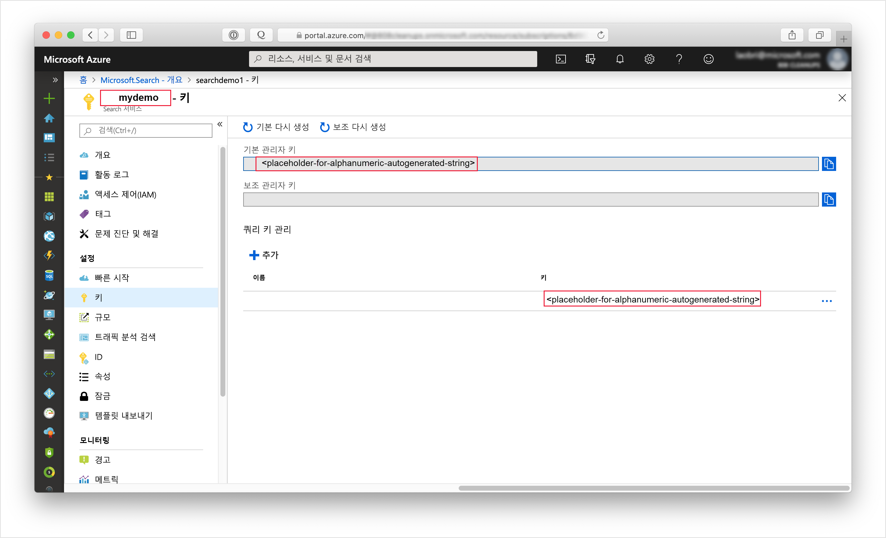
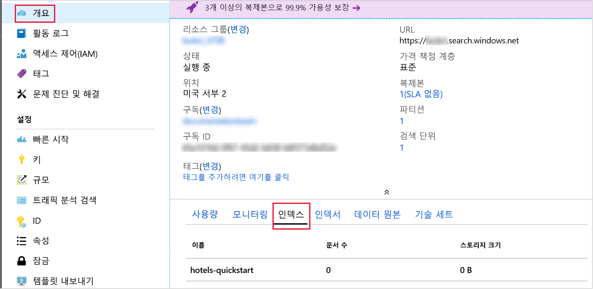

# <a name="quickstart-create-an-azure-search-index-in-nodejs"></a>빠른 시작: Node.js에서 Azure Search 인덱스 만들기
> [!div class="op_single_selector"]
> * [JavaScript](search-get-started-nodejs.md)
> * [C#](search-get-started-dotnet.md)
> * [포털](search-get-started-portal.md)
> * [PowerShell](search-create-index-rest-api.md)
> * [Python](search-get-started-python.md)
> * [Postman](search-get-started-postman.md)

Azure Search 인덱스를 생성, 로드, 쿼리하는 Node.js 애플리케이션을 만듭니다. 이 문서에서는 애플리케이션을 만드는 방법을 단계별로 보여줍니다. 또는 [소스 코드와 데이터를 다운로드](https://github.com/Azure-Samples/azure-search-javascript-samples/tree/master/quickstart/)하고 명령줄에서 애플리케이션을 실행할 수 있습니다.

Azure 구독이 아직 없는 경우 시작하기 전에 [체험 계정](https://azure.microsoft.com/free/?WT.mc_id=A261C142F)을 만듭니다.

## <a name="prerequisites"></a>필수 조건

이 빠른 시작에서 사용되는 서비스, 도구 및 데이터는 다음과 같습니다.

+ [Node.js](https://nodejs.org).
+ [NPM](https://www.npmjs.com)은 Node.js로 설치해야 합니다.
+ 샘플 인덱스 구조 및 일치하는 문서는 이 문서 또는 [리포지토리의 **quickstart** 디렉터리](https://github.com/Azure-Samples/azure-search-javascript-samples/)에서 제공됩니다.
+ [Azure Search 서비스를 만들거나](search-create-service-portal.md) 현재 구독에서 [기존 서비스를 찾습니다](https://ms.portal.azure.com/#blade/HubsExtension/BrowseResourceBlade/resourceType/Microsoft.Search%2FsearchServices). 이 빠른 시작에서는 체험 서비스를 사용할 수 있습니다.

권장:

* [Visual Studio Code](https://code.visualstudio.com)
* VSCode용 [Prettier](https://marketplace.visualstudio.com/items?itemName=esbenp.prettier-vscode) 및 [ESLint](https://marketplace.visualstudio.com/items?itemName=dbaeumer.vscode-eslint) 확장입니다.

<a name="get-service-info"></a>
## <a name="get-keys-and-urls"></a>키 및 URL 가져오기

서비스를 호출하려면 모든 요청에서 URL 엔드포인트 및 액세스 키가 필요합니다. 검색 서비스는 둘 모두를 사용하여 작성되므로 Azure Search를 구독에 추가한 경우 다음 단계에 따라 필요한 정보를 확보하십시오.

1. [Azure Portal에 로그인](https://portal.azure.com/)하고, 검색 서비스 **개요** 페이지에서 검색 서비스의 이름을 확인합니다. 엔드포인트 URL을 검토하여 서비스 이름을 확인할 수 있습니다. 엔드포인트 URL이 `https://mydemo.search.windows.net`인 경우 서비스 이름은 `mydemo`입니다.

2. **설정** > **키**에서 서비스에 대한 모든 권한의 관리자 키를 가져옵니다. 교체 가능한 두 개의 관리자 키가 있으며, 하나를 롤오버해야 하는 경우 비즈니스 연속성을 위해 다른 하나가 제공됩니다. 개체 추가, 수정 및 삭제 요청 시 기본 또는 보조 키를 사용할 수 있습니다.

    쿼리 키도 가져옵니다. 쿼리 요청은 읽기 전용 액세스로 발급하는 것이 좋습니다.



모든 요청에서 서비스에 보내는 각 요청의 헤더마다 API 키가 필요합니다. 유효한 키는 요청을 보내는 애플리케이션과 이 요청을 처리하는 서비스 간에 요청별로 신뢰를 설정합니다.

## <a name="set-up-your-environment"></a>환경 설정

먼저 Node.js를 설치한 Powershell 콘솔 또는 다른 환경을 엽니다.

1. 개발 디렉터리를 만들고 `quickstart`라는 이름을 지정합니다.

    ```powershell
    mkdir quickstart
    cd quickstart
    ```

2. `npm init`를 실행하여 NPM으로 빈 프로젝트를 초기화합니다. 기본값을 그대로 사용하되, 라이선스는 "MIT"로 설정해야 합니다. 

1. 코드에서 의존하고 개발에 도움이 되는 패키지를 추가합니다.

    ```powershell
    npm install nconf node-fetch
    npm install --save-dev eslint eslint-config-prettier eslint-config-airbnb-base eslint-plugin-import prettier
    ```

4. **Package. json** 파일이 다음과 유사한지 확인하여 프로젝트 및 해당 종속 항목을 구성했는지 확인합니다.

    ```json
    {
      "name": "quickstart",
      "version": "1.0.0",
      "description": "Azure Search Quickstart",
      "main": "index.js",
      "scripts": {
        "test": "echo \"Error: no test specified\" && exit 1"
      },
      "keywords": [
        "Azure",
        "Azure_Search"
      ],
      "author": "Your Name",
      "license": "MIT",
      "dependencies": {
        "nconf": "^0.10.0",
        "node-fetch": "^2.6.0"
      },
      "devDependencies": {
        "eslint": "^6.1.0",
        "eslint-config-airbnb-base": "^13.2.0",
        "eslint-config-prettier": "^6.0.0",
        "eslint-plugin-import": "^2.18.2",
        "prettier": "^1.18.2"
      }
    }
    ```
검색 서비스 데이터를 저장하는 **azure_search_config.json** 파일을 만듭니다.

```json
{
    "serviceName" : "[SERVICE_NAME]",
    "adminKey" : "[ADMIN_KEY]",
    "queryKey" : "[QUERY_KEY]",
    "indexName" : "hotels-quickstart"
}
```

`[SERVICE_NAME]` 값을 검색 서비스의 이름으로 바꿉니다. `[ADMIN_KEY]` 및 `[QUERY_KEY]`를 앞에서 기록한 키 값으로 바꿉니다. 

## <a name="1---create-index"></a>1 - 인덱스 만들기 

**hotels_quickstart_index.json** 파일을 만듭니다.  이 파일은 다음 단계에서 로드할 문서에서 Azure Search가 작동하는 방식을 정의합니다. 각 필드는 `name`으로 식별되며 지정된 `type`이 있습니다. 또한 각 필드에는 Azure Search가 필드 검색, 필터링, 정렬 및 패싯을 수행할 수 있는지 여부를 지정하는 일련의 인덱스 특성도 있습니다. 대부분의 필드는 단순 데이터 형식이지만 `AddressType`과 같은 일부 형식은 인덱스에서 다양한 데이터 구조를 만들 수 있게 해주는 복합 형식입니다.  [지원되는 데이터 형식](https://docs.microsoft.com/rest/api/searchservice/supported-data-types) 및 [인덱스 특성](https://docs.microsoft.com/azure/search/search-what-is-an-index#index-attributes)에 대해 자세히 알아볼 수 있습니다. 

**hotels_quickstart_index.json**에 다음을 추가하거나 [파일을 다운로드](https://github.com/Azure-Samples/azure-search-javascript-samples/blob/master/quickstart/hotels_quickstart_index.json)하세요. 

```json
{
    "name": "hotels-quickstart",
    "fields": [
        {
            "name": "HotelId",
            "type": "Edm.String",
            "key": true,
            "filterable": true
        },
        {
            "name": "HotelName",
            "type": "Edm.String",
            "searchable": true,
            "filterable": false,
            "sortable": true,
            "facetable": false
        },
        {
            "name": "Description",
            "type": "Edm.String",
            "searchable": true,
            "filterable": false,
            "sortable": false,
            "facetable": false,
            "analyzer": "en.lucene"
        },
        {
            "name": "Description_fr",
            "type": "Edm.String",
            "searchable": true,
            "filterable": false,
            "sortable": false,
            "facetable": false,
            "analyzer": "fr.lucene"
        },
        {
            "name": "Category",
            "type": "Edm.String",
            "searchable": true,
            "filterable": true,
            "sortable": true,
            "facetable": true
        },
        {
            "name": "Tags",
            "type": "Collection(Edm.String)",
            "searchable": true,
            "filterable": true,
            "sortable": false,
            "facetable": true
        },
        {
            "name": "ParkingIncluded",
            "type": "Edm.Boolean",
            "filterable": true,
            "sortable": true,
            "facetable": true
        },
        {
            "name": "LastRenovationDate",
            "type": "Edm.DateTimeOffset",
            "filterable": true,
            "sortable": true,
            "facetable": true
        },
        {
            "name": "Rating",
            "type": "Edm.Double",
            "filterable": true,
            "sortable": true,
            "facetable": true
        },
        {
            "name": "Address",
            "type": "Edm.ComplexType",
            "fields": [
                {
                    "name": "StreetAddress",
                    "type": "Edm.String",
                    "filterable": false,
                    "sortable": false,
                    "facetable": false,
                    "searchable": true
                },
                {
                    "name": "City",
                    "type": "Edm.String",
                    "searchable": true,
                    "filterable": true,
                    "sortable": true,
                    "facetable": true
                },
                {
                    "name": "StateProvince",
                    "type": "Edm.String",
                    "searchable": true,
                    "filterable": true,
                    "sortable": true,
                    "facetable": true
                },
                {
                    "name": "PostalCode",
                    "type": "Edm.String",
                    "searchable": true,
                    "filterable": true,
                    "sortable": true,
                    "facetable": true
                },
                {
                    "name": "Country",
                    "type": "Edm.String",
                    "searchable": true,
                    "filterable": true,
                    "sortable": true,
                    "facetable": true
                }
            ]
        }
    ],
    "suggesters": [
        {
            "name": "sg",
            "searchMode": "analyzingInfixMatching",
            "sourceFields": [
                "HotelName"
            ]
        }
    ]
}
```
    

광범위하게 적용할 수 있는 코드에서 특정 시나리오의 세부 정보를 구분하는 것이 좋습니다. **AzureSearchClient.js** 파일에 정의된 `AzureSearchClient` 클래스는 요청 URL을 작성하고, Fetch API를 사용하여 요청을 수행하고, 응답의 상태 코드에 대응하는 방법을 알고 있습니다.

먼저 **node-fetch** 패키지를 가져와서 단순한 클래스를 만들어 **AzureSearchClient.js**에 대한 작업을 수행합니다. 생성자에 다양한 구성 값을 전달하여 `AzureSearchClient` 클래스의 변경 가능한 부분을 격리합니다.

```javascript
const fetch = require('node-fetch');

class AzureSearchClient {
    constructor(searchServiceName, adminKey, queryKey, indexName) {
        this.searchServiceName = searchServiceName;
        this.adminKey = adminKey;
        // The query key is used for read-only requests and so can be distributed with less risk of abuse.
        this.queryKey = queryKey;
        this.indexName = indexName;
        this.apiVersion = '2019-05-06';
    }

    // All methods go inside class body here!
}

module.exports = AzureSearchClient;
```

클래스가 첫 번째로 해야 할 일은 다양한 요청을 보낼 URL을 작성하는 방법을 아는 것입니다. 클래스 생성자에 전달되는 구성 데이터를 사용하는 인스턴스 메서드를 사용하여 이러한 URL을 빌드합니다. 생성되는 URL은 API 버전별로 다르며, 해당 버전을 지정하는 인수가 있어야 합니다(이 애플리케이션의 경우 `2019-05-06`). 

이러한 메서드 중 첫 번째 메서드는 인덱스 자체의 URL을 반환합니다. 다음 메서드를 클래스 본문 내에 추가합니다.

```javascript
getIndexUrl() { return `https://${this.searchServiceName}.search.windows.net/indexes/${this.indexName}?api-version=${this.apiVersion}`; }

```

`AzureSearchClient`에서 수행해야 하는 다음 작업은 가져오기 API를 사용하여 비동기 요청을 수행하는 것입니다. 비동기 정적 메서드 `request`는 URL, HTTP 메서드("GET", "PUT", "POST", "DELETE")를 지정하는 문자열, 요청에서 사용될 키, 선택적 JSON 개체를 사용합니다. `headers` 변수는 `queryKey`(관리자 키 또는 읽기 전용 쿼리 키)를 "api-key" HTTP 요청 헤더에 매핑합니다. 요청 옵션은 항상 사용할 `method` 및 `headers`를 포함합니다. `bodyJson`이 `null`이 아닐 경우 HTTP 요청의 본문은 `bodyJson`의 문자열 표현으로 설정됩니다. `request` 메서드는 가져오기 API의 Promise(약속)를 반환하여 HTTP 요청을 실행합니다.

```javascript
static async request(url, method, apiKey, bodyJson = null) {
    // Uncomment the following for request details:
    /*
    console.log(`\n${method} ${url}`);
    console.log(`\nKey ${apiKey}`);
    if (bodyJson !== null) {
        console.log(`\ncontent: ${JSON.stringify(bodyJson, null, 4)}`);
    }
    */

    const headers = {
        'content-type' : 'application/json',
        'api-key' : apiKey
    };
    const init = bodyJson === null ?
        { 
            method, 
            headers
        }
        : 
        {
            method, 
            headers,
            body : JSON.stringify(bodyJson)
        };
    return fetch(url, init);
}
```

데모를 위해 HTTP 요청이 성공하지 못하는 경우에만 예외를 throw하면 됩니다 실제 애플리케이션에서는 검색 서비스 요청의 `response`에서 HTTP 상태 코드를 로깅하고 진단할 수 있습니다. 
    
```javascript
static throwOnHttpError(response) {
    const statusCode = response.status;
    if (statusCode >= 300){
        console.log(`Request failed: ${JSON.stringify(response, null, 4)}`);
        throw new Error(`Failure in request. HTTP Status was ${statusCode}`);
    }
}
```

마지막으로 Azure Search 인덱스를 검색하고, 삭제하고 만드는 메서드를 추가합니다. 이러한 메서드는 모두 동일한 구조를 가집니다.

* 요청이 수행될 엔드포인트를 확인합니다.
* 적절한 엔드포인트, HTTP 동사, API 키 및 해당하는 경우 JSON 본문을 사용하여 요청을 생성합니다. `indexExistsAsync()` 및 `deleteIndexAsync()`에는 JSON 본문이 없지만, `createIndexAsync(definition)`에는 있습니다.
* `await` - 요청에 대한 응답을 기다립니다.  
* 응답의 상태 코드에 대한 조치를 수행합니다.
* 적절한 값(부울, `this` 또는 쿼리 결과)의 프라미스를 반환합니다. 

```javascript
async indexExistsAsync() { 
    console.log("\n Checking if index exists...");
    const endpoint = this.getIndexUrl();
    const response = await AzureSearchClient.request(endpoint, "GET", this.adminKey);
    // Success has a few likely status codes: 200 or 204 (No Content), but accept all in 200 range...
    const exists = response.status >= 200 && response.status < 300;
    return exists;
}

async deleteIndexAsync() {
    console.log("\n Deleting existing index...");
    const endpoint = this.getIndexUrl();
    const response = await AzureSearchClient.request(endpoint, "DELETE", this.adminKey);
    AzureSearchClient.throwOnHttpError(response);
    return this;
}

async createIndexAsync(definition) {
    console.log("\n Creating index...");
    const endpoint = this.getIndexUrl();
    const response = await AzureSearchClient.request(endpoint, "PUT", this.adminKey, definition);
    AzureSearchClient.throwOnHttpError(response);
    return this;
}
```

메서드가 클래스 내부에 있고 해당 클래스를 내보내고 있는지 확인합니다. **AzureSearchClient.js**의 가장 바깥쪽 범위는 다음과 같아야 합니다.

```javascript
const fetch = require('node-fetch');

class AzureSearchClient {
    // ... code here ...
}

module.exports = AzureSearchClient;
```

개체 지향 클래스는 잠재적으로 재사용 가능한 **AzureSearchClient.js** 모듈에는 적합했지만, **index.js**라는 파일에 저장해야 하는 주 프로그램에는 필요하지 않습니다. 

**index.js**를 만든 후 다음 항목부터 가져옵니다.

* JSON, 환경 변수 또는 명령줄 인수를 사용하여 구성을 유연하게 지정할 수 있게 해주는 **nconf** 패키지
* **hotels_quickstart_index.json** 파일의 데이터
* `AzureSearchClient` 모듈.

```javascript
const nconf = require('nconf');

const indexDefinition = require('./hotels_quickstart_index.json');
const AzureSearchClient = require('./AzureSearchClient.js');
```

[**nconf** 패키지](https://github.com/indexzero/nconf)를 사용하면 환경 변수 또는 명령줄과 같은 다양한 형식의 구성 데이터를 지정할 수 있습니다. 이 샘플에서는 **nconf**를 기본 방식으로 사용하여 **azure_search_config.json** 파일을 읽고 해당 파일의 내용을 사전으로 반환합니다. **nconf**의 `get(key)` 함수를 사용하면 구성 정보가 올바르게 사용자 지정되었는지 빠르게 확인할 수 있습니다. 마지막으로 함수에서 구성을 반환합니다.

```javascript
function getAzureConfiguration() {
    const config = nconf.file({ file: 'azure_search_config.json' });
    if (config.get('serviceName') === '[SEARCH_SERVICE_NAME' ) {
        throw new Error("You have not set the values in your azure_search_config.json file. Change them to match your search service's values.");
    }
    return config;
}
```

`sleep` 함수는 지정된 시간 이후에 확인되는 `Promise`를 만듭니다. 이 함수를 사용하면 비동기 인덱스 작업이 완료되고 사용 가능해질 때까지 대기하는 동안 앱을 일시 중지할 수 있게 됩니다. 이러한 지연 시간 추가는 일반적으로 데모, 테스트, 샘플 애플리케이션에서만 필요합니다.

```javascript
function sleep(ms) {
    return(
        new Promise(function(resolve, reject) {
            setTimeout(function() { resolve(); }, ms);
        })
    );
}
```

마지막으로, 기본 비동기 `run` 함수를 지정하고 호출합니다. 이 함수는 다른 함수를 순서대로 호출하고, `Promise`를 확인하는 데 필요한 경우 대기합니다.

* 이전에 작성한 `getAzureConfiguration()`을 사용하여 구성 검색
* 구성에서 값을 전달하여 새로운 `AzureSearchClient` 인스턴스 만들기
* 인덱스가 있는지 확인하고 인덱스가 있으면 삭제
* **hotels_quickstart_index.json**에서 로드된 `indexDefinition`을 사용하여 인덱스 만들기

```javascript
const run = async () => {
    try {
        const cfg = getAzureConfiguration();
        const client = new AzureSearchClient(cfg.get("serviceName"), cfg.get("adminKey"), cfg.get("queryKey"), cfg.get["serviceName"]);
        
        const exists = await client.indexExistsAsync();
        await exists ? client.deleteIndexAsync() : Promise.resolve();
        // Deleting index can take a few seconds
        await sleep(2000);
        await client.createIndexAsync(indexDefinition);
    } catch (x) {
        console.log(x);
    }
}

run();
```

`run()`에 대한 마지막 호출을 잊지 마세요! 다음 단계에서 `node index.js`를 실행할 때 프로그램에 대한 진입점입니다.

`AzureSearchClient.indexExistsAsync()` 및 `AzureSearchClient.deleteIndexAsync()`는 매개 변수를 사용하지 않습니다. 이러한 함수는 `bodyJson` 인수가 없는 `AzureSearchClient.request()`를 호출합니다. `AzureSearchClient.request()` 내에서 `bodyJson === null`이 `true`이므로 `init` 구조는 HTTP 동사(`indexExistsAsync()`의 경우 "GET" 및 `deleteIndexAsync()`의 경우 "DELETE") 및 요청 키를 지정하는 헤더로만 설정됩니다.  

이와 대조적으로 `AzureSearchClient.createIndexAsync(indexDefinition)` 메서드는 매개 변수를 _사용합니다_. `index.js`의 `run` 함수는 **hotels_quickstart_index.json** 파일의 내용을 `AzureSearchClient.createIndexAsync(indexDefinition)` 메서드에 전달합니다. `createIndexAsync()` 메서드는 이 정의를 `AzureSearchClient.request()`로 전달합니다. `AzureSearchClient.request()`에서 `bodyJson === null`이 이제 `false`이므로 `init` 구조에는 HTTP 동사("PUT")와 헤더가 포함될 뿐만 아니라 `body`도 인덱스 정의 데이터로 설정됩니다.

### <a name="prepare-and-run-the-sample"></a>샘플 준비 및 실행

터미널 창에서 다음 명령을 실행합니다.

1. **package.json** 파일과 코드의 나머지 내용이 들어 있는 폴더로 이동합니다.
1. `npm install`을 사용하여 샘플의 패키지를 설치합니다.  이 명령은 코드가 의존하는 패키지를 다운로드합니다.
1. `node index.js`를 사용하여 프로그램을 실행합니다.

프로그램에서 수행하는 작업을 설명하는 일련의 메시지가 표시됩니다. 요청에 대한 자세한 내용을 보려면 **AzureSearchClient.js**에서 [`AzureSearchClient.request()` 메서드의 시작 부분에 있는 줄]https://github.com/Azure-Samples/azure-search-javascript-samples/blob/master/quickstart/AzureSearchClient.js#L21-L27) 에 대한 주석 처리를 제거할 수 있습니다. 

Azure Portal에서 검색 서비스의 **개요**를 엽니다. **인덱스** 탭을 선택합니다. 다음과 유사한 출력이 표시됩니다.



다음 단계에서는 데이터를 인덱스에 추가합니다. 

## <a name="2---load-documents"></a>2 - 문서 로드 

Azure Search에서 문서는 인덱싱에 대한 입력인 동시에 쿼리의 출력인 데이터 구조입니다. 이러한 데이터를 인덱스에 POST(게시)해야 합니다. 이 경우 이전 단계에서 수행한 작업과 다른 엔드포인트를 사용합니다. **AzureSearchClient.js**를 열고, 다음 메서드를 `getIndexUrl()` 뒤에 추가합니다.

```javascript
 getPostDataUrl() { return `https://${this.searchServiceName}.search.windows.net/indexes/${this.indexName}/docs/index?api-version=${this.apiVersion}`;  }
```

`AzureSearchClient.createIndexAsync(definition)`과 마찬가지로 `AzureSearchClient.request()`를 호출하고 호텔 데이터를 해당 본문에 전달하는 함수가 필요합니다. **AzureSearchClient.js**에서 `postDataAsync(hotelsData)`를 `createIndexAsync(definition)` 뒤에 추가합니다.

```javascript
async postDataAsync(hotelsData) {
    console.log("\n Adding hotel data...");
    const endpoint = this.getPostDataUrl();
    const response = await AzureSearchClient.request(endpoint,"POST", this.adminKey, hotelsData);
    AzureSearchClient.throwOnHttpError(response);
    return this;
}
```

 문서 입력은 데이터베이스의 행, Blob Storage의 Blob 또는 이 샘플처럼 디스크의 JSON 문서일 수 있습니다. 다음 콘텐츠를 사용하여 [hotels.json](https://github.com/Azure-Samples/azure-search-javascript-samples/blob/master/quickstart/hotels.json)을 다운로드하거나 자체 **hotels.json** 파일을 만들 수 있습니다.

```json
{
    "value": [
        {
            "HotelId": "1",
            "HotelName": "Secret Point Motel",
            "Description": "The hotel is ideally located on the main commercial artery of the city in the heart of New York. A few minutes away is Time's Square and the historic centre of the city, as well as other places of interest that make New York one of America's most attractive and cosmopolitan cities.",
            "Description_fr": "L'hôtel est idéalement situé sur la principale artère commerciale de la ville en plein cœur de New York. A quelques minutes se trouve la place du temps et le centre historique de la ville, ainsi que d'autres lieux d'intérêt qui font de New York l'une des villes les plus attractives et cosmopolites de l'Amérique.",
            "Category": "Boutique",
            "Tags": ["pool", "air conditioning", "concierge"],
            "ParkingIncluded": false,
            "LastRenovationDate": "1970-01-18T00:00:00Z",
            "Rating": 3.6,
            "Address": {
                "StreetAddress": "677 5th Ave",
                "City": "New York",
                "StateProvince": "NY",
                "PostalCode": "10022"
            }
        },
        {
            "HotelId": "2",
            "HotelName": "Twin Dome Motel",
            "Description": "The hotel is situated in a  nineteenth century plaza, which has been expanded and renovated to the highest architectural standards to create a modern, functional and first-class hotel in which art and unique historical elements coexist with the most modern comforts.",
            "Description_fr": "L'hôtel est situé dans une place du XIXe siècle, qui a été agrandie et rénovée aux plus hautes normes architecturales pour créer un hôtel moderne, fonctionnel et de première classe dans lequel l'art et les éléments historiques uniques coexistent avec le confort le plus moderne.",
            "Category": "Boutique",
            "Tags": ["pool", "free wifi", "concierge"],
            "ParkingIncluded": "false",
            "LastRenovationDate": "1979-02-18T00:00:00Z",
            "Rating": 3.6,
            "Address": {
                "StreetAddress": "140 University Town Center Dr",
                "City": "Sarasota",
                "StateProvince": "FL",
                "PostalCode": "34243"
            }
        },
        {
            "HotelId": "3",
            "HotelName": "Triple Landscape Hotel",
            "Description": "The Hotel stands out for its gastronomic excellence under the management of William Dough, who advises on and oversees all of the Hotel’s restaurant services.",
            "Description_fr": "L'hôtel est situé dans une place du XIXe siècle, qui a été agrandie et rénovée aux plus hautes normes architecturales pour créer un hôtel moderne, fonctionnel et de première classe dans lequel l'art et les éléments historiques uniques coexistent avec le confort le plus moderne.",
            "Category": "Resort and Spa",
            "Tags": ["air conditioning", "bar", "continental breakfast"],
            "ParkingIncluded": "true",
            "LastRenovationDate": "2015-09-20T00:00:00Z",
            "Rating": 4.8,
            "Address": {
                "StreetAddress": "3393 Peachtree Rd",
                "City": "Atlanta",
                "StateProvince": "GA",
                "PostalCode": "30326"
            }
        },
        {
            "HotelId": "4",
            "HotelName": "Sublime Cliff Hotel",
            "Description": "Sublime Cliff Hotel is located in the heart of the historic center of Sublime in an extremely vibrant and lively area within short walking distance to the sites and landmarks of the city and is surrounded by the extraordinary beauty of churches, buildings, shops and monuments. Sublime Cliff is part of a lovingly restored 1800 palace.",
            "Description_fr": "Le sublime Cliff Hotel est situé au coeur du centre historique de sublime dans un quartier extrêmement animé et vivant, à courte distance de marche des sites et monuments de la ville et est entouré par l'extraordinaire beauté des églises, des bâtiments, des commerces et Monuments. Sublime Cliff fait partie d'un Palace 1800 restauré avec amour.",
            "Category": "Boutique",
            "Tags": ["concierge", "view", "24-hour front desk service"],
            "ParkingIncluded": true,
            "LastRenovationDate": "1960-02-06T00:00:00Z",
            "Rating": 4.6,
            "Address": {
                "StreetAddress": "7400 San Pedro Ave",
                "City": "San Antonio",
                "StateProvince": "TX",
                "PostalCode": "78216"
            }
        }
    ]
}

```

이 데이터를 프로그램에 로드하려면 `hotelData`를 참조하는 줄을 위쪽에 추가하여 **index.js**를 수정합니다.

```javascript
const nconf = require('nconf');

const hotelData = require('./hotels.json');
const indexDefinition = require('./hotels_quickstart_index.json');
```

이제 **index.js**에서 `run()` 함수를 수정합니다. 인덱스를 사용할 수 있게 되는 데 몇 초 정도 걸릴 수 있으므로 `AzureSearchClient.postDataAsync(hotelData)`를 호출하기 전에 2초간 일시 중지를 추가합니다.

```javascript
const run = async () => {
    try {
        const cfg = getAzureConfiguration();
        const client = new AzureSearchClient(cfg.get("serviceName"), cfg.get("adminKey"), cfg.get("queryKey"), cfg.get("indexName"));
        
        const exists = await client.indexExistsAsync();
        await exists ? client.deleteIndexAsync() : Promise.resolve();
        // Deleting index can take a few seconds
        await sleep(2000);
        await client.createIndexAsync(indexDefinition);
        // Index availability can take a few seconds
        await sleep(2000);
        await client.postDataAsync(hotelData);
    } catch (x) {
        console.log(x);
    }
}
```

`node index.js`를 사용하여 프로그램을 다시 실행합니다. 1단계에서 본 것과 약간 다른 메시지 세트가 표시됩니다. 이번에는 인덱스가 _있으며_, 앱에서 새 인덱스를 만들고 데이터를 이 인덱스에 게시하기 전에 해당 인덱스를 삭제하라는 메시지가 표시됩니다. 

## <a name="3---search-an-index"></a>3 - 인덱스 검색

Azure Portal에서 검색 서비스에 있는 **개요**의 **인덱스** 탭으로 돌아갑니다. 인덱스에는 이제 4개의 문서가 포함되어 있고 스토리지의 일부 공간이 사용됩니다(UI에서 인덱스의 기본 상태를 올바르게 반영하는 데 몇 분 정도 걸릴 수 있음). **검색 탐색기**로 가져올 인덱스 이름을 클릭합니다. 이 페이지에서는 데이터 쿼리를 실험할 수 있습니다. `*&$count=true`의 쿼리 문자열을 검색하려고 하면 모든 문서와 결과 수를 다시 가져와야 합니다. `historic&highlight=Description&$filter=Rating gt 4` 쿼리 문자열을 사용하여 시도하고, "historic"이라는 단어가 `<em></em>` 태그에 래핑된 단일 문서를 다시 가져와야 합니다. [Azure Search에서 쿼리를 작성하는 방법](https://docs.microsoft.com/azure/search/search-query-overview)에서 자세한 내용을 알아보세요. 

**index.js**를 열고 이 코드를 위쪽에 추가하여 코드에서 이러한 쿼리를 재현합니다.

```javascript
const queries = [
    "*&$count=true",
    "historic&highlight=Description&$filter=Rating gt 4&"
];
```

동일한 **index.js** 파일에서 아래에 표시된 `doQueriesAsync()` 함수를 작성합니다. 이 함수는 `AzureSearchClient` 개체를 가져오고, `AzureSearchClient.queryAsync` 메서드를 `queries` 배열의 각 값에 적용합니다. `Promise.all()` 함수를 사용하여 모든 쿼리가 해결된 경우에만 확인되는 단일 `Promise`를 반환합니다. `JSON.stringify(body, null, 4)`에 대한 호출은 쿼리 결과를 가독성이 높은 형식으로 지정합니다.

```javascript
async function doQueriesAsync(client) {
    return Promise.all(
        queries.map( async query => {
            const result = await client.queryAsync(query);
            const body = await result.json();
            const str = JSON.stringify( body, null, 4);
            console.log(`Query: ${query} \n ${str}`);
        })
    );
}
```

인덱서가 작동할 만큼 충분히 오랫동안 일시 중지한 후 `doQueriesAsync(client)` 함수를 호출하도록 `run()` 함수를 수정합니다.

```javascript
const run = async () => {
    try {
        const cfg = getAzureConfiguration();
        const client = new AzureSearchClient(cfg.get("serviceName"), cfg.get("adminKey"), cfg.get("queryKey"), cfg.get("indexName"));
        
        const exists = await client.indexExistsAsync();
        await exists ? client.deleteIndexAsync() : Promise.resolve();
        // Deleting index can take a few seconds
        await sleep(2000);
        await client.createIndexAsync(indexDefinition);
        // Index availability can take a few seconds
        await sleep(2000);
        await client.postDataAsync(hotelData);
        // Data availability can take a few seconds
        await sleep(5000);
        await doQueriesAsync(client);
    } catch (x) {
        console.log(x);
    }
}
```

`AzureSearchClient.queryAsync(query)`를 구현하려면 **AzureSearchClient.js** 파일을 편집합니다. 검색하려면 다른 엔드포인트가 필요하며, 검색 용어는 URL 인수가 되므로 이미 작성한 `getIndexUrl()` 및 `getPostDataUrl()` 메서드와 함께 `getSearchUrl(searchTerm)` 함수를 추가합니다.

```javascript
getSearchUrl(searchTerm) { return `https://${this.searchServiceName}.search.windows.net/indexes/${this.indexName}/docs?api-version=${this.apiVersion}&search=${searchTerm}&searchMode=all`; }
 ```

또한 `queryAsync(searchTerm)` 함수는 **AzureSearchClient.js**에도 적용되며, `postDataAsync(data)` 및 다른 쿼리 함수와 동일한 구조를 따릅니다. 

```javascript
async queryAsync(searchTerm) {
    console.log("\n Querying...")
    const endpoint = this.getSearchUrl(searchTerm);
    const response = await AzureSearchClient.request(endpoint, "GET", this.queryKey);
    AzureSearchClient.throwOnHttpError(response);
    return response;
}
```

검색 용어는 URL의 일부이므로 본문 없이 "GET" 동사를 사용하여 검색을 수행합니다. 관리자 키를 사용한 다른 함수와 달리 `queryAsync(searchTerm)`은 `this.queryKey`를 사용합니다. 이름에서 알 수 있듯이 쿼리 키는 인덱스를 쿼리하는 데만 사용할 수 있으며, 어떤 방법으로든 인덱스를 수정하는 데는 사용할 수 없습니다. 따라서 쿼리 키는 클라이언트 애플리케이션에 배포하는 것이 더 안전합니다.

`node index.js`를 사용하여 프로그램을 실행합니다. 이제 이전 단계 외에도 쿼리가 보내지고 결과가 콘솔에 기록됩니다.

### <a name="about-the-sample"></a>샘플 정보

이 샘플에서는 소량의 호텔 데이터를 사용하여 Azure Search 인덱스를 만들고 쿼리하는 방법의 기본 사항을 설명합니다.

**AzureSearchClient** 클래스는 검색 서비스의 구성, URL 및 기본 HTTP 요청을 캡슐화합니다. **index.js** 파일은 Azure Search 서비스의 구성 데이터, 인덱싱을 위해 업로드할 호텔 데이터를 로드하고, 해당 `run` 함수로 다양한 작업을 명령하고 실행합니다.

`run` 함수의 전반적인 동작은 Azure Search 인덱스가 있는 경우 해당 인덱스를 삭제하고, 인덱스를 만들고, 일부 데이터를 추가하고, 몇 가지 쿼리를 수행하는 것입니다.  

## <a name="clean-up"></a>정리 

본인 소유의 구독으로 이 모듈을 진행하고 있는 경우에는 프로젝트가 끝날 때 여기서 만든 리소스가 계속 필요한지 확인하는 것이 좋습니다. 계속 실행되는 리소스에는 요금이 부과될 수 있습니다. 리소스를 개별적으로 삭제하거나 리소스 그룹을 삭제하여 전체 리소스 세트를 삭제할 수 있습니다.

왼쪽 탐색 창의 **모든 리소스** 또는 **리소스 그룹** 링크를 사용하여 포털에서 리소스를 찾고 관리할 수 있습니다.
무료 서비스를 사용하는 경우 인덱스, 인덱서, 데이터 원본 세 개로 제한됩니다. 포털에서 개별 항목을 삭제하여 제한 이하로 유지할 수 있습니다. 

## <a name="next-steps"></a>다음 단계

이 Node.js 빠른 시작에서는 인덱스를 만들어서 문서와 함께 로드하고 쿼리를 실행하는 일련의 작업을 수행했습니다. 구성을 읽고 쿼리를 정의하는 등의 특정 단계를 가장 간단한 방법으로 수행했습니다. 실제 애플리케이션에서는 유연성과 캡슐화를 제공하는 별도의 모듈에 이러한 문제를 포함하는 것이 좋습니다. 
 
Azure Search에 대한 약간의 배경 지식이 이미 있는 경우 이 샘플을 기반으로 suggesters(사전 입력 또는 자동 완성 쿼리), 필터 및 패싯 탐색을 시작할 수 있습니다. Azure Search를 처음 접하는 경우 다른 자습서를 통해 만들 수 있는 항목에 대한 이해를 높여 보세요. 더 많은 리소스를 보려면 [설명서 페이지](https://azure.microsoft.com/documentation/services/search/) 를 방문하세요. 

> [!div class="nextstepaction"]
> [Javascript를 사용하여 웹 페이지에서 Azure Search 호출](https://github.com/liamca/azure-search-javascript-samples)
