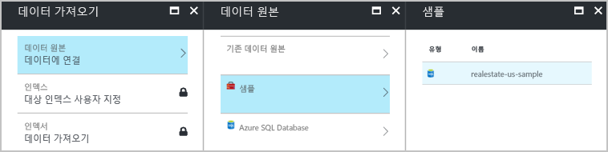
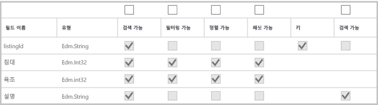
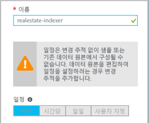
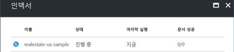
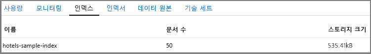
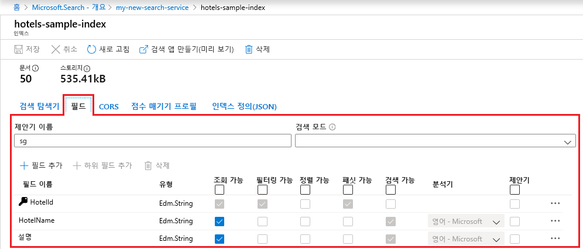

# 빠른 시작: Azure Search 가져오기, 인덱싱 및 쿼리에 기본 제공 포털 도구 사용

Azure Search 개념에서 빠른 램프업의 경우 Azure Portal에서 기본 제공 도구를 시도해 보세요. 마법사 및 편집기는 .NET 및 REST API가 포함된 완벽한 패리티를 제공하지는 않지만 코드 없는 도입을 통해 빠르게 시작하고 몇 분 내에 샘플 데이터에 대한 흥미로운 쿼리를 작성할 수 있습니다.

> [!div class="checklist"]
> * Azure에서 호스트되는 무료 공용 샘플 데이터 세트로 시작
> * 데이터를 로드하고 인덱스를 생성하려면 Azure Search의 **데이터 가져오기** 마법사 실행
> * 포털에서 인덱싱 진행률 모니터링
> * 기존 인덱스 및 이를 수정하기 위한 옵션 보기
> * **검색 탐색기**를 사용하여 전체 텍스트 검색, 필터, 패싯, 유사 항목 검색, 지리적 검색 살펴보기

도구가 너무 제한적인 경우 [.NET에서 Azure Search 프로그래밍에 대한 코드 기반 소개](search-howto-dotnet-sdk.md)를 고려하거나 [REST API를 호출하기 위해 Postman 또는 Fiddler](search-fiddler.md)를 사용할 수 있습니다.

Azure 구독이 아직 없는 경우 시작하기 전에 [체험 계정](https://azure.microsoft.com/free/?WT.mc_id=A261C142F)을 만듭니다. 이 [Azure Search 개요 비디오](https://channel9.msdn.com/Events/Connect/2016/138)를 시작하고 약 3분 후에 시작하는 이 자습서의 단계에 대한 6분짜리 데모 영상을 시청하셔도 됩니다.

## 필수 조건

[Azure Search 서비스를 만들](search-create-service-portal.md)거나 현재 구독에서 기존 서비스를 찾습니다.

1. [Azure Portal](https://portal.azure.com)에 로그인합니다.
2. Azure Search 서비스의 서비스 대시보드를 엽니다. 서비스 타일을 대시보드에 고정하지 않은 경우 다음과 같은 방법으로 서비스를 찾을 수 있습니다.

   * 표시줄의 왼쪽 탐색창에서 **모든 서비스**를 클릭합니다.
   * 검색 상자에 *검색*을 입력하여 구독에 대한 검색 관련 서비스 목록을 가져옵니다. **Search 서비스**를 클릭합니다. 목록에 서비스가 표시됩니다.

### 공간 확인

많은 고객이 무료 서비스를 시작합니다. 이 버전은 3개의 인덱스, 3개의 데이터 소스 및 3개의 인덱서로 제한됩니다. 시작하기 전에 추가 항목에 대한 공간이 있는지 확인합니다. 이 자습서에서는 각 개체를 하나씩 만듭니다.

서비스 대시보드의 섹션에서는 현재 보유 중인 인덱스, 인덱서 및 데이터 원본 수를 보여줍니다. 

##  인덱스 및 부하 데이터 만들기

검색 쿼리는 특정 검색 동작을 최적화하는 검색 가능 데이터, 메타데이터 및 추가 구문을 포함하는 [*인덱스*](search-what-is-an-index.md)에 대해 반복됩니다.

이 자습서에서는 **데이터 가져오기** 마법사를 통해 [*인덱서*](search-indexer-overview.md)를 사용하여 크롤링할 수 있는 기본 제공 샘플 데이터 세트를 사용합니다. 인덱서는 지원되는 Azure 데이터 원본에서 메타데이터 및 콘텐츠를 읽을 수 있는 원본 관련 크롤러입니다. 일반적으로 인덱서를 프로그래밍 방식으로 사용하지만 포털에서는 **데이터 가져오기** 마법사를 통해 인덱서에 액세스할 수 있습니다. 

### 1단계 - 데이터 가져오기 마법사 시작 및 데이터 원본 만들기

1. Azure Search 서비스 대시보드의 명령 모음에서 **데이터 가져오기**를 클릭하여 검색 인덱스를 만들고 채웁니다.

   

2. 마법사에서 **데이터에 연결** > **샘플** > **realestate-us-sample**을 클릭합니다. 이 데이터 원본은 기본 제공됩니다. 사용자 고유의 데이터 원본을 만든 경우 이름, 형식 및 연결 정보를 지정해야 합니다. 생성되는 데이터 원본은 다른 가져오기 작업에서 다시 사용할 수 있는 "기존 데이터 원본"이 됩니다.

   

3. 다음 페이지를 계속합니다.

   

### 2단계 - 인식 기술 건너뛰기

마법사는 Cognitive Services AI 알고리즘을 인덱싱에 통합하기 위해 [인식 기술 파이프라인](cognitive-search-concept-intro.md) 생성을 지원합니다. 

지금은 이 단계를 건너뛰고, **대상 인덱스 사용자 지정**으로 직접 이동하겠습니다.

   

> [!TIP]
> [인식 검색 빠른 시작](cognitive-search-quickstart-blob.md) 또는 [자습서](cognitive-search-tutorial-blob.md)에서 Azure Search를 위한 새로운 인식 검색 미리 보기 기능을 사용해 볼 수 있습니다.

### 3단계: 인덱스 구성

일반적으로 인덱스 생성은 코드 기반 실행으로서 데이터를 로드하기 전에 완료됩니다. 그러나 이 자습서에 표시된 대로 마법사는 크롤링 가능한 데이터 원본에 대한 기본 인덱스를 생성할 수 있습니다. 인덱스에는 적어도 이름 및 필드 컬렉션이 필요하며, 필드 중 하나는 각 문서를 고유하게 식별하는 문서 키로 표시되어야 합니다. 또한 제안된 쿼리를 자동 완료하려는 경우 언어 분석기 및 제안기를 지정할 수 있습니다.

필드에는 데이터 유형과 특성이 있습니다. 위쪽에 있는 확인란은 필드가 사용되는 방법을 제어하는 *인덱스 특성*입니다.

* **조회 가능** 은 검색 결과 목록에 표시된다는 의미입니다. 예를 들어 필드가 필터 식에만 사용되는 경우 이 확인란을 지워 검색 결과에 대한 제한 해제로 개별 필드를 표시할 수 있습니다.
* **키**는 고유한 문서 식별자입니다. 또한 항상 문자열이며 필요합니다.
* **필터링 가능**, **정렬 가능** 및 **패싯 가능**은 필드를 필터, 정렬 또는 패싯 탐색 구조에 사용하는지 여부를 결정합니다.
* **검색 가능** 은 필드가 전체 텍스트 검색에 포함된다는 의미입니다. 문자열은 검색할 수 있습니다. 숫자 필드와 부울 필드는 종종 검색할 수 없다고 표시됩니다.

스토리지 요구 사항은 선택의 결과에 따라 달라지지 않습니다. 예를 들어 여러 필드에 **조회 가능** 특성을 설정하는 경우 스토리지 요구 사항이 증가하지 않습니다.

기본적으로 마법사는 키 필드에 대한 기반으로 고유 식별자에 대한 데이터 원본을 검색합니다. 문자열은 검색 가능한 것으로 규정됩니다. 정수는 검색 가능하고, 필터링 가능하고, 정렬 가능하고, 패싯 가능한 것으로 규정됩니다.

1. 모든 기본값을 적용합니다.

  

2. 다음 페이지를 계속합니다.

  

### 4단계 - 인덱서 구성

**데이터 가져오기** 마법사에서 **인덱서** > **이름**을 클릭하고 인덱서 이름을 입력합니다.

이 개체는 실행 가능한 프로세스를 정의합니다. 이 개체를 되풀이 일정에 게시할 수 있지만 지금은 즉시 기본 옵션을 사용하여 인덱서를 한 번 실행합니다.

**제출**을 클릭하여 인덱서를 만드는 동시에 실행합니다.

  

## 진행률 모니터링

마법사는 진행률을 모니터링할 수 있는 인덱서 목록으로 사용자를 이동시켜야 합니다. 자체 탐색을 위해 개요 페이지로 이동하고 **인덱서**를 클릭합니다.

포털에서 페이지를 업데이트하는 데 몇 분 정도 걸리지만 인덱싱된 문서 수와 함께 상태가 "진행 중" 또는 성공으로 나타나고 새로 만든 인덱서가 목록에 표시되어야 합니다.

   

## 인덱스 보기

기본 서비스 페이지에서는 Azure Search 서비스에서 만든 리소스의 링크를 제공합니다.  방금 만든 인덱스를 보려면 링크 목록에서 **인덱스**를 클릭합니다. 

   

이 목록에서 방금 만든 *realestate-us-sample* 인덱스를 클릭하고, 인덱스 스키마를 볼 수 있습니다. 그리고 필요하다면 새 필드를 추가합니다. 

**필드** 탭에는 인덱스 스키마가 표시됩니다. 목록 맨 아래로 스크롤하여 새 필드를 입력합니다. 대부분의 경우 기존 필드를 변경할 수 없습니다. 기존 필드는 Azure Search에서 물리적 표현이 있으므로 코드에서 조차 수정할 수 없습니다. 기존 필드를 근본적으로 변경하려면 새 인덱스를 만들고 기존 인덱스를 삭제합니다.

   

점수 매기기 프로필 및 CORS 옵션과 같은 다른 구문을 언제든지 추가할 수 있습니다.

인덱스 디자인 중 편집할 수 있고 편집할 수 없는 것을 명확하게 이해하려면 인덱스 정의 옵션을 잠시 살펴봅니다. 흐리게 표시된 옵션은 값을 수정하거나 삭제할 수 없는 표시기입니다. 

##  검색 탐색기를 사용하여 쿼리

앞으로 기본 제공 [**검색 탐색기**](search-explorer.md) 쿼리 페이지를 사용하여 쿼리할 준비가 된 검색 인덱스가 있어야 합니다. 임의의 쿼리 문자열을 테스트할 수 있도록 검색 상자를 제공합니다.

**검색 탐색기**는 [REST API 요청](https://docs.microsoft.com/rest/api/searchservice/search-documents)만 처리할 수 있지만, [단순 쿼리 구문](https://docs.microsoft.com/rest/api/searchservice/simple-query-syntax-in-azure-search) 및 [완전한 Lucene 쿼리 파서](https://docs.microsoft.com/rest/api/searchservice/lucene-query-syntax-in-azure-search)에 대한 구문과 [문서 REST API 검색](https://docs.microsoft.com/rest/api/searchservice/search-documents#bkmk_examples) 작업에 제공되는 모든 검색 매개 변수를 허용합니다.

> [!TIP]
> [Azure Search 개요 비디오](https://channel9.msdn.com/Events/Connect/2016/138)의 6분 8초에 다음 단계가 설명되어 있습니다.
>

1. 명령 모음에서 **검색 탐색기** 를 클릭합니다.

   

2. *realestate-us-sample*로 변경하려면 명령 모음에서 **인덱스 변경**을 클릭합니다. 어떤 REST API가 제공되는지 확인하려면 명령 모음에서 **API 버전 설정**을 클릭합니다. 아래 쿼리의 경우 일반적으로 제공되는 버전(2017-11-11)을 사용합니다.

   

3. 검색 창에 아래의 쿼리 문자열을 붙여넣고 **검색**을 클릭합니다.

   

## 쿼리 예

Bing 이나 Google 검색, 또는 완전히 지정된 쿼리 식에서 수행할 수 있는 작업과 비슷한 조건 및 구를 입력할 수 있습니다. 결과는 자세한 JSON 문서로 반환됩니다.

### 상위 N개 결과를 사용하는 간단한 쿼리

#### 예제(문자열 쿼리): `search=seattle`

* **search** 매개 변수는 완전한 텍스트 검색의 키워드를 입력하는 데 사용됩니다. 이 예에서는 워싱턴 주 킹 카운티의 목록을 반환하며, 문서에서 검색 가능한 모든 필드에 *시애틀*이 포함되어 있습니다.

* **검색 탐색기**는 문서 구조가 조밀하면 장황하고 읽기 어려운 JSON으로 결과를 반환합니다. 이는 의도적인 것으로, 전체 문서의 가시성은 개발을 위해, 특히 테스트에 중요합니다. 더 나은 사용자 환경을 위해 중요한 요소를 끌어내도록 [검색 결과를 처리](search-pagination-page-layout.md)하는 코드를 작성해야 합니다.

* 문서는 인덱스에서 "검색 가능"으로 표시되는 모든 필드로 구성됩니다. 포털에서 인덱스 특성을 보려면 *인덱스* 목록에서 **realestate-us-sample**을 클릭합니다.

#### 예제(매개 변수가 있는 쿼리): `search=seattle&$count=true&$top=100`

* **&** 기호는 순서에 관계 없이 지정할 수 있는 검색 매개 변수를 추가하는 데 사용됩니다.

* **$count=true** 매개 변수는 반환된 모든 문서의 수를 반환합니다. 이 값은 검색 결과의 위쪽에 나타납니다. **$count=true**에서 보고하는 변경 내용을 모니터링하여 필터 쿼리를 확인할 수 있습니다. 더 작은 수는 필터가 작동하는 것을 나타냅니다.

* **$top=100**은 문서 전체에서 가장 순위가 높은 문서 100개를 반환합니다. 기본적으로 Azure Search는 일치 항목 중 처음 50개를 반환합니다. **$top**을 통해 이 수를 늘리거나 줄일 수 있습니다.

###  쿼리 필터링

**$filter** 매개 변수를 추가할 때 검색 요청에 필터가 포함됩니다. 

#### 예제(필터링됨): `search=seattle&$filter=beds gt 3`

* **$filter** 매개 변수는 사용자가 입력한 조건과 일치하는 결과를 반환합니다. 이 예에서는 침실 수가 3보다 큽니다.

* 필터 구문은 OData 구조입니다. 자세한 내용은 [OData 필터 구문](https://docs.microsoft.com/rest/api/searchservice/odata-expression-syntax-for-azure-search)을 참조하세요.

###  쿼리 패싯

패싯 필터는 검색 요청에 포함됩니다. 패싯 매개 변수를 사용하면 사용자가 입력하는 패싯 값과 일치하는 집계된 문서 수를 반환할 수 있습니다.

#### 예제(범위 감소를 사용하여 패싯): `search=*&facet=city&$top=2`

* **search=** \* 는 빈 검색입니다. 빈 검색은 모든 것을 검색합니다. 빈 쿼리를 제출하는 한 가지 이유는 문서는 문서 전체를 필터링하거나 패싯하는 것입니다. 예를 들어 인덱스의 모든 도시로 구성되는 패싯 탐색 구조가 필요할 수 있습니다.

* **facet**은 UI 컨트롤에 전달할 수 있는 탐색 구조를 반환합니다. 범주와 개수를 반환합니다. 이 예에서 범주는 도시 수를 기반으로 합니다. Azure Search에는 집계가 없습니다. 하지만 각 범주의 문서 수를 제공하는 `facet`을 통해 근사치를 집계할 수 있습니다.

* **$top=2**는 두 문서를 가져오고, `top`을 사용하여 결과를 늘리거나 줄일 수 있다는 것을 보여줍니다.

#### 예제(숫자 값에서 패싯): `search=seattle&facet=beds`**

* 이 쿼리는 *시애틀*에 대한 텍스트 검색에서 침대에 대한 패싯입니다. *침대*라는 조건을 패싯으로 지정할 수 있습니다. 왜냐하면 필드는 인덱스에서 검색 가능하고, 필터링 가능하고, 패싯 가능한 것으로 표시되고(숫자 1-5), 필드에 포함된 값은 목록을 그룹으로 분류(침실 3개, 침실 4개 목록)하는 데 적합하기 때문입니다.

* 필터링 가능한 필드만 패싯이 가능합니다. 검색이 가능한 필드만 결과에 반환할 수 있습니다.

###  검색 결과 강조

적중 항목 강조 표시는 키워드와 일치하는 텍스트의 형식을 참조하며, 제공되는 일치 항목은 특정 필드에 있습니다. 검색어가 설명에 깊게 묻혀 있으면 좀 더 쉽게 찾을 수 있도록 적중 항목 강조 표시를 추가할 수 있습니다.

#### 예제(강조 표시): `search=granite countertops&highlight=description`

* 이 예제에서는 형식이 지정된 *화강암 싱크대*라는 구를 설명 필드에서 쉽게 찾을 수 있습니다.

#### 예제(언어 분석): `search=mice&highlight=description`

* 전체 텍스트 검색은 의미 체계가 유사한 단어 형태를 찾습니다. 이 예에서는 키워드 검색 "mice"에 대한 응답으로 쥐가 출몰한 집에 대해 검색 결과에 "mouse"에 대해 강조 표시된 텍스트가 포함되었습니다. 언어 분석 때문에 같은 단어가 다른 형태로 결과에 나타날 수 있습니다.

* Azure Search는 Lucene와 Microsoft의 56가지 분석기를 지원합니다. Azure Search에서 사용하는 기본 분석기는 표준 Lucene 분석기입니다.

###  유사 항목 검색 시도

기본적으로 시애틀 지역의 Samammish 고원을 *samamish*로 잘못 입력한 쿼리 용어처럼 맞춤법이 잘못된 쿼리 용어는 일반 검색에서 일치 항목을 반환하지 않습니다. 다음 예제는 결과를 반환하지 않습니다.

#### 예제(맞춤법이 잘못된 용어, 처리되지 않음): `search=samamish`

맞춤법 오류를 처리하려면 유사 항목 검색을 사용하면 됩니다. 두 가지를 수행하는 경우 발생하는 전체 Lucene 쿼리 구문을 사용할 때 유사 항목 검색이 활성화됩니다. 쿼리에서 **queryType=full**을 설정하고, 검색 문자열에 **~** 를 추가합니다.

#### 예제(맞춤법이 잘못된 용어, 처리됨): `search=samamish~&queryType=full`

이 예제는 이제 "Sammamish"에서 일치 항목을 포함하는 문서를 반환합니다.

**queryType**을 지정하지 않으면 기본 단순 쿼리 파서가 사용됩니다. 단순 쿼리 파서는 속도가 좀 더 빠릅니다. 하지만 유사 항목 검색, 정규식, 근접 검색 또는 다른 고급 쿼리 종류가 필요한 경우 전체 구문을 사용해야 합니다.

유사 항목 검색 및 와일드카드 검색은 검색 출력에 영향을 줍니다. 이러한 쿼리 형식에서 언어 분석이 수행되지 않습니다. 유사 항목 및 와일드카드 검색을 사용하기 전에 [Azure Search의 전체 텍스트 검색 작동 방식](search-lucene-query-architecture.md#stage-2-lexical-analysis)을 검토하고 어휘 분석의 예외에 대한 섹션을 찾습니다.

전체 쿼리 파서를 통해 지원되는 쿼리 시나리오에 대한 자세한 내용은 [Azure Search의 Lucene 쿼리 구문](https://docs.microsoft.com/rest/api/searchservice/lucene-query-syntax-in-azure-search)을 참조하세요.

###  지리 공간 검색 시도

지리 공간 검색은 좌표가 포함된 필드의 [edm.GeographyPoint 데이터 유형](https://docs.microsoft.com/rest/api/searchservice/supported-data-types)을 통해 지원됩니다. Geosearch는 [OData 필터 구문](https://docs.microsoft.com/rest/api/searchservice/odata-expression-syntax-for-azure-search)에 지정된 필터 유형입니다.

#### 예제(지리적 좌표 필터): `search=*&$count=true&$filter=geo.distance(location,geography'POINT(-122.121513 47.673988)') le 5`

예제 쿼리는 위치 데이터의 모든 결과를 필터링하며, 결과는 위도 및 경도 좌표로 지정된 특정 지점으로부터 5킬로미터 미만입니다. **$count**를 추가하면 거리 또는 좌표를 변경할 때 반환되는 결과가 몇 개인지 확인할 수 있습니다.

지리 공간 검색은 검색 애플리케이션에 "주변 찾기" 기능이 있거나 지도 탐색을 사용하는 경우에 유용합니다. 하지만 전체 텍스트 검색은 아닙니다. 이름으로 도시 또는 국가를 검색할 수 있어야 한다는 사용자 요구 사항이 있는 경우 좌표 외에도 도시 또는 국가 이름이 포함된 필드를 추가하면 됩니다.

## 핵심 내용

이 자습서에서는 Azure Portal을 사용하여 Azure Search를 간략하게 소개했습니다.

**데이터 가져오기** 마법사를 사용하여 검색 인덱스를 만드는 방법을 배웠습니다. [게시된 인덱스에 대한 지원되는 수정](https://docs.microsoft.com/rest/api/searchservice/update-index)을 포함하여 [인덱서](search-indexer-overview.md) 및 인덱스 디자인에 대한 기본 워크플로를 알아보았습니다.

Azure Portal에서 **검색 탐색기**를 사용하여 필터, 적중 항목 강조 표시, 유사 항목 검색, 지리적 검색 등의 주요 기능을 보여주는 실습 예제를 통해 몇 가지 기본 쿼리 구문을 알아보았습니다.

포털에서 인덱스, 인덱서 및 데이터 원본을 찾는 방법도 알아보았습니다. 향후 어떤 새 데이터 원본이 주어지더라도 포털을 사용하여 최소한의 노력으로 신속하게 정의 또는 필드 컬렉션을 확인할 수 있습니다.

## 정리

이 자습서를 통해 Azure Search 서비스를 처음 사용한 경우 Azure Search 서비스가 포함된 리소스 그룹을 삭제합니다. 처음이 아닌 경우 서비스 목록에서 올바른 리소스 그룹 이름을 조회하여 적절한 리소스 그룹을 삭제하세요.

## 다음 단계

프로그래밍 방식 도구를 사용하여 Azure Search를 좀 더 자세히 탐색할 수 있습니다.

* [.NET SDK를 사용하여 인덱스 만들기](https://docs.microsoft.com/azure/search/search-create-index-dotnet)
* [REST API를 사용하여 인덱스 만들기](https://docs.microsoft.com/azure/search/search-create-index-rest-api)
* [Postman 또는 Fiddler 및 Azure Search REST API를 사용하여 인덱스 만들기](search-fiddler.md)