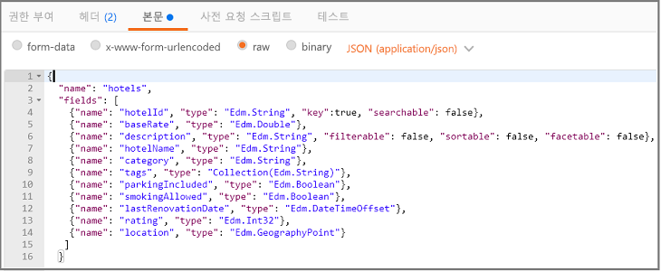
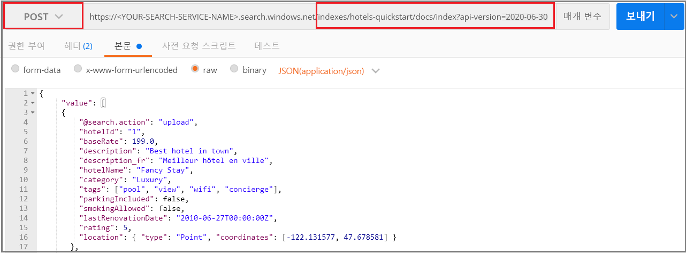
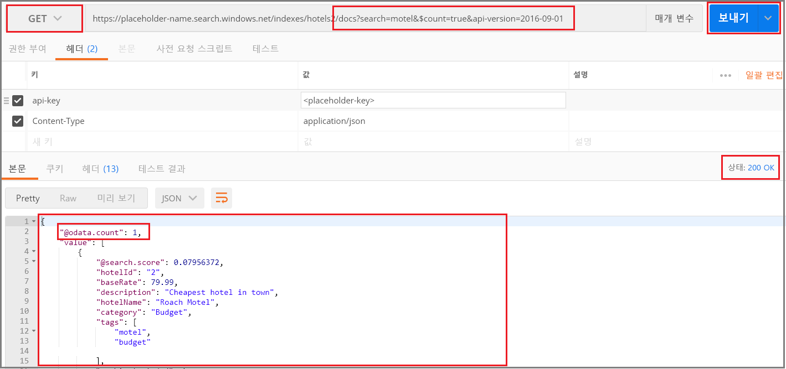
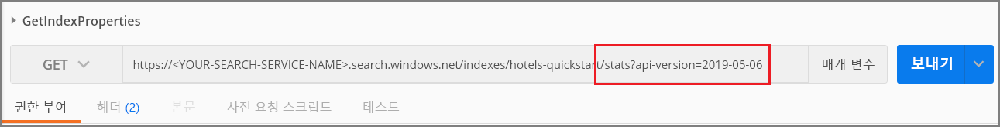

# <a name="quickstart-create-an-azure-search-index-in-postman-using-rest-apis"></a>빠른 시작: REST API를 사용하여 Postman에서 Azure Search 인덱스 만들기
> [!div class="op_single_selector"]
> * [Postman](search-get-started-postman.md)
> * [C#](search-create-index-dotnet.md)
> * [Python](search-get-started-python.md)
> * [포털](search-get-started-portal.md)
> * [PowerShell](search-howto-dotnet-sdk.md)
>*

[Azure Search REST API](https://docs.microsoft.com/rest/api/searchservice)를 검색하는 가장 쉬운 방법 중 하나는 Postman 또는 다른 웹 테스트 도구를 사용하여 HTTP 요청을 작성하고 응답을 검사하는 것입니다. 적절한 도구와 이러한 지침을 사용하면 코드를 작성하기 전에 요청을 전송하고 응답을 볼 수 있습니다.

이 문서에서는 요청을 대화형으로 작성하는 방법을 설명합니다. 또는 [Postman 컬렉션을 다운로드한 후 가져와](https://github.com/Azure-Samples/azure-search-postman-samples/tree/master/Quickstart) 미리 정의된 요청을 사용할 수도 있습니다.

Azure 구독이 아직 없는 경우 시작하기 전에 [체험 계정](https://azure.microsoft.com/free/?WT.mc_id=A261C142F)을 만듭니다.

## <a name="prerequisites"></a>필수 조건

이 빠른 시작에 필요한 서비스와 도구는 다음과 같습니다. 

+ [Postman 데스크톱 앱](https://www.getpostman.com/)은 요청을 Azure Search에 보내는 데 사용됩니다.

+ [Azure Search 서비스를 만들거나](search-create-service-portal.md) 현재 구독에서 [기존 서비스를 찾습니다](https://ms.portal.azure.com/#blade/HubsExtension/BrowseResourceBlade/resourceType/Microsoft.Search%2FsearchServices). 이 빠른 시작에서는 체험 서비스를 사용할 수 있습니다. 

## <a name="get-a-key-and-url"></a>키 및 URL 가져오기

REST를 호출하려면 모든 요청에 대한 액세스 키와 서비스 URL이 필요합니다. 검색 서비스는 둘 모두를 사용하여 작성되므로 Azure Search를 구독에 추가한 경우 다음 단계에 따라 필요한 정보를 확보하십시오.

1. [Azure Portal에 로그인](https://portal.azure.com/)하고, 검색 서비스 **개요** 페이지에서 URL을 가져옵니다. 엔드포인트의 예는 다음과 같습니다. `https://mydemo.search.windows.net`

1. **설정** > **키**에서 서비스에 대한 모든 권한의 관리자 키를 가져옵니다. 교체 가능한 두 개의 관리자 키가 있으며, 하나를 롤오버해야 하는 경우 비즈니스 연속성을 위해 다른 하나가 제공됩니다. 개체 추가, 수정 및 삭제 요청 시 기본 또는 보조 키를 사용할 수 있습니다.


모든 요청에서 서비스에 보내는 각 요청마다 API 키가 필요합니다. 유효한 키가 있다면 요청을 기반으로 요청을 보내는 애플리케이션과 이를 처리하는 서비스 사이에 신뢰가 쌓입니다.

## <a name="connect-to-azure-search"></a>Azure Search에 연결

이 섹션에서는 선택한 웹 도구를 사용하여 Azure Search에 대한 연결을 설정합니다. 각 도구는 세션에 대한 요청 헤더 정보를 유지하므로 api-key 및 Content-Type을 한 번만 입력하면 됩니다.

두 도구 중 하나에서 명령(GET, POST, PUT 등)을 선택하고 URL 엔드포인트를 제공하며, 일부 작업의 경우 요청 본문에 JSON을 제공해야 합니다. 검색 서비스 이름(YOUR-SEARCH-SERVICE-NAME)을 유효한 값으로 바꿉니다. `$select=name`을 추가하여 각 인덱스의 이름만 반환합니다. 

    https://<YOUR-SEARCH-SERVICE-NAME>.search.windows.net/indexes?api-version=2019-05-06&$select=name

HTTPS 접두사, 서비스 이름, 개체 이름(이 경우 인덱스 컬렉션) 및 [api-version](search-api-versions.md)을 확인합니다. api-version은 현재 버전에 대해 `?api-version=2019-05-06`로 지정된 필수 소문자 문자열입니다. API 버전은 정기적으로 업데이트됩니다. 각 요청에 api-version을 포함시키면 어느 것이 사용되는지를 완전히 제어할 수 있습니다.  

요청 헤더 구성에는 콘텐츠 형식 및 Azure Search에 인증하는 데 사용되는 api-key의 두 가지 요소가 포함됩니다. 관리 API 키(YOUR-AZURE-SEARCH-ADMIN-API-KEY)를 유효한 값으로 바꿉니다. 

    api-key: <YOUR-AZURE-SEARCH-ADMIN-API-KEY>
    Content-Type: application/json

Postman에서 다음 스크린샷과 같은 요청을 작성합니다. 동사로 **GET**을 선택하고, URL을 제공하고, **보내기**를 클릭합니다. 이 명령은 Azure Search에 연결하여 인덱스 컬렉션을 읽고, 성공적으로 연결되면 200 HTTP 상태 코드를 반환합니다. 서비스에 이미 인덱스가 있으면 응답에 인덱스 정의도 포함됩니다.


## <a name="1---create-an-index"></a>1 - 인덱스 만들기

Azure Search에서는 일반적으로 데이터를 로드하기 전에 인덱스를 만듭니다. 이 작업에는 [인덱스 만들기](https://docs.microsoft.com/rest/api/searchservice/create-index) REST API가 사용됩니다. 

URL은 `hotels` 인덱스 이름을 포함하도록 확장됩니다.

Postman에서 이렇게 하려면 다음을 수행합니다.

1. 동사를 **PUT**으로 변경합니다.

2. 이 URL(`https://<YOUR-SEARCH-SERVICE-NAME>.search.windows.net/indexes/hotels-quickstart?api-version=2019-05-06`)에 복사합니다.

3. 인덱스 정의(아래에 복사 준비 코드가 제공됨)를 요청 본문에 지정합니다.

4. **보내기**를 클릭합니다.



### <a name="index-definition"></a>인덱스 정의

fields 컬렉션은 문서 구조를 정의합니다. 각 문서에는 이러한 필드가 있어야 하며, 각 필드에는 데이터 형식이 있어야 합니다. 문자열 필드는 전체 텍스트 검색에 사용되므로 콘텐츠를 검색할 수 있도록 하려면 숫자 데이터를 문자열로 캐스팅해야 합니다.

필드의 특성에 따라 허용되는 작업이 결정됩니다. REST API는 기본적으로 많은 작업을 허용합니다. 예를 들어, 모든 문자열은 기본적으로 검색, 조회, 필터링이 가능하고 패싯이 가능합니다. 동작을 해제해야 하는 경우 특성만 설정하면 되는 경우가 많습니다.

```json
{
    "name": "hotels-quickstart",  
    "fields": [
        {"name": "HotelId", "type": "Edm.String", "key": true, "filterable": true},
        {"name": "HotelName", "type": "Edm.String", "searchable": true, "filterable": false, "sortable": true, "facetable": false},
        {"name": "Description", "type": "Edm.String", "searchable": true, "filterable": false, "sortable": false, "facetable": false, "analyzer": "en.lucene"},
        {"name": "Category", "type": "Edm.String", "searchable": true, "filterable": true, "sortable": true, "facetable": true},
        {"name": "Tags", "type": "Collection(Edm.String)", "searchable": true, "filterable": true, "sortable": false, "facetable": true},
        {"name": "ParkingIncluded", "type": "Edm.Boolean", "filterable": true, "sortable": true, "facetable": true},
        {"name": "LastRenovationDate", "type": "Edm.DateTimeOffset", "filterable": true, "sortable": true, "facetable": true},
        {"name": "Rating", "type": "Edm.Double", "filterable": true, "sortable": true, "facetable": true},
        {"name": "Address", "type": "Edm.ComplexType", 
        "fields": [
        {"name": "StreetAddress", "type": "Edm.String", "filterable": false, "sortable": false, "facetable": false, "searchable": true},
        {"name": "City", "type": "Edm.String", "searchable": true, "filterable": true, "sortable": true, "facetable": true},
        {"name": "StateProvince", "type": "Edm.String", "searchable": true, "filterable": true, "sortable": true, "facetable": true},
        {"name": "PostalCode", "type": "Edm.String", "searchable": true, "filterable": true, "sortable": true, "facetable": true},
        {"name": "Country", "type": "Edm.String", "searchable": true, "filterable": true, "sortable": true, "facetable": true}
        ]
     }
  ]
}
```

이 요청을 제출할 때 인덱스가 성공적으로 생성되었음을 나타내는 HTTP 201 응답을 받아야 합니다. 이 작업은 포털에서 확인할 수 있지만 포털 페이지에 새로 고침 간격이 있으므로 그 때까지 1~2분이 걸릴 수 있습니다.

> [!TIP]
> HTTP 504가 표시될 경우 URL이 HTTPS를 지정하는지 확인합니다. HTTP 400 또는 404가 표시되는 경우 요청 본문에서 복사/붙여 넣기 오류가 없는지 확인합니다. HTTP 403은 대개 api-key에 문제가 있음을 나타냅니다(잘못된 키 또는 api-key 지정 방법과 관련된 구문 문제).

## <a name="2---load-documents"></a>2 - 문서 로드

인덱스 생성과 인덱스 채우기는 별도의 단계입니다. Azure Search 검색에서 인덱스에는 JSON 문서로 제공할 수 있는 검색 가능한 모든 데이터가 포함됩니다. 이 작업에는 [문서 추가, 업데이트 또는 삭제](https://docs.microsoft.com/rest/api/searchservice/addupdate-or-delete-documents) REST API가 사용됩니다. 

URL은 `docs` 컬렉션 및 `index` 작업을 포함하도록 확장됩니다.

Postman에서 이렇게 하려면 다음을 수행합니다.

1. 동사를 **POST**로 변경합니다.

2. 이 URL(`https://<YOUR-SEARCH-SERVICE-NAME>.search.windows.net/indexes/hotels-quickstart/docs/index?api-version=2019-05-06`)에 복사합니다.

3. JSON 문서(아래에 복사 준비 코드가 제공됨)를 요청 본문에 지정합니다.

4. **보내기**를 클릭합니다.



### <a name="json-documents-to-load-into-the-index"></a>인덱스에 로드할 JSON 문서

요청 본문에 호텔 인덱스에 추가될 문서 4개가 포함됩니다.

```json
{
    "value": [
    {
    "@search.action": "upload",
    "HotelId": "1",
    "HotelName": "Secret Point Motel",
    "Description": "The hotel is ideally located on the main commercial artery of the city in the heart of New York. A few minutes away is Time's Square and the historic centre of the city, as well as other places of interest that make New York one of America's most attractive and cosmopolitan cities.",
    "Category": "Boutique",
    "Tags": [ "pool", "air conditioning", "concierge" ],
    "ParkingIncluded": false,
    "LastRenovationDate": "1970-01-18T00:00:00Z",
    "Rating": 3.60,
    "Address": 
        {
        "StreetAddress": "677 5th Ave",
        "City": "New York",
        "StateProvince": "NY",
        "PostalCode": "10022",
        "Country": "USA"
        } 
    },
    {
    "@search.action": "upload",
    "HotelId": "2",
    "HotelName": "Twin Dome Motel",
    "Description": "The hotel is situated in a  nineteenth century plaza, which has been expanded and renovated to the highest architectural standards to create a modern, functional and first-class hotel in which art and unique historical elements coexist with the most modern comforts.",
    "Category": "Boutique",
    "Tags": [ "pool", "free wifi", "concierge" ],
    "ParkingIncluded": false,
    "LastRenovationDate": "1979-02-18T00:00:00Z",
    "Rating": 3.60,
    "Address": 
        {
        "StreetAddress": "140 University Town Center Dr",
        "City": "Sarasota",
        "StateProvince": "FL",
        "PostalCode": "34243",
        "Country": "USA"
        } 
    },
    {
    "@search.action": "upload",
    "HotelId": "3",
    "HotelName": "Triple Landscape Hotel",
    "Description": "The Hotel stands out for its gastronomic excellence under the management of William Dough, who advises on and oversees all of the Hotel’s restaurant services.",
    "Category": "Resort and Spa",
    "Tags": [ "air conditioning", "bar", "continental breakfast" ],
    "ParkingIncluded": true,
    "LastRenovationDate": "2015-09-20T00:00:00Z",
    "Rating": 4.80,
    "Address": 
        {
        "StreetAddress": "3393 Peachtree Rd",
        "City": "Atlanta",
        "StateProvince": "GA",
        "PostalCode": "30326",
        "Country": "USA"
        } 
    },
    {
    "@search.action": "upload",
    "HotelId": "4",
    "HotelName": "Sublime Cliff Hotel",
    "Description": "Sublime Cliff Hotel is located in the heart of the historic center of Sublime in an extremely vibrant and lively area within short walking distance to the sites and landmarks of the city and is surrounded by the extraordinary beauty of churches, buildings, shops and monuments. Sublime Cliff is part of a lovingly restored 1800 palace.",
    "Category": "Boutique",
    "Tags": [ "concierge", "view", "24-hour front desk service" ],
    "ParkingIncluded": true,
    "LastRenovationDate": "1960-02-06T00:00:00Z",
    "Rating": 4.60,
    "Address": 
        {
        "StreetAddress": "7400 San Pedro Ave",
        "City": "San Antonio",
        "StateProvince": "TX",
        "PostalCode": "78216",
        "Country": "USA"
        }
    }
  ]
}
```

몇 초 후에 HTTP 201 응답이 검색 목록에 표시됩니다. 이는 문서가 성공적으로 만들어졌음을 나타냅니다. 

207이 표시될 경우 하나 이상의 문서를 업로드하지 못했습니다. 404가 표시될 경우 요청의 헤더 또는 본문에 구문 오류가 있습니다. `/docs/index`를 포함하도록 엔드포인트를 변경했는지 확인하십시오.

> [!Tip]
> 선택한 데이터 원본의 경우 인덱싱에 필요한 코드의 양을 줄이고 단순화할 수 있는 대체 *인덱서* 방식을 선택할 수 있습니다. 자세한 내용은 [인덱서 작업](https://docs.microsoft.com/rest/api/searchservice/indexer-operations)을 참조하세요.


## <a name="3---search-an-index"></a>3 - 인덱스 검색

이제 인덱스와 문서가 로드되었으므로 [문서 검색](https://docs.microsoft.com/rest/api/searchservice/search-documents) REST API를 사용하여 쿼리를 실행할 수 있습니다.

URL은 검색 연산자를 사용하여 지정된 쿼리 식을 포함하도록 확장됩니다.

Postman에서 이렇게 하려면 다음을 수행합니다.

1. 동사를 **GET**으로 변경합니다.

2. 이 URL(`https://<YOUR-SEARCH-SERVICE-NAME>.search.windows.net/indexes/hotels-quickstart/docs?search=*&$count=true&api-version=2019-05-06`)에 복사합니다.

3. **보내기**를 클릭합니다.

이 쿼리는 비어 있으며 검색 결과에 문서의 수를 반환합니다. **보내기**를 클릭한 후 요청 및 응답은 Postman의 다음 스크린샷과 유사합니다. 상태 코드는 200이어야 합니다.

 

구문을 이해하기 위해 몇 가지 다른 쿼리 예제를 시도해봅니다. 문자열 검색, 축자 $filter 쿼리를 수행하고, 결과 세트를 제한하고, 검색 범위를 특정 필드로 지정하는 등의 작업을 수행할 수 있습니다.

결과를 볼 때마다 현재 URL을 아래의 URL로 바꾸고, **보내기**를 클릭합니다.

```
# Query example 1 - Search on restaurant and wifi
# Return only the HotelName, Description, and Tags fields
https://<YOUR-SEARCH-SERVICE>.search.windows.net/indexes/hotels-quickstart/docs?search=restaurant wifi&$count=true&$select=HotelName,Description,Tags&api-version=2019-05-06

# Query example 2 - Apply a filter to the index to find hotels rated 4 or highter
# Returns the HotelName and Rating. Two documents match
https://<YOUR-SEARCH-SERVICE>.search.windows.net/indexes/hotels-quickstart/docs?search=*&$filter=Rating gt 4&$select=HotelName,Rating&api-version=2019-05-06

# Query example 3 - Take the top two results, and show only HotelName and Category in the results
https://<YOUR-SEARCH-SERVICE>.search.windows.net/indexes/hotels-quickstart/docs?search=boutique&$top=2&$select=HotelName,Category&api-version=2019-05-06

# Query example 4 - Sort by a specific field (Address/City) in ascending order
https://<YOUR-SEARCH-SERVICE>.search.windows.net/indexes/hotels-quickstart/docs?search=pool&$orderby=Address/City asc&$select=HotelName, Address/City, Tags, Rating&api-version=2019-05-06
```

## <a name="get-index-properties"></a>인덱스 속성 가져오기
[통계 가져오기](https://docs.microsoft.com/rest/api/searchservice/get-index-statistics)를 사용하여 문서 개수와 인덱스 크기를 쿼리할 수도 있습니다. 

```
https://<YOUR-SEARCH-SERVICE-NAME>.search.windows.net/indexes/hotels-quickstart/stats?api-version=2019-05-06`
```

URL에 `/stats`를 추가하면 인덱스 정보가 반환됩니다. Postman에서 요청은 다음과 유사하며 응답에는 문서 수와 사용된 공간(바이트 단위)이 포함됩니다.

 

api-version 구문이 다른 점에 유의하세요. 이 요청의 경우 `?`를 사용하여 api-version을 추가합니다. `?`는 쿼리 문자열에서 URL 경로를 구분하고 &는 쿼리 문자열에서 각 '이름=값' 쌍을 구분합니다. 이 쿼리에서 api-version은 쿼리 문자열의 처음이자 유일한 항목입니다.

## <a name="clean-up"></a>정리

본인 소유의 구독으로 이 모듈을 진행하고 있는 경우에는 프로젝트가 끝날 때 여기서 만든 리소스가 계속 필요한지 확인하는 것이 좋습니다. 계속 실행되는 리소스에는 요금이 부과될 수 있습니다. 리소스를 개별적으로 삭제하거나 리소스 그룹을 삭제하여 전체 리소스 세트를 삭제할 수 있습니다.

왼쪽 탐색 창의 **모든 리소스** 또는 **리소스 그룹** 링크를 사용하여 포털에서 리소스를 찾고 관리할 수 있습니다.

무료 서비스를 사용하는 경우 인덱스, 인덱서, 데이터 원본 세 개로 제한됩니다. 포털에서 개별 항목을 삭제하여 제한 이하로 유지할 수 있습니다. 

## <a name="next-steps"></a>다음 단계

이제 핵심 작업을 수행하는 방법을 배웠으므로 인덱서 또는 [인지 검색 파이프라인 설정](cognitive-search-tutorial-blob.md)과 같은 고급 기능에 대한 추가 REST API 호출을 진행할 수 있습니다. 다음 단계에서는 다음 링크를 권장합니다.

> [!div class="nextstepaction"]
> [REST 자습서: Azure Search에서 반정형 데이터(JSON Blob) 인덱싱 및 검색](search-semi-structured-data.md)
