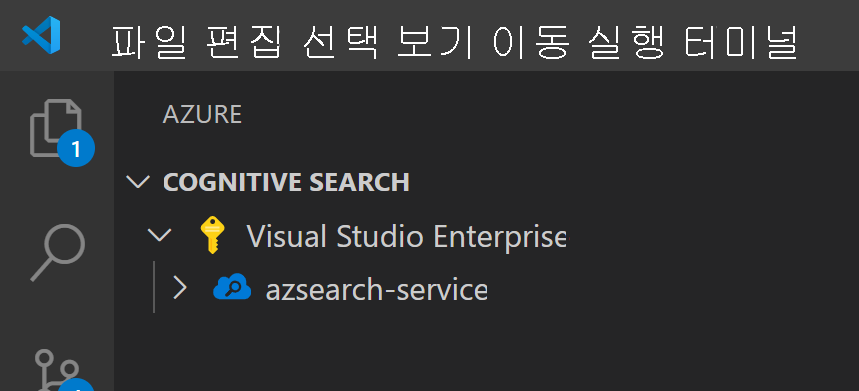
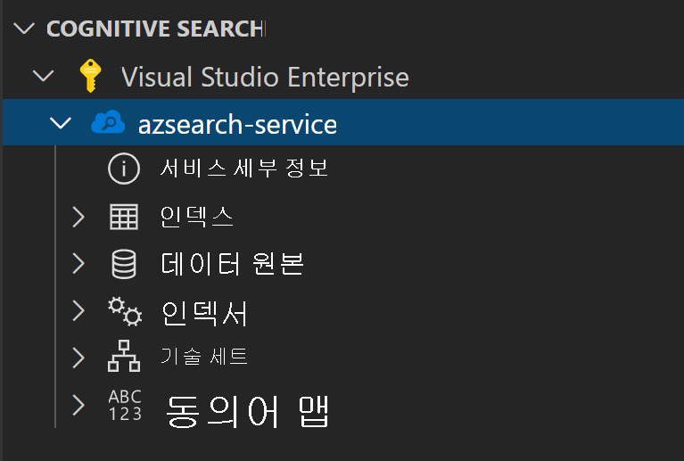
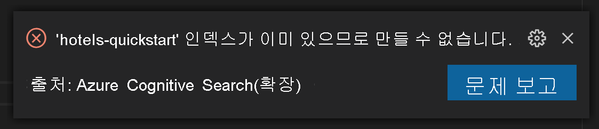
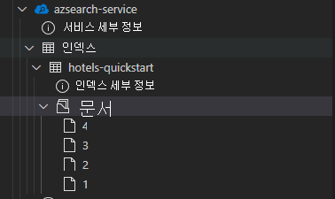

# <a name="get-started-with-azure-cognitive-search-using-visual-studio-code"></a>Visual Studio Code를 사용하여 Azure Cognitive Search 시작

이 문서에서는 [Azure Cognitive Search REST API](/rest/api/searchservice) 및 [Visual Studio Code](https://marketplace.visualstudio.com/items?itemName=ms-azuretools.vscode-azurecognitivesearch)를 사용하여 REST API 요청을 대화형으로 작성하는 방법을 설명합니다. [Azure Cognitive Search(미리 보기)용 Visual Studio 코드 확장](https://marketplace.visualstudio.com/items?itemName=ms-azuretools.vscode-azurecognitivesearch) 및 이러한 지침을 사용하면 코드를 작성하기 전에 요청을 보내고 응답을 볼 수 있습니다.

Azure 구독이 아직 없는 경우 시작하기 전에 [체험 계정](https://azure.microsoft.com/free/?WT.mc_id=A261C142F)을 만듭니다.

> [!IMPORTANT] 
> 이 기능은 현재 공개 미리 보기로 제공됩니다. 미리 보기 기능은 서비스 수준 계약 없이 제공되며, 프로덕션 워크로드에는 사용하지 않는 것이 좋습니다. 자세한 내용은 [Microsoft Azure Preview에 대한 추가 사용 약관](https://azure.microsoft.com/support/legal/preview-supplemental-terms/)을 참조하세요. 

## <a name="prerequisites"></a>사전 요구 사항

이 빠른 시작에 필요한 서비스와 도구는 다음과 같습니다. 

+ [Visual Studio Code](https://code.visualstudio.com/download)

+ [Visual Studio Code용 Azure Cognitive Search(미리 보기)](https://marketplace.visualstudio.com/items?itemName=ms-azuretools.vscode-azurecognitivesearch)

+ [Azure Cognitive Search 서비스를 만들거나](search-create-service-portal.md) 현재 구독에서 [기존 서비스를 찾습니다](https://ms.portal.azure.com/#blade/HubsExtension/BrowseResourceBlade/resourceType/Microsoft.Search%2FsearchServices). 이 빠른 시작에서는 체험 서비스를 사용할 수 있습니다. 

## <a name="install-the-extension"></a>확장 설치

먼저 [VS Code](https://code.visualstudio.com)를 엽니다. 작업 막대에서 **확장** 탭을 선택한 다음, *Azure Cognition Search* 를 검색합니다. 검색 결과에서 확장을 찾고, **설치** 를 선택합니다.


또는 웹 브라우저의 VS Code 마켓플레이스에서 [Azure Cognition Search 확장](https://aka.ms/vscode-search)을 설치할 수 있습니다.

새 Azure 탭이 아직 없는 경우 작업 막대에 표시되어 있습니다.


## <a name="connect-to-your-subscription"></a>구독에 연결

**Azure에 로그인...** 을 선택하고, Azure 계정에 로그인합니다.

구독이 표시됩니다. 구독을 선택하여 해당 구독에서 검색 서비스 목록을 확인합니다.



표시되는 구독을 제한하려면 명령 팔레트(Ctrl+Shift+P 또는 Cmd+Shift+P)를 열고, *Azure* 또는 *구독 선택* 을 검색합니다. Azure 계정에 로그인하거나 로그아웃하는 데 사용할 수 있는 명령도 있습니다.

검색 서비스를 펼치면 각 Cognitive Search 리소스(인덱스, 데이터 원본, 인덱서, 기술 세트 및 동의어 맵)에 대한 트리 항목이 표시됩니다.



이러한 트리 항목을 펼쳐 검색 서비스에 있는 모든 리소스를 표시할 수 있습니다.

## <a name="1---create-an-index"></a>1 - 인덱스 만들기

Azure Cognitive Search를 시작하려면 먼저 검색 인덱스를 만들어야 합니다. 이 작업은 [인덱스 만들기 REST API](/rest/api/searchservice/create-index)를 사용하여 수행됩니다. 

VS Code 확장을 사용하면 요청 본문만 고려하면 됩니다. 이 빠른 시작에서는 인덱스 정의 샘플 및 해당 문서를 제공합니다.

### <a name="index-definition"></a>인덱스 정의

아래의 인덱스 정의는 가상 호텔에 대한 스키마 샘플입니다.

`fields` 컬렉션은 검색 인덱스의 문서 구조를 정의합니다. 각 필드에는 데이터 형식과 필드를 사용하는 방법을 결정하는 다양한 추가 특성이 있습니다.

```json
{
    "name": "hotels-quickstart",
    "fields": [
        {
            "name": "HotelId",
            "type": "Edm.String",
            "key": true,
            "filterable": true
        },
        {
            "name": "HotelName",
            "type": "Edm.String",
            "searchable": true,
            "filterable": false,
            "sortable": true,
            "facetable": false
        },
        {
            "name": "Description",
            "type": "Edm.String",
            "searchable": true,
            "filterable": false,
            "sortable": false,
            "facetable": false,
            "analyzer": "en.lucene"
        },
        {
            "name": "Description_fr",
            "type": "Edm.String",
            "searchable": true,
            "filterable": false,
            "sortable": false,
            "facetable": false,
            "analyzer": "fr.lucene"
        },
        {
            "name": "Category",
            "type": "Edm.String",
            "searchable": true,
            "filterable": true,
            "sortable": true,
            "facetable": true
        },
        {
            "name": "Tags",
            "type": "Collection(Edm.String)",
            "searchable": true,
            "filterable": true,
            "sortable": false,
            "facetable": true
        },
        {
            "name": "ParkingIncluded",
            "type": "Edm.Boolean",
            "filterable": true,
            "sortable": true,
            "facetable": true
        },
        {
            "name": "LastRenovationDate",
            "type": "Edm.DateTimeOffset",
            "filterable": true,
            "sortable": true,
            "facetable": true
        },
        {
            "name": "Rating",
            "type": "Edm.Double",
            "filterable": true,
            "sortable": true,
            "facetable": true
        },
        {
            "name": "Address",
            "type": "Edm.ComplexType",
            "fields": [
                {
                    "name": "StreetAddress",
                    "type": "Edm.String",
                    "filterable": false,
                    "sortable": false,
                    "facetable": false,
                    "searchable": true
                },
                {
                    "name": "City",
                    "type": "Edm.String",
                    "searchable": true,
                    "filterable": true,
                    "sortable": true,
                    "facetable": true
                },
                {
                    "name": "StateProvince",
                    "type": "Edm.String",
                    "searchable": true,
                    "filterable": true,
                    "sortable": true,
                    "facetable": true
                },
                {
                    "name": "PostalCode",
                    "type": "Edm.String",
                    "searchable": true,
                    "filterable": true,
                    "sortable": true,
                    "facetable": true
                },
                {
                    "name": "Country",
                    "type": "Edm.String",
                    "searchable": true,
                    "filterable": true,
                    "sortable": true,
                    "facetable": true
                }
            ]
        }
    ],
    "suggesters": [
        {
            "name": "sg",
            "searchMode": "analyzingInfixMatching",
            "sourceFields": [
                "HotelName"
            ]
        }
    ]
}
```

새 인덱스를 만들려면 마우스 오른쪽 단추로 **인덱스** 를 클릭한 다음, **새 인덱스 만들기** 를 선택합니다. `indexes-new-28c972f661.azsindex`와 비슷한 이름의 편집기가 팝업됩니다. 

위의 인덱스 정의를 창에 붙여넣습니다. 파일을 저장하고 인덱스를 업데이트할 것인지 묻는 메시지가 표시되면 **업로드** 를 선택합니다. 그러면 인덱스가 만들어지고 트리 보기에서 이를 사용할 수 있습니다.


인덱스 정의에 문제가 있는 경우 해당 오류를 설명하는 오류 메시지 팝업이 표시됩니다.



이 문제가 발생하면 해당 문제를 해결하고 파일을 다시 저장합니다.

## <a name="2---load-documents"></a>2 - 문서 로드

인덱스 생성과 인덱스 채우기는 별도의 단계입니다. Azure Cognitive Search에서 인덱스에는 검색 가능한 모든 데이터가 포함됩니다. 이 시나리오에서 데이터는 JSON 문서로 제공됩니다. 이 작업에는 [문서 추가, 업데이트 또는 삭제](/rest/api/searchservice/addupdate-or-delete-documents) REST API가 사용됩니다. 

VS Code에서 새 문서를 추가하려면 다음을 수행합니다.

1. 만든 `hotels-quickstart` 인덱스를 펼칩니다. 마우스 오른쪽 단추로 **문서** 를 클릭하고, **새 문서 만들기** 를 선택합니다.

    

2. 그러면 인덱스의 스키마를 유추한 JSON 편집기가 열립니다.

    

3. 아래 JSON을 붙여넣은 다음, 파일을 저장합니다. 변경 내용을 확인하라는 메시지가 표시됩니다. **업로드** 를 선택하여 변경 내용을 저장합니다.

    ```json
    {
        "HotelId": "1",
        "HotelName": "Secret Point Motel",
        "Description": "The hotel is ideally located on the main commercial artery of the city in the heart of New York. A few minutes away is Time's Square and the historic centre of the city, as well as other places of interest that make New York one of America's most attractive and cosmopolitan cities.",
        "Category": "Boutique",
        "Tags": [ "pool", "air conditioning", "concierge" ],
        "ParkingIncluded": false,
        "LastRenovationDate": "1970-01-18T00:00:00Z",
        "Rating": 3.60,
        "Address": {
            "StreetAddress": "677 5th Ave",
            "City": "New York",
            "StateProvince": "NY",
            "PostalCode": "10022",
            "Country": "USA"
        } 
    }
    ```

4. 나머지 세 문서에 대해 이 프로세스를 반복합니다.

    문서 2:
    ```json
    {
        "HotelId": "2",
        "HotelName": "Twin Dome Motel",
        "Description": "The hotel is situated in a  nineteenth century plaza, which has been expanded and renovated to the highest architectural standards to create a modern, functional and first-class hotel in which art and unique historical elements coexist with the most modern comforts.",
        "Category": "Boutique",
        "Tags": [ "pool", "free wifi", "concierge" ],
        "ParkingIncluded": false,
        "LastRenovationDate": "1979-02-18T00:00:00Z",
        "Rating": 3.60,
        "Address": {
            "StreetAddress": "140 University Town Center Dr",
            "City": "Sarasota",
            "StateProvince": "FL",
            "PostalCode": "34243",
            "Country": "USA"
        } 
    }
    ```

    문서 3:
    ```json
    {
        "HotelId": "3",
        "HotelName": "Triple Landscape Hotel",
        "Description": "The Hotel stands out for its gastronomic excellence under the management of William Dough, who advises on and oversees all of the Hotel’s restaurant services.",
        "Category": "Resort and Spa",
        "Tags": [ "air conditioning", "bar", "continental breakfast" ],
        "ParkingIncluded": true,
        "LastRenovationDate": "2015-09-20T00:00:00Z",
        "Rating": 4.80,
        "Address": {
            "StreetAddress": "3393 Peachtree Rd",
            "City": "Atlanta",
            "StateProvince": "GA",
            "PostalCode": "30326",
            "Country": "USA"
        } 
    }
    ```

    문서 4:
    ```json
    {
        "HotelId": "4",
        "HotelName": "Sublime Cliff Hotel",
        "Description": "Sublime Cliff Hotel is located in the heart of the historic center of Sublime in an extremely vibrant and lively area within short walking distance to the sites and landmarks of the city and is surrounded by the extraordinary beauty of churches, buildings, shops and monuments. Sublime Cliff is part of a lovingly restored 1800 palace.",
        "Category": "Boutique",
        "Tags": [ "concierge", "view", "24-hour front desk service" ],
        "ParkingIncluded": true,
        "LastRenovationDate": "1960-02-06T00:00:00Z",
        "Rating": 4.60,
        "Address": {
            "StreetAddress": "7400 San Pedro Ave",
            "City": "San Antonio",
            "StateProvince": "TX",
            "PostalCode": "78216",
            "Country": "USA"
        }
    }
    ```

이 시점에서 문서 섹션에서 사용할 수 있는 4개의 문서가 모두 표시됩니다.



## <a name="3---search-an-index"></a>3 - 인덱스 검색

이제 인덱스와 문서 집합이 로드되었으므로 [문서 검색 REST API](/rest/api/searchservice/search-documents)를 사용하여 이에 대한 쿼리를 실행할 수 있습니다.

VS Code에서 이 작업을 수행하려면 다음과 같습니다.

1. 마우스 오른쪽 단추로 검색하려는 인덱스를 클릭하고, **인덱스 검색** 을 선택합니다. 그러면 `sandbox-b946dcda48.azs`와 비슷한 이름의 편집기가 열립니다.

    

2. 단순 쿼리가 자동으로 채워집니다. **Ctrl+Alt+R** 또는 **Cmd+Alt+R** 을 눌러 쿼리를 제출합니다. 왼쪽 창에 결과 팝업이 표시됩니다.

    


### <a name="example-queries"></a>쿼리 예

구문을 이해하기 위해 몇 가지 다른 쿼리 예제를 시도해봅니다. 아래에는 시도해 볼 수 있는 네 가지 추가 쿼리가 있습니다. 여러 쿼리를 동일한 편집기에 추가할 수 있습니다. **Ctrl+Alt+R** 또는 **Cmd+Alt+R** 을 누르면 커서에서 제출할 쿼리가 결정됩니다.


첫 번째 쿼리에서는 특정 `boutique` 및 `select` 필드만 검색합니다. 불필요한 데이터를 다시 끌어오면 쿼리의 대기 시간이 늘어날 수 있으므로 필요한 필드만 선택(`select`)하는 것이 좋습니다. 또한 쿼리는 검색 결과와 함께 총 결과 수를 반환하도록 `$count=true`를 설정합니다.

```
// Query example 1 - Search `boutique` with select and return count
search=boutique&$count=true&$select=HotelId,HotelName,Rating,Category
```

다음 쿼리에서는 `wifi`라는 검색 용어를 지정하고, 상태가 `'FL'`인 결과만 반환하는 필터도 포함합니다. 결과는 Hotel의 `Rating`을 기준으로 정렬됩니다.

```
// Query example 2 - Search with filter, orderBy, select, and count
search=wifi&$filter=Address/StateProvince eq 'FL'&$select=HotelId,HotelName,Rating&$orderby=Rating desc
```

다음으로, `searchFields` 매개 변수를 사용하여 검색을 검색 가능한 단일 필드로 제한합니다. 이는 특정 필드의 일치에만 관심이 있는 경우 쿼리를 더 효율적으로 만들 수 있는 좋은 옵션입니다.

```
// Query example 3 - Limit searchFields
search=submlime cliff&$select=HotelId,HotelName,Rating&searchFields=HotelName
```

쿼리에 포함하는 또 다른 일반적인 옵션은 `facets`입니다. 패싯을 사용하면 사용자가 필터링할 수 있는 값을 쉽게 알 수 있도록 필터를 UI에 빌드할 수 있습니다.

```
// Query example 4 - Take the top two results, and show only HotelName and Category in the results
search=*&$select=HotelId,HotelName,Rating&searchFields=HotelName&facet=Category
```

## <a name="open-index-in-the-portal"></a>포털에서 인덱스 열기

포털에서 검색 서비스를 보려면 마우스 오른쪽 단추로 검색 서비스 이름을 클릭하고, **포털에서 열기** 를 선택합니다. 그러면 Azure Portal의 검색 서비스로 이동합니다.

## <a name="clean-up-resources"></a>리소스 정리

본인 소유의 구독으로 이 모듈을 진행하고 있는 경우에는 프로젝트가 끝날 때 여기서 만든 리소스가 계속 필요한지 확인하는 것이 좋습니다. 계속 실행되는 리소스에는 요금이 부과될 수 있습니다. 리소스를 개별적으로 삭제하거나 리소스 그룹을 삭제하여 전체 리소스 세트를 삭제할 수 있습니다.

왼쪽 탐색 창의 **모든 리소스** 또는 **리소스 그룹** 링크를 사용하여 포털에서 리소스를 찾고 관리할 수 있습니다.

무료 서비스를 사용하는 경우 인덱스, 인덱서, 데이터 원본 세 개로 제한됩니다. 포털에서 개별 항목을 삭제하여 제한 이하로 유지할 수 있습니다. 

## <a name="next-steps"></a>다음 단계

이제 핵심 작업을 수행하는 방법을 배웠으므로 인덱서 또는 인덱싱에 콘텐츠 변환을 추가하는 [보강 검색 파이프라인 설정](cognitive-search-tutorial-blob.md)과 같은 고급 기능에 대한 추가 REST API 호출을 진행할 수 있습니다. 다음 단계에서는 다음 링크를 권장합니다.

> [!div class="nextstepaction"]
> [자습서: REST 및 AI를 사용하여 Azure Blob에서 검색 가능한 콘텐츠 생성](cognitive-search-tutorial-blob.md)