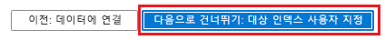

# Azure Search 인덱서를 사용 하 여 Cosmos DB를 인덱싱하는 방법

이 문서에서는 Azure Cosmos DB를 구성 하는 방법을 보여 줍니다 [인덱서](search-indexer-overview.md) 콘텐츠를 추출 하 여 Azure Search에서 가능 합니다. 이 워크플로 Azure Search 인덱스를 만들고 Azure Cosmos DB에서 추출 하는 기존 텍스트를 사용 하 여 로드 합니다. 

용어는 혼동 될 수 있습니다, 되므로 주목할 [Azure Cosmos DB 인덱싱](https://docs.microsoft.com/azure/cosmos-db/index-overview) 하 고 [Azure Search 인덱싱](search-what-is-an-index.md) 은 전혀 다른 작업에서 각 서비스에 고유 합니다. Azure Search를 시작 하기 전에 인덱싱 Azure Cosmos DB 데이터베이스에 이미 존재 하며 데이터를 포함 합니다.

사용할 수는 [포털](#cosmos-indexer-portal), REST Api 또는.NET SDK Cosmos 콘텐츠를 인덱싱합니다. Cosmos DB 인덱서 Azure Search에서 크롤링할 수 있는 [Azure Cosmos 항목](https://docs.microsoft.com/azure/cosmos-db/databases-containers-items#azure-cosmos-items) 이러한 프로토콜을 통해 액세스 합니다.

* [SQL API](https://docs.microsoft.com/azure/cosmos-db/sql-api-query-reference) 
* [MongoDB API](https://docs.microsoft.com/azure/cosmos-db/mongodb-introduction) (Azure Search이이 API에 대 한 지원은 공개 미리 보기)  

> [!Note]
> 사용자 의견에 기존 항목 추가 API 지원이 있습니다. 원하는 보려는 Azure Search에서 지원 되는 Cosmos Api에 대 한 투표를 캐스팅할 수 있습니다. [Table API](https://feedback.azure.com/forums/263029-azure-search/suggestions/32759746-azure-search-should-be-able-to-index-cosmos-db-tab)하십시오 [Graph API](https://feedback.azure.com/forums/263029-azure-search/suggestions/13285011-add-graph-databases-to-your-data-sources-eg-neo4), [Apache Cassandra API](https://feedback.azure.com/forums/263029-azure-search/suggestions/32857525-indexer-crawler-for-apache-cassandra-api-in-azu)합니다.
>

## 포털 사용

마법사를 사용 하는 가장 쉬운 방법은 Azure Cosmos 항목 인덱싱을 위해 합니다 [Azure portal](https://portal.azure.com/)합니다. 컨테이너에 대 한 메타 데이터를 읽고 데이터를 샘플링 하 여는 [ **데이터 가져오기** ](search-import-data-portal.md) Azure Search에서 마법사 수 기본 인덱스를 만들려면, 원본 필드를 대상 인덱스 필드에 매핑 및 단일에서 인덱스를 로드 작업입니다. 원본 데이터의 크기 및 복잡성에 따라 몇 분 안에 운영 작업에 대한 전체 텍스트 검색 인덱스를 사용할 수 있습니다.

Azure Search와 동일한 지역에서 Azure Cosmos DB에 대 한 동일한 Azure 구독을 사용 하는 것이 좋습니다.

### 1 - 원본 데이터 준비

SQL API 또는 MongoDB API 및 JSON 문서의 컨테이너에 매핑된 Azure Cosmos 데이터베이스를 하나의 Cosmos 계정에 있어야 합니다. 

Cosmos DB 데이터베이스에 데이터가 있는지 확인 합니다. 합니다 [데이터 가져오기 마법사](search-import-data-portal.md) 메타 데이터를 읽고 데이터 샘플링 수행 하지만 인덱스 스키마를 유추 하도 데이터 로드 Cosmos DB에서. 이 오류를 사용 하 여 마법사 중지 데이터가 누락 된 경우 "데이터 원본에서 검색 인덱스 스키마 오류: 작성할 수 없습니다. 프로토타입 인덱스를 데이터 원본 'emptycollection' 데이터가 없는 반환 하기 때문에 ".

### 2 - 데이터 가져오기 마법사 시작

할 수 있습니다 [마법사를 시작 합니다](search-import-data-portal.md) Azure Search 서비스 페이지에서 또는 클릭 하 여 명령 모음에서 **Azure Search 추가** 에 **설정** 저장소 계정 섹션의 왼쪽 탐색 창입니다.

   

### 3 - 데이터 원본 설정

> [!NOTE] 
> 만들거나 편집할 수 없습니다. 현재 **MongoDB** Azure portal 또는.NET SDK를 사용 하 여 데이터 원본입니다. 그러나 포털에서 MongoDB 인덱서의 실행 기록을 모니터링할 수 **있습니다**.

에 **데이터 원본** 페이지 여야 합니다 **Cosmos DB**, 다음 사양을 가진:

+ **이름** 데이터 원본 개체의 이름입니다. 를 만든 후에 다른 워크 로드에 대해 선택할 수 있습니다.

+ **Cosmos DB 계정** 사용 하 여 Cosmos DB에서 기본 또는 보조 연결 문자열을 사용 해야는 `AccountEndpoint` 및 `AccountKey`합니다. 계정은 데이터를 SQL API 또는 Mongo DB API로 캐스팅 된 여부를 결정합니다

+ **데이터베이스** 계정에서 기존 데이터베이스입니다. 

+ **컬렉션** 는 문서의 컨테이너입니다. 문서는 가져오기 성공 하기 위해에서 존재 해야 합니다. 

+ **쿼리** 비워 둘 수 모든 문서를 원한다 면이 고, 그렇지 입력할 수 있습니다 쿼리 문서 하위 집합을 선택 합니다. 

   

### 4 - 마법사에서 "인식 검색 추가" 페이지 건너뛰기

인식 기술 추가 문서 가져오기에 대 한 필요는 없습니다. 인덱싱 파이프라인에 [Cognitive Services API 및 변환을 포함](cognitive-search-concept-intro.md)할 구체적인 요구가 있지 않다면 이 단계는 건너뛰는 것이 좋습니다.

단계를 건너뛰는, 먼저 다음 페이지로 이동 합니다.

   

해당 페이지를 건너뛸 수 있습니다 인덱스 사용자 지정 합니다.

   

### 5 - 인덱스 특성 설정

**인덱스** 페이지에는 데이터 형식을 포함하는 필드 목록과 인덱스 특성을 설정하기 위한 여러 확인란이 표시됩니다. 마법사는 원본 데이터를 샘플링 하 여 메타 데이터에 따라 필드 목록을 생성할 수 있습니다. 

선택할 수 있습니다 대량-특성 특성 열의 맨 위에 있는 확인란을 클릭 하 여 합니다. 선택할 **조회 가능** 하 고 **검색 가능** 클라이언트 앱을 전체 텍스트 검색 처리에 따라 반환 되어야 하는 모든 필드에 대 한 합니다. 정수 전체 텍스트는 보면 또는 유사 항목 검색 가능 (숫자 정확 하 게 평가 및 필터에 유용한 경우가 많습니다.).

에 대 한 설명을 검토 [특성을 인덱싱](https://docs.microsoft.com/rest/api/searchservice/create-index#bkmk_indexAttrib) 하 고 [언어 분석기](https://docs.microsoft.com/rest/api/searchservice/language-support) 자세한 내용은 합니다. 

시간을 내서 선택 항목을 검토합니다. 마법사를 실행하면 실제 데이터 구조가 만들어지며, 모든 개체를 삭제했다가 다시 만들지 않으면 이러한 필드를 편집할 수 없습니다.

   

### 6 - 인덱서 만들기

완전히 지정된 마법사는 검색 서비스에서 세 개의 고유한 개체를 만듭니다. 데이터 원본 개체 및 인덱스 개체는 Azure Search 서비스에 명명된 리소스로 저장됩니다. 마지막 단계는 인덱서 개체를 만듭니다. 인덱서 이름을 지정하면 인덱서가 동일한 마법사 시퀀스에서 만든 인덱스 및 데이터 원본 개체와는 별도로 예약하고 관리할 수 있는 독립 실행형 리소스가 될 수 있습니다.

인덱서에 익숙하지 않은 경우 *인덱서*를 검색 가능 콘텐츠의 외부 데이터 원본을 탐색하는 Azure Search의 리소스로 간주할 수 있습니다. 출력을 **데이터 가져오기** 마법사는 인덱서, Cosmos DB 데이터 소스를 탐색 하 고, 검색 가능한 콘텐츠를 추출 하 고, Azure Search에서 인덱스를 가져옵니다.

다음 스크린샷은 기본 인덱서 구성 합니다. 전환할 수 있습니다 **한 번** 인덱서를 한 번 실행 하려는 경우. 클릭 **제출** 마법사를 실행 하 고 모든 개체를 만듭니다. 인덱싱이 즉시 시작됩니다.

   

포털 페이지에서 데이터 가져오기를 모니터링할 수 있습니다. 진행률 알림은 인덱싱 상태 및 업로드된 문서 수를 나타냅니다. 

인덱싱이 완료되면 [검색 탐색기](search-explorer.md)를 사용하여 인덱스를 쿼리할 수 있습니다.

> [!NOTE]
> 원하는 데이터가 표시 되지 않으면, 자세한 필드에 더 많은 특성을 설정 해야 합니다. 인덱스 및 인덱서만 생성 및 5 단계에서 인덱스 특성에 대 한 내용을 수정 다시 마법사를 통해 단계를 삭제 합니다. 

## REST API 사용

Azure Search에 있는 모든 인덱서에 공통를 세 부분으로 이루어진 워크플로 따르는 데이터를 인덱싱하도록 Azure Cosmos DB, REST API를 사용할 수 있습니다: 데이터 원본 만들기, 인덱스 만들기, 인덱서를 만듭니다. Cosmos 저장소에서 데이터 추출 인덱서 만들기 요청을 제출할 때 발생 합니다. 이 요청이 완료 되 면 인덱스를 쿼리 가능 해야 합니다. 

MongoDB를 평가 하는 경우에 데이터 원본을 만들려면 REST API를 사용 해야 합니다.

Cosmos DB 계정에서 모든 문서를 자동으로 인덱싱하도록 할지 여부를 선택할 수 있습니다. 기본적으로 모든 문서는 자동으로 인덱싱되지만 자동 인덱싱을 해제할 수도 있습니다. 인덱싱을 해제하면 자체 링크를 통해서나 문서 ID를 사용한 쿼리로만 문서에 액세스할 수 있습니다. Azure Search를 사용하려면 Azure Search로 인덱싱할 컬렉션에서 Cosmos DB 자동 인덱싱이 설정되어 있어야 합니다. 

> [!NOTE]
> Azure Cosmos DB는 DocumentDB의 다음 세대입니다. 제품 이름이 변경되었지만 Azure Search 인덱서의 `documentdb` 구문은 이전 버전과의 호환성을 위해 Azure Search API와 포털 페이지 둘 다에 계속 존재합니다. 인덱서를 구성할 때 이 문서에 설명된 대로 `documentdb` 구문을 지정해야 합니다.

### 1-요청에 대 한 입력을 조합 합니다.

각 요청에 대 한 서비스 이름 및 저장소 계정 이름과 (POST 헤더)에서 Azure Search에 대 한 관리자 키 및 blob storage에 대 한 키를 제공 해야 합니다. 사용할 수 있습니다 [Postman](search-fiddler.md) Azure Search에 HTTP 요청을 보내도록 합니다.

요청에 붙여 넣을 수 있도록 다음 네 가지 값을 메모장에 복사 합니다.

+ Azure 검색 서비스 이름
+ Azure Search 관리자 키
+ Cosmos DB 연결 문자열

포털에서 이러한 값을 찾을 수 있습니다.

1. Azure search 포털 페이지의 개요 페이지에서 검색 서비스 URL을 복사 합니다.

2. 왼쪽된 탐색 창에서 클릭 **키** 다음 중 하나는 기본 또는 보조 키 (동일)을 복사 합니다.

3. Cosmos 저장소 계정의 포털 페이지로 전환 합니다. 왼쪽된 탐색 창에서 아래 **설정을**, 클릭 **키**합니다. 두 개의 키 집합 및이 페이지 URI, 연결 문자열의 두 집합을 제공 합니다. 연결 문자열 중 하나를 메모장에 복사 합니다.

### 2-데이터 원본 만들기

**데이터 원본**은 인덱싱할 데이터, 자격 증명 및 데이터의 변경 사항 식별 정책(예: 컬렉션 내 수정 또는 삭제된 문서)을 지정합니다. 데이터 소스는 독립 리소스로 정의되므로 여러 인덱서에서 사용할 수 있습니다.

데이터 원본을 만들려면 POST 요청을 작성 합니다.

    POST https://[service name].search.windows.net/datasources?api-version=2017-11-11
    Content-Type: application/json
    api-key: [Search service admin key]

    {
        "name": "mydocdbdatasource",
        "type": "documentdb",
        "credentials": {
            "connectionString": "AccountEndpoint=https://myCosmosDbEndpoint.documents.azure.com;AccountKey=myCosmosDbAuthKey;Database=myCosmosDbDatabaseId"
        },
        "container": { "name": "myCollection", "query": null },
        "dataChangeDetectionPolicy": {
            "@odata.type": "#Microsoft.Azure.Search.HighWaterMarkChangeDetectionPolicy",
            "highWaterMarkColumnName": "_ts"
        }
    }

요청 본문에는 다음 필드를 포함해야 하는 데이터 소스 정의가 포함됩니다.

| 필드   | 설명 |
|---------|-------------|
| **name** | 필수 사항입니다. 데이터 원본 개체를 나타내는 데 모든 이름을 선택 합니다. |
|**type**| 필수 사항입니다. `documentdb`이어야 합니다. |
|**credentials** | 필수 사항입니다. Cosmos DB 연결 문자열 이어야 합니다. SQL 컬렉션에 대 한 연결 문자열이이 형식에 있습니다. `AccountEndpoint=<Cosmos DB endpoint url>;AccountKey=<Cosmos DB auth key>;Database=<Cosmos DB database id>` MongoDB 컬렉션에 대 한 추가 **ApiKind = MongoDb** 연결 문자열: `AccountEndpoint=<Cosmos DB endpoint url>;AccountKey=<Cosmos DB auth key>;Database=<Cosmos DB database id>;ApiKind=MongoDb` 엔드포인트 URL에는 포트 번호를 사용하지 않습니다. 포트 번호를 포함하는 경우 Azure Search는 Azure Cosmos DB 데이터베이스를 인덱싱할 수 없습니다.|
| **container** | 다음 요소가 포함 됩니다.  **name**: 필수 사항입니다. 인덱싱할 데이터베이스 컬렉션의 ID를 지정 합니다. **query**: 선택 사항입니다. 추상 JSON 문서를 Azure Search가 인덱싱할 수 있는 평면 스키마로 평면화하는 쿼리를 지정할 수 있습니다. MongoDB 컬렉션의 경우 쿼리가 지원되지 않습니다. |
| **dataChangeDetectionPolicy** | 권장됩니다. [변경된 문서 인덱싱](#DataChangeDetectionPolicy) 섹션을 참조하세요.|
|**dataDeletionDetectionPolicy** | 선택 사항입니다. [삭제된 문서 인덱싱](#DataDeletionDetectionPolicy) 섹션을 참조하세요.|

### 쿼리를 사용하여 인덱싱된 데이터 형성
중첩된 속성 또는 배열을 평면화하고, JSON 속성을 프로젝션하고, 인덱싱할 데이터를 필터링하는 SQL 쿼리를 지정할 수 있습니다. 

> [!WARNING]
> **MongoDB** 컬렉션에 대한 사용자 지정 쿼리는 지원되지 않습니다. `container.query` 매개 변수를 null로 설정하거나 생략해야 합니다. 사용자 지정 쿼리를 사용해야 하는 경우 [사용자 의견](https://feedback.azure.com/forums/263029-azure-search)에서 알려주세요.

예제 문서:

    {
        "userId": 10001,
        "contact": {
            "firstName": "andy",
            "lastName": "hoh"
        },
        "company": "microsoft",
        "tags": ["azure", "documentdb", "search"]
    }

필터 쿼리:

    SELECT * FROM c WHERE c.company = "microsoft" and c._ts >= @HighWaterMark ORDER BY c._ts

평면화 쿼리:

    SELECT c.id, c.userId, c.contact.firstName, c.contact.lastName, c.company, c._ts FROM c WHERE c._ts >= @HighWaterMark ORDER BY c._ts
    
    
프로젝션 쿼리:

    SELECT VALUE { "id":c.id, "Name":c.contact.firstName, "Company":c.company, "_ts":c._ts } FROM c WHERE c._ts >= @HighWaterMark ORDER BY c._ts

배열 평면화 쿼리:

    SELECT c.id, c.userId, tag, c._ts FROM c JOIN tag IN c.tags WHERE c._ts >= @HighWaterMark ORDER BY c._ts

### 3-대상 검색 인덱스 만들기 

[대상 Azure Search 인덱스를 만들](/rest/api/searchservice/create-index) 있습니다 아직 없는 경우. 다음 예제에서는 ID 및 설명 필드를 사용 하 여 인덱스를 만듭니다.

    POST https://[service name].search.windows.net/indexes?api-version=2017-11-11
    Content-Type: application/json
    api-key: [Search service admin key]

    {
       "name": "mysearchindex",
       "fields": [{
         "name": "id",
         "type": "Edm.String",
         "key": true,
         "searchable": false
       }, {
         "name": "description",
         "type": "Edm.String",
         "filterable": false,
         "sortable": false,
         "facetable": false,
         "suggestions": true
       }]
     }

대상 인덱스의 스키마가 소스 JSON 문서의 스키마 또는 사용자 지정 쿼리 프로젝션의 출력과 호환되는지 확인합니다.

> [!NOTE]
> 분할된 컬렉션의 경우, 기본 문서 키는 Azure Cosmos DB의 `_rid` 속성입니다. 필드 이름은 밑줄 문자로 시작할 수 없으므로 Azure Search에서 이름이 `rid`로 자동으로 바뀝니다. 또한 Azure Cosmos DB의 `_rid` 값은 Azure Search 키에 잘못된 문자를 포함합니다. 따라서 `_rid` 값은 Base64로 인코딩됩니다.
> 
> MongoDB 컬렉션의 경우 Azure Search에서 `_id` 속성의 이름이 `doc_id`로 자동으로 바뀝니다.  

### JSON 데이터 형식과 Azure Search 데이터 형식 사이의 매핑
| JSON 데이터 형식 | 호환되는 대상 인덱스 필드 형식 |
| --- | --- |
| Bool |Edm.Boolean, Edm.String |
| 정수와 같이 보이는 숫자 |Edm.Int32, Edm.Int64, Edm.String |
| 부동소수점처럼 보이는 숫자 |Edm.Double, Edm.String |
| String |Edm.String |
| 기본 형식의 배열, 예: ["a", "b", "c"] |Collection(Edm.String) |
| 날짜처럼 보이는 문자열 |Edm.DateTimeOffset, Edm.String |
| GeoJSON 개체(예: { “type”: “Point”, “coordinates”: [long, lat] } |Edm.GeographyPoint |
| 기타 JSON 개체 |N/A |

### 4-구성 및 인덱서를 실행 합니다.

인덱스와 데이터 원본이 만들어지면 인덱서를 만들 준비가 된 것입니다.

    POST https://[service name].search.windows.net/indexers?api-version=2017-11-11
    Content-Type: application/json
    api-key: [admin key]

    {
      "name" : "mydocdbindexer",
      "dataSourceName" : "mydocdbdatasource",
      "targetIndexName" : "mysearchindex",
      "schedule" : { "interval" : "PT2H" }
    }

이 인덱서는 2시간 간격으로 실행됩니다(일정 간격이 "PT2H"로 설정됨). 인덱서를 30분 간격으로 실행하려면 간격을 "PT30M"으로 설정합니다. 지원되는 가장 짧은 간격은 5분입니다. 일정은 선택 사항입니다. 생략하는 경우 인덱서는 만들어질 때 한 번만 실행됩니다. 그러나 언제든지 필요할 때 인덱서를 실행할 수 있습니다.   

인덱서 만들기 API에 대한 자세한 내용은 [인덱서 만들기](https://docs.microsoft.com/rest/api/searchservice/create-indexer)를 확인하세요.

## .NET 사용

.NET SDK는 REST API와 완전히 동일한 기능을 제공합니다. 개념, 워크플로 및 요구 사항을 알아보려면 이전 REST API 섹션을 검토하는 것이 좋습니다. 그런 후, 다음 .NET API 참조 설명서를 참조하여 관리되는 코드에서 JSON 인덱서를 구현할 수 있습니다.

+ [microsoft.azure.search.models.datasource](https://docs.microsoft.com/dotnet/api/microsoft.azure.search.models.datasource?view=azure-dotnet)
+ [microsoft.azure.search.models.datasourcetype](https://docs.microsoft.com/dotnet/api/microsoft.azure.search.models.datasourcetype?view=azure-dotnet) 
+ [microsoft.azure.search.models.index](https://docs.microsoft.com/dotnet/api/microsoft.azure.search.models.index?view=azure-dotnet) 
+ [microsoft.azure.search.models.indexer](https://docs.microsoft.com/dotnet/api/microsoft.azure.search.models.indexer?view=azure-dotnet)

## 변경된 문서 인덱싱

데이터 변경 감지 정책의 목적은 변경된 데이터 항목을 효율적으로 식별하는 것입니다. 현재 지원되는 정책은 Azure Cosmos DB에서 제공하는 `_ts`(타임스탬프) 속성을 사용하는 `High Water Mark` 정책뿐이며, 다음과 같이 지정됩니다.

    {
        "@odata.type" : "#Microsoft.Azure.Search.HighWaterMarkChangeDetectionPolicy",
        "highWaterMarkColumnName" : "_ts"
    }

적절한 인덱서 성능을 보장하기 위해서는 반드시 이 정책을 사용하는 것이 좋습니다. 

사용자 지정 쿼리를 사용하는 경우 `_ts` 속성이 쿼리에 의해 프로젝션되어야 합니다.

### 증분 진행률 및 사용자 지정 쿼리

인덱싱하는 동안 증분 진행률은 인덱서 실행이 일시적 오류 또는 실행 시간 제한에 의해 중단되었는지를 확인합니다. 인덱서는 처음부터 전체 컬렉션을 다시 인덱스하는 대신 다음으로 실행할 위치를 선택할 수 있습니다. 대규모 컬렉션을 인덱싱할 때 특히 유용합니다. 

사용자 지정 쿼리를 사용하는 경우 증분 진행률을 사용하려면 쿼리가 `_ts` 열을 기준으로 결과를 정렬해야 합니다. 그러면 Azure Search에서 사용하는 정기적 검사점이 오류가 있는 경우 증분 진행률을 제공할 수 있습니다.   

어떤 경우에는 쿼리에 `ORDER BY [collection alias]._ts` 절이 포함되더라도 Azure Search이 `_ts` 기준으로 쿼리를 정렬하는지 유추하지 않을 수 있습니다. Azure Search에서 결과가 `assumeOrderByHighWaterMarkColumn` 구성 속성을 사용하여 정렬되도록 지시할 수 있습니다. 이 힌트를 지정하려면 다음과 같이 인덱서를 만들거나 업데이트합니다. 

    {
     ... other indexer definition properties
     "parameters" : {
            "configuration" : { "assumeOrderByHighWaterMarkColumn" : true } }
    } 

## 삭제된 문서 인덱싱

컬렉션에서 행이 삭제된 경우 일반적으로 검색 인덱스에서도 해당 행을 삭제하려고 할 것입니다. 데이터 삭제 감지 정책의 목적은 변경된 데이터 항목을 효율적으로 식별하는 것입니다. 현재까지 지원되는 유일한 정책은 다음과 같이 지정되는 `Soft Delete` 정책입니다(삭제 시 일부 유형의 플래그로 표시됨).

    {
        "@odata.type" : "#Microsoft.Azure.Search.SoftDeleteColumnDeletionDetectionPolicy",
        "softDeleteColumnName" : "the property that specifies whether a document was deleted",
        "softDeleteMarkerValue" : "the value that identifies a document as deleted"
    }

사용자 지정 쿼리를 사용하는 경우 `softDeleteColumnName`에서 참조되는 속성이 쿼리에 의해 프로젝션됩니다.

다음 예제에서는 일시 삭제 정책을 사용하여 데이터 원본을 만듭니다.

    POST https://[service name].search.windows.net/datasources?api-version=2017-11-11
    Content-Type: application/json
    api-key: [Search service admin key]

    {
        "name": "mydocdbdatasource",
        "type": "documentdb",
        "credentials": {
            "connectionString": "AccountEndpoint=https://myDocDbEndpoint.documents.azure.com;AccountKey=myDocDbAuthKey;Database=myDocDbDatabaseId"
        },
        "container": { "name": "myDocDbCollectionId" },
        "dataChangeDetectionPolicy": {
            "@odata.type": "#Microsoft.Azure.Search.HighWaterMarkChangeDetectionPolicy",
            "highWaterMarkColumnName": "_ts"
        },
        "dataDeletionDetectionPolicy": {
            "@odata.type": "#Microsoft.Azure.Search.SoftDeleteColumnDeletionDetectionPolicy",
            "softDeleteColumnName": "isDeleted",
            "softDeleteMarkerValue": "true"
        }
    }

## 이 동영상 시청

약간 오래 된이 7 분짜리 비디오에서는 Azure Cosmos DB 프로그램 관리자 Andrew liu가 Azure Cosmos DB 컨테이너에 Azure Search 인덱스를 추가 하는 방법에 설명 합니다. 비디오에 표시 된 포털 페이지에는 오래 이지만 정보를 여전히 관련이 있습니다.

>[!VIDEO https://www.youtube.com/embed/OyoYu1Wzk4w]

## 다음 단계

축하합니다! 인덱서를 사용하여 Azure Search에 Azure Cosmos DB를 통합하는 방법을 알아보았습니다.

* Azure Cosmos DB에 대한 자세한 내용은 [Azure Cosmos DB 서비스 페이지](https://azure.microsoft.com/services/cosmos-db/)를 참조하세요.
* Azure Search에 대해 자세히 알아보려면 [Search 서비스 페이지](https://azure.microsoft.com/services/search/)를 참조하세요.
