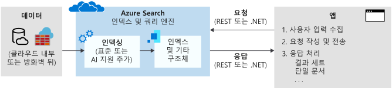

# Azure Cognitive Search란?

Azure Cognitive Search([이전의 “Azure Search”](whats-new.md#new-service-name))는 웹, 모바일 및 엔터프라이즈 애플리케이션의 프라이빗 이기종 콘텐츠에 대한 풍부한 검색 환경을 추가할 수 있는 API 및 도구를 개발자에게 제공하는 클라우드 검색 서비스입니다.

Cognitive Search 서비스를 만들면 인덱싱 및 쿼리 실행을 수행하는 엔진, 사용자가 만들고 관리하는 인덱스의 영구 스토리지, 단순 쿼리부터 복잡한 쿼리를 작성하기 위한 쿼리 언어를 활용할 수 있습니다. 필요에 따라 검색 서비스는 Azure 데이터 원본에서 데이터 수집/검색을 자동화하는 *인덱서*의 형태로 통합됩니다. 또한 이미지와 텍스트 분석과 같은 Cognitive Services의 소모성 AI 또는 Azure Machine Learning에서 생성하거나 Azure Functions 내부에서 래핑하는 사용자 지정 AI를 통합하는 *기술 세트*의 형태로도 통합됩니다.

구조적으로 검색 서비스는 인덱싱되지 않은 데이터를 포함하는 외부 데이터 저장소와 검색 인덱스에 쿼리 요청을 보내고 응답을 처리하는 클라이언트 앱 사이에 배치됩니다.  인덱스 스키마는 검색 가능한 콘텐츠의 구조를 결정합니다. 

검색 서비스의 두 가지 주요 워크로드는 *인덱싱* 및 *쿼리*입니다.

+ 인덱싱을 통해 검색 서비스에 텍스트를 가져오고 검색을 수행할 수 있습니다. 내부적으로 인바운드 텍스트는 토큰으로 처리되고 빠른 검색을 위해 반전된 인덱스에 저장됩니다. 인덱싱 중에는 사용자가 만든 Microsoft 또는 사용자 지정 기술에서 미리 정의된 *인식 기술*을 추가할 수도 있습니다. 이후 분석과 변환은 이전에 존재하지 않았던 새로운 정보 및 구조를 초래하여 많은 검색 및 지식 마이닝 시나리오에 대한 높은 효용을 제공합니다.

+ 인덱스가 검색 가능한 데이터로 채워지면 클라이언트 앱은 검색 서비스에 쿼리 요청을 보내고 응답을 처리합니다. 모든 쿼리 실행은 서비스에서 만들고 소유하고 저장하는 검색 인덱스를 통해 실행됩니다. 클라이언트 앱에서 검색 환경은 Azure Cognitive Search의 API를 사용하여 정의되며 관련성 튜닝, 자동 완성, 동의어 일치, 유사 일치, 패턴 일치, 필터 및 정렬을 포함할 수 있습니다.

기능은 정보 검색의 내재된 복잡성을 표시하는 간단한 [REST API](/rest/api/searchservice/) 또는 [.NET SDK](search-howto-dotnet-sdk.md)를 통해 표시됩니다. 또한 Azure Portal을 통해 인덱스와 기술 세트의 프로토타입 생성과 쿼리 수행을 위한 도구로 서비스 관리 및 컨텐츠 관리를 수행할 수 있습니다. 이 서비스는 클라우드에서 실행되므로 인프라 및 가용성은 Microsoft에서 관리합니다.

## Cognitive Search를 사용하는 경우

Azure Cognitive Search가 적합한 애플리케이션 시나리오는 다음과 같습니다.

+ 이기종 콘텐츠 형식을 프라이빗 사용자 정의 검색 인덱스로 통합합니다. 모든 원본에서 JSON 문서 스트림을 통해 검색 인덱스를 채울 수 있습니다. Azure에서 지원되는 원본은 *인덱서*를 사용하여 인덱싱을 자동화합니다. 인덱스 스키마 및 새로 고침 일정을 제어하는 것은 Cognitive Search를 사용하는 주된 이유입니다.

+ 검색 관련 기능을 쉽게 구현합니다. Search API는 쿼리 생성, 패싯 탐색, 필터(지리 공간 검색 포함), 동의어 매핑, 자동 완성 및 관련성 튜닝을 간소화합니다. 기본 제공 기능을 사용하면 상용 웹 검색 엔진과 비슷한 검색 환경에 대한 최종 사용자의 기대를 충족시킬 수 있습니다.

+ 원시 콘텐츠는 Azure Blob Storage 또는 Cosmos DB에 저장된 크고 구분되지 않는 텍스트, 이미지 파일 또는 애플리케이션 파일입니다. 인덱싱 중에 [인식 기술](cognitive-search-concept-intro.md)을 적용하여 텍스트를 식별 및 추출하거나, 구조를 만들거나, 번역된 텍스트 또는 엔터티와 같은 새 정보를 만들 수 있습니다.

+ 콘텐츠에는 언어 또는 사용자 지정 텍스트 분석이 필요합니다. 영어가 아닌 콘텐츠가 있는 경우 Azure Cognitive Search는 Lucene 분석기와 Microsoft의 자연어 프로세서를 모두 지원합니다. 또한 분음 부호 필터링이나 문자열의 패턴 인식 및 유지와 같은 원시 콘텐츠의 특수 처리를 수행하도록 분석기를 구성할 수도 있습니다.

특정 기능에 대한 자세한 내용은 [Azure Cognitive Search의 기능](search-features-list.md)을 참조하세요.

## Cognitive Search를 사용하는 방법

### 1단계: 서비스 프로비전

다른 구독자와 공유되는 [무료 서비스](search-create-service-portal.md)를 만들거나, 사용자 서비스에서만 사용하는 리소스를 전용으로 지정하는 [유료 계층](https://azure.microsoft.com/pricing/details/search/)을 만들 수 있습니다. 무료 서비스에서 모든 빠른 시작 및 자습서를 완료할 수 있습니다.

유료 계층의 경우 2차원으로 서비스를 확장하여 프로덕션 요구사항에 따라 리소스를 보정할 수 있습니다.

+ 복제본을 추가하여 과도한 쿼리 부하를 처리하도록 용량을 늘립니다.
+ 파티션을 추가하여 더 많은 문서를 위해 스토리지를 늘립니다.

### 2단계: 인덱스 만들기

데이터베이스의 필드와 마찬가지로, 매핑할 인덱스 스키마를 정의하여 검색하려는 문서의 구조를 반영합니다. 검색 인덱스는 빠른 쿼리 실행을 위해 최적화된 특수한 데이터 구조입니다.

[인덱스 스키마를 Azure Portal에서 만들거나](search-what-is-an-index.md), [.NET SDK](search-howto-dotnet-sdk.md) 또는 [REST API](/rest/api/searchservice/)를 사용하여 프로그래밍 방식으로 만드는 것이 일반적입니다.

> [!TIP]
> [빠른 시작: 데이터 가져오기 마법사](search-get-started-portal.md)를 시작하여 몇 분 안에 인덱스를 만들고 로드하고 쿼리하세요.

### 3단계: 데이터 로드

인덱스를 정의하고 나면 콘텐츠를 업로드할 준비가 된 것입니다. 밀어넣기 또는 끌어오기 모델을 사용할 수 있습니다.

밀어넣기 모델은 [SDK](search-howto-dotnet-sdk.md) 또는 [REST](/rest/api/searchservice/addupdate-or-delete-documents)의 API를 사용하여 JSON 문서를 인덱스로 “푸시”합니다. 외부 데이터 세트는 문서가 JSON인 경우에는 거의 모두 데이터 원본이 될 수 있습니다.

끌어오기 모델은 Azure의 원본에서 데이터를 “풀”하여 검색 인덱스에 보냅니다. 끌어오기 모델은 데이터에 연결, 데이터 읽기 및 데이터 직렬화 등의 데이터 수집 측면을 능률화하고 자동화하는 [*인덱서*](/rest/api/searchservice/Indexer-operations)를 통해 구현됩니다. 지원되는 데이터 원본에는 Azure Cosmos DB, Azure SQL 및 Azure Storage가 포함됩니다.

### 4단계: 쿼리 보내기 및 응답 처리

인덱스를 채운 후에 [REST API](/rest/api/searchservice/Search-Documents) 또는 [.NET SDK](/dotnet/api/microsoft.azure.search.idocumentsoperations)와 함께 간단한 HTTP 요청을 사용하여 서비스 엔드포인트에 [검색 쿼리를 실행](search-query-overview.md)할 수 있습니다.

[첫 번째 검색 앱 만들기](tutorial-csharp-create-first-app.md)를 통해 사용자 입력을 수집하고 결과를 처리하는 웹 페이지를 빌드한 다음, 확장합니다. [대화형 REST용 Postman](search-get-started-postman.md) 호출 또는 Azure Portal에서 기본 제공되는 [Search Explorer](search-explorer.md)를 사용하여 기존 인덱스를 쿼리할 수도 있습니다.

## 비교 결과

고객이 Azure Cognitive Search와 다른 검색 관련 솔루션을 비교하는 방법을 질문하는 경우가 많습니다. 다음 표에 주요 차이점이 요약되어 있습니다.

| 비교 대상 | 주요 차이점 |
|-------------|-----------------|
|Bing | [Bing Web Search API](../cognitive-services/bing-web-search/index.yml)는 Bing.com의 인덱스에서 일치하는 용어를 검색합니다. 인덱스는 HTML, XML 및 공개 사이트의 다른 웹 콘텐츠로 빌드됩니다. 동일한 기반의 [Bing Custom Search](/azure/cognitive-services/bing-custom-search/)는 개별 웹 사이트에 적용되는 웹 콘텐츠 유형에 대해 동일한 크롤러 기술을 제공합니다.  Azure Cognitive Search는 종종 다양한 원본에서 사용자가 정의하고 사용자 소유의 데이터와 문서로 채워진 인덱스를 검색합니다. Azure Cognitive Search는 [인덱서](search-indexer-overview.md)를 통해 일부 데이터 원본에 대한 크롤러 기능을 갖추고 있지만, 인덱스 스키마를 준수하는 모든 JSON 문서를 통합형 단일 검색 가능한 리소스로 푸시할 수 있습니다. |
|데이터베이스 검색 | 많은 데이터베이스 플랫폼에는 기본 제공 검색 환경이 있습니다. SQL Server에는 [전체 텍스트 검색](/sql/relational-databases/search/full-text-search) 환경이 있습니다. Cosmos DB 및 유사 기술에는 쿼리 가능한 인덱스가 있습니다. 검색 및 스토리지가 결합된 제품을 평가할 때는 어떤 방향으로 갈지 결정하기가 어려울 수 있습니다. 대부분의 솔루션은 둘 다 사용합니다. 즉, 스토리지에는 DBMS를 사용하고, 특수화된 검색 기능에는 Azure Cognitive Search를 사용합니다.  DBMS 검색과 비교하여, Azure Cognitive Search는 이기종 원본의 콘텐츠를 저장하고, 언어 인식 테스트 처리(형태소 분석, 분류 정리, 어형)와 같은 특수화된 텍스트 처리 기능을 [56개 언어](/rest/api/searchservice/language-support)로 제공합니다. 또한 오타 자동 교정, [동의어](/rest/api/searchservice/synonym-map-operations), [제안](/rest/api/searchservice/suggestions), [채점 컨트롤](/rest/api/searchservice/add-scoring-profiles-to-a-search-index), [패싯](./search-filters-facets.md) 및  [사용자 지정 토큰화](/rest/api/searchservice/custom-analyzers-in-azure-search)도 지원합니다. Azure Cognitive Search의 [전체 텍스트 검색 엔진](search-lucene-query-architecture.md)은 정보 검색 업계 표준인 Apache Lucene을 기반으로 합니다. Azure Cognitive Search는 데이터를 반전된 인덱스의 형태로 유지하지만 진정한 데이터 스토리지를 대체하지는 않으며 그러한 용량에서 사용하는 것은 권장되지 않습니다. 자세한 내용은 이 [포럼 게시물](https://stackoverflow.com/questions/40101159/can-azure-search-be-used-as-a-primary-database-for-some-data)을 참조하세요.   리소스 사용률도 이 범주의 또 다른 변곡점입니다. 인덱싱 및 일부 쿼리 작업은 계산 집약적인 경우가 많습니다. DBMS에서 클라우드의 전용 솔루션으로 검색을 오프로딩하면 트랜잭션 처리를 위한 시스템 리소스가 보존됩니다. 또한 검색 과정을 외부에서 진행하면 규모를 쿼리 볼륨에 맞게 쉽게 조정할 수 있습니다.|
|전용 검색 솔루션 | 광범위한 기능을 제공하는 전용 검색을 결정한 경우 온-프레미스 솔루션 또는 클라우드 서비스의 최종 범주 비교를 해야 합니다. 대다수의 검색 기술은 인덱싱 및 쿼리 파이프라인 제어, 풍부한 쿼리 및 필터링 구문에 대한 액세스, 순위 및 관련성 제어, 자체 주도형 및 지능형 검색 기능을 제공합니다.   클라우드 서비스는 최소한의 오버헤드 및 유지 관리, 규모 조정이 가능한 턴키 솔루션을 원하는 경우에 적합합니다.   클라우드 패러다임 내에서는 일부 공급자가 전체 텍스트 검색, 지리적 검색 및 특정 수준의 검색 입력 모호성을 처리하는 기능을 비롯하여 비슷한 기준 기능을 제공합니다. 일반적으로 이러한 기능은 [특수 기능](search-features-list.md) 또는 자동 맞춤을 결정하는 API, 도구 및 관리의 전반적인 편리성 및 간편성을 나타냅니다. |

주로 정보 검색 및 콘텐츠 탐색 모두에 대한 검색을 사용하는 앱의 경우 클라우드 공급자 중에서 Azure Cognitive Search는 Azure의 콘텐츠 저장소 및 데이터베이스에 대한 전체 텍스트 검색 워크로드에 가장 강력합니다. 

주요 장점은 다음과 같습니다.

+ 인덱싱 계층에서의 Azure 데이터 통합(크롤러)
+ 중앙 관리를 위한 Azure Portal
+ Azure 규모, 안정성 및 세계 수준의 가용성
+ 더 쉽게 검색할 수 있도록 AI에서 원시 데이터를 처리하여 이미지의 텍스트를 포함시키거나 비정형 콘텐츠에서 패턴을 찾을 수 있습니다.
+ 56개 언어로 안정적인 전체 텍스트 검색을 수행하기 위한 분석기를 사용한 언어 및 사용자 지정 분석
+ [검색 중심 앱에 공통적인 핵심 기능](search-features-list.md): 점수 매기기, 패싯, 제안, 동의어, 지리적 검색 기능 등

Azure Cognitive Search에서 가장 광범위한 기능을 활용할 수 있는 고객에게는 온라인 카탈로그, 기간 업무 프로그램 및 문서 검색 애플리케이션이 포함됩니다.

## 이 동영상 시청

15분 분량의 이 비디오에서 Luis Cabrera(프로그램 관리자)가 Azure Cognitive Search를 소개합니다.

>[!VIDEO https://www.youtube.com/embed/kOJU0YZodVk?version=3]