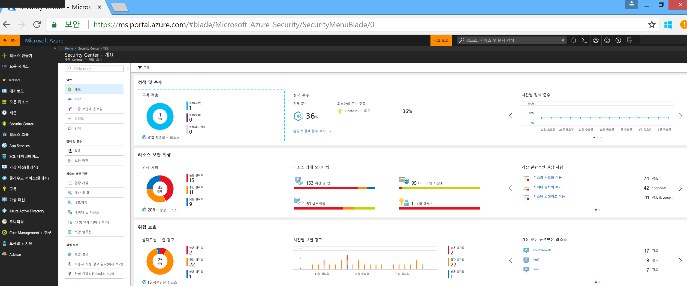
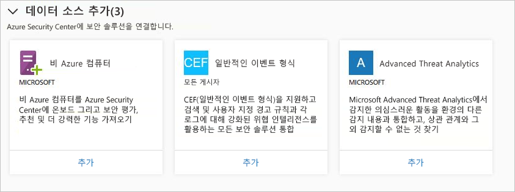
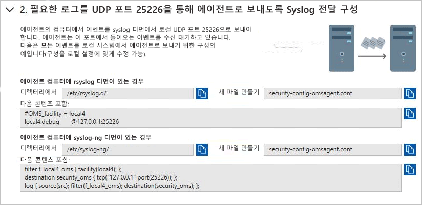
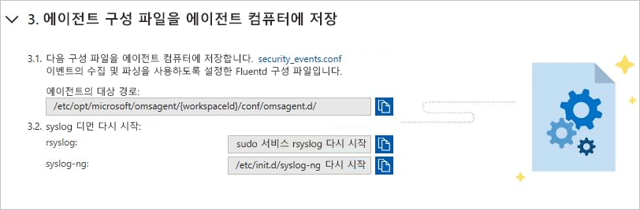
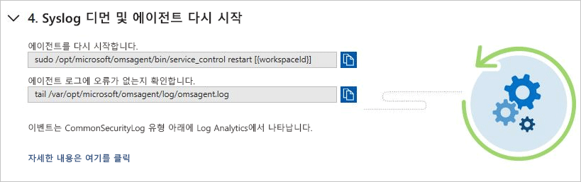

# 빠른 시작: Security Center에 보안 솔루션 연결

컴퓨터에서 보안 데이터를 수집하는 것 외에도 CEF(일반적인 이벤트 형식)를 지원하는 솔루션을 포함하여 다양한 다른 보안 솔루션의 보안 데이터를 통합할 수 있습니다. CEF는 Syslog 메시지를 기반으로 하는 업계 표준 형식으로, 많은 보안 공급업체에서 다양한 플랫폼 간에 이벤트를 통합하는 데 사용합니다.

이 빠른 시작에서는 다음을 수행하는 방법을 보여 줍니다.
- CEF 로그를 사용하여 보안 솔루션을 Security Center에 연결
- 보안 솔루션과의 연결 유효성 검사

## 필수 조건
Security Center를 시작하려면 Microsoft Azure에 대한 구독이 있어야 합니다. 구독이 없는 경우 [무료 계정](https://azure.microsoft.com/free/)으로 등록할 수 있습니다.

이 빠른 시작을 단계별로 실행하려면 Security Center의 표준 가격 책정 계층에 있어야 합니다. 처음 60일 동안 추가 비용 없이 Security Center 표준을 사용해 볼 수 있습니다. [Security Center 표준에 Azure 구독 온보딩](security-center-get-started.md) 빠른 시작을 통해 표준 계층으로 업그레이드하는 방법을 안내합니다.

또한 Security Center에 이미 연결된 Syslog 서비스가 있는 [Linux 컴퓨터](https://docs.microsoft.com/azure/log-analytics/log-analytics-agent-linux)가 필요합니다.

## CEF를 사용하여 솔루션 연결

1. [Azure 포털](https://azure.microsoft.com/features/azure-portal/)에 로그인합니다.
2. **Microsoft Azure** 메뉴에서 **Security Center**를 선택합니다. **Security Center - 개요**가 열립니다.

      

3. Security Center 주 메뉴 아래에서 **보안 솔루션**을 선택합니다.
4. Security Solutions 페이지에 있는 **데이터 원본(3) 추가**의 **일반적인 이벤트 형식** 아래에서 **추가**를 클릭합니다.

    

5. [일반적인 이벤트 형식 로그] 페이지에서 두 번째 단계, **필요한 로그를 UDP 포트 25226을 통해 에이전트로 보내도록 Syslog 전달 구성**을 펼치고, Linux 컴퓨터에서 아래 지침을 따릅니다.

    

6. 세 번째 단계, **에이전트 컴퓨터에 에이전트 구성 파일 배치**를 펼치고, Linux 컴퓨터에서 아래 지침을 따릅니다.

    

7. 네 번째 단계, **Syslog 디먼 및 에이전트 다시 시작**을 펼치고, Linux 컴퓨터에서 아래 지침을 따릅니다.

    

## 연결 유효성 검사

아래 단계를 진행하기 전에 syslog에서 Security Center에 보고하기 시작할 때까지 기다려야 합니다. 시간이 걸릴 수 있으며 환경의 크기에 따라 다릅니다.

1.  Security Center 대시보드의 왼쪽 창에서 **검색**을 클릭합니다.
2.  Syslog(Linux 컴퓨터)가 연결된 작업 영역을 선택합니다.
3.  *CommonSecurityLog*를 입력하고 **검색** 단추를 클릭합니다.

다음 예제에서는 이러한 단계의 결과를 보여 줍니다. 

## 리소스 정리
이 컬렉션의 다른 빠른 시작과 자습서는 이 빠른 시작을 기반으로 하여 작성됩니다. 이후의 빠른 시작과 자습서를 계속 사용하려면 표준 계층을 계속 실행하고 자동 프로비저닝을 설정된 상태로 유지합니다. 계속하지 않거나 체험 계층으로 되돌리려면 다음을 수행합니다.

1. Security Center 주 메뉴로 돌아가서 **보안 정책**을 선택합니다.
2. 체험 계층으로 되돌리려는 구독 또는 정책을 선택합니다. **보안 정책**이 열립니다.
3. **정책 구성 요소** 아래에서 **가격 책정 계층**을 선택합니다.
4. **체험**을 선택하여 표준 계층에서 체험 계층으로 구독을 변경합니다.
5. **저장**을 선택합니다.

자동 프로비저닝을 사용하지 않도록 설정하려면 다음을 수행합니다.

1. Security Center 주 메뉴로 돌아가서 **보안 정책**을 선택합니다.
2. 자동 프로비저닝을 사용하지 않도록 설정할 구독을 선택합니다.
3. **보안 정책 - 데이터 수집**에서 **온보딩** 아래의 **해제**를 선택하여 자동 프로비저닝을 사용하지 않도록 설정합니다.
4. **저장**을 선택합니다.

>[!NOTE]
> 자동 프로비저닝을 해제해도 Microsoft Monitoring Agent가 프로비전된 Azure VM에서 Agent가 제거되지는 않습니다. 자동 프로비저닝을 사용하지 않도록 설정하면 리소스에 대한 보안 모니터링이 제한됩니다.
>

## 다음 단계
이 빠른 시작에서는 CEF를 사용하여 Linux Syslog 솔루션을 Security Center에 연결하는 방법을 알아보았습니다. CEF 로그를 Security Center에 연결하면 각 로그에 대한 검색, 사용자 지정 경고 규칙 및 위협 인텔리전스 보강을 활용할 수 있습니다. Security Center를 사용하는 방법에 대한 자세한 내용은 보안 정책 구성 및 리소스 보안 평가를 위한 자습서로 계속 진행하세요.

> [!div class="nextstepaction"]
> [자습서: 보안 정책 정의 및 평가](./tutorial-security-policy.md)
