<properties
   pageTitle="Azure Security Center에서 유형별 보안 경고 | Microsoft Azure"
   description="이 문서를 통해 Azure Security Center에서 사용할 수 있는 보안 경고의 종류를 이해할 수 있습니다."
   services="security-center"
   documentationCenter="na"
   authors="YuriDio"
   manager="swadhwa"
   editor=""/>

<tags
   ms.service="security-center"
   ms.topic="hero-article"
   ms.devlang="na"
   ms.tgt_pltfrm="na"
   ms.workload="na"
   ms.date="09/20/2016"
   ms.author="yurid"/>

# Azure Security Center에서 유형별 보안 경고
이 문서를 통해 Azure Security Center에서 사용할 수 있는 다양한 유형의 보안 경고를 이해할 수 있습니다. 경고를 관리하는 방법에 대한 자세한 내용은 [Azure Security Center에서 보안 경고 관리 및 대응](security-center-managing-and-responding-alerts.md)을 참고하세요.

> [AZURE.NOTE] 고급 감지를 사용하도록 설정하려면 Azure 보안 센터 표준으로 업그레이드합니다. 무료 90일 평가판을 사용할 수 있습니다. 업그레이드하려면 [보안 정책](security-center-policies.md)에서 가격 책정 계층을 선택합니다. 자세한 내용은 [가격 책정 페이지](https://azure.microsoft.com/pricing/details/security-center/)를 참조하세요.

## 어떤 유형의 경고를 사용할 수 있습니까?
Azure Security Center는 사이버 kill 체인의 모든 단계에 맞는 다양한 경고를 제공합니다. 아래 그림에서는 이러한 단계 중 일부와 관련된 다양한 경고의 몇 가지 예를 제공합니다.

**대상 및 공격**

- 인바운드 RDP/SSH 공격
- 응용 프로그램 및 DDoS 공격(WAF 파트너)
- 침입 감지(NG Firewall 파트너)

**설치 및 악용**

- 알려진 맬웨어 서명(AM 파트너)
- 메모리 내 맬웨어 및 악용 시도
- 의심스러운 프로세스 실행
- 검색을 방지하는 회피적인 전략
- 수평 이동
- 내부 정찰
- 의심스러운 PowerShell 활동

**게시 위반**

- 알려진 악의적인 IP(데이터 탈출 또는 명령 및 컨트롤)에 대한 통신
- 손상된 리소스를 사용하여 추가 공격 탑재(RDP/SSH 무차별 암호 대입 공격 및 스팸을 스캔하는 아웃바운드 포트)

다른 종류의 공격은 각 단계와 연결되고 다른 하위 시스템을 대상으로 합니다. 이러한 단계에서 공격을 해결하려면 Security Center에는 세 가지 범주의 경고가 발생합니다.

- VMBA(가상 컴퓨터 동작 분석)
- 네트워크 분석
- 리소스 분석

## VMBA(가상 컴퓨터 동작 분석)

Azure Security Center는 동작 분석을 사용하여 가상 컴퓨터 이벤트 로그(예: 프로세스 만들기 이벤트, 로그인 이벤트 등)의 분석에 따라 손상된 리소스를 식별할 수 있습니다. 또한 광범위한 캠페인의 증거 지원을 확인하는 다른 신호와의 상관 관계가 있습니다.

> [AZURE.NOTE] 보안 센터 감지 기능이 작동하는 방법에 대한 자세한 내용은 [Azure 보안 센터 감지 기능](security-center-detection-capabilities.md)을 참고하세요.

### 충돌 분석

크래시 덤프 메모리 분석은 기존 보안 솔루션을 피할 수 있는 정교한 맬웨어를 감지하는 데 사용되는 방법입니다. 다양한 형식의 맬웨어는 디스크에 작성하지 않거나 디스크에 작성된 소프트웨어 구성 요소를 암호화하여 바이러스 백신 제품에서 탐지되지 않으려 합니다. 따라서 맬웨어는 기존 맬웨어 방지 방법을 사용하여 감지하기 어렵게 됩니다. 그러나 이러한 맬웨어가 작동하기 위해서는 메모리에 추적을 남겨야 하므로 메모리 분석을 사용하여 맬웨어를 감지할 수 있습니다.

소프트웨어가 충돌할 때 크래시 덤프는 충돌 시 메모리의 일부를 캡처합니다. 충돌은 맬웨어, 일반 응용 프로그램 또는 시스템 문제로 인해 발생할 수 있습니다. 크래시 덤프의 메모리를 분석하여 Security Center는 소프트웨어에서 취약점을 악용하고 기밀 데이터에 액세스하고 손상된 컴퓨터에서 은밀하게 유지하는 데 사용되는 기술을 감지할 수 있습니다. 분석이 Security Center 백 엔드에 의해 수행되므로 호스트에 대한 최소 성능에 영향을 주게 됩니다.

다음 필드는 아래에 나열된 크래시 덤프 분석 경고에 공통적으로 적용됩니다.

- DUMPFILE: 크래시 덤프 파일의 이름
- PROCESSNAME: 충돌하는 프로세스의 이름
- PROCESSVERSION: 충돌하는 프로세스의 버전

### Shellcode 검색

Shellcode는 맬웨어가 소프트웨어 취약점을 악용한 후에 실행되는 페이로드입니다. 이 경고는 크래시 덤프 분석이 악의적인 페이로드에서 일반적으로 수행하는 동작을 표시하는 실행 코드를 감지했음을 나타냅니다. 악의적이지 않은 소프트웨어가 이 동작을 수행할 수 있지만 보통 소프트웨어 개발 방법으로서는 일반적이지 않습니다.

이 경고는 다음과 같은 추가 필드를 제공합니다.

- ADDRESS: shellcode의 메모리에 있는 위치

이러한 유형의 경고 예제는 다음과 같습니다.

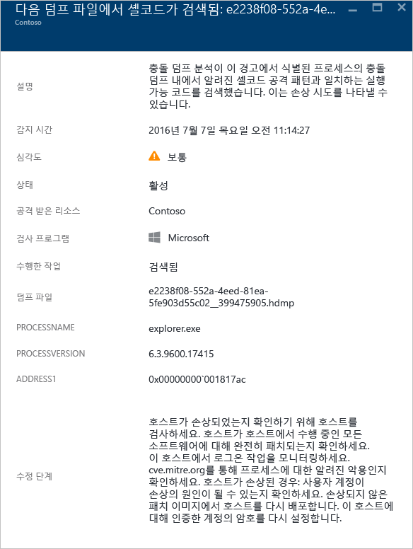

### 모듈 하이재킹 검색

Windows는 DLL(동적 링크 라이브러리)에 따라 소프트웨어가 일반적인 Windows 시스템 기능을 활용할 수 있도록 합니다. DLL 하이재킹은 맬웨어가 DLL 로드 순서를 변경시켜 악의적인 페이로드를 임의 코드를 실행할 수 있는 메모리에 로드할 때 발생합니다. 크래시 덤프 분석이 비슷한 이름의 모듈을 서로 다른 두 경로에서 로드한다는 것을 감지하면 이 경고가 발생하며 로드된 경로 중 하나는 Windows 시스템 이진 위치에서 비롯됩니다.

합법적인 소프트웨어 개발자는 종종 Windows OS 또는 Windows 응용 프로그램을 조율하거나 확장하는 등 악의적이지 않은 이유로 DLL 로드 순서를 변경합니다. DLL 로드 순서에 대한 악의적인 변경 내용과 잠재적으로 심각하지 않은 변경 내용을 구분하기 위해 Azure 보안 센터는 로드된 모듈이 의심스러운 프로필을 준수하는지를 확인합니다. 이 검사의 결과는 경고의 "서명" 필드에 의해 나타나고 경고, 경고 설명 및 경고 문제 해결 단계의 심각도에 반영됩니다. 파일 디지털 서명을 확인하거나 바이러스 백신 스캔을 실행하여 하이재킹 모듈의 온 디스크 복사본을 분석하면 하이재킹 모듈의 합법적인 또는 악의적인 특성에 대한 자세한 정보를 제공할 수 있습니다.

이 경고는 위의 "Shellcode 검색" 섹션에서 설명한 공통 필드 외에 다음과 같은 필드를 제공합니다.

- SIGNATURE: 하이재킹 모듈이 의심스러운 동작의 프로필을 준수한다는 표시
- HIJACKEDMODULE: 하이재킹된 Windows 시스템 모듈의 이름
- HIJACKEDMODULEPATH: 하이재킹된 Windows 시스템 모듈의 경로
- HIJACKINGMODULEPATH: 하이재킹된 모듈의 경로

이러한 유형의 경고 예제는 다음과 같습니다.

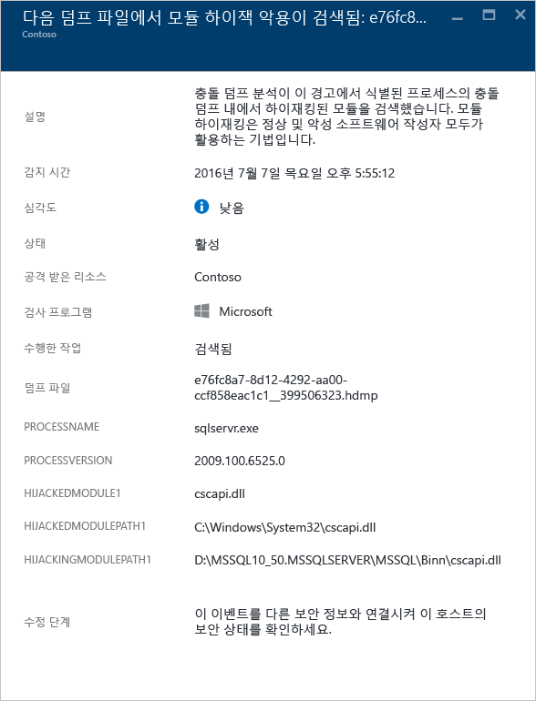

### 위장 Windows 모듈 감지

맬웨어는 시스템 관리자로부터 악성 소프트웨어의 특성을 "섞고" 가리기 위해 Windows 시스템 이진 파일(예: SVCHOST.EXE) 또는 모듈(예: NTDLL.DLL)의 일반적인 이름을 사용할 수 있습니다. 이 경고는 크래시 덤프 파일이 Windows 시스템 모듈 이름을 사용하는 모듈을 포함하지만 Windows 모듈의 일반적인 다른 조건을 만족하지 않는다는 점을 크래시 덤프 분석에서 감지했음을 나타냅니다. 위장 모듈의 온 디스크 복사본에 대해 분석하면 모듈의 합법적인 또는 악의적인 특성에 대한 자세한 정보를 제공할 수 있습니다. 분석은 다음을 포함할 수 있습니다.

- 문제의 파일이 합법적인 소프트웨어 패키지의 일부로 제공되고 있는지 확인합니다.
- 파일의 디지털 서명을 확인합니다.
- 파일에 바이러스 백신 검사를 실행합니다.

이 경고는 위의 "Shellcode 검색" 섹션에서 설명한 공통 필드 외에 다음과 같은 추가 필드를 제공합니다.

- DETAILS: 모듈 메타데이터가 유효한지와 모듈이 시스템 경로에서 로드 여부 설명
- NAME: 위장 Windows 모듈의 이름
- PATH: 위장 Windows 모듈의 경로

또한 이 경고는 "CHECKSUM" 및 "TIMESTAMP"와 같은 모듈의 PE 헤더에서 특정 필드를 추출하고 표시합니다. 이러한 필드는 모듈에 있는 경우에만 표시됩니다. 이러한 필드에 대한 자세한 내용은 [Microsoft PE 및 COFF 사양](https://msdn.microsoft.com/windows/hardware/gg463119.aspx)을 참조하세요.

이러한 유형의 경고 예제는 다음과 같습니다.

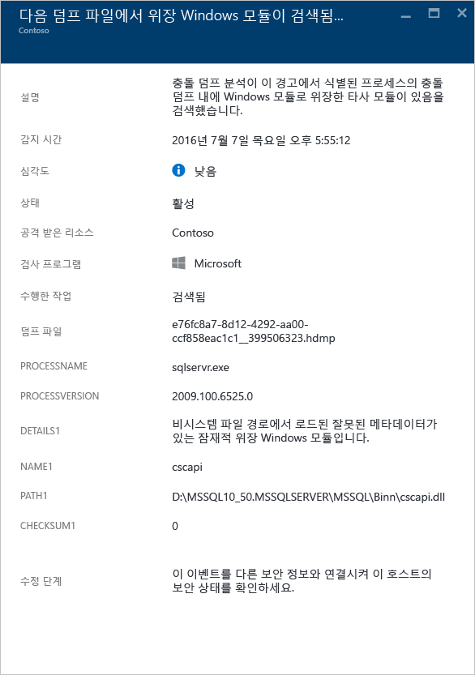

### 수정된 시스템 이진 파일 검색

맬웨어는 은밀하게 데이터에 액세스하거나 손상된 시스템 상에 몰래 지속되기 위해 핵심 시스템 이진 파일을 수정할 수 있습니다. 이 경고는 핵심 Windows OS 이진 파일이 메모리나 디스크에서 수정된 것을 크래시 덤프 분석에서 감지했음을 나타냅니다. 때때로 합법적인 소프트웨어 개발자는 Detours 등 응용 프로그램 호환성을 위해 악의적이지 않은 이유로 메모리에서 자유롭게 시스템 모듈을 수정합니다. 악의적인 모듈과 잠재적으로 합법적인 모듈을 구분하기 위해 Azure 보안 센터는 수정된 모듈이 의심스러운 프로필을 준수하는지를 확인합니다. 이 검사의 결과는 경고, 경고 설명 및 경고 문제 해결 단계의 심각도 별로 표시됩니다.

이 경고는 위의 "Shellcode 검색" 섹션에서 설명한 공통 필드 외에 다음과 같은 추가 필드를 제공합니다.

- MODULENAME: 수정된 시스템 이진 파일의 이름
- MODULEVERSION: 수정된 시스템 이진 파일의 버전

이러한 유형의 경고 예제는 다음과 같습니다.

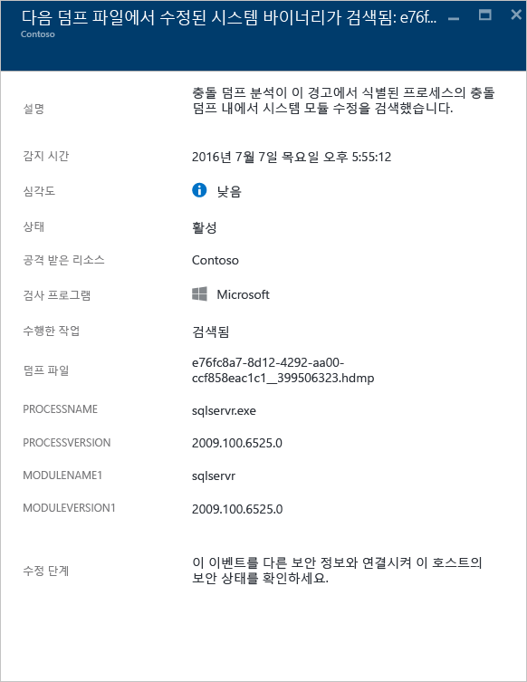

### 의심스러운 프로세스 실행

Security Center는 대상 가상 컴퓨터에서 실행되는 의심스러운 프로세스를 식별하고 경고를 트리거합니다. 감지는 특정 이름이 아닌 해당 매개 변수를 찾습니다. 따라서 공격자가 실행 파일의 이름을 다시 지정하더라도 Security Center에서 감지할 수 있습니다.
 
이러한 유형의 경고 예제는 다음과 같습니다.

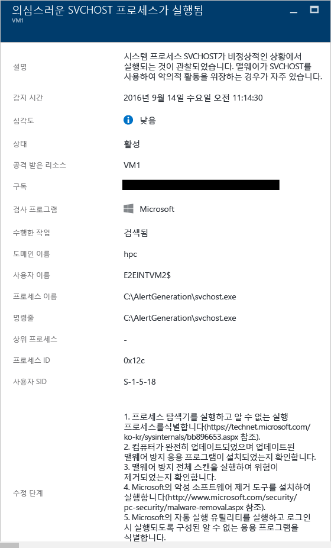

### 여러 도메인 계정 쿼리

Security Center는 도메인 계정을 쿼리하는 여러 시도를 감지할 수 있으며 이는 일반적으로 네트워크 정찰 중에 공격자에 의해 발생합니다. 공격자는 이 기술을 활용하여 사용자가 누구인지, 도메인 관리자 계정이 무엇인지, 어떤 컴퓨터가 도메인 컨트롤러이고 다른 도메인과 잠재적인 도메인 트러스트 관계가 있는지를 식별하는 도메인을 쿼리할 수 있습니다.

이러한 유형의 경고 예제는 다음과 같습니다.

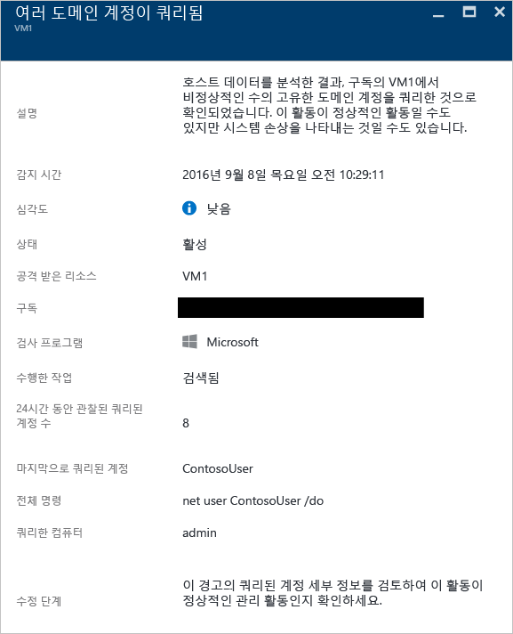

## 네트워크 분석

Security Center 네트워크 위협 감지는 Azure IPFIX(인터넷 프로토콜 흐름 정보 내보내기)에서 보안 정보를 자동으로 수집하여 작동합니다. 위협을 식별하도록 종종 여러 소스의 정보를 상호 연결하는 이 정보를 분석합니다.

### 의심스러운 나가는 트래픽 감지

다른 유형의 시스템과 거의 동일한 방법으로 네트워크 장치를 검색하고 프로파일링할 수 있습니다. 공격자는 일반적으로 포트 검색/포트 비우기를 시작합니다. 아래 예제에서는 외부 리소스에 대한 SSH 무차별 암호 대입(brute force) 또는 포트 비우기 공격을 수행할 수 있는 VM에서 의심스러운 SSH 트래픽이 발견됩니다.

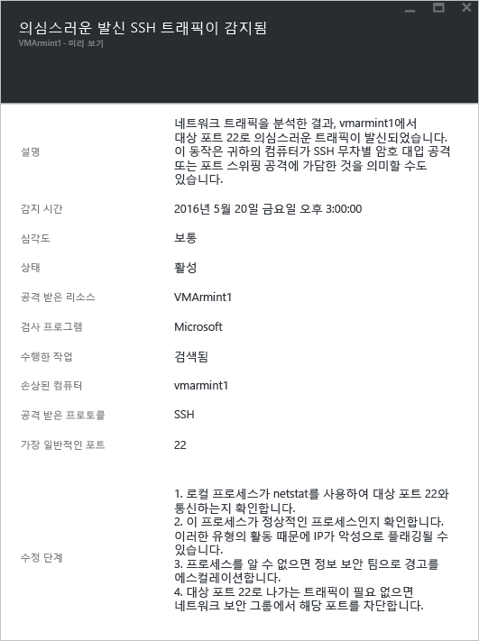

이 경고는 이 공격을 시작하는 데 사용된 리소스, 손상된 컴퓨터, 감지 시간, 프로토콜 및 사용된 포트를 식별할 수 있는 정보를 제공합니다. 이 블레이드는 이 문제를 완화하기 위해 사용할 수 있는 수정 단계 목록도 제공합니다.

### 악의적인 컴퓨터와 네트워크 통신

Azure 보안 센터는 많은 경우 명령 및 제어 센터에서 Microsoft 위협 인텔리전스 피드를 활용하여 악성 IP 주소와 통신하는 손상된 컴퓨터를 검색할 수 있습니다. 이 경우에 Azure 보안 센터는 Pony Loader 맬웨어([Fareit](https://www.microsoft.com/security/portal/threat/encyclopedia/entry.aspx?Name=PWS:Win32/Fareit.AF)라고도 함)를 사용하여 실행된 통신을 감지했습니다.

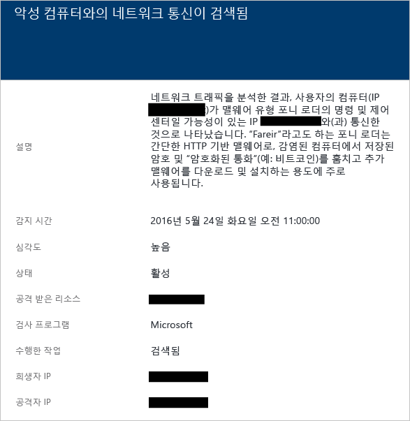

이 경고는 이 공격을 시작하는 데 사용된 리소스, 공격을 받는 리소스, 공격 대상 IP, 공격자 IP 및 감지 시간을 식별할 수 있는 정보를 제공합니다.

[AZURE.NOTE] 라이브 IP 주소는 개인 정보 보호 목적을 위해이 스크린샷에서 제거되었습니다.

### 가능한 발신 서비스 거부 공격 감지

하나의 가상 컴퓨터에서 시작된 비정상적인 네트워크 트래픽으로 인해 Security Center에서 잠재적 서비스 거부 유형의 공격을 트리거할 수 있습니다.
 
이러한 유형의 경고 예제는 다음과 같습니다.

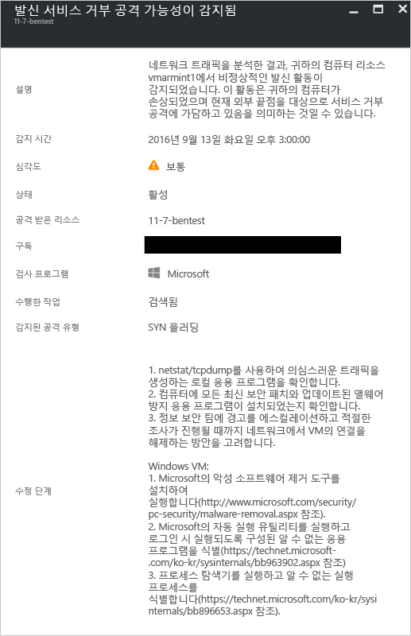

## 리소스 분석

Security Center 리소스 분석은 [Azure SQL DB 위협 요소 탐지](../sql-database/sql-database-threat-detection-get-started.md) 기능과의 통합과 같은 PaaS 서비스에 집중합니다. 이러한 영역에서 분석의 결과에 따라 Security Center는 리소스 관련 경고를 트리거합니다.

### 잠재적인 SQL 삽입

SQL 삽입은 구문 분석 및 실행을 위해 나중에 SQL Server의 인스턴스로 전달된 문자열에 악성 코드를 삽입한 공격입니다. SQL Server가 수신하는 모든 구문상 유효한 쿼리를 실행하기 때문에 SQL 문을 생성하는 모든 프로시저에 삽입 취약성이 있는지 검토해야 합니다. SQL 위협 요소 탐지는 기계 학습, 동작 분석 및 이상 탐지를 사용하여 Azure SQL Databases에서 발생할 수 있는 의심스러운 이벤트를 확인합니다. 예:

- 이전 직원이 데이터베이스 액세스 시도
- SQL 삽입 공격
- 집에 있는 사용자로부터 프로덕션 데이터베이스에 대한 비정상적인 액세스

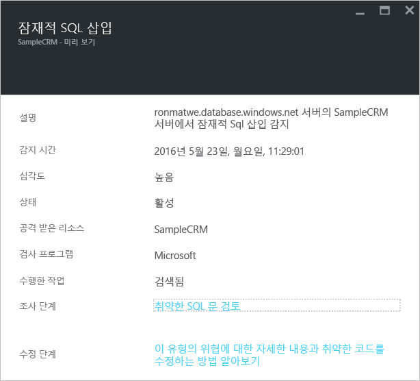

이 경고는 공격을 받는 리소스, 감지 시간, 공격의 상태를 식별할 수 있는 정보를 제공하고 또한 추가 조사 단계에 대한 링크를 제공합니다.

### SQL 삽입에 대한 취약점

SQL 삽입 공격에 발생할 수 있는 취약점을 나타낼 수 있는 데이터베이스에서 응용 프로그램 오류를 감지하는 경우 이 경고가 트리거됩니다.

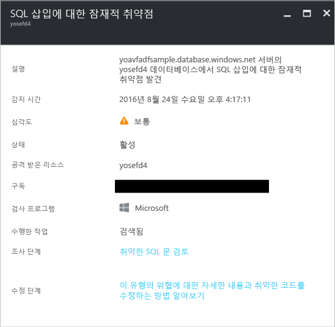

### 알 수 없는 위치에서 비정상적인 액세스

알 수 없는 IP 주소에서 액세스가 서버에서 감지된 경우 이 경고가 트리거될 수 있으며 이는 마지막 기간에서는 확인할 수 없습니다.

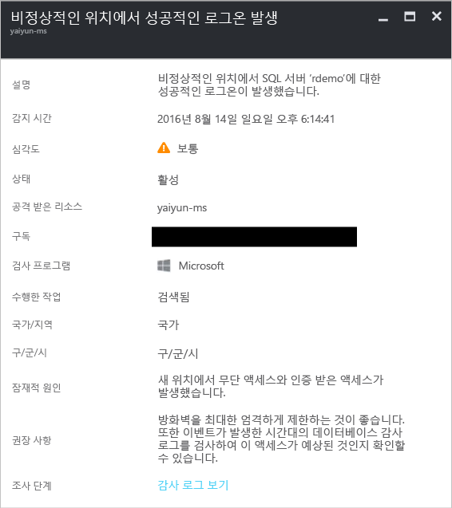

## 참고 항목

이 문서에서는 Security Center에서 발생하는 다양한 종류의 보안 경고에 대해 알아보았습니다. 보안 센터에 대한 자세한 내용은 다음을 참조하세요.

- [Azure 보안 센터에서 보안 인시던트 처리](security-center-incident.md)
- [Azure 보안 센터 감지 기능](security-center-detection-capabilities.md)
- [Azure 보안 센터 계획 및 작업 가이드](security-center-planning-and-operations-guide.md)
- [Azure 보안 센터 FAQ](security-center-faq.md) — 서비스 사용에 관한 질문과 대답 찾기
- [Azure 보안 블로그](http://blogs.msdn.com/b/azuresecurity/) — Azure 보안 및 규정 준수에 관한 블로그 게시물 찾기

<!---HONumber=AcomDC_0921_2016-->