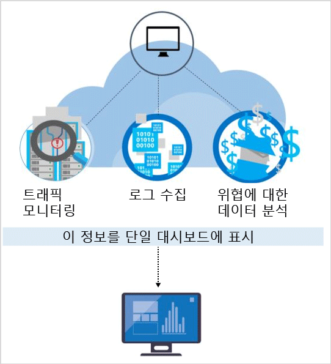

# Azure Security Center 감지 기능
이 문서에서는 Microsoft Azure 리소스(Windows 및 Linux 둘 다)를 대상으로 하는 활성 위협을 식별하도록 하고, 신속하게 응답하기 위한 인사이트를 제공하는 Azure Security Center의 고급 탐지 기능을 설명합니다.

고급 검색은 Azure Security Center의 표준 계층에서 제공됩니다. 평가판을 사용할 수 있습니다. [보안 정책](tutorial-security-policy.md)의 가격 책정 계층 선택에서 업그레이드할 수 있습니다. 가격 책정에 대한 자세한 내용은 [보안 센터 페이지](https://azure.microsoft.com/pricing/details/security-center/) 를 방문하세요.

## 오늘날의 위협에 대한 응답
지난 20년 동안 위협 환경에 중요한 변경 내용이 있었습니다. 과거에 회사는 일반적으로 "자신의 능력"을 확인하는 데 주로 관심이 있던 개별 공격자에 의한 웹 사이트 파손에 대해서만 걱정했습니다. 오늘날의 공격자는 훨씬 더 정교하며 조직적입니다. 특정 금융 및 전략적 목표가 있는 경우가 많습니다. 또한 국가 또는 조직 범죄로 자금 지원을 받으므로 더 많은 사용 가능한 리소스가 있습니다.

이 방법은 공격자 순위에서 이례적인 전문성 수준이 되었습니다. 공격자는 더 이상 웹 손상에 관심이 없습니다. 이제는 오픈 마켓에서 현금을 생성하거나 특정 비즈니스, 정치적 또는 군사 위치를 활용하는 데 사용할 수 있는 정보, 재무 계정 및 개인 데이터를 도용하는 데 관심이 있습니다. 재무 목표를 가진 공격자보다 더욱 걱정되는 것은 인프라 및 사용자에게 해를 입히기 위해 네트워크를 위반하는 공격자입니다.

이에 대한 응답으로 조직은 종종 알려진 공격 서명을 검색하여 엔터프라이즈 경계 또는 엔드포인트 방어에 집중하는 다양한 지점 솔루션을 배포합니다. 이러한 솔루션은 보안 분석가에게 심사 및 조사를 요구하는 대용량의 낮은 신뢰 경고를 생성하는 경향이 있습니다. 대부분의 조직은 이러한 경고에 응답하는 데 필요한 시간 및 전문 지식이 부족하므로 많은 경고가 해결되지 않습니다.  한편, 공격자는 많은 서명 기반 방어를 무너뜨리고 [클라우드 환경에 적응](https://azure.microsoft.com/blog/detecting-threats-with-azure-security-center/)하기 위해 메서드를 발전시켜 왔습니다. 새로운 위협 요소를 보다 신속하게 식별하고 감지 및 대응을 신속하게 처리하기 위해 새로운 접근 방식이 필요합니다.

## Azure Security Center가 위협을 감지하고 대응하는 방법
Microsoft 보안 연구원은 지속적으로 위협을 지켜보고 있습니다. 클라우드 및 온-프레미스에 존재하는 Microsoft의 글로벌 서비스에서 얻은 원격 분석의 포괄적인 집합에 액세스할 수 있습니다. 이 광범위하고 다양한 데이터 세트의 컬렉션을 통해 Microsoft는 온라인 서비스 뿐만 아니라 해당 온-프레미스 소비자 및 엔터프라이즈 제품에서도 새로운 공격 패턴 및 추세를 검색할 수 있습니다. 결과적으로 보안 센터는 공격자가 새롭고 더욱 정교한 악용을 릴리스하는 동안 신속하게 해당 감지 알고리즘을 업데이트할 수 있습니다. 이 방법을 통해 빠르게 움직이는 위협 환경을 지속적으로 관리할 수 있습니다.

보안 센터 위협 감지는 Azure 리소스, 네트워크 및 연결된 파트너 솔루션의 보안 정보를 자동으로 수집하여 작동합니다. 위협을 식별하도록 종종 여러 소스의 정보를 상호 연결하는 이 정보를 분석합니다. 보안 경고는 위협을 해결하는 방법에 대한 권장 사항과 함께 보안 센터에서 우선 순위가 지정됩니다.

보안 센터는 서명 기반 방식을 뛰어 넘는 고급 보안 분석을 사용합니다. 수동 접근 방법을 사용하고 공격의 발전을 예측하여 식별할 수 없는 위협을 감지하도록 전체 클라우드 패브릭에 대한 이벤트를 평가하는 데 빅 데이터 및 [기계 학습](https://azure.microsoft.com/blog/machine-learning-in-azure-security-center/) 기술의 돌파구를 활용합니다. 이러한 보안 분석은 다음과 같습니다.

* **통합된 위협 인텔리전스**: Microsoft 제품과 서비스, Microsoft DCU(Digital Crimes Unit), MSRC(Microsoft 보안 대응 센터) 및 외부 피드에서 글로벌 위협 인텔리전스를 활용하여 알려진 위험 인물을 찾습니다.
* **동작 분석**: 알려진 패턴을 적용하여 악의적인 동작을 검색합니다.
* **이상 감지**: 통계적 프로파일링을 사용하여 기록 기준을 작성합니다. 잠재적 공격 벡터를 준수하는 설정된 기준에서 편차에 대해 경고합니다.

### 위협 인텔리전스
Microsoft는 방대한 글로벌 위협 인텔리전스가 있습니다. 원격 분석은 Azure, Office 365, Microsoft CRM online, Microsoft Dynamics AX, outlook.com, MSN.com, Microsoft DCU(Digital Crimes Unit) 및 MSRC(Microsoft 보안 대응 센터)와 같은 여러 소스에서 이동합니다. 또한 연구원은 제 3자의 위협 인텔리전스 피드에 대해 주요 클라우드 서비스 공급자와 구독자 사이에서 공유되는 위협 인텔리전스 정보를 받습니다. Azure Security Center는 이 정보를 사용하여 알려진 부정 행위자의 위협을 경고할 수 있습니다. 일부 사례:

* **악의적인 IP 주소에 대한 아웃바운드 통신**: 알려진 봇 넷 또는 다크넷 가능성에 대한 아웃바운드 트래픽은 리소스가 손상되었으며 공격자가 해당 시스템에 대해 명령을 실행하고 데이터 탈취를 시도하는 것을 나타냅니다. Azure Security Center는 Microsoft의 글로벌 위협 데이터베이스에 대해 네트워크 트래픽을 비교하고 악의적인 IP 주소에 대한 통신을 감지하면 경고를 보냅니다.

## 동작 분석
동작 분석은 알려진 패턴의 컬렉션에 대해 데이터를 분석하고 비교하는 기술입니다. 그러나 이러한 패턴은 단순한 서명이 아닙니다. 대량 데이터 세트에 적용되는 복잡한 기계 학습 알고리즘을 통해 결정됩니다. 또한 전문 분석가가 악의적인 행동을 신중하게 분석하여 결정합니다. Azure Security Center는 동작 분석을 사용하여 가상 머신 로그, 가상 네트워크 디바이스 로그, 패브릭 로그, 크래시 덤프 및 기타 소스의 분석에 따라 손상된 리소스를 식별할 수 있습니다.

또한 광범위한 캠페인의 증거 지원을 확인하는 다른 신호와의 상관 관계가 있습니다. 이 상관 관계를 통해 설정된 손상 표시기와 일치하는 이벤트를 식별할 수 있습니다. 일부 사례:

* **의심스러운 프로세스 실행**: 공격자는 다양한 기술을 사용하여 탐지 없이 악성 소프트웨어를 실행합니다. 예를 들어 공격자는 적법한 시스템 파일과 같은 이름을 맬웨어에 지정할 수 있지만 이러한 파일을 대체 위치에 배치하고 무해한 파일과 매우 유사한 이름을 사용하거나 파일의 true 확장명을 가립니다. 보안 센터는 프로세스 동작을 모델링하고 이와 같은 이상값을 검색하는 프로세스 실행을 모니터링합니다.  
* **숨겨진 맬웨어 및 공격 시도**: 정교한 맬웨어는 디스크에 쓰지 않거나 디스크에 저장된 소프트웨어 구성 요소를 암호화하여 기존 맬웨어 방지 제품을 피할 수 있습니다.  그러나 이러한 맬웨어는 작동하기 위해 메모리에 추적을 남겨야 하므로 메모리 분석을 사용하여 검색될 수 있습니다. 소프트웨어가 충돌할 때 크래시 덤프는 충돌 시 메모리의 일부를 캡처합니다.  크래시 덤프의 메모리를 분석하여 Azure Security Center는 소프트웨어에서 취약점을 악용하고 기밀 데이터에 액세스하고 컴퓨터의 성능에 영향을 주지 않고 손상된 컴퓨터에서 은밀하게 유지하는 데 사용되는 기술을 감지할 수 있습니다.
* **수평 이동 및 내부 정찰**: 손상된 네트워크에서 유지하고 중요한 데이터를 찾거나 수집하기 위해 공격자는 종종 손상된 머신에서 동일한 네트워크 내의 다른 머신으로 수평 이동하려고 합니다. 보안 센터는 원격 명령 실행 네트워크 검색 및 계정 열거와 같은 네트워크 내의 공격자의 발판을 확장하려는 시도를 검색하기 위해 프로세스 및 로그인 활동을 모니터링합니다.
* **악의적인 PowerShell 스크립트**: 공격자는 PowerShell을 사용하여 다양한 목적으로 대상 가상 머신에 악성 코드를 실행합니다. 보안 센터는 의심스러운 활동의 증거에 대해 PowerShell 작업을 검사합니다.
* **외향적 공격**: 공격자는 종종 추가 공격을 탑재한 해당 리소스를 사용할 목표를 가지고 클라우드 리소스를 겨냥합니다. 예를 들어 다른 가상 머신에 무차별 대입 공격을 시작하고 스팸을 전송하거나 인터넷에서 오픈 포트 및 다른 디바이스를 검색하는 데 손상된 가상 머신을 사용할 수 있습니다. 보안 센터는 네트워크 트래픽에 기계 학습을 적용하여 아웃바운드 네트워크 통신이 표준을 초과하는 경우를 감지할 수 있습니다. 스팸의 경우 보안 센터도 또한 메일이 부정하거나 합법적인 이메일 캠페인의 결과인지 여부를 결정하기 위해 Office 365의 인텔리전스와 비정상적인 이메일 트래픽을 상호 연결합니다.  

### 이상 감지
Azure Security Center는 이상 감지를 사용하여 위협을 식별합니다. 동작 분석(큰 데이터 집합에서 파생된 알려진 패턴에 따라 결정)과 달리 이상 감지는 더욱 "개인화"되고 배포에만 적용되는 기준에 중점을 둡니다. 배포에 대한 정상적인 작동을 확인하기 위해 기계 학습이 적용되고 보안 이벤트를 표시할 수 있는 이상값 조건을 정의하는 규칙이 생성됩니다. 예를 들면 다음과 같습니다.

* **인바운드 RDP/SSH 무차별 대입 공격**: 배포에는 매일 로그인 사용량이 많은 가상 머신 및 로그인이 거의 없는 기타 가상 머신이 있을 수 있습니다. Azure Security Center는 이러한 가상 머신에 대한 기준 로그인 활동을 결정하고 기계 학습을 사용하여 정상적인 로그인 활동이 아닌 것을 정의할 수 있습니다. 로그인 수 또는 로그인 시간 또는 로그인이 요청되는 위치 또는 다른 로그인 관련 특성이 기준과 크게 다른 경우 경고가 생성될 수 있습니다. 다시, 기계 학습은 무엇이 중요한지를 결정합니다.

## 연속 위협 인텔리전스 모니터링
Azure Security Center는 위협 상황에서 변경 내용을 지속적으로 모니터링하는 보안 연구 및 데이터 과학 팀을 운영합니다. 다음 이니셔티브가 포함됩니다.

* **위협 인텔리전스 모니터링**: 위협 인텔리전스에는 기존 또는 새로운 위협에 대한 메커니즘, 표시기, 영향 및 조치 가능한 조언이 포함됩니다. 이 정보는 보안 커뮤니티에서 공유되고 Microsoft는 내부 및 외부 소스에서 위협 인텔리전스 피드를 지속적으로 모니터링합니다.
* **신호 공유**: Microsoft의 클라우드 및 온-프레미스 서비스, 서버 및 클라이언트 엔드포인트 디바이스의 광범위한 포트폴리오에 대한 보안 팀의 인사이트를 공유하고 분석합니다.
* **Microsoft 보안 전문가**: 법정 분석 및 웹 공격 탐지와 같은 전문 보안 분야에서 Microsoft 팀과 지속적인 관계를 유지하며 활동합니다.
* **탐지 튜닝**: 알고리즘은 실제 고객 데이터 세트에 대해 실행되며, 보안 연구원은 고객과 협력하여 결과의 유효성을 검사합니다. 기계 학습 알고리즘을 구체화하기 위해 참 및 거짓 긍정이 사용됩니다.

이러한 결합된 노력은 즉시 활용할 수 있는 새롭고 향상된 감지에 누적됩니다. 수행해야 할 작업이 없습니다.

## 참고 항목
이 문서에서는 Azure Security Center 감지 기능을 작동하는 방법을 살펴보았습니다. 보안 센터에 대한 자세한 내용은 다음을 참조하세요.

* [Azure Security Center 계획 및 작업 가이드](security-center-planning-and-operations-guide.md)
* [Azure Security Center에서 보안 경고 관리 및 대응](security-center-managing-and-responding-alerts.md)
* [Azure Security Center에서 유형별 보안 경고](security-center-alerts-type.md)
* [Azure Security Center에서 보안 상태 모니터링](security-center-monitoring.md) — Azure 리소스의 상태를 모니터링하는 방법을 알아봅니다.
* [Azure Security Center를 사용하여 파트너 솔루션 모니터링](security-center-partner-solutions.md) — 파트너 솔루션의 상태를 모니터링하는 방법을 알아봅니다.
* [Azure Security Center FAQ](security-center-faq.md) - 서비스 사용에 관한 질문과 대답을 찾습니다.
* [Azure 보안 블로그](https://blogs.msdn.com/b/azuresecurity/) - Azure 보안 및 규정 준수에 관한 블로그 게시물을 찾습니다.
