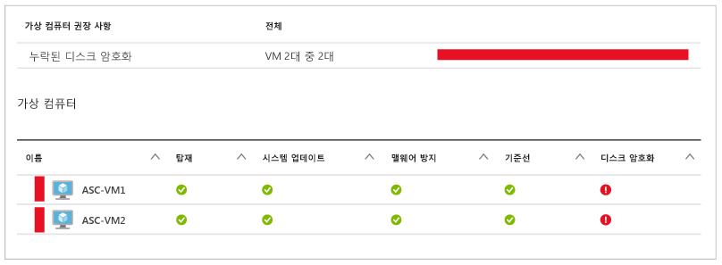
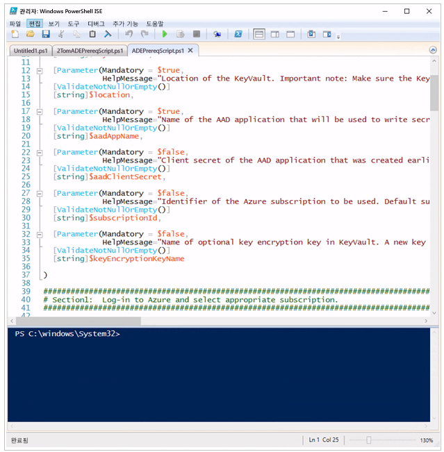
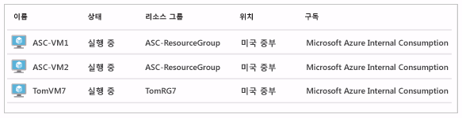
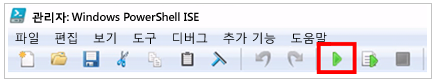
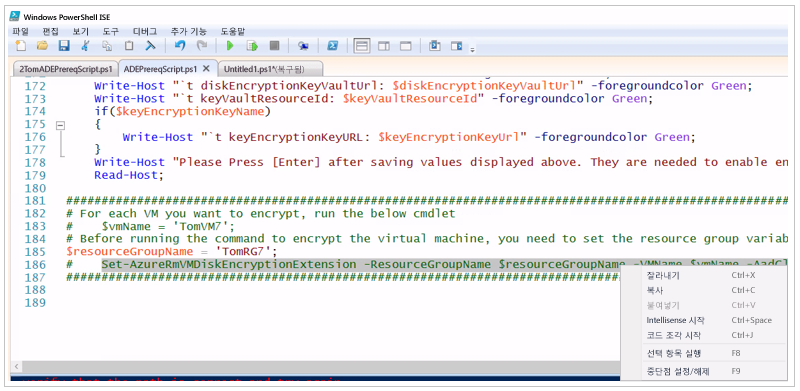
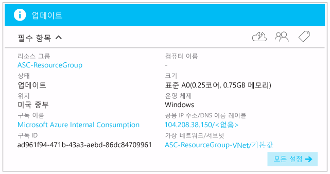
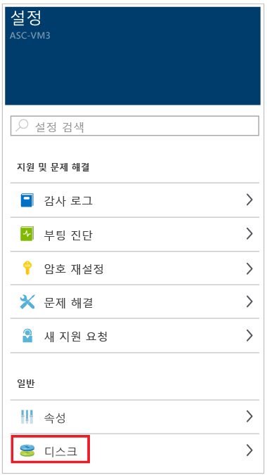
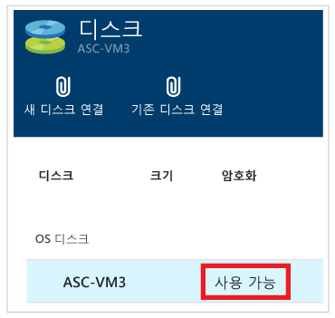

# Azure Virtual Machine 암호화
암호화되지 않은 가상 머신이 있는 경우 Azure Security Center에서 알려줍니다. 이러한 경고는 심각도 높다고 표시되며 이러한 가상 머신을 암호화하도록 권장합니다.

> [!NOTE]
> 이 문서의 정보는 키 암호화 키(Azure Backup을 사용하여 가상 머신을 백업하는 데 필요한)를 사용하지 않고 가상 머신을 암호화하는 데 적용됩니다. 키 암호화 키를 사용하여 암호화된 Azure Virtual Machines에 Azure Backup을 지원하는 방법은 [Windows 및 Linux Azure Virtual Machines를 위한 Azure Disk Encryption](https://docs.microsoft.com/azure/security/azure-security-disk-encryption) 문서를 참조하세요.
>
>

Azure Security Center에 의해 암호화가 필요하다고 식별된 Azure Virtual Machines를 암호화하려면 다음 단계를 권장합니다.

* Azure PowerShell을 설치하고 구성합니다. 이렇게 하면 Azure Virtual Machines를 암호화하는 데 필요한 필수 구성 요소를 설정하는 데 필요한 PowerShell 명령을 실행할 수 있습니다.
* Azure 디스크 암호화 필수 구성 요소 Azure PowerShell 스크립트를 가져오고 실행합니다.
* 가상 머신 암호화

이 문서의 목표는 Azure PowerShell에 대한 지식이 거의 없거나 전무한 경우 가상 머신을 암호화할 수 있도록 하는 것입니다.
이 문서에서는 Azure 디스크 암호화를 구성할 클라이언트 컴퓨터로 Windows 10을 사용하고 있다고 가정합니다.

필수 구성 요소를 설치하고 Azure Virtual Machines에 대한 암호화를 구성하는 데 사용될 수 있는 여러 가지 방법이 있습니다. 이미 Azure PowerShell 또는 Azure CLI에 대해 잘 알고 있다면 대체 방법을 사용하는 것을 선호할 수 있습니다.

> [!NOTE]
> Azure Virtual Machines에 암호화를 구성하는 다른 방법을 자세히 알아보려면 [Windows 및 Linux Azure Virtual Machines용 Azure 디스크 암호화](https://gallery.technet.microsoft.com/Azure-Disk-Encryption-for-a0018eb0)를 참조하세요.
>
>

## Azure PowerShell 설치 및 구성
Azure PowerShell 버전 1.2.1 이상이 컴퓨터에 설치되어야 합니다. [Azure PowerShell을 설치 및 구성하는 방법](/powershell/azure/overview) 문서는 Azure PowerShell로 작업할 컴퓨터를 프로비전하는 데 필요한 모든 단계를 포함합니다. 가장 간단한 방법은 해당 문서에 언급된 웹 PI 설치 접근 방식을 사용하는 것입니다. 이미 Azure PowerShell이 설치되었더라도 웹 PI 접근 방식을 사용하여 다시 설치하여 최신 버전의 Azure PowerShell을 사용합니다.

## Azure 디스크 암호화 필수 구성 요소 구성 스크립트 가져오기 및 실행
Azure 디스크 암호화 필수 구성 요소 구성 스크립트는 Azure Virtual Machines를 암호화하는 데 필요한 모든 필수 구성 요소를 설정합니다.

1. [Azure 디스크 암호화 필수 구성 요소 설치 스크립트](https://github.com/Azure/azure-powershell/blob/master/src/ResourceManager/Compute/Commands.Compute/Extension/AzureDiskEncryption/Scripts/AzureDiskEncryptionPreRequisiteSetup.ps1)가 있는 GitHub 페이지로 이동합니다.
2. GibHub 페이지에서 **원시** 단추를 클릭합니다.
3. **CTRL-A**를 사용하여 페이지에서 모든 텍스트를 선택한 다음 **CTRL-C**를 사용하여 페이지의 모든 텍스트를 클립보드에 복사합니다.
4. **메모장** 을 열고 복사한 텍스트를 메모장에 붙여넣습니다.
5. **AzureADEScript**라는 C: 드라이브에 새 폴더를 만듭니다.
6. 메모장 파일을 저장합니다. **파일**을 클릭한 다음 **이름으로 저장**을 클릭합니다. 파일 이름 텍스트 상자에 **"ADEPrereqScript.ps1"** 을 입력하고 **저장**을 클릭합니다. (이름을 따옴표로 묶지 않으면 .txt 파일 확장으로 파일을 저장합니다.)

스크립트 콘텐츠를 저장했으므로 PowerShell ISE에서 스크립트를 엽니다.

1. 시작 - Windows PowerShell ISE
2. 마우스 오른쪽 단추로 **Windows PowerShell ISE**를 클릭하고 **관리자 권한으로 실행**을 클릭합니다.
3. **관리자: Windows PowerShell ISE** 창에서 **보기**를 클릭하고 **스크립트 창 표시**를 클릭합니다.
4. 창의 오른쪽에 **명령** 창이 표시되면 창의 오른쪽 위 모퉁이에 있는 **"x"** 를 클릭하여 창을 닫습니다. 텍스트가 보기에 너무 작은 경우 **CTRL+추가** 를 사용합니다("추가"는 "+" 기호). 텍스트가 너무 크면 **CTRL+빼기** 를 사용합니다(빼기는 "-" 기호).
5. **파일**을 클릭한 후 **열기**를 클릭합니다. **C:\AzureADEScript** 폴더로 이동하여 **ADEPrereqScript**를 두 번 클릭합니다.
6. **ADEPrereqScript** 콘텐츠는 이제 PowerShell ISE에 표시되며 명령, 매개 변수 및 변수 등의 다양한 구성 요소를 보다 쉽게 볼 수 있도록 색으로 구분합니다.

아래 그림과 유사하게 표시됩니다.

위쪽 창은 "스크립트 창"이라고 하고 아래쪽 창은 "콘솔"이라고 합니다. 이 문서의 뒷부분에서 이러한 용어를 사용합니다.

## Azure Disk Encryption 필수 구성 요소 PowerShell 스크립트 실행
Azure Disk Encryption 필수 구성 요소 스크립트는 다음과 같은 매개 변수를 허용합니다. 

* **리소스 그룹 이름** - 키 자격 증명 모음을 배치하려는 리소스 그룹의 이름입니다.  입력한 이름을 가진 리소스 그룹이 없는 경우 해당 이름으로 새 리소스 그룹이 만들어집니다. 이 구독에서 사용하려는 리소스 그룹이 이미 있는 경우에 해당 리소스 그룹의 이름을 입력합니다.
* **키 자격 증명 모음 이름** - 암호화 키가 배치된 키 자격 증명 모음의 이름입니다. 이 이름을 가진 자격 증명 모음 키가 없는 경우 해당 이름을 가진 새 키 자격 증명 모음이 생성됩니다. 사용하려는 키 자격 증명 모음이 이미 있는 경우 기존 키 자격 증명 모음의 이름을 입력합니다.
* **위치** - 키 자격 증명 모음의 위치입니다. 암호화할 키 자격 증명 모음 및 VM이 동일한 위치에 있는지 확인합니다. 위치를 모르는 경우 이 문서의 뒷부분에 확인하는 방법을 보여주는 단계가 있습니다.
* **Azure Active Directory 응용 프로그램 이름** - 키 자격 증명 모음에 암호를 작성하는 데 사용되는 Azure Active Directory 응용 프로그램의 이름입니다. 이 이름을 가진 새 응용 프로그램이 없는 경우 생성됩니다. 사용하려는 Azure Active Directory 응용 프로그램이 이미 있는 경우 해당 Azure Active Directory 응용 프로그램의 이름을 입력합니다.

> [!NOTE]
> Azure Active Directory 응용 프로그램을 만들어야 하는 이유에 대해 관심이 있다면 *Azure Key Vault 시작* 문서에서 [Azure Active Directory로 응용 프로그램 등록](../key-vault/key-vault-get-started.md)섹션을 참조하세요.
>
>

다음 단계를 수행하여 Azure Virtual Machine을 암호화합니다.

1. PowerShell ISE를 닫은 경우 PowerShell ISE의 관리자 권한 인스턴스를 엽니다. PowerShell ISE가 아직 열리지 않은 경우 이 문서의 앞부분에 나오는 지침을 따릅니다. 스크립트를 닫은 경우 **파일** 및 **열기**를 클릭하고 **c:\AzureADEScript** 폴더에서 스크립트를 선택하여 **ADEPrereqScript.ps1**을 엽니다. 이 문서를 처음부터 수행한 경우 다음 단계로 이동합니다.
2. PowerShell ISE(PowerShell ISE의 아래쪽 창)의 콘솔에서 **cd c:\AzureADEScript**를 입력하여 중점을 스크립트의 로컬로 변경하고 **ENTER** 키를 누릅니다.
3. 스크립트를 실행할 수 있도록 컴퓨터에서 실행 정책을 설정합니다. 콘솔에서 **Set-ExecutionPolicy Unrestricted** 를 입력한 다음 ENTER 키를 누릅니다. 실행 정책에 대한 변경의 효과를 알리는 대화 상자가 나타나면 **모두 예** 또는 **예**를 클릭합니다(**모두 예**가 표시되면 해당 옵션을 선택하고 **모두 예**가 표시되지 않으면 **예**를 클릭).
4. Azure 계정에 로그인합니다. 콘솔에서 **Login-AzureRmAccount**를 입력하고 **ENTER** 키를 누릅니다. 자격 증명을 입력할 수 있는 대화 상자가 표시됩니다.(가상 머신을 변경할 수 있는 권한이 있는지 확인하고 권한이 없는 경우 암호화할 수 없습니다. 확실하지 않은 경우 구독 소유자 또는 관리자에게 문의합니다.) **환경**, **계정**, **TenantId**, **SubscriptionId** 및 **CurrentStorageAccount**에 대한 정보가 표시됩니다. **SubscriptionId**를 메모장에 복사합니다. #6단계에서 이를 사용해야 합니다.
5. 가상 머신이 속한 구독 및 해당 위치를 찾습니다. [https://portal.azure.com](ttps://portal.azure.com)으로 이동하고 로그인합니다.  페이지의 왼쪽에서 **Virtual Machines**를 클릭합니다. 가상 머신의 목록 및 가상 머신이 속한 구독이 표시됩니다.

   
6. PowerShell ISE로 돌아갑니다. 스크립트를 실행할 구독 컨텍스트를 설정합니다. 콘솔에서 **Select-AzureRmSubscription –SubscriptionId <your_subscription_Id>**(실제 구독 ID로 **< your_subscription_Id >** 대체)를 선택하고 **ENTER** 키를 누릅니다. 환경, **계정**, **TenantId**, **SubscriptionId** 및 **CurrentStorageAccount**에 대한 정보가 표시됩니다.
7. 명령 창 내에서 다음을 매개 변수로 전달하는 스크립트 명령을 실행합니다. 

   
8. **-resourceGroupName:** - 사용하려는 *리소스 그룹*의 이름을 입력합니다. 이름이 없는 경우 사용할 이름을 입력합니다. 사용하려는 *리소스 그룹* 이 이미 있는 경우(가상 머신이 위치한 리소스 그룹 등) 기존 리소스 그룹의 이름을 입력합니다.
9. **-keyVaultName:** - 사용하려는 *키 자격 증명 모음*의 이름을 입력합니다. 이름이 없는 경우 사용할 이름을 입력합니다. 사용하려는 키 자격 증명 모음이 이미 있는 경우 기존 *키 자격 증명 모음*의 이름을 입력합니다.
10. 스크립트는 **위치:** 를 요청합니다 - 암호화하려는 VM이 있는 위치의 이름을 입력한 다음 **ENTER** 키를 누릅니다. 위치를 기억하지 못하는 경우 #5단계로 돌아갑니다.
11. **aadAppName:** - 사용하려는 *Azure Active Directory* 응용 프로그램의 이름을 입력합니다. 이름이 없는 경우 사용할 이름을 입력합니다. 사용하려는 *Azure Active Directory 응용 프로그램*이 이미 있는 경우 기존 *Azure Active Directory 응용 프로그램*의 이름을 입력합니다.
12. 로그인 대화 상자가 표시됩니다. 자격 증명을 제공합니다.(예, 로그인했지만 지금 다시 해야 합니다)
13. 스크립트를 실행하고 작업을 완료하면 **aadClientID**, **aadClientSecret**, **diskEncryptionKeyVaultUrl** 및 **keyVaultResourceId**의 값을 복사하도록 요청합니다. 이러한 값을 각각 클립보드로 복사하고 메모장에 붙여 넣습니다.
14. PowerShell ISE로 돌아가서 마지막 줄의 끝에 커서를 놓고 **ENTER**키를 누릅니다.

스크립트의 출력이 아래 화면과 비슷해야 합니다.

## Azure 가상 머신 암호화
이제 가상 컴퓨터를 암호화할 준비가 되었습니다. 가상 머신이 주요 자격 증명 모음과 동일한 리소스 그룹에 있는 경우 암호화 단계 섹션으로 이동할 수 있습니다. 그러나 가상 컴퓨터가 사용자 키 자격 증명 모음과 동일한 리소스 그룹에 있지 않은 경우 PowerShell ISE의 콘솔에 다음을 입력해야 합니다.

**$resourceGroupName = <’Virtual_Machine_RG’>**

**< Virtual_Machine_RG >** 를 가상 머신이 포함된 작은 따옴표로 묶은 리소스 그룹의 이름으로 바꿉니다. **ENTER**키를 누릅니다.
올바른 리소스 그룹 이름을 입력했는지 확인하려면 PowerShell ISE 콘솔에서 다음을 입력합니다.

**$resourceGroupName**

**ENTER**키를 누릅니다. 가상 머신이 있는 리소스 그룹의 이름이 표시되어야 합니다. 예: 

### 암호화 단계
먼저 암호화하려는 가상 머신의 이름을 PowerShell에 알려야 합니다. 콘솔에서 다음을 입력합니다.

**$vmName = <’your_vm_name’>**

**<’your_vm_name’>** 을 VM의 이름으로 바꾼 다음(이름이 작은 따옴표로 묶였는지 확인) **ENTER** 키를 누릅니다.

올바른 VM 이름을 입력했는지 확인하려면 다음을 입력합니다.

**$vmName**

**ENTER**키를 누릅니다. 암호화하려는 가상 머신의 이름이 표시되어야 합니다. 예: 

두 가지 방법으로 가상 머신의 모든 드라이브를 암호화하는 암호화 명령을 실행할 수 있습니다. 첫 번째 방법은 PowerShell ISE 콘솔에서 다음 명령을 입력하는 것입니다.

~~~
Set-AzureRmVMDiskEncryptionExtension -ResourceGroupName $resourceGroupName -VMName $vmName -AadClientID $aadClientID -AadClientSecret $aadClientSecret -DiskEncryptionKeyVaultUrl $diskEncryptionKeyVaultUrl -DiskEncryptionKeyVaultId $keyVaultResourceId -VolumeType All
~~~

이 명령 키를 입력한 후에 **ENTER**키를 누릅니다.

두 번째 방법은 스크립트 창(PowerShell ISE의 위쪽 창)에서 클릭하고 스크립트의 아래쪽으로 스크롤하는 것입니다. 위에 나열된 명령을 강조 표시한 다음 마우스 오른쪽 단추로 클릭하고 **선택 항목 실행**을 클릭하거나 키보드에서 **F8**을 누릅니다.

사용한 방법에 관계없이 작업을 완료하기 위해 10-15분 정도 걸린다는 사실을 알리는 대화 상자가 표시됩니다. **예**를 클릭합니다.

암호화 프로세스가 일어나는 동안 Azure Portal로 돌아가서 가상 머신의 상태를 확인합니다. 페이지의 왼쪽에서 **Virtual Machines**를 클릭한 다음 **Virtual Machines** 블레이드에서 암호화하고 있는 Virtual Machines의 이름을 클릭합니다. 표시된 블레이드에서 **상태**가 **업데이트 중**임을 알려줍니다. 암호화가 진행 중임을 보여줍니다.

PowerShell ISE로 돌아갑니다. 스크립트가 완료되면 아래 그림에 표시되는 사항을 확인합니다.

이제 Virtual Machines가 암호화되었음을 보여주기 위해 Azure Portal로 돌아가서 페이지의 왼쪽에 있는 **Virtual Machines**를 클릭합니다. 암호화한 가상 컴퓨터의 이름을 클릭합니다. **설정** 블레이드에서 **디스크**를 클릭합니다.

**디스크** 블레이드에서 **암호화**가 **사용**되었음을 확인합니다.

## 다음 단계
이 문서에서는 Azure Virtual Machine을 암호화하는 방법을 알아보았습니다. Azure Security Center에 대한 자세한 내용은 다음을 참조하세요.

* [Azure Security Center에서 보안 상태 모니터링](security-center-monitoring.md) – Azure 리소스의 상태를 모니터링하는 방법 알아보기
* [Azure Security Center에서 보안 경고 관리 및 대응](security-center-managing-and-responding-alerts.md) - 보안 경고를 관리하고 대응하는 방법 알아보기
* [Azure Security Center FAQ](security-center-faq.md) – 서비스 사용에 관한 질문과 대답 찾기
* [Azure 보안 블로그](http://blogs.msdn.com/b/azuresecurity/) – Azure 보안 및 규정 준수에 관한 블로그 게시물 찾기
