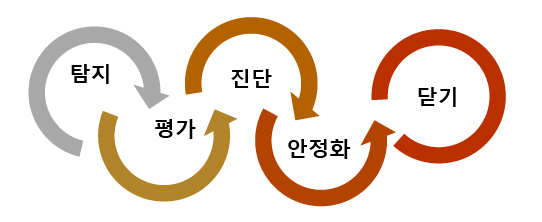
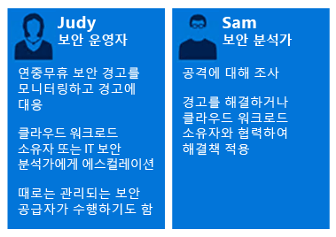
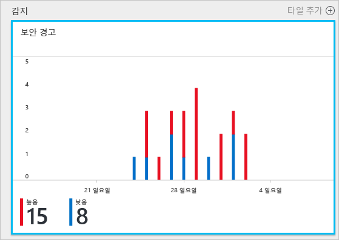
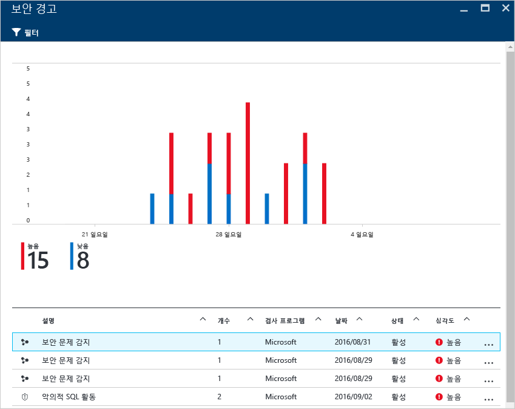
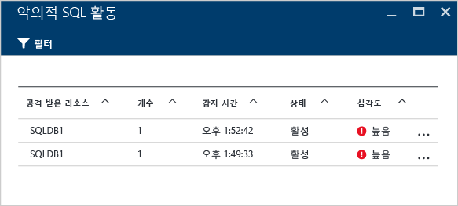
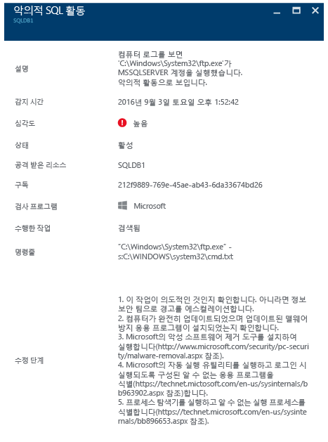

# 사고 대응에 Azure Security Center 사용
대부분의 조직은 공격을 받은 후에 보안 사고에 대응하는 방법을 알아봅니다. 비용과 손상을 줄이려면 공격이 발생하기 전에 사고 대응 계획을 적절히 수립하는 것이 중요합니다. Azure Security Center는 사고에 대응하는 여러 단계에서 사용할 수 있습니다.

## 사고 대응 계획 수립
효과적인 계획에는 세 가지 핵심 기능, 즉 위협에 대한 보호, 감지 및 대응이 필요합니다. 보호는 사고를 방지하는 것이고, 감지는 위협을 초기에 식별하는 것이며, 대응은 공격자를 제거하고 시스템을 복원하여 위반의 충격을 완화하는 것입니다.

다음 그림에서 보여 주듯이 이 문서에서는 [클라우드에서 Microsoft Azure 보안 대응](https://gallery.technet.microsoft.com/Azure-Security-Response-in-dd18c678) 문서에 나오는 보안 사고 대응 단계를 적용하고 있습니다.

감지, 평가 및 진단 단계에서 Security Center를 사용할 수 있습니다. 초기 사고 대응의 세 가지 단계에서 Security Center를 유용하게 사용할 수 있는 방식의 예는 다음과 같습니다.

* **감지**: 이벤트 조사의 첫 번째 표시를 검토합니다.
  * 예: Security Center 대시보드에 우선 순위가 높은 보안 경고를 제기한 초기 검증을 검토합니다.
* **평가**: 초기 평가를 수행하여 의심스러운 활동에 대한 자세한 정보를 가져옵니다.
  * 예: 보안 경고에 대한 자세한 정보를 가져옵니다.
* **진단**: 기술 조사를 수행하고 포함, 완화 및 해결 방법 전략을 식별합니다.
  * 예: 해당 특정 보안 경고에서 Security Center에 설명한 수정 단계를 따릅니다.

다음에 나오는 시나리오에서는 보안 사고의 감지, 평가 및 진단/대응 단계에서 Security Center를 활용하는 방법을 보여 줍니다. Security Center에서 [보안 사고](security-center-incident.md)는 리소스에 대해 [킬 체인(kill chain)](https://blogs.technet.microsoft.com/office365security/addressing-your-cxos-top-five-cloud-security-concerns/) 패턴과 일치하는 모든 경고의 집계입니다. 사고는 [보안 경고](security-center-managing-and-responding-alerts.md) 타일 및 블레이드에서 표시됩니다. 사고는 관련된 경고의 목록을 표시하며, 여기서 각 항목에 대한 자세한 정보를 얻을 수 있습니다. 또한 Security Center는 의심스러운 활동을 추적하는 데 사용할 수 있는 독립 실행형 보안 경고도 표시합니다.

## 시나리오
Contoso는 최근에 일부 가상 머신 기반 LOB(기간 업무) 워크로드 및 SQL 데이터베이스를 포함하여 온-프레미스 리소스 일부를 Azure에 마이그레이션했습니다. 현재 Contoso의 CSIRT(주요 컴퓨터 보안 사고 대응 팀)에는 현재의 사고 대응 도구와 통합되지 않는 보안 인텔리전스로 인해 보안 문제를 조사하는 데 문제가 있습니다. 부족한 조사로 인해 감지(너무 많은 가양성)뿐만 아니라 평가와 진단 단계에서도 문제가 발생하고 있습니다. 이 마이그레이션의 일부로 이 문제를 해결할 수 있도록 Security Center에 옵트인하기로 했습니다.

이 마이그레이션의 첫 번째 단계는 Security Center에서 모든 리소스를 등록하고 모든 보안 권장 사항을 해결한 후에 완료되었습니다. Contoso CSIRT는 컴퓨터 보안 사고를 처리하는 초점입니다. 팀은 보안 사고를 해결할 책임이 있는 사용자의 그룹으로 구성됩니다. 팀 구성원에게는 대응의 모든 영역을 다루어야 하는 의무가 명확하게 정의되었습니다.

이 시나리오의 목적상 Contoso CSIRT의 일부인 다음 가상 사용자의 역할에 집중하겠습니다.

Judy는 보안 운영 업무를 담당하고 있습니다. 그녀의 책임은 다음과 같습니다.

* 보안 위협에 대한 24시간 항시 모니터링 및 대응
* 클라우드 워크로드 소유자, 또는 필요한 경우 보안 분석가로 에스컬레이션

Sam은 보안 분석가이며 다음과 같은 업무를 담당합니다.

* 공격 조사
* 경고 수정
* 워크로드 소유자로 활동하여 완화 확인 및 적용

여기서 볼 수 있듯이 Judy와 Sam은 서로 다른 책임을 맡고 있지만 Security Center 정보를 공유해야 합니다.

## 권장된 솔루션
Judy와 Sam은 서로 다른 책임을 맡고 있지만 Security Center에서 별개의 영역을 사용하여 일상 작업 관련 정보를 획득할 수 있습니다. Judy는 매일 모니터링 작업의 일부로 **보안 경고**를 사용합니다.

Judy는 감지 및 평가 단계에서 보안 경고를 사용합니다. Judy가 초기 평가를 완료하면 추가 조사가 필요한 경우 Sam에게 문제를 에스컬레이션할 수 있습니다. 이 시점에서 Sam은 Security Center에서 제공한 정보를 사용하며, 때로는 다른 데이터 원본과 함께 진단 단계로 진행합니다.

## 이 솔루션을 구현하는 방법
사고 대응 시나리오에서 Azure Security Center를 사용하는 방법을 확인하려면 감지 및 평가 단계에서 Judy의 단계를 따라가고 문제를 진단하기 위해 Sam이 수행하는 작업을 참조하겠습니다.

### 감지 및 평가 사고 대응 단계
Judy는 Azure 포털에 로그인했으며 Security Center 콘솔을 사용하고 있습니다. 그녀는 매일 모니터링 작업의 일부로 다음 단계를 수행하여 우선 순위가 높은 보안 경고를 검토하기 시작합니다.

1. **보안 경고** 타일을 클릭하고 **보안 경고** 블레이드에 액세스합니다.
    

   > [!NOTE]
   > 이 시나리오의 목적상 Judy는 위 그림에서 보여 있듯이 악의적인 SQL 작업 경고에 대한 평가를 수행합니다.
   >
   >
2. **악성 SQL 작업** 경고를 클릭한 다음, **악성 SQL 작업** 블레이드:  에서 공격받은 리소스를 검토합니다.

    이 블레이드에서 Judy는 공격받은 리소스와 관련하여 공격이 발생한 빈도 및 감지된 시기를 기록할 수 있습니다.
3. **공격받은 리소스** 를 클릭하여 이 공격에 대한 자세한 정보를 얻을 수 있습니다.

설명을 읽은 후에 이것이 가양성이 아니며 Sam에게 이 경우를 에스컬레이션해야 한다는 점을 Judy는 확신하게 됩니다.

### 진단 사고 대응 단계
Sam은 Judy에게서 상황을 접수한 다음 Security Center에서 제안하는 수정 조치를 검토하기 시작합니다.

### 추가 리소스
SIEM(보안 정보 및 이벤트 관리) 솔루션을 사용하는 회사의 경우 조사 과정에서 [SIEM 솔루션과 Security Center를 통합](security-center-integrating-alerts-with-log-integration.md)할 수도 있습니다. Azure 감사 로그와 VM 보안 이벤트는 [Azure 로그 통합 도구](https://azure.microsoft.com/blog/introducing-hdinsight-integration-with-azure-log-analytics/)를 통해 통합할 수도 있습니다. 이 정보는 Security Center에서 제공하는 정보와 함께 공격을 조사하는 데 사용할 수 있습니다. Security Center의 [조사](https://docs.microsoft.com/azure/security-center/security-center-investigation) 기능을 사용하여 인시던트의 근본 원인을 확인할 수도 있습니다.

## 결론
사고가 발생하기 전에 팀을 구성하는 것은 조직에 매우 중요하며 사고를 다루는 방식에 긍정적인 영향을 주게 됩니다. 리소스를 모니터링하는 적합한 도구가 있다면 팀이 보안 사고를 수정하는 정확한 단계를 수행하는 데 도움이 됩니다. Security Center [감지 기능](security-center-detection-capabilities.md)은 IT를 지원하여 신속하게 보안 사고에 대응하고 보안 문제를 해결할 수 있습니다.
