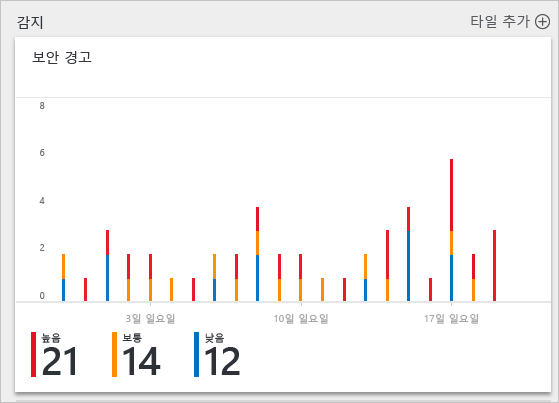
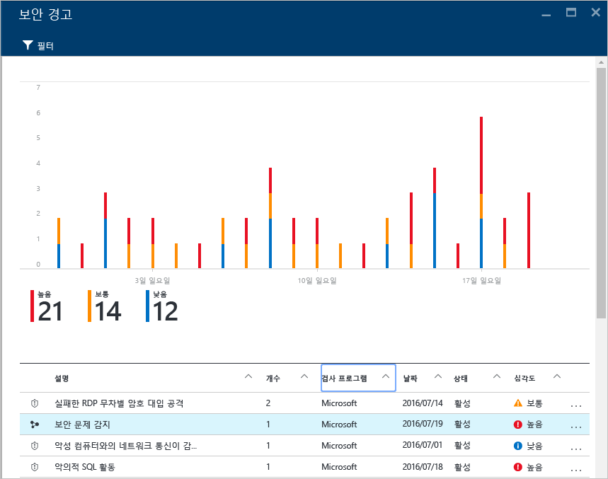
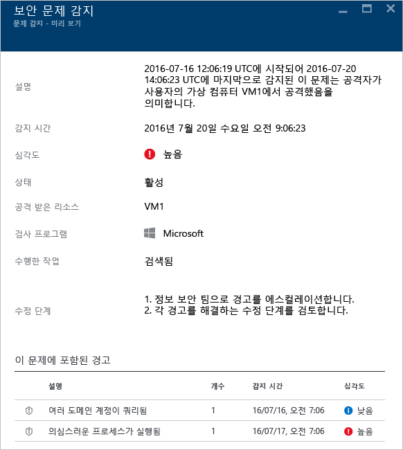
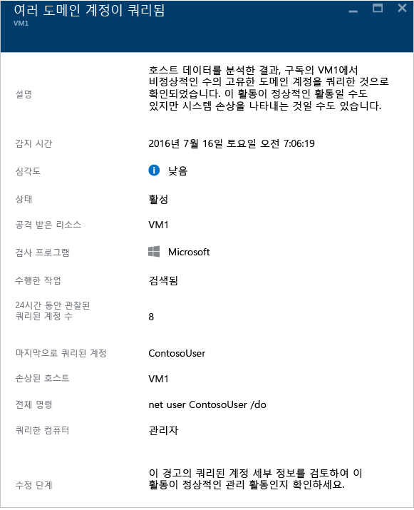

# Azure Security Center에서 보안 인시던트 처리
보안 경고를 심사 및 조사하는 작업은 가장 숙련된 보안 분석가라도 많은 시간이 걸릴 수 있고 분석가 중 다수는 어떻게 시작할지도 알지 못할 수 있습니다. 보안 센터에서는 고유한 [보안 경고](security-center-managing-and-responding-alerts.md) 간에 정보를 연결하기 위해 [분석](security-center-detection-capabilities.md)을 사용하여 공격 캠페인의 단일 보기 및 모든 관련된 경고를 제공할 수 있습니다. 공격자가 사용한 작업 및 영향을 받는 리소스를 신속하게 이해할 수 있습니다.

이 문서에서는 보안 센터에서 보안 경고 기능을 사용하여 보안 문제를 처리하는 데 도움이 되는 방법을 설명합니다.

## 보안 인시던트란?
보안 센터에서 보안 인시던트는 [kill 체인](https://blogs.technet.microsoft.com/office365security/addressing-your-cxos-top-five-cloud-security-concerns/) 패턴과 일치하는 리소스에 대한 모든 경고의 집계입니다. 인시던트는 [보안 경고](security-center-managing-and-responding-alerts.md) 타일 및 블레이드에 표시됩니다. 인시던트는 관련된 경고 목록을 표시하므로 각 항목에 대한 자세한 정보를 얻을 수 있습니다.

## 보안 인시던트 관리
보안 경고 타일을 확인하여 현재 보안 인시던트를 검토할 수 있습니다. Azure Portal에 액세스하고 다음 단계를 수행하여 각 보안 문제에 대 한 자세한 내용을 확인합니다.

1. 보안 센터 대시보드에서 **보안 경고** 타일을 봅니다.

    

2. 이 타일을 클릭하여 확장하고 보안 인시던트가 감지되면 아래에 표시된 대로 보안 경고 그래프에 표시됩니다.

    

3. 보안 인시던트 설명에 다른 경고와 다른 아이콘이 지정되어 있습니다. 클릭하여 이 인시던트에 대한 자세한 세부 정보를 봅니다.

    

4. 이 보안 인시던트에 대한 자세한 내용을 확인할 수 있는 **인시던트** 블레이드에는 인시던트의 전체 설명, 심각도(이 경우 높음), 인시던트의 현재 상태(이 경우 아직 *활성화*된 상태로, 이는 사용자가 해제 조치를 취하지 않았음을 의미하며, **보안 경고** 블레이드의 인시던트를 마우스 오른쪽 단추로 클릭하여 수행할 수 있음), 공격을 받은 리소스(이 경우에 *VM1*), 인시던트에 대한 해결 조치를 포함되어 있으며, 아래쪽 창에는 이 인시던트에 포함된 경고가 있습니다. 각 경고에 대한 자세한 정보를 가져오는 경우 클릭하면 아래와 같이 다른 블레이드가 열립니다.

    

이 블레이드의 정보는 경고에 따라 달라 집니다. 이러한 경고를 관리하는 방법에 대한 자세한 내용은 [Azure Security Center에서 보안 경고 관리 및 대응](security-center-managing-and-responding-alerts.md) 을 참고하세요. 이 기능에 대한 몇 가지 중요한 고려 사항은 다음과 같습니다.

* 새 필터를 사용하면 인시던트만, 경고만 또는 둘 다 보기를 사용자 지정할 수 있습니다.
* 인시던트가 있는 경우 동일한 경고가 인시던트의 일부로 존재할 뿐만 아니라 독립 실행형 경고로 표시될 수 있습니다.

## 참고 항목
이 문서에서는 보안 센터에서 보안 인시던트 기능을 사용하는 방법을 살펴보았습니다. 보안 센터에 대한 자세한 내용은 다음을 참조하세요.

* [Azure Security Center에서 보안 경고 관리 및 대응](security-center-managing-and-responding-alerts.md)
* [Azure Security Center 감지 기능](security-center-detection-capabilities.md)
* [Azure Security Center 계획 및 작업 가이드](security-center-planning-and-operations-guide.md)
* [Azure Security Center에서 보안 경고 관리 및 대응](security-center-managing-and-responding-alerts.md)
* [Azure Security Center FAQ](security-center-faq.md)--서비스 사용에 관한 질문과 대답을 찾습니다.
* [Azure 보안 블로그](https://blogs.msdn.com/b/azuresecurity/)--Azure 보안 및 규정 준수에 관한 블로그 게시물을 찾습니다.
