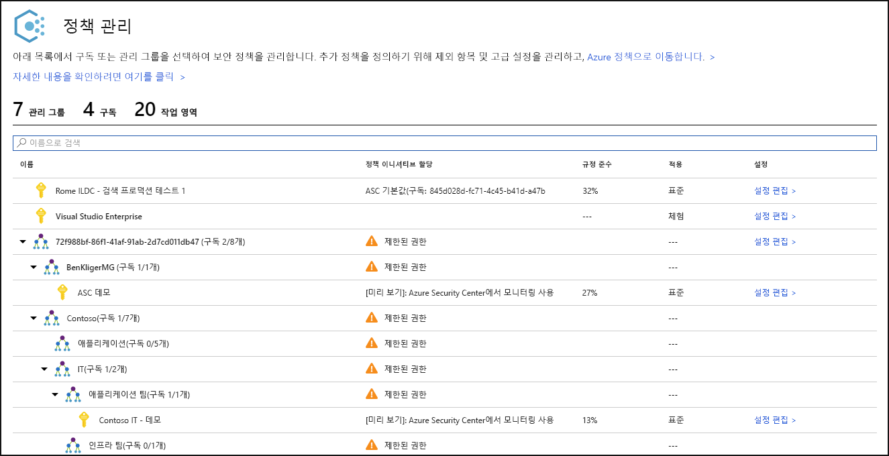
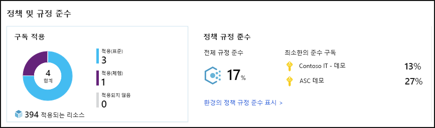
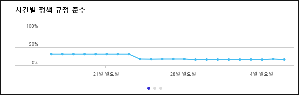
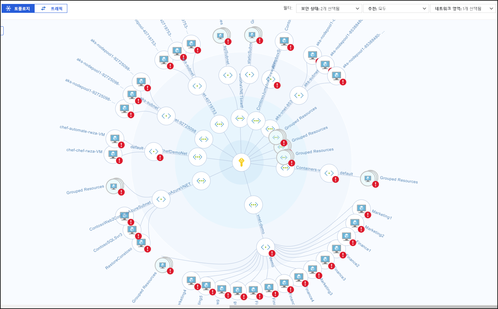
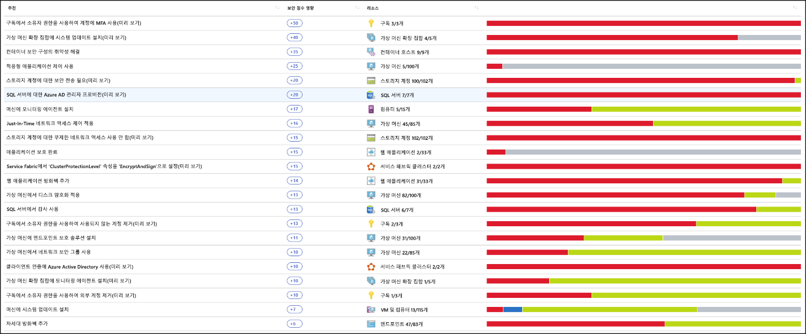
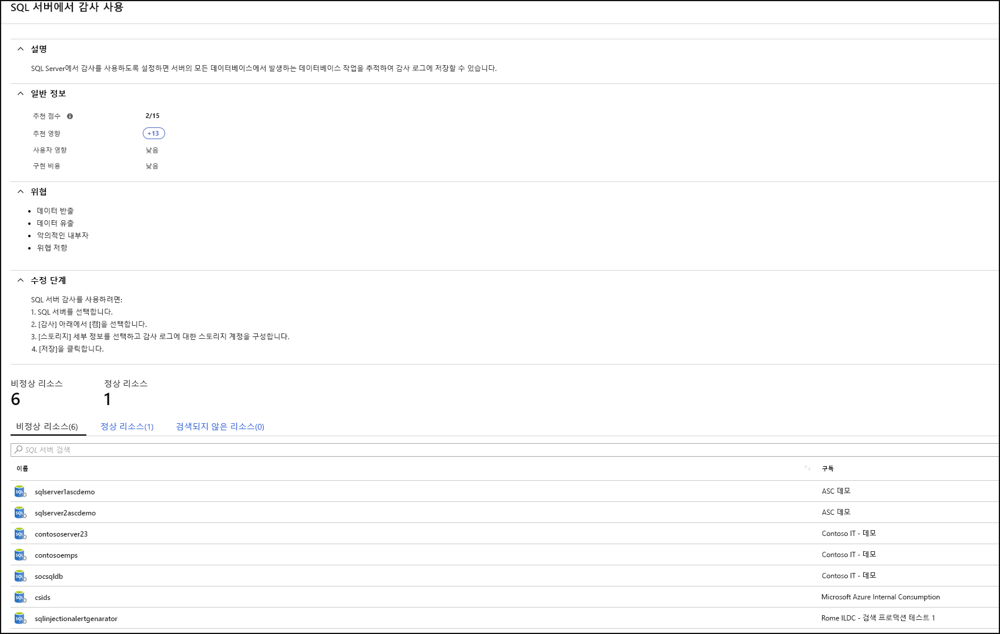
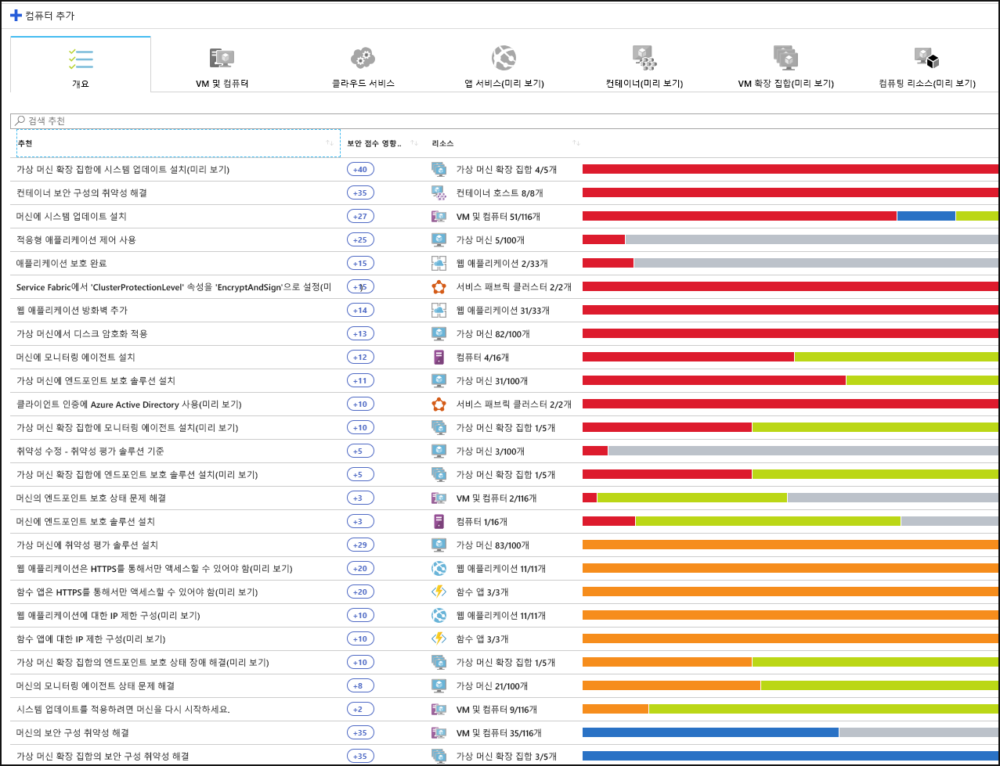
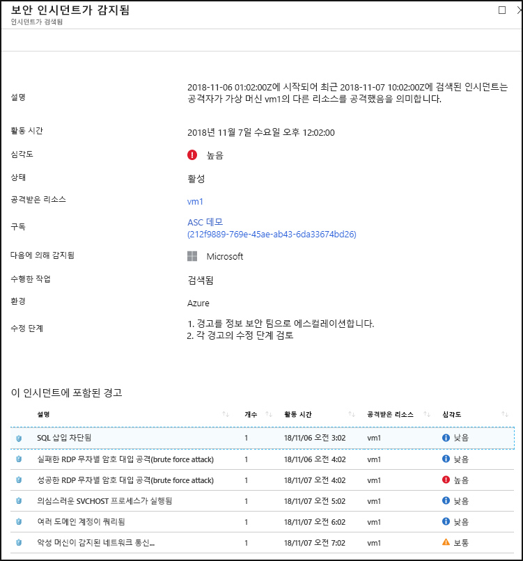

# Azure Security Center란?

Azure Security Center는 데이터 센터의 보안 상태를 강화하고, 온-프레미스뿐 아니라 Azure에 있는지 여부와 관계없이 클라우드의 전체 하이브리드 워크로드에 대해 지능형 위협 방지 기능을 제공하는 통합된 인프라 보안 관리 시스템입니다.

클라우드 공급자, Azure, 고객이 공동으로 노력하여 리소스를 안전하게 유지합니다. 클라우드로 이전할 때는 워크로드 보안을 유지해야 합니다. 이와 동시에 IaaS(Ifrastructure as a Service)로 이전하는 경우 PaaS(Platform as a Service) 및 SaaS(Software as a Service)에서보다 고객 책임이 더 증가합니다. Azure Security Center에서는 네트워크를 강화하고 서비스 보안을 유지하며 보안 상태를 제어하는 데 필요한 도구를 제공합니다.

Azure Security Center는 다음 세 가지의 가장 긴급한 보안 문제를 해결합니다.

-   **빠르게 변화하는 워크로드** - 이는 클라우드의 장점인 동시에 문제이기도 합니다. 한편으로는 최종 사용자에게 더 많은 작업을 수행할 수 있는 권한이 부여됩니다. 하지만 사람들이 사용하고 만드는, 계속 변화하는 서비스가 보안 표준을 준수하고 모범 사례를 따르는지 어떻게 확인할 수 있을까요?

-   **점점 더 정교해지는 공격**  - 어디서 워크로드를 실행하든, 공격이 점점 더 정교해지고 있습니다. 공용 클라우드 워크로드의 보안을 유지해야 하는데 이는 사실상 인터넷 연결 워크로드로, 보안 모범 사례를 따르지 않을 경우 훨씬 더 취약해질 수 있습니다.

-   **보안 기술의 공급 부족**  - 보안 경고 및 경고 시스템 수가 환경을 보호하는 데 필요한 배경 및 경험을 갖춘 관리자 수보다 훨씬 많습니다. 최신 공격을 통해 최신 상태를 유지하는 것은 지속적인 문제로, 보안 업계가 계속 변화하는 동안 이 상태를 유지하는 것은 불가능합니다.

이러한 문제로부터 보호하는 데 도움이 되도록 Security Center에서는 다음과 같은 도구를 제공합니다.

-   **보안 상태 강화**: Security Center는 환경을 평가하고 리소스 상태, 즉 안전한지 여부를 파악할 수 있도록 합니다.

-   **위협으로부터 보호**: Security Center는 워크로드를 평가하고 위협 방지 권장 사항 및 위협 탐지 경고를 제공합니다.

-   **보다 신속한 보안 설정**: Security Center에서는 모든 작업이 클라우드 속도로 수행됩니다. 네이티브 통합이 제공되므로 Security Center를 쉽게 배포하여 Azure 서비스를 통해 자동 프로비저닝 및 보호 기능을 이용할 수 있습니다.

## 아키텍처

Security Center는 기본적으로 Azure의 일부이므로 배포하지 않고도 Security Center에서 Service Fabric, SQL 데이터베이스 및 스토리지 계정을 비롯한 Azure의 PaaS 서비스를 모니터링하고 보호합니다.

또한 Security Center는 Microsoft Monitoring Agent를 설치하여 Windows 및 Linux 서버 둘 다에서 클라우드 또는 온-프레미스의 비 Azure 서버 및 가상 머신을 보호합니다. Azure 가상 머신은 Security Center에서 자동 프로비전됩니다.

에이전트 및 Azure에서 수집한 이벤트는 보안 분석 엔진에서 상관 관계가 파악되어, 워크로드 보안을 위해 따라야 하는 맞춤화된 권장 사항(강화 작업) 및 위협 탐지 경고를 제공합니다. 이러한 경고를 가능한 한 빨리 조사하여 워크로드가 악의적인 공격을 받지 않도록 해야 합니다.

Security Center를 사용하도록 설정하면 Security Center의 기본 제공 보안 정책이 Security Center 범주의 기본 제공 이니셔티브로 Azure Policy에 반영됩니다. 기본 제공 이니셔티브는 Security Center에 등록된 모든 구독(무료 또는 표준 계층)에 자동으로 할당됩니다. 기본 제공 이니셔티브에는 감사 정책만 포함되어 있습니다. Azure Policy의 Security Center 정책에 대한 자세한 내용은 [보안 정책 작업](tutorial-security-policy.md)을 참조하세요.

## 보안 상태 강화

Azure Security Center를 사용하여 보안 상태를 강화할 수 있습니다. 즉, 보안 모범 사례로 권장되는 강화 작업을 확인 및 수행하고 머신, 데이터 서비스 및 앱 전체에 구현하는 데 도움이 됩니다. 여기에는 보안 정책을 관리 및 적용하고 Azure 가상 머신, 비 Azure 서버 및 Azure PaaS 서비스가 규정을 준수하는지 확인하는 작업이 포함됩니다. Security Center에서는 네트워크 보안 영역에 대해 집중적인 가시성을 통해 워크로드를 자세히 조사하는 데 필요한 도구를 제공합니다. 

### 조직 보안 정책 및 준수 관리

워크로드가 안전한지 알고 확인하는 것이 보안의 기본 사항이며, 이는 맞춤화된 보안 정책을 구현하는 것에서 시작됩니다. Security Center의 모든 정책은 Azure Policy 제어를 바탕으로 구축되므로  **최고 수준의 정책 솔루션**이 제공하는 포괄적인 범위와 유연성을 얻을 수 있습니다. Security Center에서는 관리 그룹, 전체 구독 및 전체 테넌트에 대해 실행할 정책까지 설정할 수 있습니다.

Security Center를 사용하면  **섀도 IT 구독을 확인**할 수 있습니다. 대시보드에서 **검사되지 않음** 레이블이 표시된 구독을 살펴보면 새로 만든 구독이 있을 때 즉시 알 수 있으며, 해당 구독이 정책에 의해 검사되고 Azure Security Center에서 보호되도록 할 수 있습니다.

Security Center의 고급 모니터링 기능을 사용하면  **시간에 따른 준수 및 거버넌스를 추적하고 관리**할 수 있습니다.  **전반적인 준수** 에서는 구독이 워크로드와 관련된 정책을 준수하는 정도에 대한 측정값을 제공합니다. 

### 연속 평가

Security Center는 워크로드 전체에 배포되는 새 리소스를 지속적으로 검색하고 보안 모범 사례에 따라 구성되었는지 여부를 평가하며, 그렇지 않은 경우 리소스에 플래그가 지정되어 머신을 보호하기 위해 수정해야 하는 권장 사항 목록이 우선 순위에 따라 작성됩니다.

Security Center에서 네트워크의 보안 상태를 지속적으로 모니터링하기 위해 제공하는 가장 강력한 도구 중 하나는  **네트워크 맵**입니다. 맵을 사용하여 워크로드의 토폴로지를 살펴보고 각 노드가 제대로 구성되었는지 확인할 수 있습니다. 노드가 연결된 방식을 확인할 수 있으며, 이 정보를 통해 공격자가 네트워크를 쉽게 탐색할 수 있게 하는 원치 않는 연결을 차단할 수 있습니다.

Security Center에서는  **보안 점수**를 추가하여 보안 경고를 한층 더 쉽게 완화할 수 있도록 합니다. 이제 수신되는 각 권장 사항에 보안 점수가 연결되어, 각 권장 사항이 전반적인 보안 상태에 얼마나 중요한지 파악하는 데 도움이 됩니다. 이는  **보안 작업의 우선 순위를 지정**하는 데 중요합니다.

### 권장 제어를 구성하여 보안 최적화 및 개선

Azure Security Center 가치의 핵심은 권장 사항에 있습니다. 권장 사항은 사용자 워크로드에서 발견된 특정 보안 문제에 맞게 조정되며, Security Center는 취약성을 찾을 뿐 아니라 취약성을 제거하는 방법에 대한 특정 지침을 제공하여 자동으로 보안 관리 작업을 수행합니다.

이러한 방식으로 운영되는 Security Center를 통해 보안 정책을 설정하는 것은 물론, 리소스 전체에 보안 구성 표준을 적용할 수도 있습니다.

권장 사항은 각 리소스의 공격 표면을 줄이는 데 도움이 됩니다. 여기에는 Azure 가상 머신, 비 Azure 서버 및 SQL, Storage 계정 등의 Azure PaaS 서비스가 포함되며 각 리소스 유형이 다르게 평가되고 고유한 표준을 갖습니다.

## 위협으로부터 보호

Security Center의 위협 방지를 사용하면 Azure의 PaaS(Platforms as a Service)뿐 아니라 IaaS(서비스 제공 인프라) 계층 및 비 Azure 서버에서도 위협을 탐지하고 방지할 수 있습니다.

Security Center의 위협 방지에는 사이버 적극 대처(kill-chain) 분석에 따라 사용자 환경의 경고 간에 상관 관계를 자동으로 파악하는 Fusion 적극 대처(kill-chain) 분석이 포함됩니다. 이 분석은 공격 캠페인의 전체 스토리, 시작된 위치 및 리소스에 미치는 영향을 이해하는 데 도움이 됩니다.

### Advanced Threat Protection

Security Center에서는 Windows Defender Advanced Threat Protection과의 네이티브 통합을 활용할 수 있습니다. 따라서 별도 구성 없이도 Windows 가상 머신 및 서버가 Security Center의 권장 사항 및 평가와 완전히 통합됩니다. Linux 가상 머신 및 서버에 대해서도 지능형 위협 탐지가 기본적으로 제공됩니다.

또한 Security Center를 사용하면 서버 환경에서 애플리케이션 제어 정책을 자동화할 수 있습니다. Security Center의 적응형 애플리케이션 제어를 통해 Windows 서버 전체의 엔드투엔드 앱 허용 목록을 작성할 수 있습니다. 규칙을 만들고 위반을 확인할 필요가 없으며, 모든 작업이 자동으로 수행됩니다.

### PaaS 보호

Security Center는 Azure PaaS 서비스 전체의 위협을 탐지하는 데 도움이 됩니다. Azure App Service, Azure SQL, Azure Storage 계정 및 기타 데이터 서비스를 포함하여 Azure 서비스를 대상으로 하는 위협을 탐지할 수 있습니다. Microsoft Cloud App Security UEBA(사용자 및 엔터티 동작 분석)와의 네이티브 통합을 활용하여 Azure 활동 로그에서 변칙 검색을 수행할 수도 있습니다.

### 무차별 암호 대입 공격(brute force attack) 차단

Security Center는 무차별 암호 대입 공격(brute force attack)에 대한 노출을 제한하는 데 도움이 됩니다. Just-In-Time VM 액세스를 통해 가상 머신 포트에 대한 액세스를 줄이면 불필요한 액세스를 방지하여 네트워크를 강화할 수 있습니다. 권한 있는 사용자, 허용된 원본 IP 주소 범위 또는 IP 주소에 대해서만, 제한된 시간 동안 선택한 포트에 보안 액세스 정책을 설정할 수 있습니다.

### 데이터 서비스 보호

Security Center에는 Azure SQL에서 데이터 자동 분류를 수행하는 데 도움이 되는 기능이 포함되어 있습니다. Azure SQL 및 Storage 서비스 전체의 잠재적 취약성 평가 및 취약성을 완화하는 방법에 대한 권장 사항을 확인할 수도 있습니다.

## 보다 신속한 보안 설정

Microsoft Cloud App Security, Windows Defender Advanced Threat Protection 등 다른 Microsoft 보안 솔루션과의 원활한 통합 및 네이티브 Azure 통합(Azure Policy 및 Log Analytics 포함)이 결합되어 포괄적이면서도 온보드 및 배포가 간단한 보안 솔루션을 만들 수 있습니다.

또한 Azure 외부의 다른 클라우드 및 온-프레미스 데이터 센터에서 실행되는 워크로드까지 전체 솔루션을 확장할 수 있습니다.

### Azure 리소스 자동 검색 및 온보드

Security Center는 Azure 및 Azure 리소스와의 원활한 네이티브 통합을 제공합니다. 따라서 모든 Azure 리소스에 대한 Azure Policy 및 기본 제공 Security Center 정책을 포함하는 전체 보안 스토리를 작성하여 Azure에서 리소스를 만들 때 새로 검색된 리소스에 전체 보안이 자동으로 적용되도록 할 수 있습니다.

광범위한 로그 수집 - Windows 및 Linux의 로그가 보안 분석 엔진에서 모두 이용되고 권장 사항 및 경고를 만드는 데 사용됩니다.

## 다음 단계

- 보안 센터를 시작하려면 Microsoft Azure에 대한 구독이 필요합니다. 구독이 없는 경우 [무료 평가판](https://azure.microsoft.com/free/)을 등록할 수 있습니다.
- Security Center의 무료 가격 책정 계층은 Azure 구독을 사용하여 사용하도록 설정됩니다. 고급 보안 관리 및 위협 검색 기능을 활용하려면 표준 가격 책정 계층으로 업그레이드해야 합니다. 표준 계층을 평가판으로 사용해볼 수 있습니다. 자세한 내용은 [Security Center 가격 책정 페이지](https://azure.microsoft.com/pricing/details/security-center/)를 참조하세요.
- 지금 Security Center 표준을 사용할 준비가 되었으면 [빠른 시작: Security Center 표준에 Azure 구독 온보드](security-center-get-started.md)에서 단계를 안내합니다.

