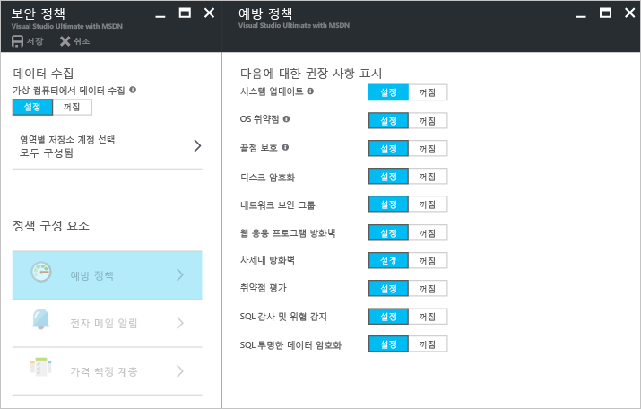
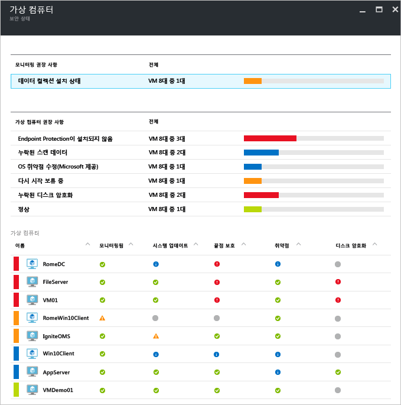
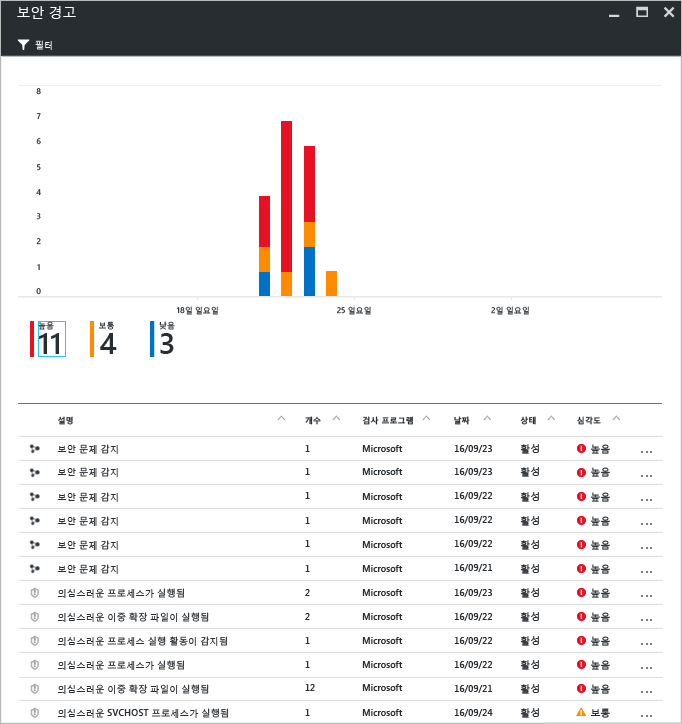
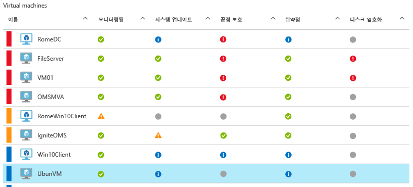
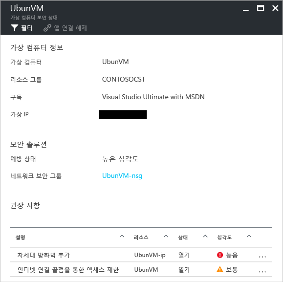

# Linux에 설치된 Azure Security Center 및 Azure Virtual Machines
[Azure Security Center](https://azure.microsoft.com/services/security-center/)를 통해 위협을 예방하고 감지하며 대응할 수 있습니다. 이는 Azure 구독에 대해 통합된 보안 모니터링 및 정책 관리를 제공하고 다른 방법으로 발견되지 않을 수 있는 위협을 감지하는 데 도움이 되며 보안 솔루션의 광범위한 환경에서 작동합니다.

이 문서에서는 Security Center가 Linux 운영 체제에서 실행되는 Azure VM(Virtual Machines)을 보호하는 데 어떻게 도움이 되는지 보여 줍니다.

## 보안 센터를 사용해야 하는 이유
Security Center를 사용하면 가상 머신의 보안 설정에 가시성을 제공하고 위협을 모니터링하여 Azure에서 가상 머신의 데이터를 보호할 수 있습니다. Security Center는 다음의 목적으로 가상 머신을 모니터링할 수 있습니다. 

* 권장된 구성 규칙으로 운영 체제(OS) 보안 설정
* 시스템 보안 및 누락된 중요 업데이트
* 엔드포인트 보호 권장 사항
* 디스크 암호화 유효성 검사
* 네트워크 기반 공격([표준 버전](https://azure.microsoft.com/pricing/details/security-center/)에서만 사용할 수 있음)

Security Center는 Azure VM을 보호하는 것 외에도, Cloud Services, App Services, Virtual Network 등에 대한 보안 모니터링 및 관리도 제공합니다. 

> [!NOTE]
> Azure Security Center에 대한 자세한 내용은 [Azure Security Center 소개](security-center-intro.md)를 참조하세요.
> 
> 

## 필수 조건
Azure Security Center를 시작하려면 다음 사항을 이해하고 고려해야 합니다.

* Microsoft Azure를 구독해야 합니다. 보안 센터의 무료 및 표준 계층에 대한 자세한 내용은 [보안 센터 가격 책정](https://azure.microsoft.com/pricing/details/security-center/)을 참조하세요.
* 보안 센터 도입을 계획하는 경우 계획 및 작업 고려 사항에 대한 자세한 내용은 [Azure Security Center 계획 및 작업 가이드](security-center-planning-and-operations-guide.md)를 참조하세요.
* 운영 체제 지원 가능성에 대한 정보는 [Azure Security Center FAQ(질문과 대답)](security-center-faq.md)를 참조하세요. 

## 보안 정책 설정
Azure Security Center에서 구성한 보안 정책을 기반으로 생성된 권장 사항 및 경고를 제공하는 데 필요한 정보를 수집할 수 있도록 데이터 수집을 활성화해야 합니다. 아래 그림에서 **데이터 수집**이 **사용**으로 설정된 것을 볼 수 있습니다.

보안 정책은 지정된 구독 또는 리소스 그룹 내에서 리소스에 대해 권장되는 제어 집합을 정의합니다. 보안 정책을 활성화하기 전에 데이터 수집을 활성화해야 합니다. 보안 센터는 해당 보안 상태를 평가하고 보안 권장 사항을 제공하며 위협에 경고하기 위해 가상 머신에서 데이터를 수집합니다. 보안 센터에서 회사의 보안 요구 사항 및 애플리케이션 유형 또는 각 구독의 데이터 민감도에 따라 Azure 구독 또는 리소스 그룹에 대한 정책을 정의합니다. 

> [!NOTE]
> 사용 가능한 각 **방지 정책**을 알아보려면 [보안 정책 설정](tutorial-security-policy.md) 문서를 참조하세요.
> 

## 보안 권장 사항 관리
보안 센터에서는 Azure 리소스의 보안 상태를 분석합니다. 보안 센터가 잠재적인 보안 취약점을 식별하는 경우 권장 사항을 만듭니다. 권장 사항은 필요한 컨트롤을 구성하는 과정을 안내합니다.

보안 정책이 설정되면 보안 센터는 리소스의 보안 상태를 분석하여 잠재적인 취약성을 식별합니다. 권장 사항은 각 줄이 한 가지 특정 권장을 나타내는 표 형식으로 표시됩니다. 아래 테이블에서는 Linux 운영 체제에서 실행되는 Azure VM에 대한 권장 사항의 일부 예제 및 이를 적용할 경우 권장 사항 각각의 기능을 제공합니다. 권장 사항을 선택하면 보안 센터에서 권장 사항을 구현하는 방법을 보여 주는 정보가 제공됩니다.

| 권장 사항 | 설명 |
| --- | --- |
| [구독에 대해 데이터 수집 활성화](security-center-enable-data-collection.md) |구독 또는 구독의 VM(가상 머신) 각각에 대해 보안 정책에서 데이터 수집을 켜는 것이 좋습니다. |
| [OS 취약성 해결](security-center-remediate-os-vulnerabilities.md) |OS 구성을 권장 구성 규칙과 정렬하라는 권장 사항입니다. 예를 들어 암호 저장을 허용하지 않습니다. |
| [시스템 업데이트 적용](security-center-apply-system-updates.md) |누락된 시스템 보안 및 중요 업데이트를 VM에 배포하는 것이 좋습니다. |
| [시스템 업데이트 후 다시 부팅](security-center-apply-system-updates.md#reboot-after-system-updates) |시스템 업데이트 적용 프로세스를 완료하려면 VM을 다시 부팅하는 것이 좋습니다. |
| [VM 에이전트 사용](security-center-enable-vm-agent.md) |VM 에이전트가 필요한 VM을 확인할 수 있습니다. 패치 검색, 기준 검색 및 맬웨어 방지 프로그램을 프로비전하려면 VM에 VM 에이전트가 설치되어 있어야 합니다. Azure Marketplace에서 배포된 VM에 VM 에이전트가 기본적으로 설치됩니다. [VM 에이전트 및 확장 - 2부](https://azure.microsoft.com/blog/2014/04/15/vm-agent-and-extensions-part-2/) 문서에 VM 에이전트 설치 방법이 설명되어 있습니다. |
| [디스크 암호화 적용](security-center-apply-disk-encryption.md) |Azure 디스크 암호화(Windows 및 Linux VM)를 사용하여 VM 디스크를 암호화하는 것이 좋습니다. VM에서 OS 및 데이터 볼륨에 암호화를 사용하는 것이 좋습니다. |

> [!NOTE]
> 권장 사항에 대한 자세한 내용은 [보안 권장 사항 관리](security-center-recommendations.md) 문서를 참조하세요.
> 

## 보안 상태 모니터링
구독의 리소스에 대한 [보안 정책](tutorial-security-policy.md) 을 활성화한 후에 보안 센터는 리소스의 보안을 분석하여 잠재적 취약성을 식별합니다.  **리소스 보안 상태** 블레이드의 문제와 함께 리소스의 보안 상태를 볼 수 있습니다. **리소스 보안** 상태 타일에서 **가상 머신**을 클릭하면 VM에 대한 권장 사항이 포함된 **가상 머신** 블레이드가 열립니다. 

## 보안 경고 관리 및 응답
보안 센터는 방화벽 및 엔드포인트 보호 솔루션과 같은 Azure 리소스, 네트워크 및 연결된 파트너 솔루션의 로그 데이터를 자동으로 수집하고 분석하며 통합하여 실제 위협을 감지하고 가양성을 줄입니다. [검색 기능](security-center-detection-capabilities.md)의 다양한 집계를 활용하여 보안 센터는 신속하게 문제를 조사하고 가능한 공격을 해결하는 방법에 대한 권장 사항을 제공할 수 있도록 우선 순위가 지정된 보안 경고를 생성할 수 있습니다.

보안 경고를 선택하여 해당 경고를 트리거하는 이벤트 및 공격을 완화하기 위해 수행해야 하는 단계(있는 경우)에 대해 자세히 알아봅니다. 보안 경고는 [형식](security-center-alerts-type.md) 및 날짜별로 그룹화됩니다.

## 보안 상태 모니터링
구독의 리소스에 대한 [보안 정책](tutorial-security-policy.md) 을 활성화한 후에 보안 센터는 리소스의 보안을 분석하여 잠재적 취약성을 식별합니다.  **리소스 보안 상태** 블레이드의 문제와 함께 리소스의 보안 상태를 볼 수 있습니다. **리소스 보안** 상태 타일에서 **가상 머신**을 클릭하면 VM에 대한 권장 사항이 포함된 **가상 머신** 블레이드가 열립니다. 

이 권장 사항을 클릭하면 해당 문제를 해결하기 위해 취해야 하는 특정 작업에 대한 자세한 내용이 표시됩니다. **권장 사항**의 블레이드 아래쪽에 세부 정보가 표시됩니다. 

## 참고 항목
보안 센터에 대한 자세한 내용은 다음을 참조하세요.

* [Azure Security Center에서 보안 정책 설정](tutorial-security-policy.md) -- Azure 구독 및 리소스 그룹에 대해 보안 정책을 구성하는 방법을 알아봅니다.
* [Azure Security Center에서 보안 경고 관리 및 대응](security-center-managing-and-responding-alerts.md) - 보안 경고를 관리하고 대응하는 방법을 알아봅니다.
* [Azure Security Center FAQ](security-center-faq.md) - 서비스 사용에 관한 질문과 대답을 찾습니다.

