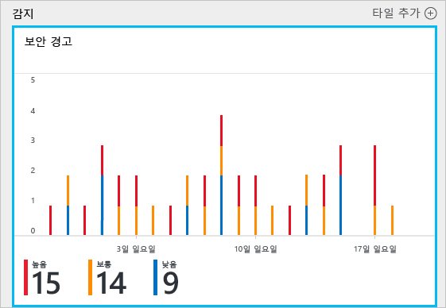
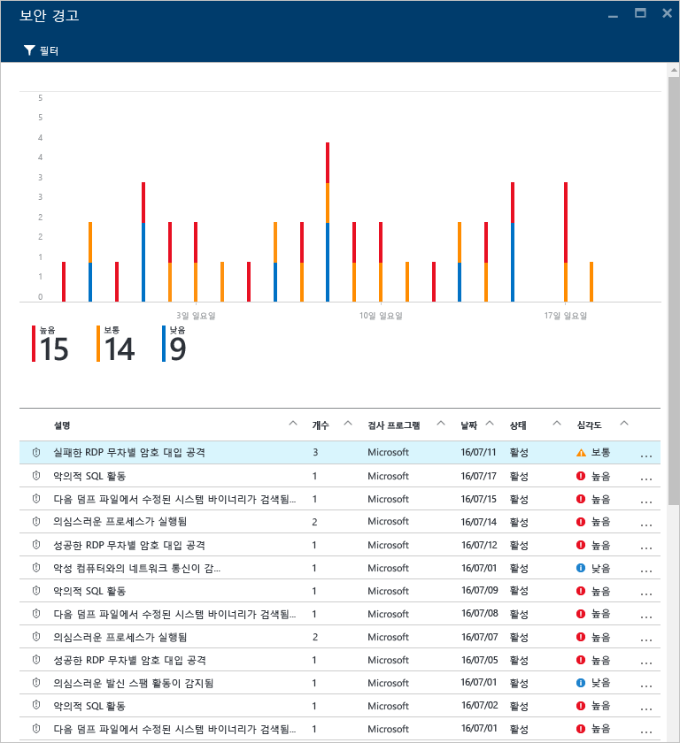
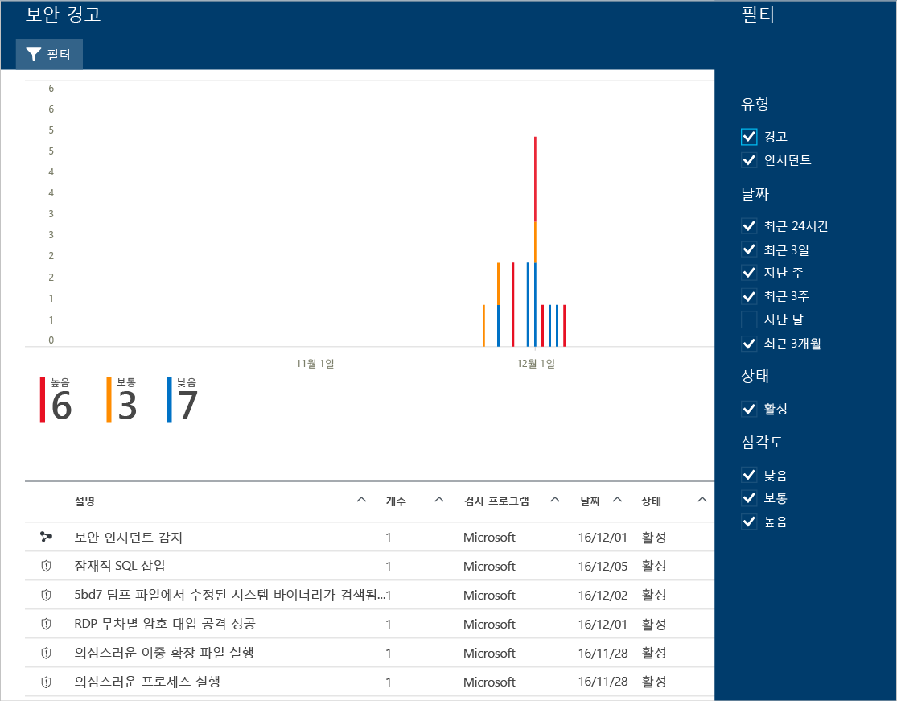
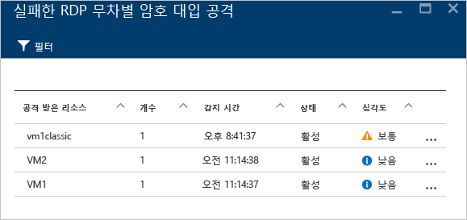
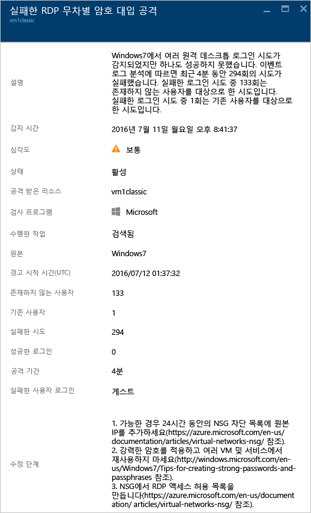

# Azure Security Center에서 보안 경고 관리 및 대응
이 문서는 Azure Security Center를 사용하여 보안 경고를 관리하고 대응하는 데 도움이 됩니다.

> [!NOTE]
> 고급 감지를 사용하도록 설정하려면 Azure Security Center 표준으로 업그레이드합니다. 평가판을 사용할 수 있습니다. 업그레이드하려면 [보안 정책](tutorial-security-policy.md)에서 가격 책정 계층을 선택합니다. 자세한 내용은 [Azure Security Center 가격 책정](security-center-pricing.md)을 참조하세요.
>
>

## 보안 경고란?
보안 센터는 방화벽 및 엔드포인트 보호 솔루션과 같은 Azure 리소스, 네트워크 및 연결된 파트너 솔루션의 로그 데이터를 자동으로 수집하고 분석하며 통합하여 실제 위협을 감지하고 가양성을 줄입니다. 우선 순위가 지정된 보안 경고의 목록은 문제를 신속하게 조사해야 하는 정보 및 공격을 해결하는 방법에 대한 권장 사항과 함께 보안 센터에 표시됩니다.

> [!NOTE]
> 보안 센터 감지 기능이 작동하는 방법에 대한 자세한 내용은 [Azure Security Center 감지 기능](security-center-detection-capabilities.md)을 참고하세요.
>
>

## 보안 경고 관리
**보안 경고** 타일을 확인하여 현재 경고를 검토할 수 있습니다. 다음 단계를 수행하여 각 경고에 대한 세부 정보를 확인합니다.

1. Security Center 대시보드에서 **보안 경고** 타일을 확인합니다.

    

2. 경고에 대한 세부 정보를 확인하려면 타일을 클릭하여 **보안 경고**를 엽니다.

   

이 페이지의 아래 부분에 각 경고에 대한 세부 정보가 있습니다. 정렬하려면 정렬 기준으로 사용할 열을 클릭합니다. 각 열에 대한 정의는 다음과 같습니다.

* **설명**: 경고에 대해 간략히 설명합니다.
* **개수**: 특정 날짜에서 탐지된 이 특정 형식의 모든 경고 목록입니다.
* **탐지 기준**: 경고를 트리거하는 일을 담당하는 서비스입니다.
* **날짜**: 이벤트가 발생한 날짜입니다.
* **상태**: 해당 경고에 대한 현재 상태입니다. 다음과 같은 두 가지 종류의 상태가 있습니다.
  * **활성**: 보안 경고가 탐지되었습니다.
  * **해제됨**: 사용자가 보안 경고를 해제했습니다. 일반적으로 이 상태는 조사를 거쳐 실제 공격이 아닌 것으로 밝혀졌거나 완화된 경고에 사용됩니다.
* **심각도**: 심각도 수준(높음, 중간 또는 낮음)입니다.

> [!NOTE]
> Security Center에서 생성된 보안 경고는 Azure 활동 로그에도 나타납니다. Azure 활동 로그에 액세스하는 방법에 대한 자세한 내용은 [리소스에 대한 작업을 감사하기 위해 활동 로그 보기](https://docs.microsoft.com/azure/azure-resource-manager/resource-group-audit)를 참조하세요.
>

### 경고 심각도

> [!NOTE]
> 경고 심각도는 포털과 REST API에서 다르게 표시되며, 차이점은 아래 목록에 나와 있습니다.

-   **높음**: 리소스가 손상될 가능성이 높습니다. 지금 즉시 리소스를 살펴보아야 합니다. Security Center는 경고 실행에 사용되는 악의적 의도와 결과 둘 다에서 신뢰성이 높습니다. 자격 증명 훔치기에 많이 사용되는 Mimikatz처럼 알려진 악의적 도구 실행을 검색하는 경고를 예로 들 수 있습니다. 
-   **중간(REST API에서는 Low)**: 리소스의 손상 가능성을 나타내는 의심스러운 활동입니다.
Security Center의 분석 또는 결과 신뢰도는 보통이며 악의적 의도의 신뢰도는 보통부터 높음 사이입니다. 일반적으로 기계 학습 또는 변칙 기반 검색입니다. 비정상적인 위치에서의 로그인 시도를 예로 들 수 있습니다.
-   **낮음(REST API에서는 Information)**: 무해한 양성 또는 차단된 공격일 수 있습니다. 
    - Security Center는 신뢰도가 높지 않기 때문에 의도가 악의적이고 작업은 악의적이지 않을 수 있습니다. 예를 들어 로그 지우기는 공격자가 흔적을 숨기려 시도할 때 발생할 수도 있지만, 대부분은 관리자가 수행하는 일상적인 작업입니다.
    - Security Center는 일반적으로 공격을 차단하더라도 살펴볼 가치가 있는 흥미로운 사례가 아닌 경우에는 사용자에게 알리지 않습니다. 
-   **정보(REST API에서는 Silent)**: 보안 인시던트로 드릴다운하거나 특정 경고 ID가 있는 REST API를 사용하는 경우 정보 경고만 표시됩니다. 일반적으로 한 인시던트는 여러 경고로 구성되며, 그 중 일부는 오직 정보 제공만을 위해 단독으로 표시될 수 있지만 다른 경고의 컨텍스트에서는 자세히 살펴볼 필요가 있습니다. 

### 경고 필터링
날짜, 상태 및 심각도를 기반으로 경고를 필터링할 수 있습니다. 경고의 필터링은 보안 경고 보기의 범위를 좁혀야 하는 시나리오에 유용할 수 있습니다. 예를 들어 시스템에서 잠재적 위반을 조사하고 있기 때문에 최근 24시간 동안 발생한 보안 경고를 해결하려고 할 수 있습니다.

1. **보안 경고**에서 **필터**를 클릭합니다. **필터**가 열리면 확인하려는 날짜, 상태 및 심각도 값을 선택합니다.

    

### 보안 경고에 대응
보안 경고를 선택하여 해당 경고를 트리거하는 이벤트 및 공격을 완화하기 위해 수행해야 하는 단계(있는 경우)에 대해 자세히 알아봅니다. 보안 경고는 형식 및 날짜별로 그룹화됩니다. 보안 경고를 클릭하면 그룹화된 경고의 목록이 포함된 페이지가 열립니다.

이 경우 트리거된 경고는 의심스러운 RDP(원격 데스크톱 프로토콜) 활동을 참조합니다. 첫 번째 열은 공격 받은 리소스를 보여 줍니다. 두 번째 열은 리소스가 공격받은 빈도를 보여 줍니다. 세 번째 열은 공격 시간을 보여 줍니다. 네 번째 열은 경고의 상태를 보여 주고 다섯 번째 열은 공격의 심각도를 보여 줍니다. 이 정보를 검토한 후에 공격을 받은 리소스를 클릭합니다.

**설명** 필드에 이 이벤트에 대한 자세한 내용이 있습니다. 이러한 추가 세부 사항은 수정 방법에 대한 원본 IP 주소 및 권장사항을 적용할 수 있는 경우 보안 경고인 대상 리소스를 트리거한 항목에 대한 정보를 제공합니다.  일부 경우에 일부 Windows 보안 이벤트 로그가 IP 주소를 포함하지 않기 때문에 원본 IP 주소가 비어 있습니다(사용할 수 없음).

Security Center에서 제안하는 수정은 보안 경고에 따라 다릅니다. 경우에 따라 권장된 수정을 구현하기 위해 기타 Azure 기능을 사용해야 할 수 있습니다. 예를 들어 이 공격에 대한 수정은 [네트워크 ACL](../virtual-network/virtual-networks-acl.md) 또는 [네트워크 보안 그룹](../virtual-network/security-overview.md#security-rules) 규칙을 사용하여 이 공격을 발생시키고 있는 IP 주소를 블랙리스트에 추가하는 것입니다. 다양한 유형의 경고에 대한 자세한 내용은 [Azure Security Center에서 보안 경고](security-center-alerts-type.md)를 참고하세요.

> [!NOTE]
> Security Center는 Linux 컴퓨터에서 악의적인 행동을 감지하는 감사된 레코드인 공통 감사 프레임워크를 활용하는 새로운 집합의 감지에 대한 제한된 미리 보기를 출시했습니다. 구독 ID를 [당사](mailto:ASC_linuxdetections@microsoft.com)로 전자 메일을 보내어 미리 보기에 가입하세요.

## 참고 항목
이 문서에서는 보안 센터에서 보안 정책을 구성하는 방법을 배웠습니다. 보안 센터에 대한 자세한 내용은 다음을 참조하세요.

* [Azure Security Center에서 보안 인시던트 처리](security-center-incident.md)
* [Azure Security Center 감지 기능](security-center-detection-capabilities.md)
* [Azure Security Center 계획 및 작업 가이드](security-center-planning-and-operations-guide.md)
* [Azure Security Center FAQ](security-center-faq.md) - 서비스 사용에 관한 질문과 대답을 찾습니다.
* [Azure 보안 블로그](https://blogs.msdn.com/b/azuresecurity/) - Azure 보안 및 규정 준수에 관한 블로그 게시물을 찾습니다.
