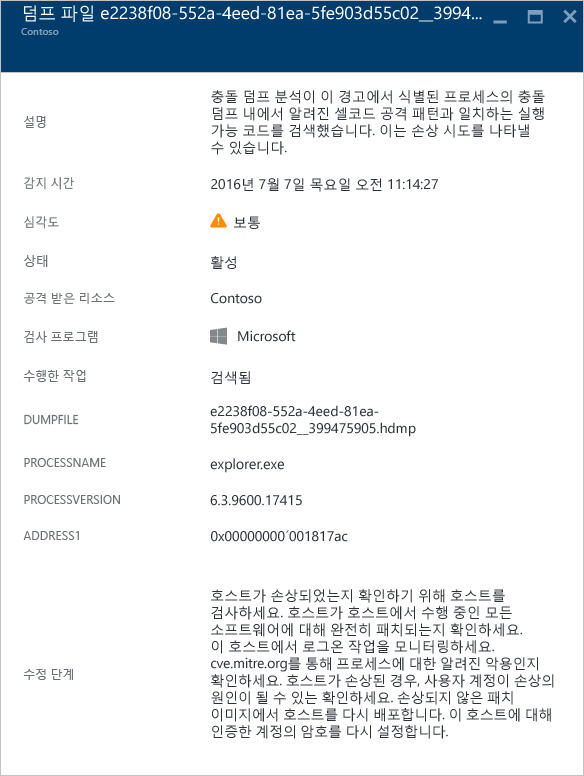
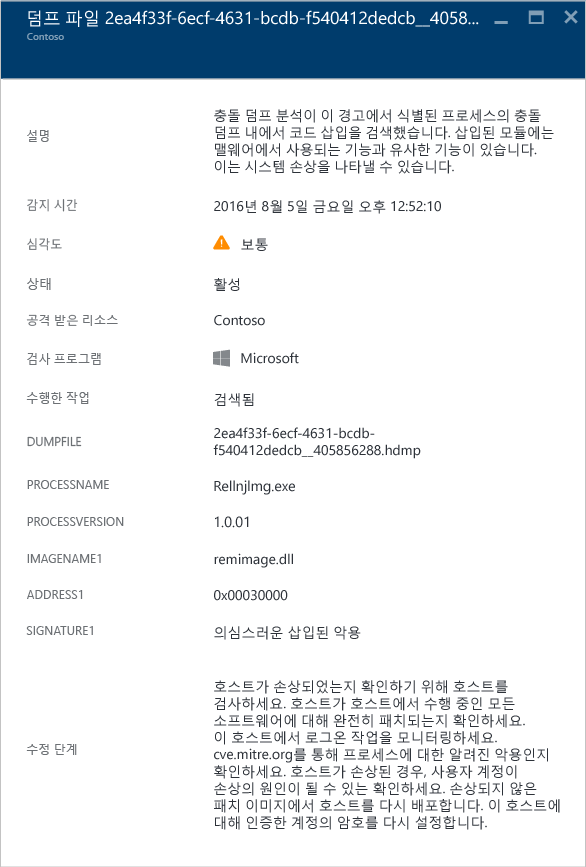
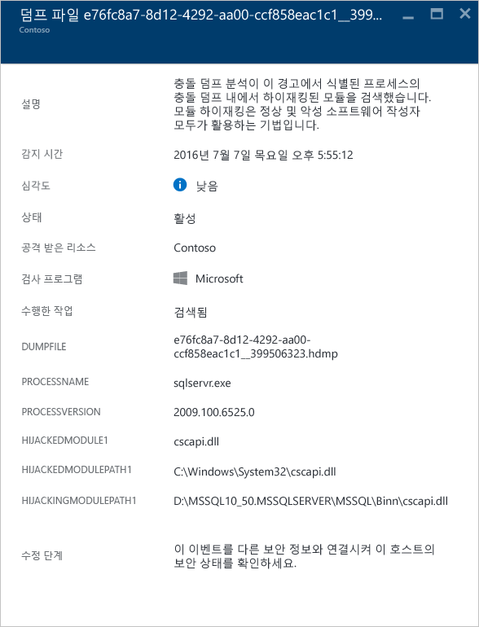
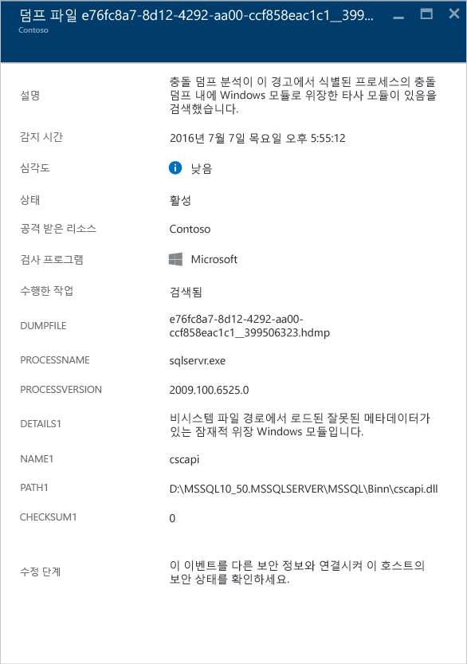
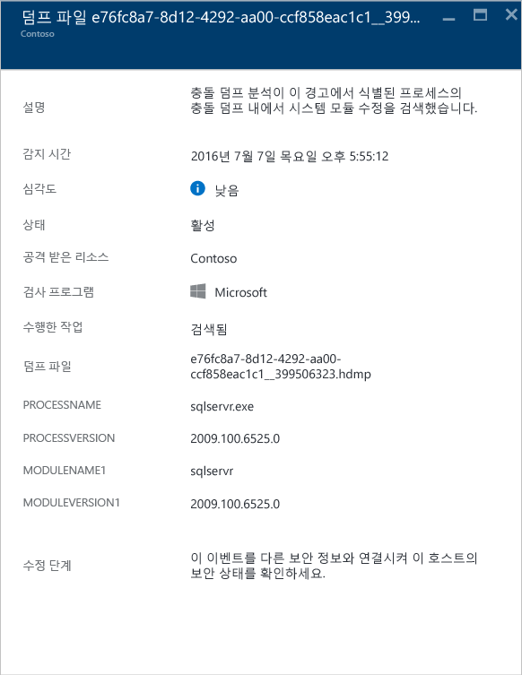

<properties
   pageTitle="Azure 보안 센터에서 보안 경고 관리 및 대응 | Microsoft Azure"
   description="이 문서는 Azure 보안 센터 기능을 사용하여 보안 경고를 관리하고 대응하는 데 도움이 됩니다."
   services="security-center"
   documentationCenter="na"
   authors="YuriDio"
   manager="swadhwa"
   editor=""/>

<tags
   ms.service="security-center"
   ms.topic="hero-article"
   ms.devlang="na"
   ms.tgt_pltfrm="na"
   ms.workload="na"
   ms.date="08/26/2016"
   ms.author="yurid"/>

# Azure 보안 센터에서 보안 경고 관리 및 대응
이 문서는 Azure 보안 센터를 사용하여 보안 경고를 관리하고 대응하는 데 도움이 됩니다.

> [AZURE.NOTE] 고급 감지를 사용하도록 설정하려면 Azure 보안 센터 표준으로 업그레이드합니다. 무료 90일 평가판을 사용할 수 있습니다. 업그레이드하려면 [보안 정책](security-center-policies.md)에서 가격 책정 계층을 선택합니다. 자세히 알아보려면 [가격 책정 페이지](https://azure.microsoft.com/pricing/details/security-center/)를 참조하세요.

## 보안 경고란?
보안 센터는 방화벽 및 끝점 보호 솔루션과 같은 Azure 리소스, 네트워크 및 연결된 파트너 솔루션의 로그 데이터를 자동으로 수집하고 분석하며 통합하여 실제 위협을 감지하고 가양성을 줄입니다. 우선 순위가 지정된 보안 경고의 목록은 문제를 신속하게 조사해야 하는 정보 및 공격을 해결하는 방법에 대한 권장 사항과 함께 보안 센터에 표시됩니다. 또한 Azure 보안 센터는 kill 체인 패턴에 맞춰 정렬한 경고를 [인시던트](security-center-incident.md)에 집계합니다.

> [AZURE.NOTE] 보안 센터 감지 기능이 작동하는 방법에 대한 자세한 내용은 [Azure 보안 센터 감지 기능](security-center-detection-capabilities.md)을 참고하세요.

## 보안 경고 관리

**보안 경고** 타일을 확인하여 현재 경고를 검토할 수 있습니다. Azure 포털을 열고 다음 단계를 수행하여 각 경고에 대한 세부 정보를 확인합니다.

1. 보안 센터 대시보드에서 **보안 경고** 타일을 봅니다.

    

2.  타일을 클릭하여 아래와 같이 경고에 대한 세부 정보가 포함된 **보안 경고** 블레이드를 엽니다.

    

이 블레이드의 아래 부분에 각 경고에 대한 세부 정보가 있습니다. 정렬하려면 정렬 기준으로 사용할 열을 클릭합니다. 각 열에 대한 정의는 다음과 같습니다.

- **경고**: 경고에 대해 간략히 설명합니다.
- **개수**: 특정 날짜에서 감지한 이 특정 형식의 모든 경고 목록입니다.
- **감지 기준**: 경고를 트리거하는 일을 담당하는 서비스입니다.
- **날짜**: 이벤트가 발생한 날짜입니다.
- **상태**: 해당 경고에 대한 현재 상태입니다. 다음과 같은 두 가지 종류의 상태가 있습니다.
    - **활성**: 보안 경고가 감지되었습니다.
    - **해제됨**: 사용자가 보안 경고를 해제했습니다. 이 상태는 일반적으로 조사했지만 실제 공격이 아닌 것으로 밝혀졌거나 완화된 경고에 사용됩니다.

- **심각도**: 심각도 수준(높음, 중간 또는 낮음)입니다.

### 경고 필터링

날짜, 상태 및 심각도를 기반으로 경고를 필터링할 수 있습니다. 경고의 필터링은 보안 경고 보기의 범위를 좁혀야 하는 시나리오에 유용할 수 있습니다. 예를 들어 시스템에서 잠재적 위반을 조사하고 있기 때문에 최근 24시간 동안 발생한 보안 경고를 해결하려고 할 수 있습니다.

1. **보안 경고** 블레이드에서 **필터**를 클릭합니다. **필터** 블레이드가 열리면 확인하려는 날짜, 상태 및 심각도 값을 선택합니다.

	

2. 	보안 경고를 조사한 후에 환경에 대한 가양성이거나 특정 리소스에 대한 예상되는 동작을 나타낸다는 사실을 알 수 있습니다. 어떤 경우에도 보안 경고를 적용적용할 수 없다고 생각되면 경고를 해제하고 보기에서 필터링할 수 있습니다. 보안 경고를 해제하는 두 가지 방법이 있습니다. 경고를 마우스 오른쪽 단추로 클릭하고 **해제**를 선택하거나 마우스 포인터로 항목을 가리킨 다음 오른쪽에 나타나는 점 세 개를 클릭하고 **해제**를 선택합니다. **필터**를 클릭하고 **해제됨**을 선택하여 해제된 보안 경고를 볼 수 있습니다.

	

### 보안 경고에 대응

보안 경고를 선택하여 해당 경고를 트리거하는 이벤트 및 공격을 완화하기 위해 수행해야 하는 단계(있는 경우)에 대해 자세히 알아봅니다. 보안 경고는 형식 및 날짜별로 그룹화됩니다. 보안 경고를 클릭하면 그룹화된 경고의 목록이 포함된 블레이드가 열립니다.

이 경우 트리거된 경고는 의심스러운 RDP(원격 데스크톱 프로토콜) 활동을 참조합니다. 첫 번째 열은 공격 받은 리소스를 보여 줍니다. 두 번째 열은 리소스가 공격받은 빈도를 보여 줍니다. 세 번째 열은 공격 시간을 보여 줍니다. 네 번째 열은 경고의 상태를 보여 주고 다섯 번째 열은 공격의 심각도를 보여 줍니다. 이 정보를 검토한 후 공격을 받은 리소스를 클릭하면 새 블레이드가 열립니다.

이 블레이드의 **설명** 필드에 이 이벤트에 대한 자세한 내용이 있습니다. 이러한 추가 세부 사항은 수정 방법에 대한 원본 IP 주소 및 권장사항을 적용할 수 있는 경우 보안 경고인 대상 리소스를 트리거한 항목에 대한 정보를 제공합니다. 일부 경우에 일부 Windows 보안 이벤트 로그가 IP 주소를 포함하지 않기 때문에 원본 IP 주소가 비어 있습니다(사용할 수 없음).

> [AZURE.NOTE] 보안 센터에서 제안하는 수정은 보안 경고에 따라 다릅니다. 경우에 따라 권장된 수정을 구현하기 위해 기타 Azure 기능을 사용해야 할 수 있습니다. 예를 들어 이 공격에 대한 수정은 [네트워크 ACL](../virtual-network/virtual-networks-acl.md) 또는 [네트워크 보안 그룹](../virtual-network/virtual-networks-nsg.md) 규칙을 사용하여 이 공격을 발생시키고 있는 IP 주소를 블랙리스트에 추가하는 것입니다.

## 유형별 보안 경고
의심스러운 RDP 작업 경고에 액세스하는 데 사용된 동일한 단계를 다른 유형의 경고에 액세스하는 데 사용할 수 있습니다. 보안 센터 경고에 표시될 수 있는 경고의 예는 다음과 같습니다.

### 잠재적인 SQL 삽입
SQL 삽입은 구문 분석 및 실행을 위해 나중에 SQL Server의 인스턴스로 전달된 문자열에 악성 코드를 삽입한 공격입니다. SQL Server가 수신하는 모든 구문상 유효한 쿼리를 실행하기 때문에 SQL 문을 생성하는 모든 프로시저에 삽입 취약성이 있는지 검토해야 합니다.

이 경고는 공격을 받는 리소스, 감지 시간, 공격의 상태를 식별할 수 있는 정보를 제공하고 또한 추가 조사 단계에 대한 링크를 제공합니다.

### 의심스러운 나가는 트래픽 감지

다른 유형의 시스템과 거의 동일한 방법으로 네트워크 장치를 검색하고 프로파일링할 수 있습니다. 공격자는 일반적으로 포트 검색/포트 비우기를 시작합니다. 아래 예제에서는 외부 리소스에 대한 SSH 무차별 암호 대입(brute force) 또는 포트 비우기 공격을 수행할 수 있는 VM에서 의심스러운 SSH 트래픽이 발견됩니다.

이 경고는 이 공격을 시작하는 데 사용된 리소스, 손상된 컴퓨터, 감지 시간, 프로토콜 및 사용된 포트를 식별할 수 있는 정보를 제공합니다. 이 블레이드는 이 문제를 완화하기 위해 사용할 수 있는 수정 단계 목록도 제공합니다.

### 악의적인 컴퓨터와 네트워크 통신
 
Azure 보안 센터는 많은 경우 명령 및 제어 센터에서 Microsoft 위협 인텔리전스 피드를 활용하여 악성 IP 주소와 통신하는 손상된 컴퓨터를 검색할 수 있습니다. 이 경우에 Azure 보안 센터는 Pony Loader 맬웨어([Fareit](https://www.microsoft.com/security/portal/threat/encyclopedia/entry.aspx?Name=PWS:Win32/Fareit.AF)라고도 함)를 사용하여 실행된 통신을 감지했습니다.

이 경고는 이 공격을 시작하는 데 사용된 리소스, 공격을 받는 리소스, 공격 대상 IP, 공격자 IP 및 감지 시간을 식별할 수 있는 정보를 제공합니다.

> [AZURE.NOTE] 라이브 IP 주소는 개인 정보 보호 목적을 위해이 스크린샷에서 제거되었습니다.

### Shellcode 검색 

Shellcode는 맬웨어가 소프트웨어 취약점을 악용한 후에 실행되는 페이로드입니다. 이 경고는 크래시 덤프 분석이 악의적인 페이로드에서 일반적으로 수행하는 동작을 표시하는 실행 코드를 감지했음을 나타냅니다. 악의적이지 않은 소프트웨어가 이 동작을 수행할 수 있지만 보통 소프트웨어 개발 방법으로서는 일반적이지 않습니다.

다음 필드는 모든 크래시 덤프 경고에 공통적으로 적용합니다.

- DUMPFILE: 크래시 덤프 파일의 이름
- PROCESSNAME: 충돌하는 프로세스의 이름
- PROCESSVERSION: 충돌하는 프로세스의 버전

이 경고는 다음과 같은 추가 필드를 제공합니다.

- ADDRESS: shellcode의 메모리에 있는 위치

이러한 유형의 경고 예제는 다음과 같습니다.

### 코드 주입 검색

코드 주입은 프로세스 또는 스레드를 실행하는 실행 가능한 모듈을 삽입하는 작업입니다. 데이터에 액세스하거나 데이터 제거를 숨기거나 방지하는 맬웨어에서 이 방법을 사용합니다(예: 지속성). 이 경고는 크래시 덤프 분석에서 크래시 덤프를 포함한 삽입된 모듈을 감지했음을 나타냅니다.
 
소프트웨어의 합법적인 개발자는 종종 기존 응용 프로그램 또는 운영 체제 구성 요소를 수정하거나 확장하는 등 악의적이지 않은 이유로 코드 삽입을 수행합니다. Azure 보안 센터는 악의적으로 삽입된 모듈과 악의적이지 않게 삽입된 모듈 간을 구분하기 위해 삽입된 모듈이 의심스러운 동작의 프로필을 준수하는지 여부를 확인합니다. 이 검사의 결과는 경고의 "서명" 필드에 의해 나타나고 경고, 경고 설명 및 경고 문제 해결 단계의 심각도에 반영됩니다.

이 경고는 위의 "Shellcode 검색" 섹션에서 설명한 공통 필드 외에 다음과 같은 추가 필드를 제공합니다.

- ADDRESS: 삽입된 모듈의 메모리에 있는 위치
- IMAGENAME: 삽입된 모듈의 이름 이미지 내에 이미지 이름이 제공되지 않은 경우에 비워둘 수 있습니다.
- SIGNATURE: 삽입된 모듈이 의심스러운 동작의 프로필을 준수하는지를 나타냅니다. 다음 테이블에서는 결과 및 해당 설명의 예를 보여 줍니다.

| **서명 값** | **설명** |
|--------------------------------------|-------------------------------------------------------------------------------------------------------------------|
| 의심스러운 반사 로더 익스플로잇 | 이 의심스러운 동작은 종종 운영 체제 로더의 독립적으로 삽입된 코드를 로드하는 작업과 관련이 있습니다. |
| 의심스러운 삽입된 익스플로잇 | 종종 메모리에 코드를 삽입하는 작업과 관련이 있는 악의성을 의미합니다. |
| 의심스러운 삽입 익스플로잇 | 종종 메모리에 삽입된 코드를 사용하는 작업과 관련이 있는 악의성을 의미합니다. |
| 의심스러운 삽입된 디버거 익스플로잇 | 종종 디버거의 감지 또는 우회와 관련이 있는 악의성을 의미합니다. |
| 의심스러운 삽입된 원격 익스플로잇 | 종종 명령 n 컨트롤(C2) 시나리오와 관련이 있는 악의성을 의미합니다. |

이러한 유형의 경고 예제는 다음과 같습니다.

### 모듈 하이재킹 검색

Windows는 DLL(동적 링크 라이브러리)에 따라 소프트웨어가 일반적인 Windows 시스템 기능을 활용할 수 있도록 합니다. DLL 하이재킹은 맬웨어가 DLL 로드 순서를 변경시켜 악의적인 페이로드를 임의 코드를 실행할 수 있는 메모리에 로드할 때 발생합니다. 크래시 덤프 분석이 비슷한 이름의 모듈을 서로 다른 두 경로에서 로드한다는 것을 감지하면 이 경고가 발생하며 로드된 경로 중 하나는 Windows 시스템 이진 위치에서 비롯됩니다.

합법적인 소프트웨어 개발자는 종종 Windows OS 또는 Windows 응용 프로그램을 조율하거나 확장하는 등 악의적이지 않은 이유로 DLL 로드 순서를 변경합니다. DLL 로드 순서에 대한 악의적인 변경 내용과 잠재적으로 심각하지 않은 변경 내용을 구분하기 위해 Azure 보안 센터는 로드된 모듈이 의심스러운 프로필을 준수하는지를 확인합니다. 이 검사의 결과는 경고의 "서명" 필드에 의해 나타나고 경고, 경고 설명 및 경고 문제 해결 단계의 심각도에 반영됩니다. 파일 디지털 서명을 확인하거나 바이러스 백신 스캔을 실행하여 하이재킹 모듈의 온 디스크 복사본을 분석하면 하이재킹 모듈의 합법적인 또는 악의적인 특성에 대한 자세한 정보를 제공할 수 있습니다.

이 경고는 위의 "Shellcode 검색" 섹션에서 설명한 공통 필드 외에 다음과 같은 필드를 제공합니다.

- SIGNATURE: 하이재킹 모듈이 의심스러운 동작의 프로필을 준수한다는 표시
- HIJACKEDMODULE: 하이재킹된 Windows 시스템 모듈의 이름
- HIJACKEDMODULEPATH: 하이재킹된 Windows 시스템 모듈의 경로
- HIJACKINGMODULEPATH: 하이재킹된 모듈의 경로

이러한 유형의 경고 예제는 다음과 같습니다.

### 위장 Windows 모듈 감지

맬웨어는 시스템 관리자로부터 악성 소프트웨어의 특성을 "섞고" 가리기 위해 Windows 시스템 이진 파일(예: SVCHOST.EXE) 또는 모듈(예: NTDLL.DLL)의 일반적인 이름을 사용할 수 있습니다. 이 경고는 크래시 덤프 파일이 Windows 시스템 모듈 이름을 사용하는 모듈을 포함하지만 Windows 모듈의 일반적인 다른 조건을 만족하지 않는다는 점을 크래시 덤프 분석에서 감지했음을 나타냅니다. 위장 모듈의 온 디스크 복사본에 대해 분석하면 모듈의 합법적인 또는 악의적인 특성에 대한 자세한 정보를 제공할 수 있습니다. 분석은 다음을 포함할 수 있습니다.

- 문제의 파일이 합법적인 소프트웨어 패키지의 일부로 제공되고 있는지 확인합니다.
- 파일의 디지털 서명을 확인합니다.
- 파일에 바이러스 백신 검사를 실행합니다.

이 경고는 위의 "Shellcode 검색" 섹션에서 설명한 공통 필드 외에 다음과 같은 추가 필드를 제공합니다.

- DETAILS: 모듈 메타데이터가 유효한지와 모듈이 시스템 경로에서 로드 여부 설명
- NAME: 위장 Windows 모듈의 이름
- PATH: 위장 Windows 모듈의 경로

또한 이 경고는 "CHECKSUM" 및 "TIMESTAMP"와 같은 모듈의 PE 헤더에서 특정 필드를 추출하고 표시합니다. 이러한 필드는 모듈에 있는 경우에만 표시됩니다. 이러한 필드에 대한 자세한 내용은 [Microsoft PE 및 COFF 사양](https://msdn.microsoft.com/windows/hardware/gg463119.aspx)을 참조하세요.

이러한 유형의 경고 예제는 다음과 같습니다.

### 수정된 시스템 이진 파일 검색 

맬웨어는 은밀하게 데이터에 액세스하거나 손상된 시스템 상에 몰래 지속되기 위해 핵심 시스템 이진 파일을 수정할 수 있습니다. 이 경고는 핵심 Windows OS 이진 파일이 메모리나 디스크에서 수정된 것을 크래시 덤프 분석에서 감지했음을 나타냅니다.

때때로 합법적인 소프트웨어 개발자는 Detours 등 응용 프로그램 호환성을 위해 악의적이지 않은 이유로 메모리에서 자유롭게 시스템 모듈을 수정합니다. 악의적인 모듈과 잠재적으로 합법적인 모듈을 구분하기 위해 Azure 보안 센터는 수정된 모듈이 의심스러운 프로필을 준수하는지를 확인합니다. 이 검사의 결과는 경고, 경고 설명 및 경고 문제 해결 단계의 심각도 별로 표시됩니다.

이 경고는 위의 "Shellcode 검색" 섹션에서 설명한 공통 필드 외에 다음과 같은 추가 필드를 제공합니다.

- MODULENAME: 수정된 시스템 이진 파일의 이름
- MODULEVERSION: 수정된 시스템 이진 파일의 버전

이러한 유형의 경고 예제는 다음과 같습니다.

## 참고 항목

이 문서에서는 보안 센터에서 보안 정책을 구성하는 방법을 배웠습니다. 보안 센터에 대한 자세한 내용은 다음을 참조하세요.

- [Azure 보안 센터에서 보안 인시던트 처리](security-center-incident.md)
- [Azure 보안 센터 감지 기능](security-center-detection-capabilities.md)
- [Azure 보안 센터 계획 및 작업 가이드](security-center-planning-and-operations-guide.md)
- [Azure 보안 센터 FAQ](security-center-faq.md) — 서비스 사용에 관한 질문과 대답 찾기
- [Azure 보안 블로그](http://blogs.msdn.com/b/azuresecurity/) — Azure 보안 및 규정 준수에 관한 블로그 게시물 찾기

<!---HONumber=AcomDC_0831_2016-->