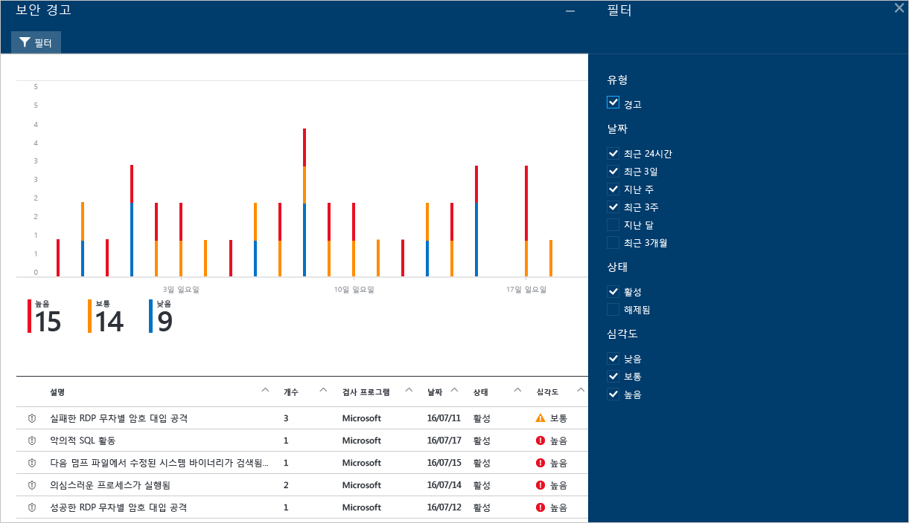
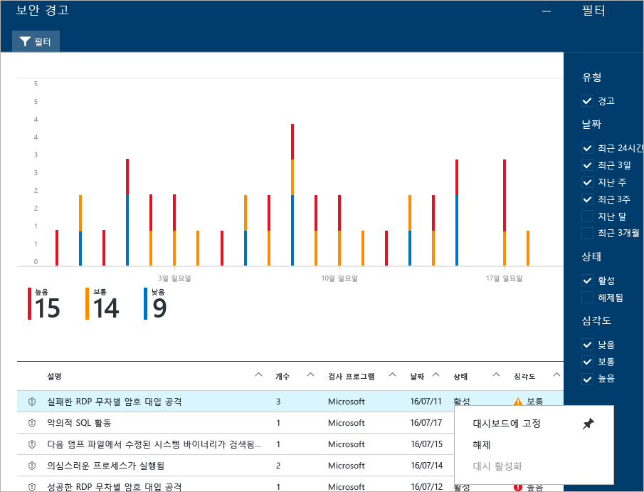

<properties
   pageTitle="Azure 보안 센터에서 보안 경고 관리 및 대응 | Microsoft Azure"
   description="이 문서는 Azure 보안 센터 기능을 사용하여 보안 경고를 관리하고 대응하는 데 도움이 됩니다."
   services="security-center"
   documentationCenter="na"
   authors="YuriDio"
   manager="swadhwa"
   editor=""/>

<tags
   ms.service="security-center"
   ms.topic="hero-article"
   ms.devlang="na"
   ms.tgt_pltfrm="na"
   ms.workload="na"
   ms.date="09/19/2016"
   ms.author="yurid"/>

# Azure 보안 센터에서 보안 경고 관리 및 대응
이 문서는 Azure 보안 센터를 사용하여 보안 경고를 관리하고 대응하는 데 도움이 됩니다.

> [AZURE.NOTE] 고급 감지를 사용하도록 설정하려면 Azure 보안 센터 표준으로 업그레이드합니다. 무료 90일 평가판을 사용할 수 있습니다. 업그레이드하려면 [보안 정책](security-center-policies.md)에서 가격 책정 계층을 선택합니다. 자세히 알아보려면 [가격 책정 페이지](https://azure.microsoft.com/pricing/details/security-center/)를 참조하세요.

## 보안 경고란?
보안 센터는 방화벽 및 끝점 보호 솔루션과 같은 Azure 리소스, 네트워크 및 연결된 파트너 솔루션의 로그 데이터를 자동으로 수집하고 분석하며 통합하여 실제 위협을 감지하고 가양성을 줄입니다. 우선 순위가 지정된 보안 경고의 목록은 문제를 신속하게 조사해야 하는 정보 및 공격을 해결하는 방법에 대한 권장 사항과 함께 보안 센터에 표시됩니다. 또한 Azure 보안 센터는 kill 체인 패턴에 맞춰 정렬한 경고를 [인시던트](security-center-incident.md)에 집계합니다.

> [AZURE.NOTE] 보안 센터 감지 기능이 작동하는 방법에 대한 자세한 내용은 [Azure 보안 센터 감지 기능](security-center-detection-capabilities.md)을 참고하세요.

## 보안 경고 관리

**보안 경고** 타일을 확인하여 현재 경고를 검토할 수 있습니다. Azure 포털을 열고 다음 단계를 수행하여 각 경고에 대한 세부 정보를 확인합니다.

1. 보안 센터 대시보드에서 **보안 경고** 타일을 봅니다.

    

2.  타일을 클릭하여 아래와 같이 경고에 대한 세부 정보가 포함된 **보안 경고** 블레이드를 엽니다.

    

이 블레이드의 아래 부분에 각 경고에 대한 세부 정보가 있습니다. 정렬하려면 정렬 기준으로 사용할 열을 클릭합니다. 각 열에 대한 정의는 다음과 같습니다.

- **경고**: 경고에 대해 간략히 설명합니다.
- **개수**: 특정 날짜에서 감지한 이 특정 형식의 모든 경고 목록입니다.
- **감지 기준**: 경고를 트리거하는 일을 담당하는 서비스입니다.
- **날짜**: 이벤트가 발생한 날짜입니다.
- **상태**: 해당 경고에 대한 현재 상태입니다. 다음과 같은 두 가지 종류의 상태가 있습니다.
    - **활성**: 보안 경고가 감지되었습니다.
    - **해제됨**: 사용자가 보안 경고를 해제했습니다. 이 상태는 일반적으로 조사했지만 실제 공격이 아닌 것으로 밝혀졌거나 완화된 경고에 사용됩니다.

- **심각도**: 심각도 수준(높음, 중간 또는 낮음)입니다.

### 경고 필터링

날짜, 상태 및 심각도를 기반으로 경고를 필터링할 수 있습니다. 경고의 필터링은 보안 경고 보기의 범위를 좁혀야 하는 시나리오에 유용할 수 있습니다. 예를 들어 시스템에서 잠재적 위반을 조사하고 있기 때문에 최근 24시간 동안 발생한 보안 경고를 해결하려고 할 수 있습니다.

1. **보안 경고** 블레이드에서 **필터**를 클릭합니다. **필터** 블레이드가 열리면 확인하려는 날짜, 상태 및 심각도 값을 선택합니다.

	

2. 	보안 경고를 조사한 후에 환경에 대한 가양성이거나 특정 리소스에 대한 예상되는 동작을 나타낸다는 사실을 알 수 있습니다. 어떤 경우에도 보안 경고를 적용적용할 수 없다고 생각되면 경고를 해제하고 보기에서 필터링할 수 있습니다. 보안 경고를 해제하는 두 가지 방법이 있습니다. 경고를 마우스 오른쪽 단추로 클릭하고 **해제**를 선택하거나 마우스 포인터로 항목을 가리킨 다음 오른쪽에 나타나는 점 세 개를 클릭하고 **해제**를 선택합니다. **필터**를 클릭하고 **해제됨**을 선택하여 해제된 보안 경고를 볼 수 있습니다.

	

### 보안 경고에 대응

보안 경고를 선택하여 해당 경고를 트리거하는 이벤트 및 공격을 완화하기 위해 수행해야 하는 단계(있는 경우)에 대해 자세히 알아봅니다. 보안 경고는 형식 및 날짜별로 그룹화됩니다. 보안 경고를 클릭하면 그룹화된 경고의 목록이 포함된 블레이드가 열립니다.

이 경우 트리거된 경고는 의심스러운 RDP(원격 데스크톱 프로토콜) 활동을 참조합니다. 첫 번째 열은 공격 받은 리소스를 보여 줍니다. 두 번째 열은 리소스가 공격받은 빈도를 보여 줍니다. 세 번째 열은 공격 시간을 보여 줍니다. 네 번째 열은 경고의 상태를 보여 주고 다섯 번째 열은 공격의 심각도를 보여 줍니다. 이 정보를 검토한 후 공격을 받은 리소스를 클릭하면 새 블레이드가 열립니다.

이 블레이드의 **설명** 필드에 이 이벤트에 대한 자세한 내용이 있습니다. 이러한 추가 세부 사항은 수정 방법에 대한 원본 IP 주소 및 권장사항을 적용할 수 있는 경우 보안 경고인 대상 리소스를 트리거한 항목에 대한 정보를 제공합니다. 일부 경우에 일부 Windows 보안 이벤트 로그가 IP 주소를 포함하지 않기 때문에 원본 IP 주소가 비어 있습니다(사용할 수 없음).

보안 센터에서 제안하는 수정은 보안 경고에 따라 다릅니다. 경우에 따라 권장된 수정을 구현하기 위해 기타 Azure 기능을 사용해야 할 수 있습니다. 예를 들어 이 공격에 대한 수정은 [네트워크 ACL](../virtual-network/virtual-networks-acl.md) 또는 [네트워크 보안 그룹](../virtual-network/virtual-networks-nsg.md) 규칙을 사용하여 이 공격을 발생시키고 있는 IP 주소를 블랙리스트에 추가하는 것입니다.

> [AZURE.NOTE] 다양한 유형의 경고에 대한 자세한 내용은 [Azure Security Center에서 보안 경고](security-center-alerts-type.md)를 참고하세요.

## 참고 항목

이 문서에서는 보안 센터에서 보안 정책을 구성하는 방법을 배웠습니다. 보안 센터에 대한 자세한 내용은 다음을 참조하세요.

- [Azure 보안 센터에서 보안 인시던트 처리](security-center-incident.md)
- [Azure 보안 센터 감지 기능](security-center-detection-capabilities.md)
- [Azure 보안 센터 계획 및 작업 가이드](security-center-planning-and-operations-guide.md)
- [Azure 보안 센터 FAQ](security-center-faq.md) — 서비스 사용에 관한 질문과 대답 찾기
- [Azure 보안 블로그](http://blogs.msdn.com/b/azuresecurity/) — Azure 보안 및 규정 준수에 관한 블로그 게시물 찾기

<!-----HONumber=AcomDC_0921_2016-->