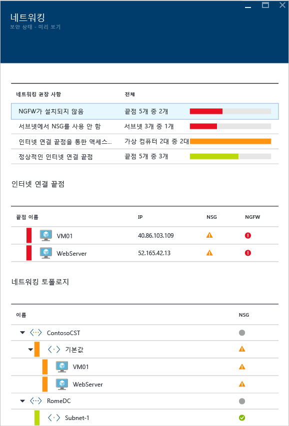
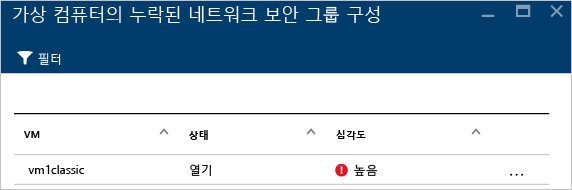
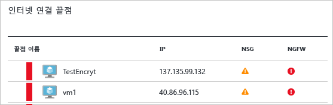
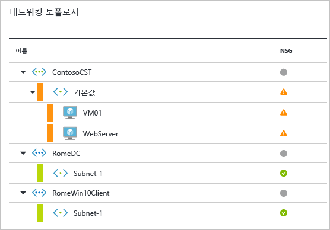
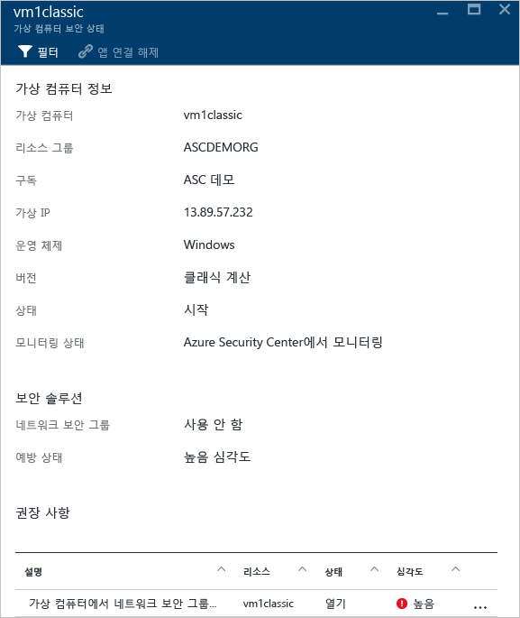

# Azure Security Center에서 보안 상태 모니터링
이 문서는 Azure Security Center의 모니터링 기능을 사용하여 정책 준수를 모니터링하는 데 도움이 됩니다.

## 보안 상태 모니터링이란?
상황에 대응할 수 있도록 이벤트가 발생할 때까지 이벤트를 감시하면서 기다리는 것을 모니터링이라고 생각하는 경우가 많습니다. 보안 모니터링은 리소스를 감사하여 조직의 표준 또는 모범 사례를 충족하지 않는 시스템을 식별하는 사전 예방 전략을 의미합니다.

## 보안 상태 모니터링
구독의 리소스에 대해 [보안 정책](security-center-policies.md)을 사용하도록 설정하면 보안 센터에서 리소스의 보안을 분석하여 잠재적 취약성을 식별합니다. 네트워크 구성 정보는 즉시 이용할 수 있지만, 에이전트가 설치된 VM 및 컴퓨터 수에 따라 VM 및 컴퓨터의 구성에 대한 정보(예: 보안 업데이트 상태 및 운영 체제 구성)를 수집하여 사용할 수 있게 하는 데 한 시간 이상이 걸릴 수 있습니다. **방지** 섹션에서 리소스 보안 상태 및 문제를 볼 수 있습니다. **권장 사항** 타일에서도 해당 문제 목록을 볼 수 있습니다.

권장 사항을 적용하는 방법에 대한 자세한 내용은 [Azure Security Center에서 보안 권장 사항 구현](security-center-recommendations.md)을 참조하세요.

**리소스 상태 모니터링**에서 리소스의 보안 상태를 모니터링할 수 있습니다. 다음 예제에서 각 리소스의 타일(계산 및 앱, 네트워킹, 데이터 보안 및 ID 및 액세스)에 식별된 문제의 총 수가 있음을 확인할 수 있습니다.

### 계산 및 앱 모니터링
자세한 내용은 [Azure Security Center에서 가상 머신 및 응용 프로그램 보호](security-center-virtual-machine-recommendations.md)를 참조하세요.

### 가상 네트워크 모니터링
**네트워킹** 타일을 클릭하면 아래와 같이 자세한 내용을 포함한 **네트워킹** 블레이드가 열립니다.

#### 네트워킹 권장 사항
가상 머신 리소스 상태 정보와 마찬가지로 위쪽에서 요약된 문제 목록이 표시되고 아래쪽에서 모니터링된 네트워크 목록이 표시됩니다.

네트워킹 상태 분석 섹션은 잠재적인 보안 문제를 나열하고 [권장 사항](security-center-network-recommendations.md)을 제공합니다. 가능한 문제는 다음을 포함할 수 있습니다.

* 차세대 방화벽(NGFW)이 설치되지 않음
* 서브넷에서 NSG(네트워크 보안 그룹) 사용 안 함
* VM에서 NSG 사용 안 함
* 공용 외부 끝점을 통한 외부 액세스 제한
* 정상 인터넷 연결 끝점

권장 사항 중 하나를 클릭하면 다음 예제와 같이 권장 사항에 대한 자세한 내용이 표시됩니다.

이 예에서 **서브넷에 누락된 네트워크 보안 그룹 구성**에는 네트워크 보안 그룹 보호가 누락된 서브넷 및 가상 머신의 목록이 있습니다. 네트워크 보안 그룹을 적용하려는 서브넷을 클릭하면 **네트워크 보안 그룹 선택**이 표시됩니다. 여기에서 서브넷에 적절한 네트워크 보안 그룹을 선택하거나 새 네트워크 보안 그룹을 만들 수 있습니다.

#### 인터넷 연결 끝점 섹션
**인터넷 연결 끝점** 섹션에서 현재 인터넷 연결 끝점으로 구성된 VM 및 해당 현재 상태를 볼 수 있습니다.

이 테이블에는 VM, 인터넷 연결 IP 주소, NSG 및 NGFW의 현재 심각도 상태를 보여 주는 끝점 이름이 있습니다. 다음과 같이 심각도 별로 테이블이 정렬됩니다.

* 빨간색(최우선): 높은 우선 순위이며 즉시 해결해야 합니다.
* 주황색: 보통 우선 순위이며 가능한 한 빨리 해결해야 합니다.
* 녹색(마지막): 정상 상태

#### 네트워킹 토폴로지 섹션
**네트워킹 토폴로지** 섹션에는 아래와 같이 계층적인 리소스 보기가 있습니다.

다음과 같이 심각도 별로 테이블이 정렬됩니다(VM 및 서브넷).

* 빨간색(최우선): 높은 우선 순위이며 즉시 해결해야 합니다.
* 주황색: 보통 우선 순위이며 가능한 한 빨리 해결해야 합니다.
* 녹색(마지막): 정상 상태

이 토폴로지 보기에서 첫 번째 수준에는 [가상 네트워크](../virtual-network/virtual-networks-overview.md), [가상 네트워크 게이트웨이](/vpn-gateway/vpn-gateway-site-to-site-create.md) 및 [가상 네트워크(클래식)](/virtual-network/virtual-networks-create-vnet-classic-pportal.md)가 있습니다. 두 번째 수준에는 서브넷이 있고, 세 번째 수준에는 해당 서브넷에 속하는 VM이 있습니다. 오른쪽 열에는 아래 예와 같이 해당 리소스의 NSG 현재 상태가 있습니다.

이 블레이드의 아래 부분에는 위에서 설명한 것과 비슷한 해당 VM에 대한 권장 사항이 있습니다. 권장 사항을 클릭하여 필요한 보안 제어 또는 구성을 자세히 알아보거나 적용할 수 있습니다.

### 데이터 보안 모니터링

**방지** 섹션에서 **데이터 보안**을 클릭하면 SQL 및 Storage에 대한 권장 사항이 포함된 **데이터 리소스**가 열립니다. 또한 데이터베이스의 일반 성능 상태에 대한 [권장 사항](security-center-sql-service-recommendations.md)이 있습니다. 저장소 암호화에 대한 자세한 내용은 [Azure Security Center에서 Azure Storage 계정에 대한 암호화 사용](security-center-enable-encryption-for-storage-account.md)을 참고하세요.

**SQL 권장 사항**에서 권장 사항을 클릭하고 추가 조치에 대한 자세한 정보를 가져오면 문제를 해결할 수 있습니다. 다음 예에서는 **SQL Database에서 데이터베이스 감사 및 위협 감지** 권장 사항의 확장을 보여 줍니다.

**SQL Database에서 감사 및 위협 감지 활성화**에는 다음과 같은 정보가 있습니다.

* SQL 데이터베이스의 목록
* 데이터베이스가 위치한 서버
* 이 설정이 서버에서 상속됐는지 여부 또는 이 데이터베이스에서 고유한지 여부에 대한 정보
* 현재 상태
* 문제의 심각도

권장 사항을 처리하기 위하여 데이터베이스를 클릭하면 다음 화면과 같이 **감사 및 위협 감지**가 열립니다.

감사를 활성화하려면 **감사** 옵션에서 **켜기**를 선택합니다.

### ID 및 액세스 모니터링

자세한 내용은 [Azure Security Center에서 ID 및 액세스 모니터링](security-center-identity-access.md)을 참조하세요.

## 참고 항목
이 문서에서는 Azure Security Center의 모니터링 기능을 사용하는 방법을 살펴보았습니다. Azure Security Center에 대한 자세한 내용은 다음을 참조하세요.

* [Azure Security Center에서 보안 정책 설정](security-center-policies.md) - Azure Security Center에서 보안 설정을 구성하는 방법을 알아봅니다.
* [Azure Security Center에서 보안 경고 관리 및 대응](security-center-managing-and-responding-alerts.md) - 보안 경고를 관리하고 대응하는 방법을 알아봅니다.
* [Azure Security Center에서 파트너 솔루션 모니터링](security-center-partner-solutions.md) - 파트너 솔루션의 상태를 모니터링하는 방법을 알아봅니다.
* [Azure Security Center FAQ](security-center-faq.md) - 서비스 사용에 관한 질문과 대답을 찾습니다.
* [Azure 보안 블로그](http://blogs.msdn.com/b/azuresecurity/) - Azure 보안 및 규정 준수에 관한 블로그 게시물을 찾습니다.
