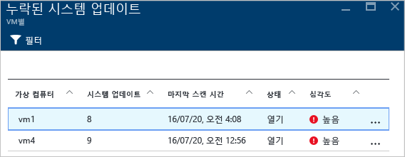
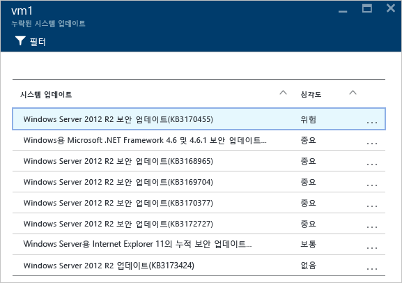
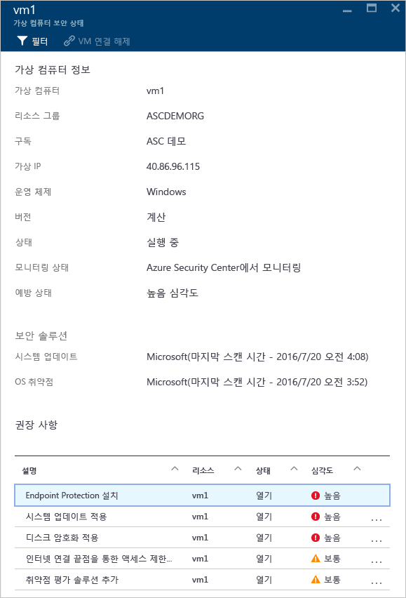
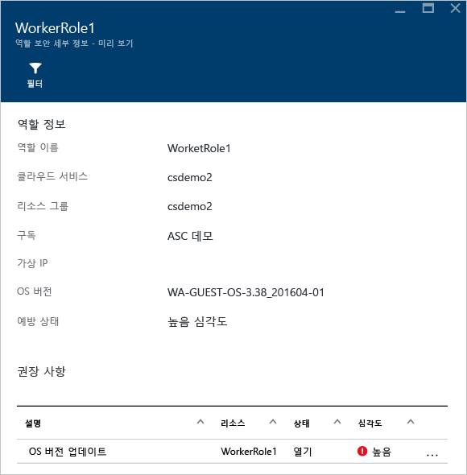
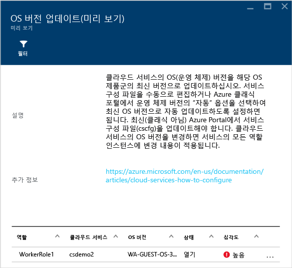
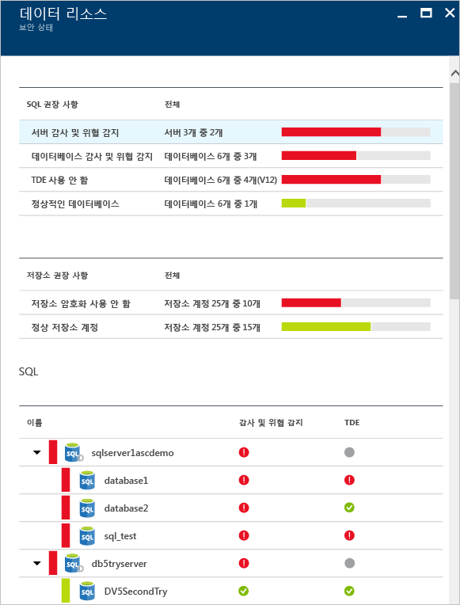
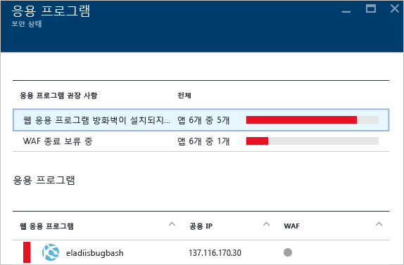
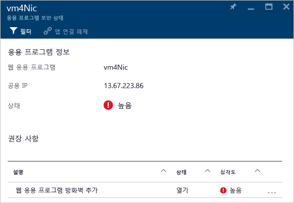
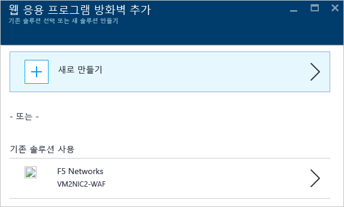

# Azure Security Center에서 보안 상태 모니터링
이 문서는 Azure Security Center의 모니터링 기능을 사용하여 정책 준수를 모니터링하는 데 도움이 됩니다.

## 보안 상태 모니터링이란?
상황에 대응할 수 있도록 이벤트가 발생할 때까지 이벤트를 감시하면서 기다리는 것을 모니터링이라고 생각하는 경우가 많습니다. 보안 모니터링은 리소스를 감사하여 조직의 표준 또는 모범 사례를 충족하지 않는 시스템을 식별하는 사전 예방 전략을 의미합니다.

## 보안 상태 모니터링
구독의 리소스에 대해 [보안 정책](security-center-policies.md)을 사용하도록 설정하면 보안 센터에서 리소스의 보안을 분석하여 잠재적 취약성을 식별합니다. 네트워크 구성 정보는 즉시 이용할 수 있지만, 보안 업데이트 상태, OS 구성 등 VM(가상 컴퓨터) 구성 정보를 이용하는 데에는 1시간 이상이 걸립니다. **리소스 보안 상태** 블레이드에서 리소스 보안 상 및 모든 문제를 볼 수 있습니다. **권장 사항** 블레이드에서도 이러한 문제 목록을 볼 수 있습니다.

권장 사항을 적용하는 방법에 대한 자세한 내용은 [Azure Security Center에서 보안 권장 사항 구현](security-center-recommendations.md)을 참조하세요.

**리소스 보안 상태** 타일에서 리소스 보안 상태를 모니터링할 수 있습니다. 아래 예제와 같이 높거나 보통 수준의 심각도이며 주의가 필요한 여러 문제를 확인할 수 있습니다. 활성화된 보안 정책은 모니터링되는 컨트롤 유형에 영향을 줍니다.

보안 센터에서 보안 업데이트가 누락된 VM 또는 [네트워크 보안 그룹](/virtual-network/virtual-networks-nsg.md)에 속하지 않은 서브넷과 같이 조치가 필요한 취약점을 확인한 경우 이 타일에서 해당 보안 상태를 나열합니다.

### 모니터 계산
**리소스 보안 상태** 타일에서 **계산**을 클릭하면 **계산** 블레이드가 열리고 다음과 같은 세 가지 탭이 표시됩니다.

- **개요**: 모니터링 및 가상 컴퓨터 권장 사항입니다.
- **Virtual Machines**: 모든 가상 컴퓨터와 현재 보안 상태를 나열합니다.
- **Cloud Services**: Security Center에서 모니터링하는 모든 웹 및 작업자 역할의 목록을 나열합니다.

각 탭에는 여러 섹션이 있으며, 각 섹션에서 개별 옵션을 선택하면 특정 문제를 해결하는 권장 단계에 관한 자세한 내용을 볼 수 있습니다. 

#### 권장 사항 모니터링
이 섹션은 데이터 수집을 위해 초기화된 VM의 총 수 및 현재 상태를 보여 줍니다. 모든 VM에서 데이터 수집이 초기화되면 보안 센터 보안 정책을 수신할 준비가 됩니다. 이 항목을 클릭하면 **VM 에이전트가 없거나 응답하지 않습니다** 블레이드가 열립니다. 

#### 가상 컴퓨터 권장 사항
이 섹션에는 Azure Security Center에서 모니터링하는 [각 VM에 대한 권장 사항](security-center-virtual-machine-recommendations.md)이 있습니다. 첫 번째 열에는 권장 사항이 나열되고, 두 번째 열에는 해당 권장 사항으로 영향을 받은 VM의 총 수가 표시되며, 세 번째 열에는 아래와 같이 문제의 심각도가 표시됩니다.

> [!NOTE]
> 공용 끝점이 하나 이상 있는 VM은 **네트워크 토폴로지** 목록의 **네트워킹 상태** 블레이드에 표시됩니다.
>
>

각 권장 사항에는 클릭하면 수행되는 작업 집합이 있습니다. 예를 들어 **누락된 시스템 업데이트**를 클릭하면 **누락된 시스템 업데이트** 블레이드가 열립니다. 아래와 같이 패치를 누락한 VM 및 누락된 업데이트의 심각도를 나열합니다.

**누락된 시스템 업데이트** 블레이드의 테이블에서 보여 주는 정보는 다음과 같습니다.

* **가상 컴퓨터**: 업데이트가 누락된 가상 컴퓨터의 이름입니다.
* **시스템 업데이트**: 누락된 시스템 업데이트의 수입니다.
* **마지막 검사 시간**: 보안 센터에서 업데이트를 위해 마지막으로 VM을 검사한 시간입니다.
* **상태**: 권장 사항의 현재 상태입니다.
  * **열기**: 아직 해결되지 않은 권장 사항이 있습니다.
  * **진행 중**: 현재 권장 사항이 해당 리소스에 적용되고 있으며 아무런 작업도 수행할 필요가 없습니다.
  * **해결됨**: 권장 사항이 이미 완료되었습니다. 문제가 해결되었으면 해당 항목이 회색으로 표시됩니다.
* **심각도**: 특정 권장 사항의 심각도를 설명합니다.
  * **높음**: 중요한 리소스(응용 프로그램, VM 또는 네트워크 보안 그룹)에 취약점이 있으며 주의가 필요합니다.
  * **보통**: 프로세스를 완료하거나 취약점을 제거하는 데 필요한 중요하지 않거나 추가하는 단계입니다.
  * **낮음**: 취약점을 해결해야 하지만 즉각적인 주의가 필요하지 않습니다. (기본적으로 낮은 권장 사항은 표시되지 않지만 보려는 경우 낮은 권장 사항으로 필터링할 수 있습니다.)

권장 사항 세부 정보를 보려면 해당하는 VM 이름을 클릭합니다. 아래와 같이 업데이트 목록을 포함한 해당 VM에 대한 새 블레이드가 열립니다.

> [!NOTE]
> 여기와 **권장 사항** 블레이드에서 보여 주는 보안 권장 사항은 서로 동일합니다. 권장 사항 해결에 대한 자세한 내용은 [Azure Security Center에서 보안 권장 사항 구현](security-center-recommendations.md)을 참조하세요. 이 내용은 VM뿐 아니라 **리소스 상태** 타일에서 제공되는 모든 리소스에도 적용할 수 있습니다.
>
>

#### 가상 컴퓨터 섹션
이 섹션에서는 모든 VM과 권장 사항에 대한 개요를 제공합니다. 각 열에는 아래와 같이 일단의 권장 사항이 표시됩니다.

각 권장 사항에 표시되는 아이콘은 주의를 기울여야 하는 VM 및 권장 사항의 형식을 식별하는 데 도움이 됩니다.

위 예에서 VM 한 대에는 끝점 보호에 관한 중요한 권장 사항이 있습니다. VM에 대한 자세한 정보를 가져오려면 해당 VM을 클릭합니다. 아래와 같이 이 VM을 나타내는 새 블레이드가 열립니다.

이 블레이드에는 VM에 대한 보안 세부 정보가 있습니다. 이 블레이드의 하단에서 권장되는 작업과 각 문제의 심각도를 볼 수 있습니다.

#### 클라우드 서비스 섹션
클라우드 서비스에는 운영 체제 버전이 오래된 경우 아래의 스크린샷과 같이 권장 사항이 표시됩니다.

권장 사항(이전 예제에는 해당되지 않음)이 있는 시나리오의 경우 권장 사항의 단계를 따라 운영 체제 버전을 업데이트해야 합니다. 업데이트를 사용할 수 있는 경우 경고가 표시됩니다(문제의 심각도에 따라 빨간색 또는 주황색). IIS에 자동으로 배포된 웹앱으로 Windows Server를 실행하는 WebRole1 또는 WorkerRole1 행에 있는 이 경고를 클릭하면 아래와 같이 해당 권장 사항에 대한 자세한 정보를 포함한 새 블레이드가 열립니다.

이 권장 사항에 대한 설명을 단계적으로 자세히 보려면 **설명** 열에서 **OS 버전 업데이트**를 클릭합니다. 자세한 내용을 포함한 **OS 버전 업데이트(미리 보기)** 블레이드가 열립니다.

  

### 가상 네트워크 모니터링
**리소스 보안 상태** 타일에서 **네트워킹**을 클릭하면 아래와 같이 자세한 내용을 포함한 **네트워킹** 블레이드가 열립니다.

#### 네트워킹 권장 사항
가상 컴퓨터 리소스 상태 정보와 마찬가지로 이 블레이드는 위쪽에서 요약된 문제 목록을 제공하고 아래쪽에서 모니터링된 네트워크 목록을 제공합니다.

네트워킹 상태 분석 섹션은 잠재적인 보안 문제를 나열하고 [권장 사항](security-center-network-recommendations.md)을 제공합니다. 가능한 문제는 다음을 포함할 수 있습니다.

* 차세대 방화벽(NGFW)이 설치되지 않음
* 서브넷에서 NSG(네트워크 보안 그룹) 사용 안 함
* VM에서 NSG 사용 안 함
* 공용 외부 끝점을 통한 외부 액세스 제한
* 정상 인터넷 연결 끝점

권장 사항 중 하나를 클릭하면 새 블레이드가 열리고 아래와 같이 권장 사항에 대한 자세한 내용을 보여 줍니다.

이 예에서 **서브넷에 누락된 네트워크 보안 그룹 구성** 블레이드에는 NSG 보호가 누락된 서브넷 및 가상 컴퓨터의 목록이 있습니다. NSG를 적용하려는 서브넷을 클릭하면 다른 블레이드가 열립니다.

**네트워크 보안 그룹 선택** 블레이드에서 서브넷에 적절한 네트워크 보안 그룹을 선택하거나 새 네트워크 보안 그룹을 만들 수 있습니다.

#### 인터넷 연결 끝점 섹션
**인터넷 연결 끝점** 섹션에서 현재 인터넷 연결 끝점으로 구성된 VM 및 해당 현재 상태를 볼 수 있습니다.

이 테이블에는 VM, 인터넷 연결 IP 주소, NSG 및 NGFW의 현재 심각도 상태를 보여 주는 끝점 이름이 있습니다. 다음과 같이 심각도 별로 테이블이 정렬됩니다.

* 빨간색(최우선): 높은 우선 순위이며 즉시 해결해야 합니다.
* 주황색: 보통 우선 순위이며 가능한 한 빨리 해결해야 합니다.
* 녹색(마지막): 정상 상태

#### 네트워킹 토폴로지 섹션
**네트워킹 토폴로지** 섹션에는 아래와 같이 계층적인 리소스 보기가 있습니다.

다음과 같이 심각도 별로 테이블이 정렬됩니다(VM 및 서브넷).

* 빨간색(최우선): 높은 우선 순위이며 즉시 해결해야 합니다.
* 주황색: 보통 우선 순위이며 가능한 한 빨리 해결해야 합니다.
* 녹색(마지막): 정상 상태

이 토폴로지 보기에서 첫 번째 수준에는 [가상 네트워크](../virtual-network/virtual-networks-overview.md), [가상 네트워크 게이트웨이](/vpn-gateway/vpn-gateway-site-to-site-create.md) 및 [가상 네트워크(클래식)](/virtual-network/virtual-networks-create-vnet-classic-pportal.md)가 있습니다. 두 번째 수준에는 서브넷이 있고, 세 번째 수준에는 해당 서브넷에 속하는 VM이 있습니다. 오른쪽 열에는 아래 예와 같이 해당 리소스의 NSG 현재 상태가 있습니다.

이 블레이드의 아래 부분에는 위에서 설명한 것과 비슷한 해당 VM에 대한 권장 사항이 있습니다. 권장 사항을 클릭하여 필요한 보안 제어 또는 구성을 자세히 알아보거나 적용할 수 있습니다.

### 데이터 모니터링

**리소스 보안 상태** 타일에서 **SQL 및 데이터**를 클릭할 때 SQL 및 저장소에 대한 권장 사항이 포함된 **데이터 리소스** 블레이드가 열립니다. 또한 데이터베이스의 일반 성능 상태에 대한 [권장 사항](security-center-sql-service-recommendations.md)이 있습니다. 저장소 암호화에 대한 자세한 내용은 [Azure Security Center에서 Azure Storage 계정에 대한 암호화 사용](security-center-enable-encryption-for-storage-account.md)을 참고하세요.

**SQL 권장 사항**에서 권장 사항을 클릭하고 추가 조치에 대한 자세한 정보를 가져오면 문제를 해결할 수 있습니다. 다음 예에서는 **SQL Database에서 데이터베이스 감사 및 위협 감지** 권장 사항의 확장을 보여 줍니다.

**SQL Database에서 감사 및 위협 감지 활성화** 블레이드에는 다음과 같은 정보가 있습니다.

* SQL 데이터베이스의 목록
* 데이터베이스가 위치한 서버
* 이 설정이 서버에서 상속됐는지 여부 또는 이 데이터베이스에서 고유한지 여부에 대한 정보
* 현재 상태
* 문제의 심각도

권장 사항을 처리하기 위하여 데이터베이스를 클릭하면 다음 화면과 같이 **감사 및 위협 감지** 블레이드가 열립니다.

감사를 활성화하려면 **감사** 옵션에서 **켜기**를 선택합니다.

### 응용 프로그램 모니터링

[노출된 웹 포트(80 및 443 TCP 포트)가 있는 VM(Azure Resource Manager를 통해 만듦)](../azure-resource-manager/resource-manager-deployment-model.md)에 있는 응용 프로그램이 Azure 워크로드에 있는 경우 보안 센터에서는 해당 응용 프로그램을 모니터링하여 잠재적 보안 문제를 파악하고 수정 조치를 권장할 수 있습니다. **응용 프로그램** 타일을 클릭하면 아래와 같이 **응용 프로그램** 블레이드가 열리고 **응용 프로그램 권장 사항** 섹션에 일련의 권장 사항을 보여 줍니다. 또한 호스트/가상 IP 별 응용 프로그램 분석 결과도 보여 줍니다.

앞에서 다른 권장 사항으로 수행한 것처럼 권장 사항을 클릭하여 문제에 대한 자세한 정보와 해결하는 방법을 확인할 수 있습니다. 아래 예는 안전하지 않은 웹 응용 프로그램으로 식별된 응용 프로그램을 보여 주는 그림입니다. 안전하지 않은 것으로 간주되는 응용 프로그램을 선택하면 또 다른 블레이드가 열려 다음과 같은 옵션을 제공합니다.

이 블레이드에는 해당 응용 프로그램에 대한 모든 권장 사항을 보여 주는 목록이 있습니다. **웹 응용 프로그램 방화벽 추가** 권장 사항을 클릭하면 아래와 같이 타사 WAF(웹 응용 프로그램 방화벽)를 설치할 수 있는 옵션을 포함한 **웹 응용 프로그램 방화벽 추가** 블레이드가 열립니다.

## 참고 항목
이 문서에서는 Azure Security Center의 모니터링 기능을 사용하는 방법을 살펴보았습니다. Azure 보안 센터에 대한 자세한 내용은 다음을 참조하세요.

* [Azure Security Center에서 보안 정책 설정](security-center-policies.md) - Azure Security Center에서 보안 설정을 구성하는 방법을 알아봅니다.
* [Azure Security Center에서 보안 경고 관리 및 대응](security-center-managing-and-responding-alerts.md) - 보안 경고를 관리하고 대응하는 방법을 알아봅니다.
* [Azure Security Center에서 파트너 솔루션 모니터링](security-center-partner-solutions.md) - 파트너 솔루션의 상태를 모니터링하는 방법을 알아봅니다.
* [Azure Security Center FAQ](security-center-faq.md) - 서비스 사용에 관한 질문과 대답을 찾습니다.
* [Azure 보안 블로그](http://blogs.msdn.com/b/azuresecurity/) - Azure 보안 및 규정 준수에 관한 블로그 게시물을 찾습니다.

