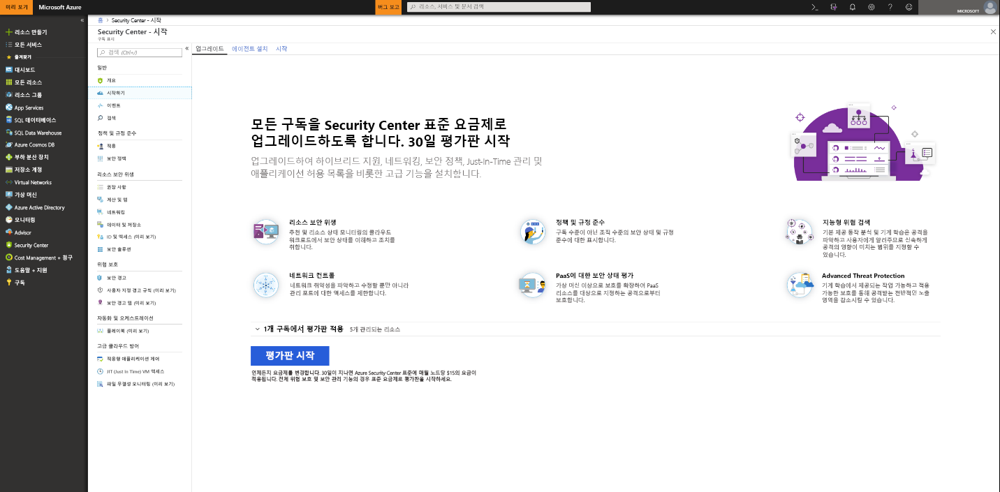
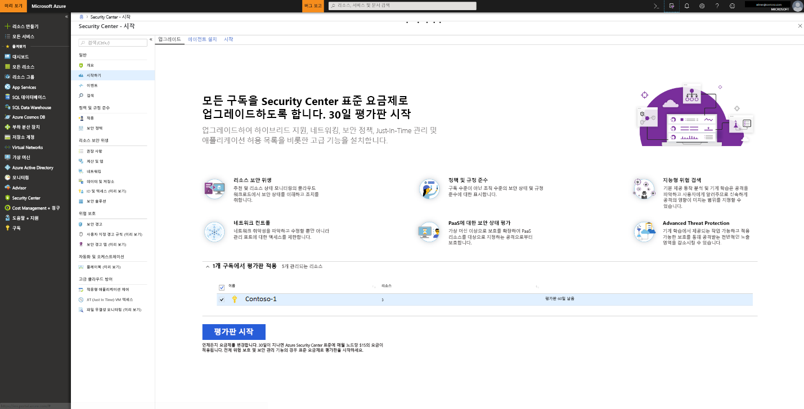

# 보안 개선을 위해 Azure Security Center 표준 계층으로 온보딩
Security Center 표준 계층으로 업그레이드하면 하이브리드 클라우드 작업을 위해 강화된 보안 관리 및 위협 방지 기능을 활용할 수 있습니다.  표준 평가판을 사용해 볼 수 있습니다. 자세한 내용은 Security Center [가격 책정 페이지](https://azure.microsoft.com/pricing/details/security-center/)를 참조하세요.

Security Center 표준 계층에는 다음 기능이 포함됩니다.

- **하이브리드 보안** – 모든 온-프레미스 및 클라우드 작업에 걸쳐 보안을 통합 확인할 수 있습니다. 또한 보안 정책을 적용하고 하이브리드 클라우드 작업의 보안을 지속적으로 평가하여 보안 표준을 준수할 수 있습니다. 뿐만 아니라 방화벽 및 기타 파트너 솔루션을 포함한 다양한 소스에서 보안 데이터를 수집, 검색 및 분석할 수 있습니다.
- **고급 위협 검색** - 고급 분석 및 Microsoft Intelligent Security Graph를 사용하여 갈수록 발전하는 사이버 공격을 효율적으로 대응할 수 있습니다.  기본 제공 행동 분석 및 Machine Learning을 활용하여 공격 및 제로 데이 익스플로잇을 식별할 수 있습니다. 또한 네트워크, 컴퓨터 및 클라우스 서비스에서 들어오는 공격 및 위반 후 활동을 모니터링할 수 있습니다. 대화형 도구 및 상황에 맞는 위협 인텔리전스를 사용하면 조사를 손쉽게 수행할 수 있습니다.
- **액세스 및 애플리케이션 컨트롤** - Machine Learning을 통해 제공되며 특정 작업에 맞게 조정되는 허용 목록 권장 사항을 적용하여 맬웨어 및 기타 원치 않는 애플리케이션을 차단할 수 있습니다. Azure VM의 관리 포트에 대한 제어되는 Just-In-Time 액세스를 사용하여 네트워크 공격에 대한 취약성을 낮춤으로써 무차별 암호 대입 공격(brute force attack) 및 기타 네트워크 공격에 대한 노출을 크게 줄일 수 있습니다.

## 보호되지 않는 리소스 검색     
Security Center에서는 Security Center 표준 계층이 적용되지 않은 모든 Azure 구독이나 작업 영역을 자동으로 검색합니다. 여기에는 Security Center 무료 계층을 사용하는 Azure 구독과 보안 솔루션이 사용하도록 설정되지 않은 작업 영역이 포함됩니다.

전체 Azure 구독을 구독 내에서 모든 지원 되는 리소스에 의해 상속 된 표준 계층으로 업그레이드할 수 있습니다. 표준 적용 계층 작업 영역에 작업 영역에 보고 하는 모든 리소스에 적용 됩니다.

> [!NOTE]
> 특정 에이전트 집합으로 제한하여 비용을 관리하고 솔루션에 대해 수집되는 데이터 양을 제한할 수 있습니다. [솔루션 대상](../operations-management-suite/operations-management-suite-solution-targeting.md)을 사용하면 솔루션에 범위를 적용하고 작업 영역의 컴퓨터 하위 집합을 대상으로 지정할 수 있습니다.  솔루션 대상을 사용하는 경우 Security Center에는 작업 영역에 솔루션이 없는 것으로 표시됩니다.
>
>

## Azure 구독 또는 작업 영역 업그레이드
구독 또는 작업 영역을 표준으로 업그레이드하려면:
1. Security Center 주 메뉴에서 **시작하기**를 선택합니다.
  
2. **업그레이드** 아래에 Security Center가 온보딩할 수 있는 구독 및 작업 영역을 나열합니다. 
   - 확장 가능한 **Apply your trial**(평가판 적용)을 클릭하여 평가판 사용 자격이 있는 모든 구독 및 작업 영역 목록을 표시할 수 있습니다.
   -    평가판 사용 자격이 없는 구독 및 작업 영역은 업그레이드할 수 있습니다.
   -    평가판 사용 자격이 있는 작업 영역 및 구독을 선택하여 평가판을 시작할 수 있습니다.
3.  **평가판 시작**을 클릭하여 선택한 구독에서 평가판을 시작할 수 있습니다.
  

   > [!NOTE]
   > Security Center의 무료 기능은 Azure Vm 및 VMSS에만 적용 됩니다. 즉, 비 Azure 컴퓨터에는 무료 기능이 적용되지 않습니다. 표준을 선택 하면 모든 Azure Vm, VM scale sets 및 작업 영역에 보고 하는 비 Azure 컴퓨터에 표준 기능이 적용 됩니다. 그러므로 Azure 및 비 Azure 리소스에 고급 보안을 제공하려는 경우 표준을 적용하는 것이 좋습니다.
   >
   >

## 비 Azure 컴퓨터 온보딩
Security Center에서 비 Azure 컴퓨터의 보안 태세를 모니터링할 수는 있지만, 그러려면 먼저 이러한 리소스를 온보딩해야 합니다. **시작하기** 블레이드나 **계산** 블레이드에서 비 Azure 컴퓨터를 추가할 수 있습니다. 여기서는 두 방법에 대해 모두 설명합니다.

### **시작하기**에서 새로운 비 Azure 컴퓨터 추가

1. **시작하기**으로 돌아갑니다.   
2. **시작하기** 탭을 선택합니다.

   

3. **새 비 Azure 컴퓨터 추가**에서 **구성**을 클릭합니다. Log Analytics 작업 영역 목록이 표시됩니다. 이 목록에는 자동 프로비저닝을 사용하는 경우 Security Center에서 자동으로 생성되는 기본 작업 영역이 포함됩니다(해당하는 경우). 이 작업 영역이나 사용할 다른 작업 영역을 선택합니다.

   ![비 Azure 컴퓨터 추가][7]

기존 작업 영역이 있으면 **새로운 비 Azure 컴퓨터 추가** 아래에 나열됩니다. 컴퓨터를 기존 작업 영역에 추가하거나 새 작업 영역을 만들 수 있습니다. 새 작업 영역을 만들려면 **새 작업 영역 추가** 링크를 선택합니다.

### **계산**에서 새로운 비 Azure 컴퓨터 추가

**새 작업 영역을 만들고 컴퓨터 추가**

1. **새로운 비 Azure 컴퓨터 추가** 아래에서 **새 작업 영역 추가**를 선택합니다.

   ![새 작업 영역 추가][4]

2. **보안 및 감사** 아래에서 **OMS 작업 영역**을 선택하여 새 작업 영역을 만듭니다.
   > [!NOTE]
   > OMS 작업 영역을 이제 Log Analytics 작업 영역이라고 합니다.
3. **OMS 작업 영역** 아래에 작업 영역에 대한 정보를 입력합니다.
4. **OMS 작업 영역** 아래에서 **확인**을 선택합니다.  확인을 선택하고 나면 Windows 또는 Linux 에이전트 및 이러한 에이전트를 구성할 때 사용할 작업 영역 ID용 키를 다운로드할 수 있는 링크가 표시됩니다.
5. **보안 및 감사** 아래에서 **확인**을 선택합니다.

**기존 작업 영역을 선택하고 컴퓨터 추가**

위에 나와 있는 것처럼 **온보딩**의 워크플로에 따라 컴퓨터를 추가할 수 있습니다. **계산**의 워크플로에 따라 컴퓨터를 추가할 수도 있습니다. 이 예제에서는 **계산**을 사용합니다.

1. 보안 센터 주 메뉴의 **개요** 대시보드로 돌아옵니다.

   ![개요][5]

2. **계산 및 앱**을 선택합니다.
3. **계산 및 앱** 아래에서 **컴퓨터 추가**를 선택합니다.

   ![계산 블레이드][6]

4. **새로운 비 Azure 컴퓨터 추가** 아래에서 컴퓨터를 연결할 작업 영역을 선택하고 **컴퓨터 추가**를 클릭합니다.

   ![컴퓨터 추가][7]

   **직접 에이전트** 블레이드에서 Windows 또는 Linux 에이전트 및 에이전트를 구성할 때 사용할 작업 영역 ID 및 키를 다운로드할 수 있는 링크가 제공됩니다.   

## 다음 단계
이 문서에서는 Security Center의 고급 보안 혜택을 활용하기 위해 Azure 및 비 Azure 리소스를 온보딩하는 방법에 대해 알아보았습니다.  온보딩한 리소스에 대해 추가 작업을 수행하려면 다음 항목을 참조하세요.

- [데이터 수집 활성화](security-center-enable-data-collection.md)
- [위협 인텔리전스 보고서](security-center-threat-report.md)
- [Just-In-Time VM 액세스](security-center-just-in-time.md)

<!--Image references-->
[1]: ./media/security-center-onboarding/onboard.png
[2]: ./media/security-center-onboarding/onboard-subscription.png
[3]: ./media/security-center-onboarding/get-started.png
[4]: ./media/security-center-onboarding/create-workspace.png
[5]: ./media/security-center-onboarding/overview.png
[6]: ./media/security-center-onboarding/compute-blade.png
[7]: ./media/security-center-onboarding/add-computer.png
[8]: ./media/security-center-onboarding/onboard-workspace.png
