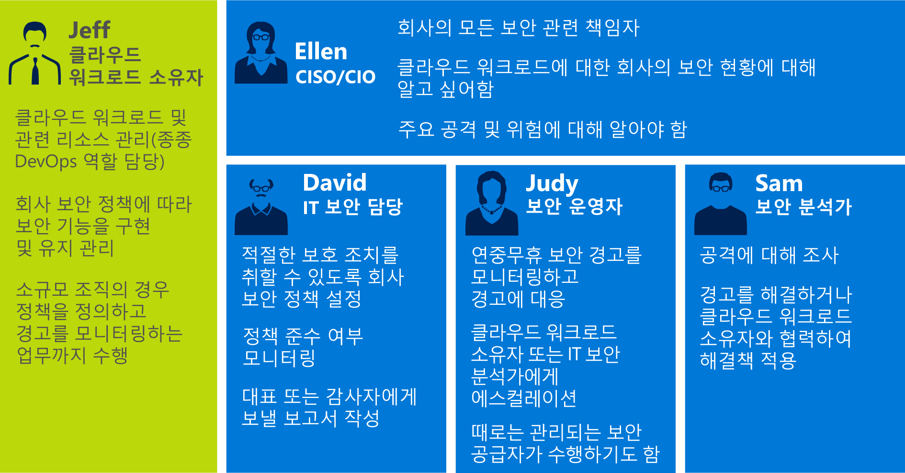
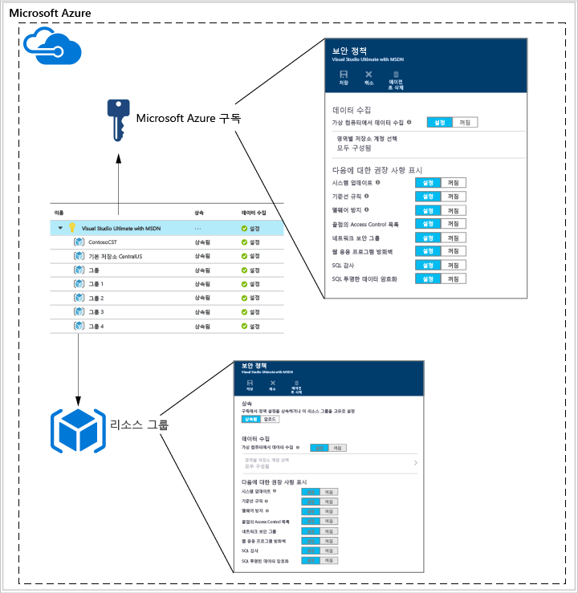
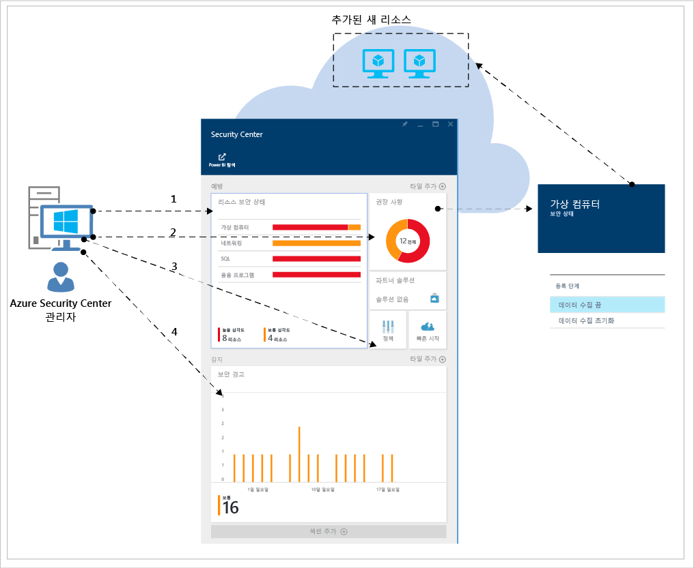
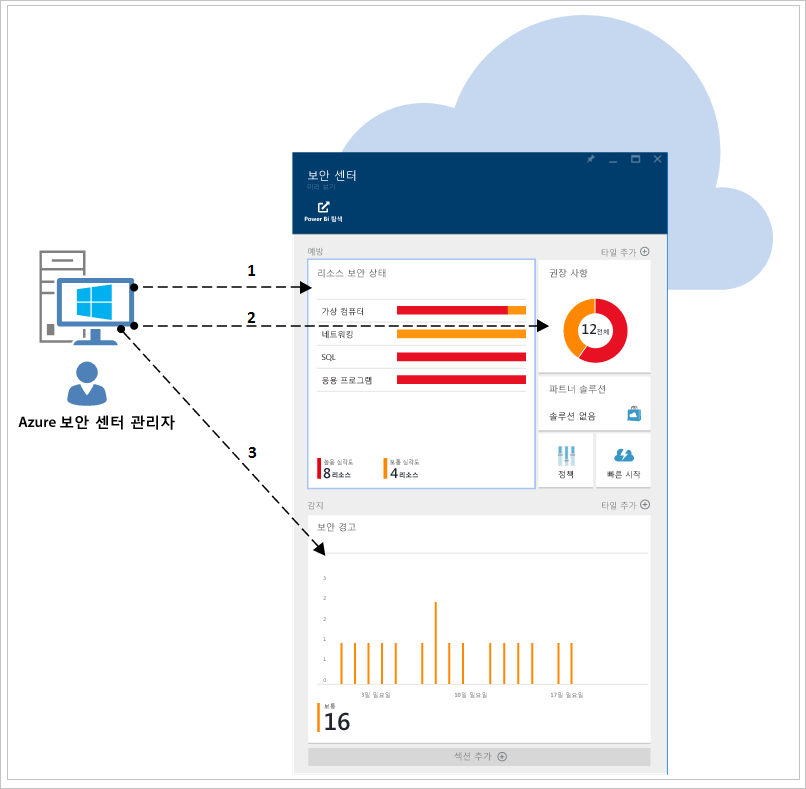

<properties
   pageTitle="보안 센터 계획 및 작업 가이드| Microsoft Azure"
   description="이 문서는 Azure 보안 센터 도입 전 계획과 일상 운영과 관련한 고려 사항을 지원합니다."
   services="security-center"
   documentationCenter="na"
   authors="YuriDio"
   manager="swadhwa"
   editor=""/>

<tags
   ms.service="security-center"
   ms.topic="hero-article"
   ms.devlang="na"
   ms.tgt_pltfrm="na"
   ms.workload="na"
   ms.date="09/22/2016"
   ms.author="yurid"/>

# Azure 보안 센터 계획 및 작업 가이드
이 가이드는 Azure Security Center의 사용을 계획 중인 정보 기술(IT) 전문가, IT 설계자, 정보 보안 분석가 및 클라우드 관리자를 대상으로 합니다.

## 계획 가이드
이 가이드에서는 조직의 보안 요구 사항과 클라우드 관리 모델에 따라 보안 센터의 사용을 최적화하기 위해 따를 수 있는 일련의 단계 및 작업을 다룹니다. Security Center를 완벽하게 활용하려면 조직의 서로 다른 개인 또는 팀이 보안 개발 및 운영, 모니터링, 관리 및 사고 대응 요구에 맞게 서비스를 사용하는 방법에 대해 이해하는 것이 중요합니다. 보안 센터의 사용을 계획할 때 고려할 주요 영역은 다음과 같습니다.

- 보안 역할 및 액세스 제어
- 보안 정책 및 권장 사항
- 데이터 수집 및 저장
- 지속적인 보안 모니터링
- 사고 대응

다음 섹션에서는 요구 사항에 따라 이러한 각각의 영역을 계획하고 권장 사항을 적용하는 방법에 대해 학습합니다.

> [AZURE.NOTE] [Azure 보안 센터 FAQ(질문과 대답)](security-center-faq.md)설계 및 계획 단계에서 유용할 수 있는 일반적인 질문의 목록을 읽어 보세요.

## 보안 역할 및 액세스 제어
조직의 규모와 구조에 따라, 여러 개인과 팀이 보안 센터를 통해 서로 다른 보안 관련 업무를 수행할 수 있습니다. 다음 다이어그램에는 가상의 사용자와 그 역할 및 보안 책임의 예가 나와 있습니다.

이러한 개인들은 보안 센터를 통해 다양한 책임에 부합할 수 있습니다. 예:

**Jeff(클라우드 워크로드 소유자)**

- 클라우드 워크로드와 관련 리소스를 관리
- 회사 보안 정책에 따라 보호를 구현하고 유지 관리하는 업무를 담당

**Ellen(CISO/CIO)**

- 회사의 모든 보안 업무를 담당
- 클라우드 워크로드에 걸쳐 회사의 보안 태세를 파악하고자 함
- 주요 공격 및 위험에 대해 숙지해야 함

**David(IT 보안)**

- 적절한 보호 조치가 마련되도록 회사 보안 정책을 설정
- 정책 준수 여부를 모니터링
- 경영진 또는 감사를 위한 보고서를 작성

**Judy(보안 운영)**

- 보안 경고를 연중무휴(24/7) 모니터링하고 대응
- 클라우드 워크로드 소유자 또는 IT 보안 분석가에게 보안 문제 제기

**Sam(보안 분석가)**

- 공격 여부 조사
- 경고를 해결하거나 클라우드 워크로드 소유자와 함께 해결책 적용

Security Center는 Azure에서 사용자, 그룹 및 서비스에 [기본 제공 역할](../active-directory/role-based-access-built-in-roles.md)을 제공하는 [RBAC(역할 기반 액세스 제어)](../active-directory/role-based-access-control-configure.md)를 사용합니다. 사용자가 Security Center를 열면 액세스한 리소스와 관련된 정보만 표시됩니다. 이는 구독 또는 리소스가 속한 리소스 그룹에 대한 소유자, 참가자 또는 읽기 권한자의 역할이 사용자에게 할당된다는 것을 의미합니다. 이전 다이어그램에 설명된 가상 사용자를 사용하는 경우 다음 RBAC가 필요합니다.

**Jeff(클라우드 워크로드 소유자)**

- 리소스 그룹 소유자/협업자

**David(IT 보안)**

- 구독 소유자/협업자

**Judy(보안 운영)**

- 구독 읽기 권한자(경고 보기에 필요)
- 구독 소유자/협업자(경고 해제에 필요)

**Sam(보안 분석가)**

- 구독 읽기 권한자(경고 보기에 필요)
- 구독 소유자/협업자(경고 해결 또는 해제에 필요)
- 저장소 액세스가 필요할 수 있음

고려가 필요한 몇 가지 다른 중요 정보:

- 구독 소유자 및 참가자만 보안 정책을 편집할 수 있음
- 구독 및 리소스 그룹 소유자 및 참가자만 리소스에 대한 보안 권장 사항을 적용할 수 있음

Security Center의 RBAC을 사용하여 액세스 제어를 계획하는 경우, Security Center를 사용할 조직 내 대상을 알아야 합니다. 또한 수행할 작업 유형을 확인한 다음 RBAC을 적합하게 구성합니다.

> [AZURE.NOTE] 사용자가 자신의 작업을 완료하는 데 필요한 최소한의 역할을 할당하는 것이 좋습니다. 예를 들어, 리소스의 보안 상태에 대한 정보를 보기만 하고 권장 사항 적용이나 정책 편집 등의 조치는 취하지 않는 사용자라면 읽기 권한자 역할을 할당해야 합니다.

## 보안 정책 및 권장 사항
보안 정책은 지정된 구독 또는 리소스 그룹 내에서 리소스에 대해 권장되는 제어 집합을 정의합니다. 보안 센터에서 회사의 보안 요구 사항 및 응용 프로그램 유형 또는 데이터 민감도에 따라 정책을 정의합니다.

구독 수준에서 실행된 정책은 다음 다이어그램에 표시된 것처럼 구독 내 모든 리소스 그룹에 자동으로 전파됩니다.

위의 그림에서처럼 리소스 그룹의 보안 정책은 구독 수준에서 상속될 수 있습니다.

리소스 그룹에 서로 다른 정책 집합이 필요한 리소스가 있는 시나리오에서는 상속을 사용하지 않게 설정하고 특정 리소스 그룹에 사용자 지정 정책을 적용할 수 있습니다.

특정 리소스 그룹에서 사용자 지정 정책에 필요한 경우 리소스 그룹에서 상속을 사용하지 않게 설정하고 보안 정책을 변경해야 합니다. 예를 들어 SQL 투명한 데이터 암호화(TDE) 정책이 필요하지 않은 워크로드의 경우, 구독 수준에서 정책을 해제하고 SQL TDE가 필요한 리소스 그룹에서만 사용하도록 설정합니다.

서로 다른 리소스 그룹에 대해 사용자 지정 정책을 만들 때는 먼저 정책이 충돌할 경우(구독과 리소스 그룹) 리소스 그룹 정책이 우선한다는 점을 이해하고 정책 배포를 계획해야 합니다.

> [AZURE.NOTE] 어떤 정책이 변경되었는지 검토가 필요한 경우 [Azure 감사 로그](https://blogs.msdn.microsoft.com/cloud_solution_architect/2015/03/10/audit-logs-for-azure-events/)를 사용할 수 있습니다. 정책 변경은 항상 Azure 감사 로그에 기록됩니다.

### 보안 권장 사항

보안 정책을 구성하기 전에 각각의 [보안 권장 사항](security-center-recommendations.md)을 검토하여 이들 정책이 다양한 구독 및 리소스 그룹에 적합한지 판단합니다. 또한 보안 권장 사항을 해결하기 위해 필요한 조치를 이해하는 것도 중요합니다.

**Endpoint Protection**: 가상 컴퓨터에 끝점 보호 솔루션이 없는 경우 Security Center에서 해당 솔루션을 설치하도록 권고합니다. 이미 온-프레미스에서 채택한 선호하는 끝점 보호 솔루션이 있는 경우 동일한 맬웨어 방지를 Azure VM에도 사용할지 결정해야 합니다. Security Center는 몇 가지 끝점 보호 옵션을 제공합니다. 무료 Microsoft 맬웨어 방지 프로그램을 사용 하거나, 통합 파트너가 제공하는 끝점 보호 솔루션 목록에서 하나를 선택할 수 있습니다. Security Center를 사용한 맬웨어 방지 프로그램 배포 방법에 대한 자세한 내용은 [Azure Security Center에 Endpoint Protection 설치](security-center-install-endpoint-protection.md)를 읽어보세요.

**시스템 업데이트**: Security Center는 IaaS 및 클라우드 서비스(PaaS)에 대한 보안 또는 중요 운영 체제 업데이트가 누락된 가상 컴퓨터를 식별합니다. 필요한 경우 누가 업데이트 적용을 담당하며 어떻게 적용할 것인지 고려합니다. 대부분의 조직에서는 WSUS, Windows 업데이트 또는 다른 도구를 사용합니다.

**기준 구성**: 가상 컴퓨터 운영 체제 구성이 권장 기준과 일치하지 않을 경우 권고가 표시됩니다. [여기](https://gallery.technet.microsoft.com/Azure-Security-Center-a789e335)에서 기준 집합을 검토하고 운영 체제 구성을 적용할 방법을 고려합니다.

**Disk Encryption**: 암호화되지 않은 가상 컴퓨터 디스크가 있는 경우 Security Center는 Azure Disk Encryption을 적용하도록 권장합니다. 이 기능은 Windows용 BitLocker와 Linux용 DM-Crypt를 활용하여 OS 및 데이터 디스크에 볼륨 암호화를 제공합니다. 이 권장 사항은 암호화 수행 방법에 대한 지침이 있는 [단계별 가이드](security-center-disk-encryption.md)로 리디렉션됩니다.

해결해야 할 몇 가지 암호화 시나리오가 있습니다. 다음과 같이 각 시나리오마다 고유한 요구 사항에 맞게 계획해야 합니다.

- 자체 암호화 키를 사용하여 암호화한 VHD에서 새 Azure 가상 컴퓨터 암호화
- 새 Azure 가상 컴퓨터의 Azure 갤러리에서 생성된 암호화
- 이미 Azure를 실행 중인 Azure 가상 컴퓨터 암호화

이 시나리오마다 요구 사항 계획이 각기 달라집니다. 이 시나리오 각각의 자세한 내용은 [Azure Disk Encryption 백서](https://gallery.technet.microsoft.com/Azure-Disk-Encryption-for-a0018eb0)를 참조하세요.

**웹 응용 프로그램 방화벽**: Security Center는 웹 응용 프로그램을 실행 중인 가상 컴퓨터를 식별하고 WAF(웹 응용 프로그램 방화벽)를 설치하도록 권장합니다. 사용 가능한 파트너 솔루션을 평가하여 조직에 가장 적합한 솔루션을 판단하고, 솔루션의 라이선스 부여 방법을 결정합니다(파트너가 자체 라이선스를 지원하거나 종량제 모델 사용). Security Center를 사용하여 Azure VM에서 웹 응용 프로그램 방화벽을 배포하는 방법에 대한 자세한 내용은 [Azure Security Center의 웹 응용 프로그램 방화벽 추가](security-center-add-web-application-firewall.md)를 참조하세요.

**차세대 방화벽**: Check Point를 포함한 Cisco 및 Fortinet 다음의 선두 공급 업체에게서 가상 어플라이언스를 프로비전할 수 있도록 합니다. Azure에 기본 제공되는 네트워크 보안 그룹 외에도 네트워크 보호 기능을 확장합니다. 보안 센터는 차세대 방화벽을 권장하는 배포를 검색하고 가상 어플라이언스를 프로비전할 수 있도록 합니다.

**가상 네트워킹**: Security Center는 [Azure Virtual Network](https://azure.microsoft.com/documentation/services/virtual-network/) 인프라 및 구성을 평가하여 [네트워크 보안 그룹](../virtual-network/virtual-networks-nsg.md)이 적용되었으며 인바운드 트래픽 규칙을 통해 올바르게 구성되었는지 확인합니다. 어떤 트래픽 규칙을 정의할 것인지 고려하고, 관련 보안 권장 사항을 적용하는 개인에게 이 내용을 알려야 합니다.

Security Center는 Azure 구독에 대한 보안 연락처 세부 정보를 제공하는 것을 권장합니다. 이 정보는 MSRC(Microsoft 보안 대응 센터)에서 불법적인 또는 권한 없는 당사자가 고객 데이터에 액세스한 것을 발견하는 경우 사용자에게 연락하기 위해 Microsoft에서 사용됩니다. 이 권장 사항을 사용하는 방법에 대한 자세한 내용은 [Azure Security Center에 보안 연락처 세부 정보 제공](security-center-provide-security-contact-details.md)을 참고하세요.

## 데이터 수집 및 저장

모든 VM에 대해 보안 모니터링을 사용할 수 있도록 각 구독에 데이터 수집을 설정하는 것이 좋습니다. 데이터 수집은 Azure 모니터링 에이전트(ASMAgentLauncher.exe) 및 Azure 보안 모니터링 확장(ASMMonitoringAgent.exe)을 통해 사용하도록 설정됩니다.

Azure 보안 모니터링 확장은 다양한 보안 관련 구성을 검색하고 가상 컴퓨터에서 보안 로그를 수집합니다. 이 데이터는 사용자가 지정한 저장소 계정으로 전송됩니다. 스캔 관리자 (ASMSoftwareScanner.exe)는 가상 컴퓨터에도 설치되며 패치 스캐너로 사용됩니다.

보안 정책에서 데이터 수집을 사용하도록 설정한 후에는 모니터링 에이전트와 확장이 Azure에서 프로비전되는 모든 기존 가상 컴퓨터와 지원되는 새 가상 컴퓨터에 자동으로 설치됩니다. 이 에이전트의 프로세스는 사용자 작업에 영향을 미치지 않으며 VM의 성능에도 영향이 없습니다.

> [AZURE.NOTE] Azure 보안 모니터링 에이전트 관련 문제를 해결하려면 [Azure Security Center 문제 해결 가이드](security-center-troubleshooting-guide.md)를 참고하세요.

데이터 수집을 사용하지 않으려는 특정 지점의 경우 보안 정책에서 수집을 해제할 수 있습니다. 이전에 배포한 모니터링 에이전트를 삭제하려면 에이전트 삭제 메뉴 옵션을 선택합니다.

> [AZURE.NOTE] 지원되는 VM 목록을 찾아보려면 [Azure Security Center FAQ(질문과 대답)](security-center-faq.md)를 읽어보세요.

가상 컴퓨터를 실행 중인 각 영역에 대해 가상 컴퓨터에서 수집한 데이터가 저장되는 저장소 계정을 선택합니다. 각 지역에 대한 저장소 계정을 선택하지 않으면, 사용자를 위해 계정이 생성됩니다. 지역별로 저장소 위치를 선택하거나 모든 정보를 중앙 위치에 저장할 수 있습니다. Azure 구독 수준 및 리소스 그룹 수준에서 보안 정책을 설정할 수 있지만 저장소 계정에 대한 지역은 구독 수준에서만 선택할 수 있습니다.

다른 Azure 리소스와 공유하는 저장소 계정의 경우 크기 제한 및 제약 사항에 대한 자세한 내용은 [Azure Storage 확장성 및 성능 목표](../storage/storage-scalability-targets.md) 문서를 읽어보세요. 구독에도 저장소 계정 제한이 있습니다. 이러한 제한에 대한 자세한 내용은 [Azure 구독 및 서비스 제한, 할당량 및 제약 조건](../azure-subscription-service-limits.md)을 확인하세요.

> [AZURE.NOTE] 이 저장소와 관련된 비용은 Security Center 서비스 가격에 포함되지 않으며, 별도로 일반 [Azure Storage 요금](https://azure.microsoft.com/pricing/details/storage/)이 부과됩니다.

Azure 환경 규모와 저장소 계정을 사용하는 리소스에 따라 성능 및 확장성 고려 사항도 계획해야 합니다. 자세한 내용은 [Microsoft Azure Storage 성능 및 확장성 검사 목록](../storage/storage-performance-checklist.md)을 참조하세요.

## 지속적인 보안 모니터링

보안 센터 권장 사항의 최초 구성과 적용 후에는 보안 센터 운영 프로세스를 고려합니다.

Azure 포털에서 Security Center에 액세스하려면 **찾아보기**를 클릭하고 **필터** 필드에 **Security Center**를 입력합니다. 사용자에게 나타나는 보기는 이렇게 적용된 필터에 따라 다릅니다.

Security Center는 일반 작동 프로시저를 방해하지 않으면서 배포를 소극적으로 모니터링하고 사용자가 설정한 보안 정책에 따라 권장 사항을 제공합니다.

Security Center 대시보드는 다음과 같이 두 주요 부분으로 나뉩니다.

- 방지
- 감지

Security Center에서 현재 Azure 환경에 대해 처음 데이터 수집을 사용하도록 설정할 때는 모든 권장 사항을 검토해야 합니다. 이 작업은 **권장 사항** 블레이드에서 또는 리소스별(**가상 컴퓨터**, **네트워킹**, **SQL** 및 **응용 프로그램**)로 수행할 수 있습니다.

모든 권장 사항을 해결한 후에는 해결된 모든 리소스에 대해 **방지** 섹션이 녹색이어야 합니다. 이 시점에서는 리소스 보안 상태와 권장 사항 타일에서의 변경 사항을 기준으로 조치를 취하면 되므로 지속적인 모니터링이 더 용이해집니다.

**감지** 섹션은 더 대응적인 부분으로, 지금 발생 중이거나 과거에 발생하여 Security Center 컨트롤과 타사 시스템에서 감지된 문제와 관련한 경고입니다. 보안 경고 타일은 매일 확인된 위협 감지의 수를 나타내는 막대 그래프와, 여러 심각도 카테고리(낮음, 중간, 높음) 간의 분포를 표시합니다. 보안 경고에 대한 자세한 내용은 [Azure Security Center에서 보안 경고 관리 및 대응](security-center-managing-and-responding-alerts.md)을 읽어보세요.

> [AZURE.NOTE] Microsoft Power BI를 활용하여 Security Center 데이터를 시각화할 수도 있습니다. [Power BI로 Azure Security Center 데이터에서 정보 얻기](security-center-powerbi.md)를 읽어보세요.

### 새 또는 변경된 리소스 모니터링

대부분의 Azure 환경은 동적이며, 새 리소스가 일정 기준, 구성 또는 변경에 따라 확장 및 분리됩니다. Security Center는 이러한 새 리소스의 보안 상태에 대한 정보를 얻는 데 도움이 됩니다.

Azure 환경에 새 리소스(VM, SQL DB)를 추가하면 보안 센터가 자동으로 해당 리소스를 감지하고 보안을 모니터링하기 시작합니다. 또한 PaaS 웹 역할 및 작업자 역할이 포함됩니다. [보안 정책](security-center-policies.md)에서 데이터 수집을 사용하도록 설정한 경우 가상 컴퓨터에 대해 추가적인 모니터링 기능이 자동으로 적용됩니다.

1.	가상 컴퓨터의 경우 **리소스 보안 상태** 타일에서 **가상 컴퓨터**를 클릭합니다. 데이터 수집을 사용하도록 설정하는 것과 관련한 문제나 관련 권장 사항은 **모니터링 권장 사항** 섹션에 표시됩니다.
2.	새 리소스에 대한 보안 위협이 있다면 무엇인지를 확인하기 위해 **권장 사항**을 봅니다.
3.	새 VM이 환경에 추가되면 운영 체제만 최초로 설치되는 것이 매우 일반적입니다. 리소스 소유자는 이러한 VM에서 사용할 다른 앱을 배포하는 데 다소 시간이 걸릴 수 있습니다. 이상적으로는 이 워크로드의 최종 목적을 파악하고 있어야 합니다. 응용 프로그램 서버가 됩니까? 이 새 워크로드의 용도에 따라 적합한 **보안 정책**을 사용하도록 설정할 수 있습니다. 바로 이 워크플로의 세 번째 단계입니다.
4.	새 리소스가 Azure 환경에 추가되면 **보안 경고** 타일에 새 경고가 표시될 수 있습니다. 항상 이 타일에 새 경고가 있는지 확인하고 보안 센터 권장 사항에 따라 조치를 취합니다.

또한 기존 리소스 상태를 정기적으로 모니터링하여 보안 위험을 초래하고 권장 기준에 미치지 못하는 구성 변경 내용과 보안 경고를 파악하고자 할 수 있습니다. 보안 센터 대시보드에서 시작합니다. 여기에서는 일관된 기준에 따라 3가지 주요 영역을 검토하게 됩니다.

1.	**리소스 보안 상태** 패널은 주요 리소스에 대한 신속한 액세스를 제공합니다. 이 옵션을 사용하여 가상 컴퓨터, 네트워크, SQL 및 응용 프로그램을 모니터링합니다.
2.	**권장 사항** 패널에서는 Security Center 권장 사항을 검토할 수 있습니다. 지속적인 모니터링이 이루어질 때는 매일 권장 사항이 있는 것이 아닙니다. 이것은 최초 보안 센터 설정 시 모든 권장 사항을 해결했기 때문에 정상입니다. 따라서 매일 이 섹션에 새 정보가 있는 것은 아니며 필요에 따라 액세스하면 됩니다.
3.	**감지** 패널은 매우 자주 또는 매우 드물게 변경될 수 있습니다. 항상 보안 경고를 검토하고 보안 센터 권장 사항에 따라 조치를 취합니다.

## 인시던트 대응

보안 센터는 위협이 발생하면 감지하여 사용자에게 경고합니다. 조직에서는 새 보안 경고를 모니터링하고 필요에 따라 조치를 통해 추가적인 조사를 수행하거나 공격에 대처해야 합니다. Security Center 위협 감지 기능이 작동하는 방법에 대한 자세한 내용은 [Azure Security Center 감지 기능](security-center-detection-capabilities.md)을 참고하세요.

이 문서가 인시던트 대응 계획을 직접 작성하는 데 도움을 주려는 목적은 아니지만 인스던트 대응 단계에 대한 기반으로 클라우드 수명 주기에 Microsoft Azure 보안 응답을 사용합니다. 단계는 다음 다이어그램에 나와 있습니다.

> [AZURE.NOTE] 자체 계획을 마련할 때는 NIST(National Institute of Standards and Technology) [컴퓨터 보안 인시던트 처리 가이드](http://nvlpubs.nist.gov/nistpubs/SpecialPublications/NIST.SP.800-61r2.pdf)를 사용할 수 있습니다.

다음 단계에서 보안 센터 경고를 사용할 수 있습니다.

- **감지**: 하나 이상의 리소스에서 의심스러운 작업을 식별합니다.
- **평가**: 초기 평가를 수행하여 의심스러운 작업에 대한 자세한 정보를 가져옵니다.
- **진단**: 수정 단계를 사용하여 문제를 해결하는 기술 절차를 수행합니다.

각 보안 경고는 공격의 근원을 더 잘 이해하는 데 도움이 될 수 있는 정보를 제공하며 가능한 해결 방법을 제안합니다. 일부 경고에서는 Azure 내부의 타 정보원이나 다른 추가 정보에 대한 링크를 제공할 수 있습니다. 추가 조사를 위해 제공된 정보를 사용하여 해결 방법을 시작할 수 있습니다.

다음 예제에서는 미심쩍은 RDP 활동이 발생하고 있음을 보여줍니다.

여기에서 보듯이 이 블레이드는 공격 발생 시간, 소스 호스트 이름, 대상 VM과 관련한 자세한 내용을 표시하며 권장 절차를 안내합니다. 일부 상황에서는 공격의 소스 정보가 비어 있을 수 있습니다. 이러한 동작 유형에 대한 자세한 내용은 [Azure Security Center 경고에 누락된 원본 정보](https://blogs.msdn.microsoft.com/azuresecurity/2016/03/25/missing-source-information-in-azure-security-center-alerts/)를 참고하세요.

[인시던트 응답에 대해 Azure 보안 센터 및 Microsoft Operations Management Suite를 활용하는 방법](https://channel9.msdn.com/Blogs/Taste-of-Premier/ToP1703) 비디오를 통해 각 단계에서 보안 센터를 어떻게 사용할 수 있는지 이해하는 데 도움이 되는 몇 가지 데모를 확인할 수 있습니다.

> [AZURE.NOTE] 인시던트 대응 프로세스 중에 도움이 될 보안 센터 기능을 사용하는 방법에 대한 자세한 내용은 [인시던트 대응에 Azure Security Center 활용](security-center-incident-response.md)을 참고하세요.

## 참고 항목
이 문서에서는 보안 센터를 도입하도록 계획하는 방법을 살펴보았습니다. 보안 센터에 대한 자세한 내용은 다음을 참조하세요.

- [Azure 보안 센터에서 보안 경고 관리 및 대응](security-center-managing-and-responding-alerts.md)
- [Azure 보안 센터에서 보안 상태 모니터링](security-center-monitoring.md) — Azure 리소스의 상태를 모니터링하는 방법을 알아봅니다.
- [Azure 보안 센터를 사용하여 파트너 솔루션 모니터링](security-center-partner-solutions.md) — 파트너 솔루션의 상태를 모니터링하는 방법을 알아봅니다.
- [Azure 보안 센터 FAQ](security-center-faq.md) - 서비스 사용에 관한 질문과 대답을 찾습니다.
- [Azure 보안 블로그](http://blogs.msdn.com/b/azuresecurity/) - Azure 보안 및 규정 준수에 관한 블로그 게시물을 찾습니다.

<!---HONumber=AcomDC_0928_2016-->