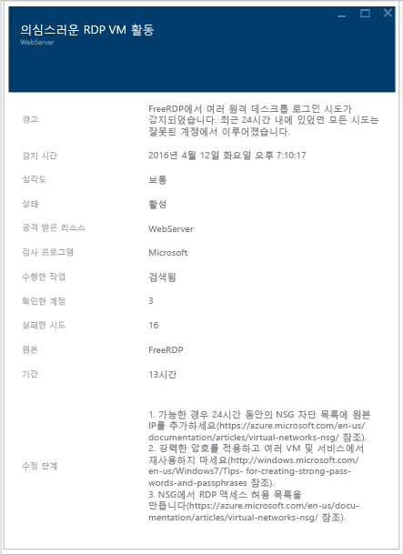

# Azure Security Center 계획 및 작업 가이드
이 가이드는 Azure Security Center의 사용을 계획 중인 정보 기술(IT) 전문가, IT 설계자, 정보 보안 분석가 및 클라우드 관리자를 대상으로 합니다.

## 계획 가이드
이 가이드에서는 조직의 보안 요구 사항과 클라우드 관리 모델에 따라 보안 센터의 사용을 최적화하기 위해 따를 수 있는 일련의 단계 및 작업을 다룹니다. Security Center를 완벽하게 활용하려면 조직의 서로 다른 개인 또는 팀이 보안 개발 및 운영, 모니터링, 관리 및 사고 대응 요구에 맞게 서비스를 사용하는 방법에 대해 이해하는 것이 중요합니다. 보안 센터의 사용을 계획할 때 고려할 주요 영역은 다음과 같습니다.

* 보안 역할 및 Access Control
* 보안 정책 및 권장 사항
* 데이터 수집 및 저장
* 진행 중인 비 Azure 리소스
* 지속적인 보안 모니터링
* 사고 대응

다음 섹션에서는 요구 사항에 따라 이러한 각각의 영역을 계획하고 권장 사항을 적용하는 방법에 대해 학습합니다.

> [!NOTE]
> [Azure Security Center FAQ(질문과 대답)](security-center-faq.md) 설계 및 계획 단계에서 유용할 수 있는 일반적인 질문의 목록을 읽어 보세요.
>

## 보안 역할 및 액세스 제어
조직의 규모와 구조에 따라, 여러 개인과 팀이 보안 센터를 통해 서로 다른 보안 관련 업무를 수행할 수 있습니다. 다음 다이어그램에는 가상의 사용자와 그 역할 및 보안 책임의 예가 나와 있습니다.

이러한 개인들은 보안 센터를 통해 다양한 책임에 부합할 수 있습니다. 예를 들면 다음과 같습니다.

**Jeff(워크로드 소유자)**

* 클라우드 워크로드와 관련 리소스를 관리
* 회사 보안 정책에 따라 보호를 구현하고 유지 관리하는 업무를 담당

**Ellen(CISO/CIO)**

* 회사의 모든 보안 업무를 담당
* 클라우드 워크로드에 걸쳐 회사의 보안 태세를 파악하고자 함
* 주요 공격 및 위험에 대해 숙지해야 함

**David(IT 보안)**

* 적절한 보호 조치가 마련되도록 회사 보안 정책을 설정
* 정책 준수 여부를 모니터링
* 경영진 또는 감사를 위한 보고서를 작성

**Judy(보안 운영)**

* 보안 경고를 연중무휴(24/7) 모니터링하고 대응
* 클라우드 워크로드 소유자 또는 IT 보안 분석가에게 보안 문제 제기

**Sam(보안 분석가)**

* 공격 여부 조사
* 클라우드 워크로드 소유자와 함께 해결책 적용

Security Center는 Azure에서 사용자, 그룹 및 서비스에 [기본 제공 역할](../role-based-access-control/built-in-roles.md)을 제공하는 [RBAC(역할 기반 Access Control)](../role-based-access-control/role-assignments-portal.md)를 사용합니다. 사용자가 Security Center를 열면 액세스한 리소스와 관련된 정보만 표시됩니다. 이는 구독 또는 리소스가 속한 리소스 그룹에 대한 소유자, 참가자 또는 읽기 권한자의 역할이 사용자에게 할당된다는 것을 의미합니다. 이러한 역할 외에도 두 개의 특정한 Security Center 역할이 있습니다.

- **보안 읽기 권한자**: 이 역할에 속하는 사용자는 권장 사항, 경고, 정책 및 상태를 포함하는 Security Center 구성을 볼 수 있지만 변경할 수는 없습니다.
- **보안 관리자**: 보안 읽기 권한자와 동일하지만 보안 정책을 업데이트하고 권장 사항 및 경고를 해제할 수 있습니다.

위에서 설명한 Security Center 역할은 Storage, 웹 및 모바일, 사물 인터넷 등 Azure의 다른 서비스 영역에 액세스할 수 없습니다.  

이전 다이어그램에 설명된 가상 사용자를 사용하는 경우 다음 RBAC가 필요합니다.

**Jeff(워크로드 소유자)**

* 리소스 그룹 소유자/협업자

**David(IT 보안)**

* 구독 소유자/협력자 또는 보안 관리자

**Judy(보안 운영)**

* 경고를 보는 구독 읽기 권한자 또는 보안 읽기 권한자
* 경고를 해제하는 데 필요한 구독 소유자/협력자 또는 보안 관리자

**Sam(보안 분석가)**

* 경고를 보는 구독 읽기 권한자
* 경고를 해제하는 데 필요한 구독 소유자/협력자
* 작업 영역에 대한 액세스가 필요할 수 있음

고려가 필요한 몇 가지 다른 중요 정보:

* 구독 소유자/참가자 및 보안 관리자만이 보안 정책을 편집할 수 있습니다.
* 구독 및 리소스 그룹 소유자 및 참가자만이 리소스에 대한 보안 권장 사항을 적용할 수 있습니다.

Security Center의 RBAC을 사용하여 액세스 제어를 계획하는 경우, Security Center를 사용할 조직 내 대상을 알아야 합니다. 또한 수행할 작업 유형을 확인한 다음 RBAC을 적합하게 구성합니다.

> [!NOTE]
> 사용자가 자신의 작업을 완료하는 데 필요한 최소한의 역할을 할당하는 것이 좋습니다. 예를 들어, 리소스의 보안 상태에 대한 정보를 보기만 하고 권장 사항 적용이나 정책 편집 등의 조치는 취하지 않는 사용자라면 읽기 권한자 역할을 할당해야 합니다.
>
>

## 보안 정책 및 권장 사항
보안 정책은 워크로드에서 원하는 구성을 정의하고 회사 또는 규정 보안 요구 사항을 준수하는 데 도움이 됩니다. Security Center에서 Azure 구독에 대한 정책을 정의할 수 있습니다. 이를 워크로드의 유형 또는 데이터의 민감도에 맞게 조정할 수 있습니다.

Security Center 정책에는 다음 구성 요소가 포함되어 있습니다.
- [데이터 컬렉션](https://docs.microsoft.com/azure/security-center/security-center-enable-data-collection): 에이전트 프로비전 및 데이터 컬렉션 설정입니다.
- [보안 정책](https://docs.microsoft.com/azure/security-center/security-center-policies): [Azure Policy](../governance/policy/overview.md)에서는 Security Center에서 모니터링하고 권장하는 컨트롤을 결정하고, Azure Policy를 사용하여 새로운 정의를 만들고, 추가 정책을 정의하고, 관리 그룹에 정책을 할당합니다.
- [전자 메일 알림](https://docs.microsoft.com/azure/security-center/security-center-provide-security-contact-details): 보안 연락처 및 알림 설정입니다.
- [가격 책정 계층](https://docs.microsoft.com/azure/security-center/security-center-pricing): 무료 또는 표준 가격 책정 선택 영역입니다. 여기서 범위 내의 리소스에 사용할 수 있는 Security Center 기능을 결정합니다(구독, 리소스 그룹 및 작업 영역에 대해 지정할 수 있음).

> [!NOTE]
> 보안 계약을 지정하면 보안 인시던트가 발생하는 경우 Azure가 조직에서 적합한 사람에게 연결할 수 있게 됩니다. 이 권장 사항을 사용하는 방법에 대한 자세한 내용은 [Azure Security Center에 보안 연락처 세부 정보 제공](https://docs.microsoft.com/azure/security-center/security-center-provide-security-contact-details) 을 참고하세요.

### 보안 정책 정의 및 권장 사항
Security Center는 각 Azure 구독에 대한 기본 보안 정책을 자동으로 만듭니다. Security Center에서 정책을 편집하거나 Azure 정책을 사용하여 새 정의 만들고, 추가 정책을 정의하고, (전체 조직, 조직 내 비즈니스 단위를 나타낼 수 있는) 관리 그룹에 정책을 할당하고, 이러한 범위에서 이러한 정책에 대한 규정 준수를 모니터링할 수 있습니다.

보안 정책을 구성하기 전에 각각의 [보안 권장 사항](https://docs.microsoft.com/azure/security-center/security-center-recommendations)을 검토하여 이들 정책이 다양한 구독 및 리소스 그룹에 적합한지 판단합니다. 보안 권장 사항을 확인하기 위해 취해야 하는 조치 및 조직에서 새 권장 사항을 모니터링하고 필요한 단계를 수행하는 담당자를 알아야 합니다.

## 데이터 수집 및 저장
Azure Security Center는 Microsoft Monitoring Agent – 가상 머신에서 보안 데이터를 수집 하는 Azure Monitor 서비스에서 사용 되는 것과 동일한 에이전트입니다. 이 에이전트에서 [수집된 데이터](https://docs.microsoft.com/azure/security-center/security-center-enable-data-collection)는 Log Analytics 작업 영역에 저장됩니다.

### 에이전트

자동 프로비전이 보안 정책에서 활성화된 경우 Microsoft Monitoring Agent([Windows](https://docs.microsoft.com/azure/log-analytics/log-analytics-windows-agents) 또는 [Linux](https://docs.microsoft.com/azure/log-analytics/log-analytics-linux-agents)용)는 지원되는 모든 Azure VM 및 새로 만들어진 VM에 설치됩니다. VM 또는 컴퓨터가 Microsoft Monitoring Agent에 이미 설치된 경우 Azure Security Center는 현재 설치된 에이전트를 활용합니다. 에이전트의 프로세스는 사용자 작업에 영향을 미치지 않으며 VM의 성능에도 거의 영향을 미치지 않습니다.

Windows용 Microsoft Monitoring Agent는 TCP 포트 443을 사용해야 합니다. 추가 세부 정보는 [문제 해결 문서](security-center-troubleshooting-guide.md)를 참조하세요.

데이터 수집을 사용하지 않으려는 특정 지점의 경우 보안 정책에서 수집을 해제할 수 있습니다. 그러나 다른 Azure Management 및 모니터링 서비스에서 Microsoft Monitoring Agent를 사용할 수 있기 때문에 Security Center에서 데이터 수집을 끄는 경우에도 자동으로 에이전트를 제거하지 않습니다. 필요한 경우 에이전트를 수동으로 제거할 수 있습니다.

> [!NOTE]
> 지원되는 VM 목록을 찾아보려면 [Azure Security Center FAQ](security-center-faq.md)를 읽어보세요.
>

### 작업 영역

작업 영역은 데이터에 대한 컨테이너 역할을 하는 Azure 리소스입니다. 사용자나 조직의 다른 구성원이 여러 개의 작업 영역을 사용하여 IT 인프라 전체 또는 일부에서 수집되는 각 데이터 집합을 관리할 수 있습니다.

(Azure Security Center 대신) Microsoft Monitoring Agent에서 수집된 데이터는 VM의 지역을 고려하여 Azure 구독 또는 새 작업 영역에 연결된 기존 Log Analytics 작업 영역 중 하나에 저장됩니다.

Azure Portal에서 Azure Security Center에서 만든 항목을 포함하여 Log Analytics 작업 영역 목록을 찾아볼 수 있습니다. 새 작업 영역에 관련된 리소스 그룹이 만들어질 수 있습니다. 둘 다 다음과 같은 명명 규칙을 따릅니다.

* 작업 영역: *DefaultWorkspace-[subscription-ID]-[geo]*
* 리소스 그룹: *DefaultResourceGroup-[geo]*

Azure Security Center에서 만든 작업 영역의 경우 데이터는 30일 동안 보존됩니다. 기존 작업 영역의 경우 작업 영역 가격 책정 계층에 따라 보존됩니다. 원하는 경우 기존 작업 영역을 사용할 수도 있습니다.

> [!NOTE]
> Microsoft에서는 이 데이터의 개인 정보 및 보안을 보호하기 위해 노력하고 있습니다. Microsoft는 코딩부터 서비스에 이르기까지 엄격한 규정 준수 및 보안 지침을 따릅니다. 데이터 처리 및 개인 정보 보호에 대한 자세한 내용은 [Azure Security Center 데이터 보안](security-center-data-security.md)을 참조하세요.
>

## 비 Azure 리소스 온보딩

Security Center에서 비 Azure 컴퓨터의 보안 태세를 모니터링할 수는 있지만, 그러려면 먼저 이러한 리소스를 온보딩해야 합니다. 비Azure 리소스를 등록하는 방법에 대한 자세한 내용은 [보안 개선을 위해 Azure Security Center 표준 계층으로 온보딩](https://docs.microsoft.com/azure/security-center/security-center-onboarding#onboard-non-azure-computers)을 참고하세요.

## 지속적인 보안 모니터링
보안 센터 권장 사항의 최초 구성과 적용 후에는 보안 센터 운영 프로세스를 고려합니다.

Security Center 개요는 모든 Azure 리소스 및 연결된 모든 비 Azure 리소스에 대한 보안의 통합된 보기를 제공합니다. 다음 예제에서는 많은 문제를 해결해야 하는 환경을 보여줍니다.

> [!NOTE]
> Security Center는 일반 작동 프로시저를 방해하지 않으면서 배포를 소극적으로 모니터링하고 사용자가 설정한 보안 정책에 따라 권장 사항을 제공합니다.

현재 Azure 환경에 Security Center를 사용하도록 처음으로 설정할 때는 모든 권장 사항을 검토해야 합니다. 이 작업은 **권장 사항** 타일에서 또는 리소스별(**Compute**, **네트워킹**, **Storage 및 데이터**, **애플리케이션**)로 수행할 수 있습니다.

모든 권장 사항을 해결한 후에는 해결된 모든 리소스에 대해 **방지** 섹션이 녹색이어야 합니다. 이 시점에서는 리소스 보안 상태와 권장 사항 타일에서의 변경 사항을 기준으로 조치를 취하면 되므로 지속적인 모니터링이 더 용이해집니다.

**감지** 섹션은 더 대응적인 부분으로, 지금 발생 중이거나 과거에 발생하여 Security Center 컨트롤과 타사 시스템에서 감지된 문제와 관련한 경고입니다. 보안 경고 타일은 매일 확인된 위협 감지의 수를 나타내는 막대 그래프와, 여러 심각도 카테고리(낮음, 중간, 높음) 간의 분포를 표시합니다. 보안 경고에 대한 자세한 내용은 [Azure Security Center에서 보안 경고 관리 및 대응](security-center-managing-and-responding-alerts.md)을 읽어보세요.

[위협 인텔리전스](https://docs.microsoft.com/azure/security-center/security-center-threat-intel) 옵션을 일별 보안 작업의 일부로 방문할 계획입니다. 거기에서 특정 컴퓨터가 봇네트의 일부인지 식별하는 등 환경에 대한 보안 위협을 식별할 수 있습니다.

### 새 또는 변경된 리소스 모니터링
대부분의 Azure 환경은 동적이며, 새 리소스가 일정 기준, 구성 또는 변경에 따라 확장 및 분리됩니다. Security Center는 이러한 새 리소스의 보안 상태에 대한 정보를 얻는 데 도움이 됩니다.

Azure 환경에 새 리소스(VM, SQL DB)를 추가하면 보안 센터가 자동으로 해당 리소스를 감지하고 보안을 모니터링하기 시작합니다. 또한 PaaS 웹 역할 및 작업자 역할이 포함됩니다. [보안 정책](tutorial-security-policy.md)에서 데이터 수집을 사용하도록 설정한 경우 가상 머신에 대해 추가적인 모니터링 기능이 자동으로 적용됩니다.

1. 가상 머신의 경우 **방지** 섹션에서 **Compute**를 클릭합니다. 데이터를 사용하도록 설정하는 것과 관련한 문제나 관련 권장 사항은 **개요** 탭 및 **모니터링 권장 사항** 섹션에 표시됩니다.
2. 새 리소스에 대한 보안 위협이 있다면 무엇인지를 확인하기 위해 **권장 사항** 을 봅니다.
3. 새 VM이 환경에 추가되면 운영 체제만 최초로 설치되는 것이 매우 일반적입니다. 리소스 소유자는 이러한 VM에서 사용할 다른 앱을 배포하는 데 다소 시간이 걸릴 수 있습니다.  이상적으로는 이 워크로드의 최종 목적을 파악하고 있어야 합니다. 애플리케이션 서버가 됩니까? 이 새 워크로드의 용도에 맞게 적절한 **보안 정책**을 사용하도록 설정할 수 있으며, 이 워크플로의 세 번째 단계에 해당합니다.
4. 새 리소스가 Azure 환경에 추가되면 **보안 경고** 타일에 새 경고가 표시될 수 있습니다. 항상 이 타일에 새 경고가 있는지 확인하고 보안 센터 권장 사항에 따라 조치를 취합니다.

또한 기존 리소스 상태를 정기적으로 모니터링하여 보안 위험을 초래하고 권장 기준에 미치지 못하는 구성 변경 내용과 보안 경고를 파악하고자 할 수 있습니다. 보안 센터 대시보드에서 시작합니다. 여기에서는 일관된 기준에 따라 3가지 주요 영역을 검토하게 됩니다.

1. **방지** 섹션 패널은 주요 리소스에 대한 신속한 액세스를 제공합니다. 이 옵션을 사용하여 Compute, 네트워킹, Storage와 데이터 및 애플리케이션을 모니터링합니다.
2. **권장 사항** 패널에서 Security Center 권장 사항을 검토할 수 있습니다. 지속적인 모니터링이 이루어질 때는 매일 권장 사항이 있는 것이 아닙니다. 이것은 최초 Security Center 설정 시 모든 권장 사항을 해결했기 때문에 정상입니다. 따라서 매일 이 섹션에 새 정보가 있는 것은 아니며 필요에 따라 액세스하면 됩니다.
3. **감지** 섹션은 매우 자주 또는 매우 드물게 변경될 수 있습니다. 항상 보안 경고를 검토하고 보안 센터 권장 사항에 따라 조치를 취합니다.

### 액세스 및 애플리케이션 강화

또한 보안 작업의 일환으로 VM에 대한 액세스 권한을 제한하는 예방 조치를 채택하고 VM에서 실행되는 애플리케이션을 제어해야 합니다. Azure VM에 인바운드 트래픽을 잠금으로써 공격에 대한 노출을 줄이고 동시에 필요할 때 VM에 쉽게 연결할 수 있는 액세스 권한을 제공합니다. [Just in Time VM](https://docs.microsoft.com/azure/security-center/security-center-just-in-time) 액세스 기능을 사용하여 VM에 대한 액세스 권한을 강화합니다.

[적응형 애플리케이션 제어](https://docs.microsoft.com/azure/security-center/security-center-adaptive-application)를 사용하여 Azure에 위치한 VM에서 실행할 수 있는 애플리케이션을 제어할 수 있습니다. 여러 장점이 있지만 이를 통해 맬웨어에 대해 VM을 강화할 수 있습니다. Security Center는 기계 학습을 통해 VM에서 실행 중인 프로세스를 분석하고 이러한 인텔리전스를 사용하여 허용 목록 규칙을 적용할 수 있습니다.

## 사고 대응
보안 센터는 위협이 발생하면 감지하여 사용자에게 경고합니다. 조직에서는 새 보안 경고를 모니터링하고 필요에 따라 조치를 통해 추가적인 조사를 수행하거나 공격에 대처해야 합니다. Security Center 위협 감지 기능이 작동하는 방법에 대한 자세한 내용은 [Azure Security Center 감지 기능](security-center-detection-capabilities.md)을 참고하세요.

이 문서가 인시던트 대응 계획을 직접 작성하는 데 도움을 주려는 목적은 아니지만 인시던트 대응 단계에 대한 기반으로 클라우드 수명 주기에 Microsoft Azure 보안 응답을 사용합니다. 단계는 다음 다이어그램에 나와 있습니다.

> [!NOTE]
> 자체 계획을 마련할 때는 NIST(National Institute of Standards and Technology) [컴퓨터 보안 인시던트 처리 가이드](https://nvlpubs.nist.gov/nistpubs/SpecialPublications/NIST.SP.800-61r2.pdf) 를 사용할 수 있습니다.
>

다음 단계에서 보안 센터 경고를 사용할 수 있습니다.

* **감지**: 하나 이상의 리소스에서 의심스러운 작업을 식별합니다.
* **평가**: 초기 평가를 수행하여 의심스러운 작업에 대한 자세한 정보를 가져옵니다.
* **진단**: 수정 단계를 사용하여 문제를 해결하는 기술 절차를 수행합니다.

각 보안 경고는 공격의 근원을 더 잘 이해하는 데 도움이 될 수 있는 정보를 제공하며 가능한 해결 방법을 제안합니다. 일부 경고에서는 Azure 내부의 타 정보원이나 다른 추가 정보에 대한 링크를 제공할 수 있습니다. 완화를 시작하려면 다시 추가 검색에 제공되는 정보를 사용하고 작업 영역에 저장되어 있는 보안 관련 데이터를 검색할 수도 있습니다.

다음 예제에서는 미심쩍은 RDP 활동이 발생하고 있음을 보여줍니다.

이 페이지에서는 공격 발생 시간, 소스 호스트 이름, 대상 VM과 관련한 자세한 내용을 표시하며 권장 단계를 제공합니다. 일부 상황에서는 공격의 소스 정보가 비어 있을 수 있습니다. 이러한 동작 유형에 대한 자세한 내용은 [Azure Security Center 경고에 누락된 원본 정보](https://blogs.msdn.microsoft.com/azuresecurity/2016/03/25/missing-source-information-in-azure-security-center-alerts/) 를 참고하세요.

또한 이 페이지에서 [조사](https://docs.microsoft.com/azure/security-center/security-center-investigation)를 시작하여 공격의 타임라인, 공격 발생 방법, 잠재적으로 손상된 시스템, 사용된 자격 증명을 이해하고 전체 공격 체인의 그래프 표현을 확인할 수도 있습니다.

손상된 시스템을 식별하면 이전에 만든 보안 [플레이북](https://docs.microsoft.com/azure/security-center/security-center-playbooks)을 실행할 수 있습니다. 보안 플레이북은 특정 플레이북이 선택한 경고에서 트리거되면 Security Center에서 실행될 수 있는 프로시저의 컬렉션입니다.

[사고 대응에 대해 Azure Security Center 및 Microsoft Operations Management Suite를 활용하는 방법](https://channel9.msdn.com/Blogs/Taste-of-Premier/ToP1703) 비디오를 통해 각 단계에서 Security Center를 사용할 수 있는 방식을 이해하는 데 도움이 되는 몇 가지 데모를 확인할 수 있습니다.

> [!NOTE]
> 인시던트 대응 프로세스 중에 도움이 될 보안 센터 기능을 사용하는 방법에 대한 자세한 내용은 [인시던트 대응에 Azure Security Center 활용](security-center-incident-response.md) 을 참고하세요.
>
>

## 다음 단계
이 문서에서는 보안 센터를 도입하도록 계획하는 방법을 살펴보았습니다. 보안 센터에 대한 자세한 내용은 다음을 참조하세요.

* [Azure Security Center에서 보안 경고 관리 및 대응](security-center-managing-and-responding-alerts.md)
* [Azure Security Center에서 보안 상태 모니터링](security-center-monitoring.md) — Azure 리소스의 상태를 모니터링하는 방법을 알아봅니다.
* [Azure Security Center를 사용하여 파트너 솔루션 모니터링](security-center-partner-solutions.md) — 파트너 솔루션의 상태를 모니터링하는 방법을 알아봅니다.
* [Azure Security Center FAQ](security-center-faq.md) - 서비스 사용에 관한 질문과 대답을 찾습니다.
* [Azure 보안 블로그](https://blogs.msdn.com/b/azuresecurity/) - Azure 보안 및 규정 준수에 관한 블로그 게시물을 찾습니다.
