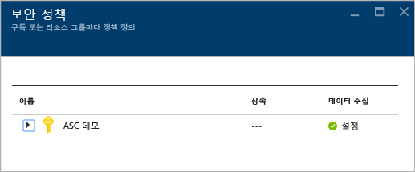
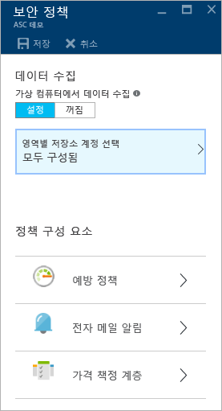
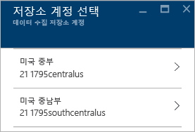
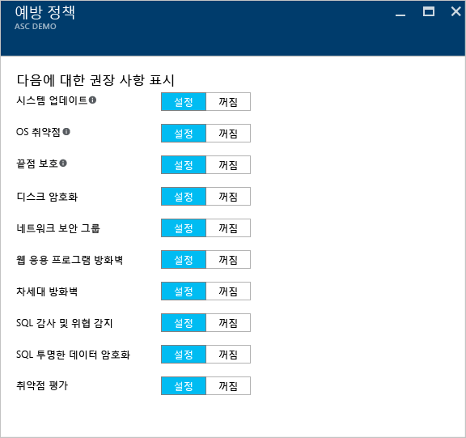
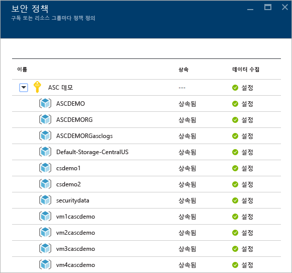
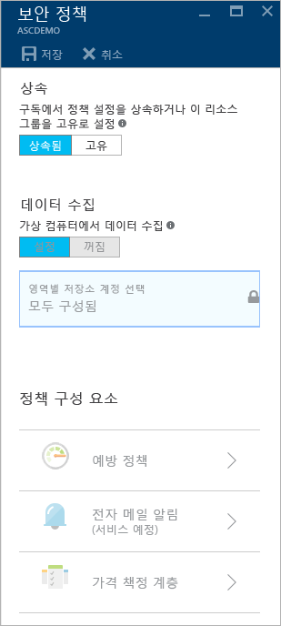

<properties
   pageTitle="Azure Security Center에서 보안 정책 설정 | Microsoft Azure"
   description="이 문서에서는 Azure 보안 센터에서 보안 정책을 구성하는 방법을 설명합니다."
   services="security-center"
   documentationCenter="na"
   authors="YuriDio"
   manager="swadhwa"
   editor=""/>

<tags
   ms.service="security-center"
   ms.devlang="na"
   ms.topic="hero-article"
   ms.tgt_pltfrm="na"
   ms.workload="na"
   ms.date="09/22/2016"
   ms.author="yurid"/>

# Azure Security Center에서 보안 정책 설정
이 문서에서는 보안 센터에 보안 정책을 구성하는 작업을 수행하는 데 필요한 단계를 안내합니다.

## 보안 정책이란?
보안 정책은 지정된 구독 또는 리소스 그룹 내에서 리소스에 대해 권장되는 제어 집합을 정의합니다. 보안 센터에서 회사의 보안 요구 사항 및 응용 프로그램 유형 또는 각 구독의 데이터 민감도에 따라 Azure 구독 또는 리소스 그룹에 대한 정책을 정의합니다.

예를 들어 개발 또는 테스트에 사용되는 리소스는 프로덕션 응용 프로그램에 사용되는 리소스와 보안 요구 사항이 다릅니다. 마찬가지로 PII(Personally Identifiable Information) 같은 규제된 데이터를 가진 응용 프로그램에는 더 높은 수준의 보안이 필요할 수 있습니다. Azure Security Center에서 활성화된 보안 정책에 따라 잠재적 취약점을 파악하고 위험을 완화하는 데 도움이 되는 보안 권장 사항과 모니터링이 결정됩니다. 더 적절한 옵션을 결정하는 방법에 대한 자세한 내용은 [Azure Security Center 계획 및 운영 가이드](security-center-planning-and-operations-guide.md)를 참고하세요.

## 구독에 대한 보안 정책 설정

각 구독 또는 리소스 그룹에 대한 보안 정책을 구성할 수 있습니다. 보안 정책을 수정하려면 해당 구독의 소유자 또는 참여자여야 합니다. Azure Portal에 로그인하고 다음 단계에 따라 Security Center에서 보안 정책을 구성합니다.

1. 보안 센터 대시보드에서 **정책** 타일을 클릭합니다.

2. 열리는 **보안 정책 - 구독 또는 리소스 그룹당 정책 정의** 블레이드에서 보안 정책을 활성화할 구독을 선택합니다. 전체 구독이 아닌 리소스 그룹에 보안 정책을 사용하려는 경우 리소스 그룹에 대한 보안 정책을 설정하는 방법에 대한 설명하는 다음 섹션까지 아래로 스크롤합니다.

    

3. 선택한 구독에 대한 **보안 정책** 블레이드가 다음 화면과 비슷한 일련의 옵션과 함께 열립니다.

    

	이 블레이드에서 사용할 수 있는 옵션은 다음과 같습니다.
	- **방지 정책**: 이 옵션을 사용하여 구독 또는 리소스 그룹당 정책을 구성할 수 있습니다.
	- **전자 메일 알림**: 이 옵션을 사용하여 최초로 일별 경고가 발생할 때와 높은 심각도 경고가 발생하는 경우에 전송되는 전자 메일 알림을 구성합니다. 전자 메일 기본 설정은 구독 정책에 대해서만 구성할 수 있습니다. 전자 메일 알림을 구성하는 방법에 대한 자세한 내용은 [Azure Security Center에 보안 연락처 세부 정보 제공](security-center-provide-security-contact-details.md)을 참고하세요.
	- **가격 책정 계층**: 이 옵션을 사용하여 가격 책정 계층 선택을 업그레이드합니다. 가격 책정 옵션에 대한 자세한 내용은 [Security Center 페이지](https://azure.microsoft.com/pricing/details/security-center/)를 참조하세요.

4.  **가상 컴퓨터에서 데이터 수집** 옵션을 **켜기**로 설정합니다. 이 옵션은 기존 및 새 리소스에 대한 자동 로그 수집을 활성화합니다.

    >[AZURE.NOTE] 기존 VM 및 새 VM에 보안 모니터링을 사용할 수 있도록 각 구독에 데이터 수집을 설정하는 것이 좋습니다. 데이터 수집을 활성화하면 모니터링 에이전트가 설치됩니다. 지금 이 위치에서 데이터 수집을 활성화하지 않더라도 나중에 **상태** 및 **권장 사항** 보기에서 활성화할 수 있습니다. 또한 구독 전용 또는 선택한 VM에 대해 데이터 수집을 활성화할 수 있습니다. 지원되는 VM에 대한 자세한 내용은 [Azure 보안 센터 FAQ](security-center-faq.md)를 참조하세요.

5. 아직 저장소 계정이 구성되지 않았으면 **보안 정책**을 열었을 때 다음 스크린샷과 비슷한 경고가 표시될 수 있습니다.

    

6. 이 경고가 표시되면 이 옵션을 클릭하고 다음 스크린샷에서 보여준 대로 지역을 선택합니다.

    

7. 가상 컴퓨터를 실행 중인 각 영역에 대해 가상 컴퓨터에서 수집한 데이터가 저장되는 저장소 계정을 선택합니다. 이렇게 하면 쉽게 개인 정보 및 데이터 독립성과 같은 지리적 영역에 데이터를 유지할 수 있습니다. 사용할 영역을 결정한 후에 해당 영역을 선택하고 저장소 계정을 선택합니다.

8. **저장소 계정 선택** 블레이드에서 **확인**을 클릭합니다.

    > [AZURE.NOTE] 원한다면 여러 지역에 있는 가상 컴퓨터의 데이터를 중앙 저장소 계정 하나에 집계할 수 있습니다. 자세한 내용은 [Azure 보안 센터 FAQ](security-center-faq.md)를 참조하세요.

9. **보안 정책** 블레이드에서 **켜기**를 클릭하고 이 구독에 사용할 보안 권장 사항을 활성화합니다. **방지 정책**을 클릭하면 다음 스크린샷과 같은 옵션이 표시됩니다.

	

다음 테이블을 참조로 사용하여 각 옵션을 이해합니다.

| 정책 | 상태가 켜진 경우 |
|----- |-----|
| 시스템 업데이트 | Windows 업데이트 또는 Windows Server Update Services에서 사용 가능한 보안 및 중요 업데이트의 일일 목록을 검색합니다. 검색된 목록은 해당 가상 컴퓨터에 구성된 서비스에 따라 다르고 누락된 업데이트를 적용하도록 권장합니다. Linux 시스템의 경우 정책은 배포판에서 제공한 패키지 관리 시스템을 사용하여 사용 가능한 업데이트가 있는 패키지를 확인합니다. 또한 [Azure Cloud Services](./cloud-services/cloud-services-how-to-configure.md) 가상 컴퓨터에서 보안 및 중요 업데이트를 확인합니다. |
| OS 취약성 | 운영 체제 구성을 매일 분석하여 가상 컴퓨터를 공격에 취약하게 만들 수 있는 문제를 확인합니다. 또한 정책은 이러한 취약점을 해결하는 구성 변경 내용을 권장합니다. 모니터링되는 특정 구성에 대한 자세한 내용은 [권장 기준 목록](https://gallery.technet.microsoft.com/Azure-Security-Center-a789e335)을 참조하세요. |
| Endpoint Protection | 바이러스, 스파이웨어 및 기타 악성 소프트웨어를 파악하여 제거할 수 있도록 모든 Windows 가상 컴퓨터에 Endpoint Protection을 프로비전하도록 권장합니다.|
| 디스크 암호화 | 모든 가상 컴퓨터에서 디스크 암호화를 사용하여 휴지 상태의 데이터 보호 기능을 향상시키는 것이 좋습니다.
| 네트워크 보안 그룹 | 공용 끝점을 사용하여 VM에 대한 인바운드 및 아웃바운드 트래픽을 제어할 수 있도록 [네트워크 보안 그룹](../virtual-network/virtual-networks-nsg.md)을 구성하는 것이 좋습니다. 별도로 지정하지 않는 한, 서브넷에 대해 구성된 네트워크 보안 그룹은 모든 가상 컴퓨터 네트워크 인터페이스에서 상속됩니다. 네트워크 보안 그룹이 구성되었는지 확인하는 것 외에도 이 정책은 인바운드 보안 규칙을 평가하여 들어오는 트래픽을 허용하는 규칙을 식별합니다. |
| 웹 응용 프로그램 방화벽 |   ILPIP[(인스턴스 수준 공용 IP)](../virtual-network/virtual-networks-instance-level-public-ip.md)를 사용하고 연결된 네트워크 보안 그룹에 대한 인바운드 보안 규칙이 포트 80/443에 대한 액세스를 허용하도록 구성한 경우 가상 컴퓨터에 웹 응용 프로그램 방화벽을 프로비전하도록 권장합니다.  부하 분산된 IP를 사용하고 연결된 부하 분산 및 인바운드 NAT(Network Address Translation) 규칙이 포트 80/443에 대한 액세스를 허용하도록 구성했습니다. 자세한 내용은 [Load Balancer에 대한 Azure Resource Manager 지원](../load-balancer/load-balancer-arm.md)을 참조하세요. |
| 차세대 방화벽 | Azure에 기본 제공되는 네트워크 보안 그룹 외에도 네트워크 보호 기능을 확장합니다. Security Center는 차세대 방화벽을 권장하는 배포를 검색하고 가상 어플라이언스를 프로비전할 수 있도록 합니다. |
| SQL 감사 및 위협 감지 | 조사를 위해 규정 준수 및 고급 위협 감지에 대해 Azure 데이터베이스에 대한 액세스 감사를 활성화하는 것이 좋습니다. |
| SQL 투명한 데이터 암호화 | Azure SQL Database, 연결된 백업 및 트랜잭션 로그 파일에 대해 휴지 상태의 암호화를 활성하는 것이 좋습니다. 데이터 위반이 있더라도 데이터를 읽을 수 없습니다. |
| 취약점 평가 | VM에 취약점 평가 솔루션을 설치하는 것이 좋습니다. |

옵션을 모두 구성하면 권장 사항이 있는 **보안 정책** 블레이드에서 **확인**을 클릭하고 초기 설정이 있는 **보안 정책** 블레이드에서 **저장**을 클릭합니다.

## 리소스 그룹에 대한 보안 정책 설정

리소스 그룹당 보안 정책을 구성하는 단계는 구독에 대한 보안 정책을 설정하는 데 사용하는 단계와 같습니다. 주요 차이점은 구독 이름을 확장하고 고유한 보안 정책을 구성하려는 리소스 그룹을 선택해야 한다는 점입니다.

리소스 그룹을 선택한 후에 **보안 정책** 블레이드가 열립니다. 기본적으로 **상속** 옵션을 사용합니다. 즉, 이 리소스 그룹에 대한 모든 보안 정책은 구독 수준에서 상속됩니다. 리소스 그룹에 대한 보안 정책을 사용자 지정하려는 경우 이 구성을 변경할 수 있습니다. 이런 경우 **고유**를 선택하고 **방지 정책** 옵션에서 변경 사항을 만듭니다.

> [AZURE.NOTE] 구독 수준 정책과 리소스 그룹 수준 정책이 충돌하는 경우 리소스 그룹 수준 정책이 우선 적용됩니다.

## 참고 항목

이 문서에서는 Azure 보안 센터에서 보안 정책을 구성하는 방법을 배웠습니다. Azure 보안 센터에 대한 자세한 내용은 다음을 참조하세요.

- [Azure Security Center 계획 및 운영 가이드](security-center-planning-and-operations-guide.md) 디자인 고려 사항을 계획하고 이해하여 Azure Security Center를 채택하는 방법을 알아봅니다.
- [Azure Security Center에서 보안 상태 모니터링](security-center-monitoring.md) Azure 리소스의 상태를 모니터링하는 방법을 알아봅니다.
- [Azure Security Center에서 보안 경고 관리 및 대응](security-center-managing-and-responding-alerts.md) 보안 경고를 관리하고 응답하는 방법을 알아봅니다.
- [Azure Security Center를 사용하여 파트너 솔루션 모니터링](security-center-partner-solutions.md) 파트너 솔루션의 상태를 모니터링하는 방법을 알아봅니다.
- [Azure Security Center FAQ](security-center-faq.md) 서비스 사용에 관한 질문과 대답을 찾습니다.
- [Azure 보안 블로그](http://blogs.msdn.com/b/azuresecurity/) Azure 보안 및 규정 준수에 관한 블로그 게시물을 찾습니다.

<!---HONumber=AcomDC_0928_2016-->