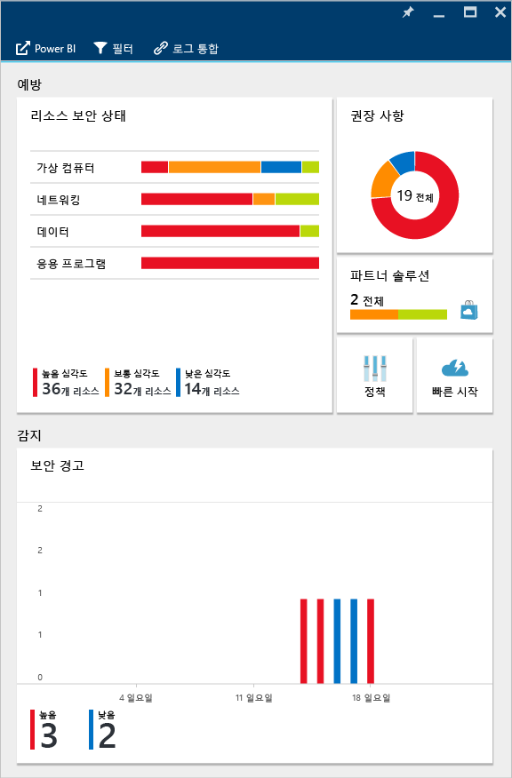
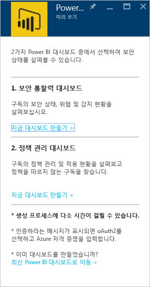
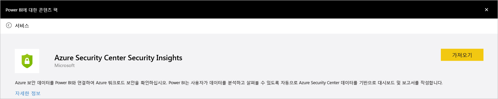
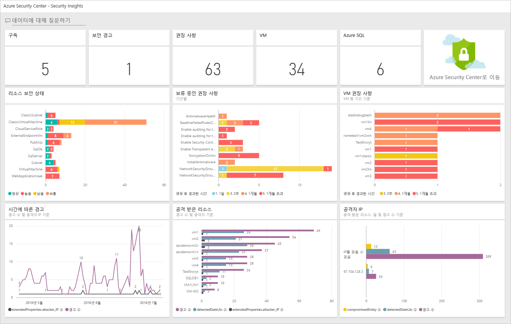
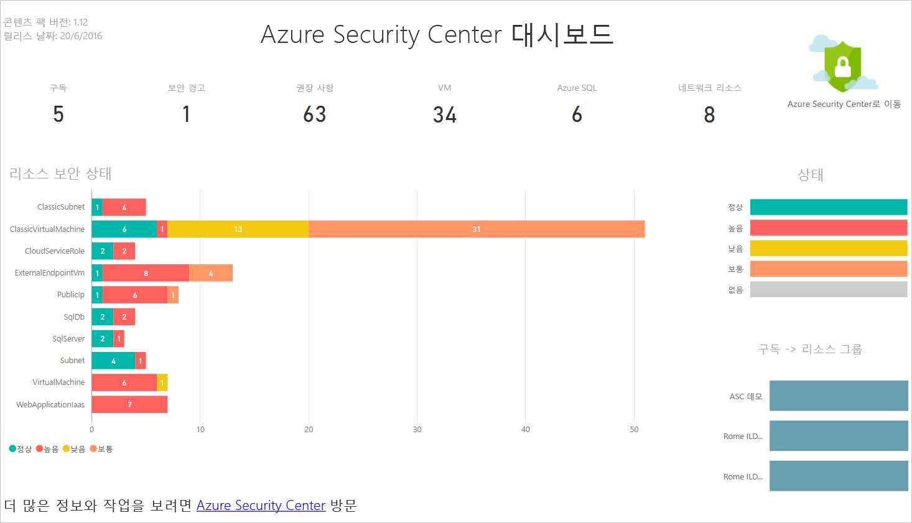
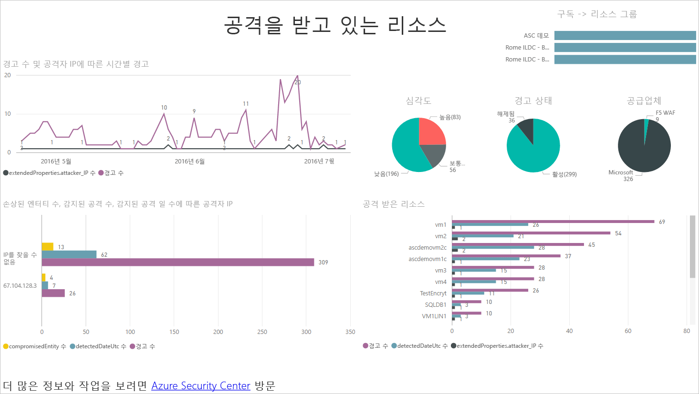
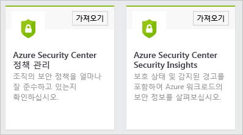
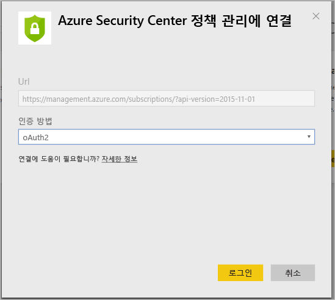
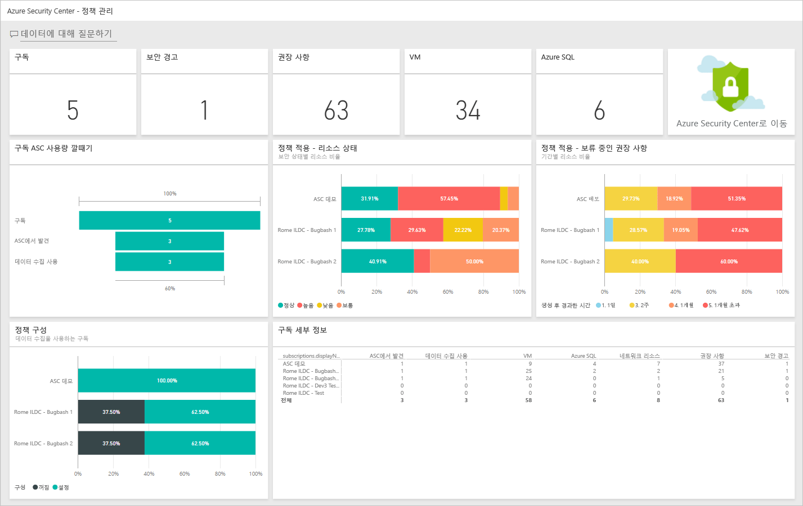

<properties
   pageTitle="Power BI로 Azure 보안 센터 데이터에서 통찰력 얻기| Microsoft Azure"
   description="Azure 보안 센터 Power BI 콘텐츠 팩을 사용하면 보고를 위해 생성된 데이터 집합에 기반하여 보안 경고, 권장 사항, 공격 받은 리소스 및 추세를 쉽게 찾을 수 있습니다."
   services="security-center"
   documentationCenter="na"
   authors="YuriDio"
   manager="swadhwa"
   editor=""/>

<tags
   ms.service="security-center"
   ms.devlang="na"
   ms.topic="hero-article"
   ms.tgt_pltfrm="na"
   ms.workload="na"
   ms.date="09/22/2016"
   ms.author="yurid"/>

# Power BI로 Azure 보안 센터 데이터에서 통찰력 얻기
Azure 보안 센터에 대한 [Power BI 대시보드](http://aka.ms/azure-security-center-power-bi)를 사용하면 어디서든 모바일 장치를 포함하여 권장 사항 및 보안 경고를 시각화, 분석 및 필터링할 수 있습니다. Power BI 대시보드를 사용하여 추세를 표시하고 패턴을 공격합니다. 리소스 또는 원본 IP 주소에서 보안 경고 및 리소스 또는 시대에서 알려지지 않은 보안 위험을 봅니다.

또한 [Azure 감사 로그](https://powerbi.microsoft.com/blog/monitor-azure-audit-logs-with-power-bi/) 및 [Azure SQL 데이터베이스 감사](https://powerbi.microsoft.com/blog/monitor-your-azure-sql-database-auditing-activity-with-power-bi/)의 데이터를 사용하는 등의 원하는 방식으로 다른 데이터와 보안 센터 권장 사항과 보안 경고를 함께 사용할 수 있습니다. 두 가지 모두 Power BI 대시보드를 제공하기 때문에 클라우드 리소스의 보안 상태에 대한 간단한 보고를 위해 이 데이터를 Excel로 내보낼 수도 있습니다.

##Azure 보안 센터 대시보드를 사용하여 Power BI에 액세스
또한 Azure 보안 센터 대시보드를 사용하여 Power BI 보고서에 액세스할 수 있습니다. 이 작업을 수행하려면 다음 단계를 따릅니다.

1. **Azure 보안 센터** 대시보드에서 **Power BI에서 탐색** 단추를 클릭합니다.

	

2. 다음 화면에 표시된 것처럼**Power BI에서 탐색** 블레이드가 오른쪽에 열립니다.

	

3. 처음으로 Power BI 대시보드를 만드는 경우 **Power BI에서 탐색** 블레이드에서 다음 옵션 중 하나를 선택할 수 있습니다.

	- **보안 Insights 대시보드**: 보안 상태, 스레드 및 탐지를 포함하는 대시보드를 만들려는 경우 이 옵션을 선택합니다. 이 옵션은 구독의 보호 상태 및 감지된 경고를 분석하는 일을 담당하는 DevOps 역할에 보다 일반적입니다.
	- **정책 관리 대시보드**: 관리 및 적용 정책을 탐색하려는 경우 이 옵션을 선택합니다. 이 옵션은 관리에 중점을 둔 Central IT에 보다 일반적입니다. 이 대시보드를 사용하여 조직 내에서 보안 정책 준수에 대한 가시성 및 통찰력을 얻을 수 있습니다.
	- Power BI 대시보드가 이미 있는 경우 **현재 Power BI 대시보드로 이동**을 클릭합니다.

4. 이 예에서는 **보안 insights 대시보드** 옵션을 클릭합니다. 보안 센터에 대한 Power BI 대시보드를 처음 만드는 경우 콘텐츠 팩을 설치하라는 메시지가 나타납니다. 다음 화면에 표시된 것처럼 **Power BI용 콘텐츠 팩** 창에서 **가져오기** 단추를 클릭합니다.

	

5. **Azure 보안 센터 보안 Insights에 연결** 창이 나타납니다. 아래와 같이 **인증** 방법이 **oAuth2**인지 확인하고 **로그인** 단추를 클릭합니다.
	
	

6. Azure 자격 증명으로 다시 인증하라는 메시지가 나타날 수 있습니다. 인증 후 대시보드가 생성됩니다. 대시보드가 생성된 후 다음 화면에 표시된 것과 유사한 구조를 사용한 보고서가 표시됩니다.

	

> [AZURE.NOTE] 보고서를 새로 고치면 매일 수행되도록 예약됩니다. 이 새로 고침에 오류가 발생하는 경우, 문제 해결 방법에 대한 자세한 내용은 [Azure 보안 센터 Power BI의 잠재적인 새로 고침 문제](https://blogs.msdn.microsoft.com/azuresecurity/2016/04/07/azure-security-center-power-bi-refresh-fails/)를 참조하세요.

여기에서 Azure 보안 센터에서 모니터링된 VM, Azure SQL 데이터베이스 및 네트워크 리소스의 수뿐만 아니라 보안 경고 및 권장 사항 수를 확인할 수 있습니다.

Azure 보안 센터에 대한 링크는 Azure 포털로 이동합니다. 차트는 다음을 포함하여 보안 권장 사항 및 경고에 대한 정보를 쉽게 시각화합니다.

- 리소스 보안 상태
- 보류 중인 권장 사항
- VM 권장 사항
- 시간에 따른 경고
- 공격 받은 리소스
- 공격 받은 IP

각 차트 뒤에 자세한 내용이 있습니다. 자세한 내용을 보려면 타일을 선택합니다. 예를 들어 **리소스 보안 상태** 타일은 다음 화면에 표시된 것처럼 리소스에 의해 보류 중인 권장 사항에 대한 추가 세부 정보를 표시합니다.

이 그래프의 줄을 클릭하면 다른 줄은 회색으로 표시되기 때문에 선택한 줄에만 집중할 수 있습니다. 대시보드 돌아가려면 이 페이지의 왼쪽 창에서 **대시보드** 옵션의 **Azure 보안 센터**를 클릭합니다.

> [AZURE.NOTE] 추가 필드를 추가하거나 기존 시각화를 변경하여 보고서를 사용자 지정하려는 경우 보고서를 편집할 수 있습니다. 자세한 내용은 [Power BI의 편집용 보기에서 보고서와 상호 작용](https://powerbi.microsoft.com/documentation/powerbi-service-interact-with-a-report-in-editing-view/)을 참고합니다.

**시간에 따른 경고, 공격 받은 리소스** 및 **공격자 IP** 타일은 각각을 클릭할 때 비슷한 출력을 갖습니다. 보고서가 이러한 세 개의 변수 모두에 대한 정보를 집계하고 다음 화면에 표시된 것처럼 **공격받는 리소스**를 호출하기 때문에 발생합니다.

이때 **파일** 메뉴의 옵션을 사용하여 이 보고서의 복사본을 저장하거나 인쇄하거나 웹에 게시할 수도 있습니다.

## Power BI로 Azure 보안 센터 데이터 탐색

Power BI의 [Power BI 콘텐츠 팩 서비스](https://msit.powerbi.com/groups/me/getdata/services)에 연결하고 다음 단계를 실행합니다.

1. **Power BI용 콘텐츠 팩** 창에는 아래와 같이 두 가지 옵션이 표시됩니다.

	

	>[AZURE.NOTE] 이미 이 문서의 첫 번째 부분을 실행한 경우 Azure 보안 센터 정책 관리라는 하나의 옵션만 표시됩니다.

2. 이 예의 목적에 맞게 **Azure 보안 센터 정책 관리** 타일에서 **가져오기**를 클릭합니다.

3. **Azure 보안 센터 정책 관리에 연결** 창에서 아래와 같이 **인증 방법** 드롭다운 아래에서 **oAuth2**를 선택하고 **로그인** 단추를 클릭합니다.

	

4. Azure 보안 센터에 연결하는 데 사용하는 자격 증명을 입력해야 하는 인증 페이지로 이동합니다. 인증 프로세스를 완료한 후에 Power BI에서 데이터를 가져오기 시작하여 보고서를 작성합니다. 이 시간 동안 브라우저의 오른쪽 모퉁이에 다음과 같은 메시지가 나타날 수 있습니다.

	

	>[AZURE.NOTE] 대시보드가 처음으로 생성되는 경우 여러 구독이 있는 시나리오에 주로 평소보다 시간이 오래 걸릴 수 있습니다.

5. 프로세스가 완료되면 Azure 보안 센터 Power BI 대시보드가 아래에 표시된 것과 유사한 **정책 관리** 보고서와 함께 로드됩니다.

	

## 참고 항목
이 문서에서는 Azure 보안 센터의 Power BI를 사용하는 방법을 살펴보았습니다. Azure 보안 센터에 대한 자세한 내용은 다음을 참조하세요.

- [Azure 보안 센터의 계획 및 운영 가이드](security-center-planning-and-operations-guide.md) — Azure 보안 센터 채택을 계획하는 방법을 알아봅니다.
- [Azure 보안 센터에서 보안 정책 설정](security-center-policies.md) — Azure 보안 센터에서 보안 설정을 구성하는 방법 알아보기
- [Azure 보안 센터에서 보안 경고 관리 및 대응](security-center-managing-and-responding-alerts.md) — 보안 경고를 관리하고 대응하는 방법을 알아봅니다.
- [Azure 보안 센터 FAQ](security-center-faq.md) — 서비스 사용에 관한 질문과 대답을 찾습니다.
- [Azure 보안 블로그](http://blogs.msdn.com/b/azuresecurity/) — Azure 보안 및 규정 준수에 관한 블로그 게시물을 찾습니다.

<!---HONumber=AcomDC_0928_2016-->