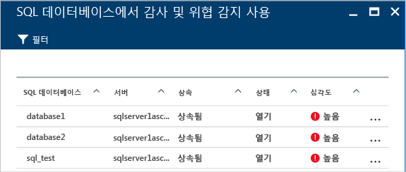
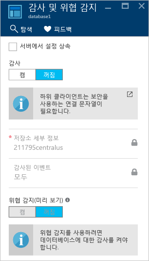

# Azure Security Center에서 Azure SQL 서비스 및 데이터 보호
Azure Security Center에서는 Azure 리소스의 보안 상태를 분석합니다. 보안 센터가 잠재적인 보안 취약점을 식별하는 경우 필요한 컨트롤을 구성하는 과정을 안내하는 권장 사항을 만듭니다.  이러한 권장 사항은 가상 머신(VM), 네트워킹, SQL 및 데이터, 애플리케이션 등의 Azure 리소스 유형에 적용됩니다.

### 데이터 보안 모니터링

**방지** 섹션에서 **데이터 보안**을 클릭하면 SQL 및 Storage에 대한 권장 사항이 포함된 **데이터 리소스**가 열립니다. 또한 데이터베이스의 일반 성능 상태에 대한 [권장 사항](security-center-sql-service-recommendations.md)이 있습니다. 스토리지 암호화에 대한 자세한 내용은 [Azure Security Center에서 Azure Storage 계정에 대한 암호화 사용](security-center-enable-encryption-for-storage-account.md)을 참고하세요.

**SQL 권장 사항**에서 권장 사항을 클릭하고 추가 조치에 대한 자세한 정보를 가져오면 문제를 해결할 수 있습니다. 다음 예에서는 **SQL Database에서 데이터베이스 감사 및 위협 감지** 권장 사항의 확장을 보여 줍니다.

**SQL Database에서 감사 및 위협 감지 활성화**에는 다음과 같은 정보가 있습니다.

* SQL 데이터베이스의 목록
* 데이터베이스가 위치한 서버
* 이 설정이 서버에서 상속됐는지 여부 또는 이 데이터베이스에서 고유한지 여부에 대한 정보
* 현재 상태
* 문제의 심각도

권장 사항을 처리하기 위하여 데이터베이스를 클릭하면 다음 화면과 같이 **감사 및 위협 감지**가 열립니다.

감사를 활성화하려면 **감사** 옵션에서 **켜기**를 선택합니다.

## 데이터 및 스토리지 권장 사항

|리소스 종류|보안 점수|권장 사항|설명|
|----|----|----|----|
|Storage 계정|20|저장소 계정에 보안 전송을 사용 해야|보안 전송은 사용자의 스토리지 계정이 보안 연결(HTTPS)에서 오는 요청만 수락하도록 강제 적용하는 옵션입니다. HTTPS를 사용하여 서버와 서비스 간 인증을 보장하고 전송 중인 데이터를 메시지 가로채기(man-in-the-middle), 도청 및 세션 하이재킹과 같은 네트워크 계층 공격으로부터 보호합니다.|
|Redis|20|Redis Cache에 대 한 보안 연결만 사용 하도록 설정 해야 합니다.|Azure Cache for Redis에 SSL을 통한 연결만 사용하도록 설정합니다. 보안 연결을 사용하여 서버와 서비스 간 인증을 보장하고 전송 중인 데이터를 메시지 가로채기(man-in-the-middle), 도청 및 세션 하이재킹과 같은 네트워크 계층 공격으로부터 보호합니다.|
|SQL|15|SQL database에서 투명 한 데이터 암호화를 사용 해야|투명한 데이터 암호화를 사용하도록 설정하여 미사용 데이터를 보호하고 규정 준수 요구 사항을 충족합니다.|
|SQL|15|SQL server 감사 활성화|Azure SQL에 대한 감사를 활성화합니다. (Azure SQL 서비스에만 해당됩니다. 가상 머신에서 실행 중인 SQL을 포함하지 않습니다.)|
|Data Lake Analytics|5|Data Lake Analytics에서 진단 로그를 사용 해야|로그를 사용하도록 설정하고 최대 1년 간 보존합니다. 이렇게 하면 보안 인시던트가 발생하거나 네트워크가 손상된 경우 조사 목적으로 활동 내역을 다시 만들 수 있습니다. |
|Data Lake Store|5|Azure Data Lake Store에서 진단 로그를 사용 해야|로그를 사용하도록 설정하고 최대 1년 간 보존합니다. 이렇게 하면 보안 인시던트가 발생하거나 네트워크가 손상된 경우 조사 목적으로 활동 내역을 다시 만들 수 있습니다. |
|SQL|30|SQL 데이터베이스에서 취약성을 수정 되어야 합니다.|SQL 취약성 평가는 데이터베이스에서 보안 취약성을 검사하고 잘못된 구성, 과도한 권한 및 보호되지 않는 중요한 데이터와 같은 모범 사례에서 비일관성을 노출합니다. 발견된 취약성을 해결하면 데이터베이스 보안 상태가 크게 향상될 수 있습니다.|
|SQL|20|SQL Server에 대한 Azure AD 관리자 프로비전|SQL Server에 대한 Azure AD 관리자를 프로비전하여 Azure AD 인증을 활성화합니다. Azure AD 인증을 사용하면 데이터베이스 사용자 및 기타 Microsoft 서비스의 권한을 간편하게 관리하고 ID를 한 곳에서 집중적으로 관리할 수 있습니다.|
|Storage 계정|15|방화벽 및 가상 네트워크 구성을 사용 하 여 저장소 계정에 대 한 액세스를 제한 해야 합니다.|스토리지 계정 방화벽 설정에서 무제한 네트워크 액세스를 감사합니다. 또는, 허용되는 네트워크의 애플리케이션만 스토리지 계정에 액세스할 수 있도록 네트워크 규칙을 구성합니다. 특정 인터넷 또는 온-프레미스 클라이언트에서 연결을 허용 하도록 공용 인터넷 IP 주소 범위 또는 특정 Azure virtual network의 트래픽에 대 한 액세스를 부여할 수 있습니다.|
|Storage 계정|1|새 Azure Resource Manager 리소스에 저장소 계정은 마이그레이션해야|저장소 계정에 대 한 새 Azure Resource Manager v2를 사용 하 여 같은 향상 된 보안 기능을 제공 합니다: 강력한 액세스 제어 (RBAC), 더 나은 감사, Resource Manager 기반 배포 및 거 버 넌 스, 관리 되는 id에 대 한 키 자격 증명 모음에 대 한 액세스 암호 및 Azure AD 기반 인증 및 태그에 대 한 지원 및 보안 관리를 간소화 하기 위해 리소스 그룹입니다.|

## 참고 항목
다른 Azure 리소스 유형에 적용되는 권장 사항에 대해 자세히 알아보려면 다음을 참조하세요.

* [Azure Security Center에서 가상 머신 보호](security-center-virtual-machine-recommendations.md)
* [Azure Security Center에서 애플리케이션 보호](security-center-application-recommendations.md)
* [Azure Security Center에서 네트워크 보호](security-center-network-recommendations.md)

보안 센터에 대한 자세한 내용은 다음을 참조하세요.

* [Azure Security Center에서 보안 정책 설정](tutorial-security-policy.md) -- Azure 구독 및 리소스 그룹에 대해 보안 정책을 구성하는 방법을 알아봅니다.
* [Azure Security Center에서 보안 경고 관리 및 대응](security-center-managing-and-responding-alerts.md) - 보안 경고를 관리하고 대응하는 방법을 알아봅니다.
* [Azure Security Center FAQ](security-center-faq.md) - 서비스 사용에 관한 질문과 대답을 찾습니다.
